# LangChain: Visual Guide & Architecture Diagrams

## Table of Contents
1. [Core Architecture](#core-architecture)
2. [Component Interactions](#component-interactions)
3. [Data Flow Diagrams](#data-flow-diagrams)
4. [Chain Types](#chain-types)
5. [Agent Patterns](#agent-patterns)
6. [Memory Types](#memory-types)
7. [RAG Architecture](#rag-architecture)
8. [Tool Integration](#tool-integration)
9. [System Design Patterns](#system-design-patterns)
10. [Feature Comparison](#feature-comparison)
11. [Learning Path](#learning-path)
12. [Performance Characteristics](#performance-characteristics)

---

## Core Architecture

### LangChain Overall Architecture

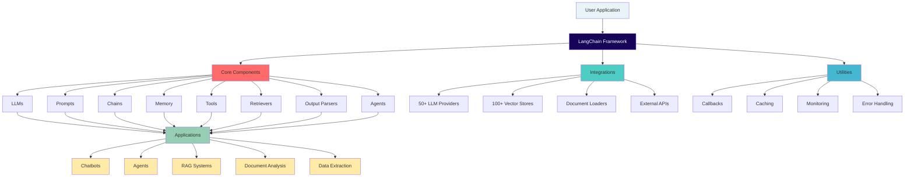

### Component Relationship Map

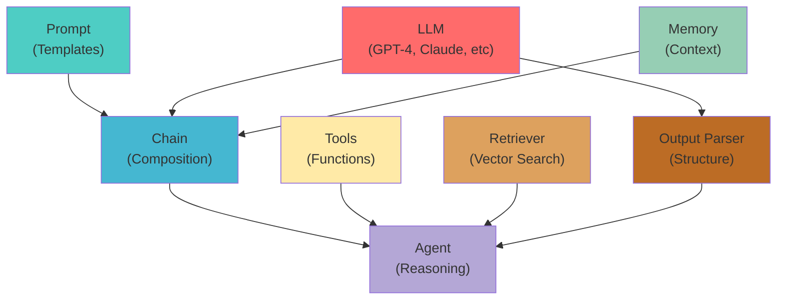

---

## Component Interactions

### Simple Chat Flow

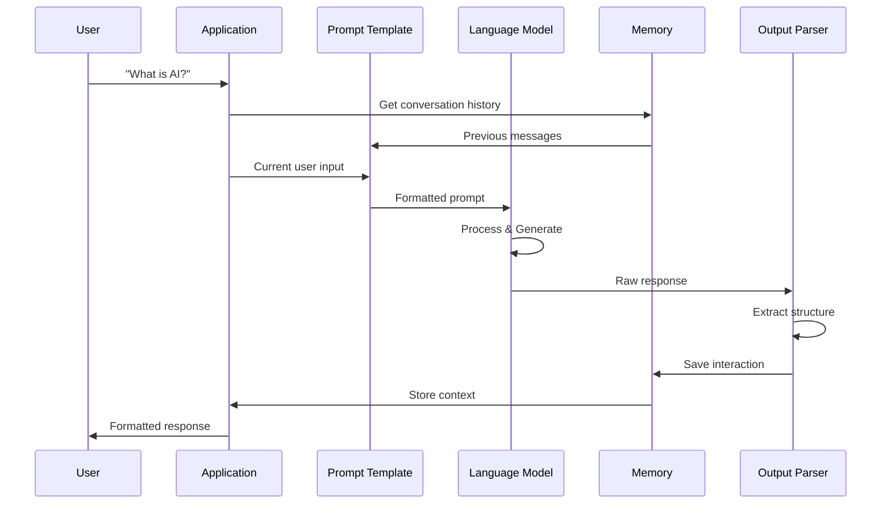

### Agent with Tools Flow

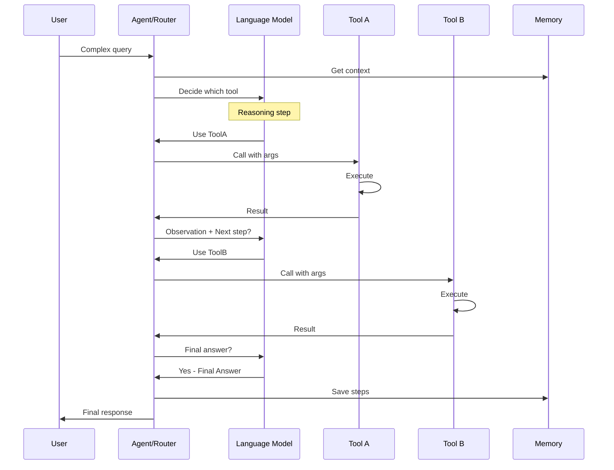

### RAG Pipeline Flow

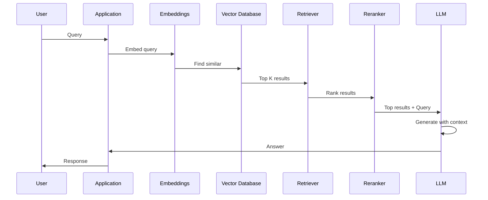

---

## Data Flow Diagrams

### Complete LLM Application Data Flow

```mermaid
graph LR
    INPUT["📥 User Input"] --> PREPROCESS["🔄 Preprocess"]
    PREPROCESS --> CONTEXT["💾 Retrieve Context"]
    CONTEXT --> PROMPT["✍️ Format Prompt"]
    PROMPT --> LLM["🧠 LLM Processing"]
    LLM --> POSTPROCESS["🔄 Post-process"]
    POSTPROCESS --> PARSE["📊 Parse Output"]
    PARSE --> MEMORY["💾 Update Memory"]
    MEMORY --> OUTPUT["📤 User Output"]

    style INPUT fill:#E8F4F8
    style PREPROCESS fill:#C8E6C9
    style CONTEXT fill:#FFE0B2
    style PROMPT fill:#B3E5FC
    style LLM fill:#FF6B6B
    style POSTPROCESS fill:#C8E6C9
    style PARSE fill:#E1BEE7
    style MEMORY fill:#FFE0B2
    style OUTPUT fill:#E8F4F8
```

### Token Flow and Cost

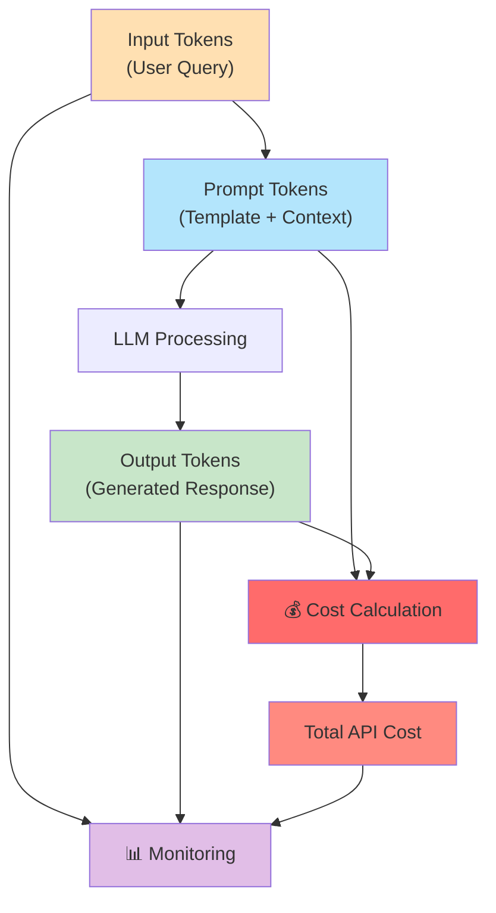

---

## Chain Types

### Chain Type Comparison

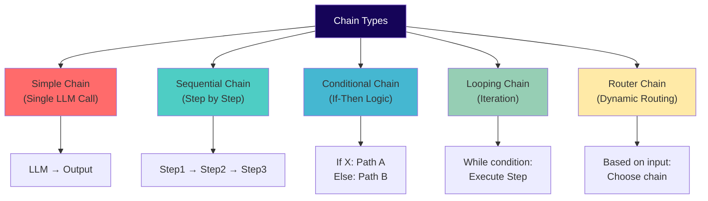

### LCEL Chain Pipeline

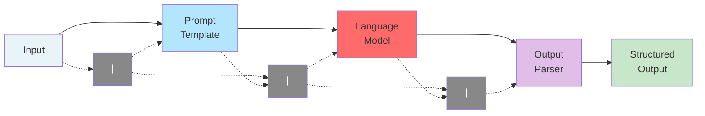

---

## Agent Patterns

### ReAct Agent Loop

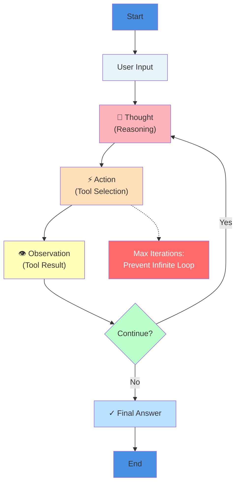

### Multi-Agent Collaboration

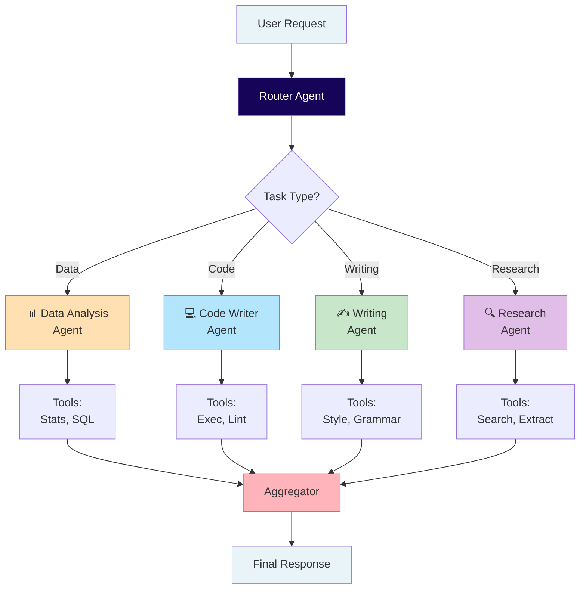

---

## Memory Types

### Memory Type Comparison Matrix

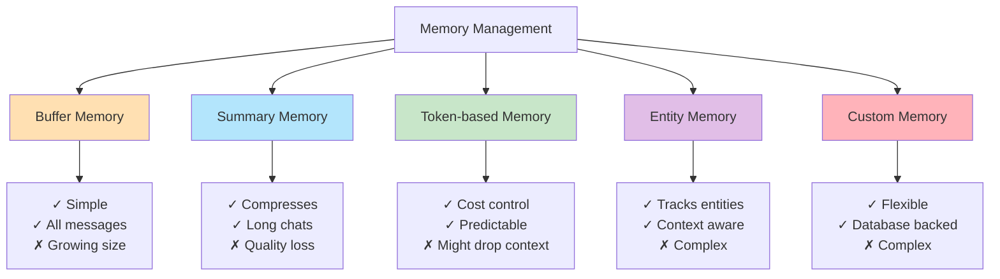

### Conversation Memory Over Time

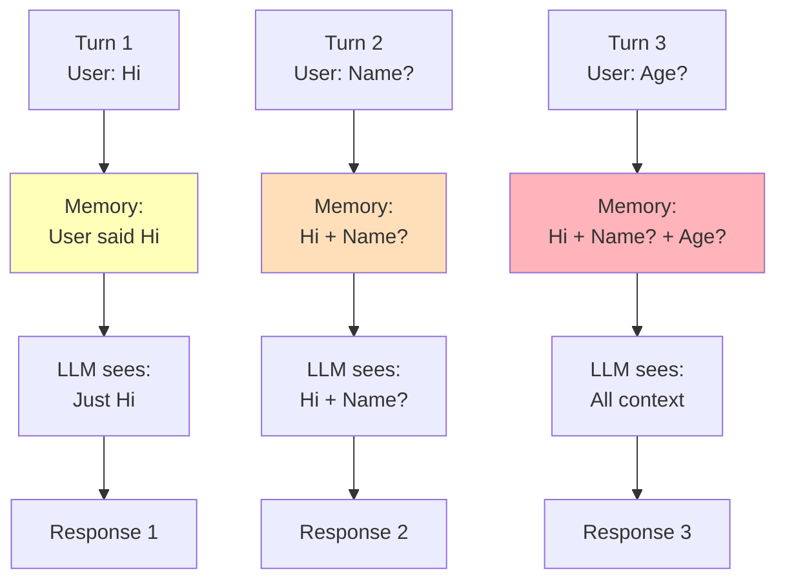

---

## RAG Architecture

### Complete RAG System

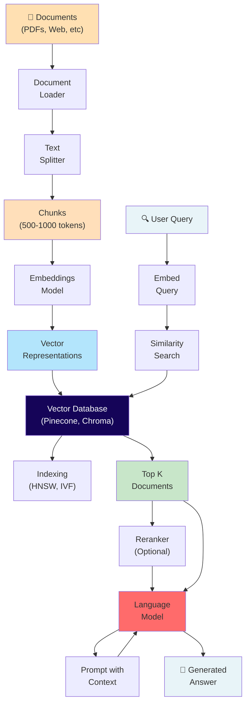

### Retrieval Strategies

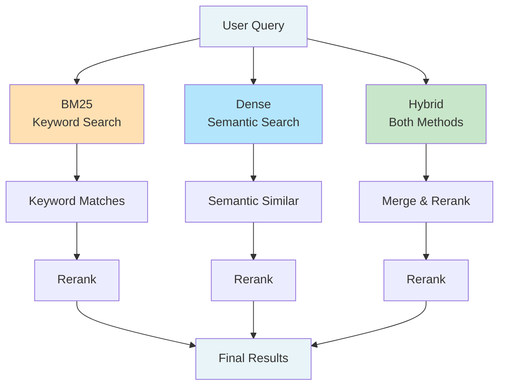

---

## Tool Integration

### Tool Execution Flow

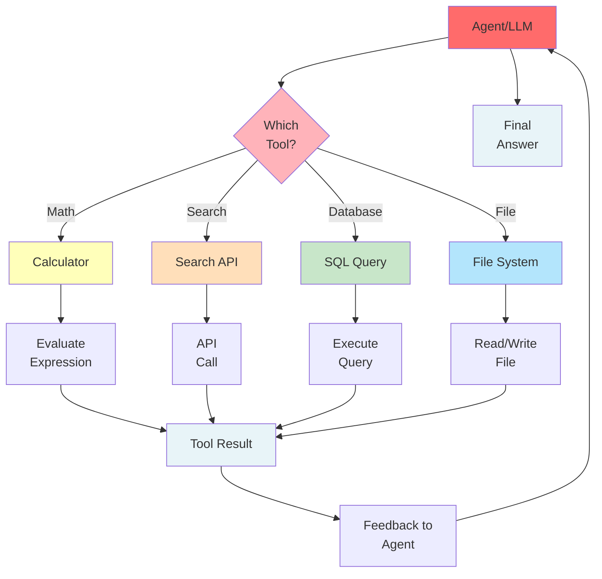

### Tool Types

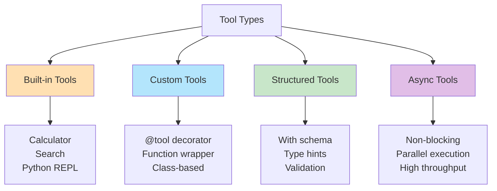

---

## System Design Patterns

### MVC Pattern in LangChain Apps

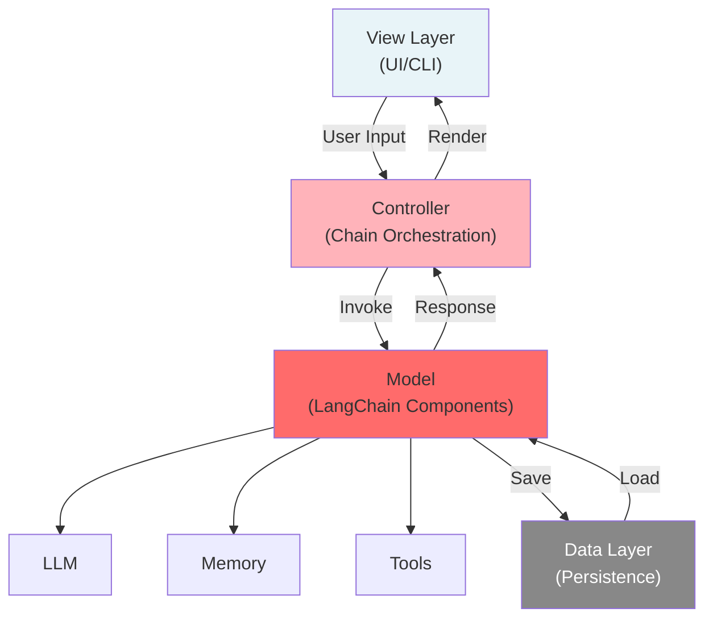

### Layered Architecture

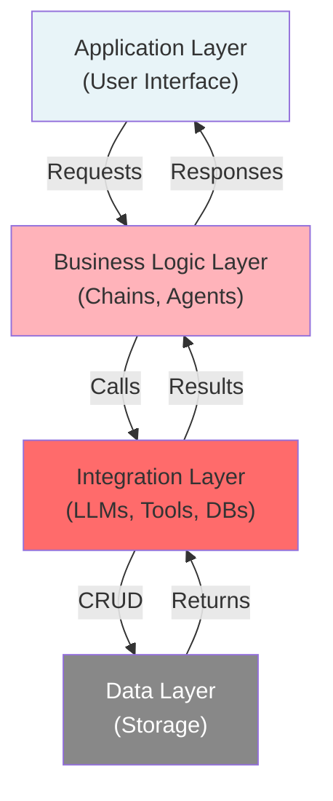

---

## Feature Comparison

### LangChain vs Alternatives

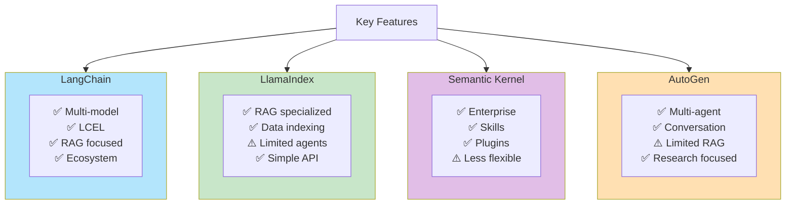

### LLM Model Comparison

```mermaid
graph TB
    MODELS["Language Models"]

    subgraph FAST["Fast & Cheap"]
        FAST1["GPT-3.5-turbo<br/>Mistral<br/>Local LLMs"]
    end

    subgraph BALANCED["Balanced"]
        BALANCED1["GPT-4<br/>Claude 3 Sonnet<br/>Gemini 1.5"]
    end

    subgraph POWERFUL["Powerful"]
        POWERFUL1["GPT-4 Turbo<br/>Claude 3 Opus<br/>Specialized Models"]
    end

    MODELS --> FAST
    MODELS --> BALANCED
    MODELS --> POWERFUL

    FAST --> FAST_COST["💰 Low Cost<br/>⚡ Fast<br/>⚠️ Limited"]
    BALANCED --> BALANCED_COST["💵 Medium Cost<br/>⏱️ Medium Speed<br/>✅ Versatile"]
    POWERFUL --> POWERFUL_COST["💸 High Cost<br/>🐢 Slow<br/>🚀 Capable"]

    style FAST fill:#FFFFBA
    style BALANCED fill:#FFDFBA
    style POWERFUL fill:#FFB3BA
```

---

## Learning Path

### LangChain Learning Progression

```mermaid
graph TD
    START["Start: LLM Basics"]

    WEEK1["Week 1-2<br/>Fundamentals"]
    START --> WEEK1
    WEEK1 --> W1_1["Concepts"]
    WEEK1 --> W1_2["Simple Chains"]
    WEEK1 --> W1_3["Prompts"]

    WEEK2["Week 3-4<br/>Intermediate"]
    W1_1 --> WEEK2
    W1_2 --> WEEK2
    W1_3 --> WEEK2
    WEEK2 --> W2_1["Memory"]
    WEEK2 --> W2_2["Output Parsing"]
    WEEK2 --> W2_3["RAG Basics"]

    WEEK3["Week 5-6<br/>Advanced"]
    W2_1 --> WEEK3
    W2_2 --> WEEK3
    W2_3 --> WEEK3
    WEEK3 --> W3_1["Agents"]
    WEEK3 --> W3_2["Tools"]
    WEEK3 --> W3_3["Custom Components"]

    WEEK4["Week 7-8<br/>Expert"]
    W3_1 --> WEEK4
    W3_2 --> WEEK4
    W3_3 --> WEEK4
    WEEK4 --> W4_1["Monitoring"]
    WEEK4 --> W4_2["Scaling"]
    WEEK4 --> W4_3["Production Deployment"]

    EXPERT["Production Expert"]
    W4_1 --> EXPERT
    W4_2 --> EXPERT
    W4_3 --> EXPERT

    style START fill:#4A90E2
    style WEEK1 fill:#FFE0B2
    style WEEK2 fill:#FFDFBA
    style WEEK3 fill:#FFB3BA
    style WEEK4 fill:#FF6B6B
    style EXPERT fill:#150458,color:#fff
```

### Skill Development Tree

```mermaid
graph TD
    FOUNDATION["Foundation<br/>(Python, APIs)"]

    FOUNDATION --> CONCEPT["Core Concepts<br/>(LLMs, Chains)"]

    CONCEPT --> CHAIN_PATH["Chain Path"]
    CONCEPT --> AGENT_PATH["Agent Path"]
    CONCEPT --> RAG_PATH["RAG Path"]

    CHAIN_PATH --> CHAIN_ADV["Advanced Chains<br/>(Sequential, Conditional)"]
    AGENT_PATH --> AGENT_ADV["Advanced Agents<br/>(Multi-agent, Reasoning)"]
    RAG_PATH --> RAG_ADV["Advanced RAG<br/>(Hybrid, Reranking)"]

    CHAIN_ADV --> PRODUCTION["Production Ready"]
    AGENT_ADV --> PRODUCTION
    RAG_ADV --> PRODUCTION

    PRODUCTION --> MASTER["Master Level<br/>(Architect, Optimize, Deploy)"]

    style FOUNDATION fill:#E8F4F8
    style CONCEPT fill:#B3E5FC
    style CHAIN_PATH fill:#C8E6C9
    style AGENT_PATH fill:#E1BEE7
    style RAG_PATH fill:#FFE0B2
    style PRODUCTION fill:#FFB3BA
    style MASTER fill:#150458,color:#fff
```

---

## Performance Characteristics

### Latency vs Quality Trade-off

```mermaid
graph TD
    X["Model Complexity →"]
    Y["← Quality & Accuracy"]

    FAST["Fast Models<br/>GPT-3.5<br/>⚡ 0.5s<br/>📊 Good"]
    MEDIUM["Medium Models<br/>GPT-4<br/>⏱️ 2-5s<br/>📊 Great"]
    SLOW["Slow Models<br/>Claude 3 Opus<br/>🐢 5-10s<br/>📊 Excellent"]

    FAST -->|Increase| MEDIUM
    MEDIUM -->|Increase| SLOW

    style FAST fill:#FFFFBA
    style MEDIUM fill:#FFDFBA
    style SLOW fill:#FFB3BA
```

### Scalability Matrix

```mermaid
graph TB
    SCALE["Scalability Dimensions"]

    CONCURRENCY["Concurrency"]
    CONCURRENCY_LOW["Serial: 1 request"]
    CONCURRENCY_MED["Async: 10-100"]
    CONCURRENCY_HIGH["Distributed: 1000+"]

    THROUGHPUT["Throughput"]
    THROUGHPUT_LOW["Low: < 10 req/s"]
    THROUGHPUT_MED["Medium: 10-100 req/s"]
    THROUGHPUT_HIGH["High: > 100 req/s"]

    LATENCY["Latency"]
    LATENCY_LOW["Low: < 100ms"]
    LATENCY_MED["Medium: 100ms-1s"]
    LATENCY_HIGH["High: > 1s"]

    SCALE --> CONCURRENCY
    SCALE --> THROUGHPUT
    SCALE --> LATENCY

    CONCURRENCY --> CONCURRENCY_LOW
    CONCURRENCY --> CONCURRENCY_MED
    CONCURRENCY --> CONCURRENCY_HIGH

    THROUGHPUT --> THROUGHPUT_LOW
    THROUGHPUT --> THROUGHPUT_MED
    THROUGHPUT --> THROUGHPUT_HIGH

    LATENCY --> LATENCY_LOW
    LATENCY --> LATENCY_MED
    LATENCY --> LATENCY_HIGH

    style CONCURRENCY_HIGH fill:#4A90E2
    style THROUGHPUT_HIGH fill:#4A90E2
    style LATENCY_LOW fill:#4A90E2
```

### Cost Optimization Strategies

```mermaid
graph TD
    COST["Cost Optimization"]

    MODEL_CHOICE["Model Selection"]
    MODEL_CHOICE --> MC1["Use cheaper models<br/>for simple tasks"]

    CACHING["Caching"]
    CACHING --> CC1["Cache repeated<br/>queries"]

    BATCHING["Batching"]
    BATCHING --> BC1["Process multiple<br/>requests together"]

    PRUNING["Prompt Pruning"]
    PRUNING --> PC1["Remove unnecessary<br/>context"]

    MONITORING["Monitoring"]
    MONITORING --> MC2["Track token usage<br/>& costs"]

    COST --> MODEL_CHOICE
    COST --> CACHING
    COST --> BATCHING
    COST --> PRUNING
    COST --> MONITORING

    MC1 -->|Savings| TOTAL["30-50%<br/>Cost Reduction"]
    CC1 --> TOTAL
    BC1 --> TOTAL
    PC1 --> TOTAL
    MC2 --> TOTAL

    style TOTAL fill:#4A90E2,color:#fff
```

---

## Summary

This comprehensive visual guide covers all aspects of LangChain architecture, from basic components to advanced patterns. Use these diagrams as reference while learning and building LangChain applications.

**Key Takeaways:**
- LangChain provides a unified interface for multiple LLM providers
- LCEL makes chain composition intuitive and Pythonic
- Memory and agents enable complex, multi-step reasoning
- RAG combines retrieval with generation for contextual responses
- Proper architecture ensures scalability and maintainability
    participant B as LangChain
    participant C as Backend

    A->>B: Request
    B->>C: Process
    C-->>B: Response
    B-->>A: Result
```
