# LangGraph: Visual Guide & Architecture Diagrams

## Table of Contents
1. [Core Architecture](#core-architecture)
2. [Simple Agent Flow](#simple-agent-flow)
3. [Conditional Branching Patterns](#conditional-branching-patterns)
4. [Multi-Agent Supervisor Pattern](#multi-agent-supervisor-pattern)
5. [Human-in-the-Loop Interrupt Flow](#human-in-the-loop-interrupt-flow)
6. [Checkpointing & State Persistence](#checkpointing--state-persistence)
7. [ReAct Agent Pattern](#react-agent-pattern)
8. [Plan-and-Execute Pattern](#plan-and-execute-pattern)
9. [LangGraph vs Alternatives Comparison](#langgraph-vs-alternatives-comparison)
10. [Learning Path](#learning-path)

---

## Core Architecture

### LangGraph Overall Architecture

```mermaid
graph TD
    A["User Application"] --> B["LangGraph Framework"]

    B --> C["Graph Engine"]
    C --> C1["StateGraph"]
    C --> C2["Nodes (Functions)"]
    C --> C3["Edges (Transitions)"]
    C --> C4["Conditional Edges"]
    C --> C5["START / END"]

    B --> D["State Management"]
    D --> D1["TypedDict State"]
    D --> D2["MessagesState"]
    D --> D3["Reducers (add, add_messages)"]
    D --> D4["Pydantic Validation"]

    B --> E["Persistence Layer"]
    E --> E1["Checkpointer"]
    E --> E2["SQLite / Postgres"]
    E --> E3["Memory Store (Long-term)"]
    E --> E4["Thread Management"]

    B --> F["Execution Features"]
    F --> F1["Streaming (tokens/nodes)"]
    F --> F2["Human-in-the-Loop"]
    F --> F3["interrupt() / Command"]
    F --> F4["Time Travel"]

    B --> G["Multi-Agent"]
    G --> G1["Supervisor Pattern"]
    G --> G2["Hierarchical (Subgraphs)"]
    G --> G3["Swarm Pattern"]
    G --> G4["Map-Reduce (Send)"]

    B --> H["Deployment"]
    H --> H1["LangGraph Platform"]
    H --> H2["LangSmith Tracing"]
    H --> H3["REST API"]
    H --> H4["Cron / Webhooks"]

    style A fill:#E8F4F8
    style B fill:#1A1A2E,color:#fff
    style C fill:#FF6B6B
    style D fill:#4ECDC4
    style E fill:#45B7D1
    style F fill:#FFEAA7
    style G fill:#96CEB4
    style H fill:#DDA15E
```

### Component Relationship Map

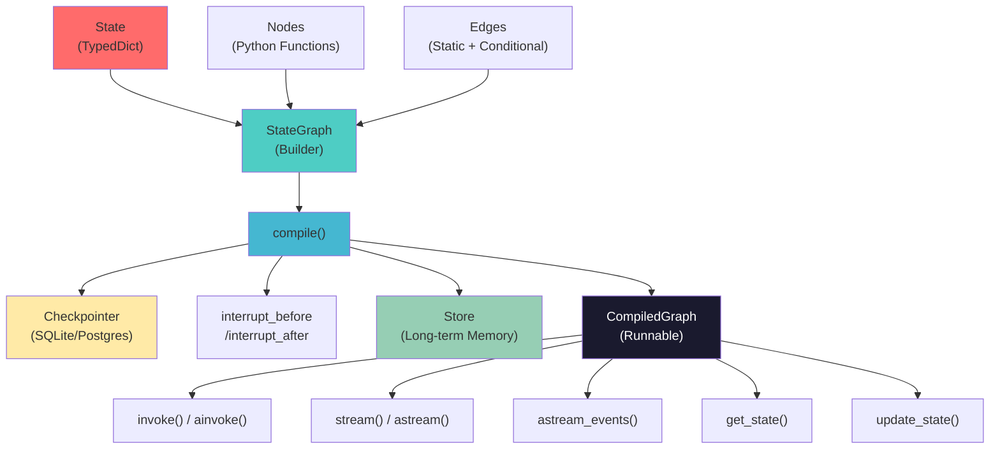
```mermaid
graph TB
    STATE["State<br/>(TypedDict)"] --> GRAPH["StateGraph<br/>(Builder)"]
    NODES["Nodes<br/>(Python Functions)"] --> GRAPH
    EDGES["Edges<br/>(Static + Conditional)"] --> GRAPH

    GRAPH --> COMPILE["compile()"]

    COMPILE --> CHECKPOINT["Checkpointer<br/>(SQLite/Postgres)"]
    COMPILE --> INTERRUPT["interrupt_before<br/>/interrupt_after"]
    COMPILE --> STORE["Store<br/>(Long-term Memory)"]

    COMPILE --> APP["CompiledGraph<br/>(Runnable)"]

    APP --> INVOKE["invoke() / ainvoke()"]
    APP --> STREAM["stream() / astream()"]
    APP --> EVENTS["astream_events()"]
    APP --> GET_STATE["get_state()"]
    APP --> UPDATE["update_state()"]

    style STATE fill:#FF6B6B
    style GRAPH fill:#4ECDC4
    style COMPILE fill:#45B7D1
    style APP fill:#1A1A2E,color:#fff
    style CHECKPOINT fill:#FFEAA7
    style STORE fill:#96CEB4
```

---

## Simple Agent Flow

### Basic Tool-Calling Agent

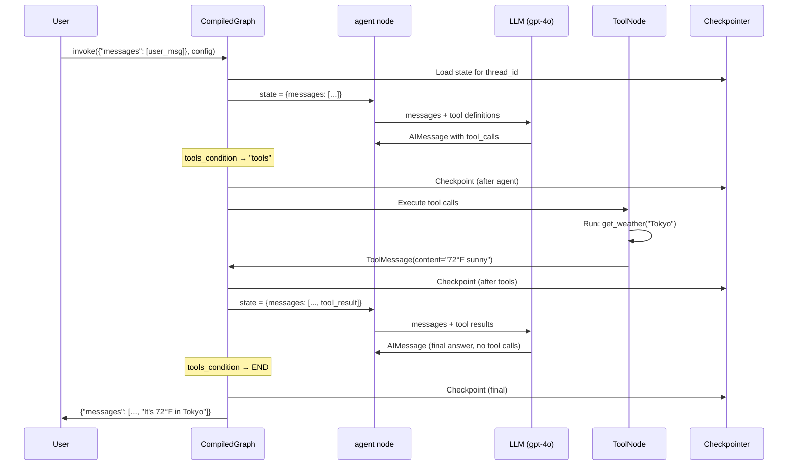
```mermaid
sequenceDiagram
    participant User
    participant App as CompiledGraph
    participant Agent as agent node
    participant LLM as LLM (gpt-4o)
    participant Tools as ToolNode
    participant CP as Checkpointer

    User ->> App: invoke({"messages": [user_msg]}, config)
    App ->> CP: Load state for thread_id

    App ->> Agent: state = {messages: [...]}
    Agent ->> LLM: messages + tool definitions
    LLM ->> Agent: AIMessage with tool_calls

    Note over App: tools_condition → "tools"
    App ->> CP: Checkpoint (after agent)

    App ->> Tools: Execute tool calls
    Tools ->> Tools: Run: get_weather("Tokyo")
    Tools ->> App: ToolMessage(content="72°F sunny")
    App ->> CP: Checkpoint (after tools)

    App ->> Agent: state = {messages: [..., tool_result]}
    Agent ->> LLM: messages + tool results
    LLM ->> Agent: AIMessage (final answer, no tool calls)

    Note over App: tools_condition → END
    App ->> CP: Checkpoint (final)

    App ->> User: {"messages": [..., "It's 72°F in Tokyo"]}
```

### Agent Graph Structure

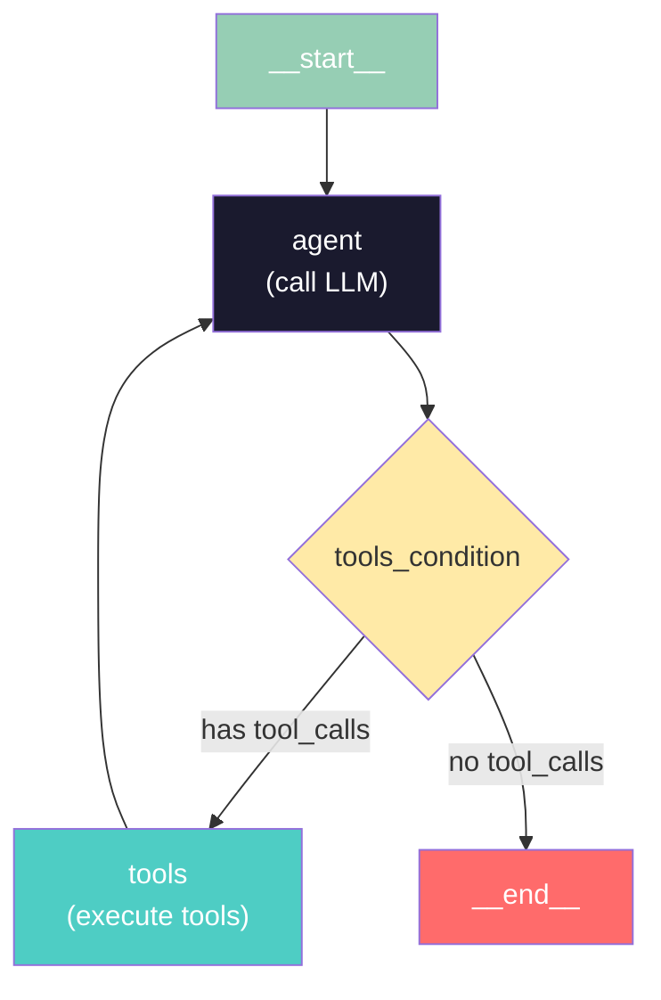
```mermaid
graph TD
    START["__start__"] --> AGENT["agent<br/>(call LLM)"]

    AGENT --> DECIDE{"tools_condition"}

    DECIDE -->|"has tool_calls"| TOOLS["tools<br/>(execute tools)"]
    DECIDE -->|"no tool_calls"| END_NODE["__end__"]

    TOOLS --> AGENT

    style START fill:#96CEB4,color:#fff
    style AGENT fill:#1A1A2E,color:#fff
    style DECIDE fill:#FFEAA7
    style TOOLS fill:#4ECDC4,color:#fff
    style END_NODE fill:#FF6B6B,color:#fff
```

---

## Conditional Branching Patterns

### Pattern 1: Simple Route

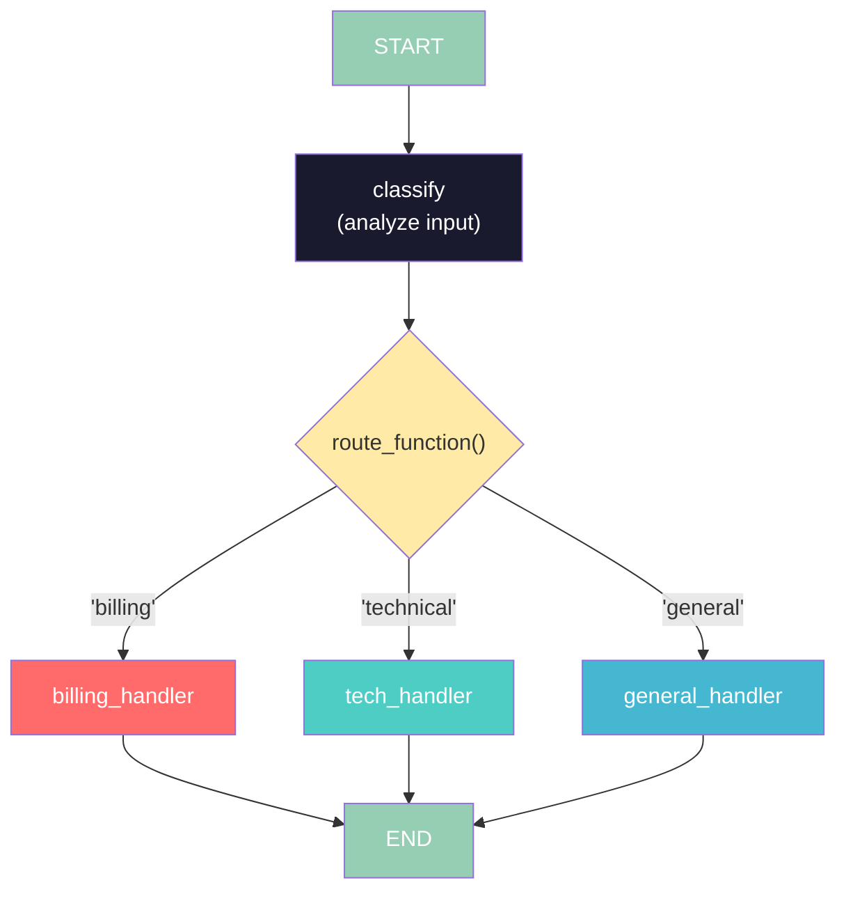
```mermaid
graph TD
    START["START"] --> CLASSIFY["classify<br/>(analyze input)"]

    CLASSIFY --> ROUTE{"route_function()"}

    ROUTE -->|"'billing'"| BILLING["billing_handler"]
    ROUTE -->|"'technical'"| TECH["tech_handler"]
    ROUTE -->|"'general'"| GENERAL["general_handler"]

    BILLING --> END_NODE["END"]
    TECH --> END_NODE
    GENERAL --> END_NODE

    style START fill:#96CEB4,color:#fff
    style CLASSIFY fill:#1A1A2E,color:#fff
    style ROUTE fill:#FFEAA7
    style BILLING fill:#FF6B6B,color:#fff
    style TECH fill:#4ECDC4,color:#fff
    style GENERAL fill:#45B7D1,color:#fff
    style END_NODE fill:#96CEB4,color:#fff
```

### Pattern 2: Loop with Exit Condition

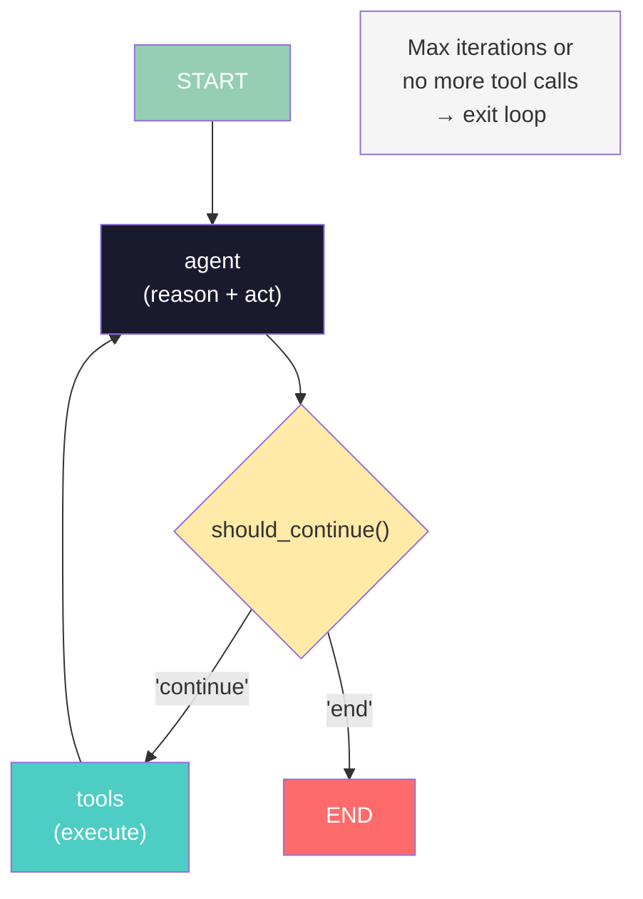
```mermaid
graph TD
    START["START"] --> AGENT["agent<br/>(reason + act)"]

    AGENT --> CHECK{"should_continue()"}

    CHECK -->|"'continue'"| TOOLS["tools<br/>(execute)"]
    CHECK -->|"'end'"| END_NODE["END"]

    TOOLS --> AGENT

    NOTE["Max iterations or<br/>no more tool calls<br/>→ exit loop"]

    style START fill:#96CEB4,color:#fff
    style AGENT fill:#1A1A2E,color:#fff
    style CHECK fill:#FFEAA7
    style TOOLS fill:#4ECDC4,color:#fff
    style END_NODE fill:#FF6B6B,color:#fff
    style NOTE fill:#f5f5f5
```

### Pattern 3: Multi-Path with Convergence

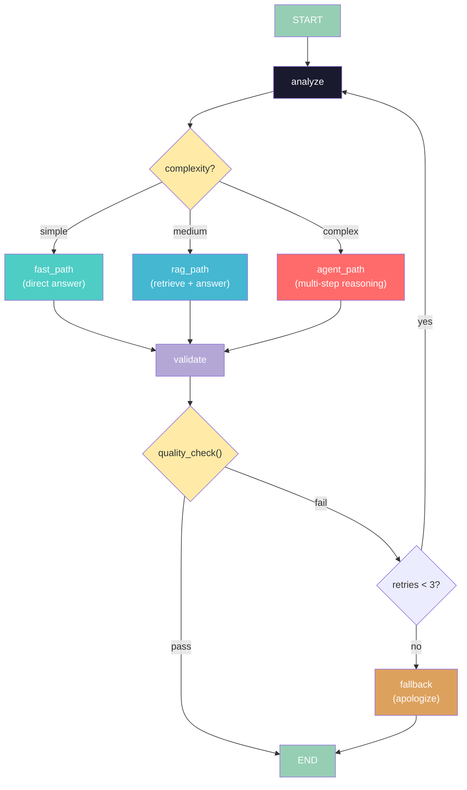
```mermaid
graph TD
    START["START"] --> ANALYZE["analyze"]

    ANALYZE --> ROUTE{"complexity?"}

    ROUTE -->|"simple"| FAST["fast_path<br/>(direct answer)"]
    ROUTE -->|"medium"| RAG["rag_path<br/>(retrieve + answer)"]
    ROUTE -->|"complex"| AGENT["agent_path<br/>(multi-step reasoning)"]

    FAST --> VALIDATE["validate"]
    RAG --> VALIDATE
    AGENT --> VALIDATE

    VALIDATE --> QUALITY{"quality_check()"}

    QUALITY -->|"pass"| END_NODE["END"]
    QUALITY -->|"fail"| RETRY{"retries < 3?"}

    RETRY -->|"yes"| ANALYZE
    RETRY -->|"no"| FALLBACK["fallback<br/>(apologize)"]
    FALLBACK --> END_NODE

    style START fill:#96CEB4,color:#fff
    style ANALYZE fill:#1A1A2E,color:#fff
    style ROUTE fill:#FFEAA7
    style FAST fill:#4ECDC4,color:#fff
    style RAG fill:#45B7D1,color:#fff
    style AGENT fill:#FF6B6B,color:#fff
    style VALIDATE fill:#B4A7D6,color:#fff
    style QUALITY fill:#FFEAA7
    style FALLBACK fill:#DDA15E,color:#fff
    style END_NODE fill:#96CEB4,color:#fff
```

### Pattern 4: Parallel Fan-Out (Map-Reduce)

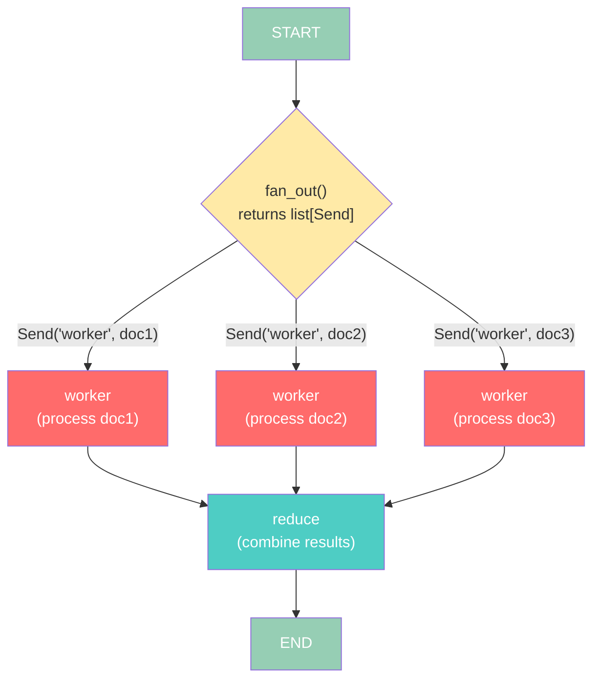
```mermaid
graph TD
    START["START"] --> FAN{"fan_out()<br/>returns list[Send]"}

    FAN -->|"Send('worker', doc1)"| W1["worker<br/>(process doc1)"]
    FAN -->|"Send('worker', doc2)"| W2["worker<br/>(process doc2)"]
    FAN -->|"Send('worker', doc3)"| W3["worker<br/>(process doc3)"]

    W1 --> REDUCE["reduce<br/>(combine results)"]
    W2 --> REDUCE
    W3 --> REDUCE

    REDUCE --> END_NODE["END"]

    style START fill:#96CEB4,color:#fff
    style FAN fill:#FFEAA7
    style W1 fill:#FF6B6B,color:#fff
    style W2 fill:#FF6B6B,color:#fff
    style W3 fill:#FF6B6B,color:#fff
    style REDUCE fill:#4ECDC4,color:#fff
    style END_NODE fill:#96CEB4,color:#fff
```

---

## Multi-Agent Supervisor Pattern

### Supervisor Architecture

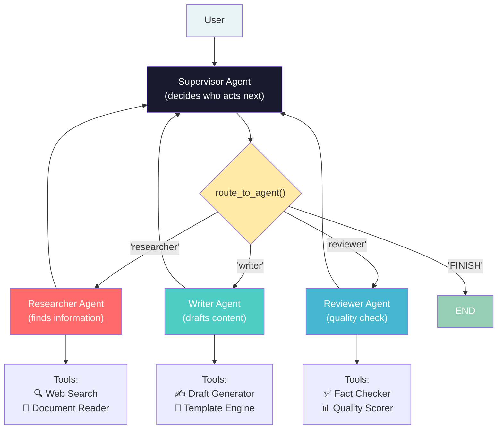
```mermaid
graph TD
    USER["User"] --> SUPERVISOR["Supervisor Agent<br/>(decides who acts next)"]

    SUPERVISOR --> ROUTE{"route_to_agent()"}

    ROUTE -->|"'researcher'"| RESEARCHER["Researcher Agent<br/>(finds information)"]
    ROUTE -->|"'writer'"| WRITER["Writer Agent<br/>(drafts content)"]
    ROUTE -->|"'reviewer'"| REVIEWER["Reviewer Agent<br/>(quality check)"]
    ROUTE -->|"'FINISH'"| END_NODE["END"]

    RESEARCHER --> SUPERVISOR
    WRITER --> SUPERVISOR
    REVIEWER --> SUPERVISOR

    RESEARCHER --> RT["Tools:<br/>🔍 Web Search<br/>📄 Document Reader"]
    WRITER --> WT["Tools:<br/>✍️ Draft Generator<br/>📝 Template Engine"]
    REVIEWER --> RVT["Tools:<br/>✅ Fact Checker<br/>📊 Quality Scorer"]

    style USER fill:#E8F4F8
    style SUPERVISOR fill:#1A1A2E,color:#fff
    style ROUTE fill:#FFEAA7
    style RESEARCHER fill:#FF6B6B,color:#fff
    style WRITER fill:#4ECDC4,color:#fff
    style REVIEWER fill:#45B7D1,color:#fff
    style END_NODE fill:#96CEB4,color:#fff
```

### Supervisor Execution Flow

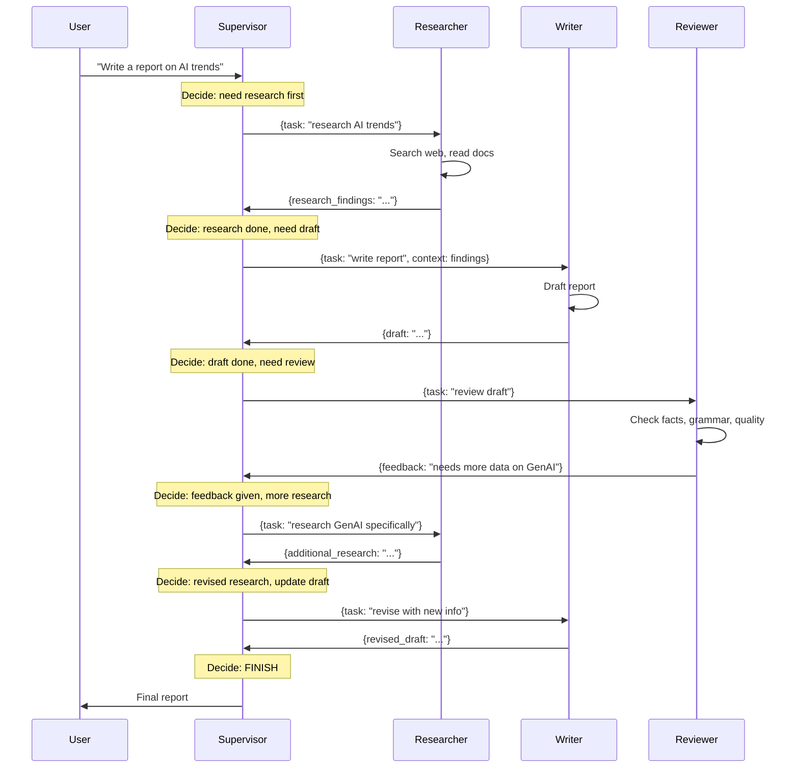
```mermaid
sequenceDiagram
    participant User
    participant Sup as Supervisor
    participant Res as Researcher
    participant Wri as Writer
    participant Rev as Reviewer

    User ->> Sup: "Write a report on AI trends"

    Note over Sup: Decide: need research first
    Sup ->> Res: {task: "research AI trends"}
    Res ->> Res: Search web, read docs
    Res ->> Sup: {research_findings: "..."}

    Note over Sup: Decide: research done, need draft
    Sup ->> Wri: {task: "write report", context: findings}
    Wri ->> Wri: Draft report
    Wri ->> Sup: {draft: "..."}

    Note over Sup: Decide: draft done, need review
    Sup ->> Rev: {task: "review draft"}
    Rev ->> Rev: Check facts, grammar, quality
    Rev ->> Sup: {feedback: "needs more data on GenAI"}

    Note over Sup: Decide: feedback given, more research
    Sup ->> Res: {task: "research GenAI specifically"}
    Res ->> Sup: {additional_research: "..."}

    Note over Sup: Decide: revised research, update draft
    Sup ->> Wri: {task: "revise with new info"}
    Wri ->> Sup: {revised_draft: "..."}

    Note over Sup: Decide: FINISH
    Sup ->> User: Final report
```

### Hierarchical Multi-Agent (Subgraphs)

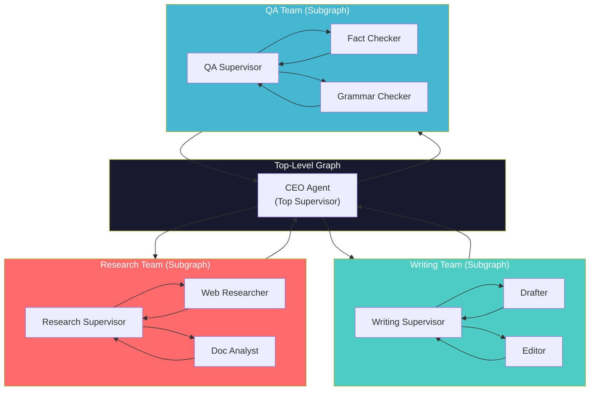
```mermaid
graph TD
    subgraph TOP["Top-Level Graph"]
        BOSS["CEO Agent<br/>(Top Supervisor)"]
    end

    subgraph RESEARCH["Research Team (Subgraph)"]
        RS["Research Supervisor"]
        WR["Web Researcher"]
        DA["Doc Analyst"]
        RS --> WR
        RS --> DA
        WR --> RS
        DA --> RS
    end

    subgraph WRITING["Writing Team (Subgraph)"]
        WS["Writing Supervisor"]
        DR["Drafter"]
        ED["Editor"]
        WS --> DR
        WS --> ED
        DR --> WS
        ED --> WS
    end

    subgraph QA["QA Team (Subgraph)"]
        QS["QA Supervisor"]
        FC["Fact Checker"]
        GC["Grammar Checker"]
        QS --> FC
        QS --> GC
        FC --> QS
        GC --> QS
    end

    BOSS --> RESEARCH
    BOSS --> WRITING
    BOSS --> QA
    RESEARCH --> BOSS
    WRITING --> BOSS
    QA --> BOSS

    style TOP fill:#1A1A2E,color:#fff
    style RESEARCH fill:#FF6B6B,color:#fff
    style WRITING fill:#4ECDC4,color:#fff
    style QA fill:#45B7D1,color:#fff
```

---

## Human-in-the-Loop Interrupt Flow

### Interrupt Before Pattern

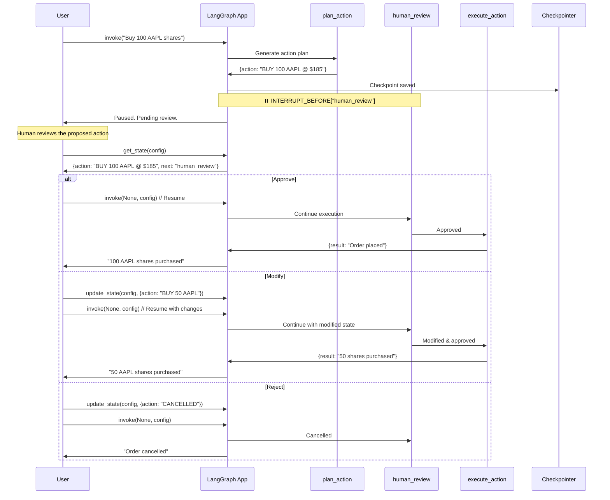
```mermaid
sequenceDiagram
    participant User
    participant App as LangGraph App
    participant Plan as plan_action
    participant Review as human_review
    participant Exec as execute_action
    participant CP as Checkpointer

    User ->> App: invoke("Buy 100 AAPL shares")

    App ->> Plan: Generate action plan
    Plan ->> App: {action: "BUY 100 AAPL @ $185"}
    App ->> CP: Checkpoint saved

    Note over App,Review: ⏸️ INTERRUPT_BEFORE["human_review"]
    App ->> User: Paused. Pending review.

    Note over User: Human reviews the proposed action
    User ->> App: get_state(config)
    App ->> User: {action: "BUY 100 AAPL @ $185", next: "human_review"}

    alt Approve
        User ->> App: invoke(None, config)  // Resume
        App ->> Review: Continue execution
        Review ->> Exec: Approved
        Exec ->> App: {result: "Order placed"}
        App ->> User: "100 AAPL shares purchased"
    else Modify
        User ->> App: update_state(config, {action: "BUY 50 AAPL"})
        User ->> App: invoke(None, config)  // Resume with changes
        App ->> Review: Continue with modified state
        Review ->> Exec: Modified & approved
        Exec ->> App: {result: "50 shares purchased"}
        App ->> User: "50 AAPL shares purchased"
    else Reject
        User ->> App: update_state(config, {action: "CANCELLED"})
        User ->> App: invoke(None, config)
        App ->> Review: Cancelled
        App ->> User: "Order cancelled"
    end
```

### Interrupt() Inside Node

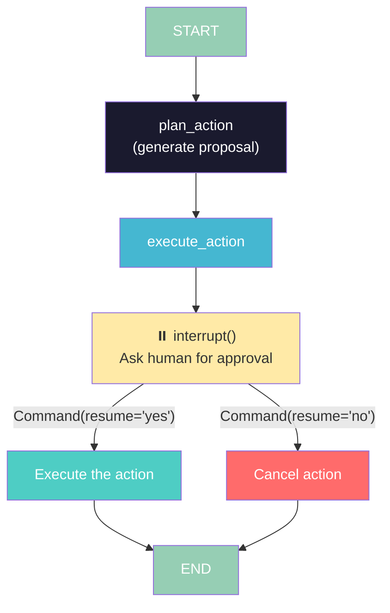
```mermaid
graph TD
    START["START"] --> PLAN["plan_action<br/>(generate proposal)"]

    PLAN --> EXECUTE["execute_action"]

    EXECUTE --> INT["⏸️ interrupt()<br/>Ask human for approval"]

    INT -->|"Command(resume='yes')"| DO["Execute the action"]
    INT -->|"Command(resume='no')"| CANCEL["Cancel action"]

    DO --> END_NODE["END"]
    CANCEL --> END_NODE

    style START fill:#96CEB4,color:#fff
    style PLAN fill:#1A1A2E,color:#fff
    style EXECUTE fill:#45B7D1,color:#fff
    style INT fill:#FFEAA7
    style DO fill:#4ECDC4,color:#fff
    style CANCEL fill:#FF6B6B,color:#fff
    style END_NODE fill:#96CEB4,color:#fff
```

### Multi-Stage Approval Pipeline

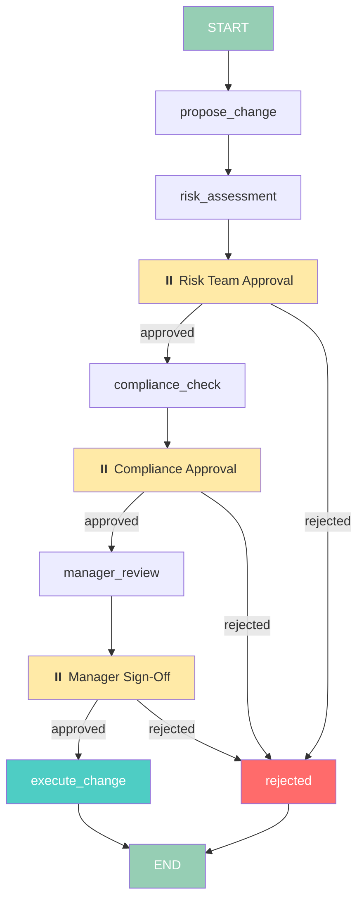
```mermaid
graph TD
    START["START"] --> PROPOSE["propose_change"]

    PROPOSE --> RISK["risk_assessment"]
    RISK --> INT1["⏸️ Risk Team Approval"]

    INT1 -->|"approved"| COMPLIANCE["compliance_check"]
    INT1 -->|"rejected"| REJECTED["rejected"]

    COMPLIANCE --> INT2["⏸️ Compliance Approval"]

    INT2 -->|"approved"| MANAGER["manager_review"]
    INT2 -->|"rejected"| REJECTED

    MANAGER --> INT3["⏸️ Manager Sign-Off"]

    INT3 -->|"approved"| EXECUTE["execute_change"]
    INT3 -->|"rejected"| REJECTED

    EXECUTE --> END_NODE["END"]
    REJECTED --> END_NODE

    style START fill:#96CEB4,color:#fff
    style INT1 fill:#FFEAA7
    style INT2 fill:#FFEAA7
    style INT3 fill:#FFEAA7
    style EXECUTE fill:#4ECDC4,color:#fff
    style REJECTED fill:#FF6B6B,color:#fff
    style END_NODE fill:#96CEB4,color:#fff
```

---

## Checkpointing & State Persistence

### How Checkpoints Work

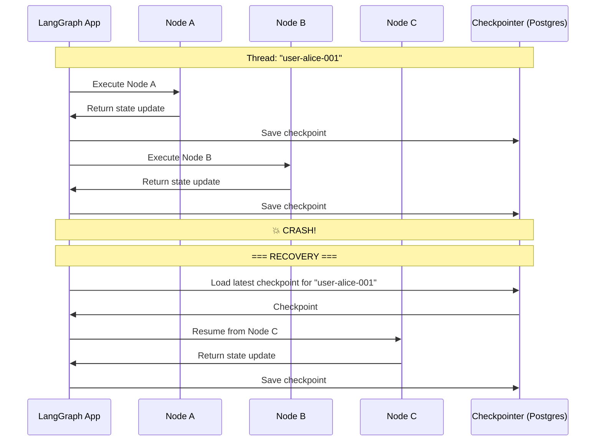
```mermaid
sequenceDiagram
    participant App as LangGraph App
    participant N1 as Node A
    participant N2 as Node B
    participant N3 as Node C
    participant CP as Checkpointer (Postgres)

    Note over App,CP: Thread: "user-alice-001"

    App ->> N1: Execute Node A
    N1 ->> App: Return state update
    App ->> CP: Save checkpoint #1<br/>{messages: [...], step: "A done"}

    App ->> N2: Execute Node B
    N2 ->> App: Return state update
    App ->> CP: Save checkpoint #2<br/>{messages: [...], step: "B done"}

    Note over App,CP: 💥 CRASH!

    Note over App,CP: === RECOVERY ===

    App ->> CP: Load latest checkpoint for "user-alice-001"
    CP ->> App: Checkpoint #2<br/>{messages: [...], step: "B done"}

    App ->> N3: Resume from Node C
    N3 ->> App: Return state update
    App ->> CP: Save checkpoint #3<br/>{messages: [...], step: "C done"}
```

### Checkpoint Storage Architecture

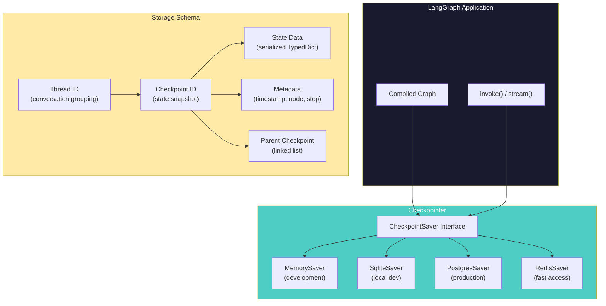
```mermaid
graph TD
    subgraph APP["LangGraph Application"]
        GRAPH["Compiled Graph"]
        INVOKE["invoke() / stream()"]
    end

    subgraph CHECKPOINTER["Checkpointer"]
        INTERFACE["CheckpointSaver Interface"]
        INTERFACE --> MEM["MemorySaver<br/>(development)"]
        INTERFACE --> SQLITE["SqliteSaver<br/>(local dev)"]
        INTERFACE --> PG["PostgresSaver<br/>(production)"]
        INTERFACE --> REDIS["RedisSaver<br/>(fast access)"]
    end

    subgraph STORAGE["Storage Schema"]
        THREAD["Thread ID<br/>(conversation grouping)"]
        CKPT["Checkpoint ID<br/>(state snapshot)"]
        STATE_DATA["State Data<br/>(serialized TypedDict)"]
        META["Metadata<br/>(timestamp, node, step)"]
        PARENT["Parent Checkpoint<br/>(linked list)"]
    end

    GRAPH --> INTERFACE
    INVOKE --> INTERFACE
    THREAD --> CKPT
    CKPT --> STATE_DATA
    CKPT --> META
    CKPT --> PARENT

    style APP fill:#1A1A2E,color:#fff
    style CHECKPOINTER fill:#4ECDC4,color:#fff
    style STORAGE fill:#FFEAA7
```

### Time Travel & Forking

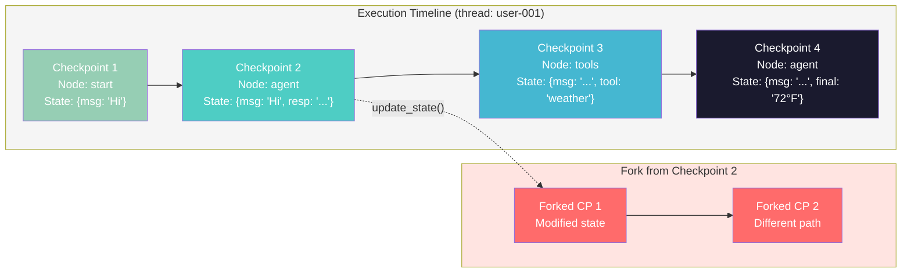
```mermaid
graph LR
    subgraph TIMELINE["Execution Timeline (thread: user-001)"]
        CP1["Checkpoint 1<br/>Node: start<br/>State: {msg: 'Hi'}"]
        CP2["Checkpoint 2<br/>Node: agent<br/>State: {msg: 'Hi', resp: '...'}"]
        CP3["Checkpoint 3<br/>Node: tools<br/>State: {msg: '...', tool: 'weather'}"]
        CP4["Checkpoint 4<br/>Node: agent<br/>State: {msg: '...', final: '72°F'}"]

        CP1 --> CP2 --> CP3 --> CP4
    end

    subgraph FORK["Fork from Checkpoint 2"]
        FCP1["Forked CP 1<br/>Modified state"]
        FCP2["Forked CP 2<br/>Different path"]

        FCP1 --> FCP2
    end

    CP2 -.->|"update_state()"| FCP1

    style TIMELINE fill:#f5f5f5
    style FORK fill:#FFE4E1
    style CP1 fill:#96CEB4,color:#fff
    style CP2 fill:#4ECDC4,color:#fff
    style CP3 fill:#45B7D1,color:#fff
    style CP4 fill:#1A1A2E,color:#fff
    style FCP1 fill:#FF6B6B,color:#fff
    style FCP2 fill:#FF6B6B,color:#fff
```

---

## ReAct Agent Pattern

### ReAct Loop (Reason → Act → Observe)

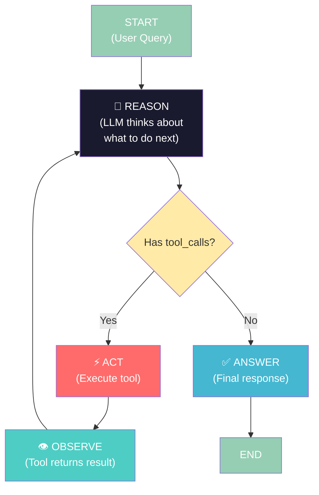
```mermaid
graph TD
    START["START<br/>(User Query)"] --> REASON["🧠 REASON<br/>(LLM thinks about<br/>what to do next)"]

    REASON --> DECIDE{"Has tool_calls?"}

    DECIDE -->|"Yes"| ACT["⚡ ACT<br/>(Execute tool)"]
    DECIDE -->|"No"| ANSWER["✅ ANSWER<br/>(Final response)"]

    ACT --> OBSERVE["👁️ OBSERVE<br/>(Tool returns result)"]

    OBSERVE --> REASON

    ANSWER --> END_NODE["END"]

    style START fill:#96CEB4,color:#fff
    style REASON fill:#1A1A2E,color:#fff
    style DECIDE fill:#FFEAA7
    style ACT fill:#FF6B6B,color:#fff
    style OBSERVE fill:#4ECDC4,color:#fff
    style ANSWER fill:#45B7D1,color:#fff
    style END_NODE fill:#96CEB4,color:#fff
```

### ReAct Execution Trace

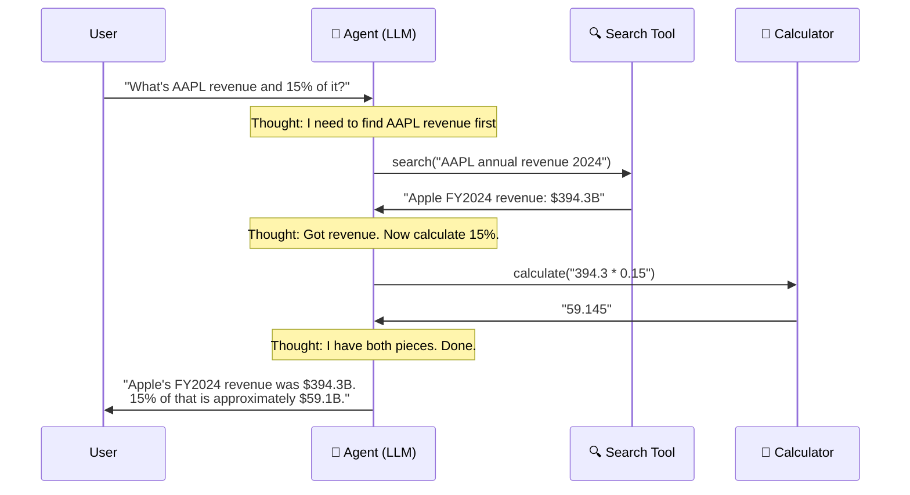
```mermaid
sequenceDiagram
    participant User
    participant Agent as 🧠 Agent (LLM)
    participant Search as 🔍 Search Tool
    participant Calc as 🧮 Calculator

    User ->> Agent: "What's AAPL revenue and 15% of it?"

    Note over Agent: Thought: I need to find AAPL revenue first
    Agent ->> Search: search("AAPL annual revenue 2024")
    Search ->> Agent: "Apple FY2024 revenue: $394.3B"

    Note over Agent: Thought: Got revenue. Now calculate 15%.
    Agent ->> Calc: calculate("394.3 * 0.15")
    Calc ->> Agent: "59.145"

    Note over Agent: Thought: I have both pieces. Done.
    Agent ->> User: "Apple's FY2024 revenue was $394.3B.<br/>15% of that is approximately $59.1B."
```

### ReAct vs Simple Chain

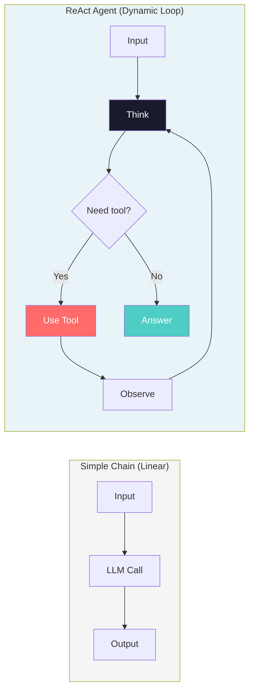
```mermaid
graph LR
    subgraph SIMPLE["Simple Chain (Linear)"]
        S1["Input"] --> S2["LLM Call"] --> S3["Output"]
    end

    subgraph REACT["ReAct Agent (Dynamic Loop)"]
        R1["Input"] --> R2["Think"]
        R2 --> R3{"Need tool?"}
        R3 -->|Yes| R4["Use Tool"]
        R4 --> R5["Observe"]
        R5 --> R2
        R3 -->|No| R6["Answer"]
    end

    style SIMPLE fill:#f5f5f5
    style REACT fill:#E8F4F8
    style R2 fill:#1A1A2E,color:#fff
    style R4 fill:#FF6B6B,color:#fff
    style R6 fill:#4ECDC4,color:#fff
```

---

## Plan-and-Execute Pattern

### Plan-and-Execute Architecture

```mermaid
graph TD
    START["START<br/>(Complex Objective)"] --> PLANNER["📋 PLANNER<br/>(Break into steps)"]

    PLANNER --> EXECUTOR["⚡ EXECUTOR<br/>(Execute current step)"]

    EXECUTOR --> REPLANNER["🔄 REPLANNER<br/>(Check progress)"]

    REPLANNER --> CHECK{"All steps done?"}

    CHECK -->|"No, more steps"| EXECUTOR
    CHECK -->|"Yes, all done"| SYNTHESIZE["📝 SYNTHESIZE<br/>(Combine results)"]

    SYNTHESIZE --> END_NODE["END<br/>(Final Answer)"]

    style START fill:#96CEB4,color:#fff
    style PLANNER fill:#1A1A2E,color:#fff
    style EXECUTOR fill:#FF6B6B,color:#fff
    style REPLANNER fill:#4ECDC4,color:#fff
    style CHECK fill:#FFEAA7
    style SYNTHESIZE fill:#45B7D1,color:#fff
    style END_NODE fill:#96CEB4,color:#fff
```

### Plan-and-Execute Execution Flow

```mermaid
sequenceDiagram
    participant User
    participant Planner as 📋 Planner
    participant Executor as ⚡ Executor
    participant Replanner as 🔄 Replanner
    participant Synth as 📝 Synthesizer

    User ->> Planner: "Compare AWS, GCP, Azure for ML workloads"

    Planner ->> Planner: Create plan
    Note over Planner: 1. Research AWS ML services<br/>2. Research GCP ML services<br/>3. Research Azure ML services<br/>4. Compare pricing<br/>5. Create comparison matrix

    Planner ->> Executor: Step 1: Research AWS ML
    Executor ->> Executor: Execute step
    Executor ->> Replanner: Result: "AWS has SageMaker..."

    Replanner ->> Replanner: 4 steps remaining
    Replanner ->> Executor: Step 2: Research GCP ML
    Executor ->> Executor: Execute step
    Executor ->> Replanner: Result: "GCP has Vertex AI..."

    Replanner ->> Executor: Step 3: Research Azure ML
    Executor ->> Replanner: Result: "Azure has Azure ML..."

    Replanner ->> Executor: Step 4: Compare pricing
    Executor ->> Replanner: Result: "Pricing comparison..."

    Replanner ->> Executor: Step 5: Create matrix
    Executor ->> Replanner: Result: "Comparison matrix..."

    Replanner ->> Replanner: All steps complete!
    Replanner ->> Synth: All results

    Synth ->> User: Comprehensive comparison report
```

### Plan-and-Execute vs ReAct

```mermaid
graph LR
    subgraph REACT_APPROACH["ReAct: Think-Act-Observe Loop"]
        direction TB
        RA1["Think → What next?"]
        RA2["Act → Use tool"]
        RA3["Observe → Check result"]
        RA4["Think → What next?"]
        RA5["Act → Use another tool"]
        RA6["Answer"]
        RA1 --> RA2 --> RA3 --> RA4 --> RA5 --> RA6
    end

    subgraph PLAN_APPROACH["Plan-Execute: Plan First, Then Execute"]
        direction TB
        PA1["Plan all steps upfront"]
        PA2["Execute step 1"]
        PA3["Execute step 2"]
        PA4["Execute step 3"]
        PA5["Synthesize"]
        PA1 --> PA2 --> PA3 --> PA4 --> PA5
    end

    style REACT_APPROACH fill:#FFE4E1
    style PLAN_APPROACH fill:#E8F4F8
```

| Aspect | ReAct | Plan-and-Execute |
|--------|:-----:|:----------------:|
| **Planning** | None (one step at a time) | Upfront plan |
| **Adaptability** | Very high (decides each step) | Medium (replan at checkpoints) |
| **Efficiency** | May wander | Focused execution |
| **Best for** | Open-ended exploration | Well-defined multi-step tasks |
| **Control** | Less predictable | More predictable |

---

## LangGraph vs Alternatives Comparison

### Architecture Comparison

```mermaid
graph TD
    subgraph LG["LangGraph"]
        direction TB
        LG1["Explicit Graph<br/>(StateGraph)"]
        LG2["You define nodes,<br/>edges, conditions"]
        LG3["Full control over flow"]
        LG1 --> LG2 --> LG3
    end

    subgraph CREW["CrewAI"]
        direction TB
        CR1["Role-Based Teams<br/>(Crew + Agents)"]
        CR2["Define roles & goals,<br/>framework decides flow"]
        CR3["Quick to prototype"]
        CR1 --> CR2 --> CR3
    end

    subgraph AUTO["Autogen"]
        direction TB
        AU1["Conversation-Based<br/>(GroupChat)"]
        AU2["Agents talk to each<br/>other in turns"]
        AU3["Emergent behavior"]
        AU1 --> AU2 --> AU3
    end

    subgraph LCEL["LangChain LCEL"]
        direction TB
        LC1["Pipe Operator<br/>(prompt | llm | parser)"]
        LC2["Linear chains,<br/>basic branching"]
        LC3["Simple composition"]
        LC1 --> LC2 --> LC3
    end

    style LG fill:#1A1A2E,color:#fff
    style CREW fill:#FF6B6B,color:#fff
    style AUTO fill:#4ECDC4,color:#fff
    style LCEL fill:#45B7D1,color:#fff
```

### Feature Matrix

```mermaid
graph TD
    subgraph MATRIX["Feature Comparison"]
        direction TB

        subgraph ROW1["Control Flow"]
            LG1["LangGraph: ★★★★★<br/>Explicit graph"]
            CR1["CrewAI: ★★☆☆☆<br/>Framework-managed"]
            AU1["Autogen: ★★☆☆☆<br/>Chat-based"]
        end

        subgraph ROW2["Persistence"]
            LG2["LangGraph: ★★★★★<br/>Built-in checkpointing"]
            CR2["CrewAI: ★☆☆☆☆<br/>No built-in"]
            AU2["Autogen: ★☆☆☆☆<br/>No built-in"]
        end

        subgraph ROW3["Human-in-Loop"]
            LG3["LangGraph: ★★★★★<br/>interrupt() native"]
            CR3["CrewAI: ★★☆☆☆<br/>Manual callbacks"]
            AU3["Autogen: ★★★☆☆<br/>Human proxy agent"]
        end

        subgraph ROW4["Multi-Agent"]
            LG4["LangGraph: ★★★★★<br/>Supervisor, hierarchy, swarm"]
            CR4["CrewAI: ★★★★☆<br/>Crew + tasks"]
            AU4["Autogen: ★★★★☆<br/>GroupChat"]
        end

        subgraph ROW5["Learning Curve"]
            LG5["LangGraph: ★★★☆☆<br/>Medium (graph concepts)"]
            CR5["CrewAI: ★★★★★<br/>Very easy (roles)"]
            AU5["Autogen: ★★★★☆<br/>Easy (chat)"]
        end
    end

    style ROW1 fill:#FFE4E1
    style ROW2 fill:#E8F4F8
    style ROW3 fill:#FFF3E0
    style ROW4 fill:#E8F5E9
    style ROW5 fill:#F3E5F5
```

### Decision Tree: Which Framework?

```mermaid
graph TD
    START["What are you building?"] --> Q1{"Need fine-grained<br/>control over flow?"}

    Q1 -->|"Yes"| LG["✅ LangGraph<br/>Full graph control"]
    Q1 -->|"No"| Q2{"Multi-agent<br/>team simulation?"}

    Q2 -->|"Yes"| Q3{"Need persistence<br/>& crash recovery?"}
    Q2 -->|"No"| Q4{"Simple chain<br/>or pipeline?"}

    Q3 -->|"Yes"| LG
    Q3 -->|"No"| CREW["✅ CrewAI<br/>Quick role-based teams"]

    Q4 -->|"Yes"| LCEL["✅ LangChain LCEL<br/>Simple composition"]
    Q4 -->|"No"| Q5{"Research or<br/>prototyping?"}

    Q5 -->|"Yes"| AUTO["✅ Autogen<br/>Conversational agents"]
    Q5 -->|"No"| LG

    style START fill:#1A1A2E,color:#fff
    style LG fill:#1A1A2E,color:#fff
    style CREW fill:#FF6B6B,color:#fff
    style AUTO fill:#4ECDC4,color:#fff
    style LCEL fill:#45B7D1,color:#fff
```

---

## Learning Path

### LangGraph Learning Roadmap

```mermaid
graph TD
    subgraph BEGINNER["🟢 Beginner (Week 1-2)"]
        B1["Install langgraph"] --> B2["Understand StateGraph"]
        B2 --> B3["Simple chatbot<br/>(nodes + edges)"]
        B3 --> B4["Add tools<br/>(ToolNode + tools_condition)"]
        B4 --> B5["Add memory<br/>(MemorySaver + thread_id)"]
    end

    subgraph INTERMEDIATE["🟡 Intermediate (Week 3-4)"]
        I1["Conditional edges<br/>(routing logic)"] --> I2["Human-in-the-loop<br/>(interrupt)"]
        I2 --> I3["Streaming<br/>(tokens + events)"]
        I3 --> I4["Multi-agent supervisor"]
        I4 --> I5["PostgreSQL persistence"]
    end

    subgraph ADVANCED["🔴 Advanced (Week 5-8)"]
        A1["ReAct agent<br/>(from scratch)"] --> A2["Plan-and-execute"]
        A2 --> A3["Self-RAG with reflection"]
        A3 --> A4["Map-reduce<br/>(Send pattern)"]
        A4 --> A5["Hierarchical multi-agent<br/>(subgraphs)"]
    end

    subgraph PRODUCTION["🟣 Production (Week 9+)"]
        P1["LangGraph Platform<br/>deployment"] --> P2["LangSmith observability"]
        P2 --> P3["Custom checkpointers"]
        P3 --> P4["Long-term memory<br/>(Store API)"]
        P4 --> P5["Production scaling<br/>& monitoring"]
    end

    BEGINNER --> INTERMEDIATE
    INTERMEDIATE --> ADVANCED
    ADVANCED --> PRODUCTION

    style BEGINNER fill:#96CEB4,color:#fff
    style INTERMEDIATE fill:#FFEAA7
    style ADVANCED fill:#FF6B6B,color:#fff
    style PRODUCTION fill:#1A1A2E,color:#fff
```

### Key Resources

| Resource | URL | Level |
|----------|-----|-------|
| Official Docs | langchain-ai.github.io/langgraph/ | All |
| LangGraph Academy | academy.langchain.com | Beginner-Advanced |
| GitHub Repo | github.com/langchain-ai/langgraph | All |
| How-To Guides | langchain-ai.github.io/langgraph/how-tos/ | Intermediate |
| LangGraph Platform | langchain-ai.github.io/langgraph/cloud/ | Production |
| LangSmith | smith.langchain.com | Production |
| YouTube (LangChain) | LangChain channel | Beginner |
| Examples Repo | github.com/langchain-ai/langgraph/tree/main/examples | All |

### Recommended Learning Projects

| # | Project | Concepts Covered | Difficulty |
|---|---------|-----------------|:----------:|
| 1 | Simple chatbot | StateGraph, nodes, edges, memory | 🟢 Easy |
| 2 | Tool-calling agent | ToolNode, conditional edges, tools_condition | 🟢 Easy |
| 3 | Customer support router | Conditional branching, multiple paths | 🟡 Medium |
| 4 | Research assistant | Supervisor pattern, multi-agent | 🟡 Medium |
| 5 | Code reviewer with approval | Human-in-the-loop, interrupt() | 🟡 Medium |
| 6 | Self-RAG pipeline | Reflection, quality gates, retry loops | 🔴 Hard |
| 7 | Multi-team report generator | Hierarchical subgraphs, map-reduce | 🔴 Hard |
| 8 | Production deployment | LangGraph Platform, Postgres, LangSmith | 🟣 Expert |

---

## Performance Characteristics

### Latency Breakdown

```mermaid
graph LR
    subgraph FAST["⚡ Fast (<50ms)"]
        F1["Graph compilation"]
        F2["State serialization"]
        F3["Edge routing"]
        F4["Checkpoint read"]
    end

    subgraph MEDIUM["🔄 Medium (50ms-2s)"]
        M1["Checkpoint write (Postgres)"]
        M2["State validation"]
        M3["Tool execution (local)"]
    end

    subgraph SLOW["🐢 Slow (1-30s)"]
        S1["LLM inference"]
        S2["External API calls"]
        S3["Vector search"]
    end

    subgraph DOMINANT["⏳ Dominant Factor"]
        D1["LLM calls dominate<br/>total latency by 10-100x"]
    end

    style FAST fill:#96CEB4,color:#fff
    style MEDIUM fill:#FFEAA7
    style SLOW fill:#FF6B6B,color:#fff
    style DOMINANT fill:#1A1A2E,color:#fff
```

### Optimization Strategies

| Bottleneck | Strategy | Impact |
|-----------|----------|--------|
| **LLM latency** | Use smaller models for routing (gpt-4o-mini) | 3-5x faster |
| **Sequential nodes** | Parallelize with `Send` (map-reduce) | Linear speedup |
| **Checkpoint overhead** | Use in-memory for dev, Postgres for prod | Minimal overhead |
| **State size** | Trim old messages, use summary memory | Faster serialization |
| **Cold start** | Pre-compile graphs, cache tool definitions | < 100ms startup |
| **Streaming perception** | Use `astream_events` for token streaming | Instant UX |
