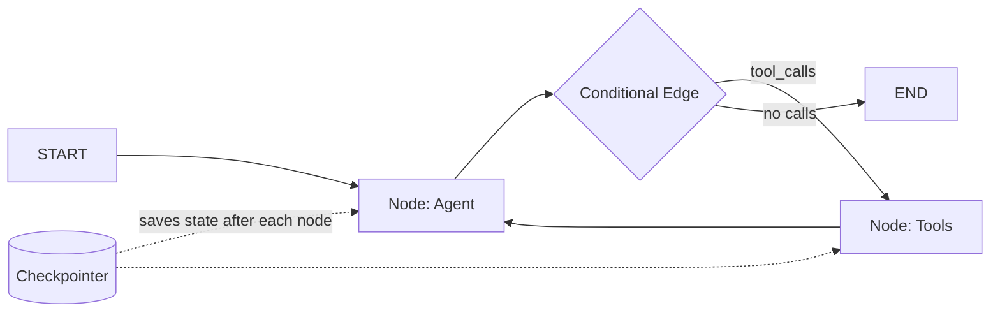

# LangGraph -- Cheatsheet

## Architecture (30-second mental model)

## When to use vs alternatives
| Need | Use | Not |
|------|-----|-----|
| Full control over agent execution flow | LangGraph (explicit graph) | LangChain AgentExecutor (black box) |
| Human-in-the-loop approval mid-execution | LangGraph interrupt() | CrewAI / Autogen (no built-in) |
| Crash recovery and durable execution | LangGraph + Postgres checkpointer | Any framework without persistence |
| Quick role-based multi-agent prototype | CrewAI | LangGraph (more setup) |
| Simple linear chain, no branching | LangChain LCEL pipe | LangGraph (overkill) |

## 5 things you always forget
1. State lists need `Annotated[list, add_messages]` reducer -- without it, each node **replaces** the list instead of appending
2. Always pass `thread_id` in config when using a checkpointer -- omitting it raises a runtime error, not a warning
3. Never mutate state directly inside nodes (`state["messages"].append(...)`) -- return a partial dict update instead
4. `tools_condition` is a built-in router that returns `"tools"` or `END` -- no need to write your own for basic tool-calling agents
5. Use `gpt-4o-mini` for routing/classifier nodes and `gpt-4o` for generation nodes -- same accuracy at 5x lower cost on supervisors

## Interview killer answer
> "We used LangGraph for a document processing pipeline where agents needed human approval before executing database changes. The key was using interrupt_before on the execution node with a Postgres checkpointer, so the workflow survived server restarts and the ops team could approve actions hours later from a dashboard that called invoke(Command(resume='yes'), config) on the stored thread."
