# LlamaIndex: Visual Guide & Architecture Diagrams

## Table of Contents
1. [Ecosystem Overview](#ecosystem-overview)
2. [RAG Pipeline Architecture](#rag-pipeline-architecture)
3. [Index Types Comparison](#index-types-comparison)
4. [Query Engine vs Chat Engine](#query-engine-vs-chat-engine)
5. [Agent Architecture](#agent-architecture)
6. [Workflow Event-Driven Architecture](#workflow-event-driven-architecture)
7. [LlamaIndex vs LangChain Comparison](#llamaindex-vs-langchain-comparison)
8. [Data Connector Ecosystem](#data-connector-ecosystem)
9. [Production Deployment](#production-deployment)
10. [Learning Path](#learning-path)

---

## Ecosystem Overview

### LlamaIndex Complete Ecosystem

```mermaid
graph TD
    A["User Application"] --> B["LlamaIndex Framework"]

    B --> C["Data Layer"]
    C --> C1["Data Connectors<br/>(LlamaHub 300+)"]
    C --> C2["Document Loaders"]
    C --> C3["Node Parsers"]
    C --> C4["Text Splitters"]

    B --> D["Index Layer"]
    D --> D1["VectorStoreIndex"]
    D --> D2["SummaryIndex"]
    D --> D3["TreeIndex"]
    D --> D4["KeywordTableIndex"]
    D --> D5["KnowledgeGraphIndex"]

    B --> E["Query Layer"]
    E --> E1["Query Engine"]
    E --> E2["Chat Engine"]
    E --> E3["Retriever"]
    E --> E4["Response Synthesizer"]
    E --> E5["Router Query Engine"]

    B --> F["Agent Layer"]
    F --> F1["ReAct Agent"]
    F --> F2["OpenAI Agent"]
    F --> F3["Function Calling"]
    F --> F4["Multi-Agent"]

    B --> G["Orchestration"]
    G --> G1["Workflows"]
    G --> G2["Events"]
    G --> G3["Steps"]
    G --> G4["Streaming"]

    B --> H["Production"]
    H --> H1["LlamaCloud"]
    H --> H2["LlamaParse"]
    H --> H3["LlamaExtract"]
    H --> H4["Observability"]

    style A fill:#E8F4F8
    style B fill:#7C3AED,color:#fff
    style C fill:#FF6B6B
    style D fill:#4ECDC4
    style E fill:#45B7D1
    style F fill:#FFEAA7
    style G fill:#96CEB4
    style H fill:#DDA15E
```

### Core Component Relationship Map

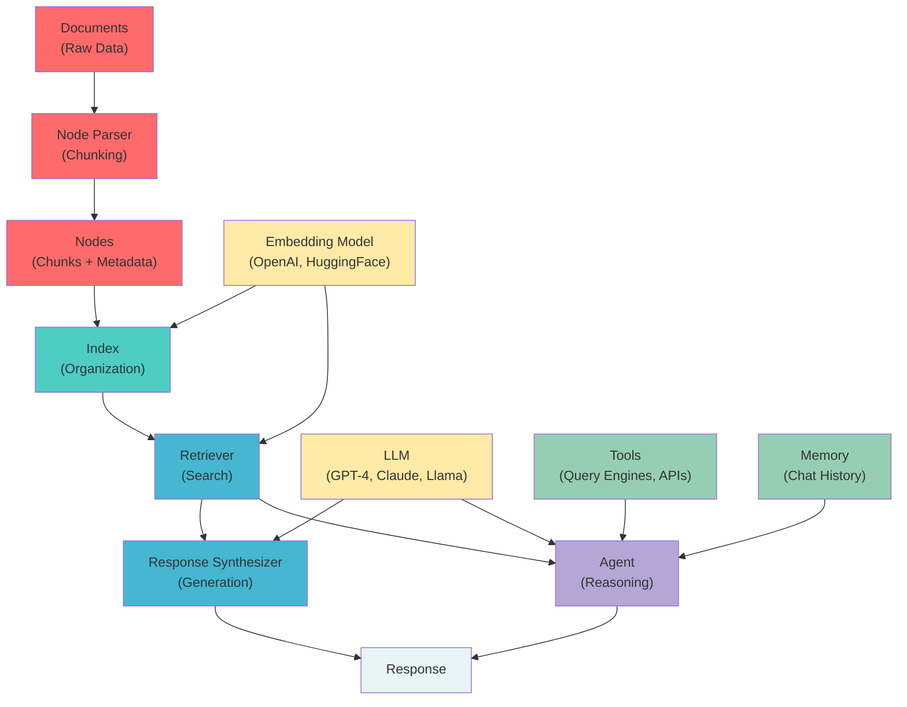

---

## RAG Pipeline Architecture

### Full RAG Pipeline (Load → Parse → Index → Retrieve → Generate)

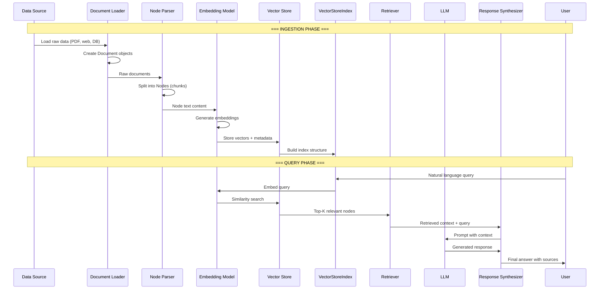

### RAG Pipeline Stages Detail

```mermaid
graph LR
    subgraph LOAD["1. Load"]
        L1["SimpleDirectoryReader"]
        L2["LlamaHub Connectors"]
        L3["DatabaseReader"]
        L4["APIReader"]
        L5["LlamaParse (PDFs)"]
    end

    subgraph PARSE["2. Parse"]
        P1["SentenceSplitter"]
        P2["TokenTextSplitter"]
        P3["SemanticSplitter"]
        P4["HierarchicalNodeParser"]
        P5["Metadata Extraction"]
    end

    subgraph INDEX["3. Index"]
        I1["VectorStoreIndex"]
        I2["SummaryIndex"]
        I3["TreeIndex"]
        I4["KeywordTableIndex"]
        I5["KnowledgeGraphIndex"]
    end

    subgraph RETRIEVE["4. Retrieve"]
        R1["Top-K Similarity"]
        R2["MMR (Max Marginal)"]
        R3["Auto-Merging"]
        R4["Recursive Retrieval"]
        R5["Fusion Retrieval"]
    end

    subgraph GENERATE["5. Generate"]
        G1["Compact Synthesizer"]
        G2["Tree Summarize"]
        G3["Refine"]
        G4["Simple Summarize"]
        G5["Accumulate"]
    end

    LOAD --> PARSE --> INDEX --> RETRIEVE --> GENERATE

    style LOAD fill:#FF6B6B,color:#fff
    style PARSE fill:#E17055,color:#fff
    style INDEX fill:#4ECDC4,color:#fff
    style RETRIEVE fill:#45B7D1,color:#fff
    style GENERATE fill:#96CEB4,color:#fff
```

### Advanced RAG Patterns

```mermaid
graph TD
    subgraph NAIVE["Naive RAG"]
        N1["Query"] --> N2["Retrieve Top-K"]
        N2 --> N3["Stuff into Prompt"]
        N3 --> N4["Generate Answer"]
    end

    subgraph ADVANCED["Advanced RAG"]
        A1["Query"] --> A2["Query Transformation"]
        A2 --> A3["HyDE / Sub-Questions"]
        A3 --> A4["Multi-Index Retrieval"]
        A4 --> A5["Reranking (Cohere, Cross-Encoder)"]
        A5 --> A6["Context Compression"]
        A6 --> A7["Generate with Citations"]
    end

    subgraph MODULAR["Modular RAG"]
        M1["Query"] --> M2["Route to Best Index"]
        M2 --> M3["Recursive Retrieval"]
        M3 --> M4["Auto-Merging Nodes"]
        M4 --> M5["Sentence Window Retrieval"]
        M5 --> M6["Agentic Synthesis"]
    end

    style NAIVE fill:#FF6B6B,color:#fff
    style ADVANCED fill:#4ECDC4,color:#fff
    style MODULAR fill:#7C3AED,color:#fff
```

---

## Index Types Comparison

### Index Types Architecture

```mermaid
graph TD
    subgraph VS["VectorStoreIndex"]
        VS1["Documents"] --> VS2["Embeddings"]
        VS2 --> VS3["Vector Store<br/>(Pinecone, Chroma, Weaviate)"]
        VS3 --> VS4["Similarity Search"]
        VS4 --> VS5["Top-K Nodes"]
    end

    subgraph SI["SummaryIndex (List)"]
        SI1["Documents"] --> SI2["Sequential Nodes"]
        SI2 --> SI3["Iterate All Nodes"]
        SI3 --> SI4["Summarize Each"]
        SI4 --> SI5["Combine Summaries"]
    end

    subgraph TI["TreeIndex"]
        TI1["Leaf Nodes<br/>(Chunks)"] --> TI2["Parent Summaries"]
        TI2 --> TI3["Root Summary"]
        TI3 --> TI4["Top-Down Traversal"]
        TI4 --> TI5["Select Best Branch"]
    end

    subgraph KW["KeywordTableIndex"]
        KW1["Documents"] --> KW2["Extract Keywords<br/>(LLM or Regex)"]
        KW2 --> KW3["Keyword → Node Map"]
        KW3 --> KW4["Keyword Match"]
        KW4 --> KW5["Relevant Nodes"]
    end

    subgraph KG["KnowledgeGraphIndex"]
        KG1["Documents"] --> KG2["Extract Triplets<br/>(Subject, Predicate, Object)"]
        KG2 --> KG3["Build Graph"]
        KG3 --> KG4["Graph Traversal"]
        KG4 --> KG5["Related Entities"]
    end

    style VS fill:#4ECDC4,color:#fff
    style SI fill:#FF6B6B,color:#fff
    style TI fill:#45B7D1,color:#fff
    style KW fill:#FFEAA7
    style KG fill:#B4A7D6
```

### Index Selection Decision Tree

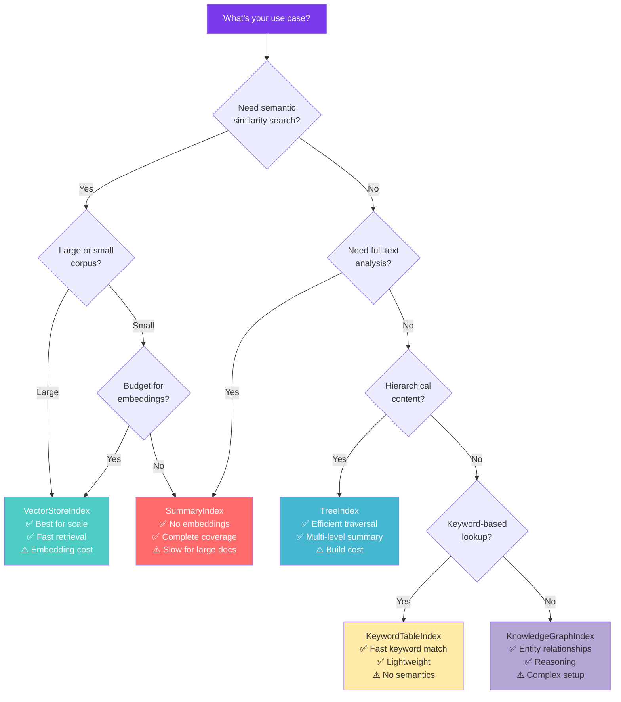

### Index Type Comparison Matrix

| Feature | VectorStore | Summary | Tree | Keyword | KnowledgeGraph |
|---------|:-----------:|:-------:|:----:|:-------:|:--------------:|
| **Speed (Query)** | ⚡ Fast | 🐢 Slow | ⚡ Fast | ⚡ Fast | 🔄 Medium |
| **Speed (Build)** | 🔄 Medium | ⚡ Fast | 🐢 Slow | ⚡ Fast | 🐢 Slow |
| **Semantic Search** | ✅ Yes | ❌ No | ✅ Partial | ❌ No | ✅ Partial |
| **Full Coverage** | ❌ Top-K only | ✅ All nodes | ✅ Traversal | ❌ Keyword match | 🔄 Partial |
| **Embedding Cost** | 💰 High | 💚 Free | 💰 Medium | 💚 Free | 💰 Medium |
| **Best For** | General RAG | Summarization | Hierarchical docs | FAQ/Lookup | Entity relations |
| **Scalability** | ✅ Excellent | ⚠️ Linear | ✅ Good | ✅ Good | ⚠️ Complex |

---

## Query Engine vs Chat Engine

### Query Engine Flow

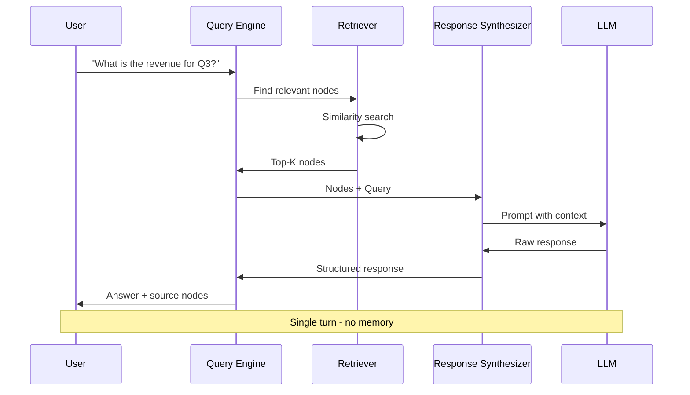

### Chat Engine Flow

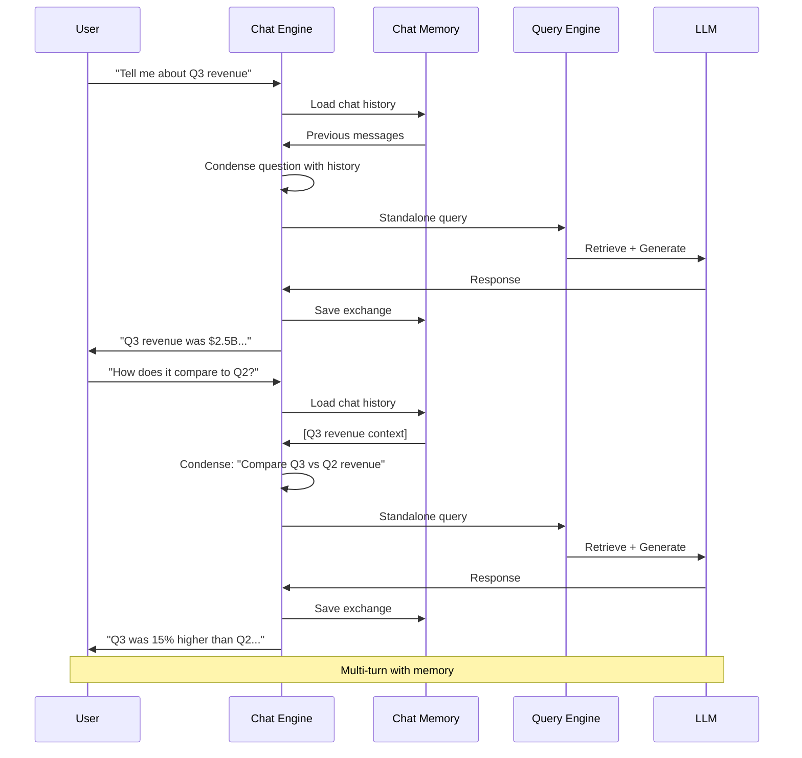

### Chat Engine Modes

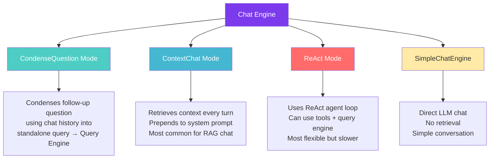

---

## Agent Architecture

### LlamaIndex Agent Architecture

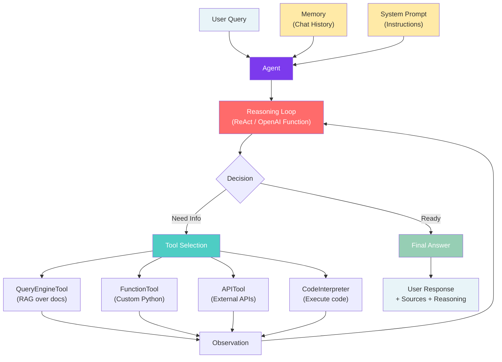

### ReAct Agent Loop Detail

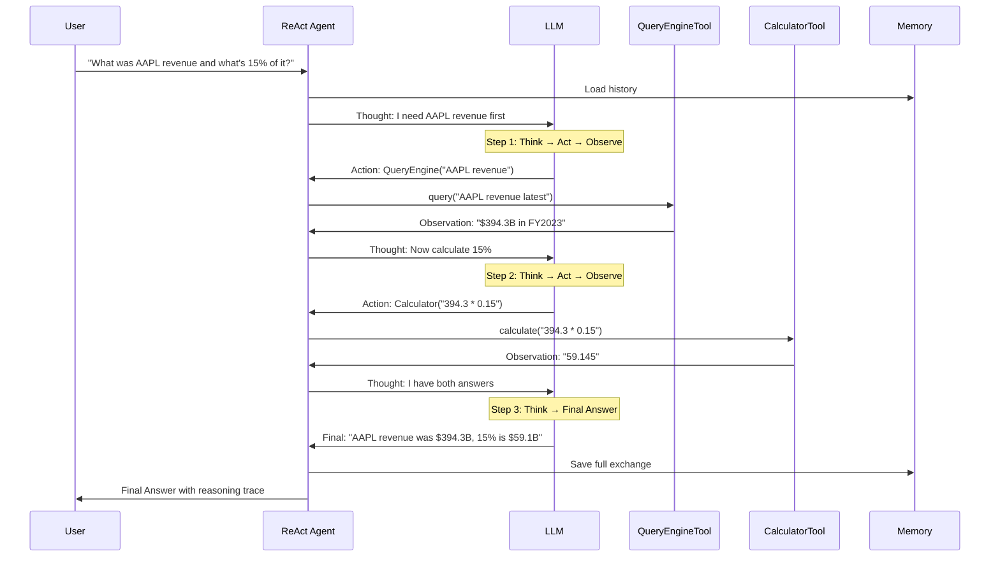

### Multi-Agent Architecture

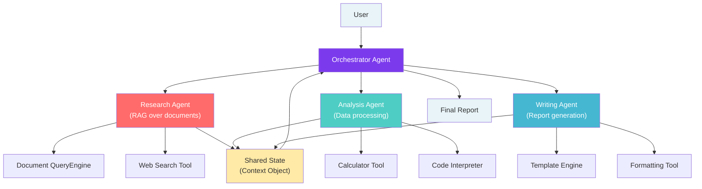

---

## Workflow Event-Driven Architecture

### Workflow Basics

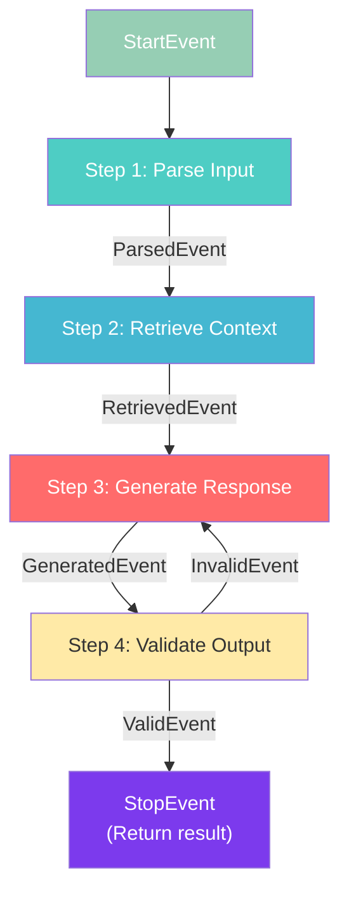

### Workflow Internal Architecture

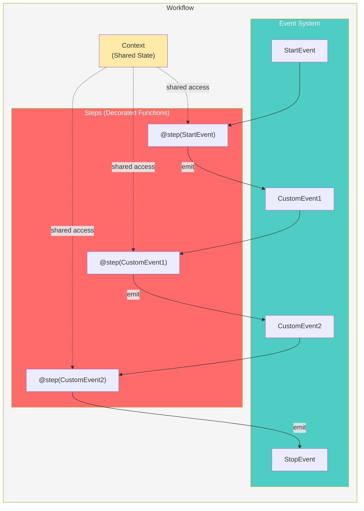

### Branching & Loops in Workflows

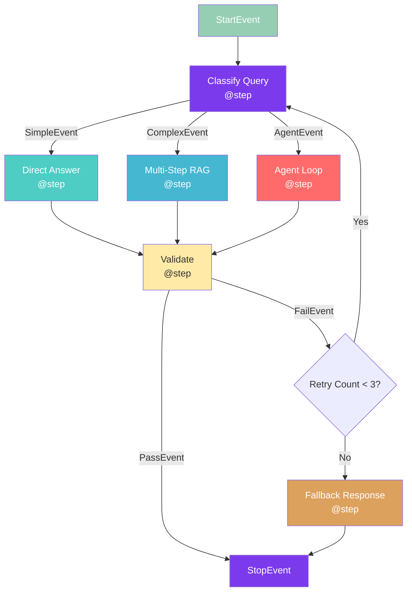

### Workflow Code Structure

```python
from llama_index.core.workflow import (
    Workflow, StartEvent, StopEvent, step, Event, Context
)

# Custom Events
class RetrieveEvent(Event):
    query: str

class SynthesizeEvent(Event):
    query: str
    context: str

# Workflow Definition
class RAGWorkflow(Workflow):
    @step
    async def parse_query(self, ctx: Context, ev: StartEvent) -> RetrieveEvent:
        query = ev.get("query")
        await ctx.set("original_query", query)
        return RetrieveEvent(query=query)

    @step
    async def retrieve(self, ctx: Context, ev: RetrieveEvent) -> SynthesizeEvent:
        nodes = self.index.as_retriever().retrieve(ev.query)
        context = "\n".join([n.text for n in nodes])
        return SynthesizeEvent(query=ev.query, context=context)

    @step
    async def synthesize(self, ctx: Context, ev: SynthesizeEvent) -> StopEvent:
        response = self.llm.complete(f"Context: {ev.context}\nQuery: {ev.query}")
        return StopEvent(result=str(response))

# Run
workflow = RAGWorkflow()
result = await workflow.run(query="What is LlamaIndex?")
```

---

## LlamaIndex vs LangChain Comparison

### Architecture Philosophy

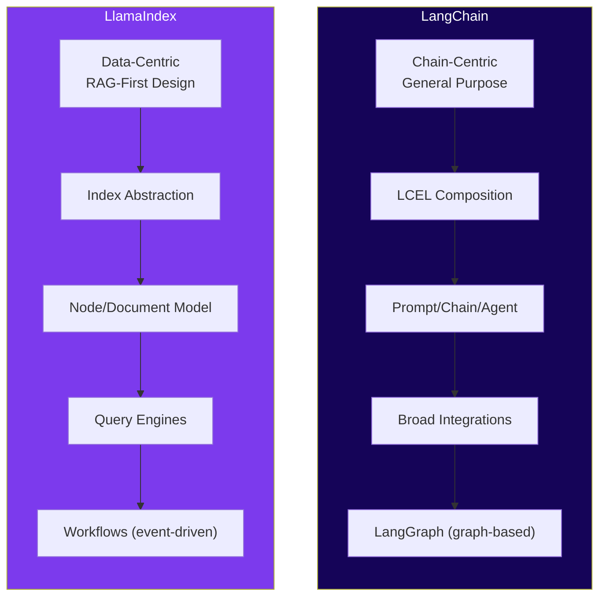

### Feature Comparison Matrix

| Feature | LlamaIndex | LangChain |
|---------|:---------:|:---------:|
| **Primary Focus** | Data indexing & RAG | General LLM orchestration |
| **Index Types** | 5+ specialized indexes | VectorStore focus |
| **Document Parsing** | LlamaParse (PDF, tables) | Basic loaders |
| **Node/Chunk Model** | First-class Nodes with metadata | Documents (simpler) |
| **Query Engine** | Built-in, multiple modes | Manual chain building |
| **Chat Engine** | Built-in with modes | ConversationChain |
| **Agents** | ReAct, OpenAI, Custom | ReAct, OpenAI, Plan-Execute |
| **Multi-Agent** | Orchestrator pattern | LangGraph supervisor |
| **Workflows** | Event-driven Workflows | LangGraph (graph-based) |
| **Streaming** | Native in Workflows | LCEL streaming |
| **Observability** | LlamaTrace, callbacks | LangSmith |
| **Managed Service** | LlamaCloud | LangServe, LangSmith |
| **Community Size** | Growing (35K+ GitHub ⭐) | Larger (90K+ GitHub ⭐) |
| **Learning Curve** | Moderate (RAG-focused) | Steep (broad surface) |
| **Best For** | RAG applications | General LLM apps |

### When to Use Which

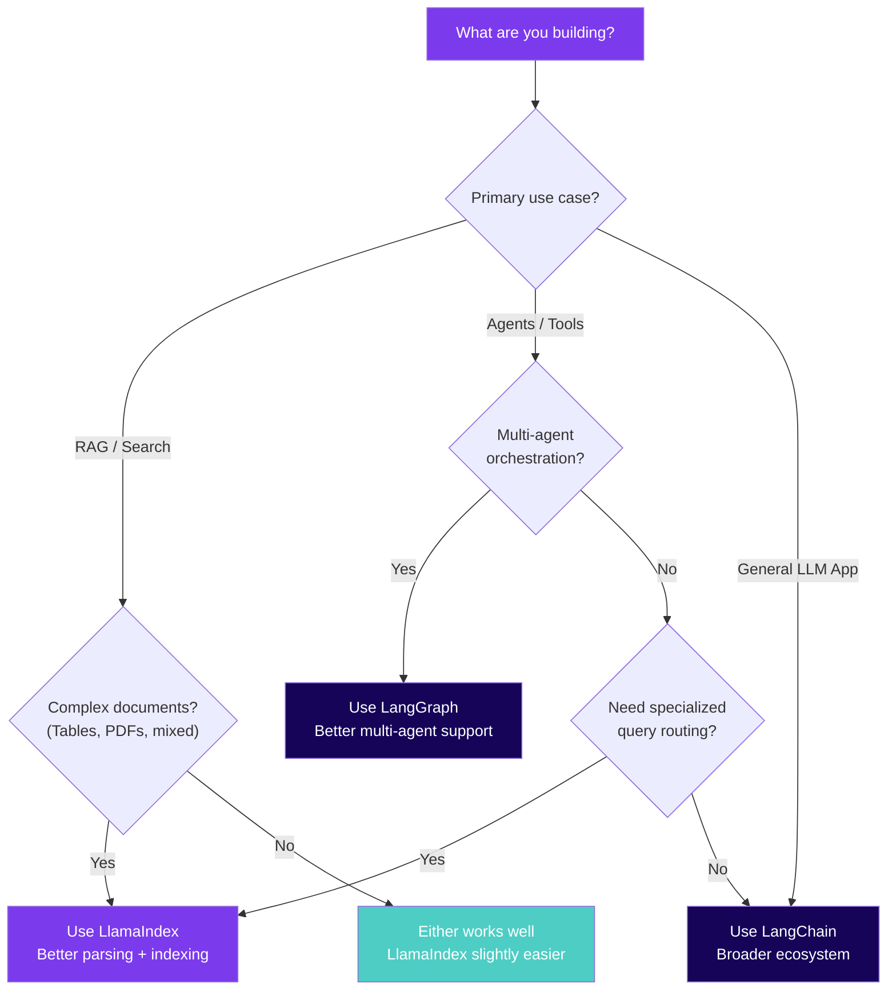

---

## Data Connector Ecosystem

### LlamaHub Data Connectors (300+)

```mermaid
graph TD
    HUB["LlamaHub<br/>(300+ Connectors)"] --> FILE["File-Based"]
    HUB --> DB["Databases"]
    HUB --> CLOUD["Cloud Storage"]
    HUB --> SAAS["SaaS Apps"]
    HUB --> WEB["Web & APIs"]
    HUB --> CUSTOM["Custom"]

    FILE --> F1["PDF (LlamaParse)"]
    FILE --> F2["DOCX, PPTX, XLSX"]
    FILE --> F3["CSV, JSON, XML"]
    FILE --> F4["Markdown, HTML"]
    FILE --> F5["Images (multi-modal)"]

    DB --> D1["PostgreSQL"]
    DB --> D2["MongoDB"]
    DB --> D3["MySQL"]
    DB --> D4["BigQuery"]
    DB --> D5["Snowflake"]

    CLOUD --> C1["S3"]
    CLOUD --> C2["GCS"]
    CLOUD --> C3["Azure Blob"]
    CLOUD --> C4["Google Drive"]
    CLOUD --> C5["Dropbox"]

    SAAS --> S1["Notion"]
    SAAS --> S2["Slack"]
    SAAS --> S3["Confluence"]
    SAAS --> S4["Salesforce"]
    SAAS --> S5["GitHub/GitLab"]

    WEB --> W1["Web Scraper"]
    WEB --> W2["Wikipedia"]
    WEB --> W3["YouTube Transcripts"]
    WEB --> W4["arXiv Papers"]
    WEB --> W5["Twitter/Reddit"]

    style HUB fill:#7C3AED,color:#fff
    style FILE fill:#FF6B6B,color:#fff
    style DB fill:#4ECDC4,color:#fff
    style CLOUD fill:#45B7D1,color:#fff
    style SAAS fill:#FFEAA7
    style WEB fill:#96CEB4,color:#fff
    style CUSTOM fill:#DDA15E
```

### Vector Store Integrations

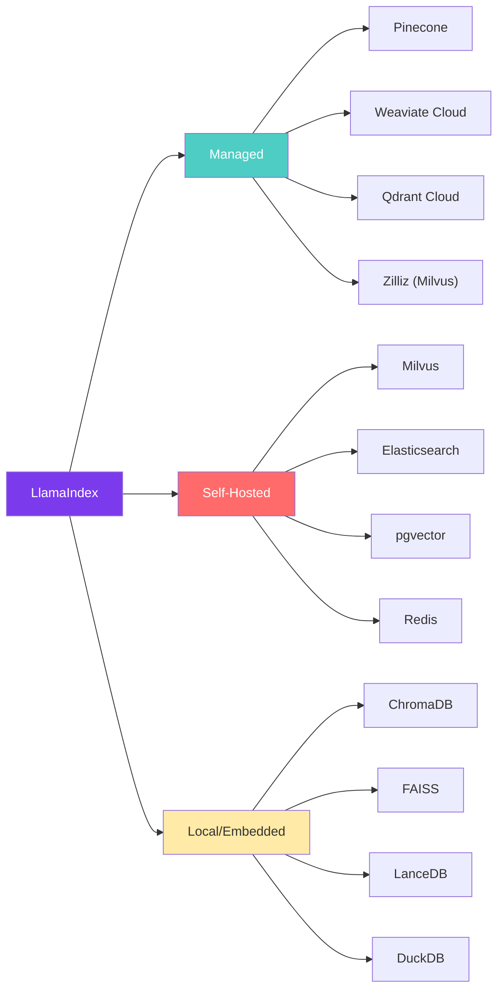

---

## Production Deployment

### LlamaCloud Production Architecture

```mermaid
graph TD
    subgraph CLIENT["Client Application"]
        APP["Your App"]
        SDK["LlamaIndex SDK"]
    end

    subgraph LLAMACLOUD["LlamaCloud (Managed)"]
        PARSE["LlamaParse<br/>(Document Parsing)"]
        EXTRACT["LlamaExtract<br/>(Structured Extraction)"]
        MANAGED_INDEX["Managed Index<br/>(Cloud-hosted)"]
        MANAGED_RET["Managed Retriever<br/>(Cloud-hosted)"]
    end

    subgraph INFRA["Your Infrastructure"]
        VDB["Vector Database<br/>(Pinecone/Weaviate)"]
        LLM_API["LLM API<br/>(OpenAI/Anthropic)"]
        CACHE["Cache Layer<br/>(Redis)"]
        MONITOR["Observability<br/>(LlamaTrace)"]
    end

    APP --> SDK
    SDK --> PARSE
    SDK --> EXTRACT
    SDK --> MANAGED_INDEX
    SDK --> MANAGED_RET

    MANAGED_INDEX --> VDB
    MANAGED_RET --> VDB
    SDK --> LLM_API
    SDK --> CACHE
    SDK --> MONITOR

    style CLIENT fill:#E8F4F8
    style LLAMACLOUD fill:#7C3AED,color:#fff
    style INFRA fill:#4ECDC4,color:#fff
```

### Self-Hosted Production Pipeline

```mermaid
graph TD
    subgraph INGEST["Ingestion Pipeline"]
        SRC["Data Sources"] --> LOAD["Document Loader"]
        LOAD --> PARSE["LlamaParse API"]
        PARSE --> CHUNK["Node Parser<br/>(Semantic Splitter)"]
        CHUNK --> EMBED["Embedding Model<br/>(batch processing)"]
        EMBED --> STORE["Vector Store<br/>(Pinecone/pgvector)"]
    end

    subgraph SERVE["Query Pipeline"]
        USER["User Query"] --> API["FastAPI / Flask"]
        API --> CACHE["Redis Cache"]
        CACHE -->|miss| QE["Query Engine"]
        QE --> RET["Retriever"]
        RET --> STORE
        RET --> RERANK["Reranker<br/>(Cohere / Cross-Encoder)"]
        RERANK --> SYNTH["Response Synthesizer"]
        SYNTH --> LLM["LLM"]
        LLM --> API
        API --> USER
    end

    subgraph OPS["Operations"]
        TRACE["LlamaTrace<br/>(Observability)"]
        EVAL["RAG Evaluation<br/>(Faithfulness, Relevancy)"]
        GUARD["Guardrails<br/>(NeMo / Guardrails AI)"]
    end

    QE -.-> TRACE
    QE -.-> EVAL
    API -.-> GUARD

    style INGEST fill:#FF6B6B,color:#fff
    style SERVE fill:#4ECDC4,color:#fff
    style OPS fill:#FFEAA7
```

---

## Learning Path

### LlamaIndex Learning Roadmap

```mermaid
graph TD
    subgraph BEGINNER["🟢 Beginner (Week 1-2)"]
        B1["Install LlamaIndex"] --> B2["SimpleDirectoryReader"]
        B2 --> B3["VectorStoreIndex basics"]
        B3 --> B4["Simple query engine"]
        B4 --> B5["Chat engine basics"]
    end

    subgraph INTERMEDIATE["🟡 Intermediate (Week 3-4)"]
        I1["Node parsers & chunking"] --> I2["Multiple index types"]
        I2 --> I3["Custom retrievers"]
        I3 --> I4["Response synthesizer modes"]
        I4 --> I5["Agents with tools"]
    end

    subgraph ADVANCED["🔴 Advanced (Week 5-8)"]
        A1["Advanced RAG patterns"] --> A2["Workflows (event-driven)"]
        A2 --> A3["Multi-agent systems"]
        A3 --> A4["Custom LLM/Embedding"]
        A4 --> A5["RAG evaluation & optimization"]
    end

    subgraph PRODUCTION["🟣 Production (Week 9+)"]
        P1["LlamaCloud integration"] --> P2["LlamaParse for complex docs"]
        P2 --> P3["Observability (LlamaTrace)"]
        P3 --> P4["Deployment (Docker/K8s)"]
        P4 --> P5["Performance tuning"]
    end

    BEGINNER --> INTERMEDIATE
    INTERMEDIATE --> ADVANCED
    ADVANCED --> PRODUCTION

    style BEGINNER fill:#96CEB4,color:#fff
    style INTERMEDIATE fill:#FFEAA7
    style ADVANCED fill:#FF6B6B,color:#fff
    style PRODUCTION fill:#7C3AED,color:#fff
```

### Key Resources

| Resource | URL | Level |
|----------|-----|-------|
| Official Docs | docs.llamaindex.ai | All |
| LlamaHub | llamahub.ai | Beginner |
| LlamaCloud | cloud.llamaindex.ai | Production |
| GitHub | github.com/run-llama/llama_index | All |
| Discord | discord.gg/llamaindex | Community |
| YouTube (Jerry Liu) | LlamaIndex channel | Beginner-Intermediate |
| RAG Course (DeepLearning.AI) | deeplearning.ai | Intermediate |
| Building Production RAG | docs.llamaindex.ai/en/stable/optimizing/ | Advanced |

---

## Performance Characteristics

### Latency Breakdown by Operation

```mermaid
graph LR
    subgraph FAST["⚡ Fast (<100ms)"]
        F1["Keyword lookup"]
        F2["Cached query"]
        F3["Simple embedding"]
    end

    subgraph MEDIUM["🔄 Medium (100ms-2s)"]
        M1["Vector similarity search"]
        M2["Node parsing"]
        M3["Single LLM call"]
    end

    subgraph SLOW["🐢 Slow (2s-30s)"]
        S1["Document ingestion"]
        S2["Tree index build"]
        S3["Multi-step agent"]
    end

    subgraph VERY_SLOW["⏳ Very Slow (30s+)"]
        V1["Full corpus re-index"]
        V2["Knowledge graph build"]
        V3["Complex workflow pipeline"]
    end

    style FAST fill:#96CEB4,color:#fff
    style MEDIUM fill:#FFEAA7
    style SLOW fill:#FF6B6B,color:#fff
    style VERY_SLOW fill:#7C3AED,color:#fff
```

### Optimization Strategies

| Bottleneck | Strategy | Impact |
|-----------|----------|--------|
| **Embedding latency** | Batch embeddings, cache results | 3-5x faster |
| **LLM calls** | Use smaller models for routing, cache responses | 2-4x faster |
| **Retrieval** | Use approximate NN (HNSW), pre-filter metadata | 5-10x faster |
| **Document parsing** | Use LlamaParse async, parallel processing | 3-8x faster |
| **Re-ranking** | Use lightweight cross-encoders, limit candidates | 2x faster |
| **Index build** | Incremental updates, avoid full rebuilds | 10x+ faster |
