# Model Quantization: Visual Guide & Architecture Diagrams

> **Comprehensive visual reference** for model quantization methods, pipelines, comparisons, and decision frameworks using Mermaid diagrams.

---

## Table of Contents

- [1. Quantization Methods Taxonomy](#1-quantization-methods-taxonomy)
- [2. GPTQ Pipeline Flow](#2-gptq-pipeline-flow)
- [3. AWQ Pipeline Flow](#3-awq-pipeline-flow)
- [4. Memory Comparison](#4-memory-comparison-by-model-size-and-precision)
- [5. Quality vs Speed Tradeoff](#5-quality-vs-speed-tradeoff)
- [6. Deployment Options](#6-deployment-options-architecture)
- [7. Decision Tree](#7-decision-tree-which-quantization-method-to-use)
- [8. Learning Path](#8-learning-path)

---

## 1. Quantization Methods Taxonomy

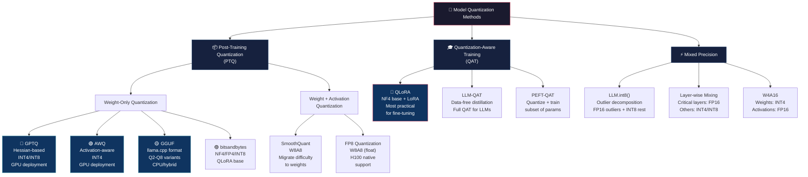

---

## 2. GPTQ Pipeline Flow

```mermaid
flowchart TD
    START["🚀 Full-Precision Model<br/>(FP32/FP16)"] --> CALIB["📊 Calibration Phase"]

    CALIB --> LOAD_DATA["Load Calibration Dataset<br/>(128-256 samples from C4/Pile)"]
    LOAD_DATA --> FWD["Forward Pass<br/>Collect activation statistics X"]

    FWD --> HESSIAN["🧮 Hessian Computation<br/>H = 2 · Xᵀ · X<br/>per linear layer"]

    HESSIAN --> CHOLESKY["Cholesky Decomposition<br/>H + λI = LLᵀ<br/>(dampening for stability)"]

    CHOLESKY --> LAYER_LOOP["⚙️ Layer-by-Layer Quantization"]

    LAYER_LOOP --> COL_LOOP["For each column block<br/>(group_size = 128)"]

    COL_LOOP --> QUANT_W["1. Quantize weight w_j<br/>ŵ_j = round(w_j / scale) × scale"]
    QUANT_W --> CALC_ERR["2. Compute error<br/>δ_j = w_j - ŵ_j"]
    CALC_ERR --> COMPENSATE["3. Compensate remaining<br/>w_{j+1:} -= δ_j · (H_{j,j+1:} / H_{j,j})"]
    COMPENSATE --> NEXT_COL{"More columns<br/>in block?"}

    NEXT_COL -->|Yes| COL_LOOP
    NEXT_COL -->|No| LAZY_UPDATE["4. Lazy Batch Update<br/>Apply accumulated error<br/>to remaining blocks"]

    LAZY_UPDATE --> NEXT_LAYER{"More layers?"}
    NEXT_LAYER -->|Yes| LAYER_LOOP
    NEXT_LAYER -->|No| SAVE["💾 Save Quantized Model"]

    SAVE --> OUTPUT["Quantized Model<br/>• INT4/INT8 weights<br/>• Scale + zero-point per group<br/>• 2-4x smaller"]

    OUTPUT --> VALIDATE["✅ Validate Quality<br/>• Perplexity check<br/>• Benchmark tasks<br/>• Compare to FP16 baseline"]

    style START fill:#2d3436,stroke:#00b894,color:#fff
    style HESSIAN fill:#6c5ce7,stroke:#a29bfe,color:#fff
    style CHOLESKY fill:#6c5ce7,stroke:#a29bfe,color:#fff
    style COMPENSATE fill:#e17055,stroke:#fab1a0,color:#fff
    style OUTPUT fill:#00b894,stroke:#55efc4,color:#fff
    style VALIDATE fill:#0984e3,stroke:#74b9ff,color:#fff
```

### GPTQ Key Parameters

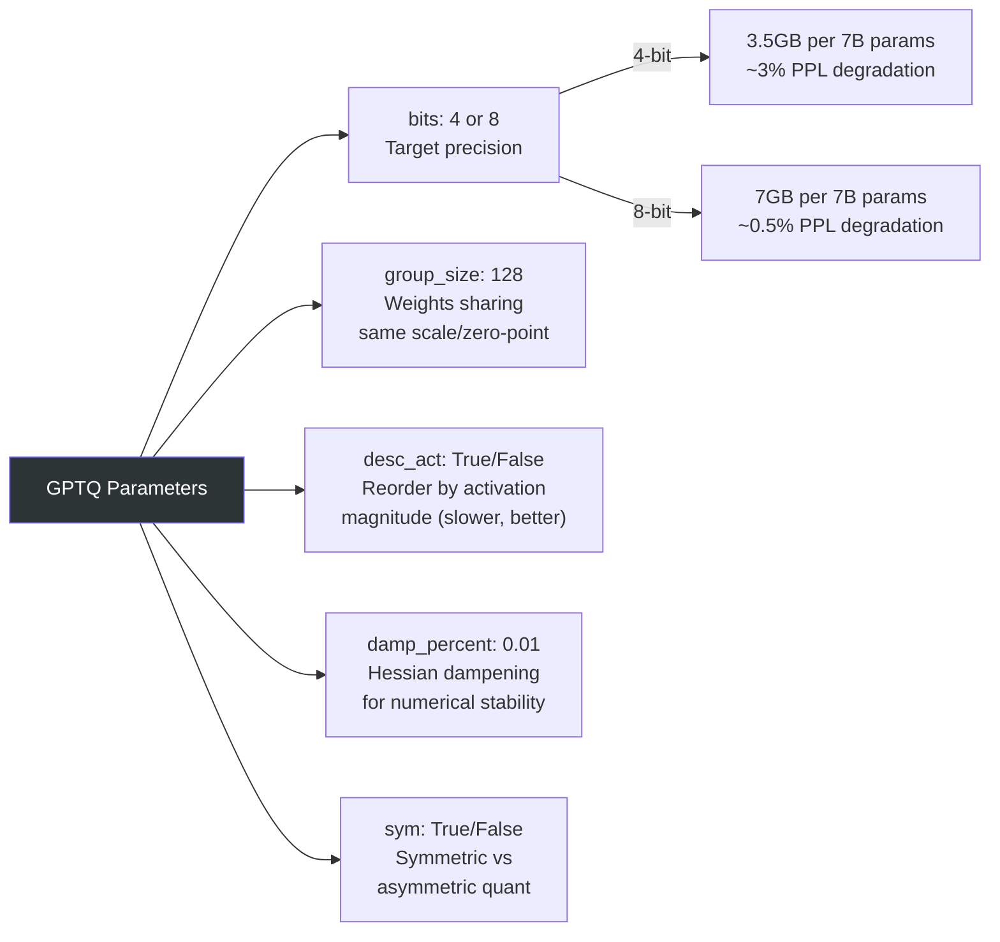

---

## 3. AWQ Pipeline Flow

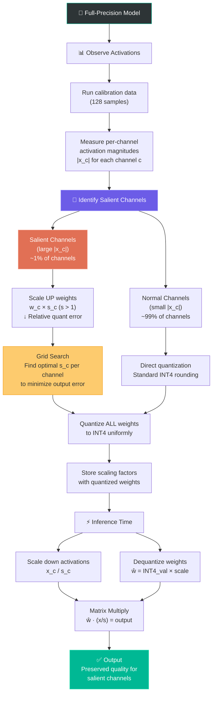

### AWQ vs GPTQ Comparison

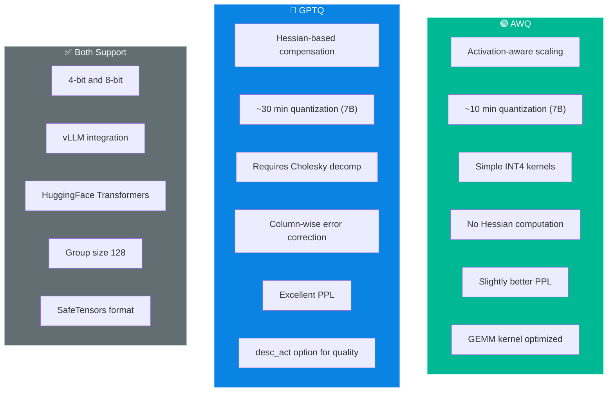

---

## 4. Memory Comparison by Model Size and Precision

```mermaid
graph TD
    subgraph MEM7B ["📊 7B Parameter Model"]
        FP32_7["FP32: 28 GB"]
        FP16_7["FP16: 14 GB"]
        INT8_7["INT8: 7 GB"]
        INT4_7["INT4: 3.5 GB"]
    end

    subgraph MEM13B ["📊 13B Parameter Model"]
        FP32_13["FP32: 52 GB"]
        FP16_13["FP16: 26 GB"]
        INT8_13["INT8: 13 GB"]
        INT4_13["INT4: 6.5 GB"]
    end

    subgraph MEM70B ["📊 70B Parameter Model"]
        FP32_70["FP32: 280 GB"]
        FP16_70["FP16: 140 GB"]
        INT8_70["INT8: 70 GB"]
        INT4_70["INT4: 35 GB"]
    end

    subgraph GPU_FIT ["🖥️ GPU Memory Fit"]
        RTX3090["RTX 3090: 24 GB"]
        RTX4090["RTX 4090: 24 GB"]
        A10G["A10G: 24 GB"]
        A100_40["A100-40: 40 GB"]
        A100_80["A100-80: 80 GB"]
        H100["H100: 80 GB"]
    end

    INT4_7 -.->|"✅ Fits"| RTX3090
    INT4_13 -.->|"✅ Fits"| RTX3090
    FP16_7 -.->|"✅ Fits"| RTX3090
    INT4_70 -.->|"✅ Fits"| A100_40
    FP16_70 -.->|"❌ Needs 2x"| A100_80

    style MEM7B fill:#2d3436,stroke:#00b894,color:#fff
    style MEM13B fill:#2d3436,stroke:#0984e3,color:#fff
    style MEM70B fill:#2d3436,stroke:#e17055,color:#fff
    style GPU_FIT fill:#636e72,stroke:#b2bec3,color:#fff
```

### Memory Formula

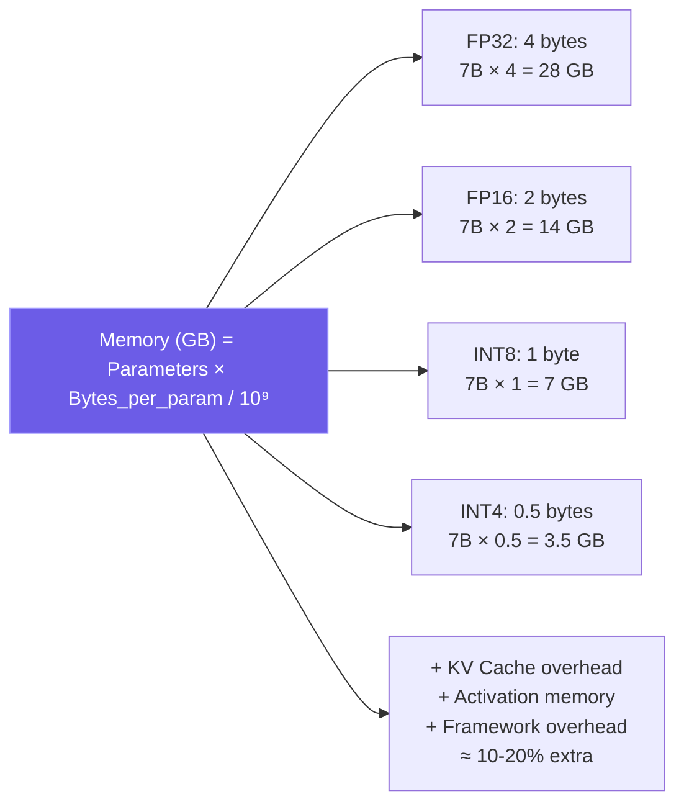

---

## 5. Quality vs Speed Tradeoff

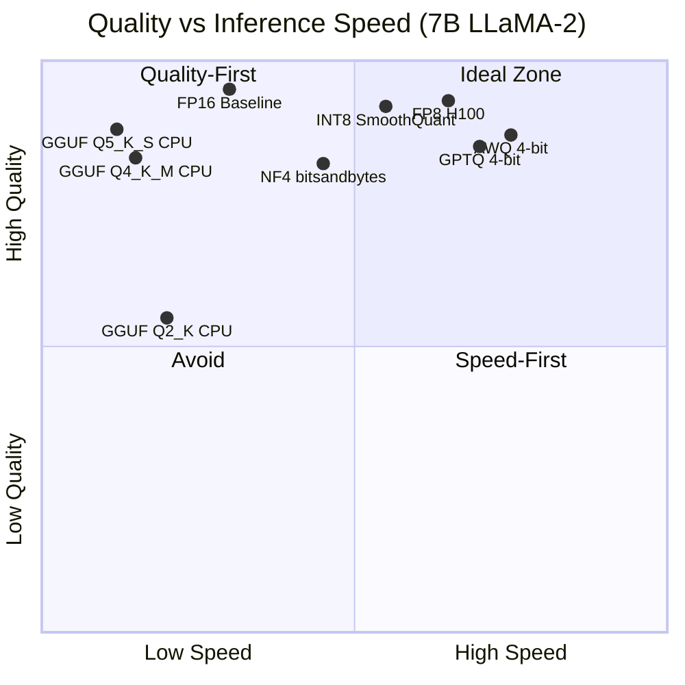

### Detailed Quality Metrics

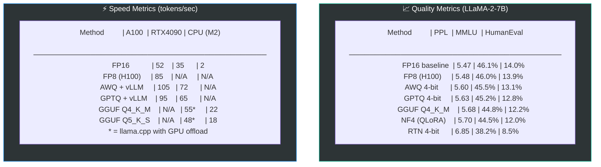

---

## 6. Deployment Options Architecture

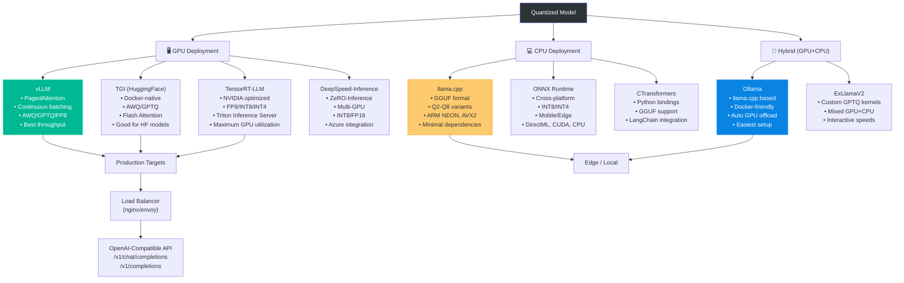

### Deployment Decision Matrix

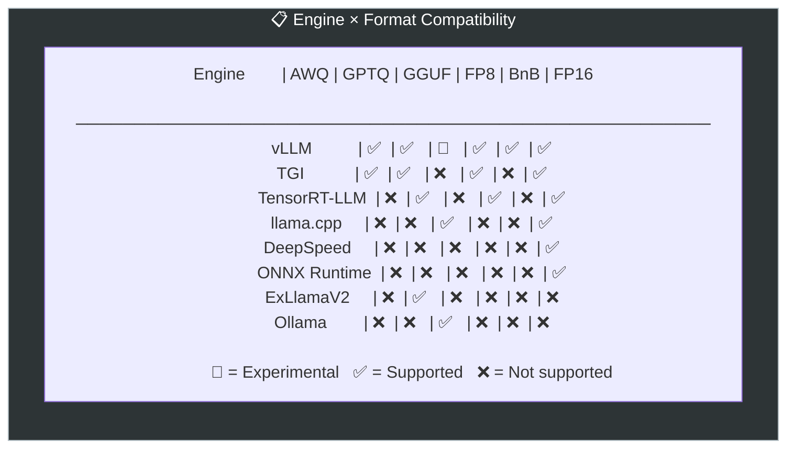

---

## 7. Decision Tree: Which Quantization Method to Use

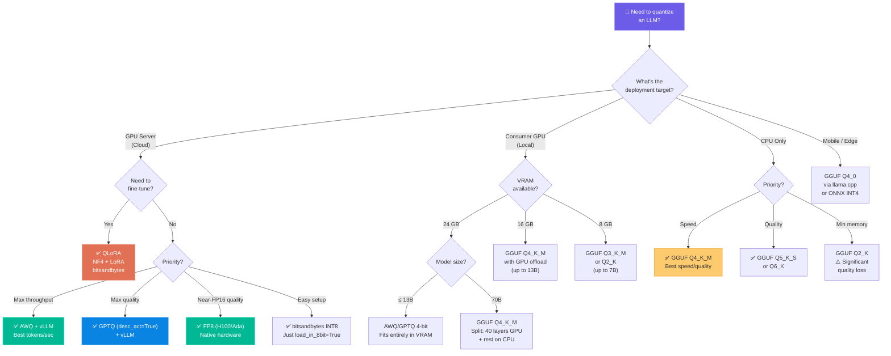

---

## 8. Learning Path

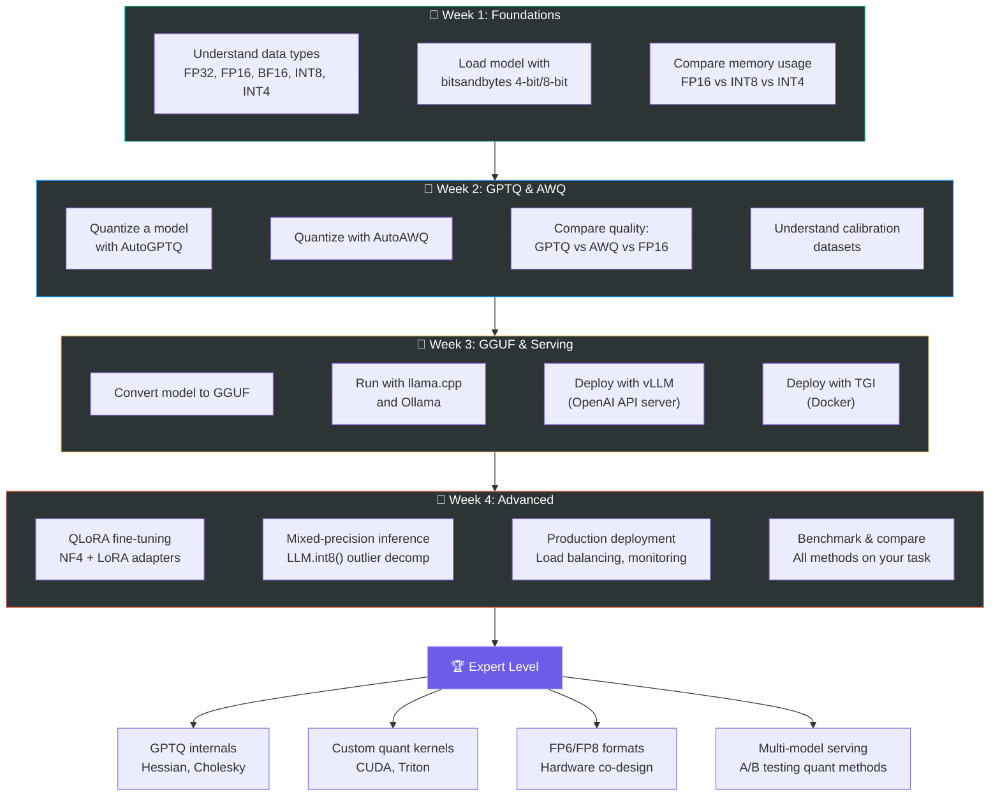

### QLoRA Training Pipeline

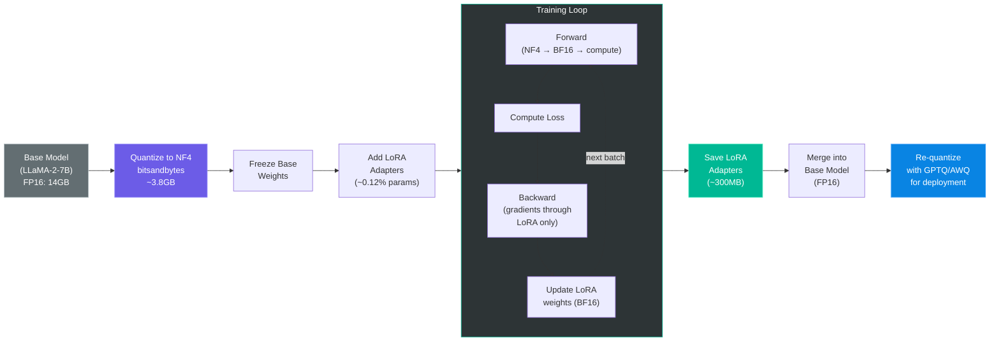

### Data Type Precision Spectrum

```mermaid
graph LR
    subgraph SPECTRUM ["📏 Precision Spectrum (Bits per Parameter)"]
        direction LR
        FP32["FP32<br/>32 bits<br/>🟢 Training gold std"]
        BF16["BF16<br/>16 bits<br/>🟢 Training + Inference"]
        FP16["FP16<br/>16 bits<br/>🟢 Inference baseline"]
        FP8["FP8<br/>8 bits<br/>🟡 H100 native"]
        INT8["INT8<br/>8 bits<br/>🟡 SmoothQuant"]
        FP6["FP6<br/>6 bits<br/>🟠 Custom kernels"]
        Q5["Q5_K<br/>~5.5 bits<br/>🟠 GGUF variant"]
        NF4["NF4<br/>4 bits<br/>🔴 QLoRA"]
        INT4["INT4<br/>4 bits<br/>🔴 GPTQ/AWQ"]
        Q2["Q2_K<br/>~2.6 bits<br/>⛔ Emergency only"]

        FP32 --- BF16 --- FP16 --- FP8 --- INT8 --- FP6 --- Q5 --- NF4 --- INT4 --- Q2
    end

    style SPECTRUM fill:#1a1a2e,stroke:#e94560,color:#fff
    style FP32 fill:#00b894,stroke:#55efc4,color:#fff
    style BF16 fill:#00b894,stroke:#55efc4,color:#fff
    style FP16 fill:#00b894,stroke:#55efc4,color:#fff
    style FP8 fill:#fdcb6e,stroke:#f39c12,color:#333
    style INT8 fill:#fdcb6e,stroke:#f39c12,color:#333
    style NF4 fill:#e17055,stroke:#fab1a0,color:#fff
    style INT4 fill:#e17055,stroke:#fab1a0,color:#fff
    style Q2 fill:#d63031,stroke:#ff7675,color:#fff
```
