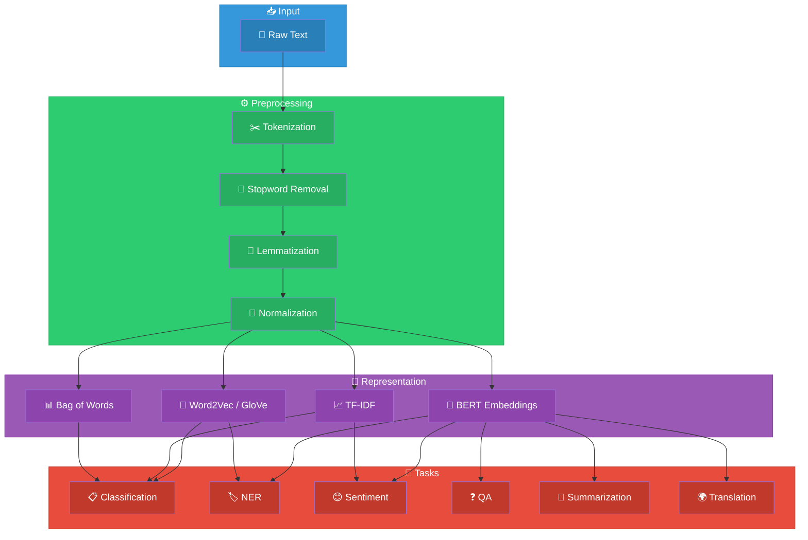
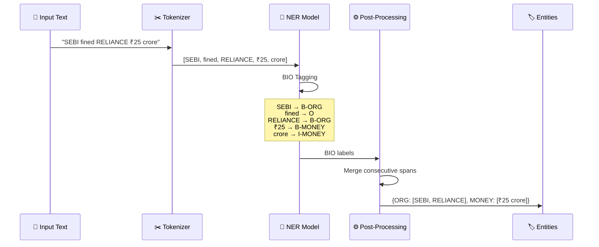
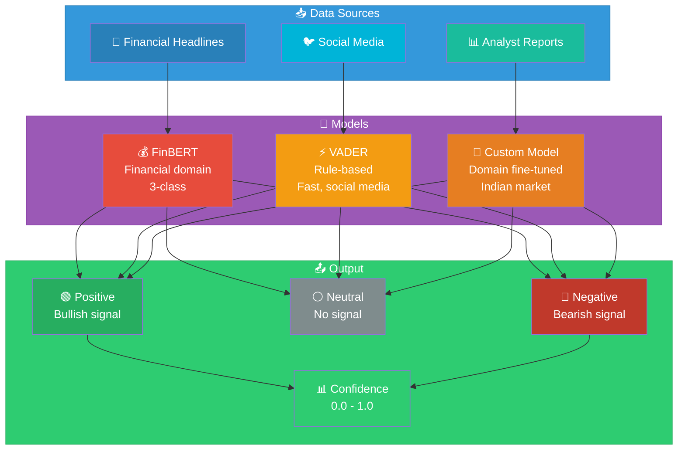
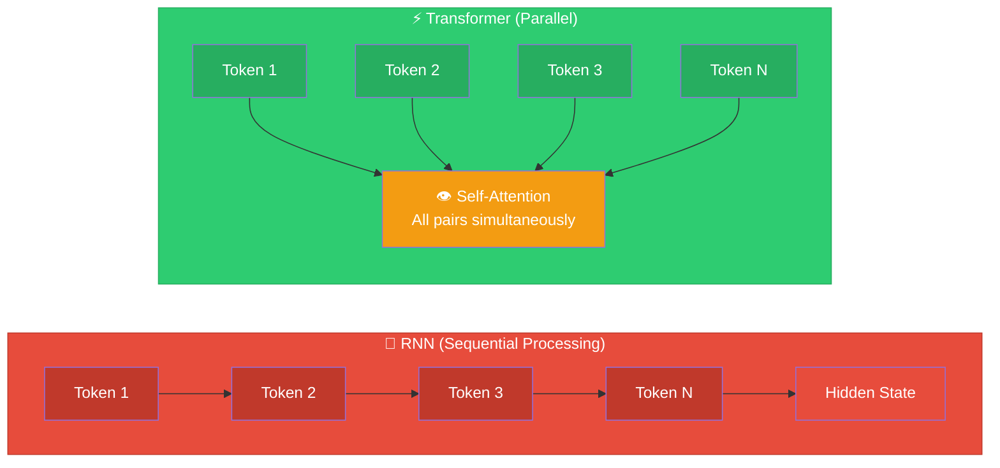
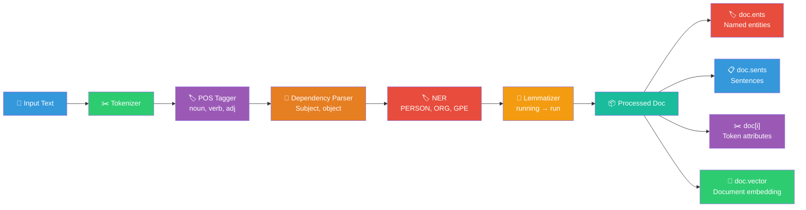
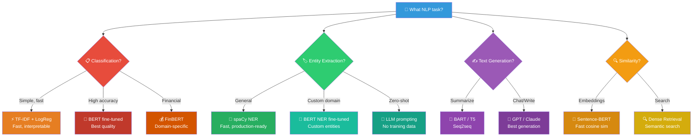
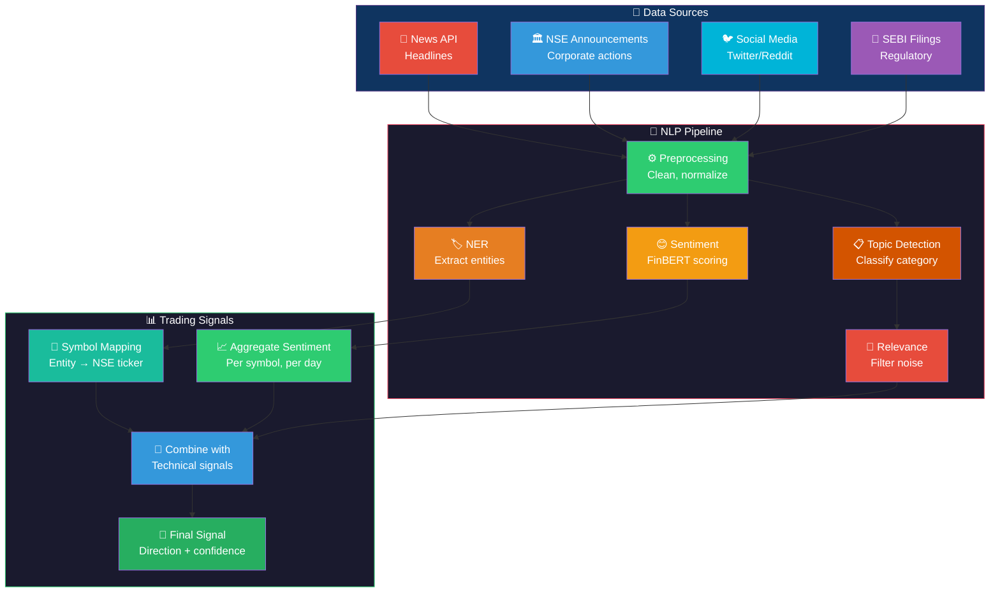
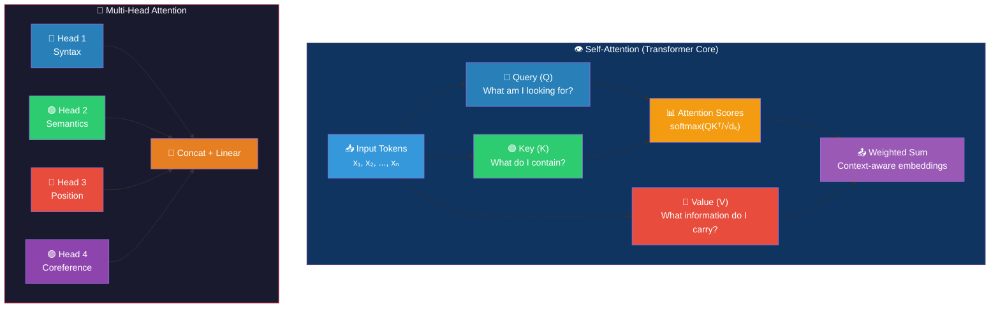
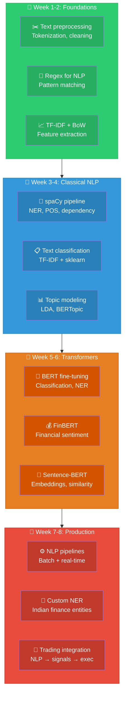

# NLP: Visual Guide & Architecture Diagrams

## 1. NLP Pipeline Architecture

## 2. Text Representation Evolution

```mermaid
flowchart LR
    subgraph Era1["📜 Era 1: Sparse (Pre-2013)"]
        BOW2["📊 Bag of Words<br/>One-hot encoding<br/>High-dimensional"]
        TFIDF2["📈 TF-IDF<br/>Term importance<br/>Still sparse"]
    end

    subgraph Era2["🧠 Era 2: Dense Static (2013)"]
        W2V2["🔵 Word2Vec<br/>Dense 300-dim<br/>Fixed per word"]
        GLOVE["🟢 GloVe<br/>Co-occurrence<br/>Global statistics"]
    end

    subgraph Era3["⚡ Era 3: Contextual (2018)"]
        ELMO["🟣 ELMo<br/>BiLSTM<br/>Context-dependent"]
        BERT2["🔴 BERT<br/>Transformer encoder<br/>Bidirectional"]
    end

    subgraph Era4["🚀 Era 4: Foundation (2020+)"]
        GPT["🌟 GPT-3/4<br/>Decoder-only<br/>In-context learning"]
        LLM["🧬 Claude / Gemini<br/>Multimodal<br/>Reasoning"]
    end

    BOW2 --> TFIDF2 --> W2V2 --> GLOVE --> ELMO --> BERT2 --> GPT --> LLM

    style Era1 fill:#7F8C8D,color:#fff,stroke:#95A5A6
    style Era2 fill:#3498DB,color:#fff,stroke:#2980B9
    style Era3 fill:#9B59B6,color:#fff,stroke:#8E44AD
    style Era4 fill:#E74C3C,color:#fff,stroke:#C0392B
    style BOW2 fill:#95A5A6,color:#fff
    style TFIDF2 fill:#95A5A6,color:#fff
    style W2V2 fill:#2980B9,color:#fff
    style GLOVE fill:#2ECC71,color:#fff
    style ELMO fill:#8E44AD,color:#fff
    style BERT2 fill:#E74C3C,color:#fff
    style GPT fill:#F39C12,color:#fff
    style LLM fill:#E67E22,color:#fff
```

## 3. NER Flow

## 4. Sentiment Analysis Pipeline

## 5. Transformer vs RNN Comparison

## 6. spaCy Processing Pipeline

## 7. Model Selection Guide

## 8. Financial NLP Architecture

## 9. Attention Mechanism Deep Dive

## 10. Learning Path

