# OpenAI GPT Models - Visual Architecture & Patterns Guide

## 1. OpenAI API Architecture Overview

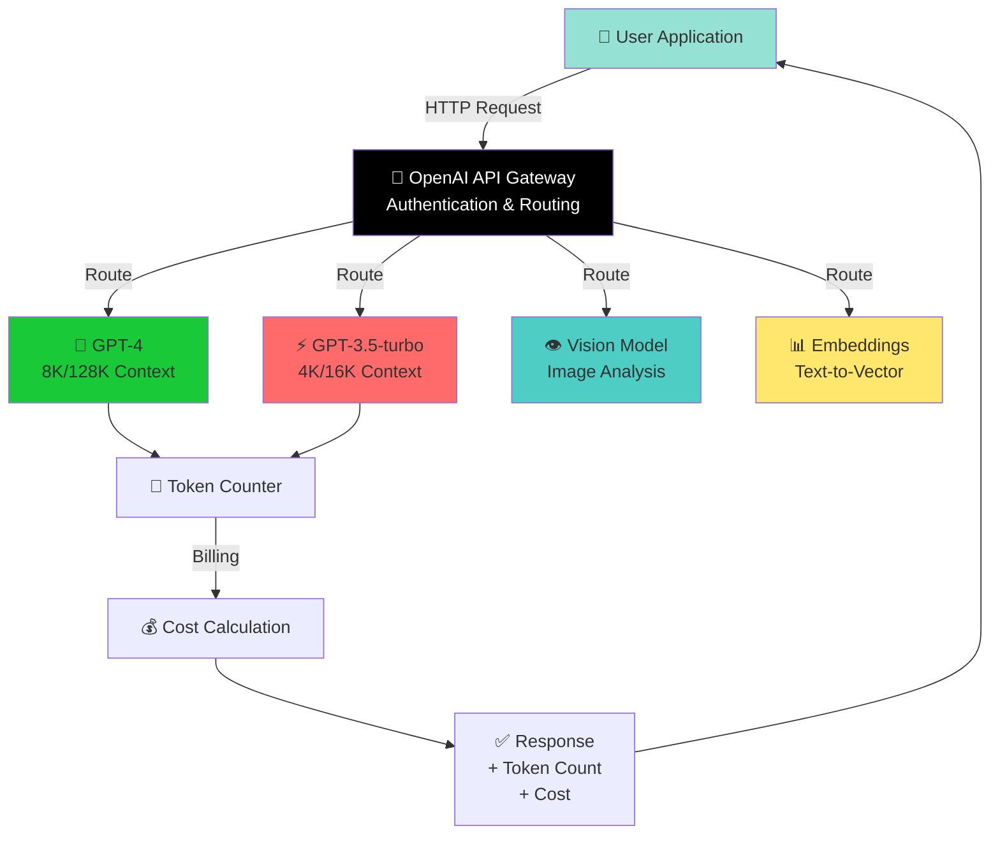

---

## 2. Request-Response Flow

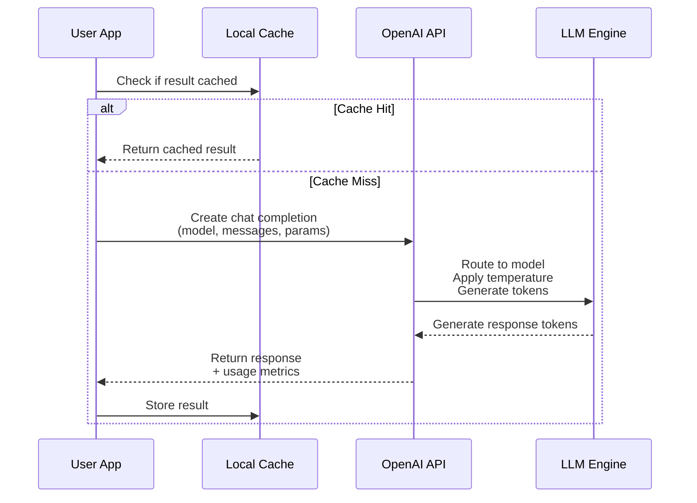

---

## 3. Model Comparison Matrix

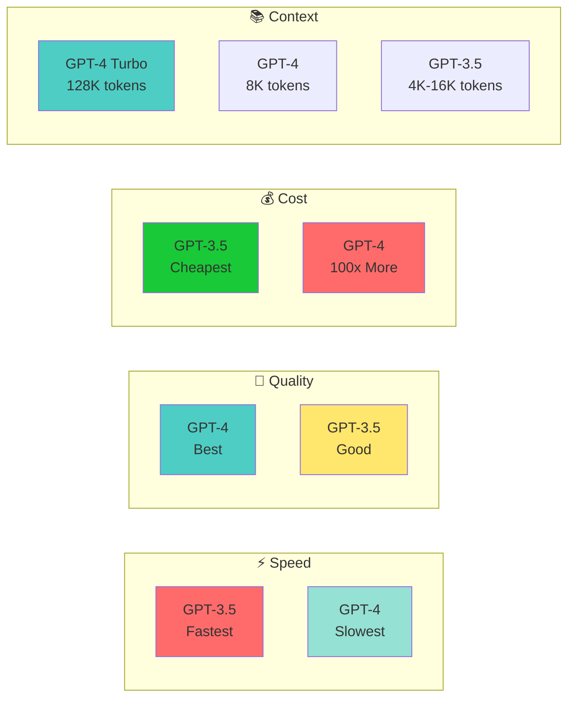

---

## 4. Temperature Impact Spectrum

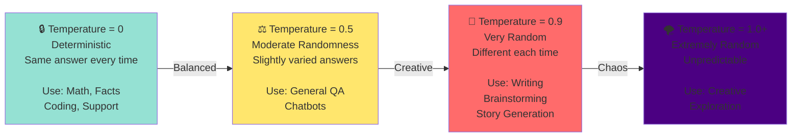

---

## 5. Token Counting Flow

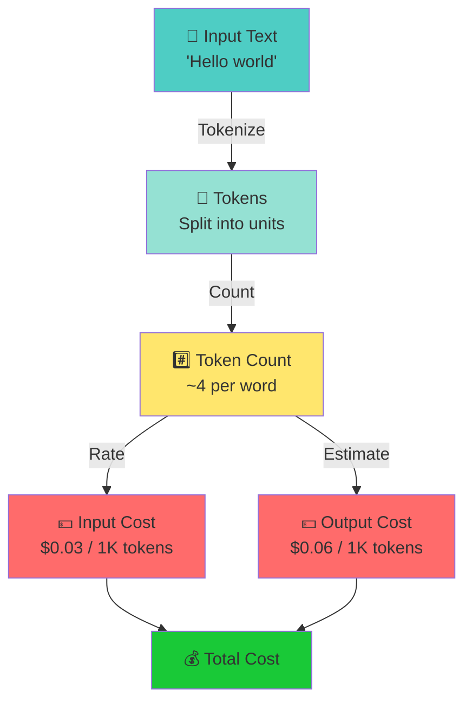

---

## 6. Function Calling Flow (Tool Use)

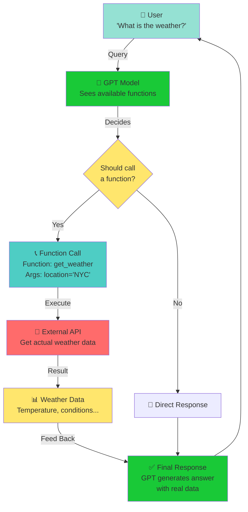

---

## 7. RAG (Retrieval Augmented Generation) Pipeline

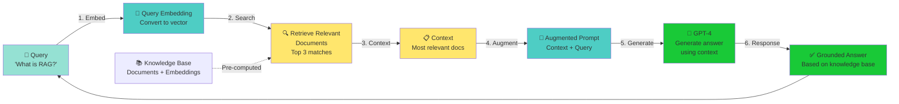

---

## 8. System Prompt Impact

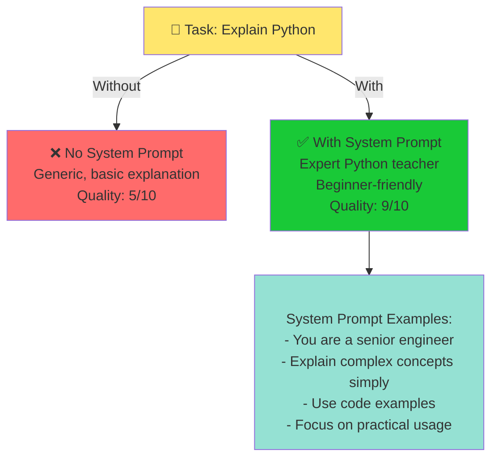

---

## 9. Cost Optimization Strategy

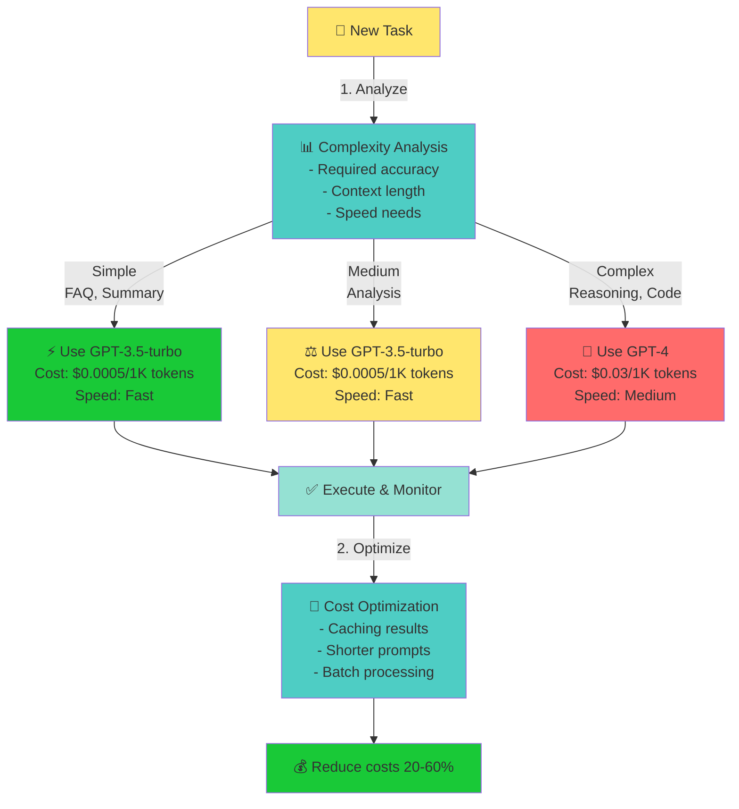

---

## 10. Production Architecture Pattern

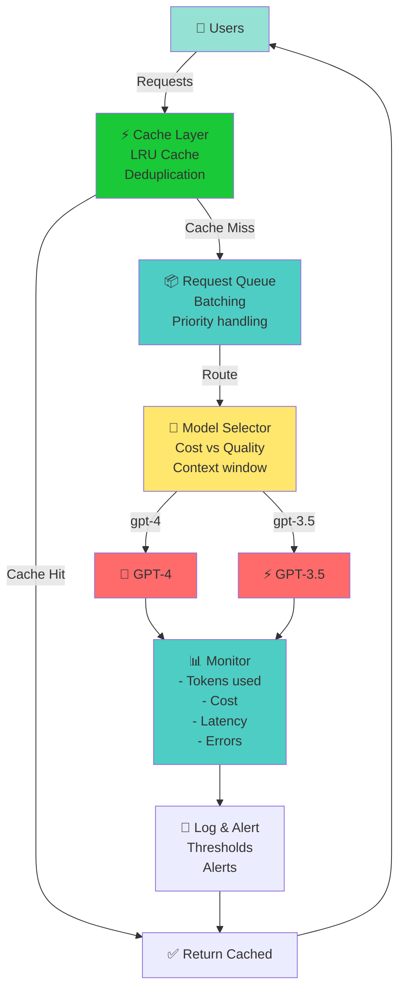

---

## 11. Embedding & Semantic Search

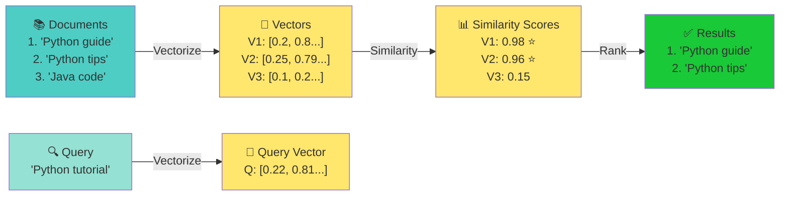

---

## 12. Vision Model Integration

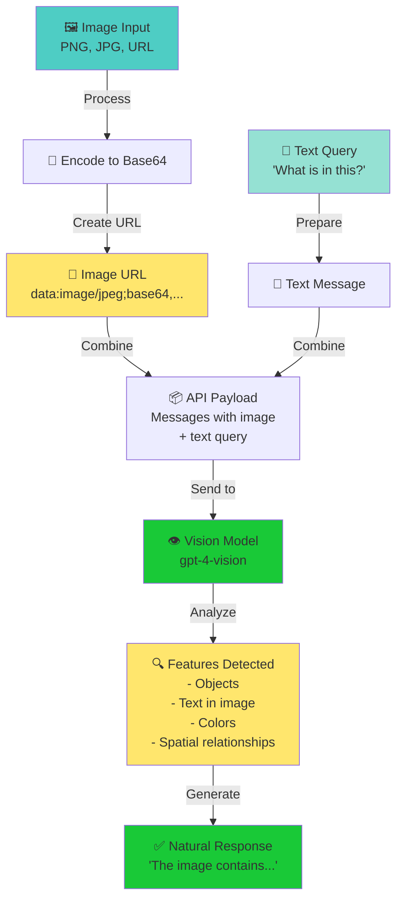

---

## 13. Fine-Tuning Process

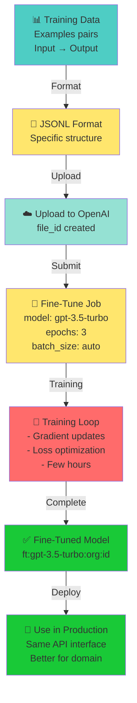

---

## 14. Error Handling & Retry Strategy

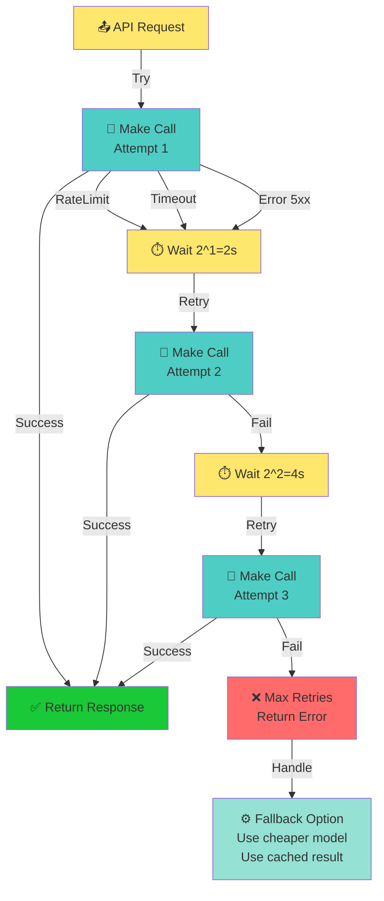

---

## 15. Learning Path: Beginner to Advanced

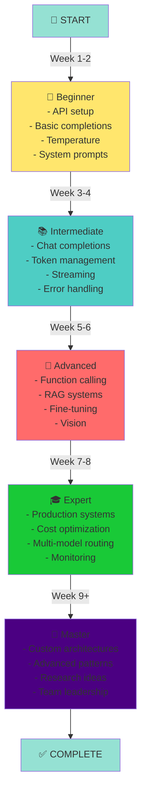

---

## 16. Streaming Responses Timeline

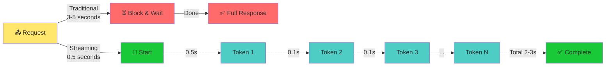

---

## 17. Prompt Engineering Impact

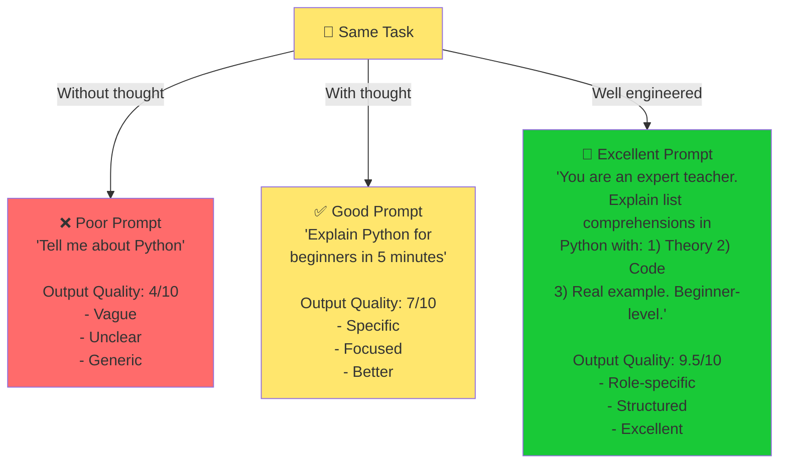

---

## 18. Token Usage Distribution

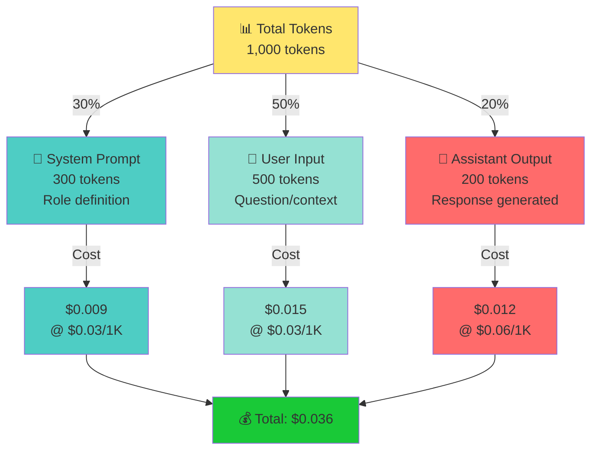

---

## 19. Model Selection Decision Tree

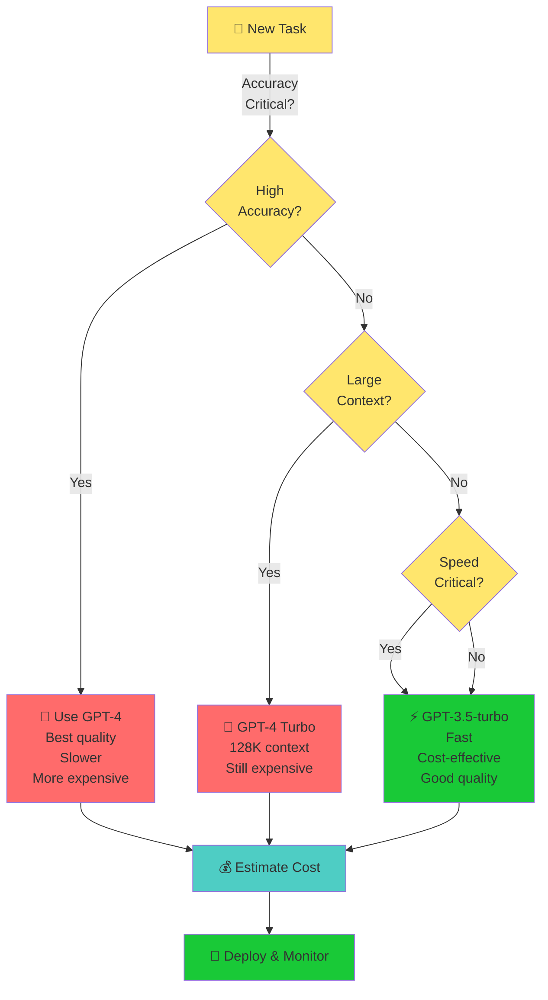

---

## 20. Cost vs Quality Trade-off

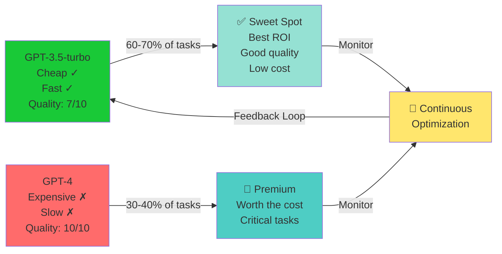

---

## Key Takeaways from Visuals

1. **Architecture**: Simple request-response with intelligent routing
2. **Temperature**: Critical for controlling output behavior
3. **Tokens**: Key to understanding costs and limits
4. **RAG**: Powerful pattern for grounded generation
5. **Production**: Requires caching, monitoring, and error handling
6. **Cost**: Model selection is the biggest cost lever
7. **Quality**: Prompt engineering often better than model upgrading
8. **Flow**: Understand the complete pipeline for optimization

