# PEFT & Fine-Tuning: Visual Guide & Architecture Diagrams

## 1. PEFT Ecosystem Overview

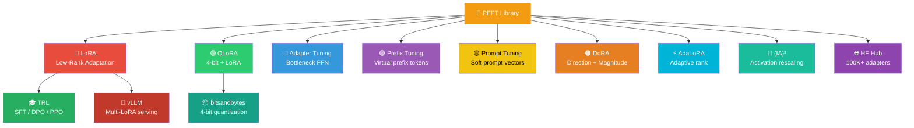

## 2. LoRA Architecture — Inside a Transformer Layer

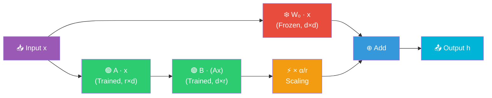

## 3. QLoRA Pipeline

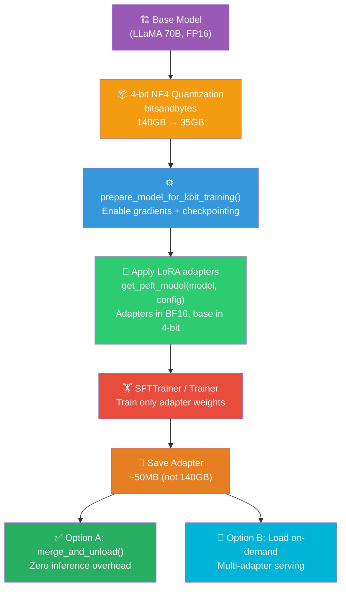

## 4. PEFT Method Placement in Transformer

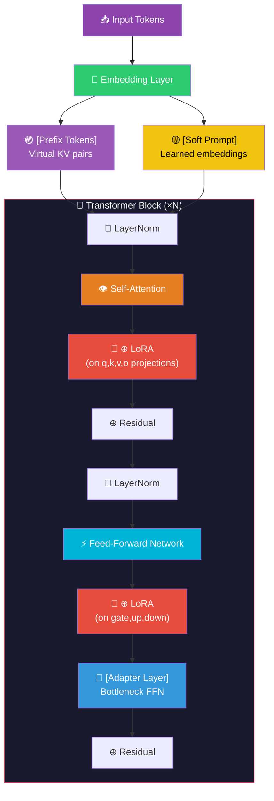

## 5. PEFT Method Decision Tree

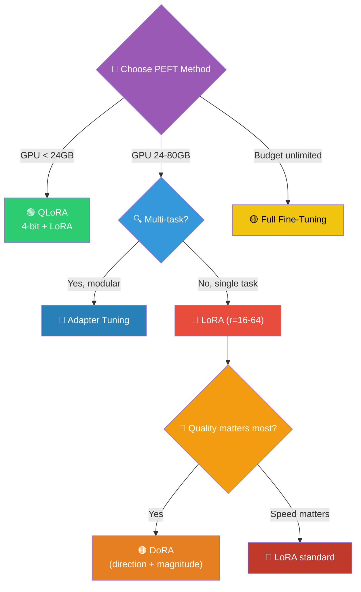

## 6. Memory Comparison

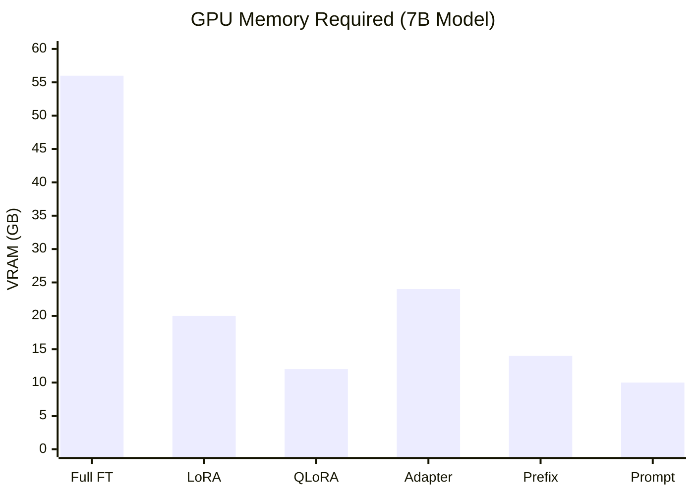

## 7. Multi-Adapter Serving Architecture

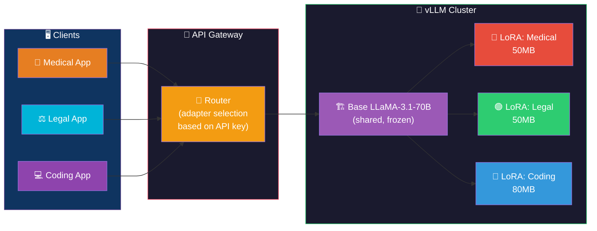

## 8. Training Pipeline

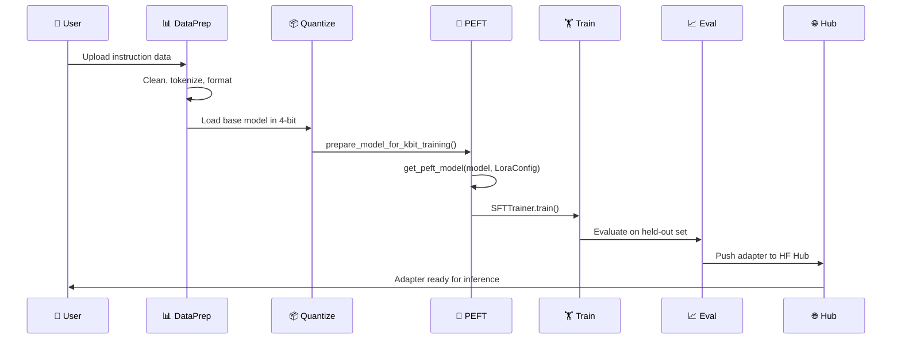

## 9. LoRA Rank vs Quality Tradeoff

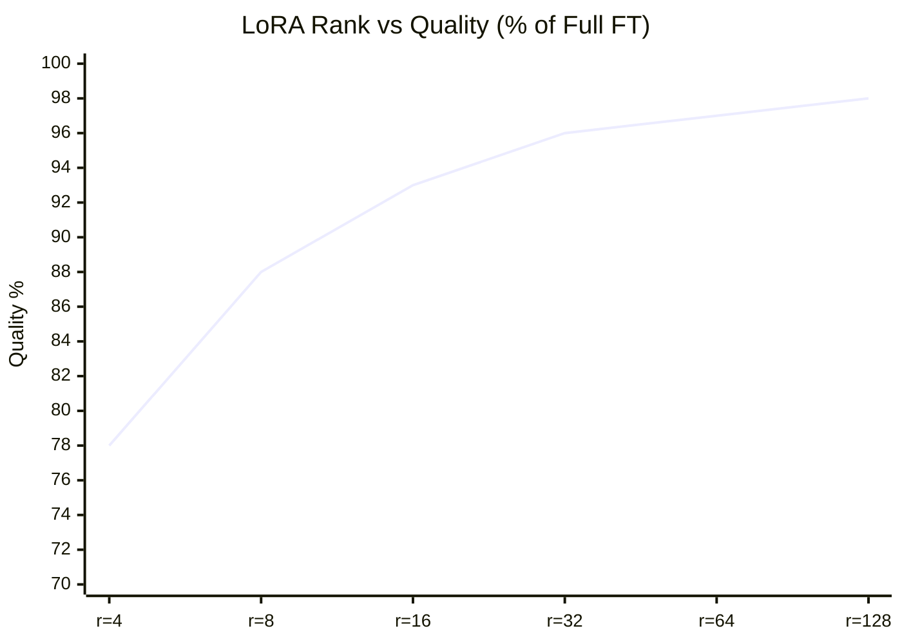

## 10. Financial LoRA: Fine-Tuning for NSE Trading

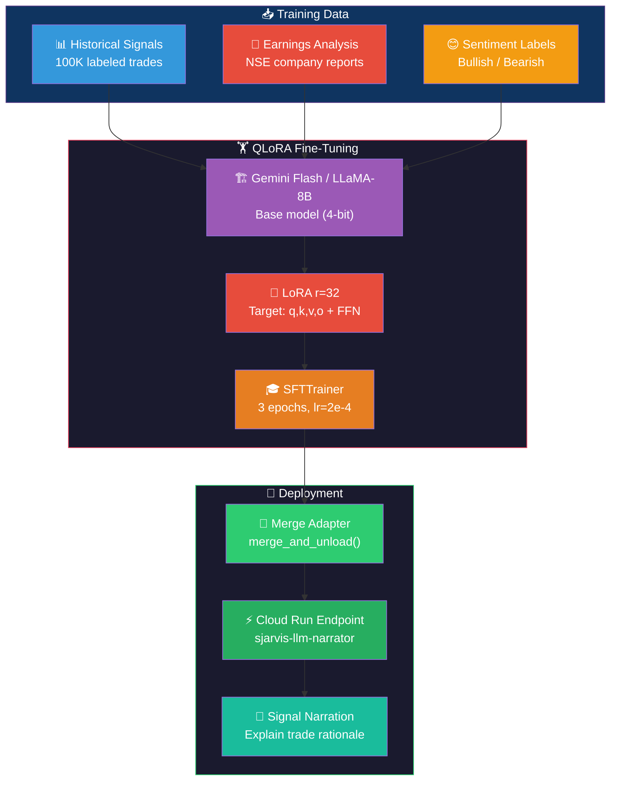

## 11. PEFT Comparison Matrix

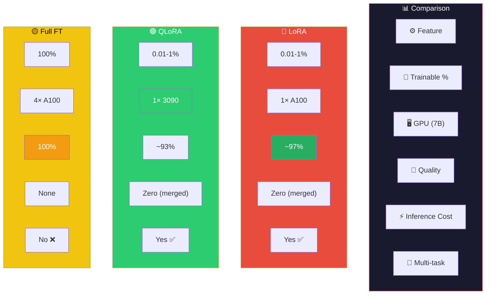

## 12. Learning Path

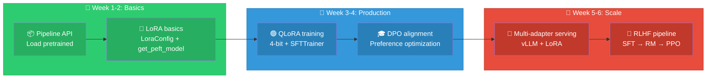
