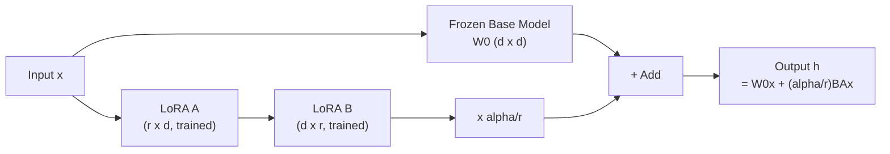

# PEFT / LoRA Fine-Tuning -- Cheatsheet

## Architecture (30-second mental model)

## When to use vs alternatives
| Need | Use | Not |
|------|-----|-----|
| Adapt LLM to your domain, limited GPU | QLoRA (4-bit + LoRA) | Full fine-tuning (8x GPU cost) |
| Best quality, budget unlimited | Full fine-tuning | LoRA (slightly lower quality ceiling) |
| Serve many tasks from one base model | Multi-adapter LoRA + vLLM | Separate model copies (wasteful) |
| Extremely lightweight, quick experiments | Prompt Tuning | LoRA (heavier, but much better quality) |
| Massive domain shift (English to code to clinical) | Continued pre-training + LoRA | LoRA alone (insufficient for large shifts) |

## 5 things you always forget
1. Always call `prepare_model_for_kbit_training(model)` BEFORE `get_peft_model()` on quantized models -- skipping it causes silent OOM or NaN loss
2. LoRA learning rate should be 1e-4 to 2e-4 (10x higher than full fine-tuning's 2e-5) -- using the full-FT rate means the model barely moves
3. `lora_alpha` acts as a scaling factor: effective scale = alpha/r, so alpha=32 with r=16 gives 2x -- it is NOT a learning rate
4. `model.save_pretrained()` on a PEFT model saves only the 50MB adapter, not the 14GB base -- but `merge_and_unload()` first if you want a standalone model
5. Use `target_modules="all-linear"` for best quality -- targeting only q_proj/v_proj leaves 30% of potential performance on the table

## Interview killer answer
> "We run QLoRA fine-tuning for enterprise customers on a single A100 -- 4-bit NF4 quantization with double quant brings a 70B model down to 40GB VRAM, then LoRA adapters at r=32 on all-linear modules train in 8 hours. Each adapter is 80MB, versioned on our artifact store, and hot-loaded into vLLM per request. The critical gotcha was setting compute_dtype to bfloat16, not float16, because float16 caused gradient instability on longer sequences during PPO alignment."
