# Autonomous AI Software Engineer — Complete Project Guide

**Version:** 1.0 | **Date:** March 6, 2026 | **Project Duration:** Mar 3 – Jun 2, 2026

---

## Table of Contents

1. [Project Overview](#1-project-overview)
2. [Installation & Setup](#2-installation--setup)
3. [Environment Configuration](#3-environment-configuration)
4. [Architecture & Module Plan](#4-architecture--module-plan)
5. [Code Plan (Module-by-Module)](#5-code-plan-module-by-module)
6. [Test Plan](#6-test-plan)
7. [Deployment Plan](#7-deployment-plan)
8. [Monitoring & Observability](#8-monitoring--observability)
9. [GenAI Skills Usage Strategy](#9-genai-skills-usage-strategy)
10. [Phase-by-Phase Execution Timeline](#10-phase-by-phase-execution-timeline)
11. [Risk & Mitigation](#11-risk--mitigation)
12. [Cost Strategy](#12-cost-strategy)

---

## 1. Project Overview

Build an autonomous coding agent that: accepts GitHub issues / Jira tickets / CLI tasks, understands entire codebases via RAG, plans multi-step implementations, generates multi-file code, runs and fixes tests, and creates pull requests — all with minimal human intervention.

### Success Metrics

| Metric | Target |
|--------|--------|
| Task completion rate | > 70% autonomous |
| Code quality (lint + review) | > 8/10 |
| Test pass rate | > 95% |
| Time from task to PR | < 30 minutes |
| Cost per task | < $2 |

---

## 2. Installation & Setup

### 2.1 Prerequisites

```mermaid
flowchart LR
    subgraph PREREQ["✅ Prerequisites"]
        style PREREQ fill:#1a3a2e,color:#e0e0e0,stroke:#4caf50,stroke-width:2px
        PY["Python 3.11+"]:::green
        DOC["Docker 24+"]:::blue
        GIT["Git 2.40+"]:::grey
        NODE["Node.js 20+<br/>(for JS projects)"]:::green
    end

    subgraph KEYS["🔑 API Keys Required"]
        style KEYS fill:#3a2a1a,color:#e0e0e0,stroke:#ff9800,stroke-width:2px
        OAI["OpenAI API Key<br/>GPT-4o, embeddings"]:::orange
        ANT["Anthropic API Key<br/>Claude Opus + Sonnet"]:::purple
        GEM["Google AI Key<br/>Gemini Flash"]:::blue
        PIN["Pinecone API Key"]:::teal
        GHA["GitHub Token<br/>repo + issues scope"]:::grey
    end

    PREREQ --> KEYS

    classDef blue fill:#2196F3,color:#fff,stroke:#1565C0
    classDef green fill:#4CAF50,color:#fff,stroke:#2E7D32
    classDef orange fill:#FF9800,color:#fff,stroke:#E65100
    classDef purple fill:#9C27B0,color:#fff,stroke:#6A1B9A
    classDef teal fill:#009688,color:#fff,stroke:#00695C
    classDef grey fill:#546E7A,color:#fff,stroke:#37474F
```

### 2.2 Setup Steps

1. **Clone repository** and create virtual environment
2. **Install Python dependencies** via Poetry/pip (LangGraph, LangChain, LlamaIndex, Pinecone, OpenAI, Anthropic, Google GenAI)
3. **Install system dependencies** — Docker, Tree-sitter, Node.js
4. **Configure environment variables** — `.env` file with all API keys
5. **Initialize Pinecone index** — create code-vectors index (1536 dims, cosine metric)
6. **Build Docker sandbox image** — pre-built container for code execution
7. **Verify setup** — run health check script

### 2.3 Directory Structure Plan

```
ai-software-engineer/
├── src/
│   ├── agents/              # 5 agent implementations
│   │   ├── planner.py
│   │   ├── coder.py
│   │   ├── tester.py
│   │   ├── reviewer.py
│   │   └── documenter.py
│   ├── orchestrator/        # LangGraph state machine
│   │   ├── graph.py
│   │   ├── state.py
│   │   └── router.py
│   ├── knowledge/           # RAG + codebase indexing
│   │   ├── indexer.py
│   │   ├── retriever.py
│   │   ├── embeddings.py
│   │   └── tree_sitter_parser.py
│   ├── sandbox/             # Docker execution environment
│   │   ├── executor.py
│   │   ├── file_system.py
│   │   └── terminal.py
│   ├── safety/              # Guardrails + validation
│   │   ├── guardrails.py
│   │   ├── security_scanner.py
│   │   └── cost_tracker.py
│   ├── integrations/        # External connectors
│   │   ├── github_client.py
│   │   ├── jira_client.py
│   │   └── slack_client.py
│   └── utils/               # Shared utilities
├── config/                  # YAML/JSON configs
├── tests/                   # Comprehensive test suite
├── docker/                  # Sandbox Dockerfiles
├── docs/                    # Architecture + API docs
├── scripts/                 # Setup + maintenance scripts
└── pyproject.toml
```

---

## 3. Environment Configuration

### 3.1 Environment Variables

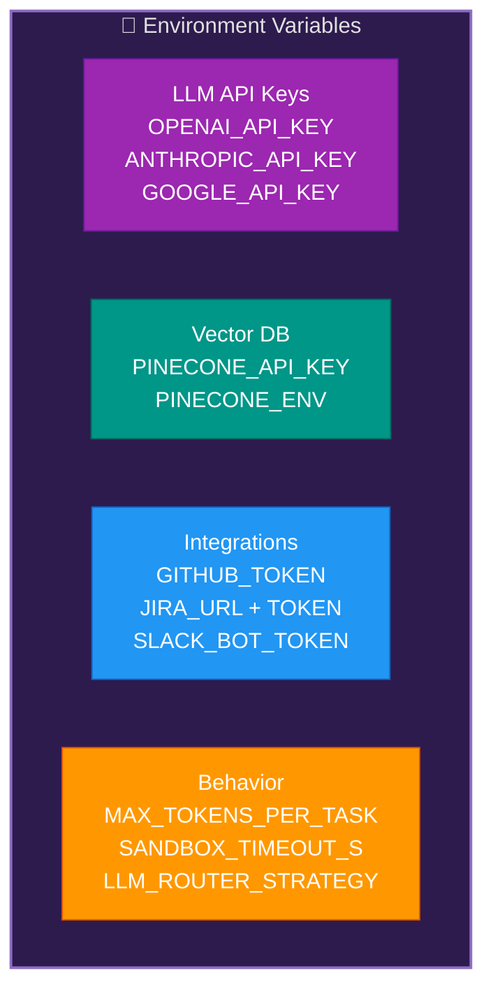

### 3.2 Model Routing Configuration

| Agent | Primary Model | Fallback | Max Tokens | Temperature |
|-------|--------------|----------|------------|-------------|
| Planner | Claude Opus 4 | GPT-4o | 8K | 0.3 |
| Coder | GPT-4o | DeepSeek-Coder-33B | 16K | 0.2 |
| Tester | Gemini Flash | GPT-4o-mini | 4K | 0.1 |
| Reviewer | Claude Sonnet 4 | GPT-4o | 8K | 0.2 |
| Documenter | GPT-4o-mini | Claude Haiku | 4K | 0.4 |

---

## 4. Architecture & Module Plan

### 4.1 Complete Module Flow

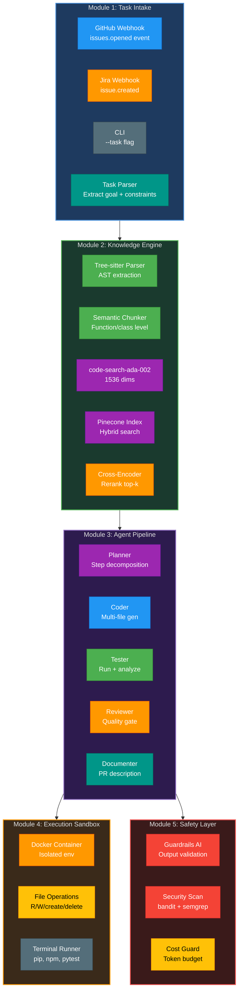

---

## 5. Code Plan (Module-by-Module)

> **Note:** This section describes WHAT to build and HOW to structure it — no actual code.

### 5.1 Module 1: Task Intake

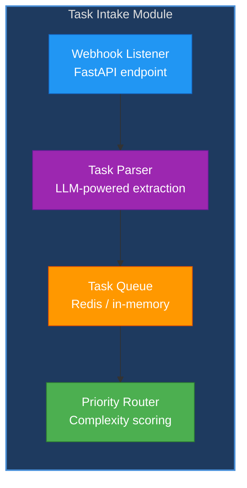

**Files to create:**
- `task_listener.py` — FastAPI webhook for GitHub/Jira
- `task_parser.py` — LLM call to extract goal, constraints, affected files
- `task_queue.py` — Priority queue with complexity scoring
- `task_router.py` — Route to correct agent pipeline based on task type

### 5.2 Module 2: Knowledge Engine

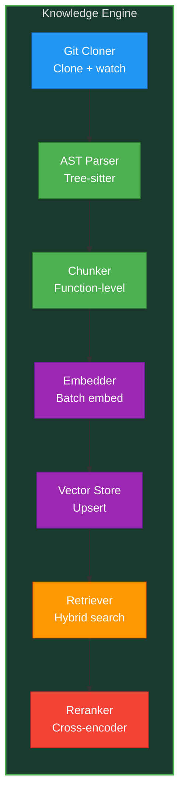

**Files to create:**
- `indexer.py` — Git clone, file walker, incremental re-indexing
- `tree_sitter_parser.py` — Parse Python/JS/TS into function-level chunks
- `embeddings.py` — Batch embed chunks with code-search-ada-002
- `pinecone_store.py` — Upsert/query Pinecone with metadata filters
- `retriever.py` — Hybrid search (semantic + BM25 keyword)
- `reranker.py` — Cross-encoder reranking of top-50 → top-10

### 5.3 Module 3: Agent Pipeline

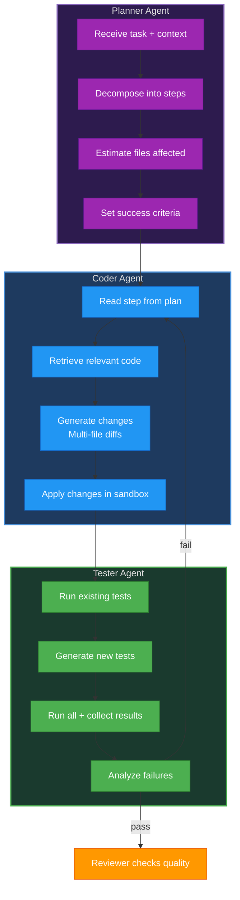

**Files to create per agent:**
- `planner.py` — Prompt template, plan structure, step decomposition
- `coder.py` — Code generation, diff application, multi-file support
- `tester.py` — Test runner, failure analysis, test generation
- `reviewer.py` — Quality rubric, pattern checking, LGTM/reject
- `documenter.py` — PR description, changelog, inline comments

### 5.4 Module 4: Execution Sandbox

**Files to create:**
- `sandbox_manager.py` — Docker container lifecycle (create, exec, destroy)
- `file_system.py` — Sandboxed file R/W through Docker volumes
- `terminal.py` — Command execution with timeout + output capture
- `resource_monitor.py` — CPU/memory/disk usage monitoring per sandbox

### 5.5 Module 5: Safety & Quality

**Files to create:**
- `guardrails.py` — Guardrails AI validators for code output
- `security_scanner.py` — Run bandit/semgrep, parse results
- `cost_tracker.py` — Token counting per agent, budget enforcement
- `quality_gate.py` — Aggregate pass/fail decision from all safety checks

### 5.6 Module 6: LangGraph Orchestrator

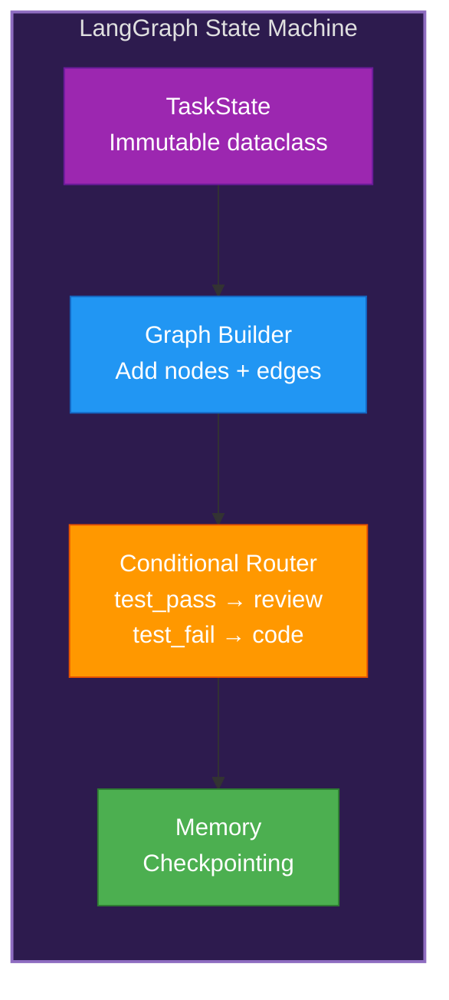

**Files to create:**
- `state.py` — TaskState dataclass (plan, code_changes, test_results, review)
- `graph.py` — Build LangGraph: nodes = agents, edges = conditional routing
- `router.py` — Routing logic (test fail → coder, review fail → coder, review pass → documenter)
- `checkpointer.py` — Save/resume state for long-running tasks

---

## 6. Test Plan

### 6.1 Test Strategy Overview

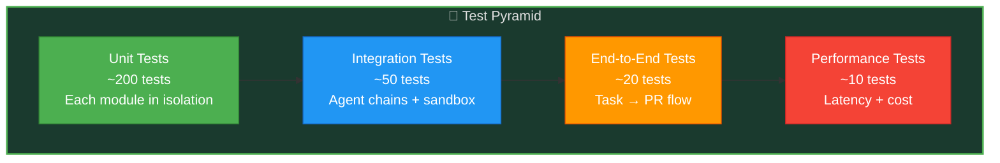

### 6.2 Unit Tests (~200)

| Module | Tests | What to Verify |
|--------|-------|----------------|
| Task Parser | 20 | Correct extraction of goal, constraints, files from issue text |
| Tree-sitter Parser | 25 | Correct AST chunking for Python, JS, TS |
| Embeddings | 10 | Correct dimensions, batch processing |
| Retriever | 20 | Relevant results for known queries |
| Planner Agent | 25 | Plan decomposition quality, step ordering |
| Coder Agent | 30 | Multi-file diff generation, syntax validity |
| Tester Agent | 20 | Test execution result parsing, failure analysis |
| Reviewer Agent | 20 | Quality rubric scoring, pattern detection |
| Sandbox | 15 | File ops, command execution, timeouts |
| Safety | 15 | Guardrails validation, cost limits |

### 6.3 Integration Tests (~50)

| Scenario | Tests | What to Verify |
|----------|-------|----------------|
| Planner → Coder chain | 10 | Plan steps execute in order |
| Coder → Tester → Coder retry | 10 | Retry loop converges within 3 attempts |
| Full agent chain (all 5) | 10 | Task flows from planner to PR |
| RAG pipeline end-to-end | 10 | Index → query → relevant code |
| Sandbox lifecycle | 10 | Create → execute → cleanup |

### 6.4 End-to-End Tests (~20)

| Scenario | Tests | What to Verify |
|----------|-------|----------------|
| Simple bug fix | 5 | One-file change, tests pass, PR created |
| New feature (multi-file) | 5 | Multi-file changes coordinated |
| Refactoring task | 5 | No behavior change, same tests pass |
| Documentation task | 5 | README/docs updated, no code changes |

### 6.5 Performance Tests

| Metric | Target | Method |
|--------|--------|--------|
| Indexing throughput | > 1000 files/minute | Benchmark on 10K file repo |
| Retrieval latency | < 200ms | Measure Pinecone query + rerank |
| Agent pipeline time | < 30 min per task | End-to-end timer |
| Token cost per task | < $2 | Sum all LLM calls |
| Sandbox startup | < 5s | Docker container creation time |

---

## 7. Deployment Plan

### 7.1 Deployment Architecture

```mermaid
flowchart TB
    subgraph DEPLOY["☁️ Deployment"]
        style DEPLOY fill:#1e3a5f,color:#e0e0e0,stroke:#4a90d9,stroke-width:2px

        subgraph LOCAL["Development"]
            style LOCAL fill:#1a3a2e,color:#e0e0e0,stroke:#4caf50
            DEV["Local Docker Compose<br/>All services + Redis + Pinecone dev"]:::green
        end

        subgraph STAGING["Staging"]
            style STAGING fill:#3a2a1a,color:#e0e0e0,stroke:#ff9800
            STAGE_API["API (Cloud Run)"]:::orange
            STAGE_WORK["Workers (Cloud Run Jobs)"]:::orange
            STAGE_DB["Pinecone Dev Index"]:::orange
        end

        subgraph PROD["Production"]
            style PROD fill:#2d1b4e,color:#e0e0e0,stroke:#8e6cc0
            PROD_API["API (Cloud Run)<br/>Auto-scale 0-10"]:::purple
            PROD_WORK["Workers (Cloud Run Jobs)<br/>On-demand"]:::purple
            PROD_DB["Pinecone Production"]:::purple
            PROD_REDIS["Redis (Memorystore)"]:::purple
        end
    end

    LOCAL --> STAGING --> PROD

    classDef green fill:#4CAF50,color:#fff,stroke:#2E7D32
    classDef orange fill:#FF9800,color:#fff,stroke:#E65100
    classDef purple fill:#9C27B0,color:#fff,stroke:#6A1B9A
```

### 7.2 Deployment Steps

| Phase | Action | Environment |
|-------|--------|-------------|
| 1. Build | Docker image build + push to Artifact Registry | CI/CD |
| 2. Helm/Terraform | Deploy Cloud Run service + Jobs | Staging |
| 3. Smoke test | Run 3 sample tasks, verify PRs created | Staging |
| 4. Canary | 10% traffic to new version | Production |
| 5. Full rollout | 100% traffic | Production |
| 6. Monitor | Check metrics for 24h | Production |

### 7.3 CI/CD Pipeline

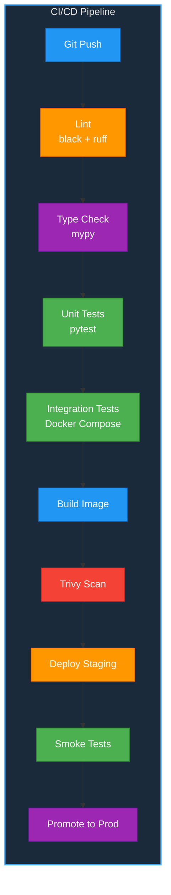

---

## 8. Monitoring & Observability

### 8.1 Monitoring Stack

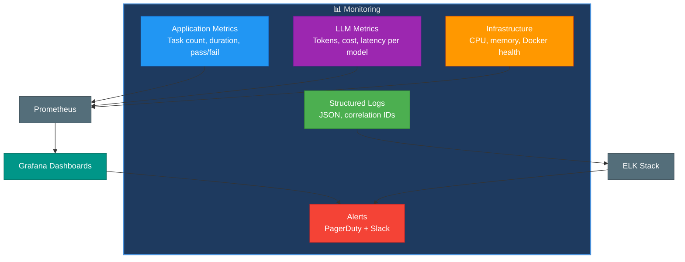

### 8.2 Key Dashboards

| Dashboard | Metrics |
|-----------|---------|
| **Task Pipeline** | Tasks received, in-progress, completed, failed, avg duration |
| **Agent Performance** | Per-agent success rate, retry count, latency |
| **LLM Cost Tracker** | Token usage per model, cost per task, daily burn |
| **Code Quality** | Lint score, test coverage, security issues |
| **Infrastructure** | Container count, CPU/memory usage, API latency |

### 8.3 Alerting Rules

| Alert | Condition | Severity |
|-------|-----------|----------|
| Task failure rate > 50% | 10 min window | Critical |
| LLM cost > $50/day | Daily total | Warning |
| Agent retry > 5x | Per task | Warning |
| Sandbox timeout | Task > 30 min | Error |
| API latency > 5s | P95 latency | Warning |

---

## 9. GenAI Skills Usage Strategy

### 9.1 Skill-to-Module Mapping

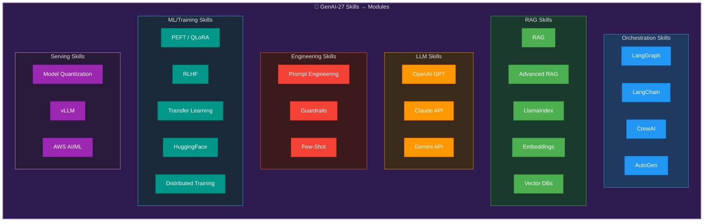

### 9.2 Per-Skill Implementation Strategy

| # | Skill | Implementation Location | How Used |
|---|-------|------------------------|----------|
| 1 | LangGraph | `orchestrator/graph.py` | Agent state machine, conditional edges, checkpointing |
| 2 | LangChain | `agents/*.py`, `sandbox/*.py` | Tool wrappers for file/terminal/browser |
| 3 | CrewAI | `agents/crew.py` | 5-agent team with role delegation |
| 4 | AutoGen | `agents/review_debate.py` | Multi-turn code review discussion |
| 5 | RAG | `knowledge/retriever.py` | Basic codebase context retrieval |
| 6 | Advanced RAG | `knowledge/retriever.py` | HyDE query expansion, hybrid search, cross-encoder rerank |
| 7 | LlamaIndex | `knowledge/indexer.py` | Codebase document indexing and tree-based querying |
| 8 | Embeddings | `knowledge/embeddings.py` | code-search-ada-002 for code similarity |
| 9 | Vector DBs | `knowledge/pinecone_store.py` | Pinecone for scalable code vector storage |
| 10 | OpenAI GPT | `agents/coder.py` | Code generation (GPT-4o) and fast tasks (4o-mini) |
| 11 | Claude API | `agents/planner.py`, `agents/reviewer.py` | Planning (Opus) and code review (Sonnet) |
| 12 | Gemini API | `agents/tester.py` | Fast, cheap test result analysis |
| 13 | Guardrails | `safety/guardrails.py` | Output schema validation, retry-on-fail |
| 14 | Prompt Engineering | All agent files | CoT, persona prompts, structured output |
| 15 | Few-Shot | `agents/coder.py` | Good code pattern examples in prompt |
| 16 | PEFT | `training/finetune.py` | QLoRA on DeepSeek-Coder for domain adaptation |
| 17 | RLHF | `training/rlhf.py` | Self-improvement from PR feedback |
| 18 | Transfer Learning | `training/transfer.py` | General code model → project-specific |
| 19 | HuggingFace | `training/*.py` | Model hub for open-source code models |
| 20 | Keras | `training/classifier.py` | Task complexity classifier |
| 21 | NLP | `knowledge/tree_sitter_parser.py` | Code AST analysis, entity extraction |
| 22 | Distributed Training | `training/distributed.py` | Multi-GPU QLoRA fine-tuning |
| 23 | Model Quantization | `serving/quantize.py` | INT8/INT4 for self-hosted DeepSeek |
| 24 | Inference Engines | `serving/vllm_server.py` | vLLM for fast local inference |
| 25 | AWS AI/ML | `infra/aws/` | SageMaker for training, Bedrock for API access |

---

## 10. Phase-by-Phase Execution Timeline

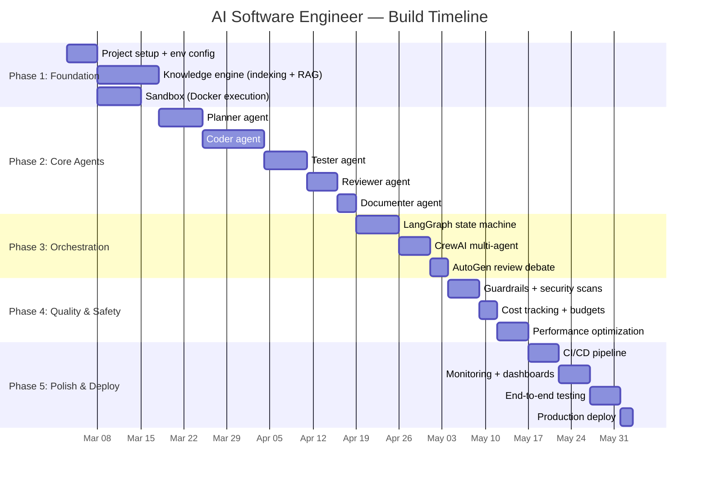

### Deliverables Per Phase

| Phase | Weeks | Key Deliverable |
|-------|-------|-----------------|
| 1 — Foundation | 1-2 | Codebase indexed, sandbox working, RAG returning relevant code |
| 2 — Core Agents | 3-7 | All 5 agents individually tested, generating valid outputs |
| 3 — Orchestration | 8-9 | Full pipeline: task → plan → code → test → review → PR |
| 4 — Quality | 10-11 | Safety gates passing, cost under $2/task, 95%+ test pass |
| 5 — Deploy | 12-13 | Running in production, monitoring live, handling real tasks |

---

## 11. Risk & Mitigation

| Risk | Probability | Impact | Mitigation |
|------|------------|--------|------------|
| LLM generates broken code | High | Medium | 3-retry loop with Tester, Guardrails validation |
| Context window overflow | Medium | High | Smart chunking, token-aware context packing |
| High API costs | Medium | High | Cost tracker, model routing (cheap → expensive), caching |
| Sandbox escape | Low | Critical | Docker isolation, no host network, resource limits |
| Stale codebase index | Medium | Medium | Incremental re-indexing on git push webhook |
| LLM API rate limits | Medium | Medium | Exponential backoff, model fallback routing |

---

## 12. Cost Strategy

| Component | Monthly Estimate | Optimization |
|-----------|-----------------|--------------|
| Claude Opus (Planner) | $50-100 | Cache repeated planning patterns |
| GPT-4o (Coder) | $100-200 | Use GPT-4o-mini for simple tasks |
| Gemini Flash (Tester) | $10-20 | Cheapest model, no optimization needed |
| Pinecone | $70 (Starter) | Serverless tier, scale with usage |
| Docker sandbox | $20-50 | Spot instances, scale-to-zero |
| **Total** | **$250-440/month** | **Target: < $300/month** |
