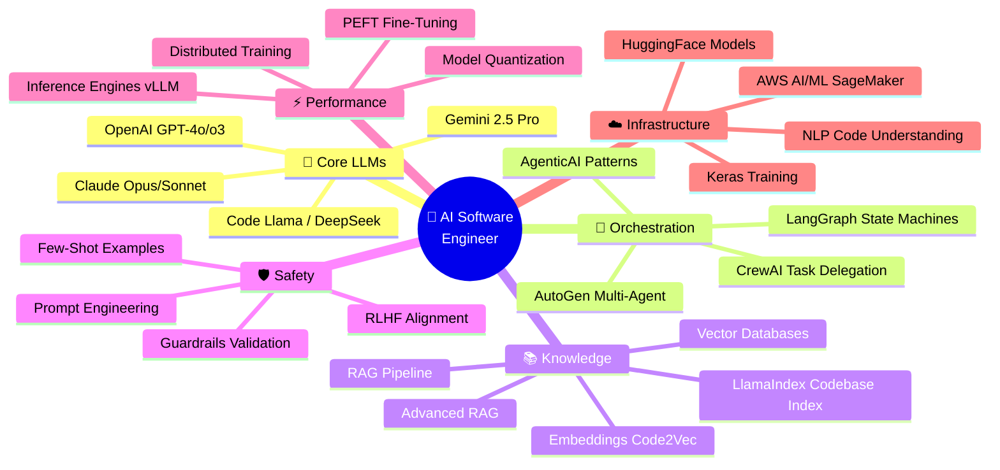
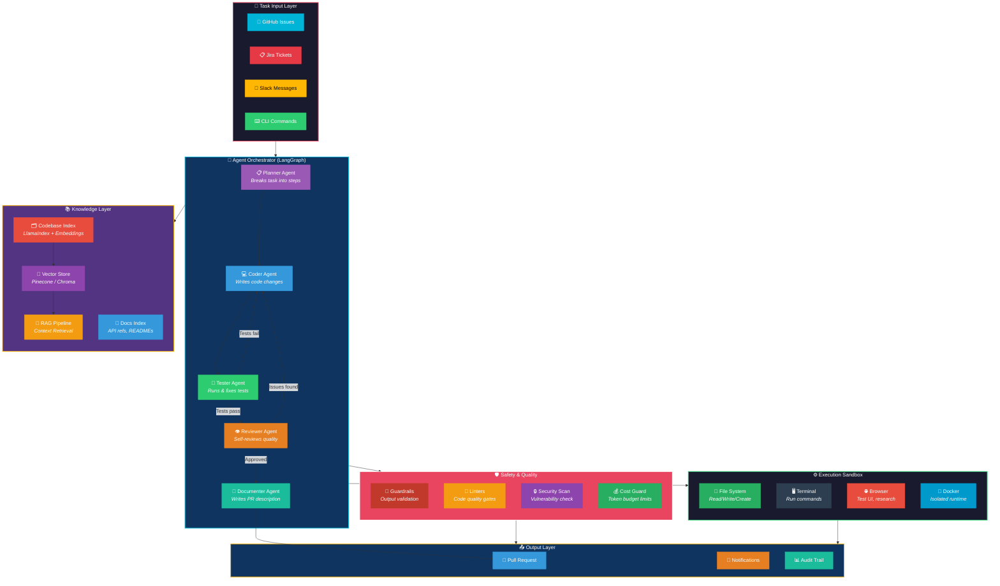
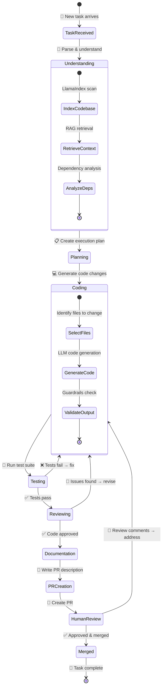
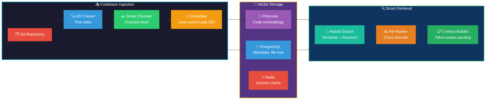
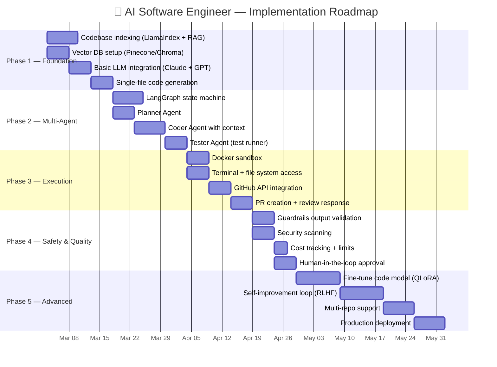

# 🤖 Project 1: Autonomous AI Software Engineer

> **Real-World Inspiration:** Devin (Cognition), OpenHands, Cursor Agents, GitHub Copilot Workspace, Amazon Q Developer
>
> **Status:** Ruling the industry — Cursor used by 3,000+ engineers at Stripe, Devin saving Nubank 20x costs on 6M LOC migration, OpenHands 68K+ GitHub stars

---

## 🌍 What's Happening in the Real World (2025-2026)

| Company | Product | Impact |
|---------|---------|--------|
| **Cognition** | Devin | Autonomous software engineer — plans, codes, tests, deploys. Nubank used army of Devins for 6M LOC migration (8-12x faster, 20x cost savings) |
| **Anysphere** | Cursor | AI-first code editor — 85% of Box engineers use daily, 30-50% roadmap throughput increase. Cloud agents can control their own computers |
| **OpenHands** | OpenHands | Open-source AI-driven development. SDK + CLI + Cloud + Enterprise. 68K stars, 477 contributors |
| **GitHub** | Copilot Agent | Multi-file editing, PR creation, code review. Integrated into VS Code, used by millions |
| **Amazon** | Q Developer | AWS-integrated AI developer — code generation, transformation, debugging, security scanning |
| **Google** | Jules | Asynchronous AI coding agent that works on GitHub issues while you sleep |

---

## 🎯 Project Goal

Build an **Autonomous AI Software Engineer** that can:
1. Accept a task (GitHub issue, Jira ticket, Slack message)
2. Understand the codebase (RAG + embeddings)
3. Plan the implementation (multi-step reasoning)
4. Write code across multiple files
5. Run tests and fix failures
6. Create a PR with description
7. Respond to code review comments

---

## 🧠 GenAI Skills & Tools Involved

---

## 🏗️ System Architecture

---

## 🔄 Agent Workflow (State Machine)

---

## 🤝 Multi-Agent Communication Flow

```mermaid
sequenceDiagram
    participant User as 👤 User
    participant Router as 🔀 Task Router
    participant Planner as 📋 Planner Agent
    participant Knowledge as 📚 Knowledge (RAG)
    participant Coder as 💻 Coder Agent
    participant Tester as 🧪 Tester Agent
    participant Reviewer as 👁️ Reviewer Agent
    participant GitHub as 🐙 GitHub

    User->>Router: "Add dark mode to settings page"
    Router->>Planner: Route task + metadata

    rect rgb(15, 52, 96)
        Note over Planner,Knowledge: 📖 Understanding Phase
        Planner->>Knowledge: Query codebase structure
        Knowledge-->>Planner: File tree, component graph, styles
        Planner->>Knowledge: Find similar implementations
        Knowledge-->>Planner: Existing theme system, CSS vars
    end

    rect rgb(83, 52, 131)
        Note over Planner,Coder: 📋 Planning Phase
        Planner->>Planner: Generate step-by-step plan
        Planner->>Coder: Plan: [1. Add theme context, 2. Update settings UI, 3. Add CSS vars]
    end

    rect rgb(26, 26, 46)
        Note over Coder,Tester: 💻 Implementation Loop
        loop For each step in plan
            Coder->>Knowledge: Get file contents + context
            Knowledge-->>Coder: Current code + patterns
            Coder->>Coder: Generate code changes
            Coder->>Tester: Run tests
            alt Tests fail
                Tester-->>Coder: Error output + stack trace
                Coder->>Coder: Analyze & fix
            else Tests pass
                Tester-->>Reviewer: All green ✅
            end
        end
    end

    rect rgb(233, 69, 96)
        Note over Reviewer,GitHub: 👁️ Review & Ship
        Reviewer->>Reviewer: Check code quality, patterns
        Reviewer->>GitHub: Create PR with description
        GitHub-->>User: PR ready for review
    end
```

---

## 🗄️ Data Architecture

---

## 🛠️ Tech Stack Mapping

| Component | Technology | GenAI Skill Used |
|-----------|-----------|-----------------|
| **Planner Agent** | Claude Opus 4 + chain-of-thought | `ClaudeAPI`, `PromptEngineering`, `AgenticAI` |
| **Coder Agent** | GPT-4o / DeepSeek-Coder | `OpenAI-GPT`, `FewShotZeroShot` |
| **Tester Agent** | Gemini Flash (fast, cheap) | `GeminiAPI`, `PromptEngineering` |
| **Reviewer Agent** | Claude Sonnet (balanced) | `ClaudeAPI`, `Guardrails` |
| **Codebase RAG** | LlamaIndex + Pinecone | `LlamaIndex`, `RAG`, `AdvancedRAG`, `Vector-Databases` |
| **Code Embeddings** | OpenAI text-embedding-3-large | `Embeddings` |
| **Agent Orchestration** | LangGraph state machine | `LangGraph`, `LangChain` |
| **Multi-Agent Framework** | AutoGen v0.4 + CrewAI | `Autogen`, `CrewAI` |
| **Code Understanding** | Tree-sitter + AST analysis | `NLP` |
| **Model Serving** | vLLM for self-hosted models | `InferenceEngines`, `ModelQuantization` |
| **Fine-Tuned Code Model** | QLoRA on DeepSeek-Coder | `PEFT-FineTuning`, `HuggingFace` |
| **Safety Layer** | Guardrails AI + NeMo | `Guardrails`, `RLHF` |
| **Cloud Deployment** | SageMaker + Bedrock | `AWS-AI-ML` |
| **Training Custom Model** | Distributed PyTorch | `DistributedTraining`, `Keras` |
| **Domain Adaptation** | Transfer from general → code | `TransferLearning` |

---

## 📊 Implementation Phases

---

## 🎯 Key Metrics

| Metric | Target | How to Measure |
|--------|--------|---------------|
| Task completion rate | > 70% | % of tasks completed without human intervention |
| Code quality score | > 8/10 | Automated linting + human review score |
| Test pass rate | > 95% | Generated code passes existing + new tests |
| Time-to-PR | < 30 min | From task assignment to PR creation |
| Cost per task | < $2 | Total LLM API cost per completed task |
| Security issues | 0 critical | No vulnerabilities introduced |

---

## 🔗 Related Learning Modules

All 27 GenAI skills contribute to this project:
- **Core:** `OpenAI-GPT`, `ClaudeAPI`, `GeminiAPI` — LLM backbone
- **RAG:** `RAG`, `AdvancedRAG`, `LlamaIndex`, `Embeddings`, `Vector-Databases` — codebase knowledge
- **Agents:** `AgenticAI`, `Autogen`, `CrewAI`, `LangGraph`, `LangChain` — multi-agent orchestration
- **Quality:** `Guardrails`, `PromptEngineering`, `FewShotZeroShot` — output quality
- **Training:** `PEFT-FineTuning`, `RLHF`, `TransferLearning`, `DistributedTraining` — custom models
- **Deployment:** `InferenceEngines`, `ModelQuantization`, `AWS-AI-ML`, `HuggingFace`, `Keras`, `NLP` — production serving
