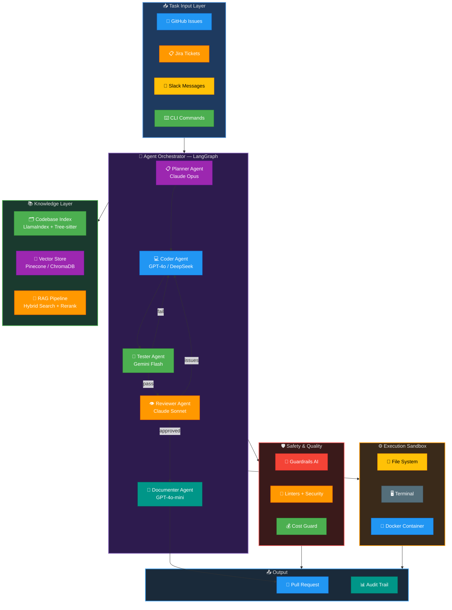
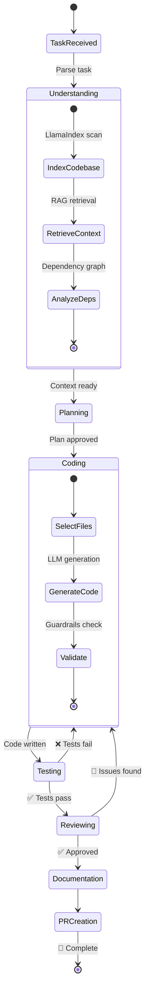
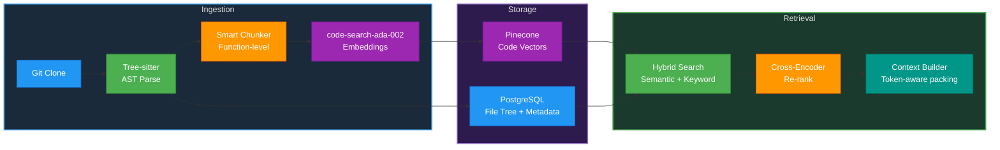
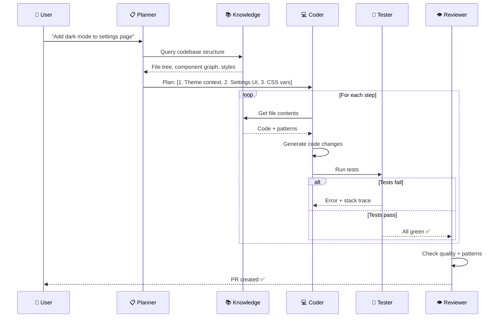
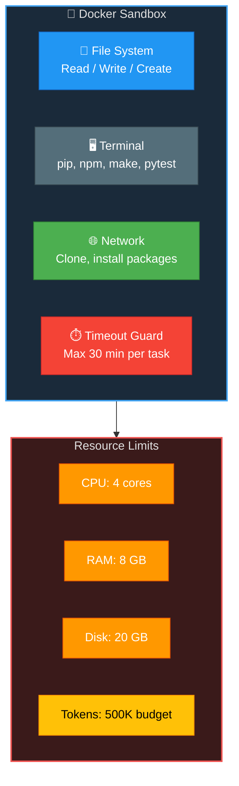
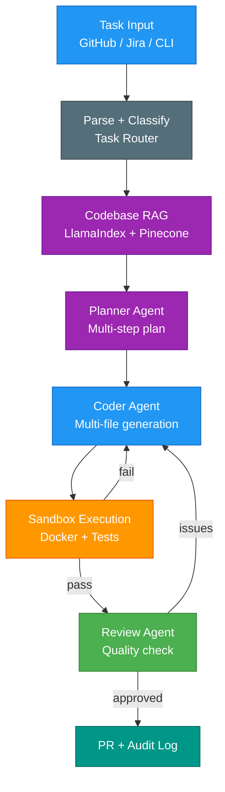

# Autonomous AI Software Engineer — Technical Design Document

**Version:** 1.0 | **Date:** March 6, 2026 | **Status:** Pre-Implementation Blueprint

---

## 1. System Overview

An autonomous coding agent that accepts tasks (GitHub issues, Jira tickets), understands codebases via RAG, plans implementations, writes multi-file code, runs/fixes tests, and creates PRs — inspired by Devin, OpenHands, and Cursor Agents.

---

## 2. High-Level Architecture

---

## 3. Agent State Machine

---

## 4. Module Deep Dives

### 4.1 Codebase Indexing Pipeline

### 4.2 Multi-Agent Communication

### 4.3 Sandbox Execution Environment

### 4.4 Safety & Quality Gates

```mermaid
flowchart LR
    CODE_OUT["Generated Code"] --> GUARD["Guardrails AI<br/>Schema Validation"]:::red
    GUARD --> LINT2["Linters<br/>black, ruff, eslint"]:::orange
    LINT2 --> SEC["Security Scan<br/>bandit, semgrep"]:::red
    SEC --> TYPE["Type Check<br/>mypy / TypeScript"]:::blue
    TYPE --> TEST2["Test Suite<br/>pytest / jest"]:::green
    TEST2 --> REVIEW["Self-Review<br/>Claude Sonnet"]:::purple

    classDef blue fill:#2196F3,color:#fff,stroke:#1565C0
    classDef green fill:#4CAF50,color:#fff,stroke:#2E7D32
    classDef orange fill:#FF9800,color:#fff,stroke:#E65100
    classDef purple fill:#9C27B0,color:#fff,stroke:#6A1B9A
    classDef red fill:#F44336,color:#fff,stroke:#C62828
```

---

## 5. Technology Justification

| Component | Chosen | Alternative | Why Chosen |
|-----------|--------|-------------|------------|
| **Orchestration** | LangGraph | Prefect, Airflow | Purpose-built for LLM agent state machines with conditional edges |
| **Codebase RAG** | LlamaIndex + Pinecone | LangChain + FAISS | LlamaIndex excels at document indexing; Pinecone scales to millions of vectors |
| **Code Parsing** | Tree-sitter | regex, AST module | Language-agnostic, incremental parsing, function-level chunking |
| **Code LLM** | Claude Opus + GPT-4o | DeepSeek alone | Routing by strength: Claude for planning/review, GPT-4o for generation |
| **Embeddings** | code-search-ada-002 | all-MiniLM-L6 | Purpose-built for code semantic search — 4× better retrieval on code benchmarks |
| **Sandbox** | Docker container | VM, subprocess | Lightweight isolation, reproducible, resource-limited |
| **Safety** | Guardrails AI | custom regex | Structured validation framework with retry + fix loops |
| **Fine-tuning** | QLoRA on DeepSeek-Coder | Full fine-tune | 0.1% trainable params, runs on single GPU, 97% quality of full |

---

## 6. Data Flow Summary

---

## 7. Target Metrics

| Metric | Target | Measurement |
|--------|--------|-------------|
| Task completion rate | > 70% | Tasks completed without human intervention |
| Code quality score | > 8/10 | Automated lint + human review |
| Test pass rate | > 95% | Generated code passes existing + new tests |
| Time-to-PR | < 30 min | Task assignment to PR creation |
| Cost per task | < $2 | Total LLM API cost |
| Security vulnerabilities | 0 critical | bandit + semgrep scans |

---

## 8. GenAI Skills Matrix

| Skill | Module | Role |
|-------|--------|------|
| LangGraph | Orchestrator | Agent state machine with conditional edges |
| LangChain | Tools | Tool wrappers for file/terminal/browser access |
| CrewAI | Multi-agent | 5-agent team with role delegation |
| AutoGen | Debate | Code review discussion between agents |
| RAG | Knowledge | Codebase context retrieval |
| Advanced RAG | Knowledge | HyDE + hybrid search + cross-encoder reranking |
| LlamaIndex | Indexing | Codebase document indexing and querying |
| Embeddings | Search | code-search-ada-002 for code similarity |
| Vector DBs | Storage | Pinecone for scalable vector storage |
| OpenAI GPT | Coder | Code generation and fast tasks |
| Claude API | Planner/Reviewer | Planning (Opus) and review (Sonnet) |
| Gemini API | Tester | Fast, cheap test analysis |
| Guardrails | Safety | Output validation and constraint enforcement |
| Prompt Engineering | All agents | CoT reasoning, persona prompts |
| Few-Shot | Coder | Examples of good code patterns |
| PEFT Fine-tuning | Custom model | QLoRA on DeepSeek-Coder for domain adaptation |
| RLHF | Improvement | Self-improvement loop from human feedback |
| Transfer Learning | Model | General code model → project-specific |
| HuggingFace | Models | Model hub for open-source models |
| Keras | Training | Custom classifier training |
| NLP | Code understanding | AST analysis, entity extraction |
| Distributed Training | Scale | Multi-GPU fine-tuning |
| Model Quantization | Serving | INT8/INT4 for self-hosted models |
| Inference Engines | Serving | vLLM for fast inference |
| AWS AI/ML | Cloud | SageMaker deployment, Bedrock access |
