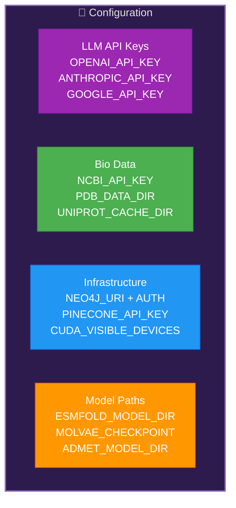
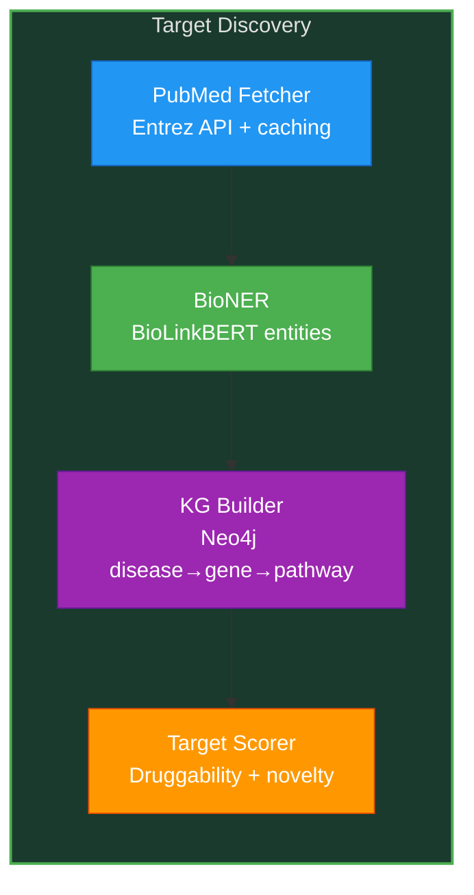
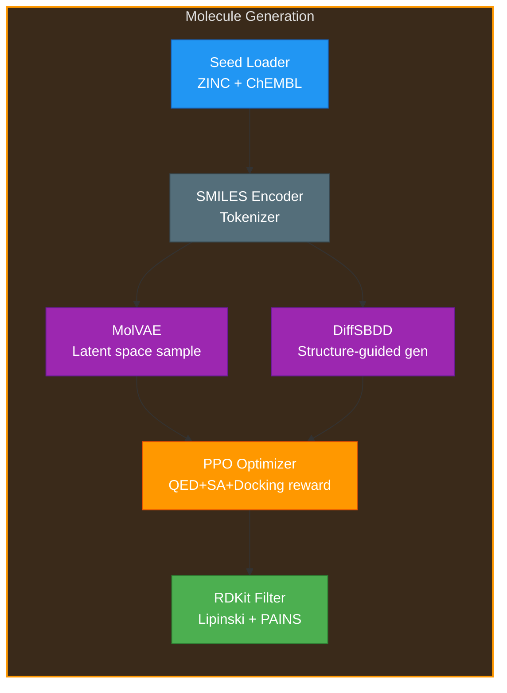
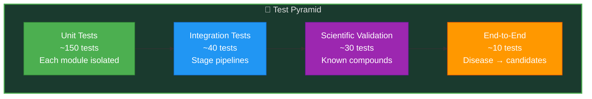
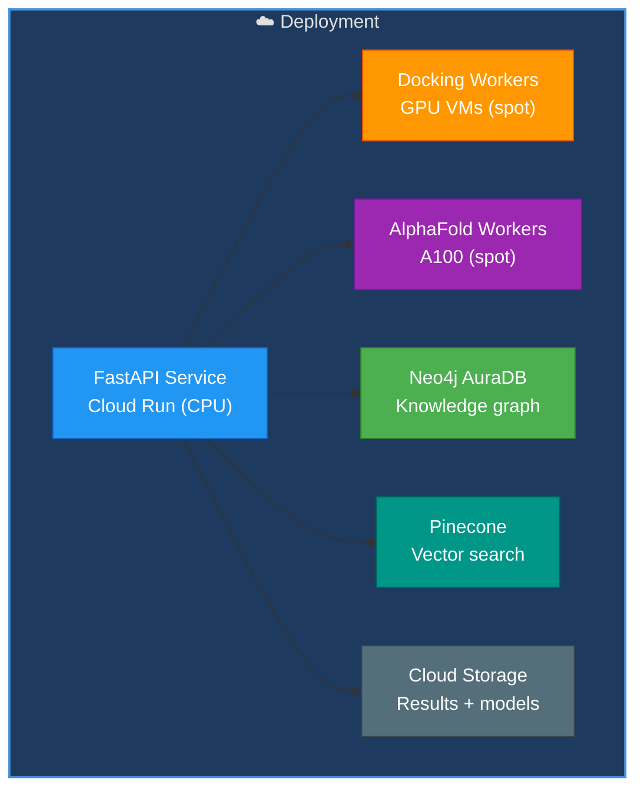
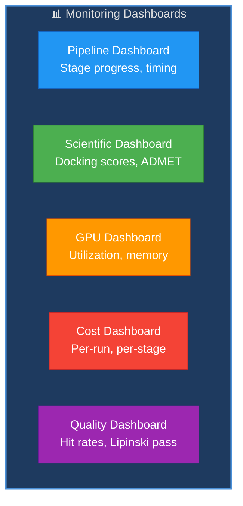
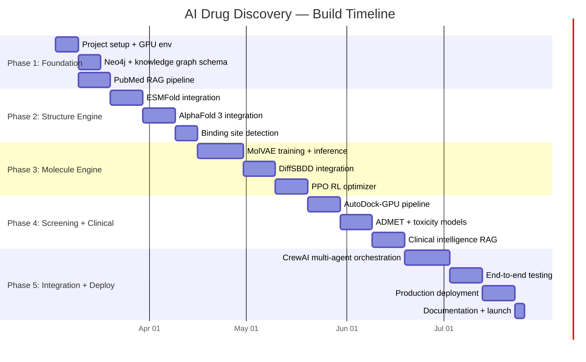

# AI Drug Discovery Pipeline — Complete Project Guide

**Version:** 1.0 | **Date:** March 6, 2026 | **Project Duration:** Mar 3 – Jul 25, 2026

---

## Table of Contents

1. [Project Overview](#1-project-overview)
2. [Installation & Setup](#2-installation--setup)
3. [Environment Configuration](#3-environment-configuration)
4. [Architecture & Module Plan](#4-architecture--module-plan)
5. [Code Plan (Module-by-Module)](#5-code-plan-module-by-module)
6. [Test Plan](#6-test-plan)
7. [Deployment Plan](#7-deployment-plan)
8. [Monitoring & Observability](#8-monitoring--observability)
9. [GenAI Skills Usage Strategy](#9-genai-skills-usage-strategy)
10. [Phase-by-Phase Execution Timeline](#10-phase-by-phase-execution-timeline)
11. [Risk & Mitigation](#11-risk--mitigation)
12. [Cost Strategy](#12-cost-strategy)

---

## 1. Project Overview

Build an AI-powered drug discovery platform that accelerates the pipeline from disease target identification through protein structure prediction, novel molecule generation, virtual screening (docking + ADMET), to clinical candidate selection — reducing months into days.

### Success Metrics

| Metric                      | Target             |
| --------------------------- | ------------------ |
| Target identification time  | < 2 weeks          |
| Molecules generated per run | > 10,000           |
| ADMET prediction accuracy   | > 85%              |
| Docking hit rate            | > 15% (Kd < 100nM) |
| Pipeline cost per run       | < $50              |

---

## 2. Installation & Setup

### 2.1 Prerequisites


### 2.2 Setup Steps

1. **Clone and create virtual environment** — GPU-enabled (CUDA)
2. **Install core dependencies** — RDKit, BioPython, py3Dmol, PyTorch, HuggingFace Transformers
3. **Install bio-specific packages** — ESMFold, AlphaFold inference, AutoDock-GPU
4. **Install ML/AI packages** — LangGraph, CrewAI, LlamaIndex, Pinecone
5. **Setup Neo4j** — Docker or cloud instance for knowledge graph
6. **Configure API keys** — `.env` with all credentials
7. **Download data** — UniProt reference, ZINC subset, PDB structures
8. **Verify GPU** — CUDA check, ESMFold inference test

### 2.3 Directory Structure Plan

```
ai-drug-discovery/
├── src/
│   ├── agents/                  # 6 CrewAI agents
│   │   ├── research_director.py
│   │   ├── literature_agent.py
│   │   ├── structure_agent.py
│   │   ├── molecule_agent.py
│   │   ├── screening_agent.py
│   │   └── clinical_agent.py
│   ├── pipeline/                # 5-stage pipeline
│   │   ├── target_discovery.py
│   │   ├── structure_prediction.py
│   │   ├── molecule_generation.py
│   │   ├── virtual_screening.py
│   │   └── clinical_intelligence.py
│   ├── knowledge/               # RAG + Knowledge Graph
│   │   ├── pubmed_rag.py
│   │   ├── neo4j_client.py
│   │   ├── knowledge_graph.py
│   │   └── literature_embeddings.py
│   ├── molecular/               # Chemistry tooling
│   │   ├── mol_vae.py
│   │   ├── diff_sbdd.py
│   │   ├── ppo_optimizer.py
│   │   ├── rdkit_utils.py
│   │   └── admet_predictor.py
│   ├── structural/              # Protein handling
│   │   ├── alphafold_client.py
│   │   ├── esmfold_client.py
│   │   ├── binding_site.py
│   │   └── pdb_utils.py
│   ├── screening/               # Virtual screening
│   │   ├── autodock_runner.py
│   │   ├── toxicity_filter.py
│   │   └── scoring.py
│   └── utils/                   # Shared utilities
├── config/
├── tests/
├── data/                        # Downloaded datasets
├── models/                      # Trained model weights
├── reports/                     # Generated reports
├── docker/
└── pyproject.toml
```

---

## 3. Environment Configuration

### 3.1 Environment Variables



### 3.2 Hardware Requirements

| Component | Minimum           | Recommended  |
| --------- | ----------------- | ------------ |
| GPU       | NVIDIA T4 (16 GB) | A100 (40 GB) |
| RAM       | 32 GB             | 64 GB        |
| Disk      | 200 GB SSD        | 500 GB NVMe  |
| CPU       | 8 cores           | 16 cores     |

---

## 4. Architecture & Module Plan

### 4.1 Complete Pipeline Architecture

```mermaid
flowchart TB
    subgraph S1["Stage 1: Target Discovery"]
        style S1 fill:#1a3a2e,color:#e0e0e0,stroke:#4caf50,stroke-width:2px
        S1A["PubMed RAG Search"]:::green
        S1B["BioLinkBERT NER"]:::green
        S1C["Neo4j Knowledge Graph"]:::purple
        S1D["Target Ranking"]:::orange
    end

    subgraph S2["Stage 2: Structure Prediction"]
        style S2 fill:#2d1b4e,color:#e0e0e0,stroke:#8e6cc0,stroke-width:2px
        S2A["Sequence Retrieval (UniProt)"]:::blue
        S2B["AlphaFold 3 Prediction"]:::purple
        S2C["ESMFold Backup"]:::green
        S2D["Binding Site Detection"]:::orange
    end

    subgraph S3["Stage 3: Molecule Generation"]
        style S3 fill:#3a2a1a,color:#e0e0e0,stroke:#ff9800,stroke-width:2px
        S3A["Seed Library (ZINC/ChEMBL)"]:::blue
        S3B["MolVAE Latent Space"]:::purple
        S3C["DiffSBDD Structure-Based"]:::purple
        S3D["PPO RL Optimization"]:::orange
        S3E["Lipinski + RDKit Filter"]:::green
    end

    subgraph S4["Stage 4: Virtual Screening"]
        style S4 fill:#3a1a1a,color:#e0e0e0,stroke:#ef5350,stroke-width:2px
        S4A["AutoDock-GPU Docking"]:::orange
        S4B["ADMET Prediction"]:::green
        S4C["Toxicity Prediction"]:::red
        S4D["Composite Scoring"]:::purple
    end

    subgraph S5["Stage 5: Clinical Intelligence"]
        style S5 fill:#1a2a3a,color:#e0e0e0,stroke:#42a5f5,stroke-width:2px
        S5A["Clinical Trials Search"]:::blue
        S5B["Safety Profile Analysis"]:::red
        S5C["Patent Landscape"]:::orange
        S5D["Final Candidate Report"]:::green
    end

    S1 --> S2 --> S3 --> S4 --> S5

    classDef blue fill:#2196F3,color:#fff,stroke:#1565C0
    classDef green fill:#4CAF50,color:#fff,stroke:#2E7D32
    classDef orange fill:#FF9800,color:#fff,stroke:#E65100
    classDef purple fill:#9C27B0,color:#fff,stroke:#6A1B9A
    classDef red fill:#F44336,color:#fff,stroke:#C62828
```



---

## 5. Code Plan (Module-by-Module)

> **Note:** This section describes WHAT to build and HOW to structure it — no actual code.

### 5.1 Target Discovery Module



**Files to create:**
- `pubmed_rag.py` — PubMed search via NCBI Entrez, embed papers, LlamaIndex RAG
- `bio_ner.py` — BioLinkBERT named entity recognition (genes, proteins, diseases)
- `knowledge_graph.py` — Neo4j graph: nodes (gene, protein, disease, pathway), relationships
- `target_scorer.py` — Composite score: druggability, novelty, pathway importance

### 5.2 Structure Prediction Module

**Files to create:**
- `alphafold_client.py` — AlphaFold 3 inference (local or API), pLDDT confidence parsing
- `esmfold_client.py` — ESMFold single-sequence prediction (HuggingFace model)
- `pdb_client.py` — PDB API client: fetch known structures by UniProt ID
- `binding_site.py` — fpocket / P2Rank for pocket detection
- `structure_viewer.py` — py3Dmol 3D visualization + binding site highlights

### 5.3 Molecule Generation Module



**Files to create:**
- `mol_vae.py` — VAE training/inference on SMILES, latent space interpolation
- `diff_sbdd.py` — Structure-based drug design with diffusion model
- `ppo_optimizer.py` — PPO RL agent: reward = QED + synthetic accessibility + docking score
- `rdkit_utils.py` — Lipinski rule-of-5, PAINS filter, SMILES validation

### 5.4 Virtual Screening Module

**Files to create:**
- `autodock_runner.py` — AutoDock-GPU batch docking, result parsing
- `admet_predictor.py` — XGBoost ensemble for A/D/M/E/T properties
- `toxicity_filter.py` — DeepTox model for cytotoxicity, hERG channel block
- `composite_scorer.py` — Weighted rank: docking (40%) + ADMET (30%) + tox (20%) + novelty (10%)

### 5.5 Clinical Intelligence Module

**Files to create:**
- `trial_searcher.py` — ClinicalTrials.gov API: search by target, mechanism, molecule similarity
- `safety_profiler.py` — Similar compound adverse event analysis via RAG on FDA FAERS
- `patent_analyzer.py` — Google Patents API: freedom-to-operate analysis
- `report_generator.py` — Claude Opus for comprehensive candidate report (PDF + interactive)

### 5.6 Agent Orchestration (CrewAI)

**Files to create:**
- `crew_config.py` — CrewAI team definition: roles, goals, delegation rules
- `research_director.py` — Orchestrates other 5 agents, makes stage-transition decisions
- Per-agent files — Each with tool access, prompt templates, output schema

---

## 6. Test Plan

### 6.1 Test Strategy



### 6.2 Test Coverage

| Module            | Tests | What to Verify                                        |
| ----------------- | ----- | ----------------------------------------------------- |
| PubMed RAG        | 15    | Paper retrieval, entity extraction, embedding quality |
| Knowledge Graph   | 20    | Node/edge creation, Cypher queries, path finding      |
| AlphaFold/ESMFold | 15    | Structure prediction accuracy (known proteins)        |
| Binding Site      | 10    | fpocket result parsing, known binding site detection  |
| MolVAE            | 20    | Valid SMILES output, latent space smoothness          |
| DiffSBDD          | 15    | Structure-conditioned generation quality              |
| PPO Optimizer     | 10    | Reward improvement over episodes                      |
| AutoDock          | 15    | Docking score correlation with known actives          |
| ADMET             | 15    | Prediction accuracy vs experimental data              |
| CrewAI pipeline   | 15    | Agent delegation, stage transitions                   |

### 6.3 Scientific Validation Tests

| Test                | Known Ground Truth           | Expectation                 |
| ------------------- | ---------------------------- | --------------------------- |
| EGFR docking        | Known inhibitors (gefitinib) | Docking score < −8 kcal/mol |
| KRAS G12C           | Known binders (sotorasib)    | Correctly ranked in top 20  |
| ADMET accuracy      | TDC benchmark dataset        | AUC > 0.85                  |
| Lipinski compliance | ChEMBL drug set              | > 95% pass rate             |

---

## 7. Deployment Plan

### 7.1 Deployment Architecture



### 7.2 Deployment Steps

| Phase | Action                                    | Notes                                      |
| ----- | ----------------------------------------- | ------------------------------------------ |
| 1     | Build Docker images (CPU + GPU variants)  | GPU image includes CUDA, AutoDock, ESMFold |
| 2     | Deploy Neo4j AuraDB + populate initial KG | Disease/gene/pathway data                  |
| 3     | Deploy API service (Cloud Run CPU)        | FastAPI + CrewAI orchestration             |
| 4     | Deploy GPU workers (spot instances)       | Docking + structure prediction             |
| 5     | Integration test on staging               | Run known target through full pipeline     |
| 6     | Production deploy + monitoring            | Gradio UI + API access                     |

---

## 8. Monitoring & Observability

### 8.1 Key Dashboards



### 8.2 Alerting

| Alert                  | Condition               | Severity |
| ---------------------- | ----------------------- | -------- |
| Pipeline stage failure | Any stage errors out    | Critical |
| GPU OOM                | Memory > 95%            | Error    |
| Docking timeout        | > 6h for batch          | Warning  |
| ADMET accuracy drift   | < 80% on validation set | Warning  |
| Cost per run           | > $100                  | Warning  |

---

## 9. GenAI Skills Usage Strategy

| #   | Skill                | Where Used            | Strategy                                          |
| --- | -------------------- | --------------------- | ------------------------------------------------- |
| 1   | LangGraph            | Pipeline orchestrator | 5-stage state machine with conditional branching  |
| 2   | CrewAI               | Agent team            | 6 agents with Research Director as manager        |
| 3   | RAG                  | Literature search     | PubMed + bioRxiv retrieval with citation tracking |
| 4   | Advanced RAG         | Knowledge synthesis   | Multi-source fusion (papers + trials + patents)   |
| 5   | LlamaIndex           | Scientific indexing   | Paper-level chunking with section awareness       |
| 6   | Embeddings           | Molecular + text      | SMILES fingerprints + scientific text embeddings  |
| 7   | Vector DBs           | Pinecone              | 100K+ molecular fingerprints + paper vectors      |
| 8   | OpenAI GPT           | Code generation       | RDKit workflow automation                         |
| 9   | Claude API           | Research Director     | High-reasoning orchestration + report writing     |
| 10  | Gemini API           | Quick analysis        | Fast ADMET result interpretation (2M context)     |
| 11  | Guardrails           | Chemical safety       | Lipinski, PAINS, toxicity validation gates        |
| 12  | Prompt Eng           | All agents            | Domain-specific prompts with bio terminology      |
| 13  | PEFT                 | BioLinkBERT           | Fine-tune NER for disease-specific entities       |
| 14  | RLHF                 | PPO optimizer         | Improve molecule quality from docking feedback    |
| 15  | HuggingFace          | ESMFold, BioLinkBERT  | Model hub for bio-specific models                 |
| 16  | Transfer Learning    | ADMET models          | Pre-trained chemistry → drug-specific             |
| 17  | Distributed Training | MolVAE                | Multi-GPU on ZINC 250K dataset                    |
| 18  | Model Quantization   | ESMFold               | INT8 for 2× faster structure prediction           |
| 19  | vLLM                 | Self-hosted models    | Fast inference for BioLinkBERT                    |
| 20  | AWS AI/ML            | SageMaker             | Training jobs + GPU instance management           |

---

## 10. Phase-by-Phase Execution Timeline



---

## 11. Risk & Mitigation

| Risk                       | Probability | Impact | Mitigation                                             |
| -------------------------- | ----------- | ------ | ------------------------------------------------------ |
| AlphaFold API unavailable  | Low         | High   | ESMFold as fallback (single-sequence)                  |
| Molecule VAE mode collapse | Medium      | High   | KL annealing, diverse seed library                     |
| GPU cost overrun           | Medium      | High   | Spot instances, batch scheduling, auto-shutdown        |
| Low docking hit rate       | Medium      | Medium | Multi-round PPO optimization, scaffold hopping         |
| Bio data quality issues    | Medium      | Medium | Multiple data sources, manual curation for top targets |
| Neo4j scaling limits       | Low         | Medium | Partition by disease area, use read replicas           |

---

## 12. Cost Strategy

| Component                         | Monthly Estimate        | Optimization                     |
| --------------------------------- | ----------------------- | -------------------------------- |
| GPU compute (docking + structure) | $200-400                | Spot instances, batch scheduling |
| Neo4j AuraDB                      | $65 (Free→Professional) | Start free tier                  |
| Claude Opus (Research Director)   | $30-60                  | Cache orchestration patterns     |
| GPT-4o (Molecule agent)           | $20-50                  | Use GPT-4o-mini for simple tasks |
| Pinecone                          | $70 (Starter)           | Serverless, delete old indexes   |
| Storage (models + data)           | $20-30                  | Lifecycle policies, compress     |
| **Total**                         | **$405-675/month**      | **Target: < $500/month**         |
