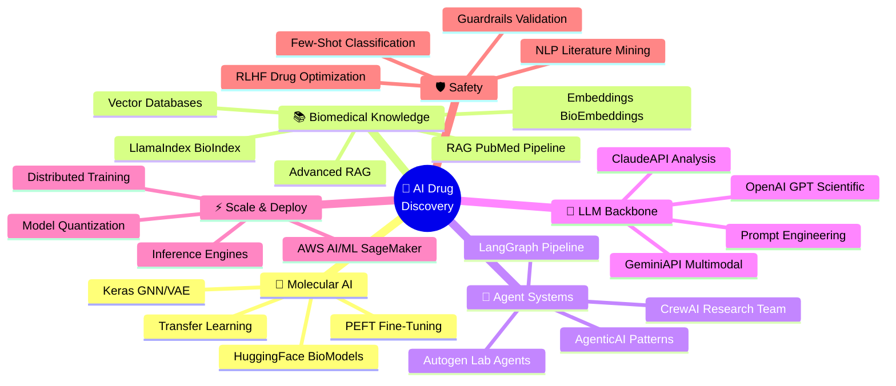
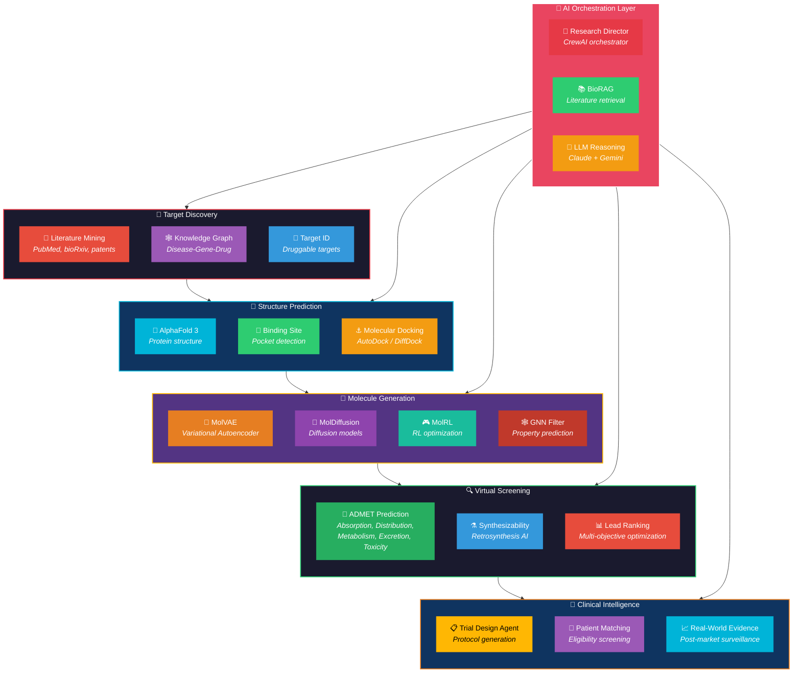
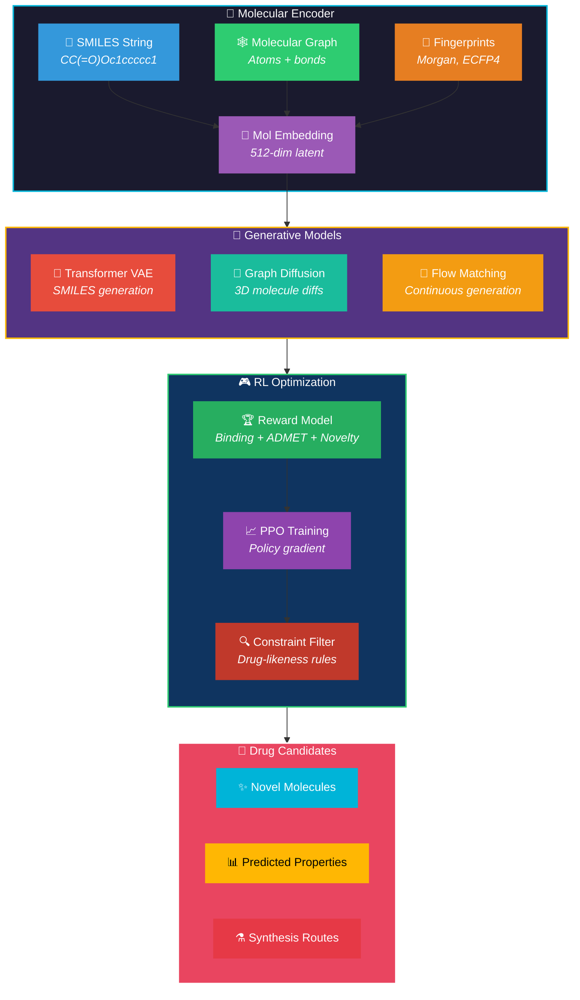
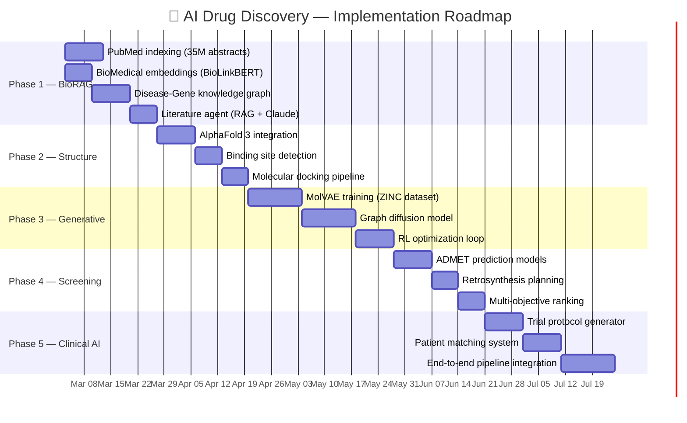

# 💊 Project 2: AI-Powered Drug Discovery & Molecular Design

> **Real-World Inspiration:** AlphaFold 3 (Google DeepMind/Isomorphic Labs), Recursion Pharmaceuticals, Insilico Medicine, NVIDIA BioNeMo, Absci
>
> **Status:** Revolutionizing pharma — AlphaFold predicted 200M+ protein structures, Insilico's AI-discovered drug reached Phase II clinical trials in record 30 months, Recursion raised $1.5B for AI drug discovery

---

## 🌍 What's Happening in the Real World (2025-2026)

| Company | Product | Impact |
|---------|---------|--------|
| **DeepMind** | AlphaFold 3 | Predicts structure of ALL biomolecules — proteins, DNA, RNA, ligands. 200M+ structures open-sourced |
| **Isomorphic Labs** | AI Drug Design | DeepMind spinoff — using AlphaFold to design novel drugs. Partnership deals worth $3B+ with Eli Lilly and Novartis |
| **Insilico Medicine** | Pharma.AI | First AI-discovered drug to reach Phase II trials (ISM001-055 for IPF). Target → molecule in 18 months vs 4-5 years traditionally |
| **Recursion** | Recursion OS | Massive biological dataset (22 PB) + AI models. $1.5B raised. Acquired Exscientia for $688M |
| **NVIDIA** | BioNeMo | Cloud service for generative biology — protein design, molecular generation, docking simulation |
| **Absci** | Generative Drug Design | De novo antibody design using generative AI. Created functional antibodies from scratch |

---

## 🎯 Project Goal

Build an **AI Drug Discovery Pipeline** that can:
1. Identify disease targets from biomedical literature (NLP + RAG)
2. Predict protein structures and binding sites (deep learning)
3. Generate novel drug-like molecules (generative models)
4. Screen candidates for toxicity and efficacy (ADMET prediction)
5. Optimize lead compounds (reinforcement learning)
6. Design clinical trial protocols (LLM agents)
7. Monitor real-world evidence post-launch (NLP mining)

---

## 🧠 GenAI Skills & Tools Involved

---

## 🏗️ System Architecture

---

## 🔄 Drug Discovery Pipeline Flow

```mermaid
sequenceDiagram
    participant Scientist as 👨‍🔬 Scientist
    participant Director as 🤖 Research Director
    participant LitAgent as 📄 Literature Agent
    participant StructAgent as 🧬 Structure Agent
    participant MolAgent as 🧪 Molecule Agent
    participant ScreenAgent as 🔍 Screening Agent
    participant ClinAgent as 🏥 Clinical Agent

    Scientist->>Director: "Find a novel inhibitor for JAK2 kinase in myelofibrosis"

    rect rgb(26, 26, 46)
        Note over Director,LitAgent: 📖 Phase 1: Target Validation
        Director->>LitAgent: Search PubMed, patents, clinical trials
        LitAgent->>LitAgent: RAG over 35M+ PubMed abstracts
        LitAgent-->>Director: JAK2 V617F mutation confirmed, 3 binding sites, existing drug limitations
    end

    rect rgb(15, 52, 96)
        Note over Director,StructAgent: 🧬 Phase 2: Structure Analysis
        Director->>StructAgent: Predict JAK2 mutant structure
        StructAgent->>StructAgent: AlphaFold 3 prediction + binding pocket analysis
        StructAgent-->>Director: 3D structure + druggable pocket + key residues
    end

    rect rgb(83, 52, 131)
        Note over Director,MolAgent: 🧪 Phase 3: Molecule Generation
        Director->>MolAgent: Generate molecules for JAK2 pocket
        MolAgent->>MolAgent: MolDiffusion generates 10K candidates
        MolAgent->>MolAgent: RL optimizes for binding affinity + selectivity
        MolAgent-->>Director: Top 500 novel molecules (filtered by Lipinski)
    end

    rect rgb(233, 69, 96)
        Note over Director,ScreenAgent: 🔍 Phase 4: Virtual Screening
        Director->>ScreenAgent: Screen 500 candidates
        ScreenAgent->>ScreenAgent: ADMET prediction + docking + synthesizability
        ScreenAgent-->>Director: Top 10 leads ranked by multi-objective score
    end

    rect rgb(26, 26, 46)
        Note over Director,ClinAgent: 🏥 Phase 5: Clinical Planning
        Director->>ClinAgent: Design Phase I trial for top 3 leads
        ClinAgent->>ClinAgent: Protocol generation + patient matching + timeline
        ClinAgent-->>Director: Trial protocol + 50 eligible patients + 18-month timeline
    end

    Director-->>Scientist: Complete drug discovery report with 3 lead candidates
```

---

## 🧬 Molecular Generation Architecture

---

## 🛠️ Tech Stack Mapping

| Component | Technology | GenAI Skill Used |
|-----------|-----------|-----------------|
| **Literature Mining** | PubMed RAG + BioLinkBERT | `NLP`, `RAG`, `AdvancedRAG`, `Embeddings` |
| **Knowledge Graph** | Neo4j + BioGPT | `LangChain`, `Vector-Databases` |
| **Protein Structure** | AlphaFold 3 + ESMFold | `Keras`, `DistributedTraining`, `TransferLearning` |
| **Molecule Generation** | MolVAE, DiffSBDD | `HuggingFace`, `PEFT-FineTuning` |
| **RL Optimization** | PPO on molecular properties | `RLHF` |
| **ADMET Prediction** | GNN + molecular fingerprints | `Keras`, `TransferLearning` |
| **Research Agents** | CrewAI scientist team | `CrewAI`, `AgenticAI`, `Autogen` |
| **Agent Workflow** | LangGraph discovery pipeline | `LangGraph`, `LangChain` |
| **Scientific Reasoning** | Claude Opus 4 + Gemini Pro | `ClaudeAPI`, `GeminiAPI`, `PromptEngineering` |
| **Classification** | Few-shot drug class prediction | `FewShotZeroShot`, `OpenAI-GPT` |
| **Safety Validation** | Guardrails for toxicity alerts | `Guardrails` |
| **Model Serving** | TensorRT for docking inference | `InferenceEngines`, `ModelQuantization` |
| **Cloud Training** | SageMaker distributed | `AWS-AI-ML`, `DistributedTraining` |
| **BioMedical Index** | LlamaIndex + PubMed | `LlamaIndex` |

---

## 📊 Implementation Phases

---

## 🎯 Key Metrics

| Metric | Target | Benchmark |
|--------|--------|-----------|
| Target identification speed | < 2 weeks | Traditional: 1-2 years |
| Novel molecules generated per run | 10,000+ | Traditional screening: 1M (but random) |
| ADMET prediction accuracy | > 85% | Industry average: ~75% |
| Hit rate (active compounds) | > 15% | Traditional HTS: ~0.1% |
| Time to lead compound | < 6 months | Traditional: 2-3 years |
| Cost per discovery campaign | < $500K | Traditional: $5-10M+ |
