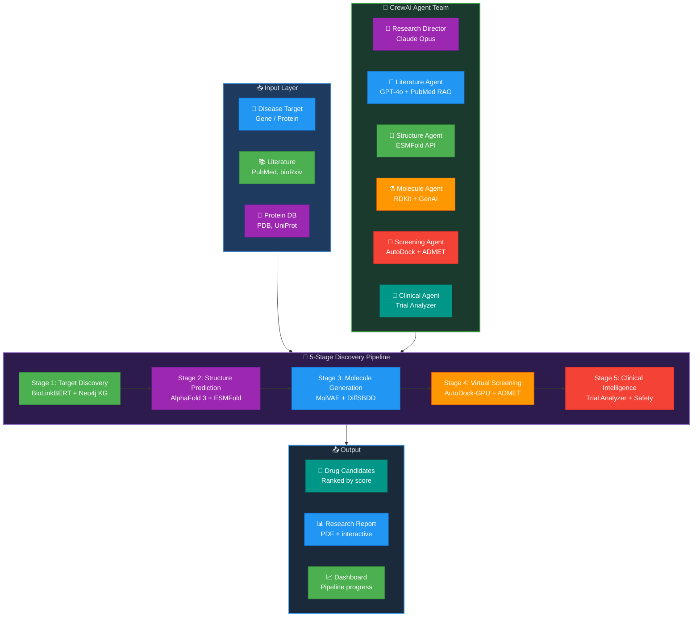
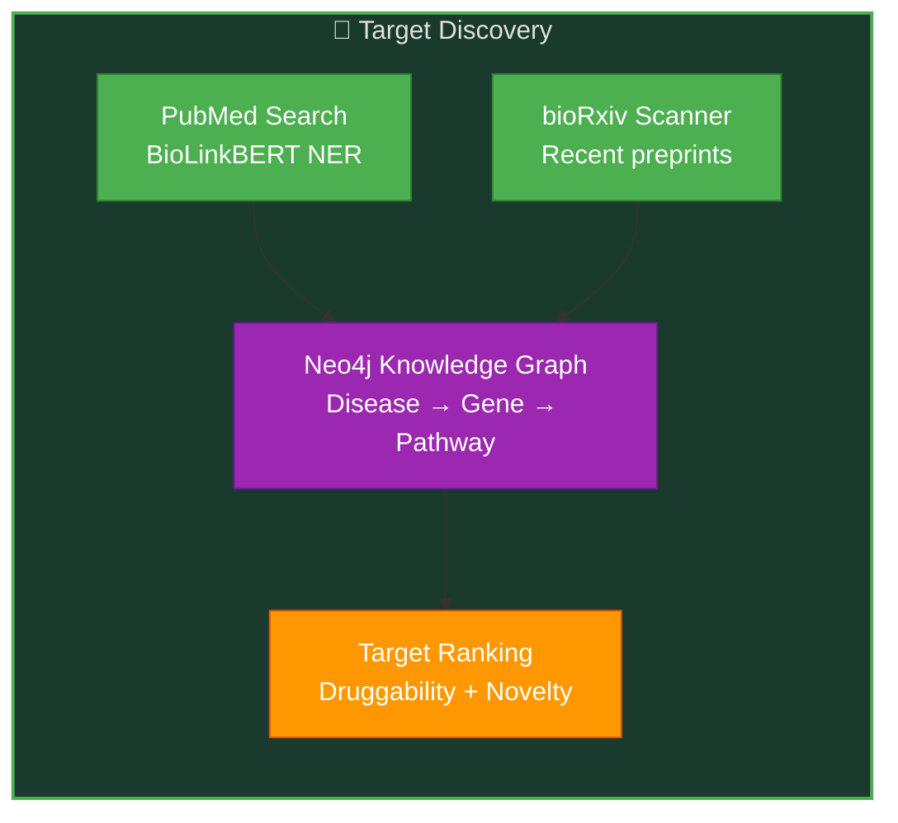
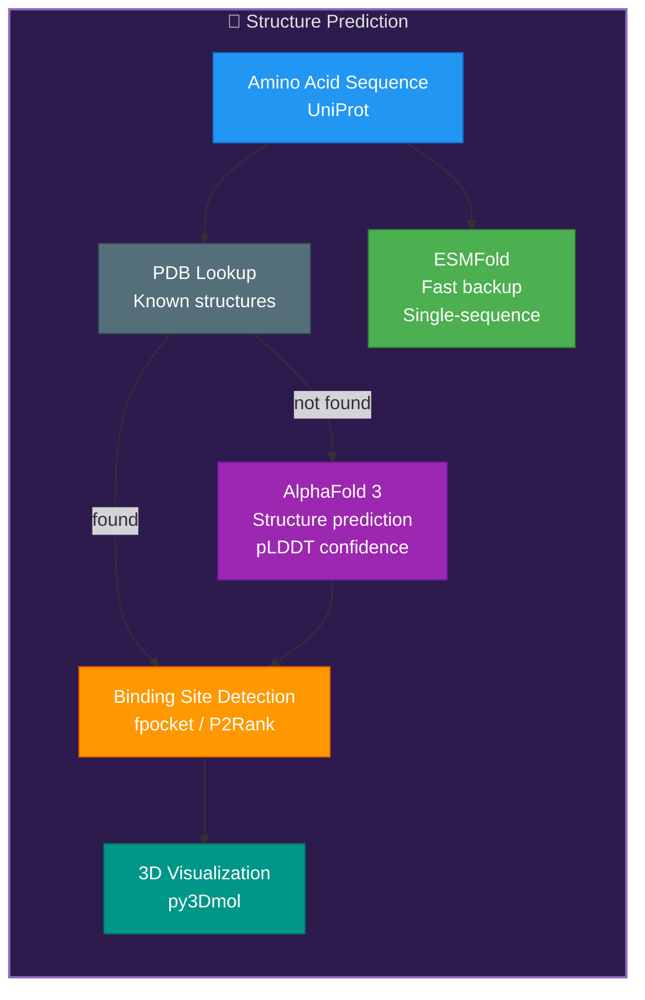
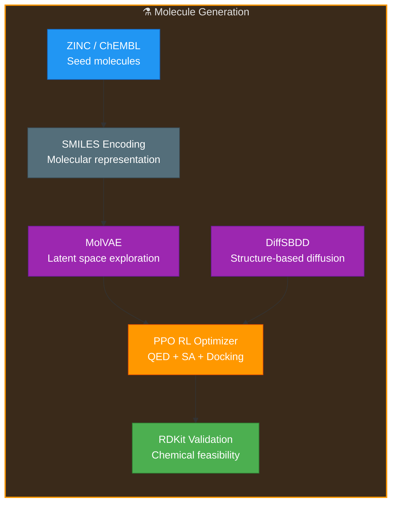
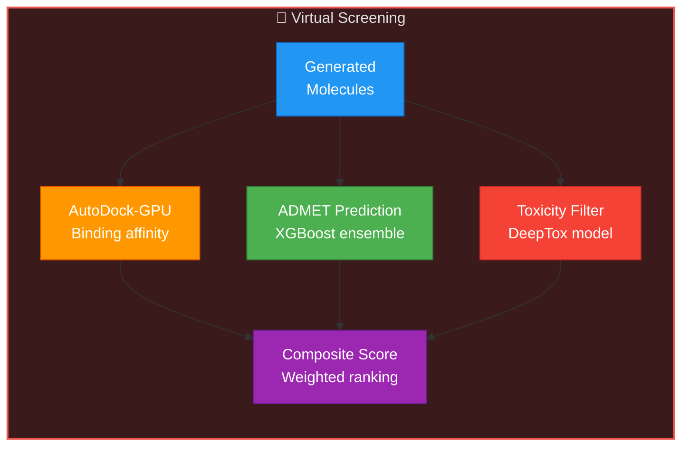
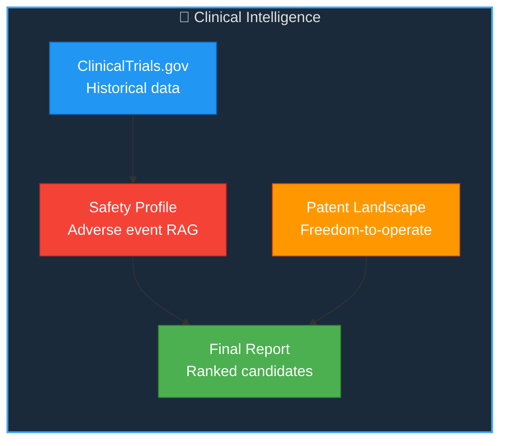
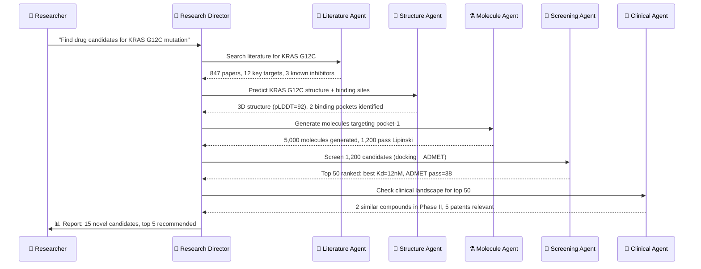
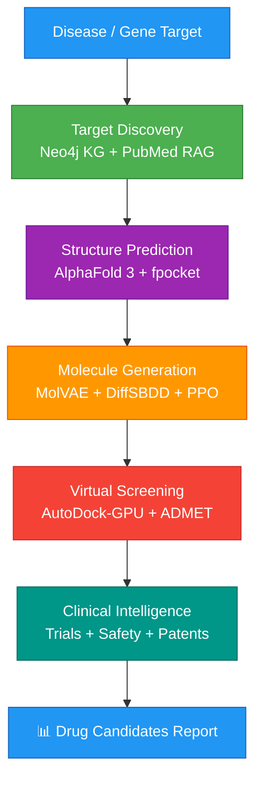

# AI Drug Discovery Pipeline — Technical Design Document

**Version:** 1.0 | **Date:** March 6, 2026 | **Status:** Pre-Implementation Blueprint

---

## 1. System Overview

An end-to-end AI drug discovery platform that accelerates the path from disease target identification to clinical candidate selection — combining protein structure prediction (AlphaFold), molecular generation (VAE/Diffusion), virtual screening, ADMET prediction, and multi-agent literature synthesis. Inspired by Insilico Medicine, Recursion, and Isomorphic Labs.

---

## 2. High-Level Architecture

---

## 3. Pipeline State Machine

```mermaid
stateDiagram-v2
    [*] --> DiseaseInput : User provides disease/target

    state TargetDiscovery {
        [*] --> LitSearch : PubMed + bioRxiv
        LitSearch --> KGBuild : Neo4j knowledge graph
        KGBuild --> TargetRank : Score druggable targets
        TargetRank --> [*]
    }

    state StructurePrediction {
        [*] --> FetchPDB : Known structures
        FetchPDB --> AlphaFold : Unknown → predict
        AlphaFold --> BindingSite : Identify pockets
        BindingSite --> [*]
    }

    state MoleculeGeneration {
        [*] --> SeedLibrary : ZINC/ChEMBL seeds
        SeedLibrary --> VAEGenerate : MolVAE latent space
        VAEGenerate --> DiffSBDD : Structure-based design
        DiffSBDD --> PPOOptimize : RL optimization
        PPOOptimize --> [*]
    }

    state VirtualScreening {
        [*] --> Docking : AutoDock-GPU
        Docking --> ADMET : Absorption, Distribution...
        ADMET --> ToxFilter : Toxicity prediction
        ToxFilter --> [*]
    }

    state ClinicalIntelligence {
        [*] --> TrialSearch : ClinicalTrials.gov
        TrialSearch --> SafetyProfile : Adverse event analysis
        SafetyProfile --> CandidateRank : Final scoring
        CandidateRank --> [*]
    }

    DiseaseInput --> TargetDiscovery
    TargetDiscovery --> StructurePrediction
    StructurePrediction --> MoleculeGeneration
    MoleculeGeneration --> VirtualScreening
    VirtualScreening --> ClinicalIntelligence
    ClinicalIntelligence --> [*] : 💊 Drug candidates
```

---

## 4. Module Deep Dives

### 4.1 Stage 1: Target Discovery

### 4.2 Stage 2: Protein Structure Prediction

### 4.3 Stage 3: Molecule Generation

### 4.4 Stage 4: Virtual Screening

### 4.5 Stage 5: Clinical Intelligence

---

## 5. Multi-Agent Orchestration

---

## 6. Technology Justification

| Component | Chosen | Alternative | Why Chosen |
|-----------|--------|-------------|------------|
| **Structure Prediction** | AlphaFold 3 | RoseTTAFold | SOTA accuracy, handles complexes + ligands |
| **Fast Backup** | ESMFold | OmegaFold | Single-sequence (no MSA), 60× faster |
| **Knowledge Graph** | Neo4j | Amazon Neptune | Mature graph DB, Cypher query language, great for bio networks |
| **NER/NLP** | BioLinkBERT | SciBERT | Pre-trained on PubMed + link prediction, domain-specific |
| **Molecule Generation** | MolVAE + DiffSBDD | REINVENT | VAE for exploration + diffusion for structure-based = best coverage |
| **RL Optimization** | PPO | DQN, A2C | Stable, sample-efficient, proven in molecular optimization |
| **Docking** | AutoDock-GPU | Vina, Glide | Free, GPU-accelerated, well-validated |
| **ADMET** | XGBoost ensemble | Random Forest | Higher accuracy on ADMET benchmarks |
| **Multi-agent** | CrewAI | AutoGen | Better role specialization, hierarchical delegation |
| **Literature RAG** | LlamaIndex + PubMed | LangChain | Superior for scientific document indexing |

---

## 7. Data Flow Summary

---

## 8. Target Metrics

| Metric | Target | Measurement |
|--------|--------|-------------|
| Target ID time | < 2 weeks | From disease input to validated target list |
| Molecules generated per run | > 10,000 | MolVAE + DiffSBDD combined output |
| ADMET prediction accuracy | > 85% | Validated against experimental data |
| Docking hit rate | > 15% | Molecules with Kd < 100nM |
| Clinical report time | < 1 day | Automated clinical landscape analysis |
| Pipeline cost per run | < $50 | All compute + API costs |

---

## 9. GenAI Skills Matrix

| Skill | Module | Role |
|-------|--------|------|
| LangGraph | Pipeline orchestrator | 5-stage state machine with branching |
| CrewAI | Agent team | 6-agent hierarchical delegation |
| RAG | Literature search | PubMed + bioRxiv scientific paper retrieval |
| Advanced RAG | Knowledge synthesis | Multi-source fusion, citation tracking |
| LlamaIndex | Document indexing | Scientific paper chunking + querying |
| Embeddings | Similarity search | Protein sequence + molecular embeddings |
| Vector DBs | Pinecone | Protein structures + molecular fingerprints |
| OpenAI GPT | Molecule agent | Code generation for RDKit workflows |
| Claude API | Research Director | High-reasoning orchestration + report writing |
| Gemini API | Fast analysis | Quick ADMET result interpretation |
| Guardrails | Safety | Chemical feasibility + toxicity validation |
| Prompt Engineering | All agents | Domain-specific scientific prompts |
| PEFT Fine-tuning | BioLinkBERT | Domain-specific NER fine-tuning |
| HuggingFace | Models | ESMFold, BioLinkBERT, MolVAE |
| Transfer Learning | ADMET models | General chemistry → drug-specific models |
| Distributed Training | Molecule VAE | Multi-GPU training on ZINC dataset |
| Model Quantization | ESMFold | INT8 for faster structure prediction |
| vLLM | Self-hosted | Fast inference for domain models |
| AWS AI/ML | SageMaker | Training jobs + model hosting |
