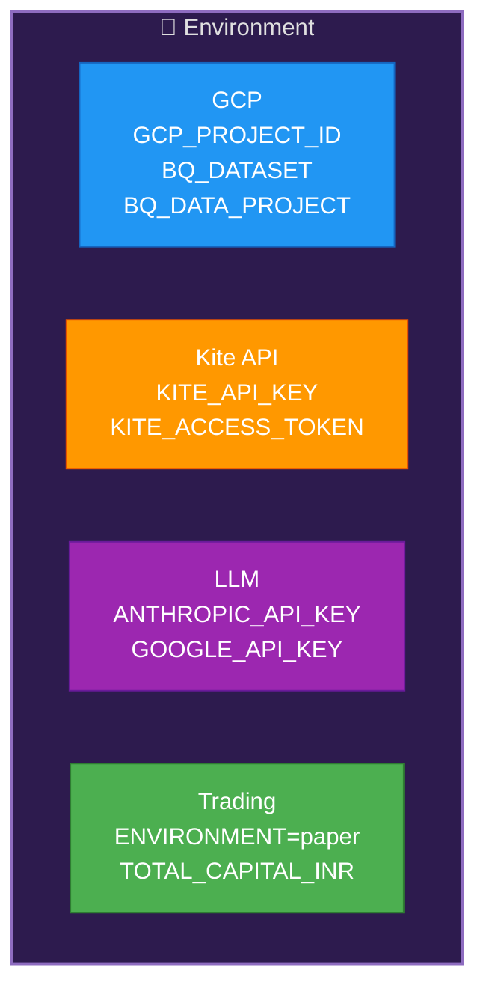
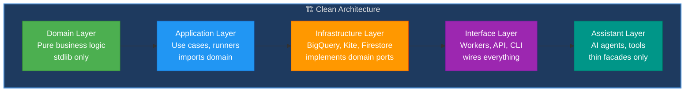
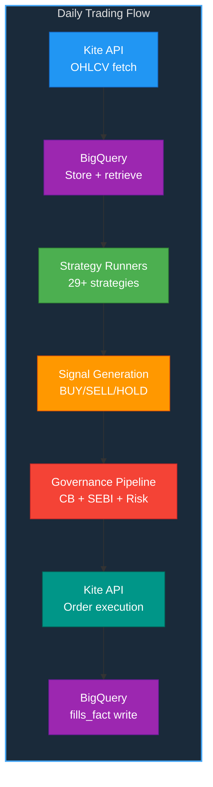
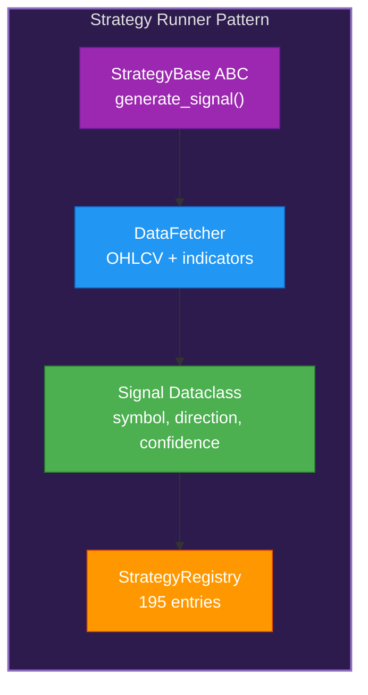
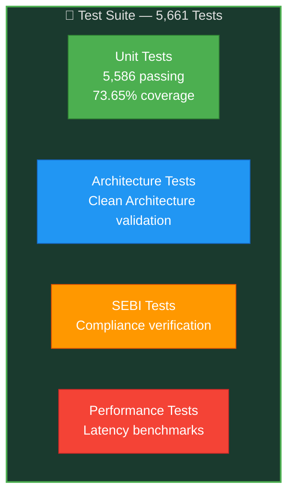
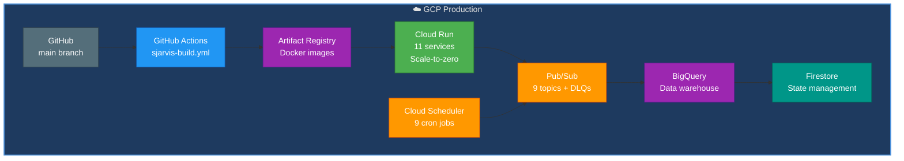
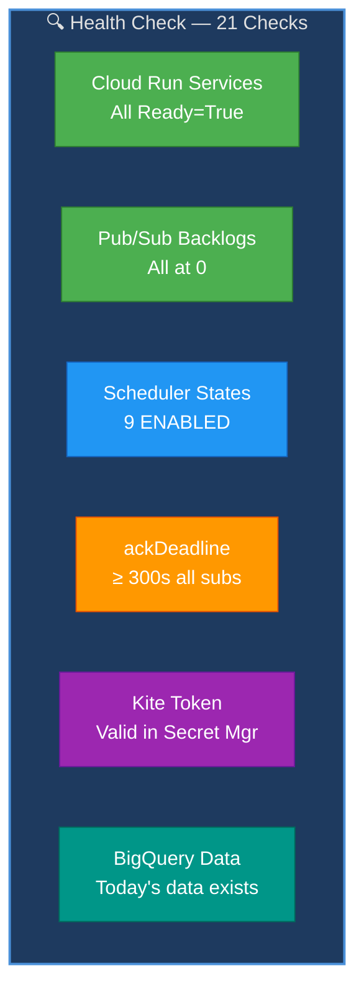
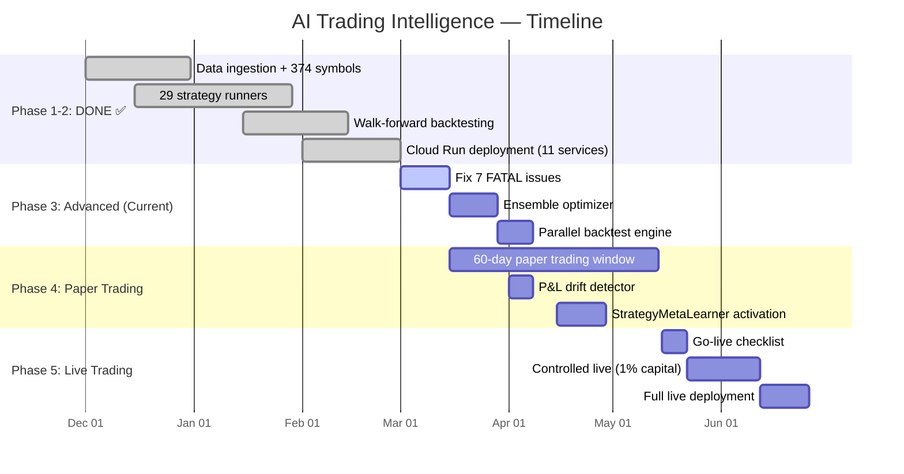

# AI Trading Intelligence — Complete Project Guide

**Version:** 1.0 | **Date:** March 6, 2026 | **Status:** Phase 1-2 DONE, Phase 3-5 In Progress

---

## Table of Contents

1. [Project Overview](#1-project-overview)
2. [Installation & Setup](#2-installation--setup)
3. [Environment Configuration](#3-environment-configuration)
4. [Architecture & Module Plan](#4-architecture--module-plan)
5. [Code Plan (Module-by-Module)](#5-code-plan-module-by-module)
6. [Test Plan](#6-test-plan)
7. [Deployment Plan](#7-deployment-plan)
8. [Monitoring & Observability](#8-monitoring--observability)
9. [GenAI Skills Usage Strategy](#9-genai-skills-usage-strategy)
10. [Phase-by-Phase Execution Timeline](#10-phase-by-phase-execution-timeline)
11. [Risk & Mitigation](#11-risk--mitigation)
12. [Cost Strategy](#12-cost-strategy)

---

## 1. Project Overview

Build an autonomous algorithmic trading system for Indian markets (NSE/BSE) with: 29+ quantitative strategies, ML-powered signal generation, multi-agent governance (AlphaLab, RiskGuard, ExecOps, DataPulse), SEBI-compliant execution, and cloud-native infrastructure on GCP.

### Success Metrics

| Metric | Current | Target |
|--------|---------|--------|
| Sharpe Ratio | 0.819 (best) | > 1.5 (ensemble) |
| Max Drawdown | 18.2% (best) | < 15% |
| Win Rate | ~52% | > 55% |
| Strategies backtested | 109 | 186+ |
| Tests passing | 5,661 | 6,000+ |
| Monthly GCP cost | ₹5,000 | ₹5,000 (hard cap) |

---

## 2. Installation & Setup

### 2.1 Prerequisites

```mermaid
flowchart LR
    subgraph PREREQ["✅ Prerequisites"]
        style PREREQ fill:#1a3a2e,color:#e0e0e0,stroke:#4caf50,stroke-width:2px
        PY["Python 3.12"]:::green
        POETRY["Poetry 1.8.3"]:::green
        GC["gcloud CLI"]:::blue
        Docker["Docker"]:::blue
        TF["Terraform 1.6.x"]:::orange
    end

    subgraph ACCOUNTS["🔑 Required Accounts"]
        style ACCOUNTS fill:#3a2a1a,color:#e0e0e0,stroke:#ff9800,stroke-width:2px
        ZERODHA["Zerodha Account<br/>Kite API key"]:::orange
        GCP["GCP Account<br/>ai-trading-prod project"]:::blue
        CLAUDE["Anthropic API Key<br/>Claude for agents"]:::purple
        GEMINI["Google AI Key<br/>Gemini Flash (free)"]:::green
    end

    PREREQ --> ACCOUNTS

    classDef blue fill:#2196F3,color:#fff,stroke:#1565C0
    classDef green fill:#4CAF50,color:#fff,stroke:#2E7D32
    classDef orange fill:#FF9800,color:#fff,stroke:#E65100
    classDef purple fill:#9C27B0,color:#fff,stroke:#6A1B9A
```



### 2.2 Setup Steps

1. **Clone repo** and install Poetry
2. **Install dependencies** — `poetry install`
3. **GCP authentication** — `gcloud auth login` + `gcloud auth application-default login`
4. **Set project** — `gcloud config set project ai-trading-prod`
5. **Verify BigQuery access** — `bq ls ai_trading_machine`
6. **Kite API setup** — Get API key from Zerodha Developer Console
7. **Environment file** — Create `.env` with all keys
8. **Run tests** — `PYTHONPATH=src python -m pytest tests/unit/sjarvis/ -q`

### 2.3 Existing Directory Structure

```
ai-trading-machine/
├── src/sjarvis/
│   ├── domain/              # Pure business logic
│   │   ├── backtesting/     # BacktestEngine, metrics
│   │   ├── governance/      # Circuit breaker, validator
│   │   ├── trading/         # Order, Position, Portfolio
│   │   ├── strategy/        # Signal, StrategyBase
│   │   ├── compliance/      # SEBI validator
│   │   └── risk/            # VaR, drawdown, limits
│   ├── application/         # Use cases
│   │   ├── strategy_runners/ # 186 unique runners
│   │   ├── strategy_registry.py # 195 entries
│   │   ├── trading/         # Order placement
│   │   └── pipelines/       # Signal generation
│   ├── infrastructure/      # External adapters
│   │   ├── bigquery/        # BQ client, repos
│   │   ├── kite/            # Kite API client
│   │   ├── firestore/       # State stores
│   │   └── pubsub/          # Message bus
│   ├── interface/           # Entry points
│   │   ├── workers/         # 9 Cloud Run workers
│   │   └── api/             # FastAPI
│   └── assistant/           # Jarvis AI agents
│       ├── agents/          # 4 agents
│       └── tools/           # Agent tools
├── tests/                   # 5,661+ tests
├── scripts/                 # Operational scripts
├── config/                  # YAML/JSON configs
├── infra/terraform/sjarvis/ # Terraform IaC
└── bigquery/                # DDLs + procedures
```

---

## 3. Environment Configuration

### 3.1 Environment Variables



### 3.2 Key Config Files

| Config | Path | Purpose |
|--------|------|---------|
| Symbol universe | `config/symbol_universe.yaml` | 374 NSE symbols |
| Market holidays | `config/market-holidays.json` | NSE trading calendar |
| Backtest periods | `config/backtesting/backtest_periods.json` | 7 walk-forward periods |
| Paper trading | `config/paper_trading.yaml` | Paper trading settings |
| Kill switch | `config/kill_switch.yaml` | Emergency halt |

---

## 4. Architecture & Module Plan

### 4.1 Clean Architecture Layers



### 4.2 Data Flow



---

## 5. Code Plan (Module-by-Module)

> **Note:** This documents the STRUCTURE and PURPOSE — not implementation code.

### 5.1 Strategy Runner Pattern



**Existing modules (Phase 1-2 DONE):**
- 14 daily EOD strategy runners
- 3 intraday runners
- 3 options runners
- 3 futures runners
- 6 ML/sentiment runners
- Strategy registry with 195 entries

### 5.2 Remaining Work (Phase 3-5)

**Phase 3 — Advanced Strategies:**
- Ensemble optimizer (4 methods, SEBI-compliant weighting)
- StrategyMetaLearner (requires 10+ weeks of weekly metrics)
- Parallel backtest with ProcessPoolExecutor

**Phase 4 — Live Trading Readiness:**
- Fix 7 FATAL issues (Telegram dispatch, race conditions, silent ACK)
- Wire circuit breaker into all workers
- Implement DLQ consumer for failed messages

**Phase 5 — Production:**
- 60-day paper trading window (target: May 2026)
- Go-live checklist validation
- P&L drift detector (paper vs backtest)

---

## 6. Test Plan

### 6.1 Current Test Suite



### 6.2 Test Commands

| Command | Scope |
|---------|-------|
| `PYTHONPATH=src python -m pytest tests/unit/sjarvis/ -q` | All unit tests |
| `PYTHONPATH=src python -m pytest tests/architecture/ -v` | Architecture validation |
| `PYTHONPATH=src python -m pytest tests/ -m sebi -v` | SEBI compliance |
| `PYTHONPATH=src python -m pytest tests/performance/ -v` | Performance benchmarks |

### 6.3 Test Coverage Targets

| Module | Current | Target |
|--------|---------|--------|
| Domain | ~85% | 90% |
| Application | ~75% | 80% |
| Infrastructure | ~65% | 75% |
| Interface | ~60% | 70% |
| **Overall** | **73.65%** | **80%** |

---

## 7. Deployment Plan

### 7.1 GCP Deployment Architecture



### 7.2 Deployment Commands

| Step | Command |
|------|---------|
| Lint | `python -m black src tests && python -m isort --profile black src tests && poetry run ruff check --fix src tests` |
| Test | `PYTHONPATH=src python -m pytest tests/unit/sjarvis/ -q --tb=short` |
| Cost guard | `./scripts/gcp/cost_guard.sh --terraform` |
| Terraform | `cd infra/terraform/sjarvis && terraform apply` |
| Health check | `./scripts/gcp/gcp_health_check.sh` |

### 7.3 Cost Protection Rules

| Rule | Enforcement |
|------|-------------|
| Zero always-on instances | `min_instance_count = 0` everywhere |
| CPU throttling always on | Never use `--no-cpu-throttling` |
| No uptime checks on workers | Prevents scale-to-zero |
| Budget: ₹5,000/month hard cap | Billing budget alerts at 25%/50%/80%/100% |

---

## 8. Monitoring & Observability

### 8.1 Health Check



### 8.2 Key Alerts

| Alert | Condition | Action |
|-------|-----------|--------|
| Circuit breaker OPEN | Drawdown > 20% | Stop all trading, alert Telegram |
| Pub/Sub retry storm | Backlog > 100 | Run `purge_pubsub_backlogs.sh` |
| GCP cost > ₹3,500 | 70% of budget | Review active services |
| Kite token expired | Auth fails | Run token rotation scheduler |
| Zero signals generated | No signals in 24h | Check signal worker + data freshness |

---

## 9. GenAI Skills Usage Strategy

| # | Skill | Module | Implementation |
|---|-------|--------|---------------|
| 1 | LangGraph | Agent orchestrator | Multi-agent state machine for trading decisions |
| 2 | CrewAI | AlphaLab | Quant research team collaboration |
| 3 | RAG | Strategy knowledge | Strategy docs + past performance retrieval |
| 4 | LlamaIndex | Document indexing | SEBI circulars, financial reports |
| 5 | Embeddings | Regime matching | Market regime similarity search |
| 6 | Vector DBs | Firestore + Pinecone | Strategy vectors, regime embeddings |
| 7 | Claude API | Agent reasoning | AlphaLab + RiskGuard decisions |
| 8 | Gemini API | Sentiment | Free-tier news sentiment analysis |
| 9 | Guardrails | Trade validation | SEBI limits, position constraints |
| 10 | Prompt Engineering | All agents | CoT reasoning for trade decisions |
| 11 | PEFT | FinBERT | Fine-tune for Indian market sentiment |
| 12 | XGBoost/ML | Signal generation | ML-based strategy signals |
| 13 | HMM | Regime detection | Bull/bear/sideways market states |
| 14 | Transfer Learning | XGBoost | General → NSE-specific models |

---

## 10. Phase-by-Phase Execution Timeline



---

## 11. Risk & Mitigation

| Risk | Probability | Impact | Mitigation |
|------|------------|--------|------------|
| Kite API downtime | Medium | High | Fallback to cached data, retry with backoff |
| Strategy overfitting | High | High | Walk-forward validation, 7 OOS periods |
| GCP cost overrun | Medium | Medium | ₹5K hard cap, cost_guard.sh, scale-to-zero |
| SEBI compliance breach | Low | Critical | Automated validation, manual approval required |
| Pub/Sub retry storm | Medium | High | 600s ackDeadline, DLQ, purge script |
| Market flash crash | Low | Critical | Circuit breaker (20% DD), kill switch |

---

## 12. Cost Strategy

| Component | Monthly Cost | Optimization |
|-----------|-------------|--------------|
| Cloud Run (11 services) | ₹300 | Scale-to-zero, CPU throttling |
| BigQuery | ₹500 | Partitioned tables, column pruning |
| Firestore | ₹100 | Minimal writes, batch operations |
| Pub/Sub | ₹50 | DLQ prevents retry storms |
| Kite API | ₹0 | Free with brokerage |
| Gemini Flash | ₹0 | Free tier (15 RPM) |
| Claude API | ₹1,000 | Cache agent patterns |
| **Total** | **~₹2,000-3,000** | **Budget: ₹5,000 hard cap** |
