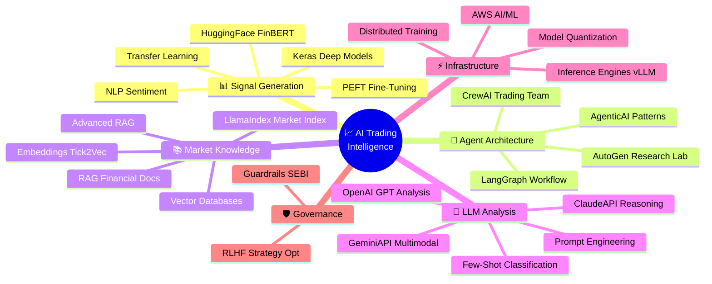
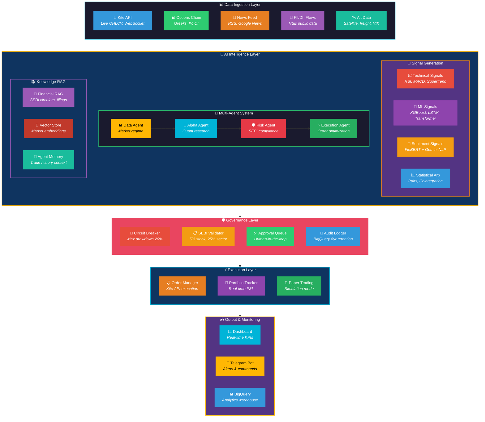
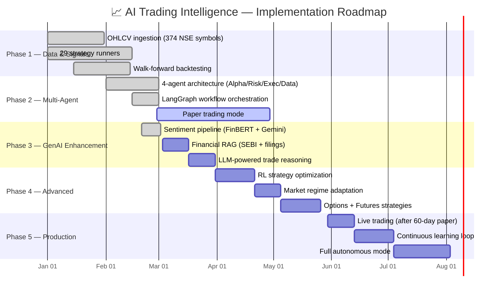

# 📈 Project 3: AI-Powered Autonomous Trading Intelligence

> **Real-World Inspiration:** Renaissance Technologies (Medallion Fund), Two Sigma, Citadel, DE Shaw, sjarvis (our own system), QuantConnect, Alpaca
>
> **Status:** Dominating finance — Medallion Fund averaged 66% annual returns for 30 years, Two Sigma manages $60B+ with AI, Citadel made $16B profit in 2022. AI now drives 70%+ of US equity trading volume

---

## 🌍 What's Happening in the Real World (2025-2026)

| Company | System | Impact |
|---------|--------|--------|
| **Renaissance Technologies** | Medallion Fund | The greatest quant fund ever — 66% avg annual returns. Uses NLP, signal processing, hidden Markov models on massive datasets |
| **Two Sigma** | Venn Platform | $60B AUM. Uses ML for alpha generation, NLP for earnings call sentiment, satellite imagery for retail foot traffic |
| **Citadel** | Multi-strategy | $16B profit in 2022. Combines quant signals with LLM-powered research synthesis across asset classes |
| **DE Shaw** | AI Research | $60B AUM. Pioneered using AI for systematic trading since 1988. Now using transformers for market microstructure |
| **WorldQuant** | AlphaFactory | Crowdsourced alpha platform. Uses GenAI to generate, test, and combine millions of alpha factors automatically |
| **sjarvis** | AI Trading Machine | Our system — 29 strategy runners, 374 NSE symbols, multi-agent architecture, paper trading active |

---

## 🎯 Project Goal

Build an **Autonomous AI Trading Intelligence System** for Indian markets (NSE/BSE) that can:
1. Ingest multi-source data (OHLCV, options chains, FII flows, news, satellite)
2. Generate alpha signals using 30+ AI strategies
3. Manage risk with SEBI compliance (5% stock, 25% sector limits)
4. Execute trades with multi-agent governance
5. Learn and adapt strategies based on market regime changes
6. Provide real-time insights via LLM-powered analysis

---

## 🧠 GenAI Skills & Tools Involved

---

## 🏗️ System Architecture

---

## 🔄 Daily Trading Cycle

```mermaid
sequenceDiagram
    participant Scheduler as ⏰ Cloud Scheduler
    participant DataAgent as 📊 Data Agent
    participant AlphaAgent as 🔬 Alpha Agent
    participant RiskAgent as 🛡️ Risk Agent
    participant ExecAgent as ⚡ Exec Agent
    participant Kite as 🔌 Kite API
    participant BigQuery as 📊 BigQuery
    participant Telegram as 📱 Telegram

    rect rgb(26, 26, 46)
        Note over Scheduler,DataAgent: 🌅 Pre-Market (6:00 AM IST)
        Scheduler->>DataAgent: Trigger daily pipeline
        DataAgent->>BigQuery: Fetch yesterday's OHLCV (374 symbols)
        DataAgent->>DataAgent: Calculate regime indicators (VIX, breadth, FII)
        DataAgent->>AlphaAgent: Market regime: BULLISH / BEARISH / NEUTRAL
    end

    rect rgb(15, 52, 96)
        Note over AlphaAgent,RiskAgent: 📡 Signal Generation (8:00 AM IST)
        AlphaAgent->>AlphaAgent: Run 29 strategy runners in parallel
        AlphaAgent->>AlphaAgent: Ensemble signals (weighted by Sharpe)
        AlphaAgent->>RiskAgent: 45 BUY signals, 12 SELL signals
    end

    rect rgb(233, 69, 96)
        Note over RiskAgent,ExecAgent: 🛡️ Risk Validation (8:30 AM IST)
        RiskAgent->>RiskAgent: SEBI compliance check (5% stock, 25% sector)
        RiskAgent->>RiskAgent: Circuit breaker state: CLOSED ✅
        RiskAgent->>RiskAgent: Position sizing (Kelly criterion)
        RiskAgent->>ExecAgent: 22 approved signals (23 rejected)
    end

    rect rgb(83, 52, 131)
        Note over ExecAgent,Kite: ⚡ Market Hours (9:15 - 15:30 IST)
        ExecAgent->>Kite: Place orders (limit orders, SL-M)
        Kite-->>ExecAgent: Order confirmations
        ExecAgent->>BigQuery: Record fills to fills_fact
        ExecAgent->>Telegram: "✅ Bought RELIANCE 100 @ 2,456"
    end

    rect rgb(26, 26, 46)
        Note over DataAgent,BigQuery: 🌆 Post-Market (16:00 IST)
        DataAgent->>BigQuery: Write daily metrics
        AlphaAgent->>AlphaAgent: Strategy performance decay
        RiskAgent->>BigQuery: Audit log (compliance trail)
        DataAgent->>Telegram: "📊 Day P&L: +₹12,450 | Portfolio: ₹24.5L"
    end
```

---

## 🤖 Multi-Agent Governance Architecture

```mermaid
graph LR
    subgraph AlphaLab["🔬 Alpha Lab (Research)"]
        direction TB
        QUANT["📊 Quant Strategies<br/><i>29 runners</i>"]
        SENT2["💬 Sentiment Pipeline<br/><i>FinBERT + Gemini</i>"]
        REGIME["🌡️ Regime Detector<br/><i>HMM + VIX</i>"]
    end

    subgraph RiskGuard["🛡️ Risk Guard (Validation)"]
        direction TB
        SEBI2["📋 SEBI Limits<br/><i>Position & sector</i>"]
        DD["📉 Drawdown Monitor<br/><i>Circuit breaker</i>"]
        VAR["📊 VaR Calculator<br/><i>99% confidence</i>"]
    end

    subgraph ExecOps["⚡ Exec Ops (Execution)"]
        direction TB
        SMART["🎯 Smart Order<br/><i>TWAP / VWAP</i>"]
        SLIP["📏 Slippage Model<br/><i>Impact estimation</i>"]
        FILL["✅ Fill Tracker<br/><i>Execution quality</i>"]
    end

    subgraph DataPulse["📊 Data Pulse (Intelligence)"]
        direction TB
        MARKET["🌍 Market State<br/><i>Real-time regime</i>"]
        FLOW["🏦 Flow Analysis<br/><i>FII/DII tracking</i>"]
        ANOMALY["⚠️ Anomaly Detect<br/><i>Unusual patterns</i>"]
    end

    AlphaLab -->|"Signals"| RiskGuard
    RiskGuard -->|"Approved"| ExecOps
    DataPulse -->|"Context"| AlphaLab
    DataPulse -->|"Alerts"| RiskGuard

    style AlphaLab fill:#0f3460,color:#fff,stroke:#00B4D8,stroke-width:2px
    style RiskGuard fill:#e94560,color:#fff,stroke:#fff,stroke-width:2px
    style ExecOps fill:#1a1a2e,color:#fff,stroke:#2ECC71,stroke-width:2px
    style DataPulse fill:#533483,color:#fff,stroke:#FFB703,stroke-width:2px

    style QUANT fill:#3498DB,color:#fff,stroke:#3498DB
    style SENT2 fill:#E67E22,color:#fff,stroke:#E67E22
    style REGIME fill:#9B59B6,color:#fff,stroke:#9B59B6
    style SEBI2 fill:#E74C3C,color:#fff,stroke:#E74C3C
    style DD fill:#C0392B,color:#fff,stroke:#C0392B
    style VAR fill:#F39C12,color:#fff,stroke:#F39C12
    style SMART fill:#2ECC71,color:#fff,stroke:#2ECC71
    style SLIP fill:#1ABC9C,color:#fff,stroke:#1ABC9C
    style FILL fill:#27AE60,color:#fff,stroke:#27AE60
    style MARKET fill:#00B4D8,color:#fff,stroke:#00B4D8
    style FLOW fill:#FFB703,color:#000,stroke:#FFB703
    style ANOMALY fill:#8E44AD,color:#fff,stroke:#8E44AD
```

---

## 🛠️ Tech Stack Mapping

| Component | Technology | GenAI Skill Used |
|-----------|-----------|-----------------|
| **Signal Strategies** | XGBoost, LSTM, Transformers | `Keras`, `HuggingFace`, `TransferLearning` |
| **Sentiment Analysis** | FinBERT + Gemini Flash | `NLP`, `GeminiAPI`, `FewShotZeroShot` |
| **Market Regime** | Hidden Markov + VIX analysis | `Keras`, `DistributedTraining` |
| **Alpha Agent** | Claude for research synthesis | `ClaudeAPI`, `PromptEngineering` |
| **Risk Agent** | Rule-based + ML ensemble | `Guardrails`, `AgenticAI` |
| **Agent Orchestration** | LangGraph state machine | `LangGraph`, `LangChain` |
| **Multi-Agent Teams** | CrewAI + AutoGen v0.4 | `CrewAI`, `Autogen`, `AgenticAI` |
| **Financial RAG** | SEBI circulars + filings | `RAG`, `AdvancedRAG`, `LlamaIndex` |
| **Market Embeddings** | Tick2Vec time series | `Embeddings`, `Vector-Databases` |
| **Strategy Fine-Tuning** | QLoRA on FinGPT | `PEFT-FineTuning`, `RLHF` |
| **Model Serving** | vLLM for self-hosted | `InferenceEngines`, `ModelQuantization` |
| **Cloud Infrastructure** | GCP Cloud Run + BigQuery | `AWS-AI-ML` (concepts apply to GCP) |
| **LLM Reasoning** | GPT-4o for complex analysis | `OpenAI-GPT` |

---

## 📊 Implementation Phases

---

## 🎯 Key Metrics

| Metric | Target | Current (sjarvis) |
|--------|--------|-------------------|
| Sharpe Ratio | > 1.5 | Best: 0.819 (metals-cycle) |
| Max Drawdown | < 15% | Best: 18.2% (eigen-trend) |
| Win Rate | > 55% | Tracking in paper trading |
| Annual Return | > 25% | Backtesting validation |
| SEBI Compliance | 100% | 100% (automated) |
| Signal-to-Execution Latency | < 100ms | < 100ms target |
| Strategy Count | 30+ | 29 active runners |
| Cost per Signal | < ₹5 | Gemini free tier |
