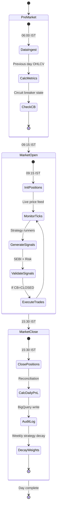
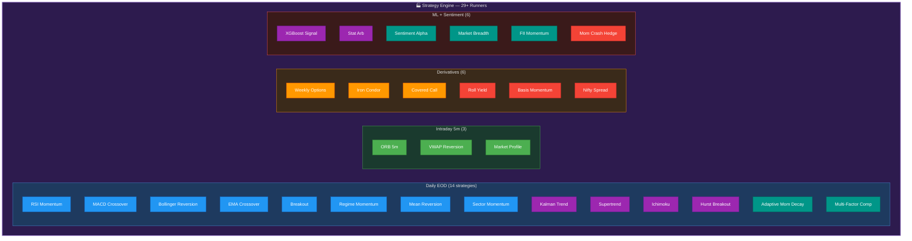
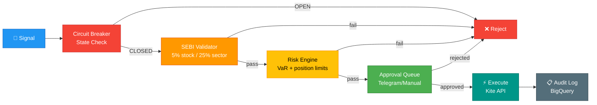
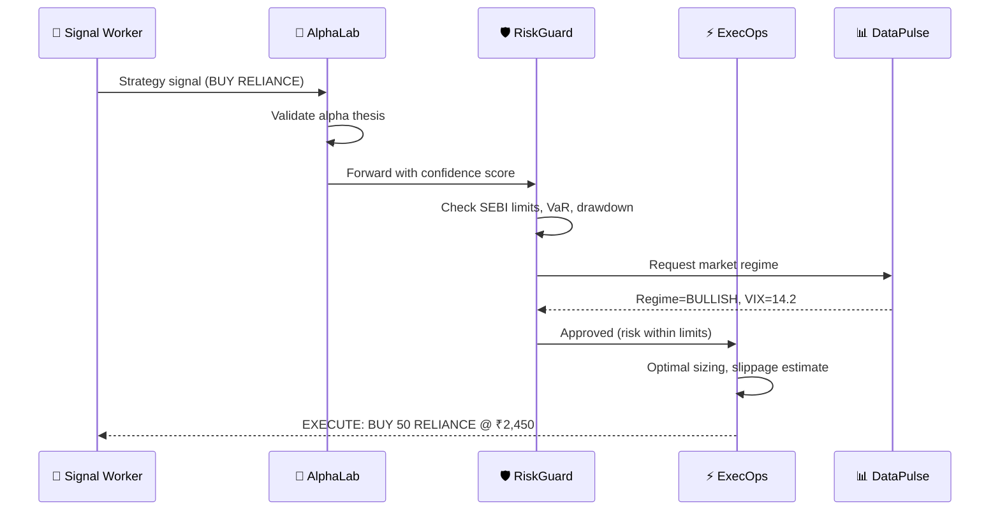
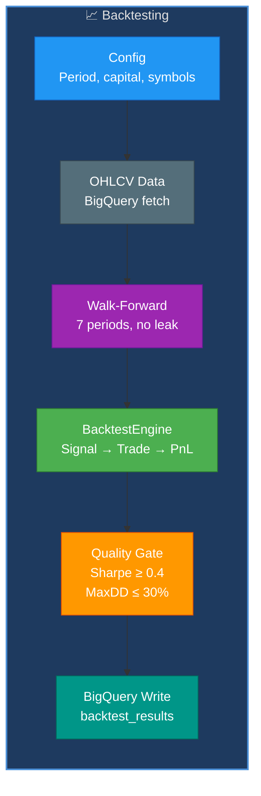

# AI Trading Intelligence — Technical Design Document

**Version:** 1.0 | **Date:** March 6, 2026 | **Status:** Partially Implemented (Phase 1-2 DONE)

---

## 1. System Overview

An institutional-grade algorithmic trading system for Indian markets (NSE/BSE) that combines quantitative strategies, machine learning, and multi-agent AI governance — with 29+ strategy runners, walk-forward backtesting, paper trading, and SEBI-compliant execution.

---

## 2. High-Level Architecture

```mermaid
graph TB
    subgraph DATA["📊 Data Layer"]
        style DATA fill:#1e3a5f,color:#e0e0e0,stroke:#4a90d9,stroke-width:2px
        KITE["Kite API<br/>Live + Historical"]:::blue
        NSE["NSE/BSE<br/>Options Chain, FII/DII"]:::green
        BQ["BigQuery<br/>System of Record"]:::purple
    end

    subgraph INTEL["🧠 Intelligence Layer — 29+ Strategies"]
        style INTEL fill:#2d1b4e,color:#e0e0e0,stroke:#8e6cc0,stroke-width:2px
        DAILY["Daily EOD<br/>14 strategies<br/>RSI, MACD, Bollinger..."]:::blue
        INTRA["Intraday 5m<br/>3 strategies<br/>ORB, VWAP, Market Profile"]:::green
        OPT["Options<br/>3 strategies<br/>Weekly, Iron Condor, CC"]:::orange
        FUT["Futures<br/>3 strategies<br/>Roll Yield, Basis Mom"]:::red
        ML["ML Models<br/>XGBoost, LSTM<br/>HMM Regime"]:::purple
        SENT["Sentiment<br/>Gemini Flash NLP<br/>FII/DII, VIX, PCR"]:::teal
    end

    subgraph GOV["🛡️ Governance Layer"]
        style GOV fill:#3a1a1a,color:#e0e0e0,stroke:#ef5350,stroke-width:2px
        CB["Circuit Breaker<br/>CLOSED / HALF_OPEN / OPEN"]:::red
        SEBI["SEBI Compliance<br/>5% stock, 25% sector"]:::orange
        RISK["Risk Engine<br/>VaR, MaxDD, Position"]:::yellow
        AUDIT["Audit Trail<br/>BigQuery 8yr retention"]:::grey
    end

    subgraph AGENTS["🤖 Multi-Agent System"]
        style AGENTS fill:#1a3a2e,color:#e0e0e0,stroke:#4caf50,stroke-width:2px
        ALPHA["AlphaLab<br/>Quant research"]:::green
        RGUARD["RiskGuard<br/>Risk analysis"]:::red
        EXEC["ExecOps<br/>Order quality"]:::blue
        DPULSE["DataPulse<br/>Market regime"]:::orange
    end

    subgraph EXECUTION["⚡ Execution Layer"]
        style EXECUTION fill:#3a2a1a,color:#e0e0e0,stroke:#ff9800,stroke-width:2px
        SIG["Signal Generation<br/>374 NSE symbols"]:::blue
        APPROVE["Approval Queue<br/>Telegram + Manual"]:::orange
        ORDER["Order Execution<br/>Kite API"]:::green
        POS["Position Manager<br/>Firestore state"]:::teal
    end

    DATA --> INTEL --> GOV --> EXECUTION
    AGENTS --> GOV

    classDef blue fill:#2196F3,color:#fff,stroke:#1565C0,stroke-width:1px
    classDef green fill:#4CAF50,color:#fff,stroke:#2E7D32,stroke-width:1px
    classDef orange fill:#FF9800,color:#fff,stroke:#E65100,stroke-width:1px
    classDef purple fill:#9C27B0,color:#fff,stroke:#6A1B9A,stroke-width:1px
    classDef red fill:#F44336,color:#fff,stroke:#C62828,stroke-width:1px
    classDef yellow fill:#FFC107,color:#000,stroke:#FF8F00,stroke-width:1px
    classDef teal fill:#009688,color:#fff,stroke:#00695C,stroke-width:1px
    classDef grey fill:#546E7A,color:#fff,stroke:#37474F,stroke-width:1px
```

---

## 3. Daily Trading Cycle

---

## 4. Module Deep Dives

### 4.1 Strategy Engine Architecture

### 4.2 Governance & Risk Pipeline

### 4.3 Multi-Agent Governance

### 4.4 Backtesting Engine

### 4.5 Cloud Infrastructure

```mermaid
flowchart TB
    subgraph GCP["☁️ GCP Infrastructure"]
        style GCP fill:#1a2a3a,color:#e0e0e0,stroke:#42a5f5,stroke-width:2px

        subgraph CR["Cloud Run (11 services)"]
            style CR fill:#1e3a5f,color:#e0e0e0,stroke:#4a90d9
            W1["Signal Worker"]:::blue
            W2["Executor Worker"]:::blue
            W3["Risk Worker"]:::blue
            W4["Portfolio Worker"]:::blue
            W5["Monitor Worker"]:::blue
            W6["LLM Narrator"]:::blue
        end

        subgraph PS["Pub/Sub (9 topics)"]
            style PS fill:#2d1b4e,color:#e0e0e0,stroke:#8e6cc0
            T1["sjarvis-signals"]:::purple
            T2["sjarvis-orders"]:::purple
            T3["sjarvis-risk-events"]:::purple
        end

        subgraph STORE2["Storage"]
            style STORE2 fill:#1a3a2e,color:#e0e0e0,stroke:#4caf50
            BQ2["BigQuery<br/>OHLCV, signals, fills"]:::green
            FS2["Firestore<br/>Circuit breaker, positions"]:::green
            GCS["GCS<br/>ML model artifacts"]:::green
        end

        subgraph SCHED["Cloud Scheduler (9 jobs)"]
            style SCHED fill:#3a2a1a,color:#e0e0e0,stroke:#ff9800
            J1["EOD Signals (17:30)"]:::orange
            J2["Token Rotation (03:15)"]:::orange
            J3["Sunday Backtest (15:30)"]:::orange
        end
    end

    SCHED --> PS --> CR --> STORE2

    classDef blue fill:#2196F3,color:#fff,stroke:#1565C0
    classDef green fill:#4CAF50,color:#fff,stroke:#2E7D32
    classDef orange fill:#FF9800,color:#fff,stroke:#E65100
    classDef purple fill:#9C27B0,color:#fff,stroke:#6A1B9A
```

---

## 5. Technology Justification

| Component | Chosen | Alternative | Why Chosen |
|-----------|--------|-------------|------------|
| **Broker API** | Kite Connect (Zerodha) | IBKR, Upstox | Best NSE/BSE coverage, reliable historical data |
| **Data Store** | BigQuery | PostgreSQL | Petabyte-scale analytics, serverless, partitioned by date |
| **State Store** | Firestore | Redis | Real-time sync, offline support, document model for positions |
| **Messaging** | Pub/Sub | Kafka, RabbitMQ | Serverless, auto-scaling, exactly-once support, DLQ |
| **Compute** | Cloud Run | GKE, EC2 | Scale-to-zero (₹0 when idle), auto-scaling, no cluster mgmt |
| **ML** | XGBoost + LSTM | LightGBM | XGBoost proven on tabular financial data; LSTM for sequence patterns |
| **Regime Detection** | HMM | k-means | HMM captures temporal dynamics (bull→bear transitions) |
| **Sentiment LLM** | Gemini Flash | GPT-4o | Free tier (15 RPM, 1M tokens/day), fast inference |
| **Agent Framework** | Custom + Claude | LangGraph | Lightweight, purpose-built for trading decisions |

---

## 6. Backtest Performance Summary

| Rank | Strategy | Sharpe | MaxDD | Quality Gate |
|------|----------|--------|-------|--------------|
| 1 | metals-cycle-v1 | 0.819 | 28.1% | ✅ PASS |
| 2 | eigen-trend-v1 | 0.478 | 18.2% | ✅ PASS |
| 3 | amd-v1 | 0.429 | 22.5% | ✅ PASS |
| 4 | ema-crossover-v1 | 0.290 | 43.9% | ❌ FAIL |
| 5 | supertrend-v1 | 0.213 | 52.3% | ❌ FAIL |

**Quality gate:** Sharpe ≥ 0.4 AND MaxDD ≤ 30%

---

## 7. Target Metrics

| Metric | Current | Target |
|--------|---------|--------|
| Sharpe Ratio | 0.819 (best) | > 1.5 (ensemble) |
| Max Drawdown | 18.2% (best) | < 15% |
| Win Rate | ~52% | > 55% |
| Cost per month | ₹5,000 | ₹5,000 (hard cap) |
| Signal latency | ~500ms | < 100ms |
| Test coverage | 73.65% | > 80% |

---

## 8. GenAI Skills Matrix

| Skill | Module | Role |
|-------|--------|------|
| LangGraph | Agent orchestrator | Multi-agent state machine for governance |
| CrewAI | Research agents | AlphaLab quant research team |
| RAG | Knowledge base | Strategy documentation + market context retrieval |
| LlamaIndex | Document indexing | Financial reports, SEBI circulars |
| Embeddings | Similarity search | Similar market regime identification |
| Vector DBs | Pinecone/Firestore | Strategy performance vectors, regime embeddings |
| OpenAI GPT | Report generation | Research reports, PR descriptions |
| Claude API | Agent reasoning | AlphaLab + RiskGuard high-reasoning decisions |
| Gemini API | Sentiment analysis | Free-tier news sentiment (15 RPM) |
| Guardrails | Trade validation | SEBI limits, position sizing constraints |
| Prompt Engineering | All agents | CoT for trading decisions |
| PEFT Fine-tuning | FinBERT | Indian market-specific sentiment model |
| HuggingFace | FinBERT, models | Financial NLP models |
| Transfer Learning | XGBoost | General ML → NSE-specific prediction |
| AWS/GCP AI | Vertex AI, BigQuery ML | Model training + serving on GCP |
