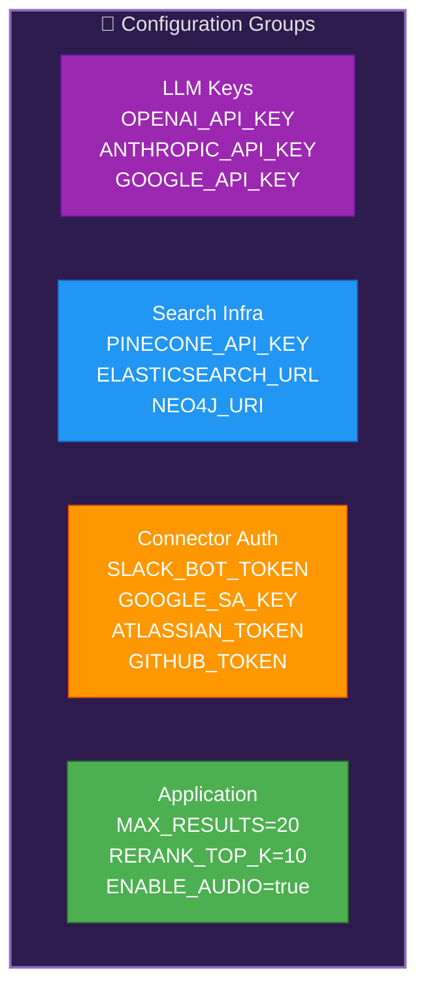
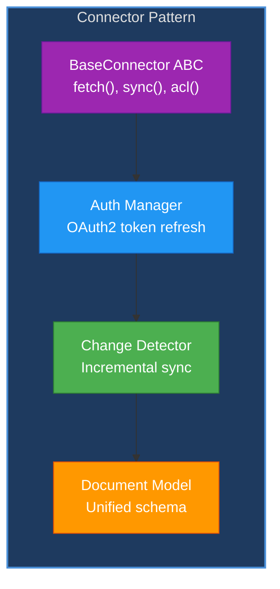
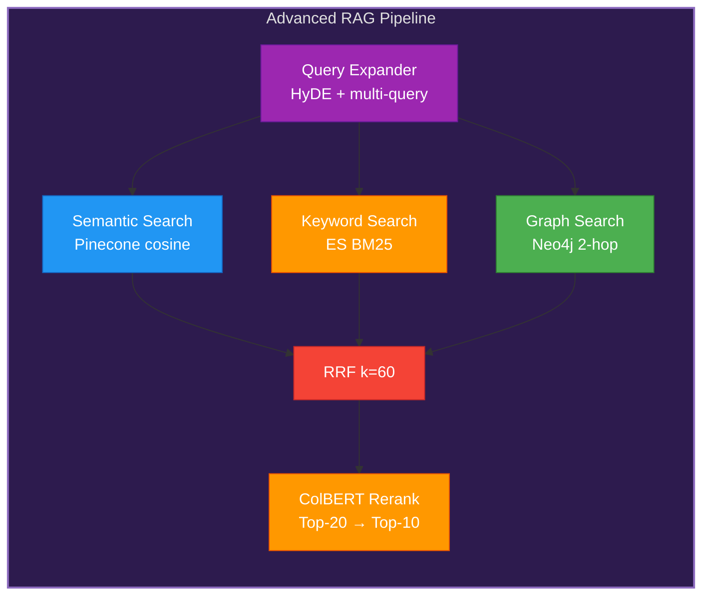
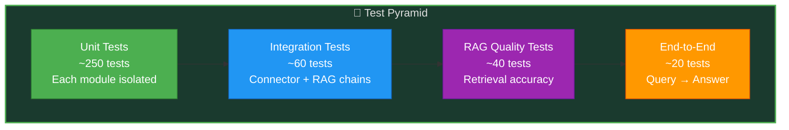
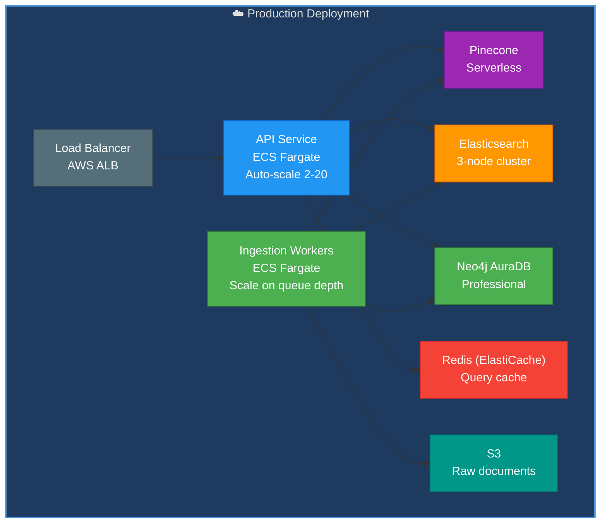
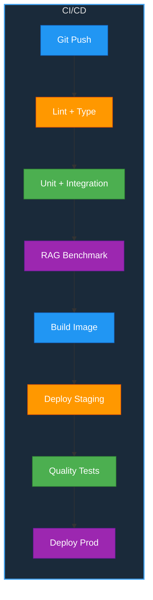
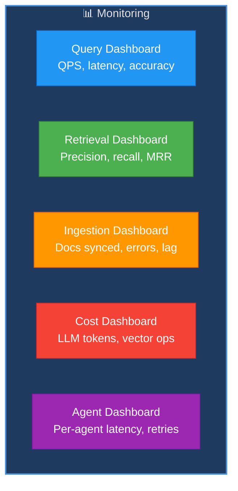
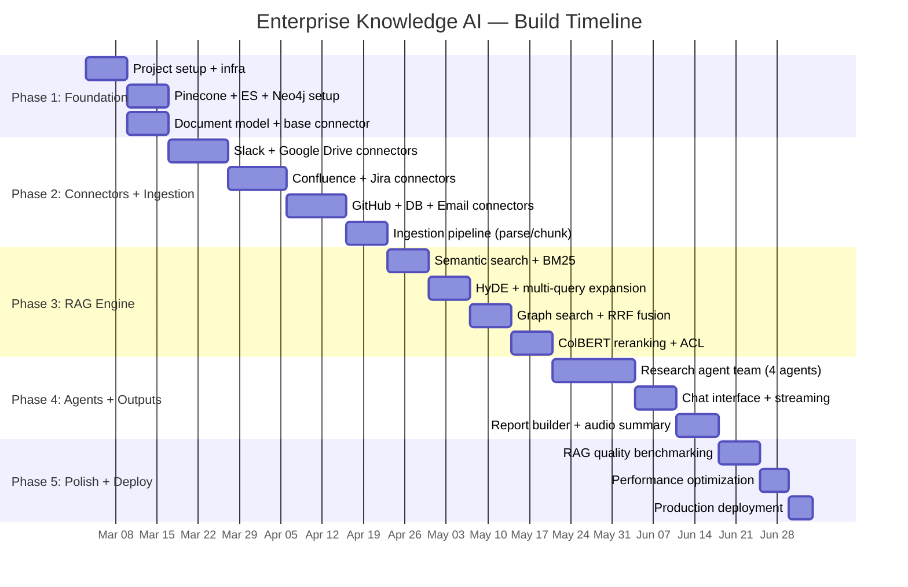

# Enterprise Knowledge AI — Complete Project Guide

**Version:** 1.0 | **Date:** March 6, 2026 | **Project Duration:** Mar 3 – Jul 3, 2026

---

## Table of Contents

1. [Project Overview](#1-project-overview)
2. [Installation & Setup](#2-installation--setup)
3. [Environment Configuration](#3-environment-configuration)
4. [Architecture & Module Plan](#4-architecture--module-plan)
5. [Code Plan (Module-by-Module)](#5-code-plan-module-by-module)
6. [Test Plan](#6-test-plan)
7. [Deployment Plan](#7-deployment-plan)
8. [Monitoring & Observability](#8-monitoring--observability)
9. [GenAI Skills Usage Strategy](#9-genai-skills-usage-strategy)
10. [Phase-by-Phase Execution Timeline](#10-phase-by-phase-execution-timeline)
11. [Risk & Mitigation](#11-risk--mitigation)
12. [Cost Strategy](#12-cost-strategy)

---

## 1. Project Overview

Build an enterprise-grade knowledge search and research platform — combining 7 data connectors, advanced multi-stage RAG, a 4-agent research team, and 4 output interfaces (chat, reports, audio summaries, API).

### Success Metrics

| Metric | Target |
|--------|--------|
| Answer accuracy | > 90% |
| Citation precision | > 95% |
| Query latency (P95) | < 3 seconds |
| Hallucination rate | < 2% |
| Indexing throughput | > 10K docs/hour |

---

## 2. Installation & Setup

### 2.1 Prerequisites

```mermaid
flowchart LR
    subgraph PREREQ["✅ Prerequisites"]
        style PREREQ fill:#1a3a2e,color:#e0e0e0,stroke:#4caf50,stroke-width:2px
        PY["Python 3.11+"]:::green
        DOC["Docker 24+"]:::blue
        NODE["Node.js 20+<br/>(frontend)"]:::green
        ELASTIC["Elasticsearch 8.x"]:::orange
        NEO3["Neo4j 5.x"]:::purple
    end

    subgraph KEYS["🔑 API Keys"]
        style KEYS fill:#3a2a1a,color:#e0e0e0,stroke:#ff9800,stroke-width:2px
        OAI["OpenAI API Key<br/>GPT-4o + embeddings"]:::orange
        ANT["Anthropic API Key<br/>Claude Opus + Sonnet"]:::purple
        GEM["Google AI Key<br/>Gemini Pro (2M ctx)"]:::blue
        PIN["Pinecone API Key"]:::teal
        SLACK3["Slack Bot Token<br/>OAuth2 scopes"]:::blue
        GOOG["Google Workspace<br/>Service account"]:::green
    end

    PREREQ --> KEYS

    classDef blue fill:#2196F3,color:#fff,stroke:#1565C0
    classDef green fill:#4CAF50,color:#fff,stroke:#2E7D32
    classDef orange fill:#FF9800,color:#fff,stroke:#E65100
    classDef purple fill:#9C27B0,color:#fff,stroke:#6A1B9A
    classDef teal fill:#009688,color:#fff,stroke:#00695C
```



### 2.2 Setup Steps

1. **Clone repo and create virtual environment**
2. **Install Python dependencies** — LlamaIndex, LangGraph, CrewAI, Pinecone, elasticsearch, neo4j, unstructured
3. **Install Elasticsearch** — Docker or managed service
4. **Install Neo4j** — Docker or AuraDB
5. **Configure Pinecone** — Create index (3072 dims, cosine, serverless)
6. **Setup OAuth apps** — Slack, Google Workspace, Atlassian, GitHub
7. **Configure environment** — `.env` with all API keys and service credentials
8. **Run initial ingest** — Test with one connector (e.g., Google Drive)
9. **Verify setup** — Run health check and test query

### 2.3 Directory Structure Plan

```
enterprise-knowledge-ai/
├── src/
│   ├── connectors/              # 7 enterprise connectors
│   │   ├── base_connector.py
│   │   ├── slack_connector.py
│   │   ├── google_drive_connector.py
│   │   ├── confluence_connector.py
│   │   ├── jira_connector.py
│   │   ├── github_connector.py
│   │   ├── database_connector.py
│   │   └── email_connector.py
│   ├── ingestion/               # Document processing
│   │   ├── crawler.py
│   │   ├── parser.py
│   │   ├── chunker.py
│   │   ├── embedder.py
│   │   └── acl_resolver.py
│   ├── retrieval/               # Advanced RAG engine
│   │   ├── query_expander.py
│   │   ├── hyde.py
│   │   ├── semantic_search.py
│   │   ├── bm25_search.py
│   │   ├── graph_search.py
│   │   ├── rrf_fusion.py
│   │   └── reranker.py
│   ├── agents/                  # Research team
│   │   ├── researcher.py
│   │   ├── analyst.py
│   │   ├── writer.py
│   │   └── fact_checker.py
│   ├── output/                  # 4 interfaces
│   │   ├── chat_interface.py
│   │   ├── report_builder.py
│   │   ├── audio_summary.py
│   │   └── rest_api.py
│   ├── knowledge_graph/         # Neo4j management
│   │   ├── graph_builder.py
│   │   ├── entity_extractor.py
│   │   └── graph_queries.py
│   └── utils/                   # Shared utilities
├── frontend/                    # React/Next.js chat UI
├── config/
├── tests/
├── docker/
└── pyproject.toml
```

---

## 3. Environment Configuration

### 3.1 Environment Variables



### 3.2 Model Configuration

| Component | Model | Max Tokens | Temperature |
|-----------|-------|------------|-------------|
| Researcher | Claude Opus 4 | 16K | 0.2 |
| Analyst | GPT-4o | 8K | 0.1 |
| Writer | Claude Sonnet 4 | 8K | 0.3 |
| Fact-Checker | Gemini Pro (2M) | 8K | 0.0 |
| Query expansion | GPT-4o-mini | 2K | 0.5 |
| Embeddings | text-embedding-3-large | — | — |

---

## 4. Architecture & Module Plan

### 4.1 Complete System Flow

```mermaid
flowchart TB
    subgraph M1["Module 1: Connectors (7)"]
        style M1 fill:#1e3a5f,color:#e0e0e0,stroke:#4a90d9,stroke-width:2px
        C_SLACK["Slack<br/>OAuth2 + Socket"]:::blue
        C_DRIVE["Google Drive<br/>Service Account"]:::green
        C_CONF["Confluence<br/>REST API"]:::purple
        C_JIRA["Jira<br/>REST API"]:::orange
        C_GH["GitHub<br/>App API"]:::grey
        C_DB["Database<br/>SQLAlchemy"]:::teal
        C_MAIL["Email<br/>IMAP / Graph"]:::red
    end

    subgraph M2["Module 2: Ingestion"]
        style M2 fill:#1a3a2e,color:#e0e0e0,stroke:#4caf50,stroke-width:2px
        I_CRAWL["Incremental Crawler"]:::green
        I_PARSE["Unstructured.io Parser"]:::green
        I_CHUNK["LlamaIndex Chunker"]:::blue
        I_EMBED["Batch Embedder"]:::purple
        I_ACL["ACL Sync"]:::red
    end

    subgraph M3["Module 3: RAG Engine"]
        style M3 fill:#2d1b4e,color:#e0e0e0,stroke:#8e6cc0,stroke-width:2px
        R_EXPAND["Query Expansion<br/>HyDE + Multi-Query"]:::purple
        R_SEM["Semantic Search<br/>Pinecone"]:::blue
        R_BM25_2["BM25 Search<br/>Elasticsearch"]:::orange
        R_GRAPH2["Graph Search<br/>Neo4j"]:::green
        R_FUSE["RRF Fusion"]:::red
        R_RERANK["ColBERT Rerank"]:::orange
    end

    subgraph M4["Module 4: Research Agents"]
        style M4 fill:#3a2a1a,color:#e0e0e0,stroke:#ff9800,stroke-width:2px
        A_RES["Researcher"]:::purple
        A_ANA["Analyst"]:::blue
        A_WRI["Writer"]:::green
        A_FCK["Fact-Checker"]:::orange
    end

    subgraph M5["Module 5: Outputs"]
        style M5 fill:#1a2a3a,color:#e0e0e0,stroke:#42a5f5,stroke-width:2px
        O_CHAT["Chat Interface"]:::blue
        O_RPT["Report Builder"]:::green
        O_AUD["Audio Summary"]:::orange
        O_API["REST API"]:::purple
    end

    M1 --> M2 --> M3 --> M4 --> M5

    classDef blue fill:#2196F3,color:#fff,stroke:#1565C0
    classDef green fill:#4CAF50,color:#fff,stroke:#2E7D32
    classDef orange fill:#FF9800,color:#fff,stroke:#E65100
    classDef purple fill:#9C27B0,color:#fff,stroke:#6A1B9A
    classDef red fill:#F44336,color:#fff,stroke:#C62828
    classDef teal fill:#009688,color:#fff,stroke:#00695C
    classDef grey fill:#546E7A,color:#fff,stroke:#37474F
```



---

## 5. Code Plan (Module-by-Module)

> **Note:** Describes WHAT to build and HOW to structure it — no actual code.

### 5.1 Module 1: Enterprise Connectors



**Files to create per connector:**
- `base_connector.py` — ABC with `fetch_all()`, `fetch_incremental()`, `resolve_acl()`
- `slack_connector.py` — Slack Web API + Socket Mode, channel/thread parsing
- `google_drive_connector.py` — Service account, Docs/Sheets/Slides export
- `confluence_connector.py` — REST API, space/page crawling, rich content
- `jira_connector.py` — REST API, issue + comment extraction
- `github_connector.py` — App API, code + PR + issue indexing
- `database_connector.py` — SQLAlchemy, schema + sample data extraction
- `email_connector.py` — IMAP/Graph API, thread reconstruction

### 5.2 Module 2: Ingestion Pipeline

**Files to create:**
- `crawler.py` — Orchestrates connectors, schedules incremental syncs
- `parser.py` — Unstructured.io wrapper: PDF, DOCX, HTML, Markdown, images
- `chunker.py` — LlamaIndex semantic chunking with metadata preservation
- `embedder.py` — Batch embedding with text-embedding-3-large, rate limiting
- `acl_resolver.py` — User→Group→Document permission chain resolution

### 5.3 Module 3: RAG Engine



**Files to create:**
- `query_expander.py` — Multi-query reformulation (3-5 variants)
- `hyde.py` — Hypothetical Document Embeddings: generate answer → embed → search
- `semantic_search.py` — Pinecone search with metadata filters + ACL
- `bm25_search.py` — Elasticsearch BM25 with analyzers
- `graph_search.py` — Neo4j entity-based traversal + context expansion
- `rrf_fusion.py` — Reciprocal Rank Fusion (k=60) combining all 3 paths
- `reranker.py` — ColBERT cross-encoder reranking, token-level interaction

### 5.4 Module 4: Research Agents

**Files to create:**
- `researcher.py` — Multi-hop retrieval, question decomposition, Claude Opus
- `analyst.py` — Data extraction, table/chart analysis, GPT-4o
- `writer.py` — Answer composition with inline citations, Claude Sonnet
- `fact_checker.py` — Citation accuracy verification, Gemini Pro (2M context)
- `crew_config.py` — CrewAI team definition and delegation rules

### 5.5 Module 5: Output Interfaces

**Files to create:**
- `chat_interface.py` — WebSocket streaming, citation sidebar, follow-up suggestions
- `report_builder.py` — Multi-section research report, charts, PDF export
- `audio_summary.py` — XTTS v2 text-to-speech, 2-speaker debate format
- `rest_api.py` — FastAPI with `/search`, `/research`, `/report` endpoints + SSE streaming

### 5.6 Knowledge Graph (Neo4j)

**Files to create:**
- `entity_extractor.py` — NER: person, project, topic, team, technology
- `graph_builder.py` — Create nodes + relationships from extracted entities
- `graph_queries.py` — Traversal queries: "who worked on X", "docs about Y"

---

## 6. Test Plan

### 6.1 Test Strategy



### 6.2 Test Coverage

| Module | Tests | What to Verify |
|--------|-------|----------------|
| 7 Connectors | 70 (10 each) | Auth, fetch, incremental sync, ACL |
| Parser | 20 | PDF, DOCX, HTML, table extraction |
| Chunker | 15 | Chunk boundaries, metadata preservation |
| Embedder | 10 | Correct dimensions, batch handling |
| Query Expander | 15 | Multi-query diversity, HyDE quality |
| Semantic Search | 15 | Relevant results, ACL filtering |
| BM25 Search | 15 | Keyword matching accuracy |
| Graph Search | 15 | Entity traversal correctness |
| RRF Fusion | 10 | Rank combination correctness |
| Reranker | 10 | Ordering improvement over raw retrieval |
| 4 Agents | 40 (10 each) | Output quality, citation accuracy |
| Outputs | 20 | Chat streaming, report formatting, audio |

### 6.3 RAG Quality Benchmarks

| Test Set | Size | Target | Measurement |
|----------|------|--------|-------------|
| Known Q&A pairs | 200 | > 90% accuracy | Human evaluation |
| Citation precision | 100 | > 95% | Source match |
| Hallucination detection | 50 | < 2% rate | Fact-checker pass |
| Cross-source queries | 50 | > 85% accuracy | Multi-connector answers |

---

## 7. Deployment Plan

### 7.1 Deployment Architecture



### 7.2 Deployment Steps

| Phase | Action | Duration |
|-------|--------|----------|
| 1 | Provision infra (Pinecone, ES, Neo4j, Redis) | 1 day |
| 2 | Deploy ingestion workers, run initial sync | 2-3 days |
| 3 | Deploy API service + chat frontend | 1 day |
| 4 | Run RAG quality benchmark on production data | 2 days |
| 5 | Beta launch (10 users), collect feedback | 1 week |
| 6 | Full rollout + monitoring | 1 day |

### 7.3 CI/CD Pipeline



---

## 8. Monitoring & Observability

### 8.1 Dashboards



### 8.2 Alerting

| Alert | Condition | Severity |
|-------|-----------|----------|
| Query latency > 5s | P95, 10-min window | Error |
| Retrieval accuracy < 85% | Continuous benchmark | Critical |
| Ingestion backlog > 1000 docs | Queue depth | Warning |
| LLM cost > $100/day | Daily total | Warning |
| Connector auth failure | Any connector | Error |
| Hallucination rate > 5% | Fact-checker reports | Critical |

---

## 9. GenAI Skills Usage Strategy

| # | Skill | Where Used | Strategy |
|---|-------|-----------|----------|
| 1 | LangGraph | Query pipeline | Multi-stage retrieval + agent state machine |
| 2 | LangChain | Connectors + tools | Tool wrappers for 7 data sources |
| 3 | CrewAI | Research team | 4-agent hierarchical research pipeline |
| 4 | AutoGen | Debate | Writer ↔ Fact-Checker citation verification |
| 5 | RAG | Core retrieval | Document search with citation tracking |
| 6 | Advanced RAG | Core retrieval | HyDE + multi-query + RRF + ColBERT rerank |
| 7 | LlamaIndex | Ingestion | Semantic chunking + document querying |
| 8 | Embeddings | Vector search | text-embedding-3-large for 3072-dim vectors |
| 9 | Vector DBs | Pinecone | 100M+ enterprise document vectors |
| 10 | OpenAI GPT | Analyst | Structured data analysis + query expansion |
| 11 | Claude API | Researcher + Writer | 200K context research synthesis |
| 12 | Gemini API | Fact-Checker | 2M context for full-corpus verification |
| 13 | Guardrails | Safety | PII filter, toxicity, hallucination detection |
| 14 | Prompt Engineering | All agents | Research prompts, citation formatting |
| 15 | Few-Shot | Query classification | Example queries → intent mapping |
| 16 | PEFT | Embeddings | Fine-tune for domain-specific vocabulary |
| 17 | Transfer Learning | NER | General NER → company-specific entities |
| 18 | HuggingFace | ColBERT, XTTS | Reranker + text-to-speech models |
| 19 | NLP | Entity extraction | Named entity recognition across documents |
| 20 | Model Quantization | ColBERT | INT8 for faster reranking |
| 21 | vLLM | Self-hosted models | Local inference for ColBERT + embeddings |
| 22 | AWS AI/ML | SageMaker | Model hosting + fine-tuning compute |

---

## 10. Phase-by-Phase Execution Timeline



---

## 11. Risk & Mitigation

| Risk | Probability | Impact | Mitigation |
|------|------------|--------|------------|
| Data freshness lag | Medium | Medium | Incremental sync every 15 min, webhook-triggered updates |
| ACL misconfiguration | Medium | Critical | Unit test every permission path, manual audit quarterly |
| Hallucinated answers | Medium | High | Fact-checker agent, citation-required output format |
| Pinecone cost at scale | Medium | Medium | Serverless tier, index lifecycle management |
| Connector API changes | Low | Medium | Versioned API clients, regression tests |
| GDPR/compliance | Medium | Critical | PII detection, right-to-forget pipeline |

---

## 12. Cost Strategy

| Component | Monthly Estimate | Optimization |
|-----------|-----------------|--------------|
| Pinecone (100M vectors) | $70-350 | Serverless, delete stale vectors |
| Elasticsearch (3 nodes) | $200-400 | Managed service, auto-scaling |
| Neo4j AuraDB | $65-200 | Start free → Professional |
| Claude Opus (Researcher) | $100-200 | Cache common research patterns |
| GPT-4o (Analyst) | $50-100 | Use GPT-4o-mini for simple queries |
| Gemini Pro (Fact-Checker) | $20-50 | Batch verification |
| Embeddings (3-large) | $30-60 | Incremental re-embedding only |
| ECS Fargate | $100-200 | Auto-scale, spot instances |
| **Total** | **$635-1,560/month** | **Target: < $1,000/month** |
