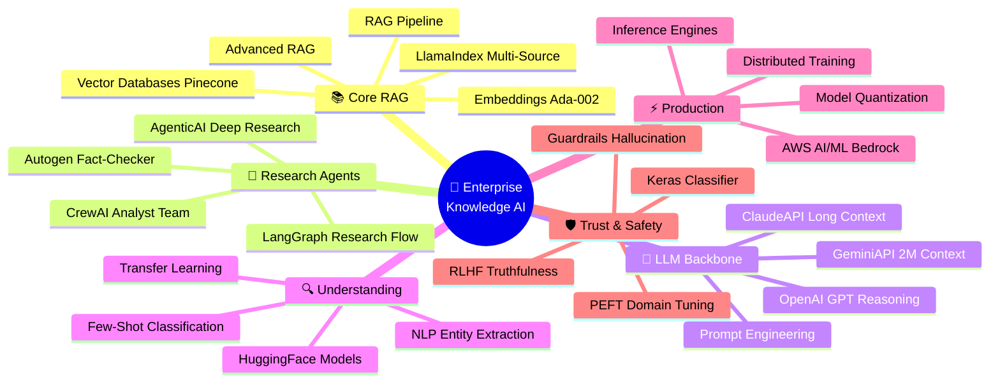
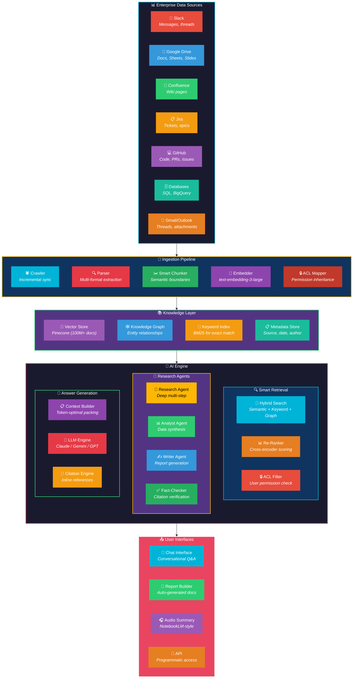
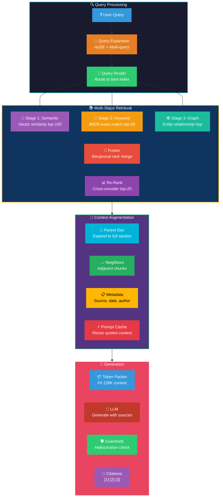
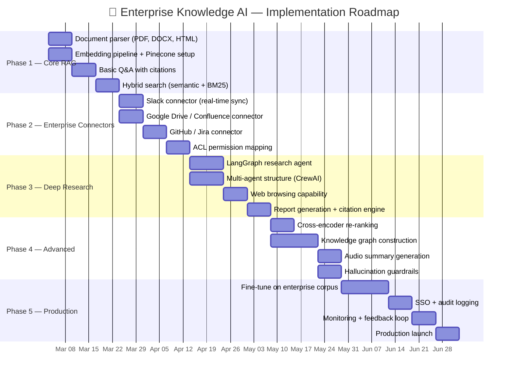

# 🧠 Project 4: Enterprise Knowledge AI & Autonomous Research

> **Real-World Inspiration:** Perplexity AI, Glean, Google NotebookLM, OpenAI Deep Research, Anthropic Claude Projects, Microsoft Copilot for M365
>
> **Status:** Reshaping knowledge work — Perplexity at $9B valuation processing 100M+ queries/month, Glean valued at $4.6B for enterprise AI search, NotebookLM used by millions for document analysis

---

## 🌍 What's Happening in the Real World (2025-2026)

| Company | Product | Impact |
|---------|---------|--------|
| **Perplexity** | Perplexity Pro | AI-native search engine — $9B valuation, 100M+ queries/month. Deep Research mode: multi-step autonomous research with citations |
| **Glean** | Enterprise AI | Enterprise search + knowledge AI. $4.6B valuation. Indexes Slack, Confluence, Drive, Jira. Used by Databricks, Duolingo, Grammarly |
| **Google** | NotebookLM | AI research assistant — upload 50 sources, generates podcast-style summaries, answers questions with citations. Built on Gemini |
| **OpenAI** | Deep Research | Autonomous research agent — spends minutes to hours on complex research. Browses web, synthesizes findings, produces reports |
| **Anthropic** | Claude Projects | Project-based knowledge — upload docs, maintain context across conversations. Used by McKinsey, BCG for consulting research |
| **Microsoft** | Copilot for M365 | Enterprise AI across Office suite — summarizes meetings, drafts emails, searches SharePoint. 400M+ Office users |

---

## 🎯 Project Goal

Build an **Enterprise Knowledge AI System** that can:
1. Index all enterprise data sources (docs, Slack, email, databases, code)
2. Answer questions with precise citations (no hallucinations)
3. Conduct autonomous multi-step research on complex topics
4. Generate reports, summaries, and presentations
5. Learn organizational context and tribal knowledge
6. Maintain strict data access controls and audit trails

---

## 🧠 GenAI Skills & Tools Involved

---

## 🏗️ System Architecture

---

## 🔄 Autonomous Research Workflow

```mermaid
stateDiagram-v2
    [*] --> QueryReceived: 🔍 User asks complex question

    QueryReceived --> Planning: 📋 Decompose into sub-questions

    state Planning {
        [*] --> Decompose: Break into 3-8 sub-queries
        Decompose --> Prioritize: Order by dependency
        Prioritize --> [*]
    }

    Planning --> Research: 🔬 Execute research plan

    state Research {
        [*] --> Search: Retrieve from knowledge base
        Search --> Web: Browse external sources
        Web --> Analyze: Extract key findings
        Analyze --> Verify: Cross-reference sources
        Verify --> Search: Need more info
        Verify --> [*]: Sufficient evidence
    }

    Research --> Synthesis: ✍️ Synthesize findings

    state Synthesis {
        [*] --> Outline: Create report structure
        Outline --> Draft: Write with citations
        Draft --> FactCheck: Verify all claims
        FactCheck --> Draft: Claims unsupported
        FactCheck --> [*]: All verified
    }

    Synthesis --> Delivery: 📤 Deliver to user

    state Delivery {
        [*] --> Format: Format report / chat answer
        Format --> Cite: Add inline citations
        Cite --> Confidence: Add confidence scores
        Confidence --> [*]
    }

    Delivery --> [*]: ✅ Research complete
```

---

## 🔍 Advanced RAG Architecture

---

## 🤖 Deep Research Agent Flow

```mermaid
sequenceDiagram
    participant User as 👤 User
    participant Planner2 as 📋 Planner Agent
    participant Researcher2 as 🔬 Research Agent
    participant Knowledge2 as 📚 Knowledge Base
    participant Web as 🌐 Web Browser
    participant Analyst2 as 📊 Analyst Agent
    participant Writer2 as ✍️ Writer Agent
    participant Checker as ✅ Fact Checker

    User->>Planner2: "What are the competitive dynamics in<br/>Indian cloud market and how should we position?"

    rect rgb(15, 52, 96)
        Note over Planner2,Planner2: 📋 Decomposition
        Planner2->>Planner2: Break into sub-questions:<br/>1. Market size & growth<br/>2. Key players & share<br/>3. Pricing comparison<br/>4. India-specific regulations<br/>5. Our current footprint<br/>6. Strategic recommendations
    end

    rect rgb(83, 52, 131)
        Note over Researcher2,Web: 🔬 Parallel Research (3-5 min)
        par Sub-question 1-2
            Researcher2->>Knowledge2: Search internal strategy docs
            Researcher2->>Web: Search Gartner, IDC reports
        and Sub-question 3-4
            Researcher2->>Web: Search pricing pages, MEITY policies
            Researcher2->>Knowledge2: Search compliance docs
        and Sub-question 5
            Researcher2->>Knowledge2: Search sales data, CRM
        end
    end

    rect rgb(26, 26, 46)
        Note over Analyst2,Analyst2: 📊 Analysis & Synthesis
        Researcher2->>Analyst2: Raw findings from 50+ sources
        Analyst2->>Analyst2: Extract insights, build matrices
        Analyst2->>Analyst2: Identify patterns & gaps
    end

    rect rgb(233, 69, 96)
        Note over Writer2,Checker: ✍️ Report Generation
        Analyst2->>Writer2: Structured insights
        Writer2->>Writer2: Generate 15-page report
        Writer2->>Checker: Draft with 40+ claims
        Checker->>Checker: Verify each claim against sources
        Checker-->>Writer2: 3 claims flagged (modified)
        Writer2-->>User: Final report with 37 verified citations
    end
```

---

## 🛠️ Tech Stack Mapping

| Component | Technology | GenAI Skill Used |
|-----------|-----------|-----------------|
| **Document Indexing** | LlamaIndex multi-source | `LlamaIndex`, `RAG`, `AdvancedRAG` |
| **Embeddings** | text-embedding-3-large | `Embeddings` |
| **Vector Store** | Pinecone (100M+ vectors) | `Vector-Databases` |
| **Hybrid Search** | Semantic + BM25 + Graph | `RAG`, `AdvancedRAG` |
| **Re-Ranking** | Cross-encoder (ColBERT) | `NLP`, `TransferLearning`, `HuggingFace` |
| **Research Agent** | LangGraph deep research | `LangGraph`, `AgenticAI` |
| **Analyst Team** | CrewAI multi-agent | `CrewAI`, `Autogen` |
| **LLM Backbone** | Claude Opus (200K context) | `ClaudeAPI`, `PromptEngineering` |
| **Long Context** | Gemini Pro (2M context) | `GeminiAPI` |
| **Fast Answers** | GPT-4o-mini (cheap, fast) | `OpenAI-GPT` |
| **Classification** | Few-shot query routing | `FewShotZeroShot` |
| **Guardrails** | Hallucination detection | `Guardrails`, `RLHF` |
| **Domain Tuning** | QLoRA on enterprise corpus | `PEFT-FineTuning` |
| **Model Serving** | vLLM for self-hosted models | `InferenceEngines`, `ModelQuantization` |
| **Cloud Deploy** | Bedrock + SageMaker | `AWS-AI-ML` |
| **Entity Recognition** | Custom NER for company data | `NLP`, `Keras` |
| **Training** | Distributed fine-tuning | `DistributedTraining` |
| **Web Browsing** | LangChain browser tools | `LangChain` |

---

## 📊 Implementation Phases

---

## 🎯 Key Metrics

| Metric | Target | Benchmark |
|--------|--------|-----------|
| Answer accuracy (RAGAS) | > 90% | Industry: 70-80% |
| Citation precision | > 95% | Every claim has a source |
| Query latency (P95) | < 3s | Simple questions < 1s |
| Deep research time | < 10 min | Manual: 2-4 hours |
| Hallucination rate | < 2% | Industry: 5-15% |
| User satisfaction (CSAT) | > 4.5/5 | Measured via feedback |
| Documents indexed | 10M+ | Incremental daily sync |
| ACL compliance | 100% | User only sees permitted docs |
