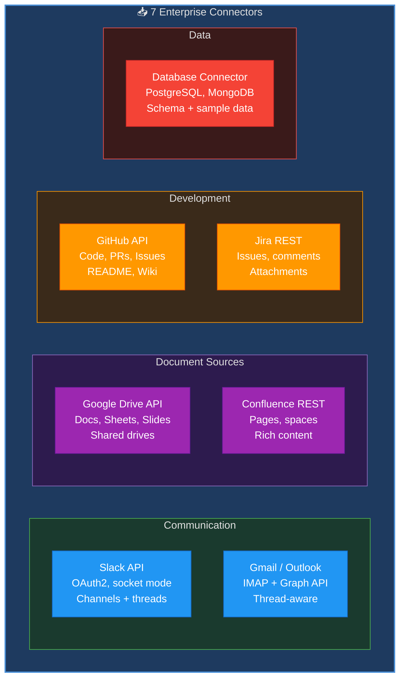
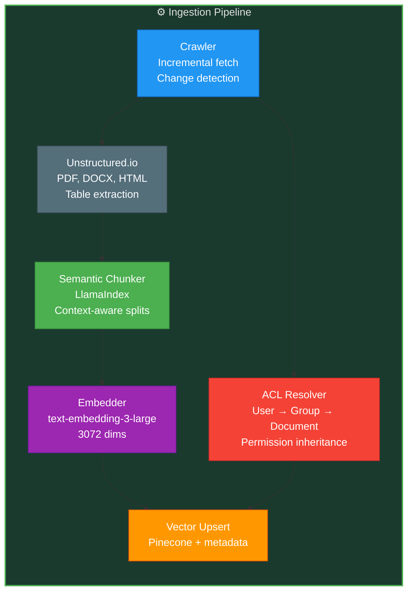
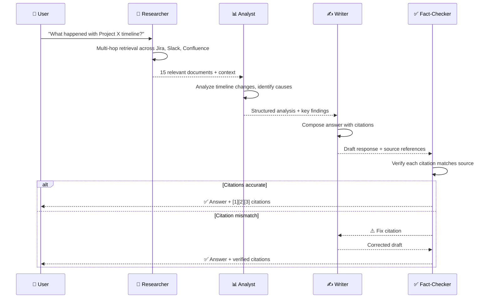
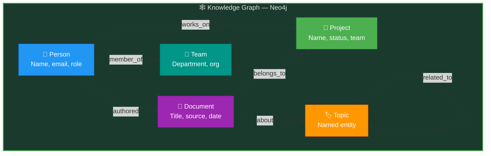
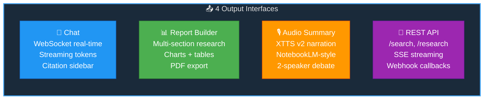
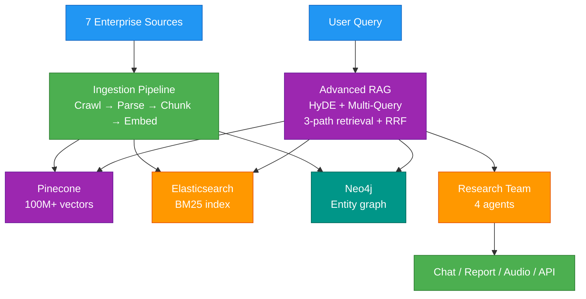

# Enterprise Knowledge AI — Technical Design Document

**Version:** 1.0 | **Date:** March 6, 2026 | **Status:** Pre-Implementation Blueprint

---

## 1. System Overview

An enterprise-grade knowledge search and research platform that indexes organizational data across 7 connectors (Slack, Google Drive, Confluence, Jira, GitHub, Databases, Email), applies advanced RAG (HyDE + multi-query + multi-stage retrieval + RRF + cross-encoder reranking), and delivers answers through chat, research reports, audio summaries, and REST API — inspired by Perplexity, Glean, and NotebookLM.

---

## 2. High-Level Architecture

```mermaid
graph TB
    subgraph SOURCES["📥 7 Enterprise Connectors"]
        style SOURCES fill:#1e3a5f,color:#e0e0e0,stroke:#4a90d9,stroke-width:2px
        SLACK["💬 Slack<br/>Channels + DMs"]:::blue
        DRIVE["📁 Google Drive<br/>Docs, Sheets, Slides"]:::green
        CONF["📝 Confluence<br/>Pages + Spaces"]:::purple
        JIRA["📋 Jira<br/>Issues + Comments"]:::orange
        GH["🐙 GitHub<br/>Code + PRs + Issues"]:::grey
        DB["🗄️ Databases<br/>PostgreSQL, MongoDB"]:::teal
        EMAIL["✉️ Email<br/>Gmail + Outlook"]:::red
    end

    subgraph INGEST["⚙️ Ingestion Pipeline"]
        style INGEST fill:#1a3a2e,color:#e0e0e0,stroke:#4caf50,stroke-width:2px
        CRAWL["Crawl + Fetch<br/>Incremental sync"]:::green
        PARSE["Parse + Extract<br/>Unstructured.io"]:::green
        CHUNK["Semantic Chunker<br/>LlamaIndex"]:::blue
        EMBED["Embeddings<br/>text-embedding-3-large"]:::purple
        ACL["ACL Sync<br/>Permission-aware"]:::red
    end

    subgraph RAG_ENG["🔍 Advanced RAG Engine"]
        style RAG_ENG fill:#2d1b4e,color:#e0e0e0,stroke:#8e6cc0,stroke-width:2px
        HYDE["HyDE<br/>Hypothetical Doc Embed"]:::purple
        MQ["Multi-Query<br/>Query expansion"]:::purple
        SEM["Semantic Search<br/>Pinecone"]:::blue
        BM25["BM25 Keyword<br/>Elasticsearch"]:::orange
        GRAPH["Graph Search<br/>Neo4j entity links"]:::green
        RRF["RRF Fusion<br/>Reciprocal Rank"]:::red
        RERANK["Cross-Encoder<br/>ColBERT rerank"]:::orange
    end

    subgraph AGENTS2["🤖 Research Agent Team"]
        style AGENTS2 fill:#3a2a1a,color:#e0e0e0,stroke:#ff9800,stroke-width:2px
        RES["Researcher<br/>Claude Opus"]:::purple
        ANA["Analyst<br/>GPT-4o"]:::blue
        WRI["Writer<br/>Claude Sonnet"]:::green
        FCK["Fact-Checker<br/>Gemini 2M ctx"]:::orange
    end

    subgraph OUTPUT["📤 4 Output Interfaces"]
        style OUTPUT fill:#1a2a3a,color:#e0e0e0,stroke:#42a5f5,stroke-width:2px
        CHAT["💬 Chat Interface<br/>Real-time Q&A"]:::blue
        REPORT["📊 Report Builder<br/>PDF + interactive"]:::green
        AUDIO["🎙️ Audio Summary<br/>NotebookLM-style"]:::orange
        API["🔗 REST API<br/>Integration endpoint"]:::teal
    end

    SOURCES --> INGEST --> RAG_ENG --> AGENTS2 --> OUTPUT

    classDef blue fill:#2196F3,color:#fff,stroke:#1565C0,stroke-width:1px
    classDef green fill:#4CAF50,color:#fff,stroke:#2E7D32,stroke-width:1px
    classDef orange fill:#FF9800,color:#fff,stroke:#E65100,stroke-width:1px
    classDef purple fill:#9C27B0,color:#fff,stroke:#6A1B9A,stroke-width:1px
    classDef red fill:#F44336,color:#fff,stroke:#C62828,stroke-width:1px
    classDef teal fill:#009688,color:#fff,stroke:#00695C,stroke-width:1px
    classDef grey fill:#546E7A,color:#fff,stroke:#37474F,stroke-width:1px
```

---

## 3. Query Processing Flow

```mermaid
stateDiagram-v2
    [*] --> QueryReceived

    state QueryProcessing {
        [*] --> QueryAnalysis : Classify intent
        QueryAnalysis --> MultiQuery : Expand to 3-5 sub-queries
        MultiQuery --> HyDE_Gen : Generate hypothetical answer
        HyDE_Gen --> [*]
    }

    state Retrieval {
        [*] --> SemanticSearch : Pinecone top-100
        SemanticSearch --> BM25_Search : Elasticsearch top-100
        BM25_Search --> GraphSearch : Neo4j entity traversal
        GraphSearch --> RRF_Fusion : Reciprocal Rank Fusion
        RRF_Fusion --> CrossEncoder : ColBERT rerank top-20
        CrossEncoder --> ACL_Filter : Permission check
        ACL_Filter --> [*]
    }

    state Generation {
        [*] --> Researcher : Multi-hop reasoning
        Researcher --> Analyst : Data verification
        Analyst --> Writer : Answer composition
        Writer --> FactChecker : Citation accuracy
        FactChecker --> [*]
    }

    QueryReceived --> QueryProcessing
    QueryProcessing --> Retrieval
    Retrieval --> Generation
    Generation --> [*] : Answer with citations
```

---

## 4. Module Deep Dives

### 4.1 Enterprise Connectors

### 4.2 Ingestion Pipeline

### 4.3 Advanced RAG Engine

```mermaid
flowchart TB
    subgraph RAG_DETAIL["🔍 Advanced RAG — Multi-Stage Retrieval"]
        style RAG_DETAIL fill:#2d1b4e,color:#e0e0e0,stroke:#8e6cc0,stroke-width:2px

        Q["User Query"]:::blue

        subgraph EXPAND["Query Expansion"]
            style EXPAND fill:#1e3a5f,color:#e0e0e0,stroke:#4a90d9
            HYDE2["HyDE<br/>Generate hypothetical answer<br/>Embed that instead"]:::purple
            MQ2["Multi-Query<br/>3-5 reformulations<br/>Different angles"]:::purple
        end

        subgraph RETRIEVE["Multi-Path Retrieval"]
            style RETRIEVE fill:#1a3a2e,color:#e0e0e0,stroke:#4caf50
            SEM2["Semantic Search<br/>Pinecone cosine<br/>Top-100"]:::green
            BM252["BM25 Keyword<br/>Elasticsearch<br/>Top-100"]:::green
            NEO["Graph Traversal<br/>Neo4j entities<br/>2-hop neighbors"]:::green
        end

        subgraph FUSE["Fusion + Reranking"]
            style FUSE fill:#3a2a1a,color:#e0e0e0,stroke:#ff9800
            RRF2["RRF Fusion<br/>Reciprocal Rank<br/>k=60"]:::orange
            COLBERT["ColBERT Reranker<br/>Cross-attention<br/>Top-20"]:::orange
            ACL3["ACL Filter<br/>Permission-aware<br/>Final top-10"]:::red
        end

        Q --> EXPAND --> RETRIEVE --> FUSE
    end

    classDef blue fill:#2196F3,color:#fff,stroke:#1565C0
    classDef green fill:#4CAF50,color:#fff,stroke:#2E7D32
    classDef orange fill:#FF9800,color:#fff,stroke:#E65100
    classDef purple fill:#9C27B0,color:#fff,stroke:#6A1B9A
    classDef red fill:#F44336,color:#fff,stroke:#C62828
```

### 4.4 Research Agent Team

### 4.5 Knowledge Graph

### 4.6 Output Interfaces

---

## 5. Technology Justification

| Component | Chosen | Alternative | Why Chosen |
|-----------|--------|-------------|------------|
| **Primary Vector DB** | Pinecone | Weaviate, Qdrant | Serverless, 100M+ vector scale, managed |
| **Keyword Search** | Elasticsearch | OpenSearch | Mature BM25, analyzers, filters |
| **Knowledge Graph** | Neo4j | Amazon Neptune | Cypher queries, visualization, graph algorithms |
| **Embedding Model** | text-embedding-3-large | all-MiniLM | 3072 dims, best-in-class retrieval quality |
| **Reranker** | ColBERT | BGE-reranker | Token-level interaction, 3× faster than cross-encoder |
| **Parser** | Unstructured.io | Apache Tika | Better PDF/DOCX handling, table extraction |
| **Chunking** | LlamaIndex semantic | LangChain recursive | Context-aware boundaries, metadata preservation |
| **Primary LLM** | Claude Opus (200K ctx) | GPT-4o (128K) | Longer context for research synthesis |
| **Fact-Checker** | Gemini Pro (2M ctx) | Claude | 2M context for verifying ALL sources at once |
| **Audio** | XTTS v2 | ElevenLabs | Open-source, self-hosted, speaker cloning |
| **Agent Framework** | CrewAI | LangGraph | Better for hierarchical research team structure |

---

## 6. Data Flow Summary

---

## 7. Target Metrics

| Metric | Target | Measurement |
|--------|--------|-------------|
| Answer accuracy | > 90% | Human evaluation on test set |
| Citation precision | > 95% | Every claim traceable to source |
| Query latency | < 3 seconds | P95, including retrieval + generation |
| Hallucination rate | < 2% | Fact-checker detection rate |
| Indexing throughput | > 10K docs/hour | Incremental sync |
| User satisfaction | > 4.5/5 | In-app feedback |

---

## 8. GenAI Skills Matrix

| Skill | Module | Role |
|-------|--------|------|
| LangGraph | Query pipeline | Multi-stage retrieval state machine |
| LangChain | Tools + chains | Connector integrations, tool wrappers |
| CrewAI | Research team | 4-agent hierarchical research pipeline |
| AutoGen | Debate | Writer + Fact-Checker citation verification loop |
| RAG | Core engine | Document retrieval with citations |
| Advanced RAG | Core engine | HyDE, multi-query, RRF fusion, cross-encoder rerank |
| LlamaIndex | Indexing | Semantic chunking, document querying |
| Embeddings | Search | text-embedding-3-large (3072 dims) |
| Vector DBs | Pinecone | 100M+ enterprise document vectors |
| OpenAI GPT | Analyst agent | Data analysis and structured output |
| Claude API | Researcher + Writer | Long-context research synthesis (200K) |
| Gemini API | Fact-Checker | 2M context for full-corpus verification |
| Guardrails | Safety | PII detection, toxicity filter, hallucination detection |
| Prompt Engineering | All agents | Research prompts, citation formatting |
| Few-Shot | Query understanding | Example queries for intent classification |
| PEFT Fine-tuning | Embedding model | Domain-specific embedding fine-tuning |
| Transfer Learning | NER model | General NER → company-specific entities |
| HuggingFace | ColBERT, XTTS | Reranker + audio models |
| NLP | Entity extraction | Named entity recognition across documents |
| Model Quantization | ColBERT | INT8 for faster reranking |
| Inference Engines | vLLM | Self-hosted LLM serving |
| AWS AI/ML | SageMaker | Fine-tuning + model hosting |
