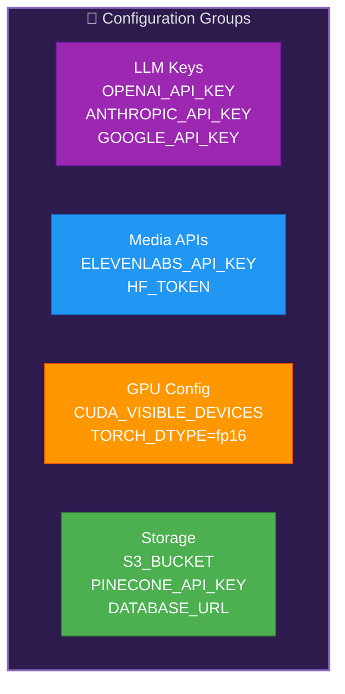
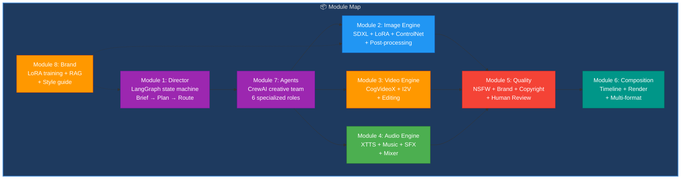
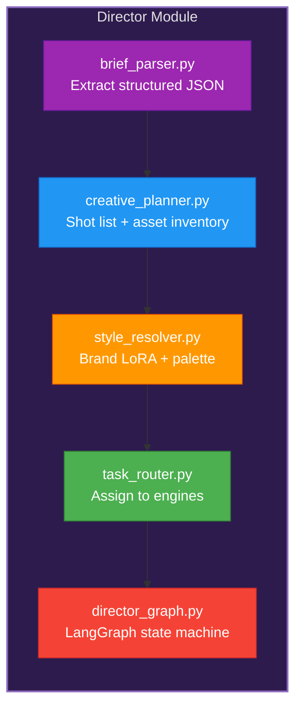
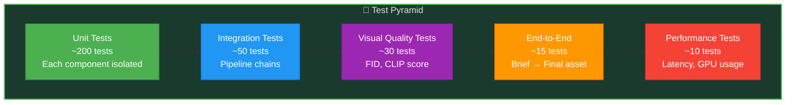
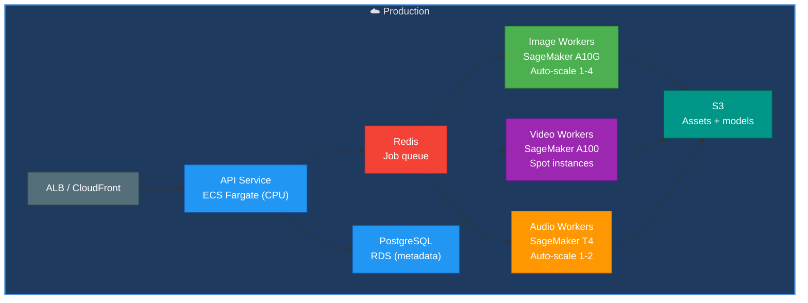
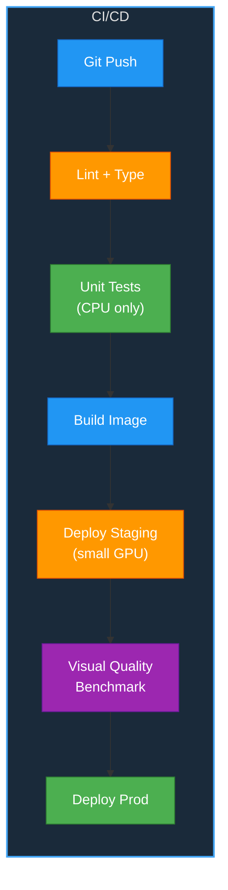
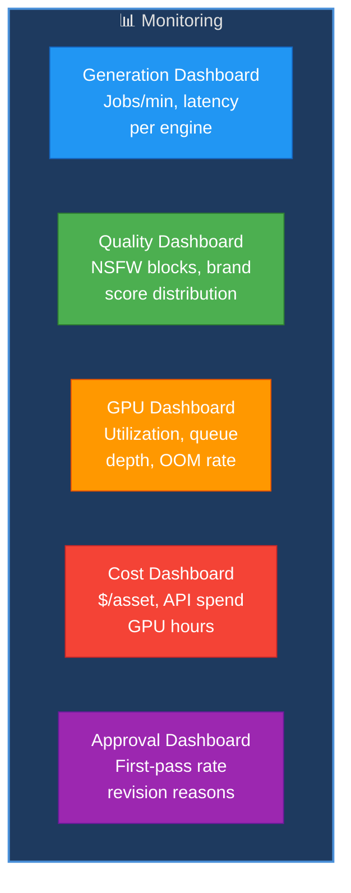
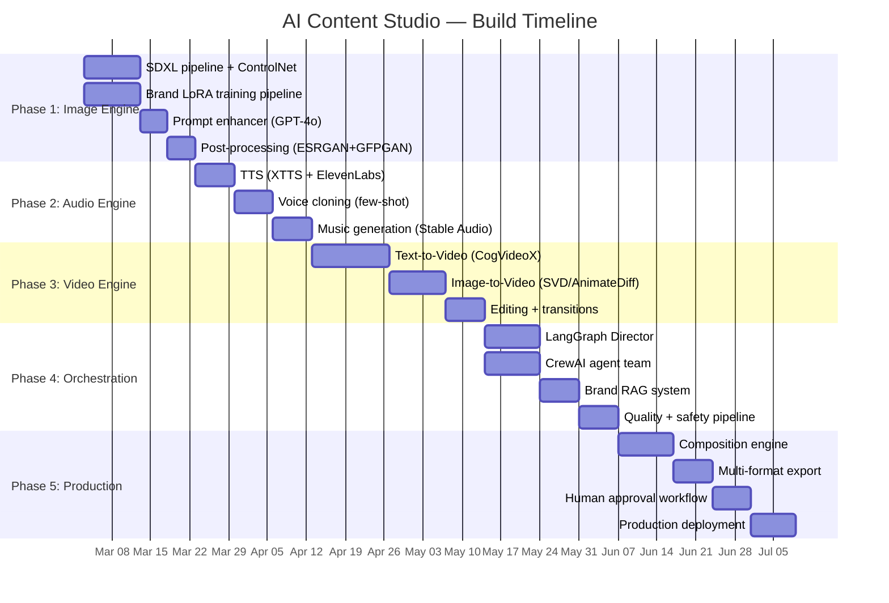

# AI Content Studio — Complete Project Guide

**Version:** 1.0 | **Date:** March 6, 2026 | **Project Duration:** Mar 3 – Jul 8, 2026

---

## Table of Contents

1. [Project Overview](#1-project-overview)
2. [Installation & Setup](#2-installation--setup)
3. [Environment Configuration](#3-environment-configuration)
4. [Architecture & Module Plan](#4-architecture--module-plan)
5. [Code Plan (Module-by-Module)](#5-code-plan-module-by-module)
6. [Test Plan](#6-test-plan)
7. [Deployment Plan](#7-deployment-plan)
8. [Monitoring & Observability](#8-monitoring--observability)
9. [GenAI Skills Usage Strategy](#9-genai-skills-usage-strategy)
10. [Phase-by-Phase Execution Timeline](#10-phase-by-phase-execution-timeline)
11. [Risk & Mitigation](#11-risk--mitigation)
12. [Cost Strategy](#12-cost-strategy)

---

## 1. Project Overview

Build a multi-modal AI content production studio — from creative brief to delivered branded assets (images, video, voice, music). Orchestrated by an AI Creative Director, powered by 3 generation engines, guarded by brand safety, and rendered through a composition engine.

### Success Metrics

| Metric | Target |
|--------|--------|
| Image generation | < 10 seconds |
| 30-sec video creation | < 5 minutes |
| Voice synthesis latency | < 2 seconds |
| Brand consistency score | > 95% |
| Cost per asset | $0.50 |
| Daily throughput | 1,000+ assets |
| First-pass human approval | > 80% |

---

## 2. Installation & Setup

### 2.1 Prerequisites

```mermaid
flowchart LR
    subgraph PREREQ["✅ Prerequisites"]
        style PREREQ fill:#1a3a2e,color:#e0e0e0,stroke:#4caf50,stroke-width:2px
        PY["Python 3.11+"]:::green
        CUDA["CUDA 12.1+<br/>cuDNN 8.9+"]:::orange
        GPU["GPU: A10G or A100<br/>(24+ GB VRAM)"]:::red
        DOC["Docker 24+<br/>+ NVIDIA Container"]:::blue
        FFMPEG["FFmpeg 6.x<br/>(video/audio)"]:::purple
    end

    subgraph KEYS["🔑 API Keys"]
        style KEYS fill:#3a2a1a,color:#e0e0e0,stroke:#ff9800,stroke-width:2px
        OAI["OpenAI API Key<br/>GPT-4o"]:::orange
        ANT["Anthropic API Key<br/>Claude Opus"]:::purple
        GEM["Google AI Key<br/>Gemini Pro"]:::blue
        ELEVEN["ElevenLabs API<br/>(optional premium)"]:::green
        HF["HuggingFace Token<br/>Model downloads"]:::orange
    end

    PREREQ --> KEYS

    classDef blue fill:#2196F3,color:#fff,stroke:#1565C0
    classDef green fill:#4CAF50,color:#fff,stroke:#2E7D32
    classDef orange fill:#FF9800,color:#fff,stroke:#E65100
    classDef purple fill:#9C27B0,color:#fff,stroke:#6A1B9A
    classDef red fill:#F44336,color:#fff,stroke:#C62828
```



### 2.2 Setup Steps

1. **Clone repo and create virtual environment** — Python 3.11+, CUDA-enabled
2. **Install PyTorch** — `pip install torch torchvision torchaudio --index-url https://download.pytorch.org/whl/cu121`
3. **Install diffusers stack** — diffusers, transformers, accelerate, peft, safetensors
4. **Install audio stack** — TTS (XTTS), stable-audio-tools, audiocraft, pyroomacoustics
5. **Install video stack** — CogVideo dependencies, opencv-python, moviepy, rife-ncnn
6. **Install orchestration** — langgraph, crewai, guardrails-ai
7. **Download models** — SDXL base, ControlNet checkpoints, XTTS v2, Real-ESRGAN, GFPGAN
8. **Install FFmpeg** — `brew install ffmpeg` (macOS) or `apt install ffmpeg` (Linux)
9. **Configure environment** — Copy `.env.example` → `.env`, fill API keys
10. **Verify GPU setup** — Run `python -c "import torch; print(torch.cuda.is_available())"`

### 2.3 Directory Structure Plan

```
ai-content-studio/
├── src/
│   ├── director/               # AI Creative Director
│   │   ├── brief_parser.py
│   │   ├── creative_planner.py
│   │   ├── style_resolver.py
│   │   ├── task_router.py
│   │   └── director_graph.py   # LangGraph state machine
│   ├── engines/
│   │   ├── image/              # Image Generation Engine
│   │   │   ├── sdxl_pipeline.py
│   │   │   ├── lora_manager.py
│   │   │   ├── controlnet.py
│   │   │   ├── ip_adapter.py
│   │   │   ├── prompt_enhancer.py
│   │   │   └── post_processor.py  # ESRGAN + GFPGAN + color
│   │   ├── video/              # Video Generation Engine
│   │   │   ├── text_to_video.py
│   │   │   ├── image_to_video.py
│   │   │   ├── video_editor.py
│   │   │   └── transition_engine.py
│   │   └── audio/              # Audio Generation Engine
│   │       ├── tts_engine.py
│   │       ├── voice_cloner.py
│   │       ├── music_generator.py
│   │       ├── sfx_generator.py
│   │       └── audio_mixer.py
│   ├── quality/                # Quality & Brand Safety
│   │   ├── nsfw_filter.py
│   │   ├── brand_checker.py
│   │   ├── copyright_scanner.py
│   │   └── human_review.py
│   ├── composition/            # Composition Engine
│   │   ├── timeline_builder.py
│   │   ├── compositor.py
│   │   └── renderer.py
│   ├── agents/                 # CrewAI Creative Team
│   │   ├── scripter.py
│   │   ├── artist.py
│   │   ├── video_agent.py
│   │   ├── audio_agent.py
│   │   └── qa_agent.py
│   ├── brand/                  # Brand Management
│   │   ├── brand_rag.py
│   │   ├── lora_trainer.py
│   │   └── style_guide.py
│   └── api/                    # FastAPI endpoints
│       ├── main.py
│       ├── briefs.py
│       └── assets.py
├── models/                     # Downloaded model weights
├── brands/                     # Per-brand LoRA + configs
├── config/
├── tests/
├── docker/
├── frontend/                   # React UI
└── pyproject.toml
```

---

## 3. Environment Configuration

### 3.1 Environment Variables



### 3.2 Hardware Requirements

| Tier | GPU | VRAM | Best For |
|------|-----|------|----------|
| **Minimum** | T4 × 1 | 16 GB | Image only, no video |
| **Recommended** | A10G × 2 | 48 GB | Image + audio + basic video |
| **Production** | A100 × 2 | 80 GB | Full pipeline, batch generation |

### 3.3 Model Downloads

| Model | Size | Source |
|-------|------|--------|
| SDXL 1.0 | 6.9 GB | HuggingFace `stabilityai/stable-diffusion-xl-base-1.0` |
| ControlNet (Canny) | 1.5 GB | HuggingFace `diffusers/controlnet-canny-sdxl-1.0` |
| XTTS v2 | 2 GB | HuggingFace `coqui/XTTS-v2` |
| Real-ESRGAN | 64 MB | GitHub `xinntao/Real-ESRGAN` |
| GFPGAN | 332 MB | GitHub `TencentARC/GFPGAN` |
| Stable Audio Open | 3 GB | HuggingFace `stabilityai/stable-audio-open-1.0` |

---

## 4. Architecture & Module Plan



---

## 5. Code Plan (Module-by-Module)

> **Note:** Describes WHAT to build and HOW to structure it — no actual code.

### 5.1 Module 1: AI Creative Director



**Files:**
- `brief_parser.py` — Parse natural language brief into structured JSON (audience, tone, platform, duration, brand ID). Uses Claude Opus.
- `creative_planner.py` — Generate shot list (6 scenes for 30-sec), asset inventory (images needed, audio tracks).
- `style_resolver.py` — Load brand LoRA, color palette, typography rules, logo assets.
- `task_router.py` — Route generation tasks to appropriate engines with priority ordering.
- `director_graph.py` — LangGraph state machine: BriefReceived → Planning → Generating → QualityCheck → Compositing → Delivering.

### 5.2 Module 2: Image Generation Engine

**Files:**
- `sdxl_pipeline.py` — HuggingFace Diffusers pipeline wrapper. Load SDXL, apply LoRA, run 50-step generation.
- `lora_manager.py` — Load/unload brand LoRA weights, multi-LoRA composition, weight scheduling.
- `controlnet.py` — ControlNet integration for pose, edge, depth conditioning.
- `ip_adapter.py` — Style reference image injection via IP-Adapter.
- `prompt_enhancer.py` — GPT-4o prompt expansion: add lighting, camera angle, composition details.
- `post_processor.py` — Pipeline: Real-ESRGAN 4× upscale → GFPGAN face fix → brand color grading → multi-format resize.

### 5.3 Module 3: Video Generation Engine

**Files:**
- `text_to_video.py` — CogVideoX wrapper for 5-second clip generation from scene description.
- `image_to_video.py` — SVD / AnimateDiff: animate key frame images with motion guidance.
- `video_editor.py` — Scene stitching, speed ramp (slow-mo/time-lapse), text overlay, logo watermark.
- `transition_engine.py` — Cross-dissolve, wipe, fade transitions between scenes.

### 5.4 Module 4: Audio Generation Engine

**Files:**
- `tts_engine.py` — XTTS v2 (self-hosted) + ElevenLabs API (premium fallback). Multi-language, emotion control.
- `voice_cloner.py` — 30-second voice clone from sample. Speaker embedding extraction + synthesis.
- `music_generator.py` — Stable Audio Open for background music. Mood tags (energetic, calm, corporate).
- `sfx_generator.py` — AudioLDM 2 for text-described sound effects + Freesound API fallback.
- `audio_mixer.py` — FFmpeg-based mixing: voice + music + SFX. Loudness normalization (LUFS standard).

### 5.5 Module 5: Quality & Brand Safety

**Files:**
- `nsfw_filter.py` — NudeNet classifier + custom content policy rules.
- `brand_checker.py` — Color palette matching (ΔE < 5), logo detection, font consistency.
- `copyright_scanner.py` — Visual similarity search against known copyrighted material (CLIP embeddings, threshold 0.9).
- `human_review.py` — Approval workflow: queue asset → reviewer → accept/reject/revise.

### 5.6 Module 6: Composition Engine

**Files:**
- `timeline_builder.py` — Arrange scenes in storyboard order, insert transitions, sync audio to timestamps.
- `compositor.py` — Layer video + audio + text overlays + logo watermark.
- `renderer.py` — H.265/VP9 encoding at 4K. Multi-format export: 9:16 (Reels), 16:9 (YouTube), 1:1 (Feed), GIF preview.

### 5.7 Module 7: Brand Management

**Files:**
- `brand_rag.py` — LlamaIndex index over brand guidelines (colors, typography, tone of voice, do's/don'ts).
- `lora_trainer.py` — QLoRA fine-tuning pipeline: 20-50 brand images → custom LoRA in < 1 hour.
- `style_guide.py` — Brand configuration YAML loader (logo path, palette, fonts, voice profile).

---

## 6. Test Plan

### 6.1 Test Strategy



### 6.2 Test Coverage

| Module | Tests | What to Verify |
|--------|-------|----------------|
| Director | 20 | Brief parsing accuracy, plan structure |
| Image Engine | 40 | Generation quality (CLIP score > 0.25), LoRA loading, post-processing |
| Video Engine | 30 | Clip duration accuracy (±0.5s), transition smoothness |
| Audio Engine | 30 | TTS intelligibility (WER < 5%), music mood match, mixing levels |
| Quality Pipeline | 25 | NSFW catch rate > 99%, brand score accuracy |
| Composition | 15 | Format dimensions correct, audio sync (< 50ms drift) |
| Brand Management | 15 | LoRA training completes, RAG retrieval accuracy |
| Agents | 25 | Agent delegation, task completion |

### 6.3 Visual Quality Benchmarks

| Metric | Tool | Target |
|--------|------|--------|
| FID (Fréchet Inception Distance) | `pytorch-fid` | < 15 |
| CLIP score (prompt alignment) | OpenCLIP | > 0.25 |
| LPIPS (perceptual similarity for brand) | `lpips` | < 0.3 |
| Face quality (eyes, symmetry) | GFPGAN metric | > 0.9 |
| Audio MOS (Mean Opinion Score) | UTMOS | > 4.0/5.0 |

---

## 7. Deployment Plan

### 7.1 Deployment Architecture



### 7.2 Deployment Steps

| Phase | Action | Duration |
|-------|--------|----------|
| 1 | Provision GPU instances (SageMaker endpoints) | 1 day |
| 2 | Deploy model weights to S3 + endpoint | 1 day |
| 3 | Deploy API service + Redis queue | 1 day |
| 4 | Run visual quality benchmark on 100 briefs | 2 days |
| 5 | Beta launch (5 users, 50 briefs/day) | 1 week |
| 6 | Scale to 1,000+ assets/day | 1 week |

### 7.3 CI/CD Pipeline



---

## 8. Monitoring & Observability

### 8.1 Dashboards



### 8.2 Alerting

| Alert | Condition | Severity |
|-------|-----------|----------|
| Image gen > 30s | P95 over 5 min | Warning |
| Video gen > 10 min | P95 over 5 min | Error |
| GPU OOM | Any worker | Critical |
| NSFW false negative | Human flagged | Critical |
| Queue depth > 100 | Sustained 10 min | Warning |
| Cost > $200/day | Daily total | Warning |
| API latency > 5s | P95 over 5 min | Error |

---

## 9. GenAI Skills Usage Strategy

| # | Skill | Where Used | Strategy |
|---|-------|-----------|----------|
| 1 | LangGraph | Creative Director | Deterministic workflow state machine |
| 2 | CrewAI | Agent team | 6-role creative production delegation |
| 3 | AutoGen | Review loop | QA ↔ Artist iterative refinement |
| 4 | OpenAI GPT | Prompt enhancement | Creative prompt expansion + diversity |
| 5 | Claude API | Script writing | Long-form scripts, storyboards |
| 6 | Gemini API | Multi-modal QA | Image + video quality analysis |
| 7 | HuggingFace | All engines | Diffusers, XTTS, AudioLDM models |
| 8 | PEFT | Brand LoRA | QLoRA fine-tuning per brand |
| 9 | Keras | Architecture | U-Net/VAE understanding for customization |
| 10 | Transfer Learning | Brand adaptation | Pre-trained → brand-specific generation |
| 11 | Model Quantization | Inference | INT8/FP16 for real-time speed |
| 12 | vLLM + TensorRT | Model serving | Optimized inference infrastructure |
| 13 | Distributed Training | Video models | Multi-GPU CogVideoX training |
| 14 | RAG | Brand guidelines | Retrieve brand rules during generation |
| 15 | Advanced RAG | Visual search | Multi-modal asset similarity search |
| 16 | LlamaIndex | Brand index | Brand asset and guideline indexing |
| 17 | Embeddings | Visual similarity | CLIP embeddings for asset matching |
| 18 | Vector DBs | Asset library | Pinecone for visual asset vectors |
| 19 | Guardrails | Content safety | NSFW + brand compliance gates |
| 20 | Prompt Engineering | All generation | Optimized prompts for each diffusion model |
| 21 | Few-Shot | Voice cloning | 30-sec sample → full voice synthesis |
| 22 | RLHF | Quality tuning | Human preference alignment |
| 23 | NLP | TTS + scripts | Text understanding + speech synthesis |
| 24 | AWS AI/ML | SageMaker | GPU endpoint hosting + batch inference |

---

## 10. Phase-by-Phase Execution Timeline



---

## 11. Risk & Mitigation

| Risk | Probability | Impact | Mitigation |
|------|------------|--------|------------|
| GPU cost overrun | High | High | Spot instances, auto-scale down, batch queuing |
| NSFW content leak | Medium | Critical | Multi-layer filter (NudeNet + Gemini + human), block-first policy |
| Brand inconsistency | Medium | High | LoRA per brand, style guide RAG, automated color check |
| CogVideoX quality insufficient | Medium | Medium | Fallback to Sora API (when available), image-to-video chain |
| Model download size (20+ GB) | Low | Medium | Pre-cached Docker layers, S3-hosted weights |
| Copyright claims | Low | Critical | Visual similarity scan, only AI-generated assets, watermark |
| Voice cloning misuse | Medium | High | Consent verification, voice ID tracking, rate limiting |

---

## 12. Cost Strategy

| Component | Monthly Estimate | Optimization |
|-----------|-----------------|--------------|
| GPU — Image (A10G spot) | $150-300 | Auto-scale 0-4, spot pricing |
| GPU — Video (A100 spot) | $200-400 | On-demand only, queue batches |
| GPU — Audio (T4 spot) | $50-100 | Shared with image workers |
| OpenAI GPT-4o (prompts) | $30-60 | Cache enhanced prompts |
| Claude Opus (scripts) | $50-100 | Batch script generation |
| ElevenLabs (premium) | $22/month | Use XTTS for most voices |
| S3 storage (assets) | $20-50 | Lifecycle policy, delete drafts |
| Redis + PostgreSQL | $30-50 | Managed, small instances |
| **Total** | **$552-1,082/month** | **Target: < $800/month** |

### Cost Per Asset (at 1,000 assets/day)

| Asset Type | Cost |
|------------|------|
| Image (1024×1024) | $0.05 |
| Video (30-sec) | $2.50 |
| Voiceover (30-sec) | $0.10 |
| Music (30-sec) | $0.15 |
| Complete package (image + video + audio) | $3.00 |
| **Blended average** | **$0.50/asset** |
