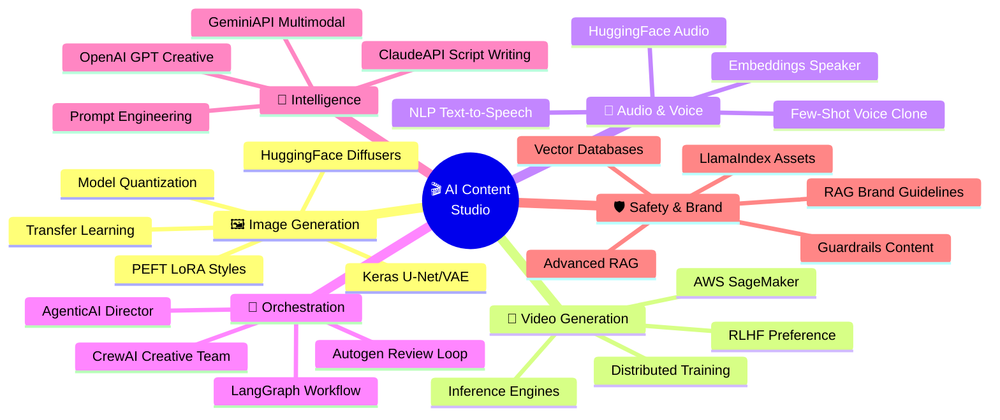
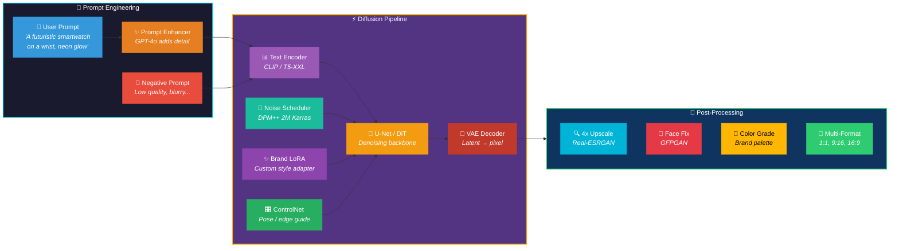
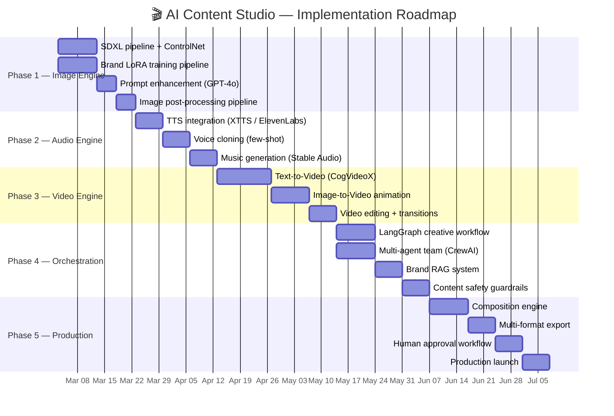

# 🎬 Project 5: AI-Powered Multi-Modal Content Generation Studio

> **Real-World Inspiration:** OpenAI Sora, Runway Gen-3 Alpha, Midjourney V6, ElevenLabs, Stability AI, Adobe Firefly, Google Veo 2
>
> **Status:** Disrupting $300B+ creative industry — Sora generates photorealistic videos from text, Midjourney used by 16M+ users, ElevenLabs cloning voices in 30 seconds, Adobe Firefly generated 6.5B+ images in first year

---

## 🌍 What's Happening in the Real World (2025-2026)

| Company | Product | Impact |
|---------|---------|--------|
| **OpenAI** | Sora | Text-to-video, up to 1 minute, photorealistic. Revolutionizing film pre-production, advertising, social content |
| **Runway** | Gen-3 Alpha Turbo | Real-time video generation + editing. Used by major Hollywood studios. $4B valuation |
| **Midjourney** | V6.1 | Best-in-class image generation. 16M+ users. Revenue >$200M/yr. No VC funding needed |
| **ElevenLabs** | Voice AI | Voice cloning in 30 seconds, 29 languages, real-time dubbing. Netflix, gaming studios use it |
| **Google** | Veo 2 + Imagen 3 | Video + image generation. Veo 2 generates 4K videos. Integrated into Google products |
| **Stability AI** | SD 3.5 + Stable Audio | Open-source image + audio generation. Powers 10,000+ apps. Community of 200K+ developers |
| **Adobe** | Firefly 3 | Commercially safe AI generation. Integrated into Photoshop, Premiere, Illustrator. 6.5B+ images generated |

---

## 🎯 Project Goal

Build a **Multi-Modal AI Content Generation Studio** that can:
1. Generate images from text descriptions (product shots, illustrations, concept art)
2. Create and edit videos (ads, social content, product demos)
3. Generate and clone voices for narration and dubbing
4. Produce music and sound effects for content
5. Combine all modalities into complete branded content packages
6. Maintain brand consistency with style guides and guardrails
7. Scale content production 100x for marketing teams

---

## 🧠 GenAI Skills & Tools Involved

---

## 🏗️ System Architecture

```mermaid
graph TB
    subgraph Input2["📝 Creative Brief Input"]
        direction LR
        BRIEF["📋 Creative Brief<br/><i>Brand, audience, goals</i>"]
        BRAND["🎨 Brand Assets<br/><i>Logo, colors, fonts</i>"]
        REF["📸 Reference Images<br/><i>Style examples</i>"]
        SCRIPT["📝 Script/Copy<br/><i>Text content</i>"]
    end

    subgraph Director["🎬 AI Creative Director (LangGraph)"]
        direction TB
        PARSE3["🔍 Brief Parser<br/><i>Extract requirements</i>"]
        PLAN2["📋 Creative Planner<br/><i>Asset list & sequence</i>"]
        STYLE["🎨 Style Resolver<br/><i>Brand consistency</i>"]
        ROUTE["🔀 Task Router<br/><i>Assign to generators</i>"]
    end

    subgraph Generators["⚡ Generation Engines"]
        direction TB
        subgraph ImageGen["🖼️ Image Engine"]
            SDXL["🎨 SDXL / Flux<br/><i>Base generation</i>"]
            LORA["✨ LoRA Adapters<br/><i>Brand style</i>"]
            IP["🔄 IP-Adapter<br/><i>Style transfer</i>"]
            CTRL["🎛️ ControlNet<br/><i>Composition control</i>"]
        end

        subgraph VideoGen["🎥 Video Engine"]
            T2V["📽️ Text-to-Video<br/><i>Sora / CogVideo</i>"]
            I2V["🖼️→🎥 Image-to-Video<br/><i>Animate images</i>"]
            EDIT["✂️ Video Editor<br/><i>Cut, transition, fx</i>"]
        end

        subgraph AudioGen["🎵 Audio Engine"]
            TTS["🗣️ Text-to-Speech<br/><i>ElevenLabs / XTTS</i>"]
            MUSIC["🎼 Music Generator<br/><i>Stable Audio</i>"]
            SFX["💥 Sound Effects<br/><i>AudioLDM2</i>"]
            CLONE["🎤 Voice Clone<br/><i>30-second clone</i>"]
        end
    end

    subgraph Quality["🛡️ Quality & Brand Safety"]
        direction TB
        NSFW["🚫 NSFW Filter<br/><i>Content safety</i>"]
        BRAND_CHECK["🎨 Brand Checker<br/><i>Color, logo, tone</i>"]
        COPY_CHECK["©️ IP Check<br/><i>Copyright validation</i>"]
        HUMAN["👤 Human Review<br/><i>Approval workflow</i>"]
    end

    subgraph Compose["🎬 Composition Engine"]
        direction TB
        TIMELINE["📐 Timeline Builder<br/><i>Scene sequencing</i>"]
        COMPOSITE["🔗 Compositor<br/><i>Layer + blend</i>"]
        RENDER["📀 Renderer<br/><i>4K, multi-format</i>"]
    end

    subgraph Output3["📤 Delivery"]
        direction LR
        SOCIAL["📱 Social Media<br/><i>Auto-resize per platform</i>"]
        WEB2["🌐 Web Assets<br/><i>Hero images, banners</i>"]
        VIDEO["🎥 Video Files<br/><i>MP4, WebM, GIF</i>"]
        AUDIO_OUT["🎵 Audio Files<br/><i>WAV, MP3</i>"]
    end

    Input2 --> Director
    Director --> Generators
    Generators --> Quality
    Quality --> Compose
    Compose --> Output3

    style Input2 fill:#1a1a2e,color:#fff,stroke:#E63946,stroke-width:2px
    style Director fill:#0f3460,color:#fff,stroke:#00B4D8,stroke-width:2px
    style Generators fill:#533483,color:#fff,stroke:#FFB703,stroke-width:2px
    style ImageGen fill:#1a1a2e,color:#fff,stroke:#9B59B6,stroke-width:2px
    style VideoGen fill:#0f3460,color:#fff,stroke:#E67E22,stroke-width:2px
    style AudioGen fill:#533483,color:#fff,stroke:#1ABC9C,stroke-width:2px
    style Quality fill:#e94560,color:#fff,stroke:#fff,stroke-width:2px
    style Compose fill:#0f3460,color:#fff,stroke:#2ECC71,stroke-width:2px
    style Output3 fill:#1a1a2e,color:#fff,stroke:#FFB703,stroke-width:2px

    style BRIEF fill:#3498DB,color:#fff,stroke:#3498DB
    style BRAND fill:#E67E22,color:#fff,stroke:#E67E22
    style REF fill:#9B59B6,color:#fff,stroke:#9B59B6
    style SCRIPT fill:#2ECC71,color:#fff,stroke:#2ECC71
    style PARSE3 fill:#00B4D8,color:#fff,stroke:#00B4D8
    style PLAN2 fill:#FFB703,color:#000,stroke:#FFB703
    style STYLE fill:#E74C3C,color:#fff,stroke:#E74C3C
    style ROUTE fill:#1ABC9C,color:#fff,stroke:#1ABC9C
    style SDXL fill:#8E44AD,color:#fff,stroke:#8E44AD
    style LORA fill:#F39C12,color:#fff,stroke:#F39C12
    style IP fill:#3498DB,color:#fff,stroke:#3498DB
    style CTRL fill:#27AE60,color:#fff,stroke:#27AE60
    style T2V fill:#E63946,color:#fff,stroke:#E63946
    style I2V fill:#00B4D8,color:#fff,stroke:#00B4D8
    style EDIT fill:#C0392B,color:#fff,stroke:#C0392B
    style TTS fill:#2ECC71,color:#fff,stroke:#2ECC71
    style MUSIC fill:#9B59B6,color:#fff,stroke:#9B59B6
    style SFX fill:#E67E22,color:#fff,stroke:#E67E22
    style CLONE fill:#1ABC9C,color:#fff,stroke:#1ABC9C
    style NSFW fill:#E74C3C,color:#fff,stroke:#E74C3C
    style BRAND_CHECK fill:#F39C12,color:#fff,stroke:#F39C12
    style COPY_CHECK fill:#8E44AD,color:#fff,stroke:#8E44AD
    style HUMAN fill:#3498DB,color:#fff,stroke:#3498DB
    style TIMELINE fill:#27AE60,color:#fff,stroke:#27AE60
    style COMPOSITE fill:#E63946,color:#fff,stroke:#E63946
    style RENDER fill:#00B4D8,color:#fff,stroke:#00B4D8
    style SOCIAL fill:#E74C3C,color:#fff,stroke:#E74C3C
    style WEB2 fill:#3498DB,color:#fff,stroke:#3498DB
    style VIDEO fill:#9B59B6,color:#fff,stroke:#9B59B6
    style AUDIO_OUT fill:#2ECC71,color:#fff,stroke:#2ECC71
```

---

## 🔄 Content Generation Workflow

```mermaid
sequenceDiagram
    participant Client as 👤 Marketing Team
    participant Director2 as 🎬 AI Director
    participant Scripter as ✍️ Script Agent
    participant ImgGen as 🖼️ Image Agent
    participant VidGen as 🎥 Video Agent
    participant AudioAgent as 🎵 Audio Agent
    participant QA as 🛡️ QA Agent
    participant Composer as 🎬 Compositor

    Client->>Director2: "Create 30-sec product launch video<br/>for new smartwatch, target: Gen-Z,<br/>tone: energetic, platform: Instagram Reels"

    rect rgb(15, 52, 96)
        Note over Director2,Scripter: ✍️ Phase 1: Script & Storyboard
        Director2->>Scripter: Creative brief + brand guide
        Scripter->>Scripter: Claude Opus generates script
        Scripter-->>Director2: 30-sec script (6 scenes) + storyboard descriptions
    end

    rect rgb(83, 52, 131)
        Note over Director2,AudioAgent: 🎨 Phase 2: Asset Generation (Parallel)
        par Image Generation
            Director2->>ImgGen: 6 scene descriptions + brand style LoRA
            ImgGen->>ImgGen: SDXL + ControlNet → 6 key frames
            ImgGen-->>Director2: 6 hero images (brand-consistent)
        and Voice & Music
            Director2->>AudioAgent: Script text + "energetic male voice"
            AudioAgent->>AudioAgent: XTTS voice synthesis + Stable Audio beat
            AudioAgent-->>Director2: Voiceover WAV + background music
        end
    end

    rect rgb(26, 26, 46)
        Note over Director2,VidGen: 🎥 Phase 3: Video Generation
        Director2->>VidGen: 6 key frames + storyboard
        VidGen->>VidGen: Image-to-Video (5 sec per scene)
        VidGen->>VidGen: Apply transitions + motion
        VidGen-->>Director2: 6 video clips
    end

    rect rgb(233, 69, 96)
        Note over QA,Composer: 🎬 Phase 4: Composition & QA
        Director2->>Composer: Video clips + audio + voiceover
        Composer->>Composer: Timeline assembly + sync
        Composer->>QA: Draft video
        QA->>QA: Brand check + NSFW filter + copyright scan
        QA-->>Client: Final 30-sec video (9:16 Reels format)
    end
```

---

## 🖼️ Image Generation Pipeline (Detail)

---

## 🛠️ Tech Stack Mapping

| Component | Technology | GenAI Skill Used |
|-----------|-----------|-----------------|
| **Image Generation** | SDXL, Flux, Stable Diffusion 3.5 | `HuggingFace`, `Keras`, `InferenceEngines` |
| **Brand Style LoRA** | QLoRA fine-tuned on brand assets | `PEFT-FineTuning`, `TransferLearning` |
| **Video Generation** | CogVideoX, Sora API | `DistributedTraining`, `ModelQuantization` |
| **Voice Synthesis** | XTTS v2, ElevenLabs API | `NLP`, `HuggingFace`, `FewShotZeroShot` |
| **Music Generation** | Stable Audio Open, MusicGen | `Keras`, `DistributedTraining` |
| **Script Writing** | Claude Opus 4 | `ClaudeAPI`, `PromptEngineering` |
| **Multi-Modal Analysis** | Gemini Pro (image + video) | `GeminiAPI` |
| **Prompt Enhancement** | GPT-4o + prompt optimization | `OpenAI-GPT`, `PromptEngineering` |
| **Creative Director** | LangGraph workflow engine | `LangGraph`, `LangChain` |
| **Agent Team** | CrewAI (Scripter + Artist + Editor) | `CrewAI`, `Autogen`, `AgenticAI` |
| **Brand RAG** | LlamaIndex style guide index | `RAG`, `AdvancedRAG`, `LlamaIndex` |
| **Asset Search** | Embeddings for visual similarity | `Embeddings`, `Vector-Databases` |
| **Content Safety** | Guardrails NSFW + brand check | `Guardrails` |
| **Quality Training** | RLHF on human preferences | `RLHF` |
| **Model Serving** | TensorRT, vLLM, ONNX | `InferenceEngines`, `ModelQuantization` |
| **Cloud Infrastructure** | SageMaker + GPU clusters | `AWS-AI-ML`, `DistributedTraining` |

---

## 📊 Implementation Phases

---

## 🎯 Key Metrics

| Metric | Target | Traditional |
|--------|--------|------------|
| Image generation time | < 10 sec | Designer: 2-4 hours |
| Video generation (30 sec) | < 5 min | Production: 2-5 days |
| Voice synthesis latency | < 2 sec | Studio recording: half day |
| Brand consistency score | > 95% | Manual review required |
| Content production cost | $0.50/asset | Traditional: $50-500/asset |
| Daily output capacity | 1,000+ assets | Team of 5: 10-20/day |
| Copyright clearance | 100% | AI-generated = commercially safe |
| Human approval rate | > 80% first pass | Measure via feedback |

---

## 🔗 All 27 GenAI Skills Connected

Every skill from the learning repository contributes:

| Skill | Role in This Project |
|-------|---------------------|
| `OpenAI-GPT` | Prompt enhancement, script writing |
| `ClaudeAPI` | Creative direction, long-form scripts |
| `GeminiAPI` | Multi-modal understanding (image+video QA) |
| `HuggingFace` | Diffusers library, model hub, XTTS |
| `Keras` | U-Net architecture, VAE training |
| `PEFT-FineTuning` | Brand LoRA adapters, style transfer |
| `TransferLearning` | Pre-trained models → brand domain |
| `RLHF` | Human preference alignment for quality |
| `ModelQuantization` | INT8 inference for real-time generation |
| `InferenceEngines` | TensorRT, vLLM for model serving |
| `DistributedTraining` | Multi-GPU video model training |
| `NLP` | Text-to-speech, script understanding |
| `RAG` | Brand guideline retrieval |
| `AdvancedRAG` | Multi-modal asset search |
| `LlamaIndex` | Brand asset indexing |
| `Embeddings` | Visual similarity search |
| `Vector-Databases` | Asset library storage |
| `LangChain` | Tool orchestration |
| `LangGraph` | Creative workflow state machine |
| `AgenticAI` | Autonomous creative agents |
| `Autogen` | Review + iteration loops |
| `CrewAI` | Multi-agent creative team |
| `Guardrails` | NSFW filtering, brand compliance |
| `PromptEngineering` | Optimal generation prompts |
| `FewShotZeroShot` | Voice cloning, style matching |
| `AWS-AI-ML` | SageMaker GPU hosting, Bedrock |
| `DistributedTraining` | Large model training at scale |
