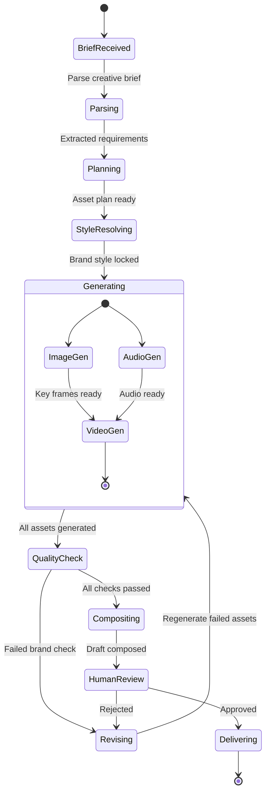
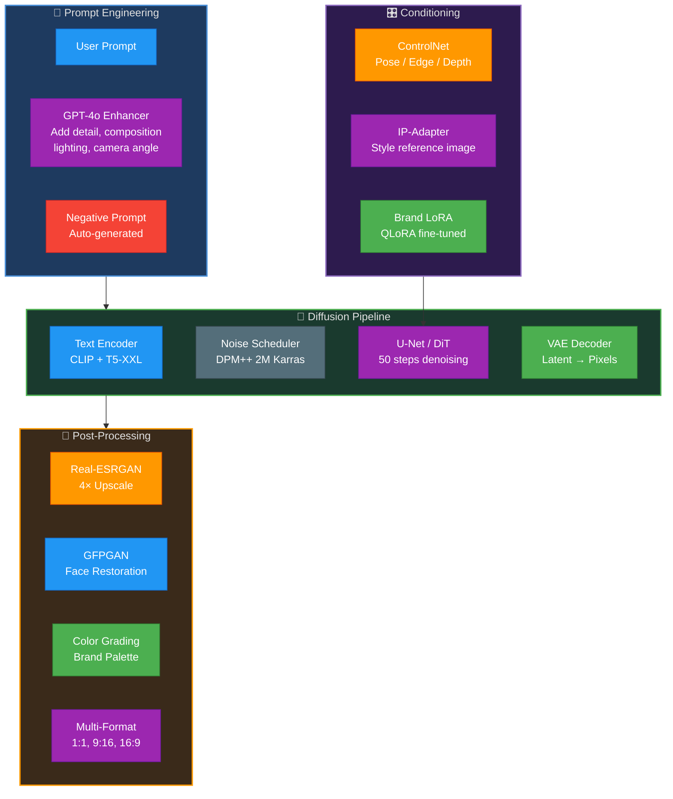
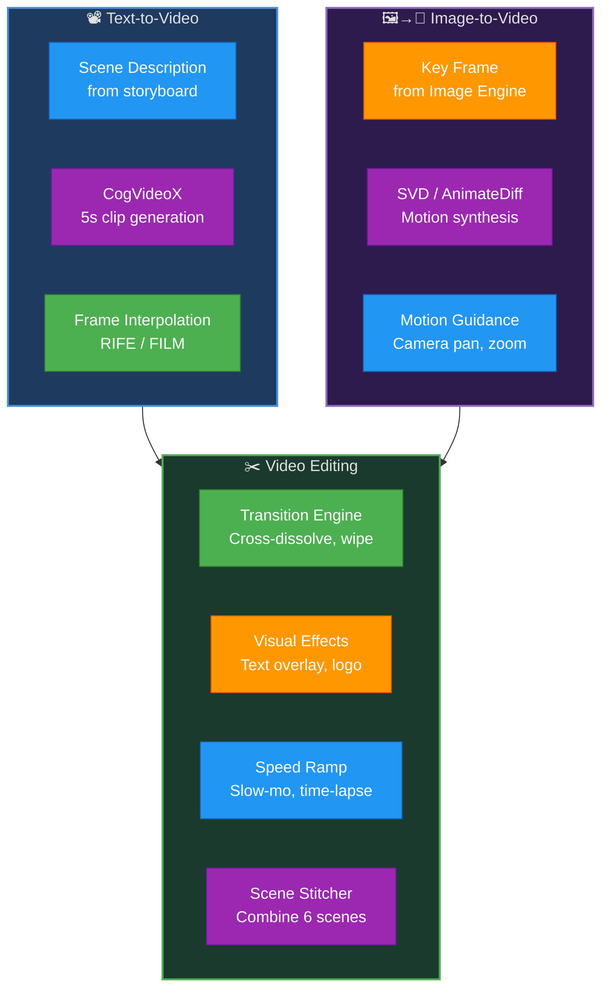
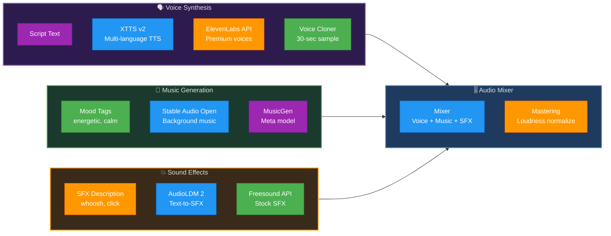
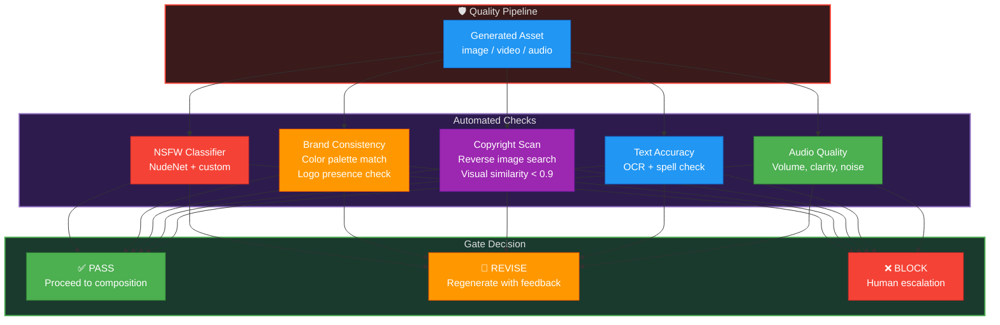

# AI Content Studio — Technical Design Document

**Version:** 1.0 | **Date:** March 6, 2026

---

## Table of Contents

1. [System Overview](#1-system-overview)
2. [High-Level Architecture](#2-high-level-architecture)
3. [Creative Director State Machine](#3-creative-director-state-machine)
4. [Module Deep Dives](#4-module-deep-dives)
   - 4.1 [Image Generation Engine](#41-image-generation-engine)
   - 4.2 [Video Generation Engine](#42-video-generation-engine)
   - 4.3 [Audio Generation Engine](#43-audio-generation-engine)
   - 4.4 [Quality & Brand Safety Pipeline](#44-quality--brand-safety-pipeline)
   - 4.5 [Composition Engine](#45-composition-engine)
5. [Multi-Agent Creative Team](#5-multi-agent-creative-team)
6. [Technology Justification](#6-technology-justification)
7. [Data Flow & Processing](#7-data-flow--processing)
8. [Target Metrics & GenAI Skills Matrix](#8-target-metrics--genai-skills-matrix)

---

## 1. System Overview

The AI Content Studio is a multi-modal content generation platform that produces branded images, videos, voiceovers, and music from a single creative brief. It orchestrates 3 generation engines (Image, Video, Audio) through an AI Creative Director, applies brand safety and quality checks, then composites everything into deliverable multi-format content.

**Core Pipeline:** Creative Brief → AI Director → Parallel Generation (Image/Video/Audio) → Quality Gate → Composition → Multi-Format Delivery

**Scale Target:** 1,000+ assets/day at $0.50/asset, replacing $50–500/asset traditional production.

---

## 2. High-Level Architecture

```mermaid
flowchart TB
    subgraph INPUT["📝 Creative Brief Input"]
        style INPUT fill:#1e3a5f,color:#e0e0e0,stroke:#4a90d9,stroke-width:2px
        BRIEF["Creative Brief<br/>Brand + Audience + Goals"]:::blue
        BRAND_ASSETS["Brand Assets<br/>Logo, Colors, Fonts"]:::orange
        REFS["Reference Images<br/>Style Examples"]:::purple
        SCRIPT_IN["Script / Copy<br/>Text Content"]:::green
    end

    subgraph DIRECTOR["🎬 AI Creative Director (LangGraph)"]
        style DIRECTOR fill:#2d1b4e,color:#e0e0e0,stroke:#8e6cc0,stroke-width:2px
        PARSER["Brief Parser<br/>Extract requirements"]:::purple
        PLANNER["Creative Planner<br/>Asset list + sequence"]:::blue
        STYLE_RES["Style Resolver<br/>Brand consistency"]:::orange
        ROUTER["Task Router<br/>Assign to engines"]:::green
    end

    subgraph ENGINES["⚡ Generation Engines"]
        style ENGINES fill:#1a3a2e,color:#e0e0e0,stroke:#4caf50,stroke-width:2px
        IMG["🖼️ Image Engine<br/>SDXL + LoRA + ControlNet"]:::purple
        VID["🎥 Video Engine<br/>CogVideoX + I2V"]:::blue
        AUD["🎵 Audio Engine<br/>XTTS + Stable Audio"]:::green
    end

    subgraph QUALITY["🛡️ Quality Pipeline"]
        style QUALITY fill:#3a1a1a,color:#e0e0e0,stroke:#f44336,stroke-width:2px
        NSFW["NSFW Filter"]:::red
        BRAND_CK["Brand Checker"]:::orange
        IP_CK["Copyright Check"]:::purple
        HUMAN_RV["Human Review"]:::blue
    end

    subgraph COMPOSE["🎬 Composition Engine"]
        style COMPOSE fill:#1a2a3a,color:#e0e0e0,stroke:#42a5f5,stroke-width:2px
        TIMELINE["Timeline Builder"]:::blue
        COMPOSITOR["Layer Compositor"]:::green
        RENDERER["4K Renderer<br/>Multi-Format"]:::orange
    end

    subgraph DELIVERY["📤 Delivery"]
        style DELIVERY fill:#3a2a1a,color:#e0e0e0,stroke:#ff9800,stroke-width:2px
        SOCIAL["Social Media<br/>Auto-resize"]:::orange
        WEB_OUT["Web Assets<br/>Images + Banners"]:::blue
        VID_OUT["Video Files<br/>MP4, WebM"]:::purple
        AUD_OUT["Audio Files<br/>WAV, MP3"]:::green
    end

    INPUT --> DIRECTOR
    DIRECTOR --> ENGINES
    ENGINES --> QUALITY
    QUALITY --> COMPOSE
    COMPOSE --> DELIVERY

    classDef blue fill:#2196F3,color:#fff,stroke:#1565C0
    classDef green fill:#4CAF50,color:#fff,stroke:#2E7D32
    classDef orange fill:#FF9800,color:#fff,stroke:#E65100
    classDef purple fill:#9C27B0,color:#fff,stroke:#6A1B9A
    classDef red fill:#F44336,color:#fff,stroke:#C62828
    classDef teal fill:#009688,color:#fff,stroke:#00695C
```

---

## 3. Creative Director State Machine

The AI Creative Director uses LangGraph to manage the production lifecycle. Each creative brief progresses through a deterministic state machine:

### State Definitions

| State | Description | Trigger |
|-------|-------------|---------|
| **BriefReceived** | Raw creative brief from user | API call / form submit |
| **Parsing** | Claude Opus extracts structured requirements | Auto |
| **Planning** | Create shot list, asset inventory, timeline | Auto |
| **StyleResolving** | Match brand LoRA, color palette, typography | Auto |
| **Generating** | Parallel asset generation (image → video, audio) | Auto |
| **QualityCheck** | NSFW + brand + copyright validation | Auto |
| **Revising** | Regenerate failed assets with adjusted params | On failure |
| **Compositing** | Timeline assembly, audio sync, rendering | Auto |
| **HumanReview** | Optional approval step | Configurable |
| **Delivering** | Multi-format export + platform delivery | Auto |

---

## 4. Module Deep Dives

### 4.1 Image Generation Engine

#### Components

| Component | Technology | Purpose |
|-----------|-----------|---------|
| Base Model | SDXL 1.0 / Flux | High-quality 1024×1024 generation |
| LoRA Adapters | QLoRA + PEFT | Brand-specific style fine-tuning |
| ControlNet | Canny / Depth / Pose | Spatial composition control |
| IP-Adapter | Reference image | Style transfer from example |
| Upscaler | Real-ESRGAN | 4× resolution enhancement |
| Face Fix | GFPGAN | Portrait quality restoration |
| Prompt Enhancer | GPT-4o | Optimize prompts for diffusion |

### 4.2 Video Generation Engine

#### Video Modes

| Mode | Model | Output | Use Case |
|------|-------|--------|----------|
| Text-to-Video | CogVideoX / Sora API | 5s @ 24fps | New scene creation |
| Image-to-Video | SVD / AnimateDiff | 3-5s clips | Animate key frame |
| Video-to-Video | RunwayML Gen-3 | Transform style | Style transfer existing footage |

### 4.3 Audio Generation Engine

#### Audio Capabilities

| Capability | Technology | Latency |
|-----------|-----------|---------|
| Text-to-Speech | XTTS v2 (self-hosted) | < 2s |
| Premium Voice | ElevenLabs API | < 3s |
| Voice Cloning | XTTS 30-sec sample | One-time 5 min |
| Background Music | Stable Audio Open | < 30s |
| Sound Effects | AudioLDM 2 | < 5s |
| Audio Mixing | FFmpeg + pyloudnorm | < 2s |

### 4.4 Quality & Brand Safety Pipeline

### 4.5 Composition Engine

```mermaid
flowchart LR
    subgraph COMPOSE_ENG["🎬 Composition"]
        style COMPOSE_ENG fill:#1e3a5f,color:#e0e0e0,stroke:#4a90d9,stroke-width:2px
        SCENE_CLIPS["Scene Clips<br/>6 × 5-sec video"]:::blue
        VO_TRACK["Voiceover<br/>30-sec narration"]:::green
        MUSIC_TRACK["Music Track<br/>Background beat"]:::purple
        SFX_TRACK["SFX Layer<br/>Transitions + hits"]:::orange
    end

    subgraph TIMELINE_BUILD["📐 Timeline"]
        style TIMELINE_BUILD fill:#2d1b4e,color:#e0e0e0,stroke:#8e6cc0,stroke-width:2px
        ARRANGE["Scene Arrangement<br/>Storyboard order"]:::purple
        TRANSITION_ADD["Add Transitions<br/>Cross-fade, wipe"]:::blue
        SYNC_AUDIO["Audio Sync<br/>Voice → scene timing"]:::green
    end

    subgraph RENDER_ENG["📀 Rendering"]
        style RENDER_ENG fill:#1a3a2e,color:#e0e0e0,stroke:#4caf50,stroke-width:2px
        ENCODE_4K["4K Encoding<br/>H.265 / VP9"]:::green
        FORMAT_ALL["Format Export<br/>9:16 Reels<br/>16:9 YouTube<br/>1:1 Feed<br/>GIF Preview"]:::orange
        THUMB["Thumbnail<br/>Best frame extract"]:::blue
    end

    COMPOSE_ENG --> TIMELINE_BUILD --> RENDER_ENG

    classDef blue fill:#2196F3,color:#fff,stroke:#1565C0
    classDef green fill:#4CAF50,color:#fff,stroke:#2E7D32
    classDef orange fill:#FF9800,color:#fff,stroke:#E65100
    classDef purple fill:#9C27B0,color:#fff,stroke:#6A1B9A
```

---

## 5. Multi-Agent Creative Team

The CrewAI agent team collaborates to produce complete content from a brief:

```mermaid
sequenceDiagram
    participant User as 👤 Marketing Team
    participant Dir as 🎬 Director Agent<br/>(LangGraph)
    participant Script as ✍️ Scripter<br/>(Claude Opus)
    participant Artist as 🖼️ Artist<br/>(SDXL + LoRA)
    participant VidAg as 🎥 Video Agent<br/>(CogVideoX)
    participant AudioAg as 🎵 Audio Agent<br/>(XTTS + Stable Audio)
    participant QA as 🛡️ QA Agent<br/>(Guardrails)

    User ->> Dir: Creative brief — "30-sec smartwatch<br/>launch video, Gen-Z, energetic"

    rect rgb(30,30,60)
        Note over Dir,Script: Phase 1 — Script & Storyboard
        Dir ->> Script: Brief + brand guidelines
        Script ->> Script: Claude Opus:<br/>6-scene script + storyboard
        Script -->> Dir: Script (6 scenes, voiceover text)
    end

    rect rgb(60,30,80)
        Note over Dir,AudioAg: Phase 2 — Parallel Generation
        par Image Generation
            Dir ->> Artist: 6 scene descriptions + brand LoRA
            Artist ->> Artist: SDXL + ControlNet<br/>→ 6 key frames
            Artist -->> Dir: 6 images (brand-consistent)
        and Audio Generation
            Dir ->> AudioAg: Script text + "energetic" mood
            AudioAg ->> AudioAg: XTTS voiceover<br/>Stable Audio background music
            AudioAg -->> Dir: Voiceover WAV + music track
        end
    end

    rect rgb(30,50,60)
        Note over Dir,VidAg: Phase 3 — Video Generation
        Dir ->> VidAg: 6 key frames + motion directions
        VidAg ->> VidAg: Image-to-Video (5s per scene)<br/>Transitions + effects
        VidAg -->> Dir: 6 video clips
    end

    rect rgb(80,20,30)
        Note over Dir,QA: Phase 4 — Quality & Delivery
        Dir ->> QA: All assets (images + video + audio)
        QA ->> QA: NSFW: ✅ | Brand: ✅ | Copyright: ✅
        QA -->> Dir: PASSED

        Dir ->> Dir: Timeline assembly<br/>Scene sequence + audio sync
        Dir ->> Dir: Render: 9:16 (Reels) + 16:9 (YouTube)
        Dir -->> User: Final video + thumbnail + audio files
    end
```

### Agent Definitions

| Agent | Model | Role | Tools |
|-------|-------|------|-------|
| **Director** | LangGraph + GPT-4o | Orchestrate production, route tasks | All engines, brand RAG |
| **Scripter** | Claude Opus 4 | Write scripts, storyboards | Brand guidelines RAG |
| **Artist** | SDXL + LoRA | Generate key frames, illustrations | Diffusion pipeline, ControlNet |
| **Video Agent** | CogVideoX / SVD | Animate frames, create clips | Image-to-Video, transitions |
| **Audio Agent** | XTTS + Stable Audio | Voice synthesis, music, SFX | TTS, music gen, mixer |
| **QA Agent** | Guardrails + Gemini | Quality check all assets | NSFW, brand check, IP scan |

---

## 6. Technology Justification

| Component | Choice | Why | Alternative Considered |
|-----------|--------|-----|----------------------|
| Image Model | SDXL / Flux | Best open-source quality, LoRA support, 1024px native | Midjourney (no API), DALL-E 3 (limited control) |
| Style Adaptation | QLoRA + PEFT | 4-bit training on consumer GPU, < 1 hour per brand | Full fine-tune (100× more compute) |
| Composition Control | ControlNet | Pose/edge/depth guidance without retraining | T2I-Adapter (less accurate) |
| Video Generation | CogVideoX | Open-source, 5-sec clips, good quality | Sora (waitlist), Runway (expensive API) |
| Image-to-Video | SVD + AnimateDiff | Open-source, controllable motion | Pika (API only), Gen-2 (expensive) |
| Voice TTS | XTTS v2 | 17 languages, voice cloning, self-hosted | ElevenLabs (premium fallback) |
| Music | Stable Audio Open | Open-source, commercial license | MusicGen (academic license) |
| Sound Effects | AudioLDM 2 | Text-to-audio, good SFX quality | Freesound (library, not generative) |
| Orchestration | LangGraph | Deterministic state machine for creative flow | Direct code (fragile, not observable) |
| Agent Framework | CrewAI | Role delegation, hierarchical tasks | AutoGen (used for review loop only) |
| Brand Safety | Guardrails AI | NSFW + custom brand rules | Perspective API (limited scope) |
| Upscaling | Real-ESRGAN | Best 4× quality, fast inference | SwinIR (slower) |
| Face Fix | GFPGAN | Industry standard, works with ESRGAN | CodeFormer (similar quality) |
| Prompt Enhancement | GPT-4o | Best at creative expansion | Claude (good but less creative variance) |
| Model Serving | vLLM + TensorRT | Optimized batch inference | Triton (more complex setup) |
| Cloud GPU | AWS SageMaker | On-demand A100/A10G, managed endpoints | GCP Vertex (similar, less ecosystem) |

---

## 7. Data Flow & Processing

### 7.1 Content Production Flow

```mermaid
flowchart TB
    subgraph INGEST["📥 Brief Ingestion"]
        style INGEST fill:#1e3a5f,color:#e0e0e0,stroke:#4a90d9,stroke-width:2px
        API_IN["REST API / Webhook"]:::blue
        FORM_IN["Web Form / UI"]:::green
        BRIEF_PARSE["Brief Parser<br/>Structured JSON"]:::orange
    end

    subgraph PLAN_PHASE["📋 Planning"]
        style PLAN_PHASE fill:#2d1b4e,color:#e0e0e0,stroke:#8e6cc0,stroke-width:2px
        BRAND_RAG["Brand RAG<br/>LlamaIndex →<br/>Guidelines"]:::purple
        SHOT_LIST["Shot List<br/>6 scenes"]:::blue
        ASSET_LIST["Asset Inventory<br/>Images: 6, Audio: 3"]:::green
    end

    subgraph GEN_PHASE["⚡ Generation"]
        style GEN_PHASE fill:#1a3a2e,color:#e0e0e0,stroke:#4caf50,stroke-width:2px
        IMG_QUEUE["Image Queue<br/>6 jobs → GPU"]:::green
        AUD_QUEUE["Audio Queue<br/>3 jobs → GPU"]:::blue
        VID_QUEUE["Video Queue<br/>6 jobs → GPU"]:::purple
    end

    subgraph STORE["💾 Storage"]
        style STORE fill:#3a2a1a,color:#e0e0e0,stroke:#ff9800,stroke-width:2px
        S3_RAW["S3: Raw Assets<br/>Unprocessed outputs"]:::orange
        S3_FINAL["S3: Final Assets<br/>Post-QA approved"]:::green
        DB_META["PostgreSQL<br/>Job metadata, briefs"]:::blue
        VEC_STORE["Pinecone<br/>Visual similarity index"]:::purple
    end

    INGEST --> PLAN_PHASE --> GEN_PHASE --> STORE

    classDef blue fill:#2196F3,color:#fff,stroke:#1565C0
    classDef green fill:#4CAF50,color:#fff,stroke:#2E7D32
    classDef orange fill:#FF9800,color:#fff,stroke:#E65100
    classDef purple fill:#9C27B0,color:#fff,stroke:#6A1B9A
```

### 7.2 GPU Resource Management

| Engine | Model Size | GPU Required | Batch Strategy |
|--------|------------|-------------|----------------|
| SDXL | 6.9 GB | A10G (24 GB) | 4 images/batch |
| ControlNet | 1.5 GB | Shared with SDXL | On-demand load |
| LoRA | 50-200 MB | Shared with SDXL | Pre-loaded per brand |
| CogVideoX | 12 GB | A100 (40 GB) | 1 video/GPU |
| XTTS v2 | 2 GB | T4 (16 GB) | 8 concurrent |
| Stable Audio | 3 GB | T4 (16 GB) | 4 concurrent |
| Real-ESRGAN | 0.5 GB | T4 (16 GB) | 16 images/batch |

---

## 8. Target Metrics & GenAI Skills Matrix

### 8.1 Performance Targets

| Metric | Target | Current Industry |
|--------|--------|-----------------|
| Image generation | < 10 seconds | Designer: 2-4 hours |
| 30-sec video | < 5 minutes | Production: 2-5 days |
| Voice synthesis | < 2 seconds | Studio: half day |
| Brand consistency | > 95% | Manual review needed |
| Cost per asset | $0.50 | Traditional: $50-500 |
| Daily throughput | 1,000+ assets | Team of 5: 10-20/day |
| First-pass approval | > 80% | Measure via feedback |
| Quality score | > 4.0/5.0 | Human evaluator panel |

### 8.2 GenAI Skills Matrix

| # | Skill | Component | Usage |
|---|-------|-----------|-------|
| 1 | **HuggingFace** | Image/Audio engines | Diffusers, XTTS, AudioLDM models |
| 2 | **PEFT** | Brand LoRA | QLoRA fine-tuning for brand styles |
| 3 | **Keras** | U-Net/VAE | Diffusion model architecture understanding |
| 4 | **Transfer Learning** | Brand adaptation | Pre-trained → brand-specific |
| 5 | **Model Quantization** | Inference | INT8/FP16 for real-time generation |
| 6 | **vLLM + TensorRT** | Model serving | Optimized batch inference |
| 7 | **Distributed Training** | Video models | Multi-GPU training for CogVideoX |
| 8 | **LangGraph** | Creative Director | State machine workflow orchestration |
| 9 | **CrewAI** | Agent team | 6-role creative production team |
| 10 | **AutoGen** | Review loop | QA ↔ Artist iteration cycle |
| 11 | **OpenAI GPT** | Prompt enhancement | Creative prompt expansion |
| 12 | **Claude API** | Script writing | Long-form creative scripts |
| 13 | **Gemini API** | Multi-modal QA | Image + video quality analysis |
| 14 | **RAG** | Brand guidelines | Retrieve brand rules during generation |
| 15 | **Advanced RAG** | Visual search | Multi-modal asset similarity |
| 16 | **LlamaIndex** | Brand index | Brand asset indexing and retrieval |
| 17 | **Embeddings** | Visual similarity | CLIP embeddings for asset search |
| 18 | **Vector DBs** | Asset library | Pinecone for visual asset vectors |
| 19 | **Guardrails** | Safety | NSFW + brand compliance checks |
| 20 | **Prompt Engineering** | All generation | Optimized prompts for each model |
| 21 | **Few-Shot** | Voice cloning | 30-sec sample → full voice |
| 22 | **RLHF** | Quality tuning | Human preference training |
| 23 | **NLP** | TTS + script | Text understanding + speech |
| 24 | **AWS AI/ML** | SageMaker | GPU infrastructure for inference |
