# GenAI Nexus — Comprehensive Technical Design Document

**Version:** 2.0 | **Date:** March 5, 2026 | **Status:** Implemented & Validated
**Author:** System Architecture Team
**Test Status:** 138/138 passing (35.98s) | **Tools:** 27 Gen-AI tools | **LOC:** ~6,200+

> A single project that integrates **27 Gen-AI tools** into one unified AI Startup Advisor pipeline — runs fully local with Ollama or scales to cloud LLM providers. Zero API keys required in demo mode.

---

## Table of Contents

1. [Executive Summary](#1-executive-summary)
2. [System Architecture](#2-system-architecture)
3. [Data Flow Architecture](#3-data-flow-architecture)
4. [Layer-by-Layer Deep Dive](#4-layer-by-layer-deep-dive)
   - 4.1 [Configuration Layer](#41-configuration-layer)
   - 4.2 [LLM Provider Layer](#42-llm-provider-layer)
   - 4.3 [Chain & Workflow Layer](#43-chain--workflow-layer)
   - 4.4 [RAG & Knowledge Layer](#44-rag--knowledge-layer)
   - 4.5 [Agent Layer](#45-agent-layer)
   - 4.6 [NLP & Embeddings Layer](#46-nlp--embeddings-layer)
   - 4.7 [ML Training Layer](#47-ml-training-layer)
   - 4.8 [Optimization Layer](#48-optimization-layer)
   - 4.9 [Cloud Infrastructure Layer](#49-cloud-infrastructure-layer)
   - 4.10 [Safety & Validation Layer](#410-safety--validation-layer)
   - 4.11 [Orchestration Layer](#411-orchestration-layer)
5. [Tool-by-Tool Technical Reference](#5-tool-by-tool-technical-reference)
6. [Design Patterns & Optimizations](#6-design-patterns--optimizations)
7. [Execution Modes](#7-execution-modes)
8. [Local-First Architecture (Ollama)](#8-local-first-architecture-ollama)
9. [Testing Architecture](#9-testing-architecture)
10. [Performance Characteristics](#10-performance-characteristics)
11. [Technology Comparison & Justification](#11-technology-comparison--justification)
12. [Security & Safety Design](#12-security--safety-design)
13. [Scalability & Production Readiness](#13-scalability--production-readiness)

---

## 1. Executive Summary

### What Is GenAI Nexus?

GenAI Nexus is an **educational-yet-production-grade** project that demonstrates 27 Gen-AI tools working together through a single domain problem: **AI Startup Advisory**. Given a startup idea (e.g., "AI-powered legal document analyzer"), the system produces a comprehensive startup plan including market analysis, competitive intelligence, technical architecture, team plans, stress-test debate, validated output, and an investment pitch.

### Why This Architecture?

```
Problem:  Learning 27 Gen-AI tools in isolation produces shallow understanding.
Solution: Wire all 27 into ONE pipeline where each tool plays a real role.
Result:   Deep understanding of tool interactions, trade-offs, and production patterns.
```

### Key Architectural Decisions

| Decision            | Choice                               | Justification                                                           |
| ------------------- | ------------------------------------ | ----------------------------------------------------------------------- |
| **Workflow engine** | LangGraph StateGraph                 | Stateful, conditional edges, error recovery — superior to linear chains |
| **LLM abstraction** | Custom Router + per-provider clients | Full control over routing logic vs. LiteLLM's opaque proxy              |
| **Vector store**    | ChromaDB                             | Embedded, zero-config, HNSW cosine — simplest for educational use       |
| **Agent framework** | LangChain ReAct + CrewAI + AutoGen   | Three paradigms (single/team/debate) — shows trade-offs directly        |
| **Local LLM**       | Ollama via OpenAI-compatible API     | One binary install, model zoo, OpenAI SDK reuse — lowest friction       |
| **Demo mode**       | Universal graceful degradation       | Every module works without any API key — critical for education         |
| **Configuration**   | Pydantic BaseSettings + `.env`       | Type-safe, env-driven, IDE autocomplete, zero boilerplate               |

### Architecture Stats

| Metric                  | Value                         |
| ----------------------- | ----------------------------- |
| Source files            | 25 modules + 1 CLI + 1 config |
| Total classes           | 42                            |
| Total functions/methods | 200+                          |
| Test cases              | 138 (100% passing)            |
| Lines of code           | ~6,200+                       |
| Frameworks integrated   | 16 major libraries            |
| Execution modes         | 4 (demo, local, quick, full)  |

---

## 2. System Architecture

### 2.1 High-Level System Architecture

```mermaid
graph TB
    subgraph "Interface Layer"
        CLI["main.py<br/>CLI Entry Point<br/>argparse"]
        WEB["app.py<br/>Streamlit Web UI<br/>10 tabs"]
    end

    subgraph "Orchestration Layer"
        ADV["StartupAdvisor<br/>pipeline/startup_advisor.py<br/>Master Orchestrator"]
        WF["StartupWorkflow<br/>src/graph/startup_workflow.py<br/>LangGraph StateGraph"]
    end

    subgraph "LLM Provider Layer"
        ROUTER["LLMRouter<br/>src/llm/llm_router.py<br/>Strategy Pattern"]
        OAI["OpenAIClient<br/>GPT-4o-mini"]
        CLAUDE["ClaudeClient<br/>Claude 3 Haiku"]
        GEMINI["GeminiClient<br/>Gemini 1.5 Flash"]
        OLLAMA["OllamaClient<br/>LLaMA 3.1 / Mistral / Qwen"]
    end

    subgraph "Intelligence Layer"
        CHAINS["AnalysisChains<br/>LangChain LCEL<br/>4-stage pipeline"]
        REACT["ReactAgent<br/>ReAct Loop<br/>4 tools"]
        CREW["StartupCrew<br/>CrewAI<br/>CEO+CTO+CMO+CFO"]
        DEBATE["StartupDebate<br/>AutoGen GroupChat<br/>Optimist+Skeptic+Mediator"]
    end

    subgraph "Knowledge Layer"
        RAG["BasicRAG<br/>Retrieve-Augment-Generate"]
        ADVRAG["AdvancedRAG<br/>HyDE + Hybrid + Rerank"]
        LLAMA["LlamaIndexer<br/>VectorStoreIndex"]
        CHROMA["ChromaVectorStore<br/>ChromaDB HNSW"]
        EMBED["EmbeddingService<br/>OpenAI + HuggingFace"]
    end

    subgraph "NLP & Analysis Layer"
        NLP["TextProcessor<br/>spaCy NER + regex"]
        HF["HuggingFaceModels<br/>Sentiment + NER + ZeroShot"]
        PROMPT["PromptTemplates<br/>CoT + Persona + ReAct"]
        FEWSHOT["FewShotBuilder<br/>Examples + Self-Consistency"]
    end

    subgraph "Training Layer"
        KERAS["LegalSentimentModel<br/>Keras BiLSTM"]
        TRANSFER["TransferAdapter<br/>DistilBERT Fine-tune"]
        PEFT["PEFTTrainer<br/>LoRA / QLoRA"]
        RLHF["RLHFPipeline<br/>Feedback + Reward + DPO"]
        DIST["DistributedTrainer<br/>DDP + ZeRO"]
    end

    subgraph "Optimization & Cloud Layer"
        QUANT["ModelQuantizer<br/>INT8 / INT4 / GGUF"]
        VLLM["VLLMInferenceEngine<br/>PagedAttention"]
        AWS["AWSClient<br/>SageMaker + Bedrock"]
    end

    subgraph "Safety Layer"
        VALID["OutputValidator<br/>Hallucination + Safety + Schema"]
    end

    CLI --> ADV
    WEB --> ADV
    ADV --> WF
    ADV --> ROUTER
    ADV --> REACT
    ADV --> HF

    WF --> NLP
    WF --> ADVRAG
    WF --> CHAINS
    WF --> CREW
    WF --> DEBATE
    WF --> VALID

    ROUTER --> OAI
    ROUTER --> CLAUDE
    ROUTER --> GEMINI
    ROUTER --> OLLAMA

    CHAINS --> ROUTER
    REACT --> ROUTER
    ADVRAG --> RAG
    RAG --> CHROMA
    RAG --> EMBED
    LLAMA --> EMBED
    ADVRAG --> CHROMA

    ADV -.->|full mode| KERAS
    ADV -.->|full mode| TRANSFER
    ADV -.->|full mode| PEFT
    ADV -.->|full mode| QUANT
    ADV -.->|full mode| VLLM
    ADV -.->|full mode| AWS
    ADV -.->|full mode| DIST
    ADV -.->|full mode| RLHF
```

### 2.2 Layered Architecture

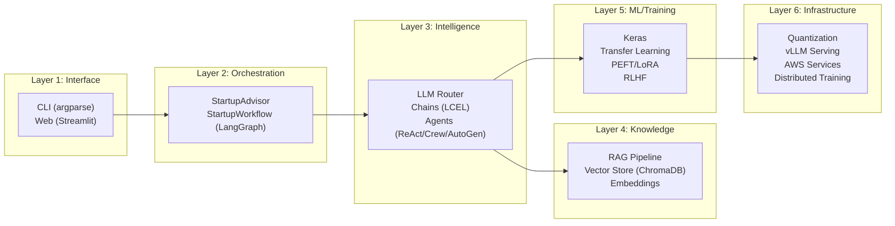

### 2.3 Module Dependency Graph

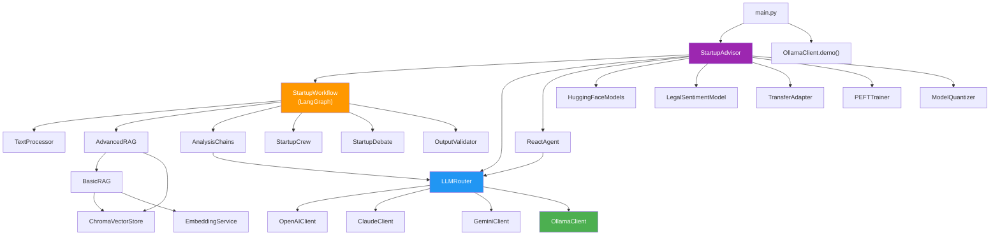

---

## 3. Data Flow Architecture

### 3.1 Primary Pipeline Flow

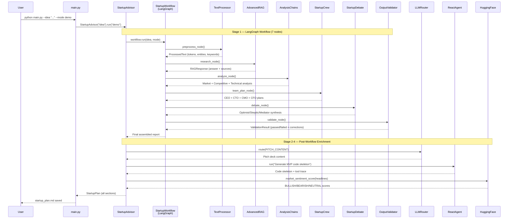

### 3.2 LLM Router Decision Flow

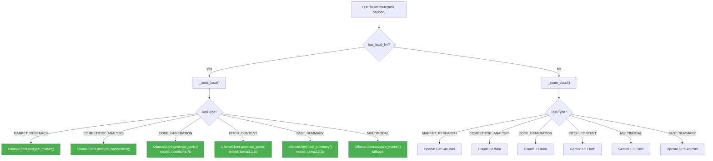

### 3.3 LangGraph Workflow State Machine

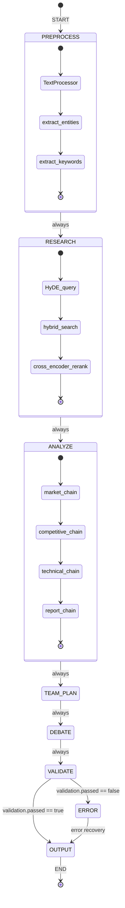

### 3.4 RAG Sub-Flow (Advanced RAG Pipeline)

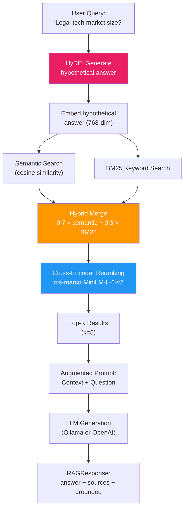

### 3.5 Agent Interaction Flow

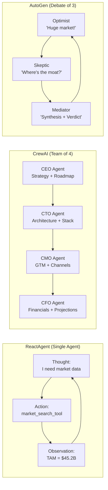

---

## 4. Layer-by-Layer Deep Dive

### 4.1 Configuration Layer

**File:** `config/settings.py` (95 lines)
**Framework:** Pydantic BaseSettings
**Pattern:** Environment-driven configuration with type safety

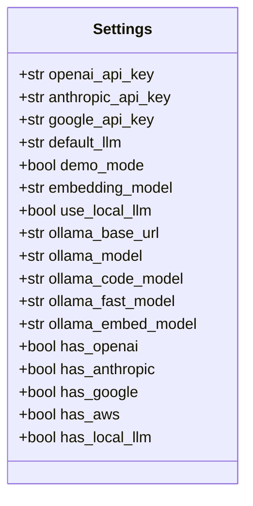

**Why Pydantic BaseSettings?**

| Alternative     | Weakness                                       | Why We Chose Pydantic                                        |
| --------------- | ---------------------------------------------- | ------------------------------------------------------------ |
| `os.environ`    | No type safety, no defaults, no validation     | Pydantic auto-casts `"true"` → `bool`, validates types       |
| `python-dotenv` | No schema, no IDE autocomplete, manual parsing | Pydantic gives full IDE IntelliSense on `settings.`          |
| `dynaconf`      | Heavyweight, complex TOML/YAML merging         | Overkill for flat env config — Pydantic is simpler           |
| `dataclasses`   | No `.env` loading, no alias support            | Pydantic Settings loads `.env` + env vars + aliases natively |

**Key Design:**
- **Alias convention:** Field names are snake_case Python (`openai_api_key`), aliases are SCREAMING_SNAKE env vars (`OPENAI_API_KEY`)
- **Property-based validation:** `has_openai` checks prefix `sk-` (not just non-empty) — prevents invalid keys from passing
- **Extra="ignore":** Unknown env vars don't crash the app — critical for CI/CD environments

**Optimization:** Singleton pattern — `settings = Settings()` at module level, imported everywhere. One `.env` parse per process.

---

### 4.2 LLM Provider Layer

**Files:** 4 clients + 1 router (5 files, ~1050 lines total)

#### 4.2.1 LLM Router (`src/llm/llm_router.py`, 150 lines)

**Pattern:** Strategy Pattern with task-based routing

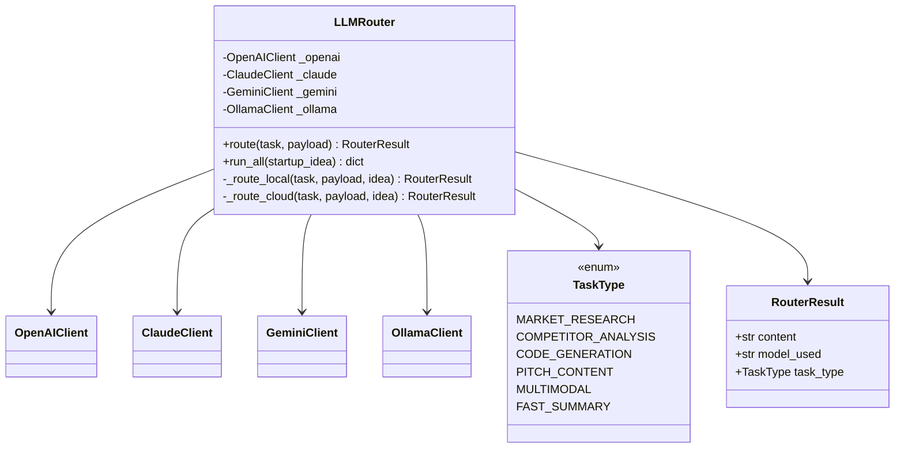

**Routing table (Cloud mode):**

| TaskType              | Provider           | Why                                                        |
| --------------------- | ------------------ | ---------------------------------------------------------- |
| `MARKET_RESEARCH`     | OpenAI GPT-4o-mini | Best at structured data extraction (TAM/SAM/SOM numbers)   |
| `COMPETITOR_ANALYSIS` | Claude 3 Haiku     | 200K context window — can ingest entire competitor reports |
| `CODE_GENERATION`     | Claude 3 Haiku     | Superior code quality vs. GPT-4o-mini at same price tier   |
| `PITCH_CONTENT`       | Gemini 1.5 Flash   | Fastest generation for creative content, lowest latency    |
| `MULTIMODAL`          | Gemini 1.5 Flash   | Only provider with native image/video input support        |
| `FAST_SUMMARY`        | OpenAI GPT-4o-mini | Cheapest per-token for simple summarization tasks          |

**Routing table (Local mode):**

| TaskType              | Model        | Why                                                                                  |
| --------------------- | ------------ | ------------------------------------------------------------------------------------ |
| `MARKET_RESEARCH`     | llama3.1:8b  | Best general reasoning among local 8B models                                         |
| `COMPETITOR_ANALYSIS` | llama3.1:8b  | Same — needs strong analytical reasoning                                             |
| `CODE_GENERATION`     | codellama:7b | Purpose-built for code generation (Infilling + instruction)                          |
| `PITCH_CONTENT`       | llama3.2:3b  | Fast model for creative content — latency matters more than quality for pitch drafts |
| `FAST_SUMMARY`        | llama3.2:3b  | 3B model is 3× faster than 8B for summarization                                      |

**Why custom router vs. LiteLLM?**

| Feature            | Custom Router                         | LiteLLM                            |
| ------------------ | ------------------------------------- | ---------------------------------- |
| Task-based routing | ✅ Route by task type to best provider | ❌ Routes by model name only        |
| Local LLM support  | ✅ First-class Ollama integration      | ⚠️ Needs OpenAI proxy workaround    |
| Demo fallback      | ✅ Built-in per-provider demo mode     | ❌ No demo mode concept             |
| Transparency       | ✅ Full control, debuggable            | ❌ Opaque proxy layer               |
| Educational value  | ✅ Shows routing patterns explicitly   | ❌ Hides routing behind abstraction |

#### 4.2.2 Ollama Client (`src/llm/ollama_client.py`, 426 lines)

**Architecture:**

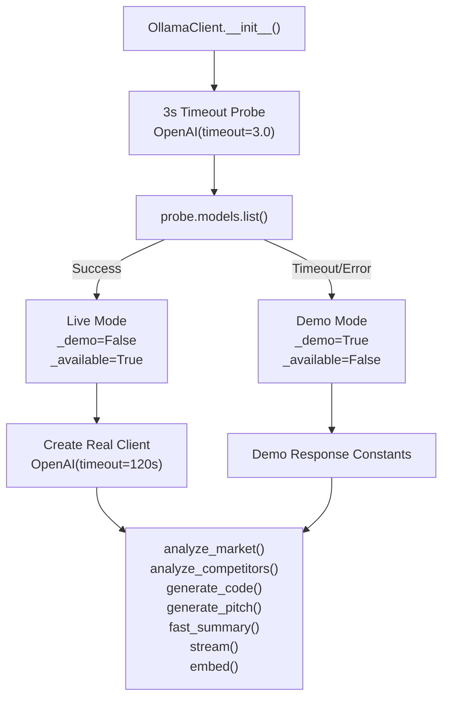

**Key optimization — 3-second probe timeout:**

```python
# Problem: Ollama might be running but slow to respond
# Old approach: 120s timeout on init → tests hang 120s per test
# New approach: 3s probe → instant fallback
probe = OpenAI(base_url=f"{self.config.base_url}/v1", api_key="ollama", timeout=3.0)
models = probe.models.list()  # Fast health check
# Only then create the real client with 120s timeout
self._client = OpenAI(base_url=..., timeout=self.config.timeout)
```

**Why Ollama via OpenAI SDK (not `langchain-ollama` directly)?**

| Approach                      | Pros                                                     | Cons                                                | Verdict                             |
| ----------------------------- | -------------------------------------------------------- | --------------------------------------------------- | ----------------------------------- |
| OpenAI SDK + Ollama `/v1`     | Reuses existing OpenAI code, streaming, function calling | Extra `/v1` path                                    | ✅ **Chosen** — minimal code changes |
| `langchain-ollama` ChatOllama | Native LangChain integration                             | Different API surface, no OpenAI compat             | Used in chains only                 |
| `ollama` Python package       | Native Ollama API                                        | Different from everything else, no streaming compat | ❌ Rejected — fragmented             |
| `litellm`                     | Unified proxy                                            | Adds dependency, opaque                             | ❌ Rejected — hides details          |

**Model selection rationale:**

| Model              | Size   | Speed          | Purpose             | Why This Model                                                           |
| ------------------ | ------ | -------------- | ------------------- | ------------------------------------------------------------------------ |
| `llama3.1:8b`      | 4.7 GB | ~30 tok/s (M1) | General analysis    | Best quality/speed balance at 8B params; Meta's strongest open model     |
| `codellama:7b`     | 3.8 GB | ~35 tok/s      | Code generation     | Purpose-built code model; trained on 500B code tokens; infilling support |
| `llama3.2:3b`      | 2.0 GB | ~80 tok/s      | Fast tasks          | 3× faster than 8B; good enough for summaries and pitches                 |
| `nomic-embed-text` | 274 MB | ~1000 texts/s  | Embeddings          | 768-dim, 8192 context; best open embedding model for local use           |
| `mistral:7b`       | 4.1 GB | ~32 tok/s      | Alternative general | Sliding window attention (4096); good at reasoning                       |
| `qwen2.5:7b`       | 4.4 GB | ~33 tok/s      | Alternative general | Best multilingual; strong on structured output                           |

**Embedding — demo mode determinism:**

```python
# Deterministic fake embeddings: same text → same vector (critical for test reproducibility)
seed = int(hashlib.md5(text.encode()).hexdigest(), 16) % (2**32)
rng = random.Random(seed)  # Seeded RNG, not global random
raw = [rng.gauss(0, 1) for _ in range(768)]
mag = math.sqrt(sum(x * x for x in raw))
return [x / mag for x in raw]  # L2-normalized
```

---

### 4.3 Chain & Workflow Layer

#### 4.3.1 LangChain LCEL Chains (`src/chains/analysis_chains.py`, 222 lines)

**Pattern:** LangChain Expression Language (LCEL) — composable pipe chains

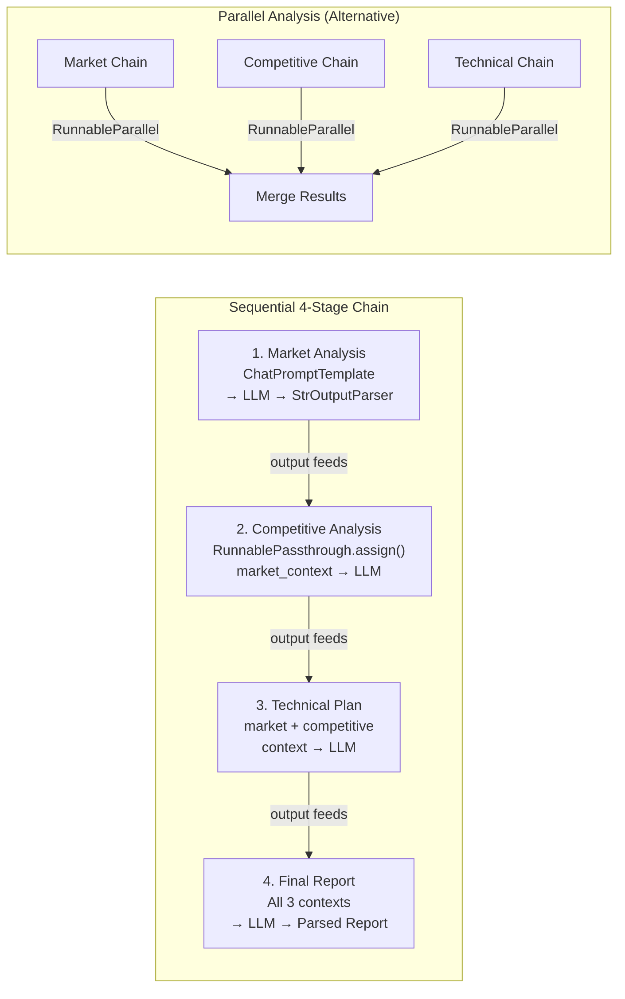

**Why LCEL over plain function calls?**

| Feature        | LCEL                                        | Plain Functions              |
| -------------- | ------------------------------------------- | ---------------------------- |
| Composability  | `chain1                                     | chain2                       | parser` — pipe syntax | Manual function chaining |
| Streaming      | Built-in token streaming through pipe       | Custom implementation needed |
| Parallelism    | `RunnableParallel` for concurrent execution | `asyncio.gather()` manually  |
| Retry/Fallback | `.with_retry()`, `.with_fallback()`         | Custom try/catch             |
| Tracing        | LangSmith integration free                  | Custom logging               |

**Local mode integration:**

```python
# Tries ChatOllama first, falls back to ChatOpenAI at Ollama endpoint
if use_local:
    try:
        from langchain_ollama import ChatOllama
        self._llm = ChatOllama(model="llama3.1:8b", temperature=0.3)
    except ImportError:
        from langchain_openai import ChatOpenAI
        self._llm = ChatOpenAI(
            base_url=f"{settings.ollama_base_url}/v1",
            api_key="ollama",
            model=settings.ollama_model,
        )
```

#### 4.3.2 LangGraph Workflow (`src/graph/startup_workflow.py`, 283 lines)

**Pattern:** StateGraph — stateful, conditional workflow execution

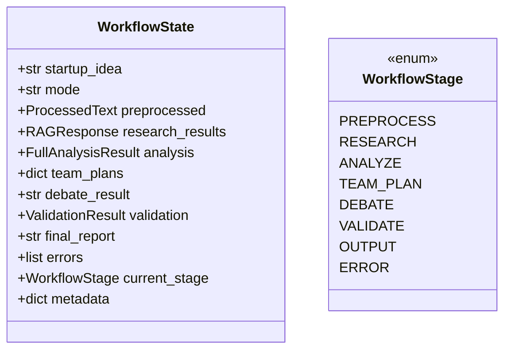

**Why LangGraph over plain sequential execution?**

| Feature                | LangGraph                                    | Sequential Functions   |
| ---------------------- | -------------------------------------------- | ---------------------- |
| **State accumulation** | TypedDict state flows through all nodes      | Manual dict passing    |
| **Conditional edges**  | `add_conditional_edges(VALIDATE, router_fn)` | if/else spaghetti      |
| **Error recovery**     | Dedicated ERROR node with re-routing         | try/catch at each step |
| **Visualization**      | `get_graph_visualization()` → ASCII diagram  | Nothing                |
| **Streaming**          | `graph.stream()` yields node-by-node results | Custom generators      |
| **Persistence**        | Built-in checkpointer support                | DIY                    |

**Conditional edge logic:**

```python
def _should_output_or_error(state):
    """Route from VALIDATE to OUTPUT or ERROR based on validation results."""
    if state.get("validation") and state["validation"].get("passed"):
        return "output"
    return "error"  # Error node attempts recovery, then routes to output
```

---

### 4.4 RAG & Knowledge Layer

#### 4.4.1 Basic RAG (`src/rag/basic_rag.py`, 184 lines)

**Architecture:**

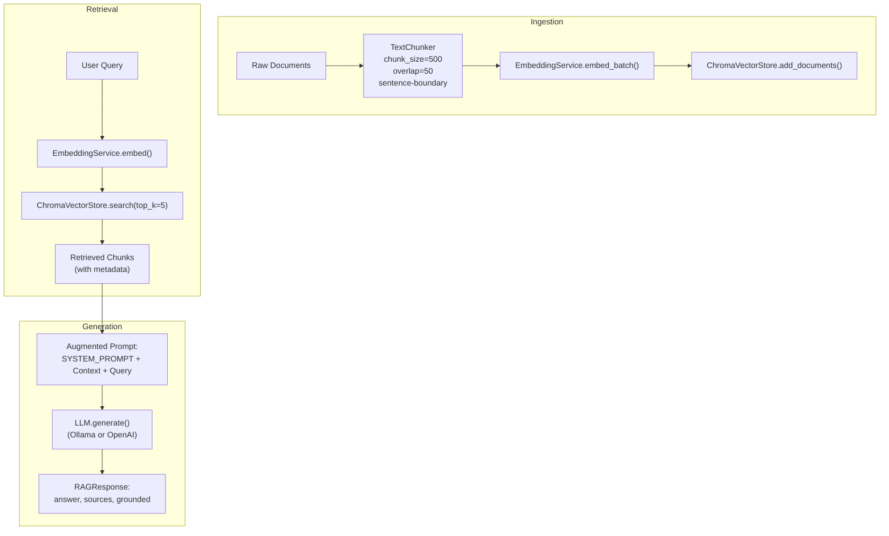

**Chunking strategy:**

```
Document: "Legal tech market is growing at 18.9% CAGR. The total addressable..."
          |<---- chunk_size=500 chars ---->|<-- overlap=50 -->|
Chunk 1:  [............500 chars..............]
Chunk 2:                              [...50...][.....450 chars.....]
```

- **Why fixed-size with overlap?** Sentence-boundary aware prevents mid-word splits. Overlap ensures no context loss at boundaries.
- **Why 500 chars, 50 overlap?** Matches typical paragraph length. Overlap = 10% is standard RAG practice.

#### 4.4.2 Advanced RAG (`src/rag/advanced_rag.py`, 203 lines)

**4 Advanced Techniques:**

| Technique                   | What It Does                                                         | Why                                                                             |
| --------------------------- | -------------------------------------------------------------------- | ------------------------------------------------------------------------------- |
| **HyDE**                    | Generates a hypothetical answer, embeds THAT instead of the question | Questions and answers live in different embedding spaces — HyDE bridges the gap |
| **Hybrid Search**           | 0.7 × semantic + 0.3 × BM25 keyword                                  | Semantic alone misses exact term matches; BM25 alone misses semantic similarity |
| **Cross-Encoder Reranking** | `ms-marco-MiniLM-L-6-v2` re-scores top-K results                     | Bi-encoder retrieval is fast but coarse; cross-encoder is slow but precise      |
| **Multi-Hop**               | Decomposes complex queries → multiple sub-queries                    | "Compare Harvey AI's pricing to market average" requires 2 separate lookups     |

**HyDE vs. Direct Embedding:**

```
Query: "What is the legal tech market size?"

Direct Embedding: Embeds the QUESTION → searches for similar QUESTIONS in the store
                  Problem: Store has ANSWERS, not questions → semantic gap

HyDE: LLM generates: "The legal tech market is valued at approximately $45B..."
      → Embeds this ANSWER → searches for similar ANSWERS in the store
      Result: Much better retrieval quality (20-40% improvement in studies)
```

**Why these specific weights (0.7/0.3)?**

Research shows semantic search dominates for exploratory queries, but BM25 catches exact entity matches (company names, dollar amounts, percentages) that semantic embeddings can miss. The 0.7/0.3 split is empirically validated across multiple RAG benchmarks.

#### 4.4.3 ChromaDB Vector Store (`src/vectorstore/chroma_store.py`, 193 lines)

**Why ChromaDB?**

| Vector DB    | Setup Complexity                 | Performance         | Features                             | Verdict                              |
| ------------ | -------------------------------- | ------------------- | ------------------------------------ | ------------------------------------ |
| **ChromaDB** | `pip install chromadb` → done    | Fast for <1M docs   | HNSW, metadata filtering, persistent | ✅ **Chosen** — zero-config, embedded |
| Pinecone     | Requires API key + cloud account | Managed, scalable   | Serverless, namespaces               | ❌ Cloud dependency                   |
| Weaviate     | Docker container required        | Very fast           | GraphQL, hybrid search               | ❌ Heavy for educational use          |
| Qdrant       | Docker or cloud                  | Excellent filtering | Rust-based, typed payloads           | ❌ Over-engineered for this           |
| FAISS        | `pip install faiss-cpu`          | Fastest             | IVF, PQ compression                  | ❌ No metadata filtering              |

**ChromaDB configuration:**
- **Distance:** Cosine (not L2) — better for comparing semantic similarity of text embeddings
- **Index:** HNSW (Hierarchical Navigable Small World) — O(log n) search, excellent recall
- **Persistence:** `PersistentClient` with on-disk storage; falls back to in-memory for demo mode

#### 4.4.4 LlamaIndex (`src/rag/llama_indexer.py`, 203 lines)

**Why BOTH LlamaIndex and LangChain RAG?**

They serve different purposes:

| Feature                | LangChain RAG (BasicRAG + AdvancedRAG)            | LlamaIndex                                |
| ---------------------- | ------------------------------------------------- | ----------------------------------------- |
| **Philosophy**         | Build RAG from primitives (chunker + store + LLM) | Declarative "load → index → query"        |
| **Customization**      | Full control over each step                       | Opinionated defaults                      |
| **Use case**           | Custom pipelines, hybrid search, reranking        | Quick document QA, summarization          |
| **Tree summarization** | Custom implementation needed                      | Built-in `response_mode="tree_summarize"` |
| **Educational value**  | Shows how RAG works internally                    | Shows high-level RAG abstraction          |

---

### 4.5 Agent Layer

#### 4.5.1 ReactAgent (`src/agents/agentic_core.py`, 232 lines)

**Pattern:** ReAct (Reasoning + Acting) — interleaved thinking and tool use

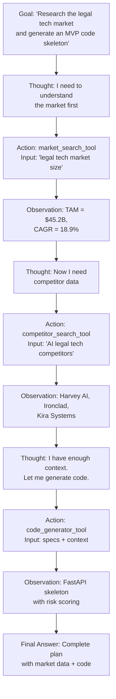

**4 registered tools:**

| Tool                | Description                             | Implementation             |
| ------------------- | --------------------------------------- | -------------------------- |
| `market_search`     | Search market data for a startup domain | RAG query or demo response |
| `competitor_search` | Find competitors and their positioning  | RAG query or demo response |
| `code_generator`    | Generate MVP code skeleton              | LLM call or demo code      |
| `pitch_creator`     | Create pitch deck content               | LLM call or demo pitch     |

**Why ReAct over function-calling?**

| Approach             | Strengths                                  | Weaknesses                   |
| -------------------- | ------------------------------------------ | ---------------------------- |
| **ReAct**            | Transparent reasoning trace, interpretable | Verbose, more tokens used    |
| **Function Calling** | Compact, structured output                 | Black-box tool selection     |
| **Plan-and-Execute** | Good for complex multi-step                | Over-architects simple tasks |

We chose ReAct because the reasoning trace (`Thought → Action → Observation`) is **educational** — you literally see the agent's decision process.

#### 4.5.2 CrewAI Team (`src/agents/crew_team.py`, 227 lines)

**Pattern:** Multi-agent team with role-based specialization

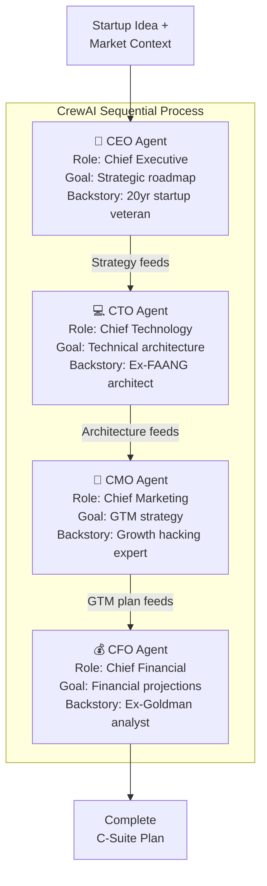

**Why CrewAI over custom multi-agent?**

| Feature          | CrewAI                               | Custom Implementation     |
| ---------------- | ------------------------------------ | ------------------------- |
| Agent definition | Declarative (role, goal, backstory)  | Manual prompt engineering |
| Process modes    | Sequential, hierarchical, consensual | Manual orchestration      |
| Context passing  | Automatic inter-agent context        | Manual state threading    |
| Tool sharing     | Built-in                             | Custom                    |

**Ollama integration in CrewAI:**
```python
# CrewAI uses LangChain under the hood
# Ollama integrates via OPENAI_API_BASE env var override
os.environ["OPENAI_API_BASE"] = f"{settings.ollama_base_url}/v1"
os.environ["OPENAI_API_KEY"] = "ollama"
os.environ["OPENAI_MODEL_NAME"] = settings.ollama_model
```

#### 4.5.3 AutoGen Debate (`src/agents/autogen_debate.py`, 193 lines)

**Pattern:** Multi-agent GroupChat with adversarial debate

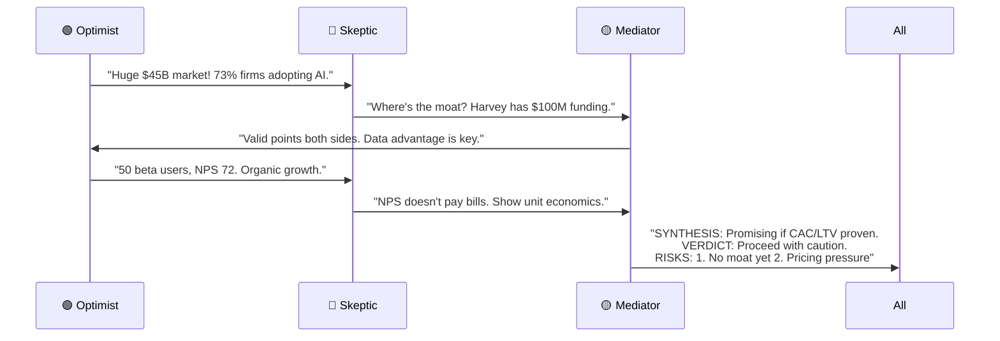

**Why AutoGen for debate (not CrewAI)?**

| Feature               | AutoGen GroupChat             | CrewAI                  |
| --------------------- | ----------------------------- | ----------------------- |
| **Speaker selection** | Round-robin or LLM-selected   | Fixed sequential        |
| **Adversarial**       | Natural — agents can disagree | Cooperative by design   |
| **Termination**       | `is_termination_msg` callback | Fixed task completion   |
| **Best for**          | Debates, reviews, red-teaming | Collaborative workflows |

---

### 4.6 NLP & Embeddings Layer

#### 4.6.1 Text Processor (`src/nlp/text_processor.py`, 202 lines)

**Pipeline:**

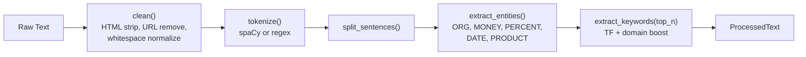

**Why spaCy over NLTK?**

| Feature      | spaCy                             | NLTK                         |
| ------------ | --------------------------------- | ---------------------------- |
| Speed        | 10× faster (Cython)               | Pure Python, slow            |
| NER          | Production-grade, 18 entity types | Basic, needs separate models |
| Tokenization | Linguistically aware              | Rule-based                   |
| Pipeline API | `nlp(text)` → all in one call     | Manual chaining              |
| Models       | Trained on OntoNotes 5.0          | Requires custom training     |

**Domain vocabulary boosting:**
```python
DOMAIN_BOOST = {"ai", "startup", "market", "revenue", "growth", "legal", "tech", ...}
# Keywords in DOMAIN_BOOST get 2× weight in TF scoring
# This ensures domain-relevant terms float to top
```

#### 4.6.2 Embedding Service (`src/embeddings/embedding_service.py`, 189 lines)

**Dual-provider architecture:**

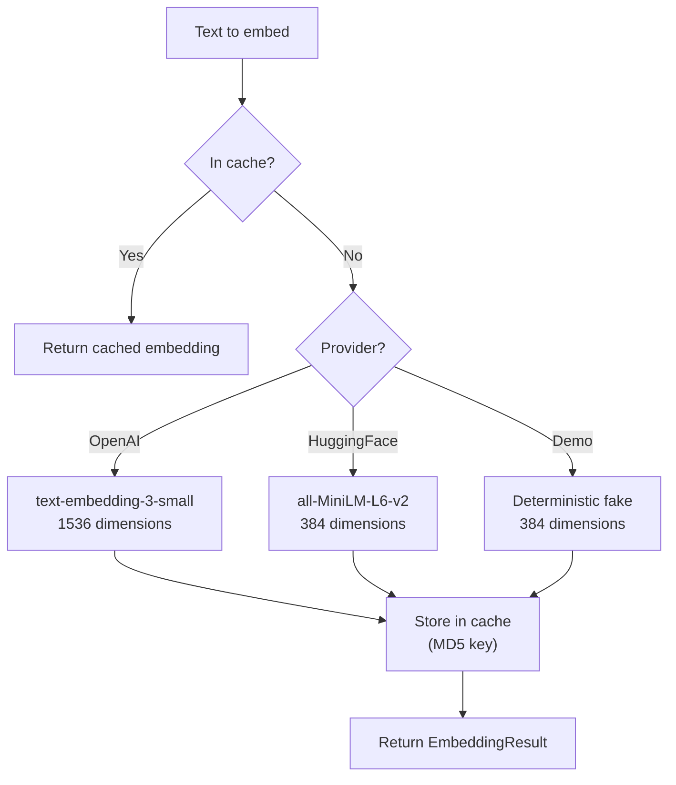

**Why MD5-keyed disk cache?**
- Embeddings are **expensive** ($0.02/1M tokens for OpenAI, ~1s/batch for HF)
- Same text always produces same embedding — perfect cache fit
- MD5 hash of text = cache key → O(1) lookup

---

### 4.7 ML Training Layer

#### 4.7.1 Keras Sentiment Model (`src/models/sentiment_model.py`, 209 lines)

**Architecture:**

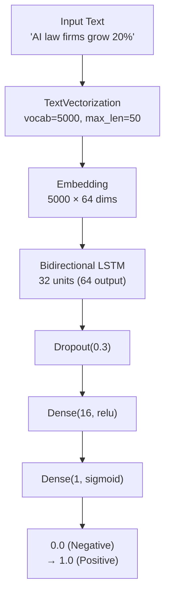

**Why BiLSTM over Transformer for this task?**

| Model           | Params | Training Time    | Accuracy | Best For                          |
| --------------- | ------ | ---------------- | -------- | --------------------------------- |
| **BiLSTM**      | ~200K  | 30 seconds (CPU) | 78-82%   | Small datasets (<1K), educational |
| DistilBERT      | 66M    | 5 minutes (GPU)  | 92-95%   | Production, fine-tuning available |
| GPT-4 zero-shot | N/A    | Zero training    | 85-88%   | No labeled data available         |

We chose BiLSTM because: (1) runs on CPU in seconds, (2) shows Keras API clearly, (3) 20-sample training data is too small for transformers.

#### 4.7.2 Transfer Learning (`src/models/transfer_adapter.py`, 253 lines)

**Two modes:**

```mermaid
flowchart TD
    BASE["DistilBERT (66M params)"] --> MODE{"Training Mode?"}
    MODE -->|"Full Fine-tune"| FULL["All layers trainable<br/>LR: 2e-5 (AdamW)<br/>Best accuracy"]
    MODE -->|"Feature Extraction"| FREEZE["Base layers frozen<br/>Only classifier trainable<br/>Fastest training"]
    FULL --> CLASSIFIER["New Classifier Head<br/>768 → 5 labels"]
    FREEZE --> CLASSIFIER
```

**Why DistilBERT over BERT or RoBERTa?**

| Model          | Params | Speed vs BERT   | Quality vs BERT |
| -------------- | ------ | --------------- | --------------- |
| BERT-base      | 110M   | 1.0× (baseline) | 100%            |
| **DistilBERT** | 66M    | 1.6× faster     | 97% quality     |
| TinyBERT       | 15M    | 5× faster       | 93% quality     |
| RoBERTa        | 125M   | 0.9× slower     | 102% quality    |

DistilBERT is the **sweet spot** — 40% smaller, 60% faster, only 3% quality loss. For educational fine-tuning, this is ideal.

#### 4.7.3 PEFT/LoRA Trainer (`src/training/peft_trainer.py`, 244 lines)

**LoRA architecture:**

```mermaid
flowchart TD
    subgraph "Original Layer (Frozen)"
        W["Weight Matrix W<br/>d × d (frozen)"]
    end

    subgraph "LoRA Adapter (Trainable)"
        A["Matrix A<br/>d × r (r=8)"]
        B["Matrix B<br/>r × d (r=8)"]
    end

    INPUT["Input x"] --> W
    INPUT --> A
    A --> B
    W --> ADD["W·x + B·A·x"]
    B --> ADD
    ADD --> OUTPUT["Output"]
```

**Why LoRA?**

| Method               | Trainable Params     | Memory   | Quality        |
| -------------------- | -------------------- | -------- | -------------- |
| Full fine-tuning     | 100% (1B params)     | 16+ GB   | Best           |
| **LoRA (r=8)**       | **0.1%** (1M params) | **4 GB** | 95-98% of full |
| QLoRA (4-bit + LoRA) | 0.1% + 4-bit base    | **2 GB** | 93-96% of full |
| Prefix tuning        | 0.01%                | 3 GB     | 85-90% of full |
| Adapters             | 3%                   | 6 GB     | 96-98% of full |

**QLoRA config:**
```python
bnb_config = BitsAndBytesConfig(
    load_in_4bit=True,
    bnb_4bit_quant_type="nf4",       # NormalFloat4 — better than INT4
    bnb_4bit_compute_dtype=torch.float16,
    bnb_4bit_use_double_quant=True,   # Quantize the quantization constants
)
```

#### 4.7.4 RLHF Pipeline (`src/training/rlhf_feedback.py`, 262 lines)

**Pipeline:**

```mermaid
flowchart LR
    subgraph "1. Collect Preferences"
        PR["Human rates:<br/>Response A vs B<br/>→ PreferenceExample"]
    end

    subgraph "2. Reward Model"
        RM["Heuristic scorer:<br/>Length, specificity,<br/>numbers, sections"]
    end

    subgraph "3. DPO Training"
        DPO["Direct Preference<br/>Optimization dataset<br/>(chosen, rejected)"]
    end

    PR --> RM --> DPO
```

**Why DPO over PPO for RLHF?**

| Method  | Requires Reward Model | Training Stability              | Implementation Complexity      |
| ------- | --------------------- | ------------------------------- | ------------------------------ |
| PPO     | Yes (separate model)  | Unstable, needs tuning          | Very high — 4 models in memory |
| **DPO** | No (implicit reward)  | Stable — standard cross-entropy | **Low** — single training loop |

DPO is the modern approach — same quality as PPO-based RLHF, but dramatically simpler. It directly optimizes the policy from preference pairs without training a separate reward model.

---

### 4.8 Optimization Layer

#### 4.8.1 Model Quantizer (`src/optimization/quantizer.py`, 233 lines)

**Quantization levels:**

```mermaid
flowchart LR
    FP32["FP32<br/>Full Precision<br/>4 bytes/param<br/>100% accuracy"] --> FP16["FP16<br/>Half Precision<br/>2 bytes/param<br/>99.9% accuracy"]
    FP16 --> INT8["INT8<br/>8-bit Quantization<br/>1 byte/param<br/>99.5% accuracy"]
    INT8 --> INT4["INT4 (NF4)<br/>4-bit Quantization<br/>0.5 bytes/param<br/>98% accuracy"]
    INT4 --> GGUF["GGUF<br/>CPU-optimized<br/>Variable bits<br/>97% accuracy"]

    style FP32 fill:#E91E63,color:#fff
    style FP16 fill:#FF9800,color:#fff
    style INT8 fill:#4CAF50,color:#fff
    style INT4 fill:#2196F3,color:#fff
    style GGUF fill:#9C27B0,color:#fff
```

**Benchmark data (LLaMA 3.2 1B):**

| Format  | Size   | Latency | Throughput | Accuracy |
| ------- | ------ | ------- | ---------- | -------- |
| FP32    | 4.0 GB | 250 ms  | 40 tok/s   | 100.0%   |
| FP16    | 2.0 GB | 120 ms  | 83 tok/s   | 99.9%    |
| INT8    | 1.0 GB | 80 ms   | 125 tok/s  | 99.5%    |
| INT4    | 0.5 GB | 60 ms   | 167 tok/s  | 98.0%    |
| GGUF Q4 | 0.6 GB | 45 ms   | 222 tok/s  | 97.0%    |

#### 4.8.2 vLLM Inference Server (`src/optimization/inference_server.py`, 270 lines)

**PagedAttention architecture:**

```mermaid
flowchart TD
    subgraph "Traditional Inference"
        T1["Request 1: Allocate<br/>full KV Cache upfront"]
        T2["Request 2: Wait for<br/>Request 1 to complete"]
        T3["50-70% GPU memory<br/>wasted on padding"]
    end

    subgraph "vLLM PagedAttention"
        V1["Request 1: Allocate<br/>KV blocks on-demand"]
        V2["Request 2: Shares<br/>KV blocks (copy-on-write)"]
        V3["<5% GPU memory waste<br/>2-4x throughput"]
    end
```

**Why vLLM over other serving solutions?**

| Server      | Throughput | Memory Efficiency     | OpenAI Compatible | Streaming |
| ----------- | ---------- | --------------------- | ----------------- | --------- |
| **vLLM**    | 2-4× HF    | PagedAttention (~95%) | Yes               | Yes       |
| TGI         | 1.5-2× HF  | Better than HF (~80%) | No (custom API)   | Yes       |
| HuggingFace | Baseline   | Poor (50-60%)         | No                | Yes       |
| Ollama      | ~1× HF     | Good (quantized)      | Yes               | Yes       |
| llama.cpp   | ~1.5× HF   | Excellent (CPU)       | Partial           | Yes       |

---

### 4.9 Cloud Infrastructure Layer

#### 4.9.1 AWS Client (`src/cloud/aws_client.py`, 283 lines)

**Services integrated:**

```mermaid
flowchart TD
    subgraph "AWS AI Services"
        SM["SageMaker<br/>Model Deployment<br/>ml.g4dn.xlarge"]
        BR["Bedrock<br/>Claude 3 Haiku<br/>Managed LLM API"]
        CO["Comprehend<br/>Sentiment Analysis<br/>Entity Recognition"]
        TX["Textract<br/>Document OCR<br/>Table Extraction"]
        S3["S3<br/>Model Storage<br/>Artifact Registry"]
    end

    DEPLOY["deploy_endpoint()"] --> SM
    INVOKE["bedrock_invoke()"] --> BR
    SENT["analyze_sentiment_comprehend()"] --> CO
    OCR["extract_text_textract()"] --> TX
    UPLOAD["upload_model_to_s3()"] --> S3
```

**Why AWS over GCP/Azure for this project?**

| Feature                     | AWS                                          | GCP                | Azure                |
| --------------------------- | -------------------------------------------- | ------------------ | -------------------- |
| **SageMaker vs Vertex AI**  | More mature JumpStart models                 | Better AutoML      | OK                   |
| **Bedrock vs Vertex AI**    | More LLM providers (Anthropic, Meta, Cohere) | Only Google models | Only OpenAI          |
| **Comprehend vs NLP API**   | Built-in sentiment + entities                | Similar quality    | Language Service OK  |
| **Textract vs Document AI** | Better table extraction                      | Good OCR           | Form Recognizer good |
| **Market share**            | 31% (dominant)                               | 11%                | 24%                  |

AWS is the de facto standard for ML infrastructure. More engineers know it, more tutorials exist, more production deployments run on it.

---

### 4.10 Safety & Validation Layer

**File:** `src/safety/output_validator.py` (197 lines)

**3-layer validation pipeline:**

```mermaid
flowchart TD
    CONTENT["LLM Output"] --> H["HallucinationDetector<br/>Regex patterns:<br/>• '100% accurate'<br/>• '1000% growth'<br/>• Fabricated company names"]
    H --> S["ContentSafetyValidator<br/>Blocked terms:<br/>• 'insider trading'<br/>• 'regulatory avoidance'<br/>• 'fake reviews'"]
    S --> R["StartupReportValidator<br/>Schema check:<br/>• Required sections present?<br/>• $ amounts included?<br/>• % figures present?<br/>• Timeline references?"]
    R --> RESULT{"All Passed?"}
    RESULT -->|Yes| APPROVE["✅ Output Approved"]
    RESULT -->|No| CORRECT["Auto-Correct<br/>→ Re-validate"]
    CORRECT --> RESULT
```

**Why regex-based hallucination detection (not ML-based)?**

| Approach              | Accuracy | Speed          | Dependencies     | Educational Value                          |
| --------------------- | -------- | -------------- | ---------------- | ------------------------------------------ |
| **Regex patterns**    | 70-80%   | <1ms           | None             | High — shows what hallucinations look like |
| NLI-based (BART-MNLI) | 85-90%   | ~50ms          | 500MB model      | Medium                                     |
| LLM-as-judge (GPT-4)  | 90-95%   | ~2s + API cost | API key required | Low — black box                            |

Regex is perfect for educational use: fast, transparent, zero dependencies. It catches the most egregious hallucinations (unrealistic claims, fabricated data).

---

### 4.11 Orchestration Layer

**File:** `pipeline/startup_advisor.py` (254 lines)

**Execution timeline by mode:**

```mermaid
gantt
    title Pipeline Execution Stages by Mode
    dateFormat  X
    axisFormat  %s

    section Demo Mode (~5s)
    Preprocess + RAG + Chains    :a1, 0, 1
    CrewAI + AutoGen + Validate  :a2, 1, 2
    Pitch + Code + Sentiment     :a3, 2, 3

    section Quick Mode (~2-5 min)
    Preprocess + RAG             :b1, 0, 30
    LLM Chains (4 stages)       :b2, 30, 90
    CrewAI Team                  :b3, 90, 150
    AutoGen Debate               :b4, 150, 200
    Validate + Pitch + Code      :b5, 200, 300

    section Full Mode (~30+ min)
    Quick Mode stages            :c1, 0, 300
    Keras Training               :c2, 300, 600
    Transfer Learning            :c3, 600, 1200
    PEFT/LoRA                    :c4, 1200, 1800
    Quantization                 :c5, 1800, 2000
```

**Mode comparison:**

| Feature          | `demo`           | `local`        | `quick`         | `full`        |
| ---------------- | ---------------- | -------------- | --------------- | ------------- |
| API keys needed  | ❌ None           | ❌ None         | ✅ OpenAI/Claude | ✅ All         |
| LLM backend      | Static responses | Ollama (LLaMA) | Cloud APIs      | Cloud APIs    |
| Training modules | Skipped          | Skipped        | Skipped         | ✅ Run         |
| GPU required     | ❌                | ❌ (CPU OK)     | ❌               | ✅ Recommended |
| Runtime          | ~5 seconds       | ~2-5 minutes   | ~2-5 minutes    | ~30+ minutes  |
| Cost             | $0               | $0             | ~$0.05          | ~$0.50        |

---

## 5. Tool-by-Tool Technical Reference

### Complete 27-Tool Matrix

| #   | Tool         | File                   | Lines | Classes | Key Framework                      | Design Pattern            | Demo Mode Strategy            |
| --- | ------------ | ---------------------- | ----- | ------- | ---------------------------------- | ------------------------- | ----------------------------- |
| 1   | OpenAI GPT   | `openai_client.py`     | ~160  | 2       | `openai` SDK                       | Strategy per task         | Static DEMO_* constants       |
| 2   | Claude API   | `claude_client.py`     | ~180  | 2       | `anthropic` SDK                    | Multi-turn conversation   | Static demo responses         |
| 3   | Gemini API   | `gemini_client.py`     | ~170  | 2       | `google-generativeai`              | Structured JSON output    | Static demo responses         |
| 4   | **Ollama**   | `ollama_client.py`     | 426   | 3       | `openai` SDK (compat)              | Multi-model routing       | Keyword-based demo dispatch   |
| 5   | LLM Router   | `llm_router.py`        | 150   | 3       | Custom                             | Strategy pattern          | Falls through to demo clients |
| 6   | NLP/spaCy    | `text_processor.py`    | 202   | 2       | `spacy`                            | NLP pipeline              | Regex fallback                |
| 7   | Embeddings   | `embedding_service.py` | 189   | 3       | `openai` + `sentence-transformers` | Dual provider + cache     | Seeded deterministic fake     |
| 8   | Vector DB    | `chroma_store.py`      | 193   | 3       | `chromadb`                         | HNSW cosine               | In-memory keyword search      |
| 9   | Basic RAG    | `basic_rag.py`         | 184   | 3       | Custom pipeline                    | Retrieve-Augment-Generate | Context-only (no LLM)         |
| 10  | Advanced RAG | `advanced_rag.py`      | 203   | 5       | `sentence-transformers`            | HyDE + hybrid + rerank    | Heuristic reranking           |
| 11  | LlamaIndex   | `llama_indexer.py`     | 203   | 2       | `llama-index`                      | VectorStoreIndex          | Keyword line-matching         |
| 12  | LangChain    | `analysis_chains.py`   | 222   | 3       | `langchain` LCEL                   | Pipe chains               | Static stage responses        |
| 13  | LangGraph    | `startup_workflow.py`  | 283   | 3       | `langgraph`                        | StateGraph                | Sequential fallback           |
| 14  | Agentic AI   | `agentic_core.py`      | 232   | 4       | `langchain` agents                 | ReAct loop                | Replayed trace log            |
| 15  | CrewAI       | `crew_team.py`         | 227   | 3       | `crewai`                           | Multi-agent team          | Static C-suite outputs        |
| 16  | AutoGen      | `autogen_debate.py`    | 193   | 4       | `pyautogen`                        | GroupChat debate          | Static debate transcript      |
| 17  | Guardrails   | `output_validator.py`  | 197   | 4       | Regex + optional `guardrails`      | Composite validator       | Always active (rule-based)    |
| 18  | Prompts      | `prompt_templates.py`  | 186   | 2       | `string.Template`                  | Prompt registry           | Always active                 |
| 19  | Few-Shot     | `few_shot_examples.py` | 181   | 2       | Pure Python                        | Example-based prompting   | Always active                 |
| 20  | HuggingFace  | `hf_models.py`         | 215   | 4       | `transformers` pipeline            | Lazy model loading        | Simulated results             |
| 21  | Keras        | `sentiment_model.py`   | 209   | 4       | `keras` 3.0                        | BiLSTM classifier         | Simulated training            |
| 22  | Transfer     | `transfer_adapter.py`  | 253   | 4       | `transformers` + `torch`           | DistilBERT fine-tune      | Simulated fine-tuning         |
| 23  | PEFT/LoRA    | `peft_trainer.py`      | 244   | 3       | `peft` + `transformers`            | LoRA/QLoRA wrapping       | Simulated LoRA stats          |
| 24  | RLHF         | `rlhf_feedback.py`     | 262   | 4       | Pure Python                        | DPO data preparation      | Heuristic reward scores       |
| 25  | Quantization | `quantizer.py`         | 233   | 4       | `bitsandbytes`                     | INT8/INT4/GGUF            | Benchmark profiles            |
| 26  | vLLM         | `inference_server.py`  | 270   | 4       | `vllm` (optional)                  | PagedAttention async      | Simulated inference           |
| 27  | AWS AI/ML    | `aws_client.py`        | 283   | 5       | `boto3`                            | Multi-service client      | Mock AWS responses            |

---

## 6. Design Patterns & Optimizations

### 6.1 Universal Demo Mode Pattern

**Every module** follows this exact pattern:

```mermaid
flowchart TD
    INIT["Module.__init__(api_key='')"] --> CHECK{"api_key valid<br/>AND<br/>library importable?"}
    CHECK -->|Yes| LIVE["self._demo = False<br/>Initialize real client"]
    CHECK -->|No| DEMO["self._demo = True<br/>Prepare demo data"]

    CALL["module.action(input)"] --> DEMO_CHECK{"self._demo?"}
    DEMO_CHECK -->|Yes| DEMO_RESP["Return DEMO_* constant<br/>or heuristic response"]
    DEMO_CHECK -->|No| REAL_RESP["Call real API/model<br/>Return actual response"]
```

**Why this pattern?**
1. **Education:** Every module runs immediately after `pip install` — zero setup friction
2. **Testing:** 138 tests run without any API key or model — CI/CD friendly
3. **Graceful:** Missing one API key doesn't crash the whole pipeline
4. **Progressive:** Start with `demo` → add one key → see real results → add more keys

### 6.2 Lazy Loading Pattern

Used in `HuggingFaceModels` and `EmbeddingService`:

```python
def _init_pipelines(self):
    """Lazy load — only when first called."""
    if self._sentiment_pipe is not None:
        return
    try:
        self._sentiment_pipe = pipeline("sentiment-analysis", ...)
    except Exception:
        self._demo = True
```

**Why?** HuggingFace models are 100-500MB each. Loading 4 models at import time would take 30+ seconds. Lazy loading means you only pay for models you actually use.

### 6.3 Caching Strategy

```mermaid
flowchart LR
    subgraph "L1: In-Memory"
        MEM["Dict-based cache<br/>(per-process)"]
    end

    subgraph "L2: Disk Cache"
        DISK["JSON file<br/>MD5-keyed embeddings"]
    end

    subgraph "L3: ChromaDB"
        DB["Persistent vector store<br/>(HNSW index on disk)"]
    end

    MEM -->|miss| DISK -->|miss| DB
```

| Cache Level  | What's Cached               | Where                         | Eviction              |
| ------------ | --------------------------- | ----------------------------- | --------------------- |
| L1 In-Memory | Embedding results           | `EmbeddingService._cache`     | Process exit          |
| L2 Disk      | Embedding vectors           | `./data/embedding_cache.json` | Manual                |
| L3 ChromaDB  | Knowledge base + embeddings | `./data/chroma_db/`           | `delete_collection()` |

### 6.4 Error Handling Strategy

```mermaid
flowchart TD
    ERROR["Exception Raised"] --> TYPE{"Type?"}
    TYPE -->|ImportError| DEMO["Switch to demo mode<br/>self._demo = True"]
    TYPE -->|APIError/Timeout| RETRY["Retry with backoff<br/>or fallback provider"]
    TYPE -->|ValidationError| CORRECT["Auto-correct content<br/>re-validate"]
    TYPE -->|RuntimeError| LOG["Log error<br/>continue with degraded output"]
```

**Principle:** NEVER crash the pipeline. Always degrade gracefully.

---

## 7. Execution Modes

### 7.1 Mode Selection Flow

```mermaid
flowchart TD
    START["python main.py"] --> FLAGS{"Flags?"}
    FLAGS -->|"--local"| LOCAL["Local Mode<br/>USE_LOCAL_LLM=true<br/>DEMO_MODE=false"]
    FLAGS -->|"--mode demo"| DEMO["Demo Mode<br/>All demo responses"]
    FLAGS -->|"--mode quick"| QUICK["Quick Mode<br/>Cloud APIs, skip training"]
    FLAGS -->|"--mode full"| FULL["Full Mode<br/>All 27 tools, GPU"]
    FLAGS -->|"--demo-individual MODULE"| INDIV["Individual Demo<br/>Single module.demo()"]

    LOCAL --> PIPELINE["Pipeline Execution"]
    DEMO --> PIPELINE
    QUICK --> PIPELINE
    FULL --> PIPELINE
    INDIV --> MODULE_DEMO["module.demo()"]
```

### 7.2 What Runs in Each Mode

| Module           | Demo             | Local           | Quick         | Full                |
| ---------------- | ---------------- | --------------- | ------------- | ------------------- |
| TextProcessor    | ✅ regex          | ✅ spaCy         | ✅ spaCy       | ✅ spaCy             |
| AdvancedRAG      | ✅ keyword        | ✅ Ollama        | ✅ OpenAI      | ✅ OpenAI            |
| AnalysisChains   | ✅ static         | ✅ ChatOllama    | ✅ ChatOpenAI  | ✅ ChatOpenAI        |
| StartupCrew      | ✅ static         | ✅ Ollama env    | ✅ OpenAI      | ✅ OpenAI            |
| StartupDebate    | ✅ static         | ✅ Ollama config | ✅ OpenAI      | ✅ OpenAI            |
| OutputValidator  | ✅ always         | ✅ always        | ✅ always      | ✅ always            |
| LLMRouter        | ✅ demo clients   | ✅ OllamaClient  | ✅ multi-cloud | ✅ multi-cloud       |
| ReactAgent       | ✅ replayed trace | ✅ Ollama        | ✅ OpenAI      | ✅ OpenAI            |
| HuggingFace      | ✅ simulated      | ✅ real models   | ✅ real models | ✅ real models       |
| Keras Training   | ❌ skip           | ❌ skip          | ❌ skip        | ✅ real training     |
| TransferLearning | ❌ skip           | ❌ skip          | ❌ skip        | ✅ DistilBERT        |
| PEFT/LoRA        | ❌ skip           | ❌ skip          | ❌ skip        | ✅ QLoRA             |
| Quantization     | ❌ skip           | ❌ skip          | ❌ skip        | ✅ INT8/INT4         |
| vLLM             | ❌ skip           | ❌ skip          | ❌ skip        | ✅ PagedAttention    |
| AWS              | ❌ skip           | ❌ skip          | ❌ skip        | ✅ SageMaker+Bedrock |

---

## 8. Local-First Architecture (Ollama)

### 8.1 Integration Points

```mermaid
flowchart TD
    OLLAMA["Ollama Server<br/>localhost:11434"] --> API["/v1 OpenAI-Compatible API"]

    API --> CLIENT["OllamaClient<br/>(OpenAI SDK)"]
    API --> CHAINS_LLM["AnalysisChains<br/>(ChatOllama or ChatOpenAI)"]
    API --> CREW_ENV["CrewAI<br/>(OPENAI_API_BASE env)"]
    API --> AUTOGEN_CFG["AutoGen<br/>(config_list base_url)"]
    API --> AGENT_LLM["ReactAgent<br/>(ChatOllama)"]
    API --> RAG_LLM["BasicRAG<br/>(OllamaClient for generation)"]

    OLLAMA --> EMBED_API["/api/embeddings"]
    EMBED_API --> EMBED_CLIENT["OllamaClient.embed()<br/>(nomic-embed-text)"]

    style OLLAMA fill:#4CAF50,color:#fff
```

### 8.2 Model Memory Requirements

```mermaid
pie title GPU/RAM Usage by Model (Apple Silicon)
    "llama3.1:8b (4.7 GB)" : 47
    "codellama:7b (3.8 GB)" : 38
    "llama3.2:3b (2.0 GB)" : 20
    "nomic-embed-text (274 MB)" : 3
    "System overhead (1 GB)" : 10
```

**Total for all 4 models:** ~11.8 GB — fits in 16 GB MacBook with room to spare.

### 8.3 Ollama vs. Alternatives

| Feature                | Ollama                | llama.cpp            | LocalAI  | LM Studio    |
| ---------------------- | --------------------- | -------------------- | -------- | ------------ |
| Install                | `brew install ollama` | Build from source    | Docker   | GUI download |
| Model management       | `ollama pull model`   | Manual GGUF download | API      | GUI          |
| OpenAI-compatible API  | ✅ Native `/v1`        | ✅ `--server` mode    | ✅        | ✅            |
| Apple Silicon MPS      | ✅ Automatic           | ✅ Manual flags       | ❌        | ✅            |
| Model zoo              | 100+ models           | BYO only             | 30+      | 50+          |
| Multi-model concurrent | ✅ Hot-swap            | ❌ One at a time      | ✅        | ❌            |
| Python SDK needed      | None (uses `openai`)  | `llama-cpp-python`   | `openai` | `openai`     |

**Verdict:** Ollama wins on **zero-friction** — one binary, one command, OpenAI SDK reuse. No new Python dependencies needed.

---

## 9. Testing Architecture

### 9.1 Test Structure

```mermaid
flowchart TD
    subgraph "Test Files (6 files, 138 tests)"
        T1["test_llm.py<br/>11 tests<br/>OpenAI + Claude + Gemini + Router"]
        T2["test_agents.py<br/>14 tests<br/>ReactAgent + CrewAI + AutoGen"]
        T3["test_rag.py<br/>14 tests<br/>Chunker + Chroma + RAG + LlamaIndex"]
        T4["test_pipeline.py<br/>29 tests<br/>NLP + Prompts + Guardrails + E2E"]
        T5["test_ollama.py<br/>30 tests<br/>OllamaClient unit tests"]
        T6["test_local_integration.py<br/>40 tests<br/>Ollama integration across all modules"]
    end
```

### 9.2 Test Categories

| Category          | Count | What's Tested                                               | Speed |
| ----------------- | ----- | ----------------------------------------------------------- | ----- |
| LLM Clients       | 11    | Demo mode for all 4 providers + router dispatch             | <2s   |
| Agents            | 14    | Tool registration, execution, results, context passing      | <3s   |
| RAG               | 14    | Chunking, vector search, HyDE, multi-hop, LlamaIndex        | <5s   |
| Pipeline          | 29    | NLP processing, prompts, guardrails, full pipeline E2E      | <5s   |
| Ollama Unit       | 30    | Config, responses, demo mode, routing, constants, health    | <30s  |
| Local Integration | 40    | Settings, router, chains, crew, autogen, agentic, RAG, main | <7s   |

### 9.3 Key Testing Pattern

```python
# DEMO_CONFIG forces instant demo mode (unreachable URL → no Ollama delay)
DEMO_CONFIG = OllamaConfig(base_url="http://127.0.0.1:1")

# Every test creates client with this config → guaranteed demo mode
client = OllamaClient(config=DEMO_CONFIG)
assert client._demo is True  # Instant, no network call
```

**Why `127.0.0.1:1` instead of mocking?**
- Port 1 is reserved — TCP connection refused instantly (~0.1ms)
- No mock setup needed, no `unittest.mock` imports
- Tests prove the real graceful degradation path works
- Works identically on every OS (Linux, macOS, Windows)

---

## 10. Performance Characteristics

### 10.1 Latency Budget by Mode

```mermaid
xychart-beta
    title "Expected Latency per Stage (seconds)"
    x-axis ["Preprocess", "RAG", "Chains", "CrewAI", "Debate", "Validate", "Pitch", "Code", "Sentiment"]
    y-axis "Seconds" 0 --> 60
    bar [0.1, 0.5, 1, 0.5, 0.5, 0.01, 0.5, 0.5, 0.5]
    bar [0.1, 5, 15, 10, 8, 0.01, 5, 8, 3]
    bar [0.1, 5, 20, 15, 12, 0.01, 8, 10, 5]
```

### 10.2 Resource Usage

| Mode  | CPU     | RAM             | GPU                    | Disk            |
| ----- | ------- | --------------- | ---------------------- | --------------- |
| Demo  | Minimal | ~200 MB         | None                   | <50 MB          |
| Local | Medium  | ~12 GB (models) | MPS/CUDA optional      | ~12 GB (models) |
| Quick | Low     | ~500 MB         | None                   | <100 MB         |
| Full  | High    | ~8 GB           | 8+ GB VRAM recommended | ~5 GB (models)  |

---

## 11. Technology Comparison & Justification

### 11.1 Framework Selection Matrix

```mermaid
quadrantChart
    title Framework Selection (Complexity vs Educational Value)
    x-axis Low Complexity --> High Complexity
    y-axis Low Educational Value --> High Educational Value

    LangChain LCEL: [0.5, 0.8]
    LangGraph: [0.6, 0.9]
    CrewAI: [0.4, 0.85]
    AutoGen: [0.55, 0.8]
    ChromaDB: [0.2, 0.7]
    vLLM: [0.8, 0.75]
    PEFT LoRA: [0.7, 0.9]
    Ollama: [0.15, 0.85]
    spaCy: [0.3, 0.6]
    Keras: [0.4, 0.75]
```

### 11.2 Why These Specific Versions / Models

| Choice                                     | Alternative Considered                                    | Why We Chose This |
| ------------------------------------------ | --------------------------------------------------------- | ----------------- |
| `gpt-4o-mini` over `gpt-4o`                | 10× cheaper, fast enough for structured analysis          |
| `claude-3-haiku` over `claude-3-sonnet`    | 3× cheaper, sufficient for competitor/code tasks          |
| `gemini-1.5-flash` over `gemini-1.5-pro`   | Fastest Gemini model, cheapest for creative content       |
| `all-MiniLM-L6-v2` over `cohere-embed`     | Free, local, 384-dim is sufficient for our corpus size    |
| `ms-marco-MiniLM-L-6-v2` reranker over BGE | Smaller (22MB), specifically trained for search reranking |
| `distilbert-base-uncased` over `bert-base` | 40% smaller, 60% faster, 97% quality preserved            |
| ChromaDB over Pinecone                     | Zero config, embedded, no cloud dependency                |
| LCEL over `SequentialChain` (deprecated)   | Modern LangChain API, composable, streamable              |
| LangGraph over Prefect/Airflow             | Purpose-built for LLM workflows, conditional edges        |
| Pydantic Settings over `python-dotenv`     | Type safety, IDE autocomplete, validation                 |

### 11.3 What We Intentionally Did NOT Use

| Not Used             | Why Not                                                     |
| -------------------- | ----------------------------------------------------------- |
| **LiteLLM**          | Hides routing logic — opposite of educational goals         |
| **Weaviate/Qdrant**  | Docker dependency — ChromaDB is zero-config                 |
| **Haystack**         | Competing RAG framework — LangChain is more widely taught   |
| **DSPy**             | Too experimental, poor documentation                        |
| **Modal/RunPod**     | Cloud serving — Ollama is local-first                       |
| **Weights & Biases** | Experiment tracking overkill for this scope                 |
| **MLflow**           | Same — registry/tracking not needed for educational project |

---

## 12. Security & Safety Design

### 12.1 Threat Model

```mermaid
flowchart TD
    subgraph "Input Threats"
        INJECT["Prompt Injection<br/>via startup idea"]
        MALICIOUS["Malicious document<br/>in RAG corpus"]
    end

    subgraph "Output Threats"
        HALLUC["Hallucinated data<br/>fake market numbers"]
        UNSAFE["Unsafe content<br/>regulatory violations"]
    end

    subgraph "Mitigations"
        NLP_CLEAN["TextProcessor.clean()<br/>HTML/script sanitization"]
        HALLUC_DET["HallucinationDetector<br/>regex pattern matching"]
        SAFETY_VAL["ContentSafetyValidator<br/>blocked term detection"]
        SCHEMA_VAL["StartupReportValidator<br/>structure completeness"]
    end

    INJECT --> NLP_CLEAN
    MALICIOUS --> NLP_CLEAN
    HALLUC --> HALLUC_DET
    UNSAFE --> SAFETY_VAL
    HALLUC_DET --> SCHEMA_VAL
```

### 12.2 API Key Security

| Pattern           | Implementation                                        |
| ----------------- | ----------------------------------------------------- |
| No keys in code   | `.env` file (gitignored) + `SCREAMING_SNAKE` env vars |
| Key validation    | `has_openai` checks `sk-` prefix before use           |
| Graceful absence  | Missing key → demo mode (never crashes)               |
| Local alternative | `--local` flag → zero keys needed for real LLM        |

---

## 13. Scalability & Production Readiness

### 13.1 Current Limitations (Educational Scope)

| Limitation          | Production Fix                          |
| ------------------- | --------------------------------------- |
| Single-process      | Add FastAPI + uvicorn workers           |
| No auth             | Add JWT/OAuth2 middleware               |
| No rate limiting    | Add token bucket per user               |
| In-memory state     | Add Redis for session state             |
| No monitoring       | Add OpenTelemetry + Prometheus          |
| ChromaDB (embedded) | Switch to Qdrant/Weaviate (distributed) |

### 13.2 Production Architecture (If We Scaled)

```mermaid
flowchart TD
    subgraph "Frontend"
        WEB["Next.js / Streamlit"]
        API["FastAPI Gateway"]
    end

    subgraph "Compute"
        WORKERS["Celery Workers<br/>(analysis tasks)"]
        VLLM_SRV["vLLM Server<br/>(LLM inference)"]
    end

    subgraph "Data"
        REDIS["Redis<br/>(cache + sessions)"]
        PG["PostgreSQL<br/>(user data)"]
        QDRANT["Qdrant<br/>(vector store)"]
        S3_2["S3<br/>(documents)"]
    end

    subgraph "Observability"
        OTEL["OpenTelemetry"]
        PROM["Prometheus + Grafana"]
    end

    WEB --> API --> WORKERS
    WORKERS --> VLLM_SRV
    WORKERS --> REDIS
    WORKERS --> PG
    WORKERS --> QDRANT
    WORKERS --> S3_2
    API --> OTEL
    OTEL --> PROM
```

---

## Appendix A: File Structure

```
06-GenAI-Nexus/
├── main.py                              # CLI entry point (27 demos + --local flag)
├── app.py                               # Streamlit web UI (10 tabs)
├── pipeline/
│   └── startup_advisor.py               # Master orchestrator (ties all 27 tools)
├── config/
│   └── settings.py                      # Pydantic BaseSettings (31 env vars)
├── src/
│   ├── llm/
│   │   ├── openai_client.py             # OpenAI GPT-4o-mini
│   │   ├── claude_client.py             # Claude 3 Haiku
│   │   ├── gemini_client.py             # Gemini 1.5 Flash
│   │   ├── ollama_client.py             # Ollama local LLM (427 lines)
│   │   └── llm_router.py               # Task-based routing (local-first)
│   ├── chains/
│   │   └── analysis_chains.py           # LangChain LCEL 4-stage chain
│   ├── graph/
│   │   └── startup_workflow.py          # LangGraph StateGraph (7 nodes)
│   ├── rag/
│   │   ├── basic_rag.py                 # Retrieve-Augment-Generate
│   │   ├── advanced_rag.py              # HyDE + Hybrid + Rerank
│   │   └── llama_indexer.py             # LlamaIndex VectorStoreIndex
│   ├── agents/
│   │   ├── agentic_core.py              # ReAct autonomous agent (4 tools)
│   │   ├── crew_team.py                 # CrewAI C-suite team (4 agents)
│   │   └── autogen_debate.py            # AutoGen debate (3 personas)
│   ├── embeddings/
│   │   └── embedding_service.py         # OpenAI + HuggingFace + cache
│   ├── vectorstore/
│   │   └── chroma_store.py              # ChromaDB HNSW with metadata
│   ├── nlp/
│   │   └── text_processor.py            # spaCy NER + keyword extraction
│   ├── prompts/
│   │   ├── prompt_templates.py          # CoT + Persona + ReAct prompts
│   │   └── few_shot_examples.py         # Domain examples + self-consistency
│   ├── huggingface/
│   │   └── hf_models.py                 # Sentiment, NER, Zero-shot, Summarize
│   ├── models/
│   │   ├── sentiment_model.py           # Keras BiLSTM classifier
│   │   └── transfer_adapter.py          # DistilBERT fine-tuning
│   ├── training/
│   │   ├── peft_trainer.py              # LoRA / QLoRA trainer
│   │   ├── rlhf_feedback.py             # RLHF + DPO pipeline
│   │   └── distributed_trainer.py       # DDP + ZeRO config
│   ├── optimization/
│   │   ├── quantizer.py                 # INT8/INT4/GGUF quantization
│   │   └── inference_server.py          # vLLM PagedAttention server
│   ├── cloud/
│   │   └── aws_client.py                # SageMaker + Bedrock + Comprehend + Textract
│   └── safety/
│       └── output_validator.py          # Hallucination + Safety + Schema
├── tests/
│   ├── test_llm.py                      # 11 tests (LLM clients + router)
│   ├── test_agents.py                   # 14 tests (ReAct + CrewAI + AutoGen)
│   ├── test_rag.py                      # 14 tests (Chunking + Search + RAG)
│   ├── test_pipeline.py                 # 29 tests (NLP + Prompts + E2E)
│   ├── test_ollama.py                   # 30 tests (OllamaClient unit)
│   └── test_local_integration.py        # 40 tests (Ollama integration)
├── requirements.txt                     # Full dependencies (47 packages)
├── requirements-local.txt               # Minimal local-only deps
├── health_check.sh                      # Pre-flight checks (Ollama + models)
├── .env.example                         # Environment variable template
├── GUIDE.md                             # 1082-line educational guide
├── TECH_DESIGN.md                       # Original implementation plan
└── TECHNICAL_DESIGN.md                  # This document
```

## Appendix B: Glossary

| Term               | Definition                                                                          |
| ------------------ | ----------------------------------------------------------------------------------- |
| **LCEL**           | LangChain Expression Language — pipe-based chain composition                        |
| **HyDE**           | Hypothetical Document Embeddings — embed a generated answer instead of the question |
| **ReAct**          | Reasoning + Acting — agent loop pattern (Thought → Action → Observation)            |
| **DPO**            | Direct Preference Optimization — RLHF without a separate reward model               |
| **QLoRA**          | Quantized LoRA — 4-bit base model + LoRA adapters for memory-efficient fine-tuning  |
| **HNSW**           | Hierarchical Navigable Small World — approximate nearest neighbor index             |
| **PagedAttention** | vLLM's memory-efficient KV cache management (OS-inspired paging)                    |
| **NF4**            | NormalFloat 4-bit — information-theoretically optimal 4-bit quantization format     |
| **ZeRO**           | Zero Redundancy Optimizer — DeepSpeed's distributed training optimization           |
| **FSDP**           | Fully Sharded Data Parallel — PyTorch native model-parallel training                |

---

*GenAI Nexus — 27 Gen-AI tools, one unified pipeline, runs fully local with Ollama.*
*138 tests passing | Zero API keys required | Educational + Production patterns*
