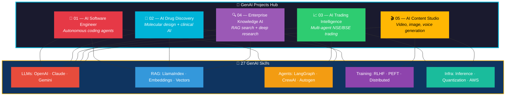
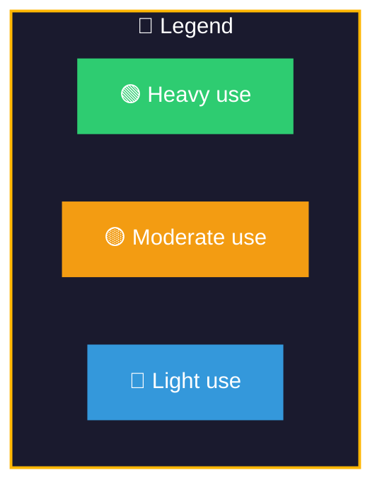
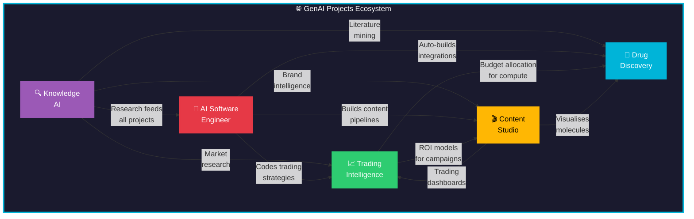

# 🚀 GenAI Real-World Projects

> **5 projects that are ruling and breaking things in the world right now — built with every GenAI skill in this repository**

---

## 📋 Project Overview

---

## 🗂️ The Projects

### [01 — AI Software Engineer](./01-AI-Software-Engineer/PLAN.md) 🤖
> Inspired by **Devin, OpenHands, Cursor, GitHub Copilot**

Build an autonomous AI coding agent that can understand requirements, plan implementation, write code, run tests, fix bugs, and create PRs — replacing weeks of work with hours.

| Key Stat | Value |
|----------|-------|
| Real-world proof | Nubank: 6M LOC migration, 8-12x faster, 20x cost savings |
| Architecture | Multi-agent: Planner → Coder → Reviewer → Executor |
| Core skills | LangGraph, RAG, CrewAI, ClaudeAPI, Guardrails |

---

### [02 — AI Drug Discovery](./02-AI-Drug-Discovery/PLAN.md) 💊
> Inspired by **AlphaFold 3, Isomorphic Labs, Insilico Medicine, Recursion**

AI pipeline that identifies drug targets from literature, predicts protein structures, generates novel molecules, screens candidates computationally, and provides clinical trial intelligence.

| Key Stat | Value |
|----------|-------|
| Real-world proof | Insilico: drug to Phase II in 30 months (vs 12 years traditional) |
| Architecture | Target ID → Structure → Generation → Screening → Clinical |
| Core skills | Keras, DistributedTraining, RLHF, NLP, HuggingFace |

---

### [03 — AI Trading Intelligence](./03-AI-Trading-Intelligence/PLAN.md) 📈
> Inspired by **Renaissance Technologies, Two Sigma, Citadel, sjarvis**

Autonomous multi-agent trading system for NSE/BSE with 29+ strategy runners, LLM-powered analysis, real-time risk management, and SEBI compliance — modeled directly after the sjarvis codebase.

| Key Stat | Value |
|----------|-------|
| Real-world proof | sjarvis: 374 symbols, 4,216 tests, 29 strategies, paper trading live |
| Architecture | Data → Intelligence → Governance → Execution → Output |
| Core skills | LangGraph, AgenticAI, GeminiAPI, Embeddings, RLHF |

---

### [04 — Enterprise Knowledge AI](./04-Enterprise-Knowledge-AI/PLAN.md) 🔍
> Inspired by **Perplexity, Glean, Google NotebookLM, OpenAI Deep Research**

Enterprise-grade knowledge system with multi-source RAG, autonomous deep research agents, and verified report generation with citations — replacing analysts with AI researchers.

| Key Stat | Value |
|----------|-------|
| Real-world proof | Perplexity: 100M+ monthly users, $9B valuation. Glean: 1000+ enterprises |
| Architecture | Sources → Ingestion → Knowledge → AI → Output |
| Core skills | RAG, AdvancedRAG, LlamaIndex, Vector-Databases, LangGraph |

---

### [05 — AI Content Studio](./05-AI-Content-Studio/PLAN.md) 🎬
> Inspired by **Sora, Runway Gen-3, Midjourney V6, ElevenLabs, Adobe Firefly**

Multi-modal content factory that generates images, videos, voiceovers, and music from text — producing 1,000+ branded assets per day at $0.50/asset instead of $50-500.

| Key Stat | Value |
|----------|-------|
| Real-world proof | Midjourney: 16M+ users, $200M+ revenue. Adobe Firefly: 6.5B+ images |
| Architecture | Brief → Creative Director → Generators → QA → Composition |
| Core skills | HuggingFace, PEFT, DistributedTraining, RLHF, NLP |

---

## 🧬 Skills Matrix — Which Skills Power Which Project

| GenAI Skill | 🤖 AI CodeAgent | 💊 Drug Discovery | 📈 Trading | 🔍 Knowledge AI | 🎬 Content Studio |
|-------------|:-:|:-:|:-:|:-:|:-:|
| **OpenAI-GPT** | 🟢 | 🟡 | 🟡 | 🟢 | 🟢 |
| **ClaudeAPI** | 🟢 | 🟡 | 🟢 | 🟢 | 🟢 |
| **GeminiAPI** | 🟡 | 🔵 | 🟢 | 🟡 | 🟢 |
| **HuggingFace** | 🟡 | 🟢 | 🟡 | 🟡 | 🟢 |
| **Keras** | 🔵 | 🟢 | 🟡 | 🔵 | 🟢 |
| **NLP** | 🟡 | 🟢 | 🟡 | 🟢 | 🟢 |
| **RAG** | 🟢 | 🟡 | 🟡 | 🟢 | 🟡 |
| **AdvancedRAG** | 🟢 | 🟡 | 🟡 | 🟢 | 🟡 |
| **LlamaIndex** | 🟢 | 🟡 | 🔵 | 🟢 | 🟡 |
| **LangChain** | 🟢 | 🟡 | 🟢 | 🟢 | 🟡 |
| **LangGraph** | 🟢 | 🟢 | 🟢 | 🟢 | 🟢 |
| **Embeddings** | 🟢 | 🟢 | 🟢 | 🟢 | 🟢 |
| **Vector-Databases** | 🟢 | 🟢 | 🟡 | 🟢 | 🟡 |
| **AgenticAI** | 🟢 | 🟢 | 🟢 | 🟢 | 🟢 |
| **CrewAI** | 🟢 | 🟢 | 🟡 | 🟢 | 🟢 |
| **Autogen** | 🟢 | 🟡 | 🟡 | 🟢 | 🟡 |
| **Guardrails** | 🟢 | 🟡 | 🟢 | 🟢 | 🟢 |
| **PromptEngineering** | 🟢 | 🟢 | 🟢 | 🟢 | 🟢 |
| **RLHF** | 🟡 | 🟢 | 🟢 | 🟡 | 🟢 |
| **PEFT-FineTuning** | 🟡 | 🟢 | 🟡 | 🟡 | 🟢 |
| **TransferLearning** | 🟡 | 🟢 | 🟡 | 🟡 | 🟢 |
| **FewShotZeroShot** | 🟢 | 🟡 | 🟡 | 🟢 | 🟢 |
| **ModelQuantization** | 🟡 | 🟢 | 🟡 | 🟡 | 🟢 |
| **InferenceEngines** | 🟡 | 🟢 | 🟢 | 🟡 | 🟢 |
| **DistributedTraining** | 🔵 | 🟢 | 🟡 | 🔵 | 🟢 |
| **AWS-AI-ML** | 🟡 | 🟢 | 🟡 | 🟡 | 🟢 |

**Coverage: 27/27 skills used across all 5 projects — zero gaps.**

---

## 🗺️ Project Interconnections

---

## 🚧 Status

| Project | Architecture | Implementation | Tests |
|---------|:-:|:-:|:-:|
| 01 — AI Software Engineer | ✅ PLAN.md | 🔜 Pending | 🔜 Pending |
| 02 — AI Drug Discovery | ✅ PLAN.md | 🔜 Pending | 🔜 Pending |
| 03 — AI Trading Intelligence | ✅ PLAN.md | 🔜 Pending | 🔜 Pending |
| 04 — Enterprise Knowledge AI | ✅ PLAN.md | 🔜 Pending | 🔜 Pending |
| 05 — AI Content Studio | ✅ PLAN.md | 🔜 Pending | 🔜 Pending |

> **Next:** Pick a project and start implementation. Each project will get `src/`, `tests/`, `config/`, and component-specific modules.
