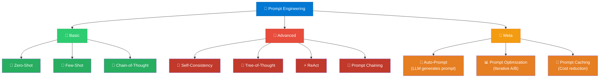
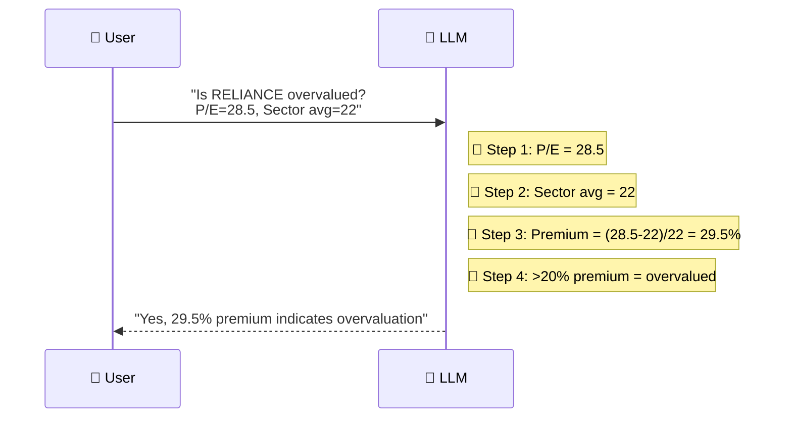
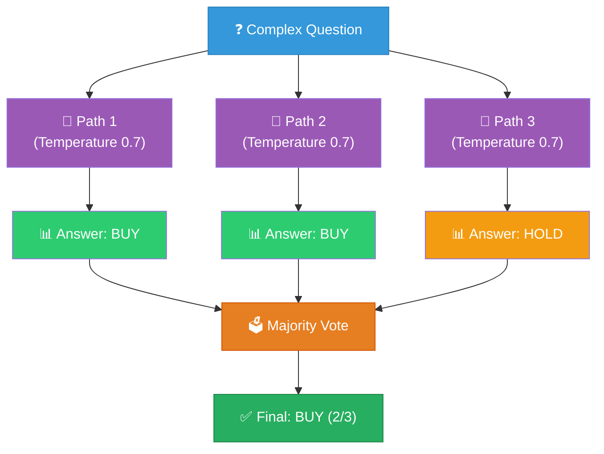
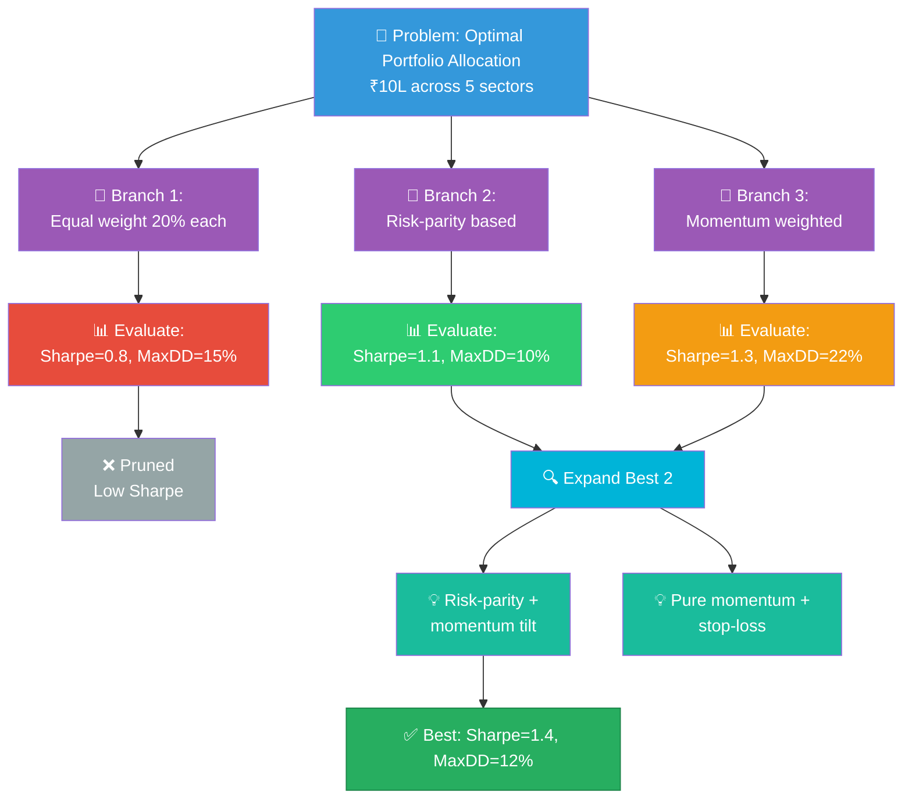
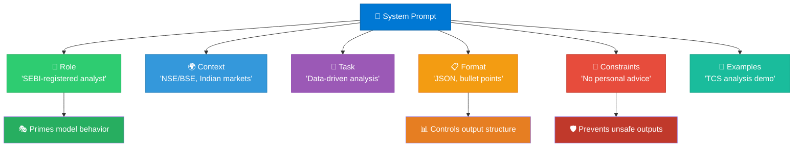
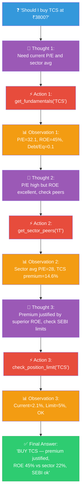
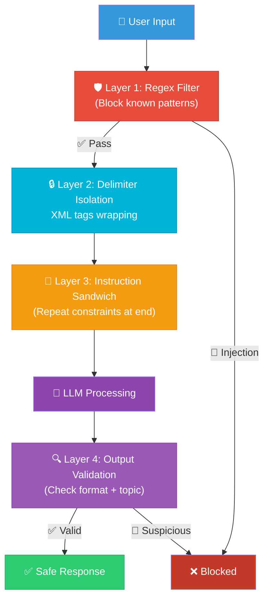
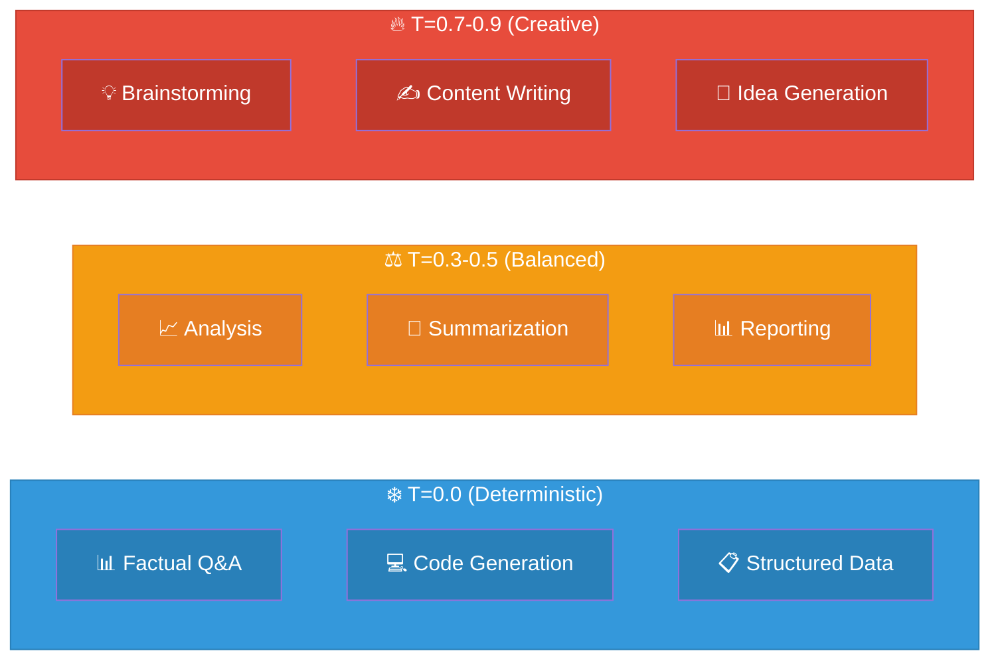
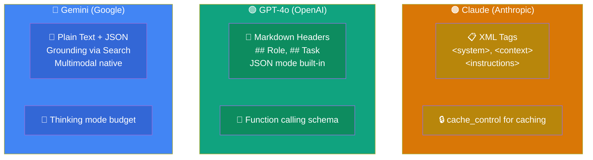
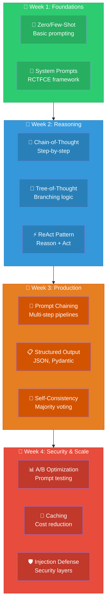

# Prompt Engineering: Visual Guide & Architecture Diagrams

## 1. Prompting Techniques Landscape

## 2. Chain-of-Thought Flow

## 3. Self-Consistency Pattern

## 4. Tree-of-Thought (ToT) Reasoning

## 5. Prompt Chaining Pipeline

## 6. System Prompt Structure (RCTFCE)

## 7. ReAct (Reasoning + Acting) Pattern

## 8. Prompt Injection Defense

## 9. Temperature & Sampling Guide

## 10. Model-Specific Prompt Formats

## 11. Learning Path

