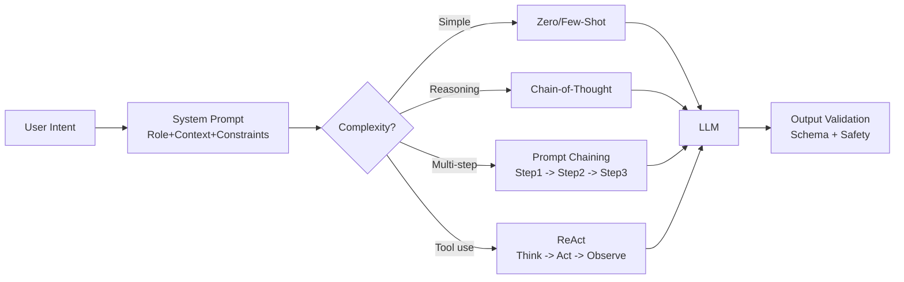

# Prompt Engineering — Cheatsheet

## Architecture (30-second mental model)

## When to use vs alternatives
| Need | Use | Not |
|------|-----|-----|
| Control output format/quality without training | Prompt engineering | Fine-tuning |
| Model needs to learn entirely new domain vocabulary | Fine-tuning | Prompt engineering alone |
| Deterministic, reproducible outputs | Structured output + T=0 + Pydantic schema | Free-form prompts |
| Multi-step reasoning with external data | ReAct / prompt chaining | Single zero-shot prompt |
| Reduce cost on high-volume simple tasks | Model routing (small model for easy, large for hard) | One-size-fits-all model |

## 5 things you always forget
1. Prompt structure order matters -- Role and Context go first (primes the model), Constraints go last (recency bias makes them stick better). Mnemonic: Role, Context, Task, Format, Constraints, Examples.
2. "Think step by step" (Chain-of-Thought) improves accuracy 30-50% on math/logic tasks -- but adds tokens; skip it for simple classification where it just wastes money.
3. Claude prefers XML tags for structure (`<context>`, `<instructions>`), GPT-4o prefers markdown headers (`## Role`, `## Task`) -- matching format to model family measurably improves output.
4. Prompt injection defense needs layers: delimiter isolation (XML tags around user input), regex filtering, AND output validation -- any single layer alone is bypassable.
5. Anthropic prompt caching gives 90% cost reduction on repeated system prompts -- add `cache_control: {"type": "ephemeral"}` to your system message and stop paying full price on every call.

## Interview killer answer
> "We built a prompt chaining pipeline where extraction used Haiku for cost, analysis used Sonnet for reasoning, and final recommendations used Opus for nuance -- this model routing cut our API cost by 65% versus running everything through one model. The other big win was versioning prompts like code with regression tests: when we changed our analysis prompt, we caught a 15% accuracy drop on edge cases in CI before it hit production."
