# RAG - Visual Architecture & Patterns Guide

## 1. Complete RAG Pipeline Flow

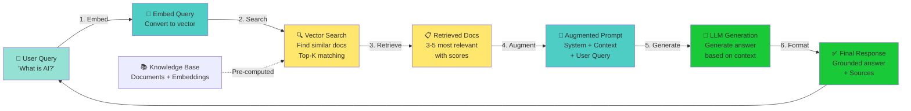

---

## 2. RAG Architecture Components

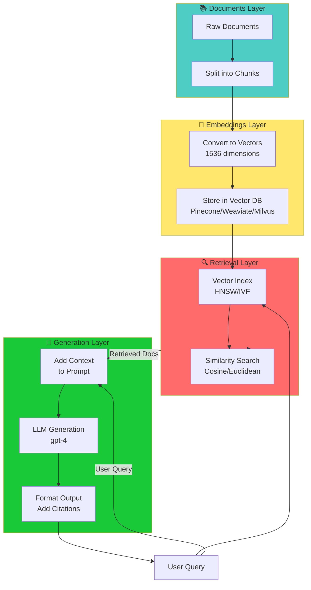

---

## 3. Chunking Strategy Comparison

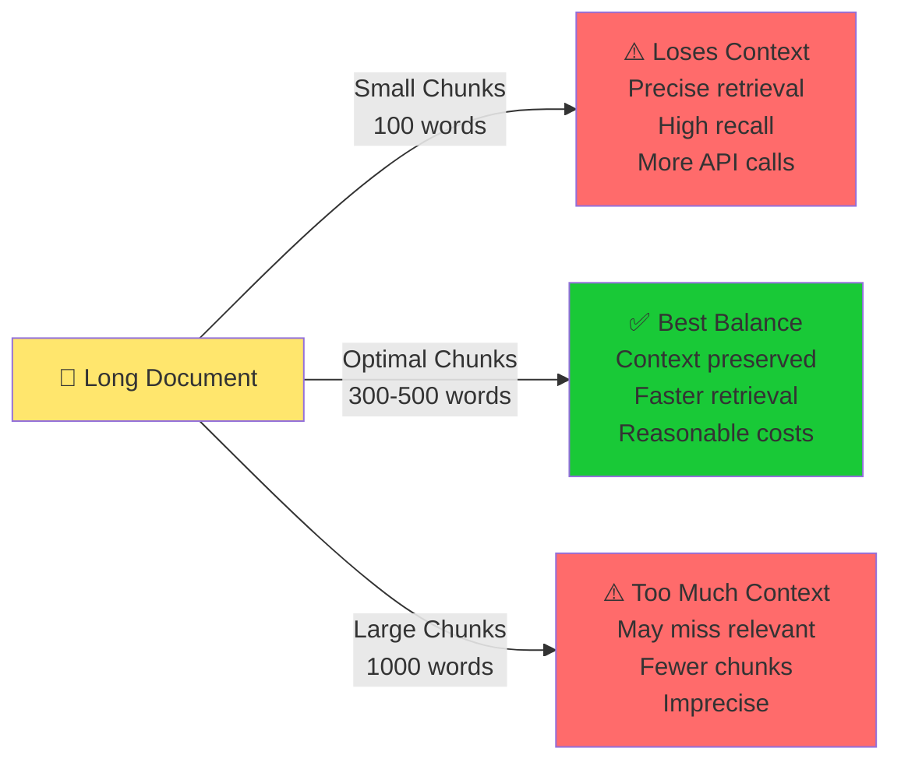

---

## 4. Retrieval Quality Trade-off

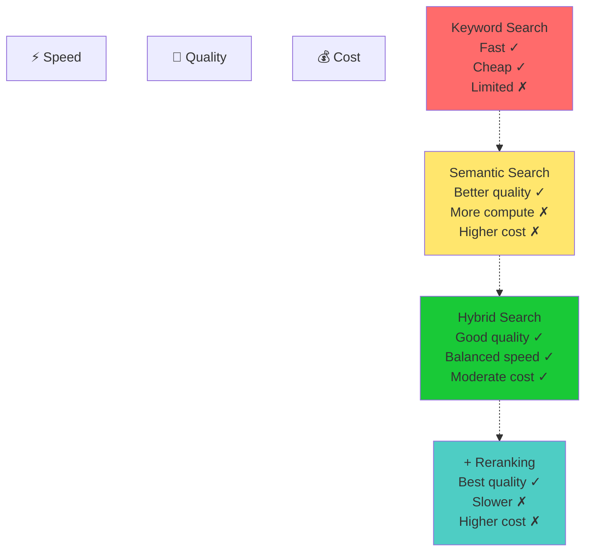

---

## 5. Embedding & Similarity Computation

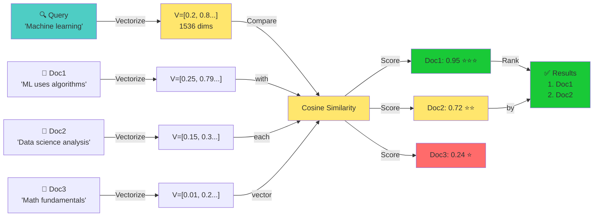

---

## 6. Multi-Document RAG

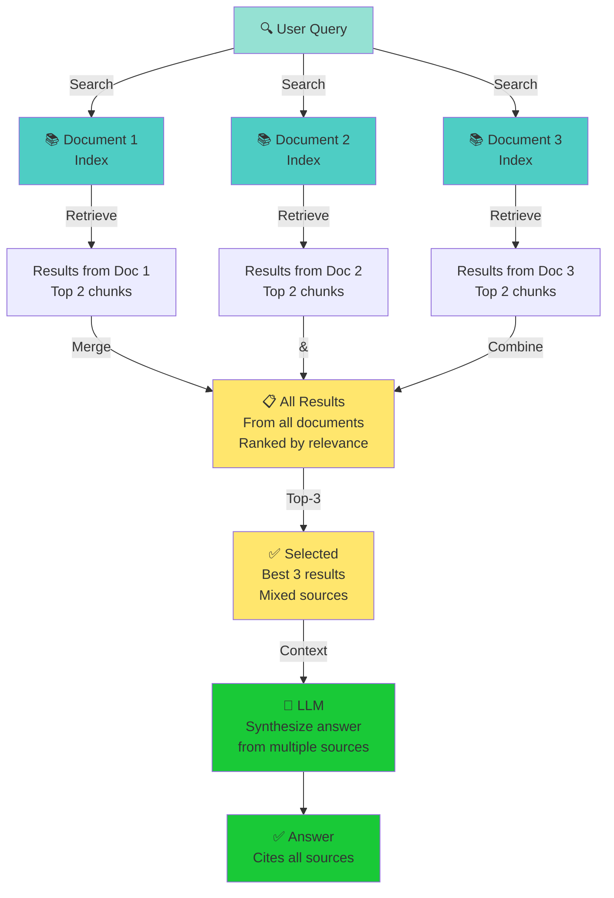

---

## 7. RAG vs Fine-tuning Comparison

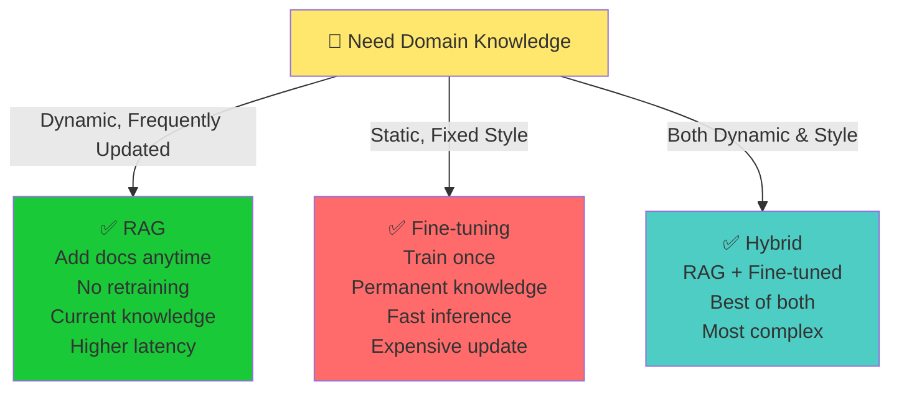

---

## 8. Reranking Strategy

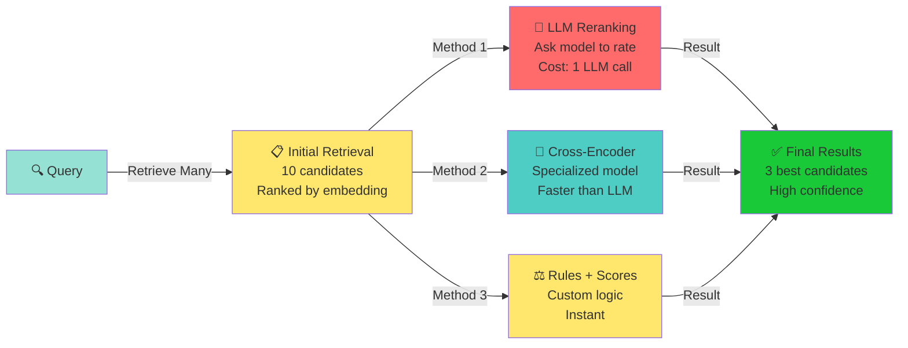

---

## 9. Vector Database Index Types

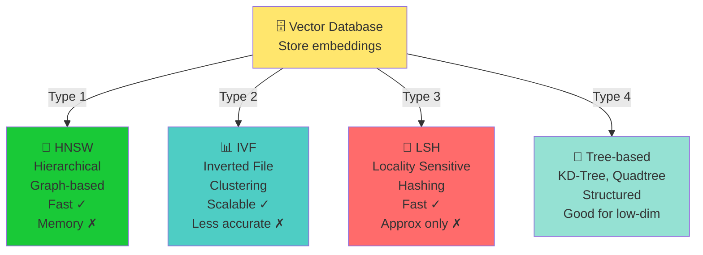

---

## 10. Token Count Impact

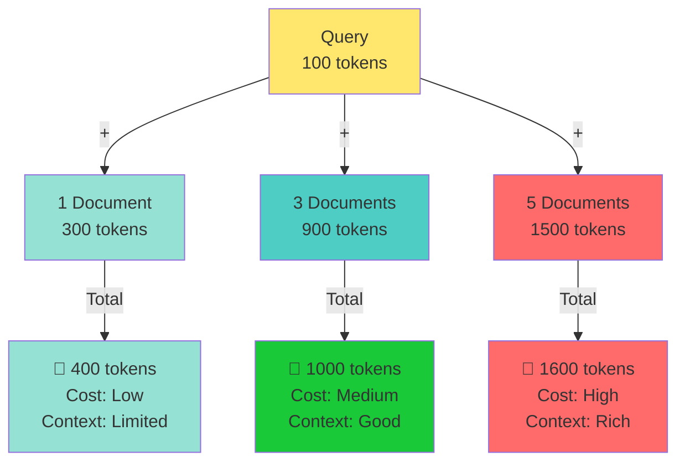

---

## 11. RAG Error Sources

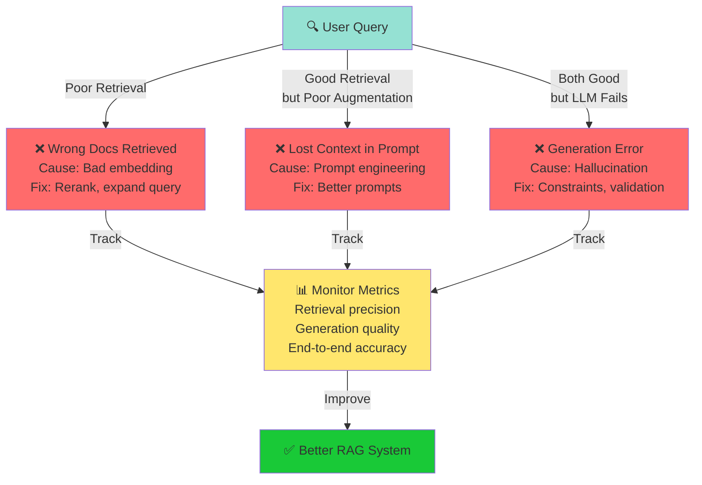

---

## 12. RAG Learning Path

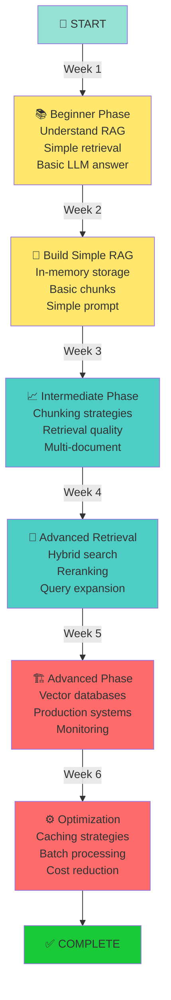

---

## 13. Chunking Impact on Retrieval

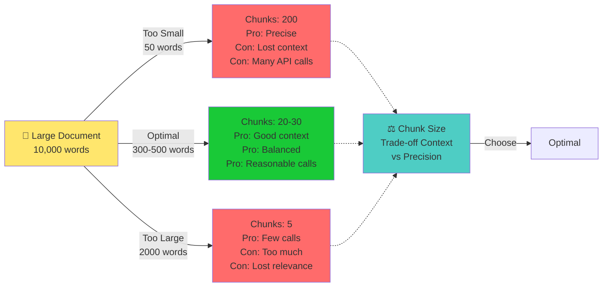

---

## 14. Cost vs Latency

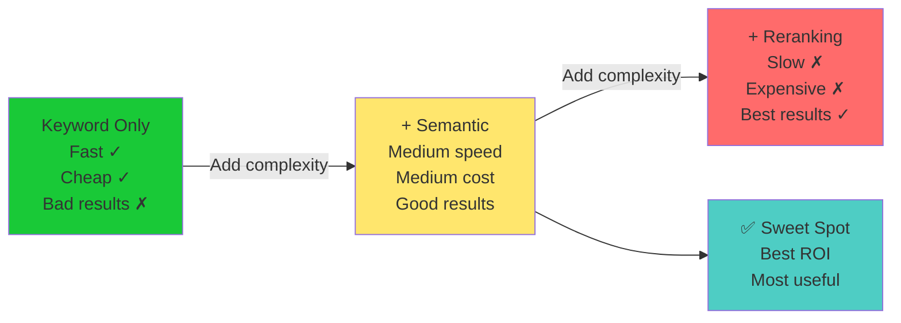

---

## 15. RAG Scaling Architecture

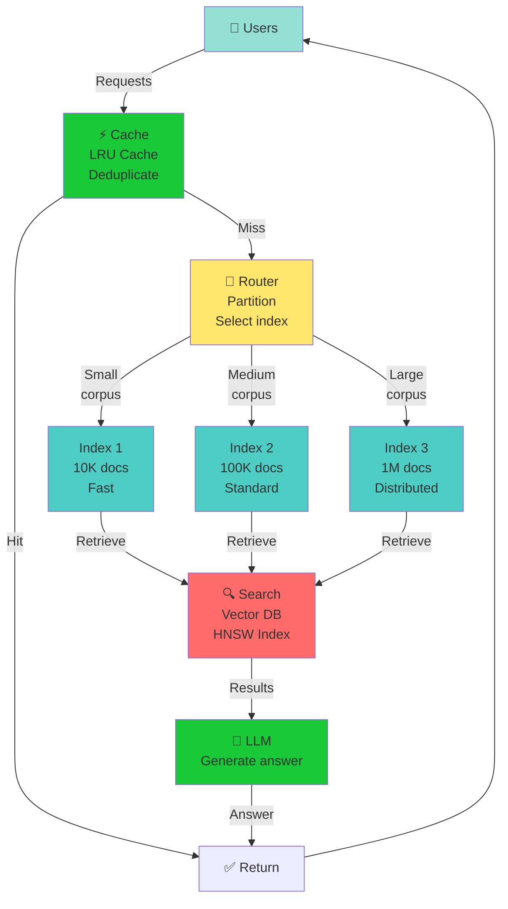

---

## Key Insights from Visuals

1. **Pipeline:** Query → Embed → Search → Retrieve → Augment → Generate → Response
2. **Quality:** Chunking, retrieval method, reranking all critical
3. **Trade-offs:** Speed, cost, quality form a triangle
4. **Scaling:** Vector DBs, partitioning, caching essential
5. **Monitoring:** Track retrieval quality and generation quality separately
6. **Learning:** Incremental improvement from simple to advanced

