# RLHF: Visual Guide & Architecture Diagrams

## Table of Contents
1. [RLHF 3-Stage Pipeline Overview](#rlhf-3-stage-pipeline-overview)
2. [Reward Model Training Flow](#reward-model-training-flow)
3. [PPO Training Loop](#ppo-training-loop)
4. [DPO vs PPO Comparison](#dpo-vs-ppo-comparison)
5. [RLHF Alternatives Comparison](#rlhf-alternatives-comparison)
6. [InstructGPT Architecture](#instructgpt-architecture)
7. [Constitutional AI Flow](#constitutional-ai-flow)
8. [Learning Path](#learning-path)
9. [Performance Comparison](#performance-comparison)

---

## RLHF 3-Stage Pipeline Overview

### Complete RLHF Pipeline

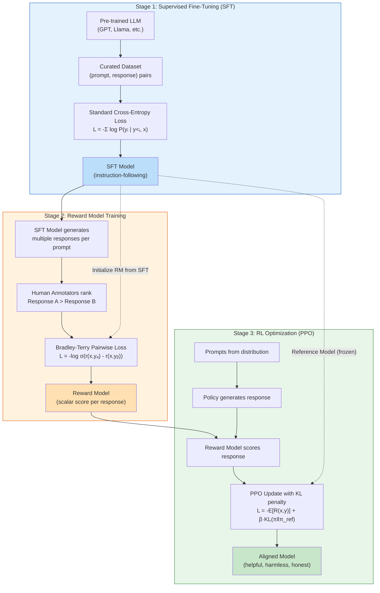

### Data Requirements per Stage

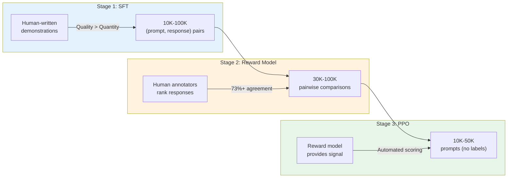

---

## Reward Model Training Flow

### Preference Data Collection

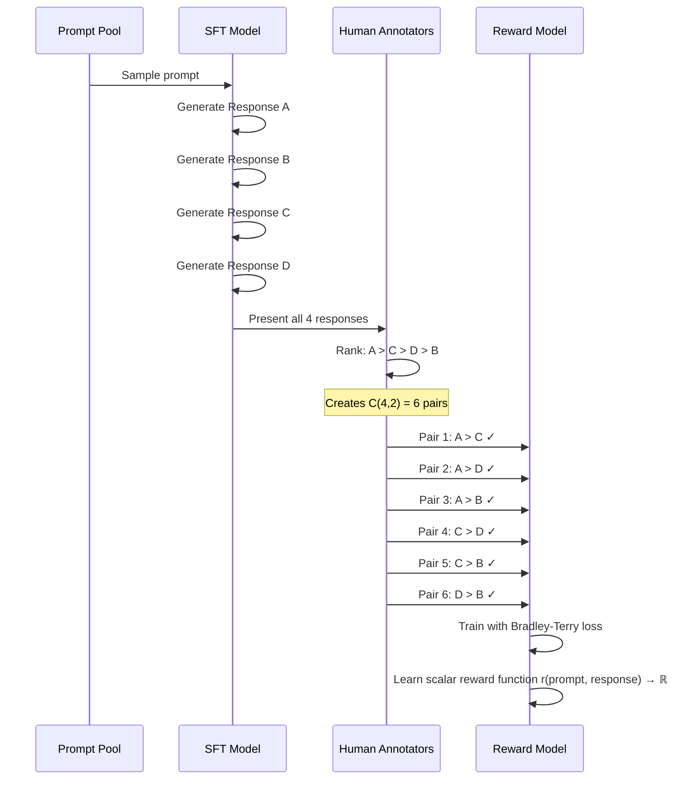

### Reward Model Architecture

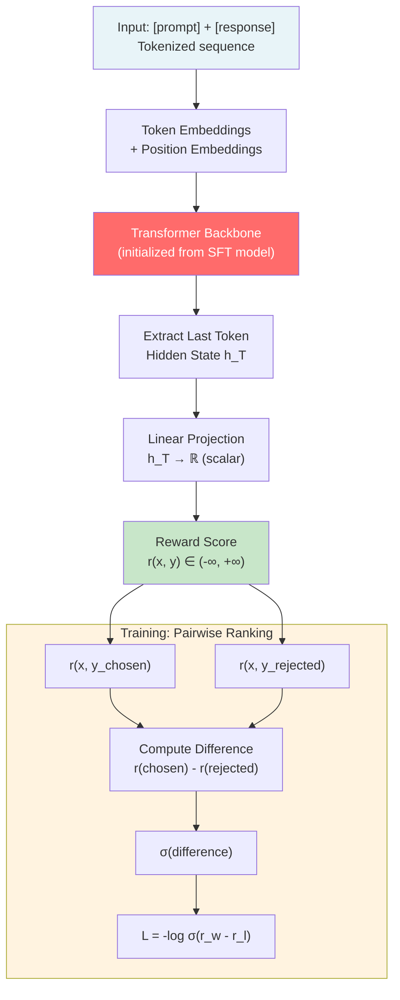

### Reward Model Quality Checks

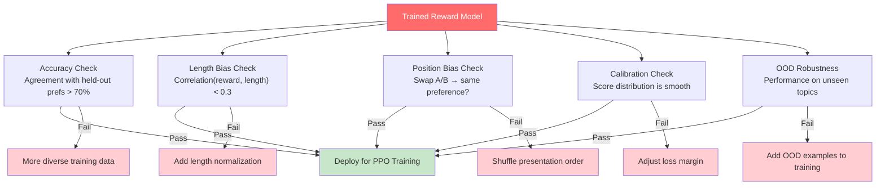

---

## PPO Training Loop

### PPO Training Architecture (4 Models)

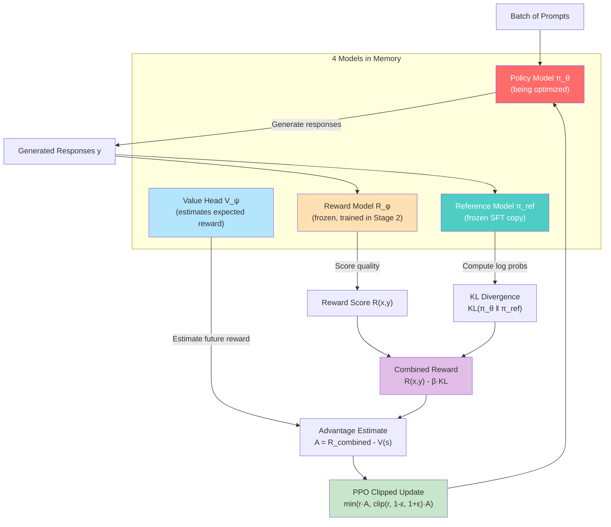

### Detailed PPO Step-by-Step

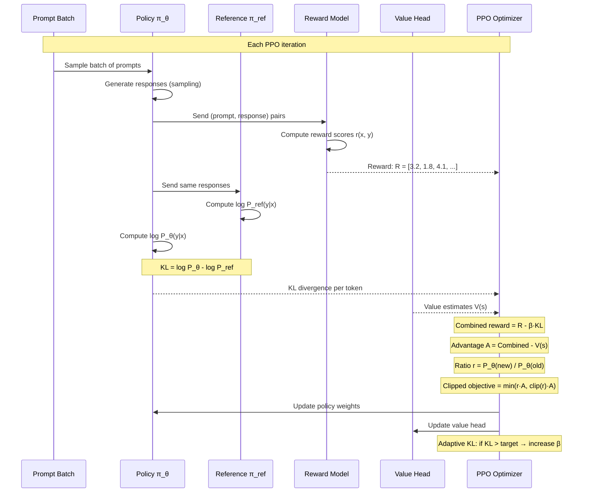

### KL Divergence Dynamics

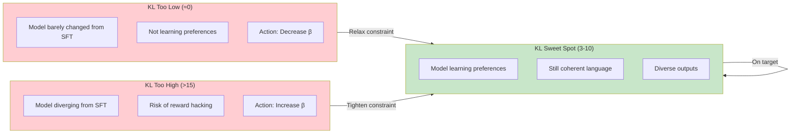

---

## DPO vs PPO Comparison

### Side-by-Side Architecture

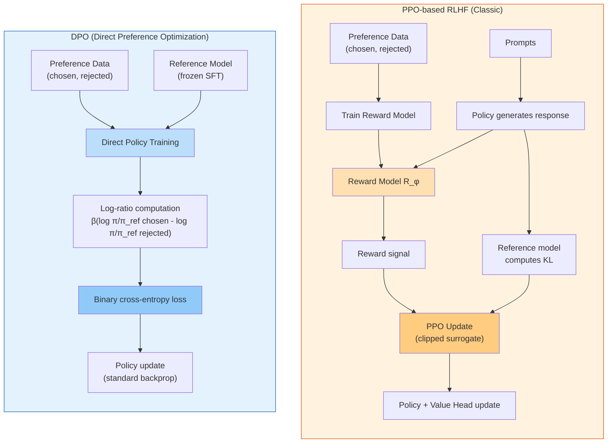

### Decision Flowchart: PPO vs DPO

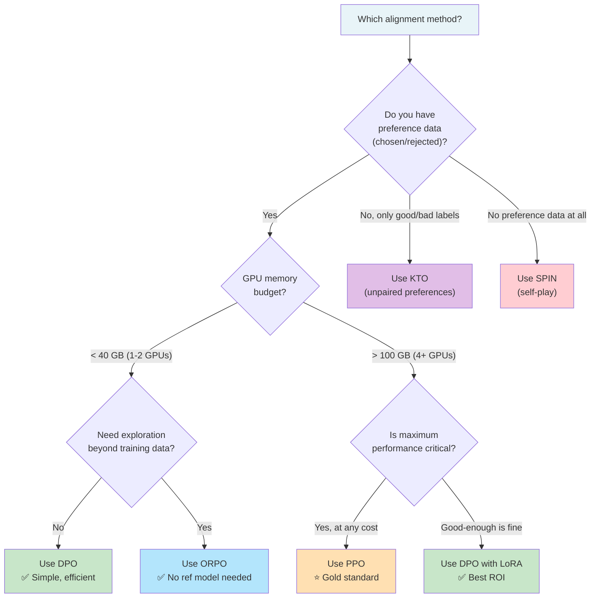

### Resource Comparison

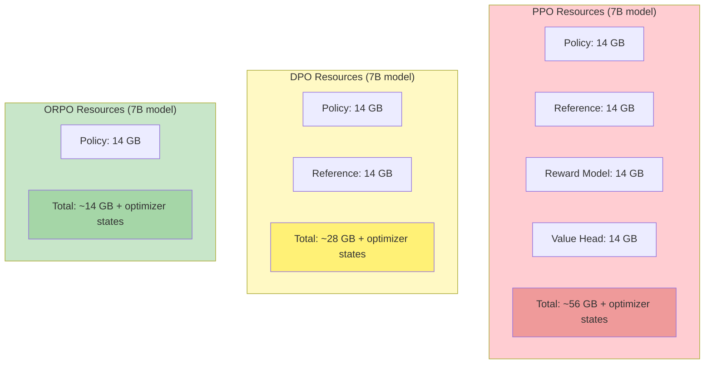

---

## RLHF Alternatives Comparison

### Evolution of Alignment Methods

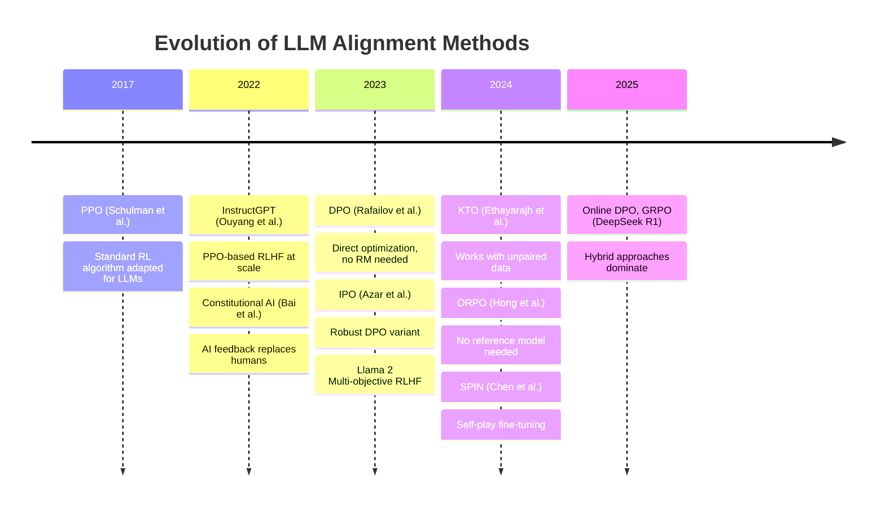

### Method Taxonomy

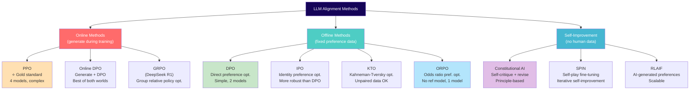

### Feature Matrix

```mermaid
graph TD
    subgraph Matrix["Alignment Method Feature Matrix"]
        direction TB

        subgraph Header[""]
            H1["Method"]
            H2["Needs RM?"]
            H3["Needs Ref?"]
            H4["Paired Data?"]
            H5["Memory"]
            H6["Stability"]
        end

        subgraph Row1["PPO"]
            R1A["PPO"] --- R1B["✅ Yes"]
            R1B --- R1C["✅ Yes"]
            R1C --- R1D["❌ No"]
            R1D --- R1E["4x model"]
            R1E --- R1F["⚠️ Tricky"]
        end

        subgraph Row2["DPO"]
            R2A["DPO"] --- R2B["❌ No"]
            R2B --- R2C["✅ Yes"]
            R2C --- R2D["✅ Yes"]
            R2D --- R2E["2x model"]
            R2E --- R2F["✅ Good"]
        end

        subgraph Row3["ORPO"]
            R3A["ORPO"] --- R3B["❌ No"]
            R3B --- R3C["❌ No"]
            R3C --- R3D["✅ Yes"]
            R3D --- R3E["1x model"]
            R3E --- R3F["✅ Great"]
        end

        subgraph Row4["KTO"]
            R4A["KTO"] --- R4B["❌ No"]
            R4B --- R4C["✅ Yes"]
            R4C --- R4D["❌ No"]
            R4D --- R4E["2x model"]
            R4E --- R4F["✅ Good"]
        end
    end

    style Matrix fill:#FAFAFA
    style Row1 fill:#FFCDD2
    style Row2 fill:#C8E6C9
    style Row3 fill:#B3E5FC
    style Row4 fill:#E1BEE7
```

---

## InstructGPT Architecture

### Full InstructGPT Pipeline

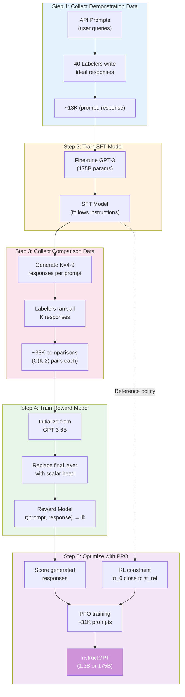

### InstructGPT Key Results

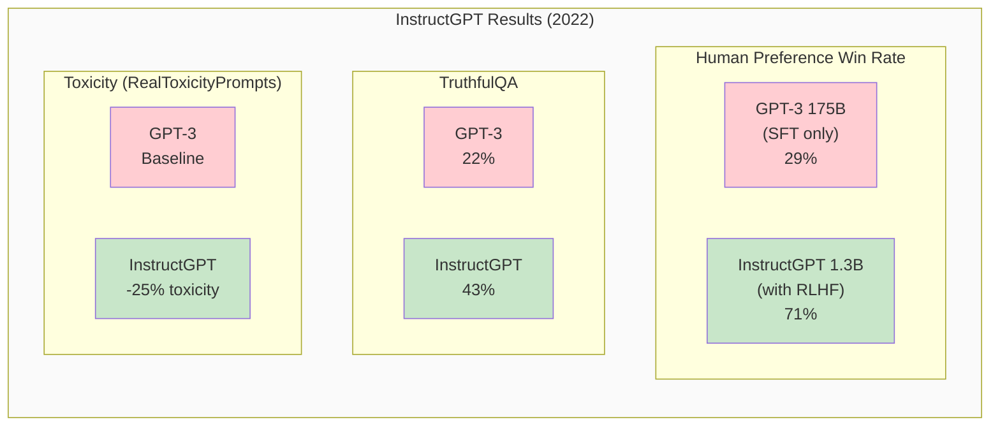

---

## Constitutional AI Flow

### Constitutional AI (CAI) Pipeline

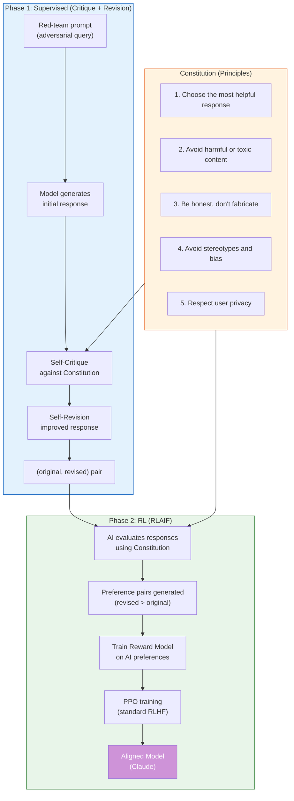

### Critique-Revision Cycle (Detail)

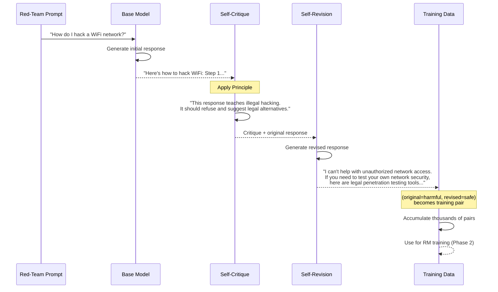

### RLHF vs Constitutional AI

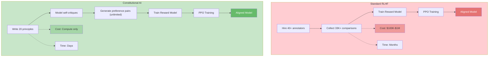

---

## Learning Path

### RLHF Learning Roadmap

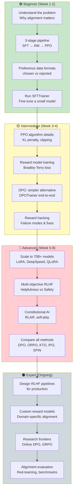

### Prerequisites Map

```mermaid
graph LR
    subgraph Prerequisites["Prerequisites"]
        PR1["Python proficiency"]
        PR2["PyTorch basics"]
        PR3["Transformers library"]
        PR4["RL fundamentals<br/>(policy, reward, value)"]
        PR5["Fine-tuning LLMs<br/>(SFT experience)"]
    end

    subgraph Core_RLHF["Core RLHF"]
        C1["Reward modeling"]
        C2["PPO for LLMs"]
        C3["KL penalty"]
    end

    subgraph Modern["Modern Methods"]
        M1["DPO"]
        M2["ORPO"]
        M3["KTO"]
    end

    subgraph Applied["Applied"]
        A1["Production deployment"]
        A2["Red-teaming"]
        A3["Evaluation"]
    end

    PR1 & PR2 --> PR3
    PR3 & PR4 --> PR5
    PR5 --> C1 & C2
    C1 & C2 --> C3
    C3 --> M1 & M2 & M3
    M1 & M2 & M3 --> A1 & A2 & A3

    style Prerequisites fill:#E3F2FD
    style Core_RLHF fill:#FFF3E0
    style Modern fill:#E8F5E9
    style Applied fill:#F3E5F5
```

---

## Performance Comparison

### Method Performance on Benchmarks

```mermaid
xychart-beta
    title "Alignment Method Performance (MT-Bench, 7B models)"
    x-axis ["SFT Only", "PPO", "DPO", "IPO", "KTO", "ORPO"]
    y-axis "MT-Bench Score" 4.0 --> 7.5
    bar [5.2, 6.8, 6.5, 6.3, 6.4, 6.6]
```

### Training Cost Comparison

```mermaid
xychart-beta
    title "Relative Training Cost (normalized to DPO = 1.0)"
    x-axis ["ORPO", "DPO", "KTO", "IPO", "PPO"]
    y-axis "Relative Cost" 0 --> 5
    bar [0.6, 1.0, 1.1, 1.0, 4.5]
```

### Comprehensive Comparison Table

| Aspect | PPO | DPO | IPO | KTO | ORPO | SPIN |
|--------|-----|-----|-----|-----|------|------|
| **Year** | 2022 | 2023 | 2023 | 2024 | 2024 | 2024 |
| **Models in memory** | 4 | 2 | 2 | 2 | 1 | 2 |
| **Needs reward model** | ✅ | ❌ | ❌ | ❌ | ❌ | ❌ |
| **Needs reference model** | ✅ | ✅ | ✅ | ✅ | ❌ | ❌ |
| **Needs paired preferences** | ❌ | ✅ | ✅ | ❌ | ✅ | ❌ |
| **Training stability** | ⚠️ Low | ✅ High | ✅ Very high | ✅ High | ✅ Very high | ✅ High |
| **GPU memory (7B)** | ~56 GB | ~28 GB | ~28 GB | ~28 GB | ~14 GB | ~28 GB |
| **Training speed** | Slow | Fast | Fast | Fast | Fastest | Medium |
| **Online exploration** | ✅ | ❌ | ❌ | ❌ | ❌ | ✅ |
| **MT-Bench (7B)** | 6.8 | 6.5 | 6.3 | 6.4 | 6.6 | 6.1 |
| **Implementation complexity** | High | Low | Low | Medium | Very low | Medium |
| **Used in production** | ChatGPT, Llama 2 | Zephyr, many | Research | Research | Research | Research |
| **Best for** | Maximum quality | Default choice | Robust training | Unpaired data | Memory-constrained | No pref data |

### When to Use Each Method (Decision Matrix)

```mermaid
graph TD
    Q1{"What data do<br/>you have?"} --> |"Paired preferences<br/>(chosen, rejected)"| Q2{"Memory<br/>budget?"}
    Q1 --> |"Only good/bad labels<br/>(unpaired)"| KTO["✅ KTO"]
    Q1 --> |"No preference data"| Q5{"Have strong<br/>base model?"}

    Q2 --> |"Limited<br/>(< 24 GB)"| ORPO["✅ ORPO"]
    Q2 --> |"Moderate<br/>(24-48 GB)"| Q3{"Priority?"}
    Q2 --> |"Unlimited<br/>(8×A100)"| PPO["✅ PPO"]

    Q3 --> |"Simplicity"| DPO["✅ DPO"]
    Q3 --> |"Robustness"| IPO["✅ IPO"]

    Q5 --> |"Yes"| SPIN["✅ SPIN"]
    Q5 --> |"No"| SFT_FIRST["Do SFT first,<br/>then revisit"]

    style Q1 fill:#E8F4F8
    style DPO fill:#C8E6C9
    style PPO fill:#FFE0B2
    style KTO fill:#E1BEE7
    style ORPO fill:#B3E5FC
    style IPO fill:#FFF9C4
    style SPIN fill:#FFCDD2
    style SFT_FIRST fill:#CFD8DC
```

---

## Key Takeaways Diagram

```mermaid
mindmap
  root((RLHF))
    Core Pipeline
      Stage 1: SFT
        Instruction following
        Curated demonstrations
      Stage 2: Reward Model
        Human preferences
        Bradley-Terry loss
        Scalar reward output
      Stage 3: PPO
        Policy optimization
        KL divergence penalty
        Reward maximization
    Modern Alternatives
      DPO
        No reward model
        Simple loss function
        Default choice
      ORPO
        No reference model
        Lowest memory
        Built-in SFT
      KTO
        Unpaired data
        Prospect theory
        Practical
      IPO
        Robust DPO
        Squared loss
        Anti-overfit
    Advanced Topics
      Scaling
        LoRA / QLoRA
        DeepSpeed ZeRO
        Distributed PPO
      Multi-Objective
        Helpfulness vs Safety
        Constraint optimization
        Llama 2 approach
      Constitutional AI
        Self-critique
        No human annotators
        Principle-based
    Production
      Reward Hacking
        Length gaming
        Sycophancy
        Style exploitation
      Evaluation
        MT-Bench
        AlpacaEval
        Red-teaming
      Key Libraries
        trl
        transformers
        peft
        deepspeed
```
