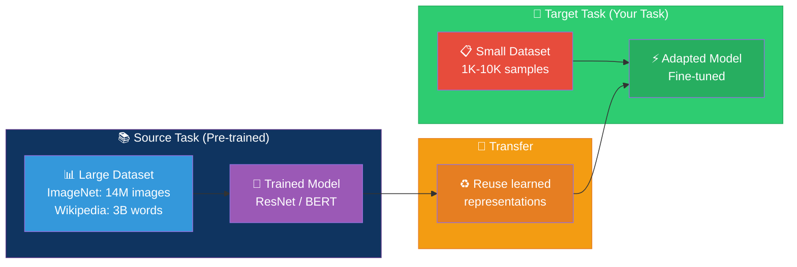
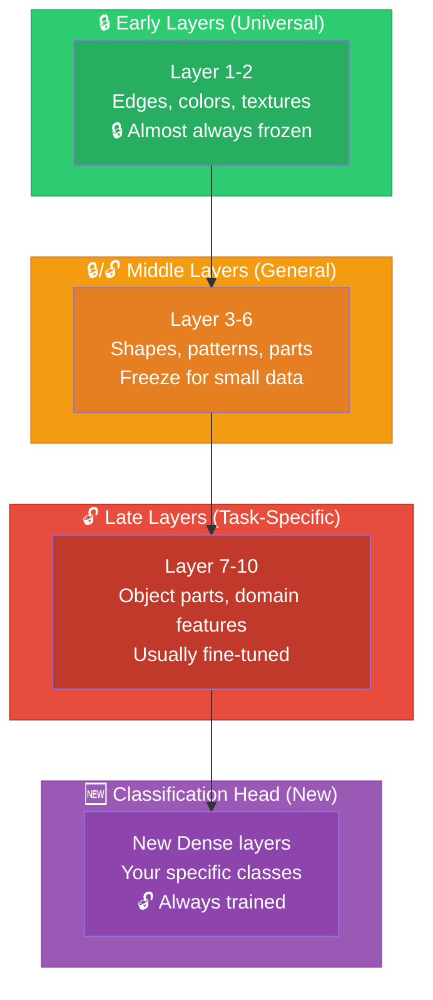
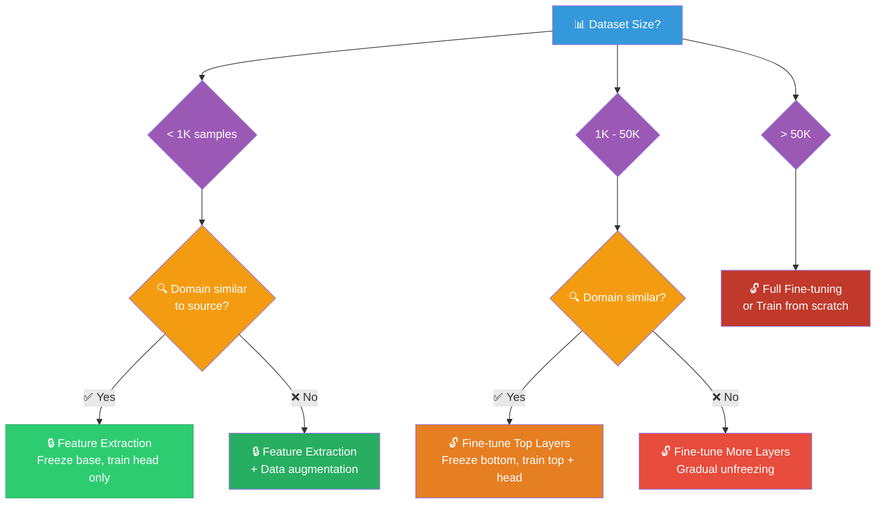
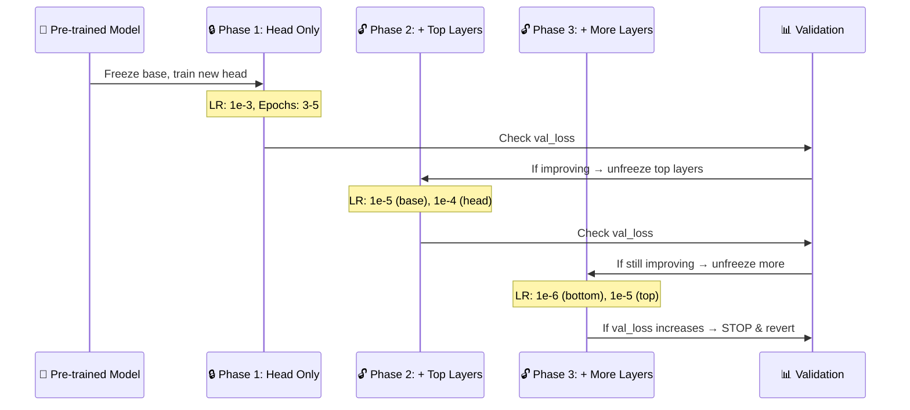
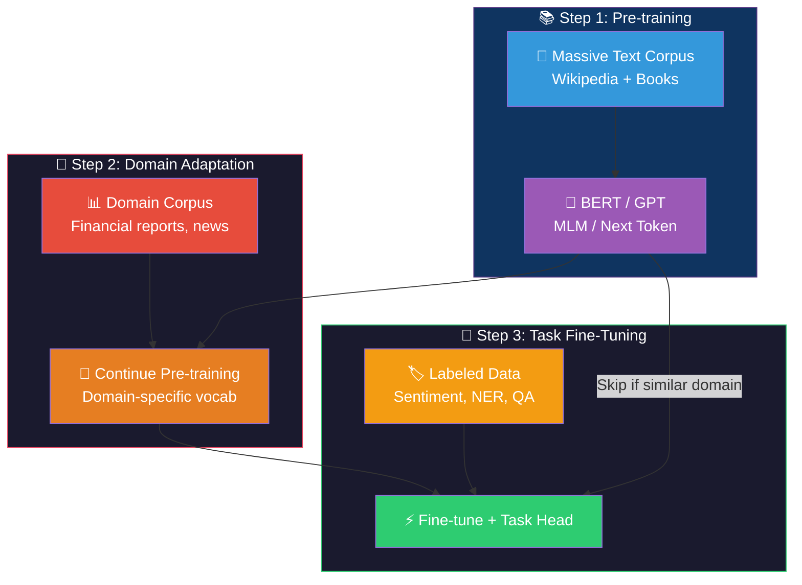
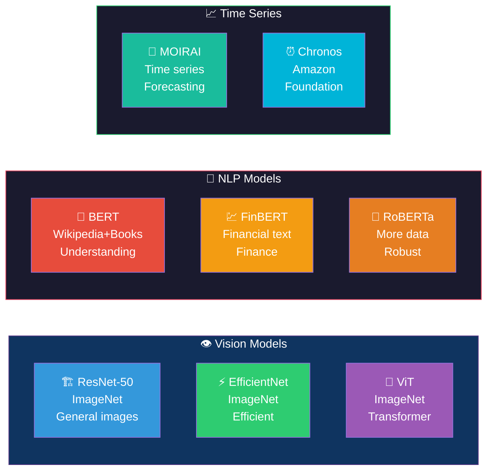
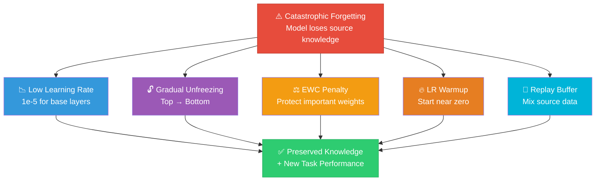
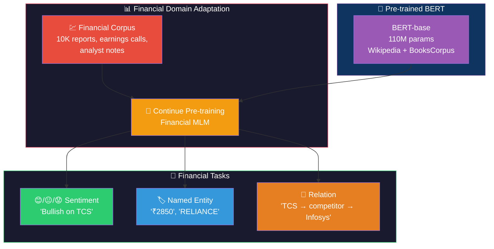
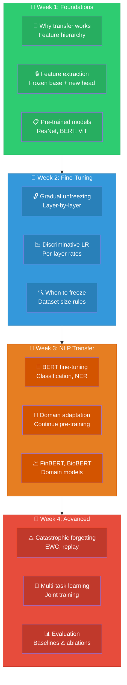

# Transfer Learning: Visual Guide & Architecture Diagrams

## 1. Transfer Learning Overview

## 2. What Layers Learn (CNN Example)

## 3. Strategy Decision Flow

## 4. Fine-Tuning Process

## 5. NLP Transfer Learning Stack

## 6. Common Pre-trained Models

## 7. Catastrophic Forgetting Prevention

## 8. Financial FinBERT Transfer Pipeline

## 9. Learning Path

