# Vector Databases - Visual Architecture & Patterns

Below are Mermaid diagrams covering core vector-database architectures, index internals, query flows, scaling patterns, and trade-offs.

---

## 1. High-level Ingest & Query Flow

```mermaid
flowchart LR
    User["User / Client"] -->|1. Upload / Query| API["API Layer\n(ingest & query)"]
    API -->|2. Embed| Embed["Embedding Service\n(OpenAI / SBERT)"]
    Embed -->|3. Upsert| Ingest["Ingest Pipeline\n(chunking, metadata)"]
    Ingest -->|4. Store| VectorDB["Vector Database\n(index + metadata store)"]
  
    User -->|5. Query| API
    API -->|6. Embed Query| Embed
    Embed -->|7. Search| VectorDB
    VectorDB -->|8. Results (IDs+scores)| API
    API -->|9. Fetch + Augment| PrimaryDB["Primary DB / CDN\n(store full records)"]
    API -->|10. Return| User
```

---

## 2. Index Type Comparison (Decision Tree)

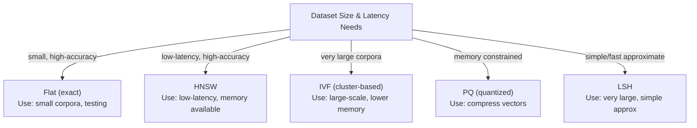

---

## 3. HNSW Internal Layers

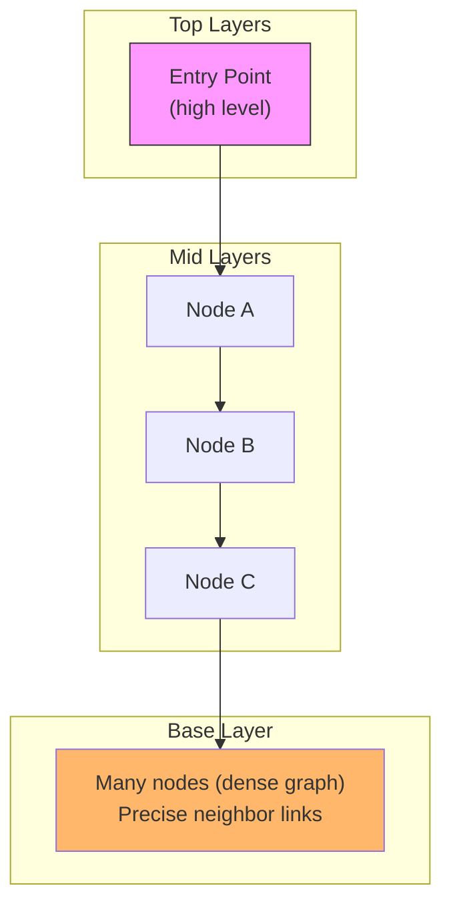

---

## 4. IVF Clustering + Search Flow

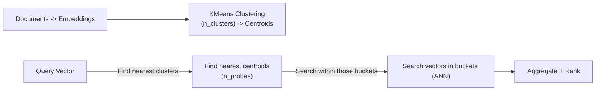

---

## 5. PQ Compression Overview

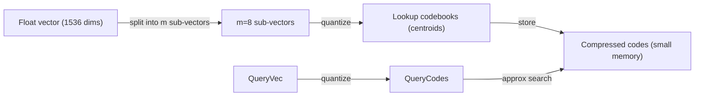

---

## 6. Hybrid Search (Keyword + Semantic)

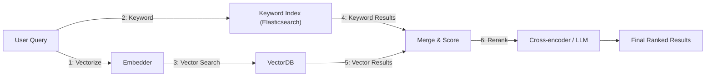

---

## 7. Multi-Shard Query Architecture

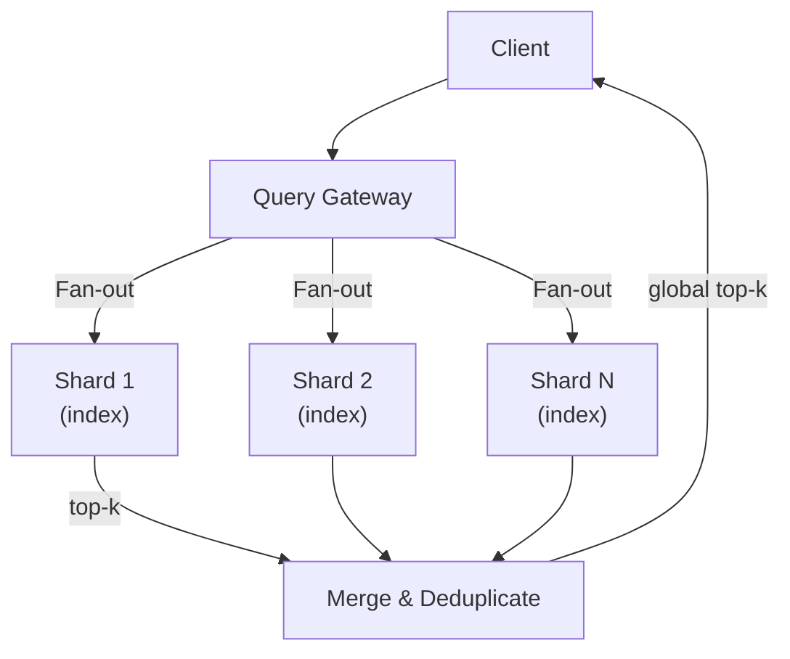

---

## 8. Ingest Pipeline (Chunking & Embedding)

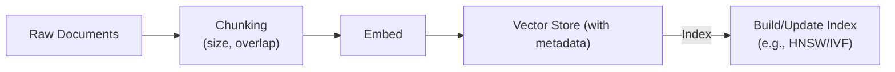

---

## 9. Metadata Filtering Flow

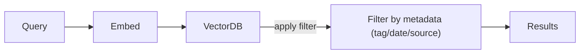

---

## 10. Caching Layer (Semantic Cache)

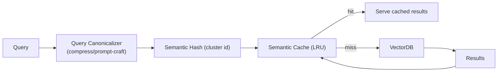

---

## 11. Latency vs Accuracy Tradeoff

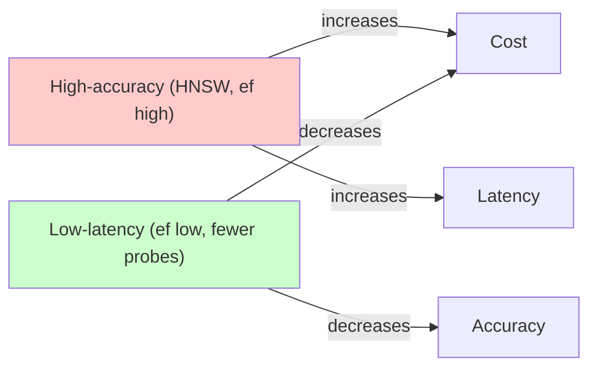

---

## 12. Monitoring & Evaluation Pipeline

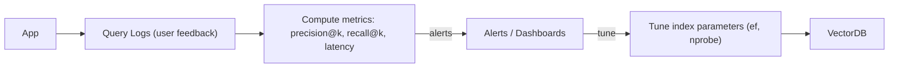

---

## 13. Multi-tenant Isolation

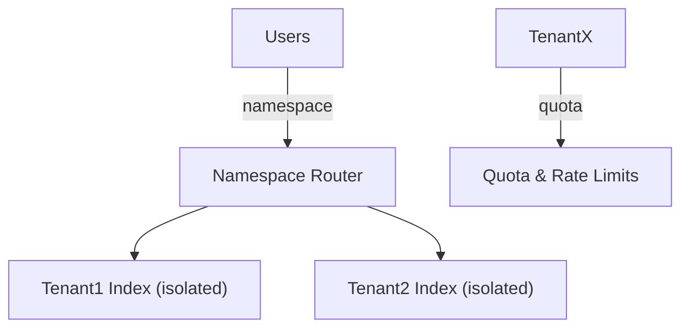

---

## 14. Backup & Recovery

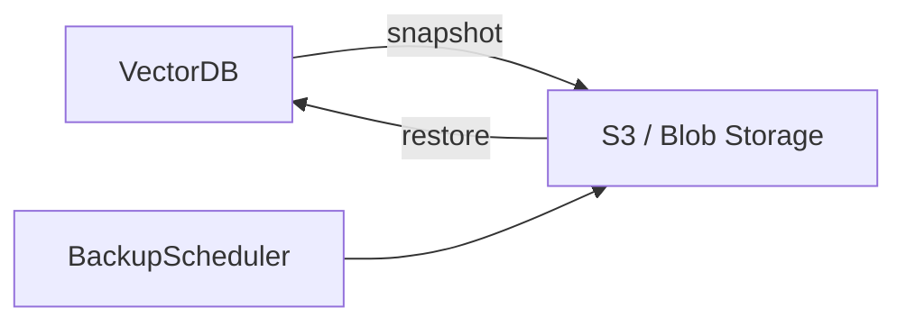

---

## 15. Multi-modal Retrieval Flow

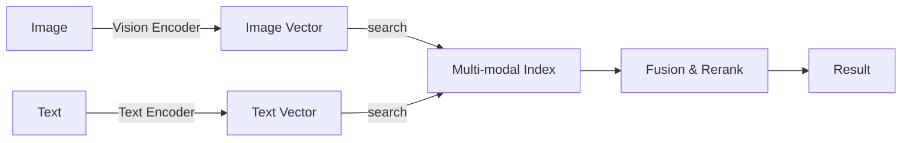

---

## Key Visual Takeaways

- Ingest and query are symmetrical: embed then search.
- Index choice is a primary design decision: balance memory, latency, and accuracy.
- Hybrid search and reranking provide practical improvements for real-world apps.
- Sharding, caching, and quantization are essential for scaling to billions.
- Monitoring retrieval quality (precision/recall) is as important as latency/cost.
