# Generative AI (Gen-AI) Guide

## Table of Contents
1. [Introduction](#introduction)
2. [History](#history)
3. [Applications](#applications)
4. [Software and Hardware](#software-and-hardware)
5. [Law and Regulation](#law-and-regulation)
6. [Concerns](#concerns)
7. [Detection and Awareness](#detection-and-awareness)

## Introduction
Generative AI (GenAI) is a subfield of artificial intelligence that uses generative models to produce text, images, videos, audio, software code, or other data. These models learn patterns from training data and generate new content based on prompts.

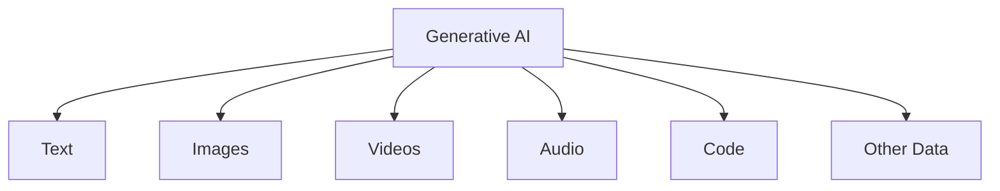

## History
Evolution of generative AI from early concepts to modern boom.

### Early History
Origins in Markov chains for modeling natural language, used since early 20th century. Artists began using computers for generative techniques beyond Markov models in the 1970s.

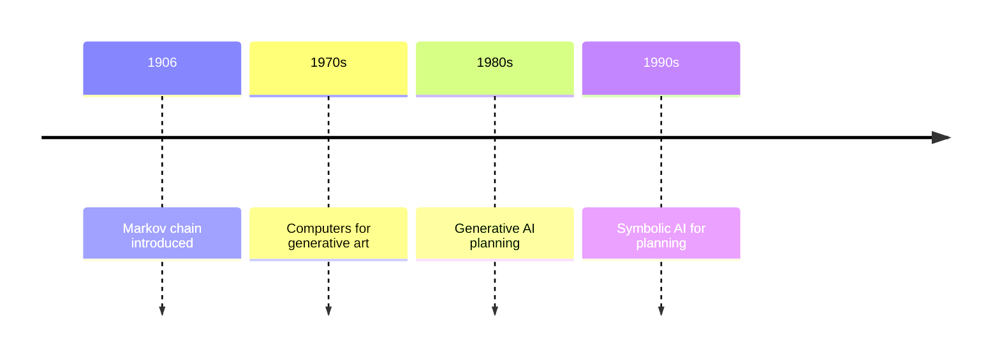

### Generative Neural Networks (2014–2019)
Advancements with variational autoencoders and generative adversarial networks. Transformer networks enabled better generative models.

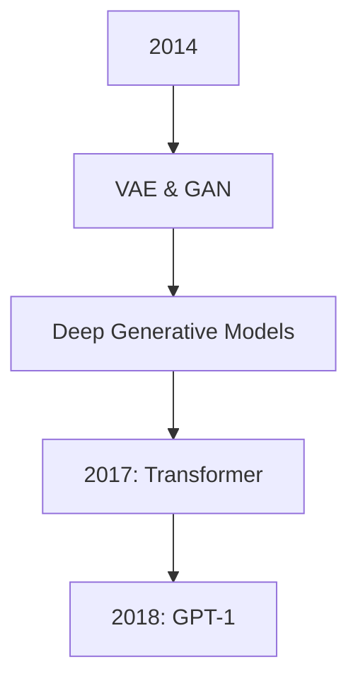

### Generative AI Boom (2020–)
Explosion in popularity with tools like DALL-E, Midjourney, Stable Diffusion, and ChatGPT. Multimodal models and widespread adoption.

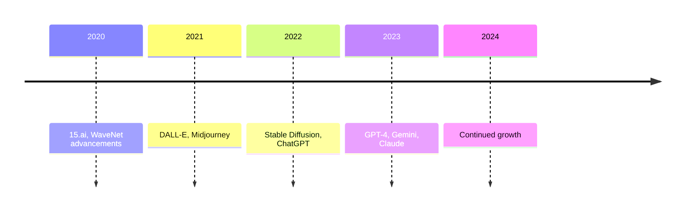

## Applications
Uses across various domains.

### Text and Software Code
Large language models for natural language processing, machine translation, and code generation. Tools like ChatGPT, Gemini, Claude, LLaMA.

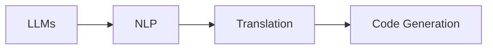

### Audio
Generative models for raw waveforms, speech synthesis, music generation. Tools like WaveNet, Tacotron, ElevenLabs, MusicGen.

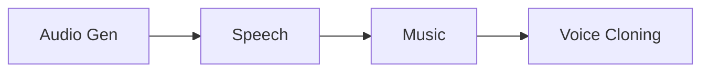

### Images
Text-to-image models for creating visual art. Examples: Stable Diffusion, DALL-E, Midjourney, Imagen.

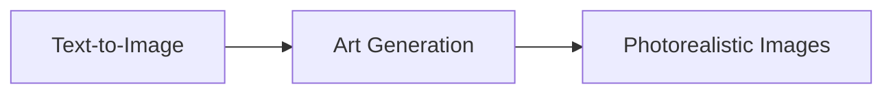

### Video
Text-to-video for generating videos. Tools like Sora, Runway, Meta's Make-A-Video, LTX Video.

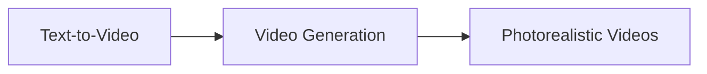

### Robotics
Training on robotic motions for motion planning and navigation. Multimodal vision-language-action models.

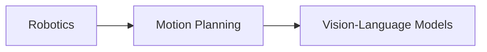

### 3D Modeling
Text-to-3D, image-to-3D for CAD automation. AI-based CAD libraries and assistants.

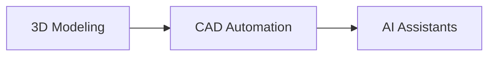

## Software and Hardware
Models, training techniques, and infrastructure.

### Generative Models and Training Techniques
Key approaches: Generative Adversarial Networks (GANs), Variational Autoencoders (VAEs), Transformers.

#### Generative Adversarial Networks
Two neural networks: generator and discriminator in a minimax game.

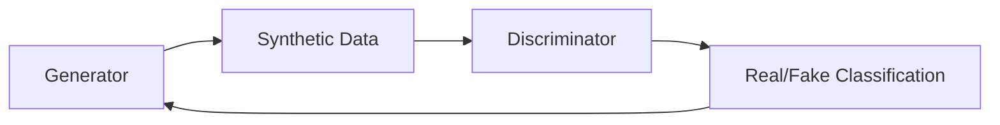

#### Variational Autoencoders
Encoder maps to latent space, decoder reconstructs. Used for image generation and anomaly detection.

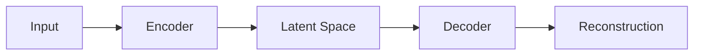

#### Transformers
Foundation for GPT series. Self-attention for long-range dependencies.

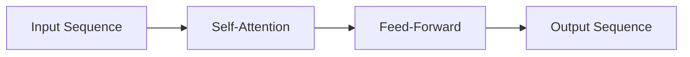

### Hardware
Large models require GPUs, TPUs, AI accelerators. Local running on consumer hardware possible for smaller models.

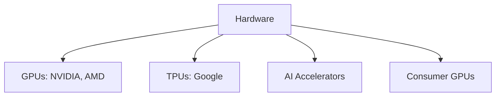

## Law and Regulation
Legal frameworks for generative AI.

### Copyright
Training on copyrighted data, copyright of AI-generated content.

#### Training with Copyrighted Content
Debate on fair use vs. infringement.

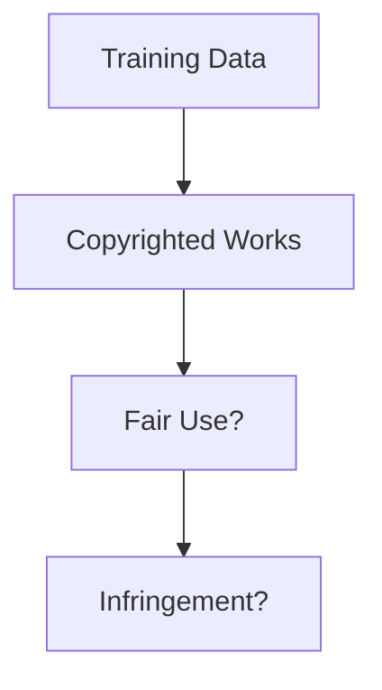

#### Copyright of AI-Generated Content
US Copyright Office rules: human input required for protection.

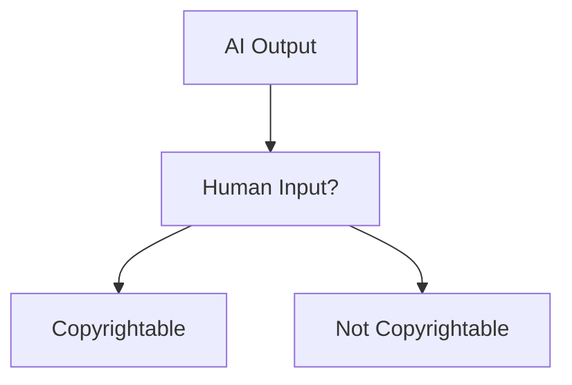

### Regulation
US: Voluntary agreements, Executive Order. EU: AI Act. China: Interim Measures.

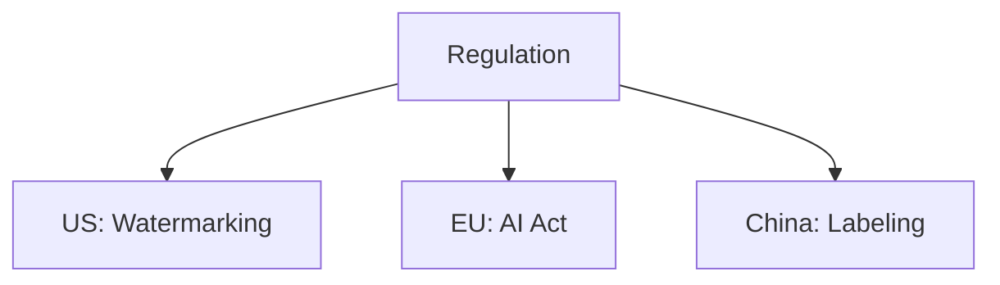

## Concerns
Ethical and societal issues.

### Academic Honesty
Use in cheating, plagiarism detection challenges.

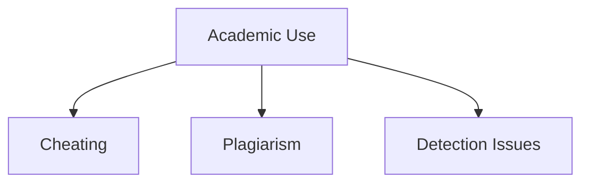

### Job Losses
Potential replacement of creative and analytical jobs.

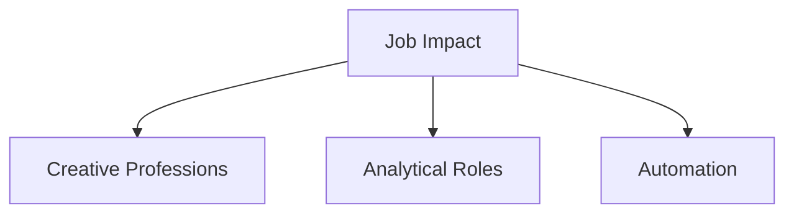

### Racial and Gender Bias
Models reflect biases in training data.

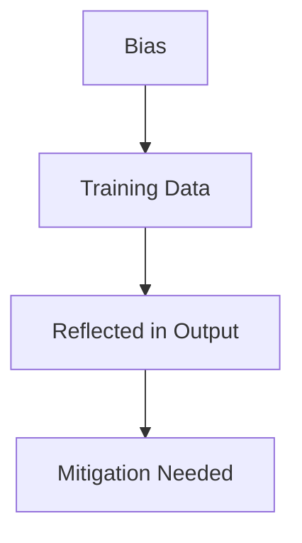

### Deepfakes
AI-generated media for misinformation.

#### Audio Deepfakes
Voice cloning for fake audio.

```mermaid
graph TD
    A[Audio Deepfakes] --> B[Voice Cloning]
    B --> C[Misinformation]
```

### Illegal Imagery
Generation of harmful content like CSAM.

```mermaid
graph TD
    A[Illegal Content] --> B[CSAM]
    A --> C[Rape Porn]
    A --> D[Zoophilia]
```

### Cybercrime
Use in phishing, fake reviews, jailbreaks.

```mermaid
graph TD
    A[Cybercrime] --> B[Phishing]
    A --> C[Fake Reviews]
    A --> D[Jailbreaks]
```

### Information Laundering
Propaganda disguised as legitimate content.

```mermaid
graph TD
    A[Info Laundering] --> B[Propaganda]
    B --> C[Disguised Origin]
```

### Reliance on Industry Giants
High costs limit access to smaller players.

```mermaid
graph TD
    A[Reliance] --> B[Big Tech]
    B --> C[High Costs]
    C --> D[Limited Access]
```

### Energy and Environment
High carbon footprint and resource use.

```mermaid
graph TD
    A[Environmental] --> B[Carbon Footprint]
    A --> C[Water Use]
    A --> D[Electricity]
```

### Content Quality
Generation of low-quality "slop" content.

```mermaid
graph TD
    A[Content Quality] --> B[AI Slop]
    A --> C[Spam-like Content]
    A --> D[Search Pollution]
```

### Misuse in Journalism
Fake news and automated content.

```mermaid
graph TD
    A[Journalism] --> B[Fake Articles]
    A --> C[CNET Errors]
    A --> D[Automated Reporting]
```

## Detection and Awareness
Identifying AI-generated content.

### Detection Tools
Software like GPTZero, watermarking (SynthID).

```mermaid
graph TD
    A[Detection] --> B[GPTZero]
    A --> C[SynthID Watermarking]
    A --> D[False Positives]
```

### Awareness
Labeling content, public education.

```mermaid
graph TD
    A[Awareness] --> B[Labeling]
    A --> C[Education]
    A --> D[Context Provision]
```
