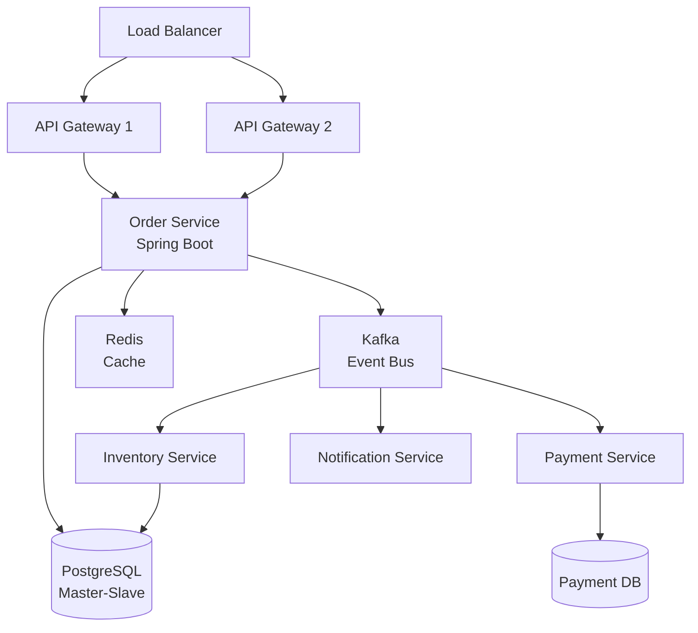

# Java Architect / Interview Reference

## Top Questions

1. **Explain Java's memory model and garbage collection.**
   - **Heap Structure**: Young Generation (Eden, Survivor S0/S1), Old Generation (Tenured)
   - **GC Algorithms**: Serial, Parallel, CMS, G1, ZGC, Shenandoah
   - **GC Process**: Minor GC (young gen), Major GC (old gen), Full GC (entire heap)
   - **Memory Areas**: Heap (objects), Stack (method calls), Metaspace (class metadata), Native (JNI)
   - **Key Points**: Generational hypothesis, stop-the-world vs concurrent, GC tuning parameters

2. **What are the differences between abstract classes and interfaces?**
   - **Abstract Classes**: Can have instance variables, constructors, concrete methods, single inheritance
   - **Interfaces**: Only constants and method signatures (Java 7), default/static methods (Java 8+), multiple inheritance
   - **When to Use**: Abstract class for shared implementation, interface for contracts/behavior
   - **Java 8+**: Interfaces can have default methods, static methods, private methods (Java 9+)

3. **Explain multithreading and concurrency in Java.**
   - **Thread Creation**: Extend Thread, implement Runnable, use ExecutorService
   - **Synchronization**: synchronized keyword, locks (ReentrantLock, ReadWriteLock), volatile
   - **Concurrency Utilities**: ExecutorService, Future, CompletableFuture, CountDownLatch, CyclicBarrier, Semaphore
   - **Thread Safety**: Atomic classes (AtomicInteger, AtomicReference), Concurrent collections (ConcurrentHashMap, BlockingQueue)
   - **Common Issues**: Race conditions, deadlocks, livelocks, thread starvation

4. **How does Java handle exceptions?**
   - **Exception Hierarchy**: Throwable → Error (unchecked), Exception → RuntimeException (unchecked), Checked Exceptions
   - **Checked vs Unchecked**: Checked must be declared/thrown, unchecked don't require declaration
   - **Best Practices**: Specific exceptions, avoid catching Throwable, use try-with-resources, don't swallow exceptions
   - **Exception Handling**: try-catch-finally, try-with-resources (Java 7+), multi-catch (Java 7+)

5. **Explain Java 8+ features (Streams, Lambdas, Optional).**
   - **Streams API**: Functional-style operations on collections, lazy evaluation, parallel streams
   - **Lambdas**: Functional interfaces, method references, concise syntax for anonymous classes
   - **Optional**: Avoid null pointer exceptions, functional-style null handling, map/flatMap operations
   - **Other Features**: Default methods in interfaces, CompletableFuture, new Date/Time API, var keyword (Java 10+)

## System Design Prompt – "High-Throughput E-Commerce Platform"

### Requirements
- Handle 10,000+ concurrent users
- Process orders with ACID guarantees
- Real-time inventory management
- Microservices architecture
- Low latency (< 100ms for critical paths)

### Architecture Talking Points



**Key Java Technologies:**
- **Spring Boot**: Microservices framework, dependency injection, auto-configuration
- **Spring Data JPA**: Database abstraction, repository pattern, transaction management
- **Spring Cloud**: Service discovery (Eureka), API Gateway (Zuul/Gateway), Config Server
- **Hibernate**: ORM, caching (L1/L2), lazy loading, batch processing
- **Kafka**: Event-driven architecture, async processing, event sourcing
- **Redis**: Caching, session storage, rate limiting
- **Thread Pool**: ExecutorService for async operations, CompletableFuture for non-blocking

**Design Considerations:**
- **Connection Pooling**: HikariCP for database connections
- **Caching Strategy**: Redis for hot data, Spring Cache abstraction
- **Transaction Management**: @Transactional, distributed transactions (Saga pattern)
- **Error Handling**: Global exception handlers, circuit breakers (Resilience4j)
- **Monitoring**: Micrometer, Spring Actuator, distributed tracing

## Troubleshooting Matrix

| Symptom | Root Cause | Fix |
| --- | --- | --- |
| OutOfMemoryError | Heap exhaustion, memory leaks | Increase heap size (-Xmx), analyze heap dump, fix memory leaks |
| High CPU usage | Infinite loops, inefficient algorithms | Profile with JProfiler/VisualVM, optimize hot paths |
| Deadlock | Circular wait on locks | Use lock ordering, timeout on locks, detect with thread dumps |
| Slow application | N+1 queries, missing indexes | Enable Hibernate SQL logging, add database indexes, use batch fetching |
| ClassNotFoundException | Classpath issues, missing dependencies | Check classpath, verify Maven/Gradle dependencies |
| PermGen/Metaspace errors | Too many classes loaded | Increase Metaspace size, check for classloader leaks |

## Performance Optimization

### JVM Tuning
```bash
# Heap sizing
-Xms2g -Xmx4g

# Garbage collection
-XX:+UseG1GC
-XX:MaxGCPauseMillis=200

# Metaspace
-XX:MetaspaceSize=256m
-XX:MaxMetaspaceSize=512m

# GC logging
-Xlog:gc*:file=gc.log:time,level,tags
```

### Code-Level Optimizations
- **String Operations**: Use StringBuilder for concatenation in loops
- **Collections**: Choose appropriate collection type (ArrayList vs LinkedList)
- **Streams**: Use parallel streams for CPU-intensive operations
- **Caching**: Cache expensive computations, use @Cacheable
- **Database**: Use batch operations, connection pooling, prepared statements

## Common Patterns

### Singleton Pattern
```java
public class Singleton {
    private static volatile Singleton instance;
    
    private Singleton() {}
    
    public static Singleton getInstance() {
        if (instance == null) {
            synchronized (Singleton.class) {
                if (instance == null) {
                    instance = new Singleton();
                }
            }
        }
        return instance;
    }
}
```

### Factory Pattern
```java
public interface PaymentProcessor {
    void processPayment(double amount);
}

public class PaymentProcessorFactory {
    public static PaymentProcessor create(String type) {
        return switch (type) {
            case "credit" -> new CreditCardProcessor();
            case "paypal" -> new PayPalProcessor();
            default -> throw new IllegalArgumentException("Unknown payment type");
        };
    }
}
```

### Observer Pattern
```java
public interface Observer {
    void update(String event);
}

public class EventPublisher {
    private List<Observer> observers = new ArrayList<>();
    
    public void subscribe(Observer observer) {
        observers.add(observer);
    }
    
    public void notifyObservers(String event) {
        observers.forEach(obs -> obs.update(event));
    }
}
```

## Practice Prompts

1. **Design a thread-safe cache with TTL (Time-To-Live) expiration.**
   - Use ConcurrentHashMap for thread safety
   - Implement TTL with scheduled cleanup
   - Handle cache eviction policies (LRU, LFU)

2. **Explain how you'd optimize a Spring Boot application with slow database queries.**
   - Database indexing strategy
   - Hibernate query optimization
   - Caching layers (L1, L2, Redis)
   - Connection pooling configuration

3. **Design a distributed task scheduler using Java.**
   - Use Quartz or Spring Scheduler
   - Handle distributed coordination
   - Ensure exactly-once execution
   - Monitor and alert on failures

4. **How would you implement a rate limiter in Java?**
   - Token bucket algorithm
   - Sliding window approach
   - Thread-safe implementation
   - Integration with Spring filters

5. **Explain memory leak detection and prevention in Java.**
   - Heap dump analysis tools
   - Common leak patterns (listeners, caches, inner classes)
   - WeakReference and SoftReference usage
   - Profiling tools (JProfiler, VisualVM, MAT)

## Rapid Reference

- **Collections**: ArrayList (O(1) access), LinkedList (O(1) insert), HashMap (O(1) avg), TreeMap (O(log n))
- **Concurrency**: ExecutorService for thread pools, CompletableFuture for async, ConcurrentHashMap for thread-safe maps
- **Spring Annotations**: @Component, @Service, @Repository, @Controller, @Autowired, @Transactional, @Cacheable
- **JVM Flags**: -Xmx (max heap), -Xms (initial heap), -XX:+UseG1GC (G1 collector), -XX:MaxMetaspaceSize (metaspace)
- **Best Practices**: Immutable objects, fail-fast iterators, use StringBuilder for string concatenation, close resources properly

