# Java Visual Guide

## JVM Architecture

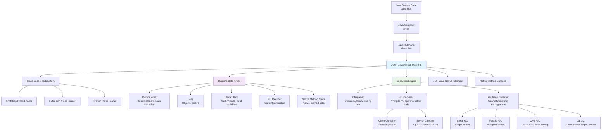

## Object-Oriented Programming Hierarchy

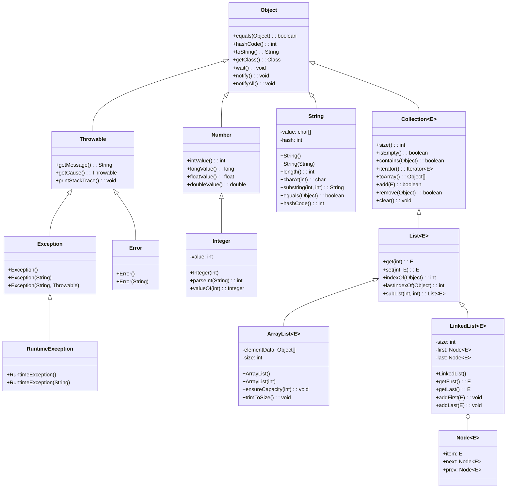

## Collections Framework Architecture

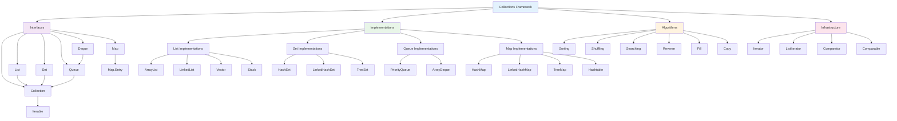

## Exception Handling Flow

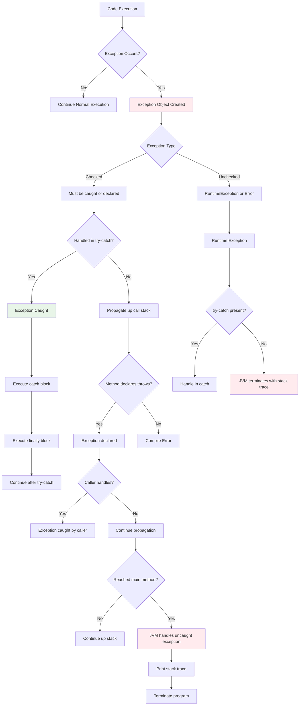

## Concurrency Patterns

```mermaid
graph TB
    A[Concurrency Patterns] --> B[Synchronization]
    A --> C[Communication]
    A --> D[Coordination]

    B --> B1[Mutex Locks]
    B --> B2[Read-Write Locks]
    B --> B3[Semaphores]
    B --> B4[Atomic Variables]

    C --> C1[Wait-Notify]
    C --> C2[Condition Variables]
    C --> C3[Blocking Queues]
    C --> C4[Exchangers]

    D --> D1[Producer-Consumer]
    D --> D2[Readers-Writers]
    D --> D3[Dining Philosophers]
    D --> D4[Barrier Synchronization]

    B1 --> B11[synchronized keyword]
    B1 --> B12[ReentrantLock]

    B2 --> B21[ReentrantReadWriteLock]

    B3 --> B31[Counting Semaphore]
    B3 --> B32[Binary Semaphore]

    B4 --> B41[AtomicInteger]
    B4 --> B42[AtomicLong]
    B4 --> B43[AtomicReference]

    C1 --> C11[Object.wait()]
    C1 --> C12[Object.notify()]
    C1 --> C13[Object.notifyAll()]

    C2 --> C21[Condition.await()]
    C2 --> C22[Condition.signal()]
    C2 --> C23[Condition.signalAll()]

    C3 --> C31[ArrayBlockingQueue]
    C3 --> C32[LinkedBlockingQueue]
    C3 --> C33[PriorityBlockingQueue]

    D1 --> D11[Single Producer-Single Consumer]
    D1 --> D12[Multiple Producer-Multiple Consumer]

    D2 --> D21[First Readers-Writers]
    D2 --> D22[Second Readers-Writers]
    D2 --> D23[Third Readers-Writers]

    style A fill:#e3f2fd
    style B fill:#f3e5f5
    style C fill:#e8f5e8
    style D fill:#fff3e0
```

## Design Patterns in Java

```mermaid
graph TD
    A[Design Patterns] --> B[Creational]
    A --> C[Structural]
    A --> D[Behavioral]

    B --> B1[Singleton]
    B --> B2[Factory Method]
    B --> B3[Abstract Factory]
    B --> B4[Builder]
    B --> B5[Prototype]

    C --> C1[Adapter]
    C --> C2[Bridge]
    C --> C3[Composite]
    C --> C4[Decorator]
    C --> C5[Facade]
    C --> C6[Flyweight]
    C --> C7[Proxy]

    D --> D1[Chain of Responsibility]
    D --> D2[Command]
    D --> D3[Interpreter]
    D --> D4[Iterator]
    D --> D5[Mediator]
    D --> D6[Memento]
    D --> D7[Observer]
    D --> D8[State]
    D --> D9[Strategy]
    D --> D10[Template Method]
    D --> D11[Visitor]

    B1 --> B11[Thread-safe Singleton]
    B1 --> B12[Enum Singleton]
    B1 --> B13[Lazy Initialization]

    B2 --> B21[Simple Factory]
    B2 --> B22[Factory Method]
    B2 --> B23[Static Factory]

    B4 --> B41[StringBuilder]
    B4 --> B42[Stream.Builder]

    C1 --> C11[Class Adapter]
    C1 --> C12[Object Adapter]

    C3 --> C31[File System]
    C3 --> C32[GUI Components]

    C4 --> C41[Buffered Streams]
    C4 --> C42[Java I/O Decorators]

    C7 --> C71[Virtual Proxy]
    C71 --> C711[Image Proxy]
    C7 --> C72[Protection Proxy]
    C7 --> C73[Remote Proxy]
    C7 --> C74[Caching Proxy]

    D4 --> D41[External Iterator]
    D4 --> D42[Internal Iterator]

    D7 --> D71[Event Listeners]
    D7 --> D72[Property Change Listeners]

    D9 --> D91[Collections.sort()]
    D9 --> D92[Comparator]

    style A fill:#e3f2fd
    style B fill:#f3e5f5
    style C fill:#e8f5e8
    style D fill:#fff3e0
```

## Spring Framework Architecture

```mermaid
graph TB
    A[Spring Framework] --> B[Core Container]
    A --> C[Data Access/Integration]
    A --> D[Web]
    A --> E[AOP]
    A --> F[Instrumentation]
    A --> G[Test]

    B --> B1[Beans]
    B --> B2[Core]
    B --> B3[Context]
    B --> B4[SpEL]

    C --> C1[JDBC]
    C --> C2[ORM]
    C --> C3[OXM]
    C --> C4[JMS]
    C --> C5[Transactions]

    D --> D1[Web]
    D --> D2[Web-Servlet]
    D --> D3[Web-Struts]
    D --> D4[Web-Portlet]

    B1 --> B11[Bean Factory]
    B1 --> B12[Application Context]

    B2 --> B21[Dependency Injection]
    B2 --> B22[Ioc Container]

    B3 --> B31[Bean Lifecycle]
    B3 --> B32[Internationalization]

    C1 --> C11[DataSource]
    C1 --> C12[JdbcTemplate]

    C2 --> C21[Hibernate]
    C2 --> C22[JPA]
    C2 --> C23[JDO]

    C5 --> C51[Declarative Transactions]
    C5 --> C52[Programmatic Transactions]

    D2 --> D21[DispatcherServlet]
    D2 --> D22[Controller]
    D2 --> D23[View Resolver]

    E --> E1[AspectJ Integration]
    E --> E2[Spring AOP]

    style A fill:#e3f2fd
    style B fill:#f3e5f5
    style C fill:#e8f5e8
    style D fill:#fff3e0
    style E fill:#fce4ec
    style F fill:#f1f8e9
    style G fill:#e0f2f1
```

## Microservices Architecture with Java

```mermaid
graph TB
    A[API Gateway] --> B[Service Registry]
    A --> C[Config Server]
    A --> D[Auth Service]
    A --> E[User Service]
    A --> F[Order Service]
    A --> G[Product Service]
    A --> H[Payment Service]

    B --> B1[Eureka Server]
    B --> B2[Consul]
    B --> B3[Zookeeper]

    C --> C1[Spring Cloud Config]
    C --> C2[Git Repository]

    D --> D1[JWT Tokens]
    D --> D2[OAuth2]

    E --> E1[User Database]
    F --> F1[Order Database]
    G --> G1[Product Database]
    H --> H1[Payment Database]

    I[Message Broker] --> F
    I --> G
    I --> H

    I --> I1[RabbitMQ]
    I --> I2[Apache Kafka]

    J[Circuit Breaker] --> E
    J --> F
    J --> G
    J --> H

    J --> J1[Hystrix]
    J --> J2[Resilience4j]

    K[Monitoring] --> L[Spring Boot Actuator]
    K --> M[Micrometer]
    K --> N[Prometheus]
    K --> O[Grafana]

    P[Container Orchestration] --> Q[Docker]
    P --> R[Kubernetes]

    style A fill:#e3f2fd
    style B fill:#f3e5f5
    style C fill:#e8f5e8
    style I fill:#fff3e0
    style J fill:#fce4ec
    style K fill:#f1f8e9
    style P fill:#e0f2f1
```

## Performance Optimization Patterns

```mermaid
graph TD
    A[Performance Optimization] --> B[Memory Management]
    A --> C[CPU Optimization]
    A --> D[I/O Optimization]
    A --> E[Concurrency Optimization]

    B --> B1[Garbage Collection Tuning]
    B --> B2[Memory Leak Prevention]
    B --> B3[Object Pooling]
    B --> B4[Flyweight Pattern]

    C --> C1[JIT Compilation]
    C --> C2[Algorithm Optimization]
    C --> C3[Caching]
    C --> C4[Lazy Loading]

    D --> D1[Buffering]
    D --> D2[Asynchronous I/O]
    D --> D3[Connection Pooling]
    D --> D4[Batch Processing]

    E --> E1[Thread Pool Tuning]
    E --> E2[Lock Optimization]
    E --> E3[Concurrent Collections]
    E --> E4[Parallel Streams]

    B1 --> B11[GC Algorithm Selection]
    B1 --> B12[Heap Size Tuning]
    B1 --> B13[GC Logging]

    B2 --> B21[Weak References]
    B2 --> B22[Soft References]
    B2 --> B23[Phantom References]

    C3 --> C31[Ehcache]
    C3 --> C32[Caffeine]
    C3 --> C33[Redis]

    D1 --> D11[Buffered Streams]
    D1 --> D12[NIO Buffers]

    D3 --> D31[HikariCP]
    D3 --> D32[DBCP]

    E1 --> E11[ThreadPoolExecutor]
    E1 --> E12[ForkJoinPool]

    E2 --> E21[Read-Write Locks]
    E2 --> E22[Stamped Locks]
    E2 --> E23[Atomic Variables]

    style A fill:#e3f2fd
    style B fill:#f3e5f5
    style C fill:#e8f5e8
    style D fill:#fff3e0
    style E fill:#fce4ec
```

## Java Memory Model

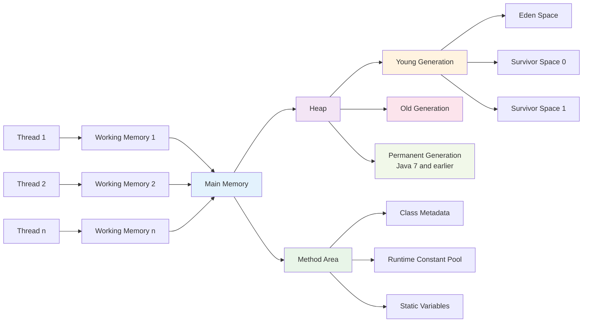

## Stream Processing Pipeline

```mermaid
flowchart LR
    A[Source] --> B[Stream Creation]
    B --> C[Intermediate Operations]
    C --> D[Terminal Operation]
    D --> E[Result]

    B --> B1[Collection.stream()]
    B --> B2[Arrays.stream()]
    B --> B3[Stream.of()]
    B --> B4[IntStream.range()]

    C --> C1[filter()]
    C --> C2[map()]
    C --> C3[flatMap()]
    C --> C4[sorted()]
    C --> C5[distinct()]
    C --> C6[limit()]
    C --> C7[skip()]
    C --> C8[peek()]

    D --> D1[forEach()]
    D --> D2[collect()]
    D --> D3[reduce()]
    D --> D4[count()]
    D --> D5[findFirst()]
    D --> D6[findAny()]
    D --> D7[anyMatch()]
    D --> D8[allMatch()]
    D --> D9[noneMatch()]

    D2 --> D21[toList()]
    D2 --> D22[toSet()]
    D2 --> D23[toMap()]
    D2 --> D24[joining()]
    D2 --> D25[groupingBy()]
    D2 --> D26[partitioningBy()]

    style A fill:#e3f2fd
    style B fill:#f3e5f5
    style C fill:#e8f5e8
    style D fill:#fff3e0
    style E fill:#fce4ec
```

## Database Access Patterns

```mermaid
graph TD
    A[Application Layer] --> B[Data Access Layer]
    B --> C[JDBC]
    B --> D[ORM]
    B --> E[Template Pattern]

    C --> C1[DriverManager]
    C --> C2[DataSource]
    C --> C3[Connection]
    C --> C4[Statement]
    C --> C5[PreparedStatement]
    C --> C6[CallableStatement]
    C --> C7[ResultSet]

    D --> D1[Hibernate]
    D --> D2[JPA]
    D --> D3[EclipseLink]
    D --> D4[Spring Data JPA]

    E --> E1[JdbcTemplate]
    E --> E2[HibernateTemplate]
    E --> E3[JpaTemplate]

    F[Transaction Management] --> F1[JDBC Transactions]
    F --> F2[JTA]
    F --> F3[Spring Transactions]

    G[Connection Pooling] --> G1[HikariCP]
    G --> G2[DBCP]
    G --> G3[C3P0]

    H[Caching] --> H1[First Level Cache]
    H --> H2[Second Level Cache]
    H --> H3[Query Cache]

    I[Database] --> I1[MySQL]
    I --> I2[PostgreSQL]
    I --> I3[Oracle]
    I --> I4[SQL Server]

    style A fill:#e3f2fd
    style B fill:#f3e5f5
    style C fill:#e8f5e8
    style D fill:#fff3e0
    style F fill:#fce4ec
    style G fill:#f1f8e9
    style H fill:#e0f2f1
    style I fill:#f3e5f5
```

## Enterprise Java Architecture

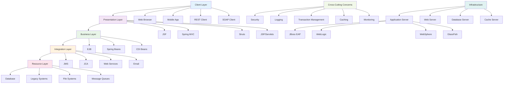

## Reactive Programming with Java

```mermaid
graph LR
    A[Reactive Streams] --> B[Publisher]
    A --> C[Subscriber]
    A --> D[Subscription]
    A --> E[Processor]

    B --> B1[onSubscribe()]
    B --> B2[onNext()]
    B --> B3[onError()]
    B --> B4[onComplete()]

    C --> C1[subscribe()]
    C --> C2[request()]
    C --> C3[cancel()]

    F[Reactive Libraries] --> F1[RxJava]
    F --> F2[Reactor]
    F --> F3[Akka Streams]
    F --> F4[Mutiny]

    G[Reactive Patterns] --> G1[Observer Pattern]
    G --> G2[Iterator Pattern]
    G --> G3[Functional Programming]

    H[Backpressure] --> H1[Buffering]
    H --> H2[Dropping]
    H --> H3[Latest]
    H --> H4[Error]

    I[Reactive Operators] --> I1[map()]
    I --> I2[filter()]
    I --> I3[flatMap()]
    I --> I4[reduce()]
    I --> I5[zip()]
    I --> I6[merge()]
    I --> I7[concat()]

    style A fill:#e3f2fd
    style F fill:#f3e5f5
    style G fill:#e8f5e8
    style H fill:#fff3e0
    style I fill:#fce4ec
```

## Java Build and Dependency Management

```mermaid
graph TD
    A[Build Tools] --> B[Maven]
    A --> C[Gradle]
    A --> D[Ant]

    B --> B1[pom.xml]
    B --> B2[Dependencies]
    B --> B3[Plugins]
    B --> B4[Lifecycle]

    C --> C1[build.gradle]
    C --> C2[Groovy DSL]
    C --> C3[Kotlin DSL]
    C --> C4[Task Dependencies]

    E[Repository Management] --> E1[Maven Central]
    E --> E2[JCenter]
    E --> E3[Private Repositories]
    E --> E4[Artifactory]
    E --> E5[Nexus]

    F[Dependency Injection] --> F1[Constructor Injection]
    F --> F2[Setter Injection]
    F --> F3[Field Injection]
    F --> F4[Method Injection]

    G[Testing Frameworks] --> G1[JUnit]
    G --> G2[TestNG]
    G --> G3[Mockito]
    G --> G4[PowerMock]

    H[CI/CD Integration] --> H1[Jenkins]
    H --> H2[GitLab CI]
    H --> H3[GitHub Actions]
    H --> H4[Azure DevOps]

    style A fill:#e3f2fd
    style B fill:#f3e5f5
    style C fill:#e8f5e8
    style E fill:#fff3e0
    style F fill:#fce4ec
    style G fill:#f1f8e9
    style H fill:#e0f2f1
```

## Security Architecture in Java

```mermaid
graph TB
    A[Java Security] --> B[Authentication]
    A --> C[Authorization]
    A --> D[Cryptography]
    A --> E[Secure Communication]

    B --> B1[JAAS]
    B --> B2[Spring Security]
    B --> B3[JWT]
    B --> B4[OAuth2]
    B --> B5[SAML]

    C --> C1[Role-Based Access Control]
    C --> C2[Method-Level Security]
    C --> C3[URL-Level Security]
    C --> C4[JSR-250 Annotations]

    D --> D1[JCA]
    D --> D2[JCE]
    D --> D3[Message Digest]
    D --> D4[Digital Signatures]
    D --> D5[Certificates]

    E --> E1[SSL/TLS]
    E --> E2[HTTPS]
    E --> E3[Mutual Authentication]

    F[Security Best Practices] --> F1[Input Validation]
    F --> F2[Output Encoding]
    F --> F3[SQL Injection Prevention]
    F --> F4[XSS Prevention]
    F --> F5[CSRF Protection]

    G[Vulnerability Prevention] --> G1[Buffer Overflow]
    G --> G2[Deserialization Attacks]
    G --> G3[XXE Attacks]
    G --> G4[Command Injection]

    style A fill:#e3f2fd
    style B fill:#f3e5f5
    style C fill:#e8f5e8
    style D fill:#fff3e0
    style E fill:#fce4ec
    style F fill:#f1f8e9
    style G fill:#e0f2f1
```

## Java Performance Monitoring

```mermaid
graph TD
    A[Performance Monitoring] --> B[JVM Metrics]
    A --> C[Application Metrics]
    A --> D[Infrastructure Metrics]

    B --> B1[Heap Usage]
    B --> B2[GC Statistics]
    B --> B3[Thread Count]
    B --> B4[CPU Usage]
    B --> B5[Class Loading]

    C --> C1[Response Time]
    C --> C2[Throughput]
    C --> C3[Error Rate]
    C --> C4[Active Users]
    C --> C5[Database Connections]

    D --> D1[Server Resources]
    D --> D2[Network I/O]
    D --> D3[Disk I/O]
    D --> D4[Memory Usage]

    E[Monitoring Tools] --> E1[JMX]
    E --> E2[JFR]
    E --> E3[VisualVM]
    E --> E4[JConsole]

    F[APM Solutions] --> F1[New Relic]
    F --> F2[AppDynamics]
    F --> F3[Dynatrace]
    F --> F4[Datadog]

    G[Logging Frameworks] --> G1[Log4j]
    G --> G2[Logback]
    G --> G3[JUL]
    G --> G4[Tinylog]

    H[Alerting] --> H1[Threshold-based]
    H --> H2[Anomaly Detection]
    H --> H3[Composite Alerts]

    style A fill:#e3f2fd
    style B fill:#f3e5f5
    style C fill:#e8f5e8
    style D fill:#fff3e0
    style E fill:#fce4ec
    style F fill:#f1f8e9
    style G fill:#e0f2f1
    style H fill:#fff3e0
```

These diagrams provide a comprehensive visual representation of Java's architecture, patterns, and ecosystem. They cover everything from basic JVM structure to advanced enterprise patterns, making it easier to understand the relationships and flow of data in Java applications.
