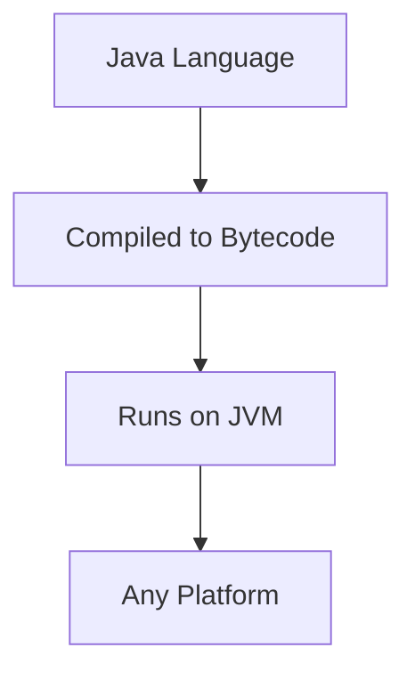
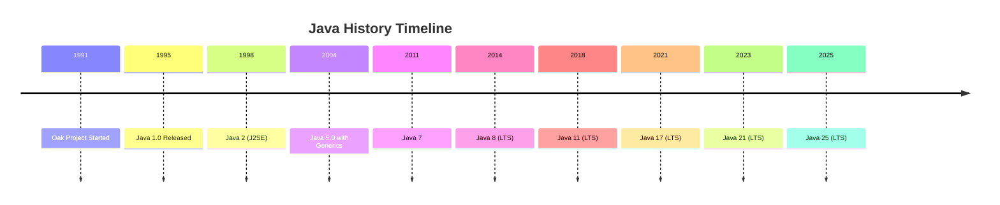
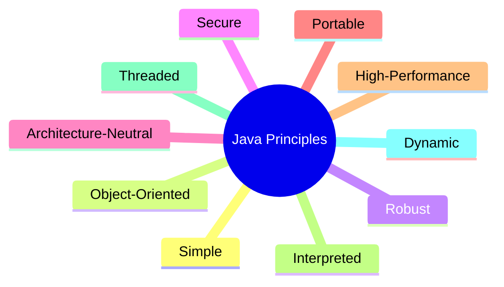
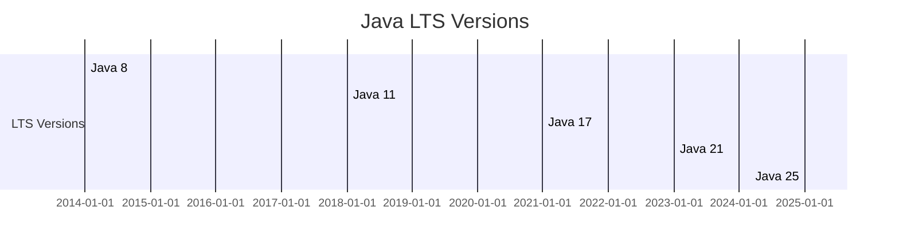
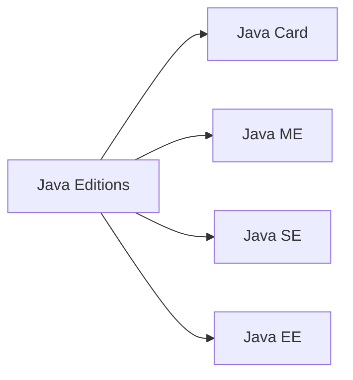
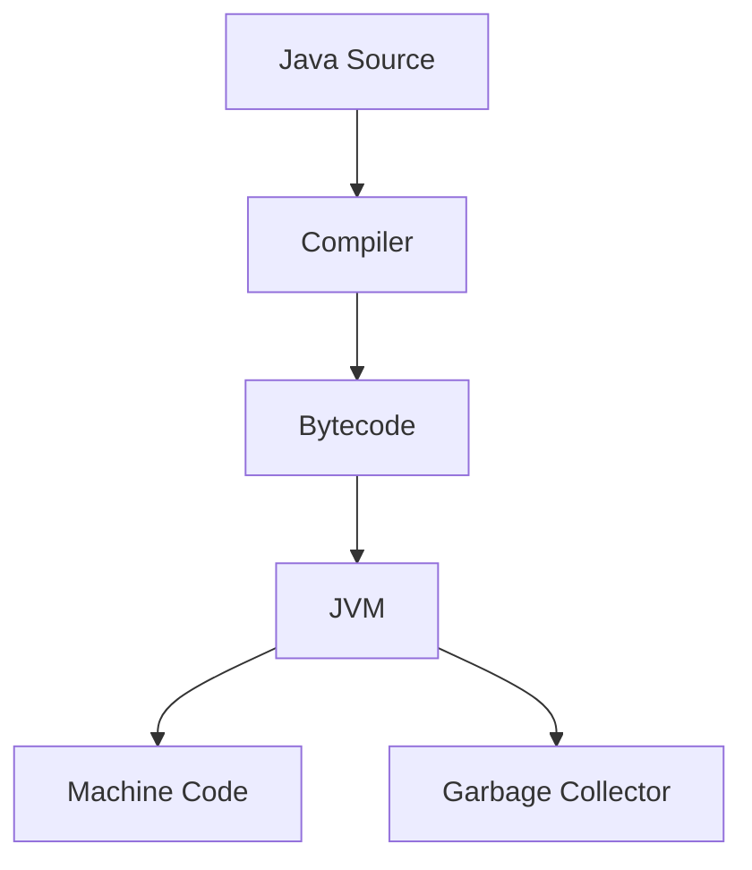
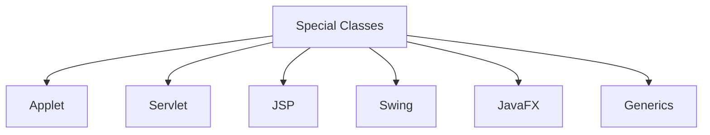
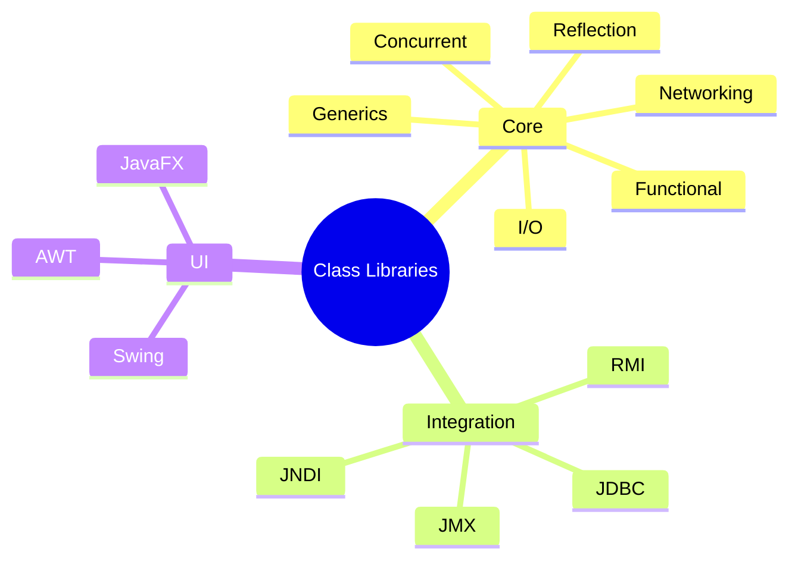
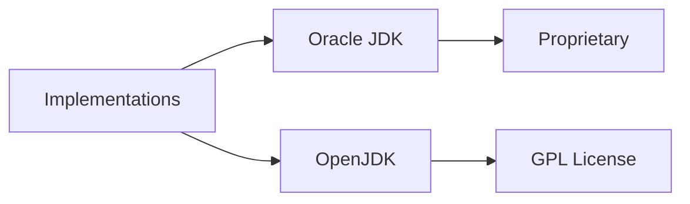

# Java Programming Language Guide

## Table of Contents
1. [Introduction](#introduction)
2. [History](#history)
3. [Principles](#principles)
4. [Versions](#versions)
5. [Editions](#editions)
6. [Execution System](#execution-system)
7. [Syntax](#syntax)
8. [Special Classes](#special-classes)
9. [Class Libraries](#class-libraries)
10. [Implementations](#implementations)

## Introduction
Java is a high-level, general-purpose, memory-safe, object-oriented programming language designed for write once, run anywhere (WORA) functionality.



## History
Java was created by James Gosling at Sun Microsystems in 1991, initially for interactive television, but evolved into a general-purpose language.



## Principles
Five primary goals: simple, object-oriented, robust, secure, architecture-neutral, portable, high-performance, interpreted, threaded, dynamic.



## Versions
Major versions include Java 8, 11, 17, 21, 25 as LTS versions.



## Editions
Java Card for smart-cards, Java ME for limited resources, Java SE for workstations, Java EE for enterprise environments.



## Execution System
Java uses JVM for portability, bytecode compilation, JIT compilation, automatic garbage collection.



## Syntax
Influenced by C/C++, object-oriented, no operator overloading or multiple inheritance for classes.

```mermaid
stateDiagram-v2
    [*] --> Class
    Class --> Method
    Method --> Statement
    Statement --> [*]
    note right of Class : public class HelloWorld
    note right of Method : public static void main
    note right of Statement : System.out.println
```

## Special Classes
Includes Applets (deprecated), Servlets for web, JSP for server-side, Swing for GUI, JavaFX for rich apps, Generics for type safety.



## Class Libraries
Core libraries: I/O, Networking, Reflection, Concurrent, Generics, Functional. Integration: JDBC, JNDI, RMI, JMX. UI: AWT, Swing, JavaFX.



## Implementations
Oracle provides official JDK/JRE, OpenJDK is open-source reference implementation.


