# LLMOps Visual Guide

## LLMOps Architecture Overview

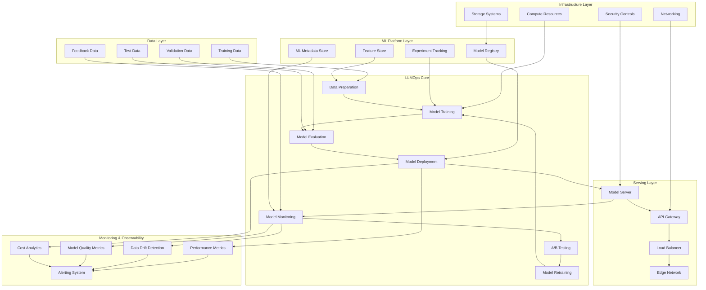

## Distributed Training Architecture

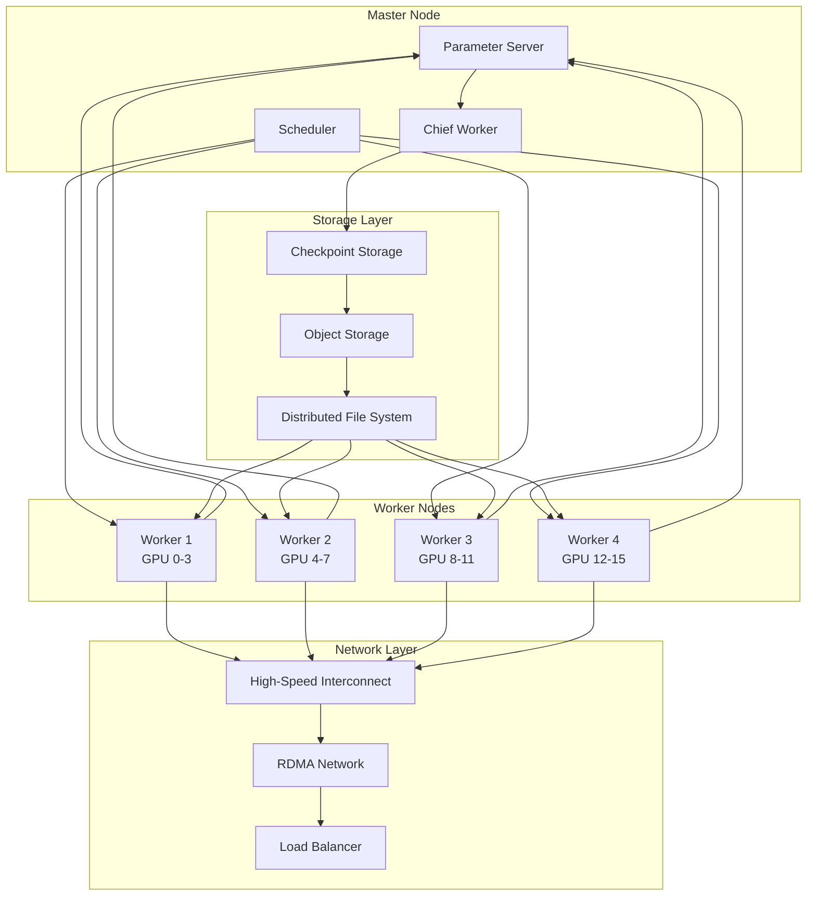

## Model Training Pipeline

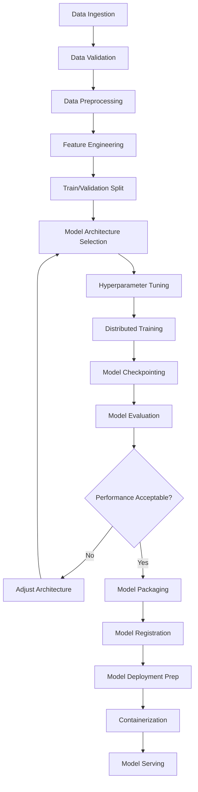

## Fine-tuning Workflow

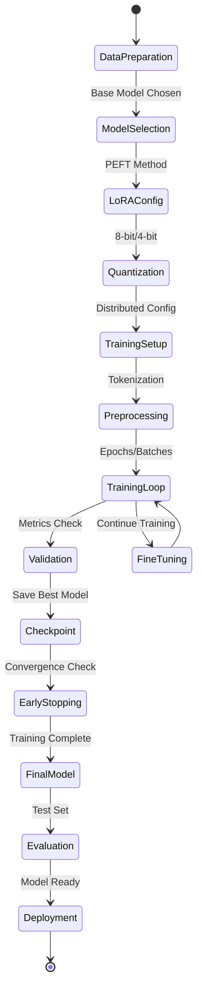

## Model Deployment Patterns

```mermaid
graph TB
    subgraph "Blue-Green Deployment"
        BG1[Blue Environment<br/>v1.0]
        BG2[Green Environment<br/>v1.1]
        BG3[Load Balancer]
        BG4[Traffic Switch]
    end

    subgraph "Canary Deployment"
        C1[Production Traffic<br/>95%]
        C2[Canary Traffic<br/>5%]
        C3[Canary Environment<br/>v1.1]
        C4[Production Environment<br/>v1.0]
        C5[Metrics Monitor]
    end

    subgraph "A/B Testing"
        AB1[User Segment A<br/>Model A]
        AB2[User Segment B<br/>Model B]
        AB3[Experiment Service]
        AB4[Metrics Collection]
        AB5[Statistical Analysis]
    end

    subgraph "Shadow Deployment"
        SD1[Production Traffic]
        SD2[Shadow Environment<br/>v1.1]
        SD3[Response Comparison]
        SD4[Performance Validation]
    end

    BG3 --> BG1
    BG3 --> BG2
    BG4 --> BG3

    C1 --> C4
    C2 --> C3
    C5 --> C2

    AB3 --> AB1
    AB3 --> AB2
    AB1 --> AB4
    AB2 --> AB4
    AB4 --> AB5

    SD1 --> SD2
    SD1 --> SD3
    SD2 --> SD3
    SD3 --> SD4
```

## Model Serving Architecture

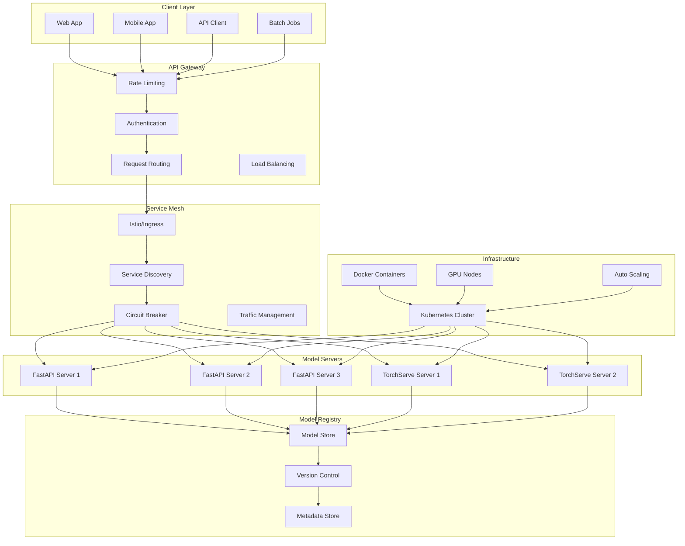

## A/B Testing Framework

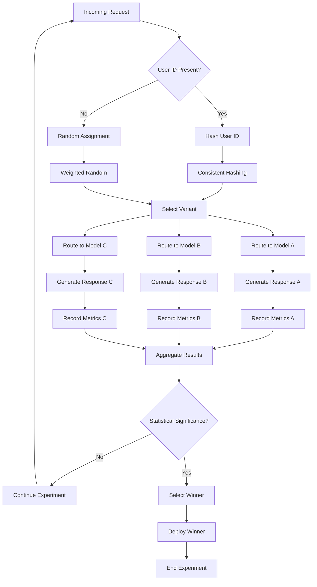

## Monitoring and Alerting System

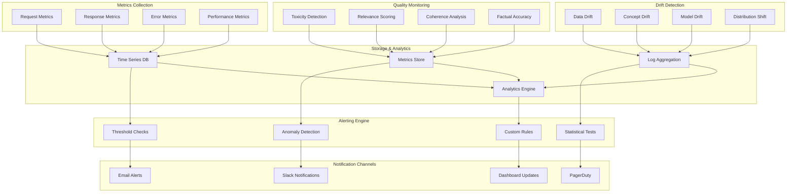

## Cost Optimization Strategies

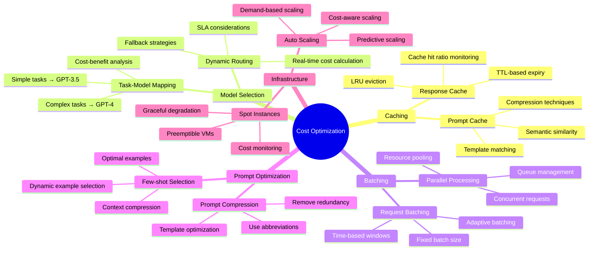

## Auto Scaling Architecture

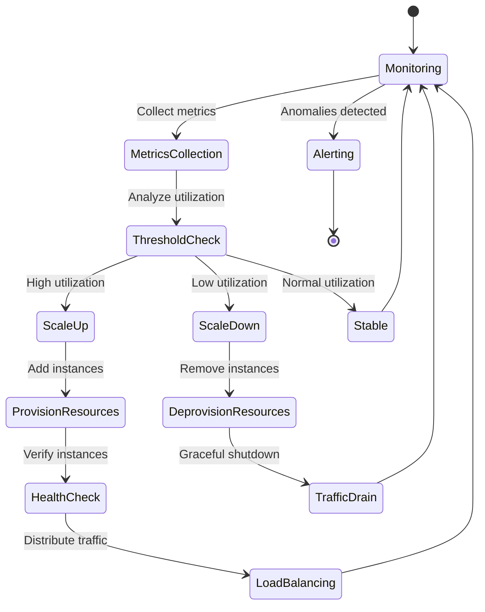

## Model Lifecycle Management

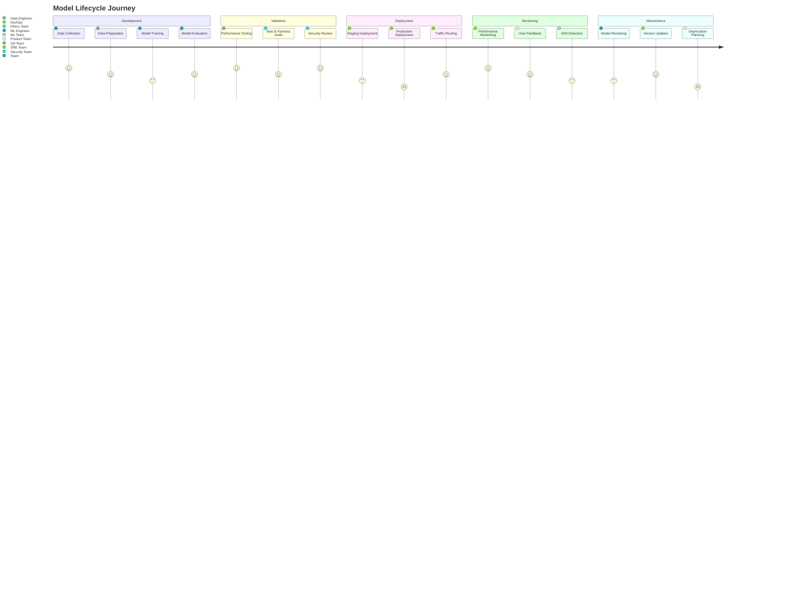

## Quality Assurance Pipeline

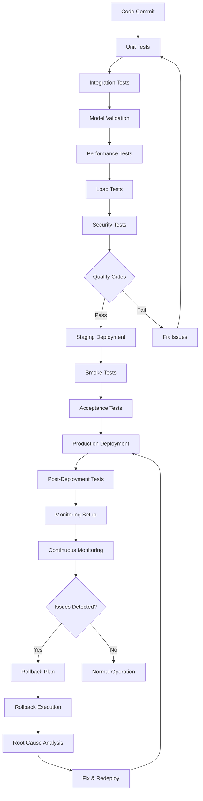

## Security Architecture

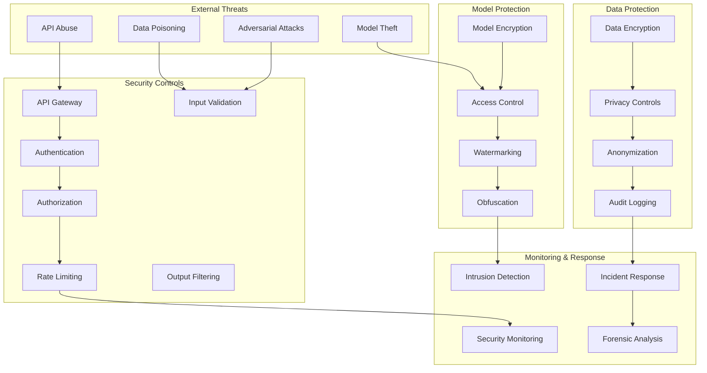

## Cost Analysis Dashboard

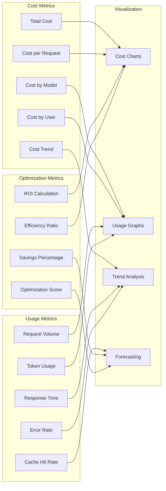

## Disaster Recovery Architecture

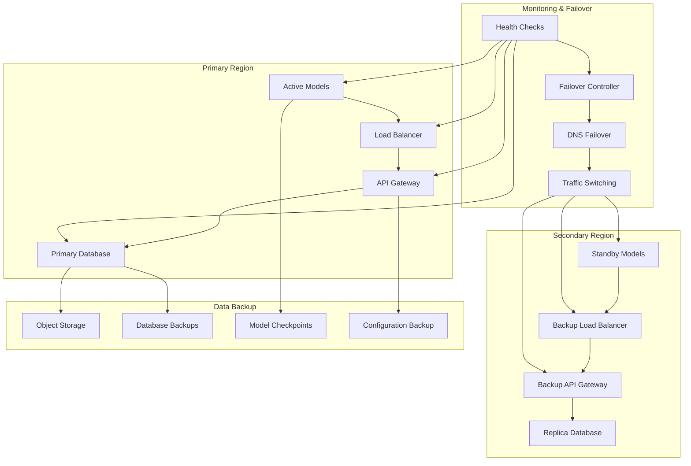

## CI/CD Pipeline for LLMOps

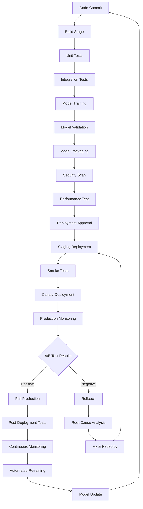

This comprehensive visual guide covers all aspects of LLMOps including architecture, training, deployment, monitoring, cost optimization, and operational workflows. The diagrams provide clear visualizations of complex systems and processes for managing large language models in production environments.