# Large Language Models (LLMs) - Visual Guide

## Architecture Diagrams

### Transformer Architecture Overview

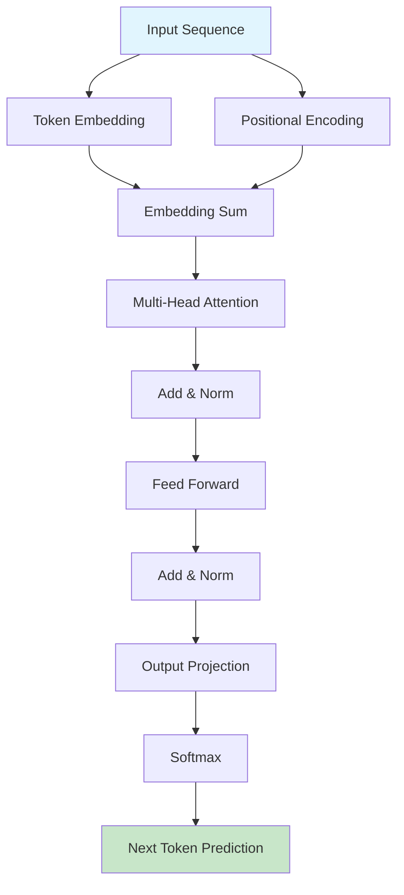

### Multi-Head Attention Mechanism

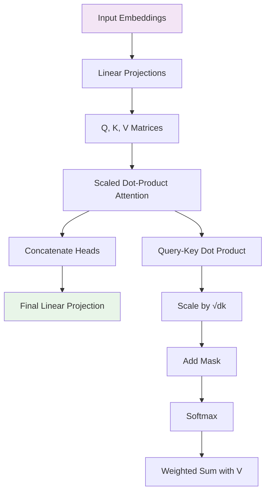

### GPT vs BERT Architecture Comparison

```mermaid
graph TD
    subgraph "GPT (Generative Pre-trained Transformer)"
        A1[Input Tokens] --> B1[Token + Position Embeddings]
        B1 --> C1[Masked Self-Attention]
        C1 --> D1[Feed Forward]
        D1 --> E1[Next Token Prediction]
    end

    subgraph "BERT (Bidirectional Encoder)"
        A2[Input Tokens] --> B2[Token + Position + Segment Embeddings]
        B2 --> C2[Bidirectional Self-Attention]
        C2 --> D2[Feed Forward]
        D2 --> E2[[CLS] Token Classification]
        D2 --> F2[Masked Token Prediction]
    end

    style A1 fill:#e3f2fd
    style A2 fill:#f3e5f5
    style E1 fill:#c8e6c9
    style E2 fill:#ffcdd2
```

## Training Pipeline

### Complete LLM Training Workflow

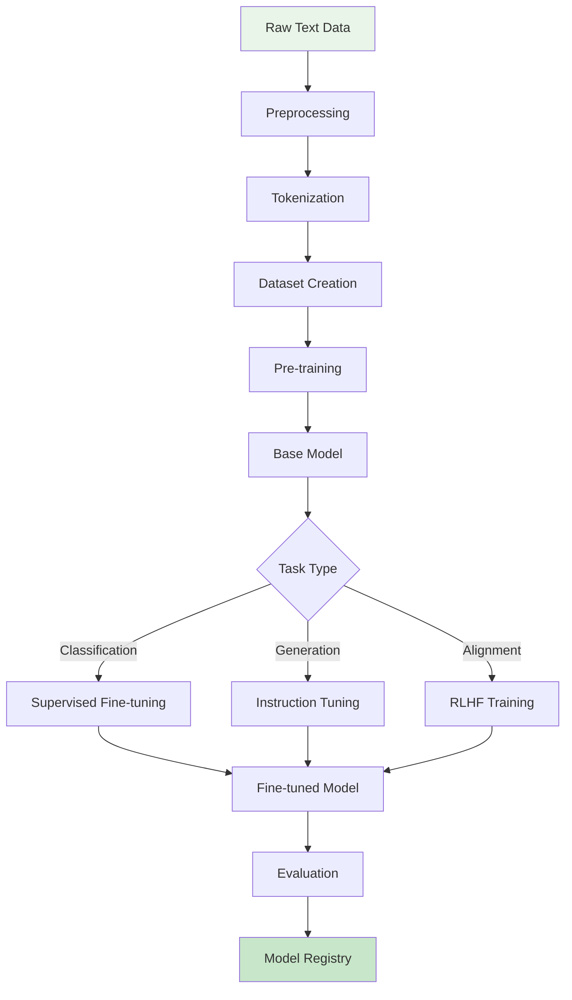

### Pre-training Objectives

```mermaid
graph TD
    subgraph "Masked Language Modeling (BERT)"
        A1[Input Text] --> B1[Mask 15% Tokens]
        B1 --> C1[Predict Masked Tokens]
        C1 --> D1[MLM Loss]
    end

    subgraph "Next Sentence Prediction (BERT)"
        A2[Sentence A + Sentence B] --> B2[Is Next Sentence?]
        B2 --> C2[Binary Classification]
        C2 --> D2[NSP Loss]
    end

    subgraph "Causal Language Modeling (GPT)"
        A3[Input Sequence] --> B3[Predict Next Token]
        B3 --> C3[Shifted Prediction]
        C3 --> D3[CLM Loss]
    end

    style A1 fill:#e3f2fd
    style A2 fill:#f3e5f5
    style A3 fill:#fff3e0
```

### Reinforcement Learning from Human Feedback (RLHF)

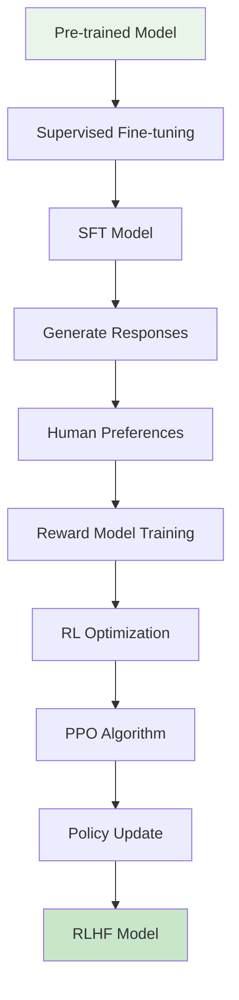

## Fine-tuning Techniques

### Parameter-Efficient Fine-tuning Methods

```mermaid
graph TD
    subgraph "Full Fine-tuning"
        A1[Pre-trained Model] --> B1[Update All Parameters]
        B1 --> C1[High Memory Usage]
        C1 --> D1[Slower Training]
    end

    subgraph "LoRA (Low-Rank Adaptation)"
        A2[Pre-trained Model] --> B2[Freeze Original Weights]
        B2 --> C2[Add Low-Rank Matrices]
        C2 --> D2[Train Only LoRA Parameters]
        D2 --> E2[Memory Efficient]
    end

    subgraph "Prefix Tuning"
        A3[Pre-trained Model] --> B3[Freeze Model Weights]
        B3 --> C3[Add Trainable Prefix]
        C3 --> D3[Task-Specific Adaptation]
    end

    subgraph "Prompt Tuning"
        A4[Pre-trained Model] --> B4[Freeze All Weights]
        B4 --> C4[Train Soft Prompts]
        C4 --> D4[Minimal Parameters]
    end

    style A1 fill:#ffebee
    style A2 fill:#e8f5e8
    style A3 fill:#e3f2fd
    style A4 fill:#fff3e0
```

## Retrieval-Augmented Generation (RAG)

### RAG System Architecture

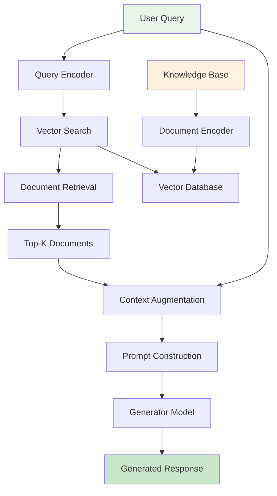

### RAG vs Fine-tuning Comparison

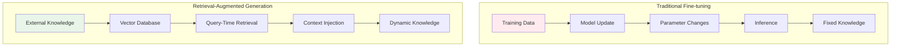

## Deployment Patterns

### Model Serving Architecture

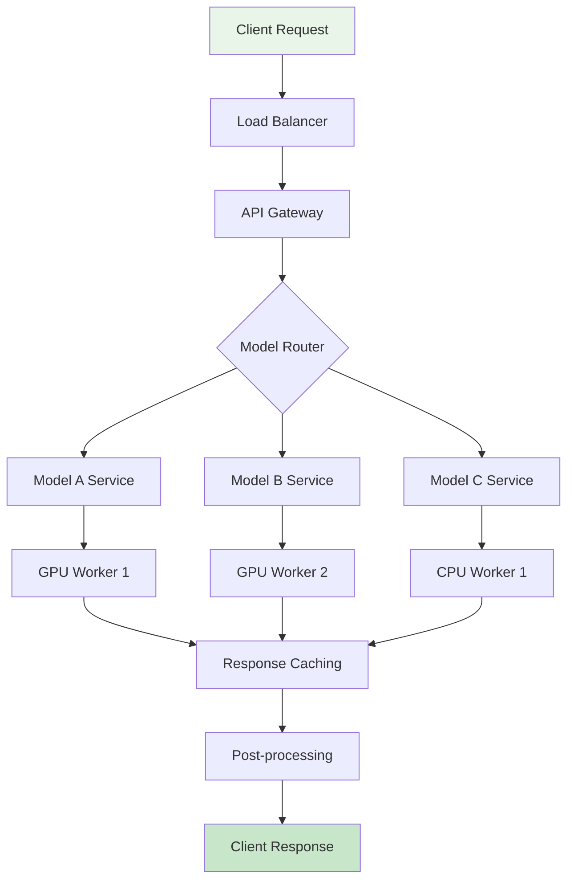

### Model Optimization Pipeline

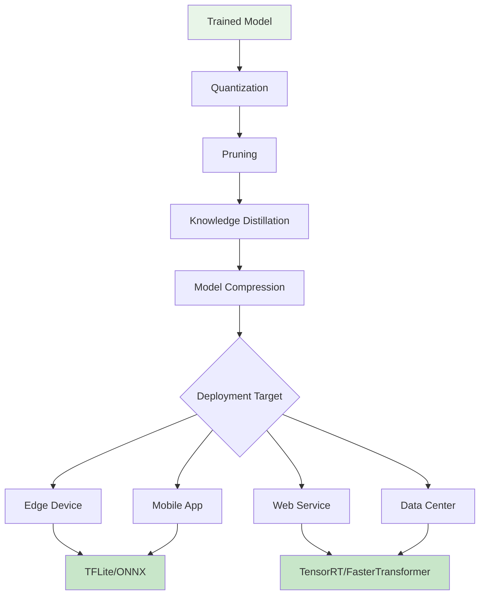

### Batch Inference Optimization

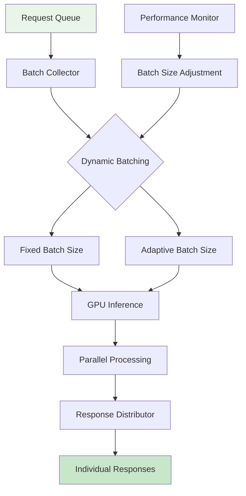

## Evaluation Frameworks

### LLM Evaluation Metrics

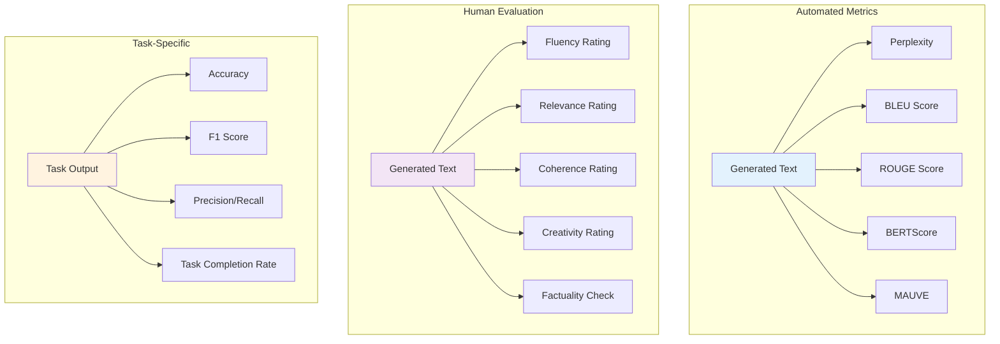

### Benchmark Suites

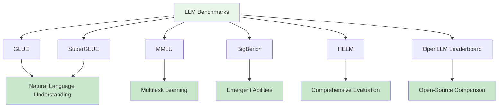

## Safety and Ethics

### AI Safety Framework

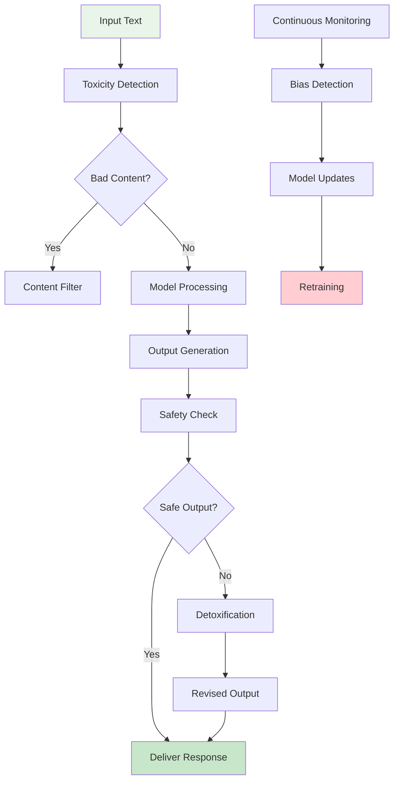

### Bias Detection and Mitigation

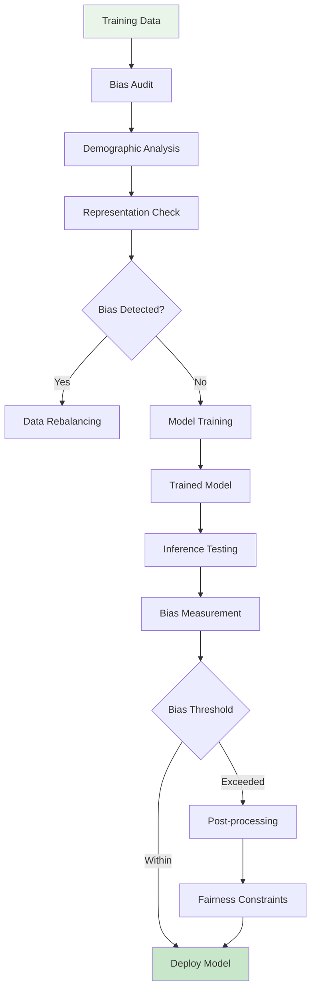

### Constitutional AI Approach

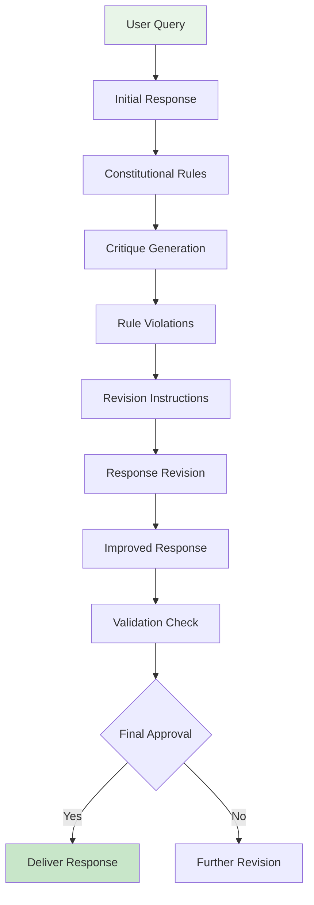

## Model Compression Techniques

### Knowledge Distillation

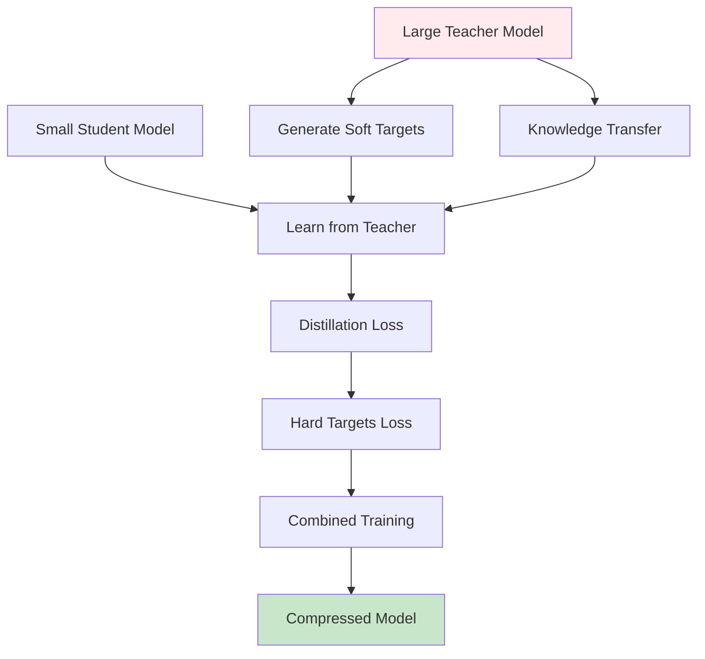

### Quantization Methods

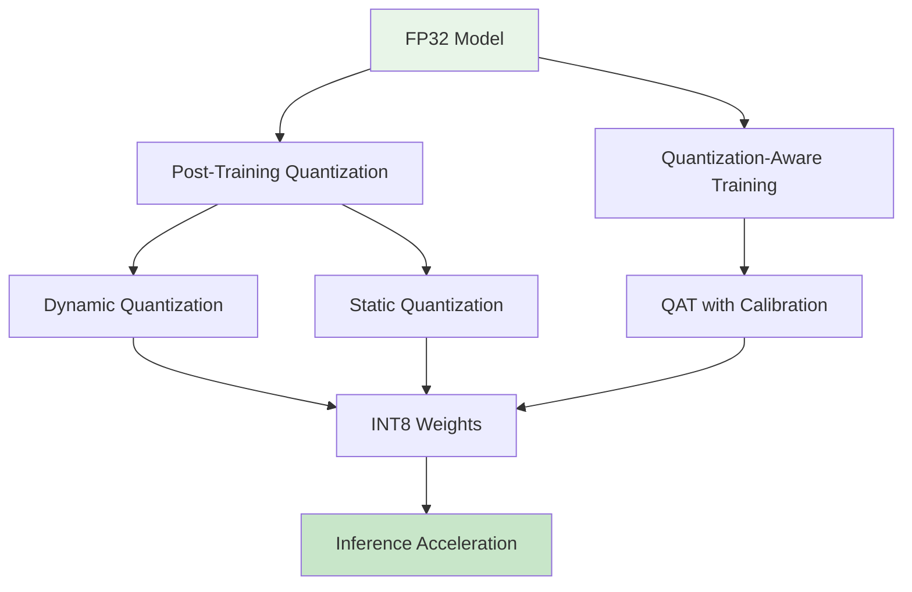

## Scaling and Infrastructure

### Multi-GPU Training

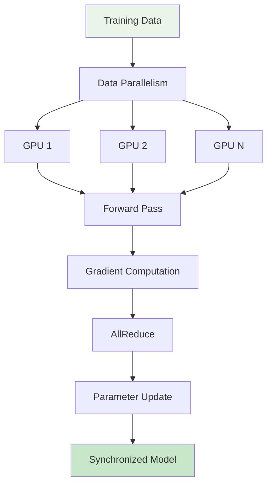

### Model Parallelism Strategies

```mermaid
graph TD
    subgraph "Pipeline Parallelism"
        A1[Layer 1] --> B1[GPU 1]
        B1 --> C1[Layer 2] --> D1[GPU 2]
        D1 --> E1[Layer 3] --> F1[GPU 3]
    end

    subgraph "Tensor Parallelism"
        A2[Attention Matrix] --> B2[Split Across GPUs]
        B2 --> C2[Parallel Computation]
        C2 --> D2[AllReduce]
        D2 --> E2[Reconstructed Output]
    end

    subgraph "Sequence Parallelism"
        A3[Long Sequence] --> B3[Split Sequences]
        B3 --> C3[Parallel Processing]
        C3 --> D3[Concatenate Results]
    end

    style A1 fill:#e3f2fd
    style A2 fill:#f3e5f5
    style A3 fill:#fff3e0
```

## Industry Applications

### LLM Application Architecture

```mermaid
graph TD
    A[User Interface] --> B[Application Layer]
    B --> C[LLM Service Layer]

    C --> D[Prompt Engineering]
    C --> E[Context Management]
    C --> F[Response Processing]

    D --> G[Base LLM Model]
    E --> G
    F --> G

    G --> H[Model Orchestration]
    H --> I[Multiple Models]
    H --> J[Model Switching]

    I --> K[Task-Specific Models]
    J --> L[Load Balancing]

    style A fill:#e8f5e8
    style K fill:#c8e6c9
    style L fill:#c8e6c9
```

### Enterprise LLM Deployment

```mermaid
graph TD
    A[Enterprise Data] --> B[Data Pipeline]
    B --> C[Vector Database]
    B --> D[Knowledge Graph]

    E[User Query] --> F[Security Layer]
    F --> G[Access Control]
    G --> H[Query Processing]

    H --> I[RAG System]
    I --> C
    I --> D

    I --> J[LLM Inference]
    J --> K[Response Validation]
    K --> L[Audit Logging]

    L --> M[User Response]

    style A fill:#e8f5e8
    style M fill:#c8e6c9
```

This visual guide provides comprehensive diagrams covering the key concepts, architectures, training methods, deployment patterns, and ethical considerations for Large Language Models. Each diagram illustrates complex concepts in an accessible way, helping developers and practitioners understand the fundamental building blocks and advanced techniques in LLM development and deployment.
