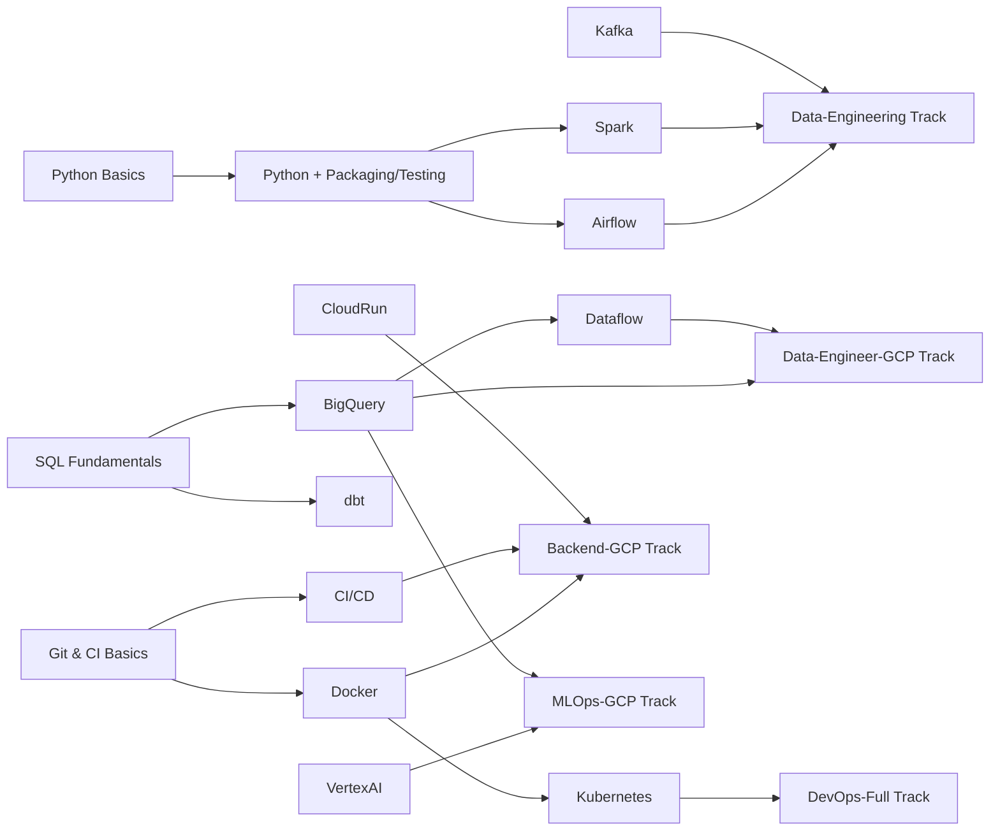

# Learning Tracks Overview

## Tracks
- **Data Engineer on GCP** — 3 weeks — GCS → BQ → Dataflow → Pub/Sub → Airflow/dbt → Monitoring
- **Backend Engineer on GCP** — 3 weeks — Cloud Build → Cloud Run → Cloud SQL/Spanner → IAM/VPC → LB → Observability
- **MLOps/LLMOps Engineer** — 4 weeks — Vertex/AutoML/BQML → Pipelines → Registry → Monitoring → RAG/LLMs
- **Full DevOps Stack** — 4 weeks — Docker → Kubernetes → Terraform → CI/CD (GHA/Jenkins) → Monitoring/Security
- **Data Engineering Stack** — 4 weeks — Spark → Kafka → Airflow → dbt → Data Quality → Observability

## How to Choose
- New to cloud + data: start **Data Engineer on GCP**.
- Backend services on GCP: pick **Backend Engineer on GCP**.
- Shipping ML/LLM to prod: pick **MLOps/LLMOps Engineer**.
- Platform/infra focus: pick **Full DevOps Stack**.
- Broad data engineering (non-cloud-specific): pick **Data Engineering Stack**.

## Prerequisite Dependency Graph

## What’s Inside Each Track
- Prerequisites, duration, day-by-day tasks
- Milestones per week
- Capstone project description
- Links to relevant guides/roadmaps

## Next Steps
1) Pick a track above.
2) Follow the track’s daily plan in its `track.md`.
3) Do the linked projects (starter → intermediate → capstone) as they land in `Projects/`.
4) Validate with mastery checkpoints (quizzes, scenarios, flashcards) once available.

