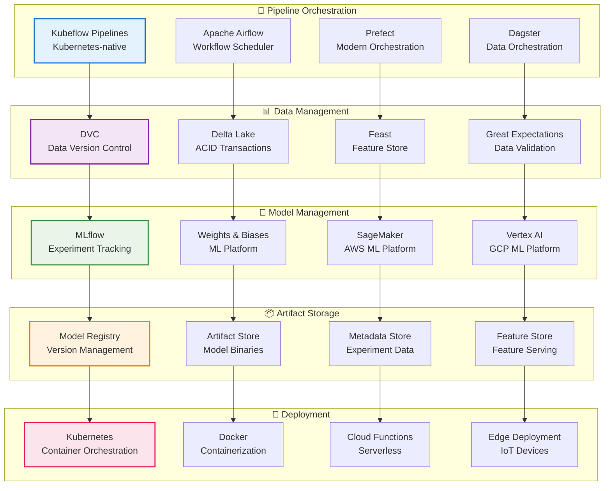
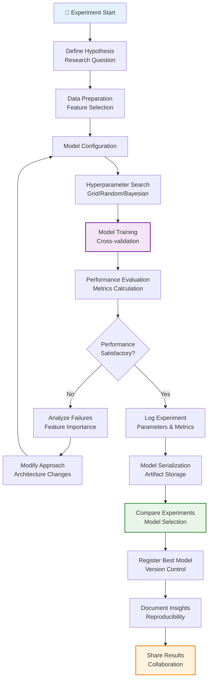
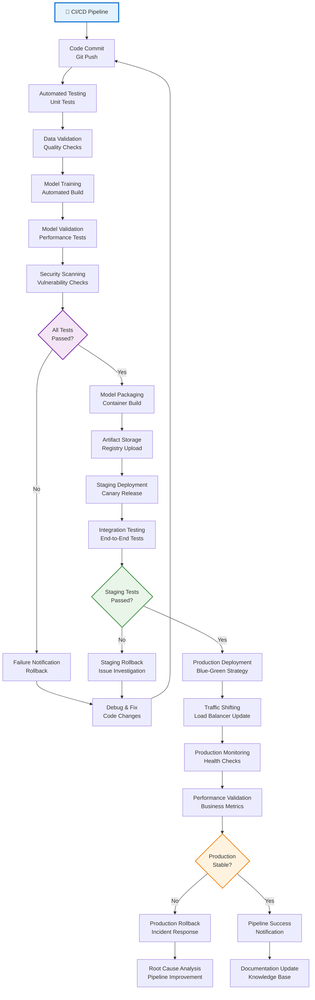
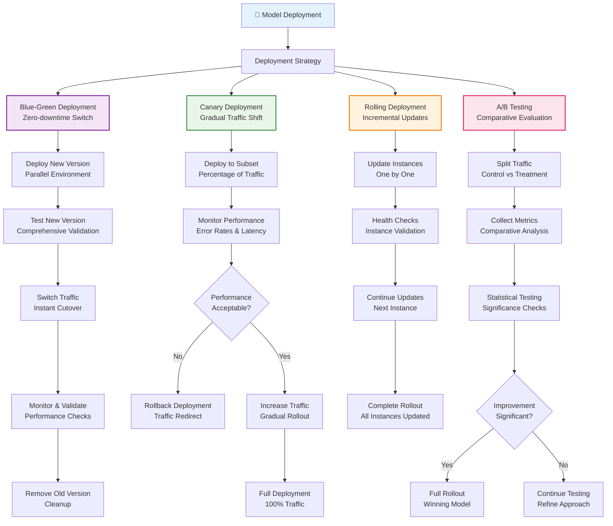
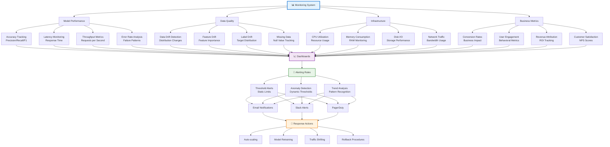
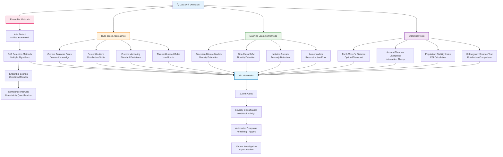
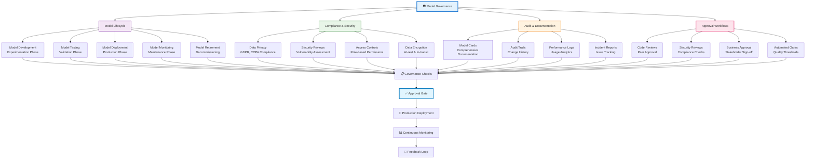
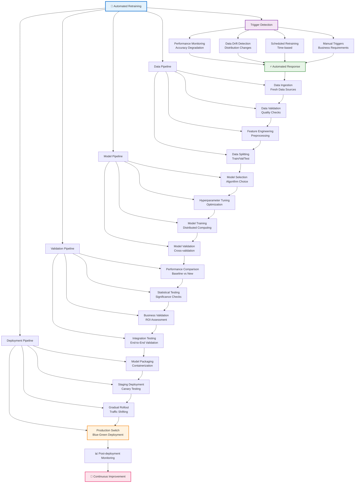

# MLOps Visual Architecture Guide

## MLOps Lifecycle Overview

```mermaid
graph TD
    A[MLOps Lifecycle] --> B[Development & Experimentation]
    A --> C[CI/CD & Automation]
    A --> D[Deployment & Serving]
    A --> E[Monitoring & Observability]
    A --> F[Governance & Compliance]

    B --> G[Data Preparation<br/>Feature Engineering]
    B --> H[Model Training<br/>Hyperparameter Tuning]
    B --> I[Model Evaluation<br/>Validation]
    B --> J[Experiment Tracking<br/>Version Control]

    C --> K[Automated Testing<br/>Data Validation]
    C --> L[Pipeline Orchestration<br/>Workflow Automation]
    C --> M[Model Registry<br/>Artifact Management]
    C --> N[Continuous Integration<br/>Code Quality]

    D --> O[Model Packaging<br/>Containerization]
    D --> P[Model Deployment<br/>A/B Testing]
    D --> Q[Scalable Serving<br/>Load Balancing]
    D --> R[Model Updates<br/>Rolling Deployment]

    E --> S[Performance Monitoring<br/>Accuracy Tracking]
    E --> T[Data Drift Detection<br/>Concept Drift]
    E --> U[Business Metrics<br/>ROI Measurement]
    E --> V[Automated Alerts<br/>Incident Response]

    F --> W[Model Governance<br/>Approval Workflows]
    F --> X[Audit Trails<br/>Compliance Logging]
    F --> Y[Security & Access<br/>Data Privacy]
    F --> Z[Documentation<br/>Model Cards]

    style A fill:#e3f2fd,stroke:#1976d2,stroke-width:3px
    style B fill:#f3e5f5,stroke:#7b1fa2,stroke-width:2px
    style C fill:#e8f5e8,stroke:#388e3c,stroke-width:2px
    style D fill:#fff3e0,stroke:#f57c00,stroke-width:2px
    style E fill:#fce4ec,stroke:#e91e63,stroke-width:2px
    style F fill:#e1f5fe,stroke:#0277bd,stroke-width:2px
```

## ML Pipeline Architecture

## Experiment Tracking Workflow

## CI/CD Pipeline for ML

## Model Deployment Strategies

## Monitoring and Alerting System

## Data Drift Detection

## Model Governance Framework

## Automated Retraining Pipeline

## MLOps Maturity Model

```mermaid
graph TD
    A[MLOps Maturity Levels] --> B[Level 0: No MLOps<br/>Manual Processes]
    A --> C[Level 1: DevOps for ML<br/>Basic Automation]
    A --> D[Level 2: Automated ML Pipelines<br/>CI/CD Integration]
    A --> E[Level 3: ML Platform<br/>Centralized Tools]
    A --> F[Level 4: Continuous Learning<br/>Adaptive Systems]
    A --> G[Level 5: AI Factory<br/>Autonomous Operation]

    B --> H[Manual experimentation<br/>Jupyter notebooks]
    B --> I[Manual deployment<br/>One-off scripts]
    B --> J[No monitoring<br/>Reactive maintenance]
    B --> K[No version control<br/>Lost experiments]

    C --> L[Basic CI/CD<br/>Automated testing]
    C --> M[Model versioning<br/>Artifact storage]
    C --> N[Manual monitoring<br/>Basic alerts]
    C --> O[Team collaboration<br/>Shared tools]

    D --> P[Automated pipelines<br/>Kubeflow/Airflow]
    D --> Q[Model registry<br/>Approval workflows]
    D --> R[Automated monitoring<br/>Performance tracking]
    D --> S[Data versioning<br/>DVC integration]

    E --> T[ML platform<br/>Vertex AI/SageMaker]
    E --> U[Feature store<br/>Feature management]
    E --> V[Automated retraining<br/>Continuous learning]
    E --> W[Governance framework<br/>Compliance automation]

    F --> X[Adaptive systems<br/>Online learning]
    F --> Y[Multi-model serving<br/>Ensemble methods]
    F --> Z[Advanced monitoring<br/>Predictive maintenance]
    F --> AA[AutoML integration<br/>Automated feature engineering]

    G --> BB[Autonomous operation<br/>Self-healing systems]
    G --> CC[AI model factory<br/>End-to-end automation]
    G --> DD[Advanced analytics<br/>Model interpretability]
    G --> EE[Cross-domain learning<br/>Transfer learning]

    style A fill:#e3f2fd,stroke:#1976d2,stroke-width:3px
    style B fill:#ffebee,stroke:#c62828,stroke-width:2px
    style C fill:#fff3e0,stroke:#ef6c00,stroke-width:2px
    style D fill:#e8f5e8,stroke:#2e7d32,stroke-width:2px
    style E fill:#e3f2fd,stroke:#1565c0,stroke-width:2px
    style F fill:#f3e5f5,stroke:#6a1b9a,stroke-width:2px
    style G fill:#fce4ec,stroke:#ad1457,stroke-width:2px
```

## Summary

MLOps visual architecture reveals a comprehensive framework that transforms machine learning from ad-hoc experimentation to reliable, production-ready systems:

- **Lifecycle Management**: From experimentation through deployment and monitoring
- **Pipeline Automation**: Orchestrated workflows for data, training, and deployment
- **Experiment Tracking**: Systematic logging and versioning of ML artifacts
- **CI/CD Integration**: Automated testing and deployment pipelines
- **Deployment Strategies**: Safe rollout patterns with rollback capabilities
- **Monitoring Systems**: Comprehensive observability and alerting
- **Drift Detection**: Proactive identification of data and model degradation
- **Governance Framework**: Compliance, security, and approval workflows
- **Automated Retraining**: Continuous learning and model updates
- **Maturity Evolution**: Progressive improvement from manual to autonomous operations

The MLOps landscape represents the industrialization of machine learning, enabling organizations to scale AI capabilities while maintaining reliability, compliance, and business value.
