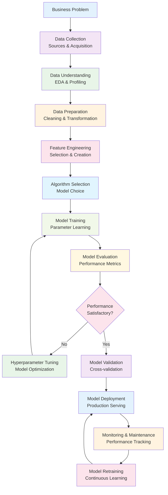

# Machine Learning Visual Architecture Guide

## ML Learning Paradigms

```mermaid
graph TD
    A[Machine Learning] --> B[Supervised Learning<br/>Labeled Data<br/>Prediction Tasks]
    A --> C[Unsupervised Learning<br/>Unlabeled Data<br/>Pattern Discovery]
    A --> D[Reinforcement Learning<br/>Interactive Learning<br/>Decision Making]
    A --> E[Semi-supervised Learning<br/>Partial Labels<br/>Hybrid Approach]

    B --> F[Classification<br/>Discrete Categories<br/>Binary/Multi-class]
    B --> G[Regression<br/>Continuous Values<br/>Prediction Lines]
    B --> H[Ranking<br/>Preference Ordering<br/>Recommendation Systems]

    C --> I[Clustering<br/>Group Discovery<br/>Customer Segmentation]
    C --> J[Dimensionality Reduction<br/>Feature Extraction<br/>Data Compression]
    C --> K[Anomaly Detection<br/>Outlier Identification<br/>Fraud Detection]

    D --> L[Policy Learning<br/>Action Selection<br/>Game Playing]
    D --> M[Value Learning<br/>State Evaluation<br/>Planning]
    D --> N[Model-based RL<br/>World Modeling<br/>Simulation]

    E --> O[Self-training<br/>Pseudo-labeling<br/>Confidence Thresholding]
    E --> P[Co-training<br/>Multi-view Learning<br/>Feature Split]

    style A fill:#e3f2fd
    style B fill:#f3e5f5
    style C fill:#e8f5e8
    style D fill:#fff3e0
    style E fill:#fce4ec
    style F fill:#e1f5fe
    style G fill:#f1f8e9
    style H fill:#fff8e1
    style I fill:#fce4ec
    style J fill:#e8f5e8
    style K fill:#f3e5f5
    style L fill:#e3f2fd
    style M fill:#fff3e0
    style N fill:#fce4ec
    style O fill:#e1f5fe
    style P fill:#f1f8e9
```

## ML Workflow Pipeline

## Supervised Learning Algorithms

```mermaid
graph TD
    A[Supervised Learning] --> B[Linear Models<br/>Simple & Interpretable]
    A --> C[Tree-Based Models<br/>Non-linear & Robust]
    A --> D[Ensemble Methods<br/>Combining Multiple Models]
    A --> E[Neural Networks<br/>Deep Learning]

    B --> F[Linear Regression<br/>Continuous Prediction]
    B --> G[Logistic Regression<br/>Binary Classification]
    B --> H[Ridge/Lasso<br/>Regularized Linear]

    C --> I[Decision Trees<br/>Rule-based Learning]
    C --> J[Random Forest<br/>Bagging Ensemble]
    C --> K[Gradient Boosting<br/>Sequential Learning]

    D --> L[Voting Classifier<br/>Majority Vote]
    D --> M[Bagging<br/>Bootstrap Aggregation]
    D --> N[Boosting<br/>Sequential Improvement]
    D --> O[Stacking<br/>Meta-learning]

    E --> P[Feedforward NN<br/>Universal Approximation]
    E --> Q[Convolutional NN<br/>Image Processing]
    E --> R[Recurrent NN<br/>Sequence Modeling]
    E --> S[Transformer<br/>Attention Mechanism]

    style A fill:#e3f2fd
    style B fill:#f3e5f5
    style C fill:#e8f5e8
    style D fill:#fff3e0
    style E fill:#fce4ec
    style F fill:#e1f5fe
    style G fill:#f1f8e9
    style H fill:#fff8e1
    style I fill:#fce4ec
    style J fill:#e8f5e8
    style K fill:#f3e5f5
    style L fill:#e3f2fd
    style M fill:#fff3e0
    style N fill:#fce4ec
    style O fill:#e1f5fe
    style P fill:#f1f8e9
    style Q fill:#fff8e1
    style R fill:#fce4ec
    style S fill:#e8f5e8
```

## Unsupervised Learning Algorithms

```mermaid
graph TD
    A[Unsupervised Learning] --> B[Clustering<br/>Group Discovery]
    A --> C[Dimensionality Reduction<br/>Feature Extraction]
    A --> D[Anomaly Detection<br/>Outlier Finding]
    A --> E[Association Rules<br/>Pattern Mining]

    B --> F[Partitioning<br/>K-means, K-medoids]
    B --> G[Hierarchical<br/>Agglomerative, Divisive]
    B --> H[Density-based<br/>DBSCAN, OPTICS]
    B --> I[Distribution-based<br/>Gaussian Mixture]
    B --> J[Grid-based<br/>STING, CLIQUE]

    C --> K[Linear Methods<br/>PCA, ICA]
    C --> L[Non-linear Methods<br/>t-SNE, UMAP]
    C --> M[Manifold Learning<br/>Isomap, LLE]
    C --> N[Autoencoders<br/>Neural Compression]

    D --> O[Statistical Methods<br/>Z-score, Mahalanobis]
    D --> P[Distance-based<br/>KNN, LOF]
    D --> Q[Density-based<br/>Isolation Forest]
    D --> R[Reconstruction<br/>Autoencoder Errors]

    E --> S[Apriori Algorithm<br/>Frequent Itemsets]
    E --> T[FP-Growth<br/>Tree-based Mining]
    E --> U[ECLAT<br/>Vertical Mining]
    E --> V[Association Rules<br/>Confidence, Lift]

    style A fill:#e3f2fd
    style B fill:#f3e5f5
    style C fill:#e8f5e8
    style D fill:#fff3e0
    style E fill:#fce4ec
    style F fill:#e1f5fe
    style G fill:#f1f8e9
    style H fill:#fff8e1
    style I fill:#fce4ec
    style J fill:#e8f5e8
    style K fill:#f3e5f5
    style L fill:#e3f2fd
    style M fill:#fff3e0
    style N fill:#fce4ec
    style O fill:#e1f5fe
    style P fill:#f1f8e9
    style Q fill:#fff8e1
    style R fill:#fce4ec
    style S fill:#e8f5e8
    style T fill:#f3e5f5
    style U fill:#e3f2fd
    style V fill:#fff3e0
```

## Model Evaluation Framework

```mermaid
graph TD
    A[Model Evaluation] --> B[Data Splitting<br/>Train/Validation/Test]
    A --> C[Cross-Validation<br/>K-fold, Stratified]
    A --> D[Performance Metrics<br/>Accuracy, Precision, Recall]
    A --> E[Error Analysis<br/>Confusion Matrix, Residuals]

    B --> F[Holdout Method<br/>Simple Split]
    B --> G[Train/Val/Test<br/>Three-way Split]
    B --> H[Time Series Split<br/>Temporal Validation]

    C --> I[K-fold CV<br/>Random Sampling]
    C --> J[Stratified K-fold<br/>Class Balance]
    C --> K[Time Series CV<br/>Rolling Window]
    C --> L[Group K-fold<br/>Group Separation]

    D --> M[Classification<br/>Accuracy, F1, AUC]
    D --> N[Regression<br/>MAE, RMSE, R²]
    D --> O[Ranking<br/>NDCG, MAP]
    D --> P[Clustering<br/>Silhouette, Calinski-Harabasz]

    E --> Q[Error Types<br/>False Positives, False Negatives]
    E --> R[Bias-Variance<br/>Underfitting, Overfitting]
    E --> S[Data Issues<br/>Class Imbalance, Outliers]

    style A fill:#e3f2fd
    style B fill:#f3e5f5
    style C fill:#e8f5e8
    style D fill:#fff3e0
    style E fill:#fce4ec
    style F fill:#e1f5fe
    style G fill:#f1f8e9
    style H fill:#fff8e1
    style I fill:#fce4ec
    style J fill:#e8f5e8
    style K fill:#f3e5f5
    style L fill:#e3f2fd
    style M fill:#fff3e0
    style N fill:#fce4ec
    style O fill:#e1f5fe
    style P fill:#f1f8e9
    style Q fill:#fff8e1
    style R fill:#fce4ec
    style S fill:#e8f5e8
```

## Deep Learning Architecture

```mermaid
graph TD
    A[Deep Learning] --> B[Neural Network Basics<br/>Neurons & Layers]
    A --> C[Training Process<br/>Forward & Backward Pass]
    A --> D[Network Architectures<br/>CNN, RNN, Transformer]
    A --> E[Advanced Techniques<br/>Regularization, Optimization]

    B --> F[Artificial Neuron<br/>Weighted Sum + Activation]
    B --> G[Layer Types<br/>Dense, Convolutional, Recurrent]
    B --> H[Activation Functions<br/>ReLU, Sigmoid, Tanh]
    B --> I[Loss Functions<br/>MSE, Cross-entropy]

    C --> J[Forward Propagation<br/>Input → Output]
    C --> K[Backpropagation<br/>Gradient Computation]
    C --> L[Gradient Descent<br/>Parameter Updates]
    C --> M[Optimization Algorithms<br/>Adam, SGD, RMSprop]

    D --> N[CNN Architecture<br/>Convolution → Pooling → Dense]
    D --> O[RNN Architecture<br/>Sequence Processing]
    D --> P[Transformer Architecture<br/>Attention Mechanism]
    D --> Q[Autoencoder<br/>Unsupervised Learning]

    E --> R[Regularization<br/>Dropout, Batch Norm]
    E --> S[Data Augmentation<br/>Image Transformations]
    E --> T[Transfer Learning<br/>Pre-trained Models]
    E --> U[Ensemble Methods<br/>Model Averaging]

    style A fill:#e3f2fd
    style B fill:#f3e5f5
    style C fill:#e8f5e8
    style D fill:#fff3e0
    style E fill:#fce4ec
    style F fill:#e1f5fe
    style G fill:#f1f8e9
    style H fill:#fff8e1
    style I fill:#fce4ec
    style J fill:#e8f5e8
    style K fill:#f3e5f5
    style L fill:#e3f2fd
    style M fill:#fff3e0
    style N fill:#fce4ec
    style O fill:#e1f5fe
    style P fill:#f1f8e9
    style Q fill:#fff8e1
    style R fill:#fce4ec
    style S fill:#e8f5e8
    style T fill:#f3e5f5
    style U fill:#e3f2fd
```

## Feature Engineering Process

```mermaid
graph TD
    A[Feature Engineering] --> B[Data Understanding<br/>Domain Knowledge]
    A --> C[Feature Creation<br/>Transformation & Combination]
    A --> D[Feature Selection<br/>Dimensionality Reduction]
    A --> E[Feature Validation<br/>Importance & Correlation]

    B --> F[Exploratory Analysis<br/>Statistics & Visualization]
    B --> G[Domain Expertise<br/>Business Rules]
    B --> H[Data Quality Assessment<br/>Missing Values, Outliers]

    C --> I[Numerical Features<br/>Scaling, Binning, Polynomials]
    C --> J[Categorical Features<br/>Encoding, Grouping]
    C --> K[Date/Time Features<br/>Extraction, Lags]
    C --> L[Text Features<br/>TF-IDF, Embeddings]

    D --> M[Filter Methods<br/>Correlation, Mutual Information]
    D --> N[Wrapper Methods<br/>Recursive Feature Elimination]
    D --> O[Embedded Methods<br/>LASSO, Tree Importance]
    D --> P[Dimensionality Reduction<br/>PCA, t-SNE]

    E --> Q[Feature Importance<br/>Permutation, SHAP]
    E --> R[Cross-validation<br/>Stability Testing]
    E --> S[Business Validation<br/>Interpretability]

    style A fill:#e3f2fd
    style B fill:#f3e5f5
    style C fill:#e8f5e8
    style D fill:#fff3e0
    style E fill:#fce4ec
    style F fill:#e1f5fe
    style G fill:#f1f8e9
    style H fill:#fff8e1
    style I fill:#fce4ec
    style J fill:#e8f5e8
    style K fill:#f3e5f5
    style L fill:#e3f2fd
    style M fill:#fff3e0
    style N fill:#fce4ec
    style O fill:#e1f5fe
    style P fill:#f1f8e9
    style Q fill:#fff8e1
    style R fill:#fce4ec
    style S fill:#e8f5e8
```

## MLOps Pipeline

```mermaid
graph TD
    A[MLOps Pipeline] --> B[Development<br/>Experimentation]
    A --> C[CI/CD<br/>Automated Testing]
    A --> D[Deployment<br/>Model Serving]
    A --> E[Monitoring<br/>Performance Tracking]
    A --> F[Governance<br/>Compliance & Security]

    B --> G[Version Control<br/>Code & Data]
    B --> H[Experiment Tracking<br/>MLflow, Weights & Biases]
    B --> I[Model Registry<br/>Version Management]
    B --> J[Feature Store<br/>Feature Management]

    C --> K[Automated Testing<br/>Unit & Integration Tests]
    C --> L[Model Validation<br/>Performance Checks]
    C --> M[Security Scanning<br/>Vulnerability Assessment]
    C --> N[Continuous Training<br/>Automated Retraining]

    D --> O[Model Packaging<br/>Containerization]
    D --> P[Model Serving<br/>REST APIs, Batch]
    D --> Q[A/B Testing<br/>Model Comparison]
    D --> R[Canary Deployment<br/>Gradual Rollout]

    E --> S[Performance Monitoring<br/>Accuracy, Latency]
    E --> T[Data Drift Detection<br/>Distribution Changes]
    E --> U[Model Degradation<br/>Retraining Triggers]
    E --> V[Business Metrics<br/>ROI, User Engagement]

    F --> W[Model Governance<br/>Lineage & Audit]
    F --> X[Compliance<br/>Regulatory Requirements]
    F --> Y[Security<br/>Access Control, Encryption]
    F --> Z[Documentation<br/>Model Cards, Reports]

    style A fill:#e3f2fd
    style B fill:#f3e5f5
    style C fill:#e8f5e8
    style D fill:#fff3e0
    style E fill:#fce4ec
    style F fill:#e1f5fe
    style G fill:#f1f8e9
    style H fill:#fff8e1
    style I fill:#fce4ec
    style J fill:#e8f5e8
    style K fill:#f3e5f5
    style L fill:#e3f2fd
    style M fill:#fff3e0
    style N fill:#fce4ec
    style O fill:#e1f5fe
    style P fill:#f1f8e9
    style Q fill:#fff8e1
    style R fill:#fce4ec
    style S fill:#e8f5e8
    style T fill:#f3e5f5
    style U fill:#e3f2fd
    style V fill:#fff3e0
    style W fill:#fce4ec
    style X fill:#e1f5fe
    style Y fill:#f1f8e9
    style Z fill:#fff8e1
```

## Bias and Fairness in ML

```mermaid
graph TD
    A[Bias & Fairness] --> B[Types of Bias<br/>Historical, Measurement, Evaluation]
    A --> C[Fairness Metrics<br/>Demographic Parity, Equal Opportunity]
    A --> D[Detection Methods<br/>Bias Audits, Impact Analysis]
    A --> E[Mitigation Strategies<br/>Preprocessing, In-processing, Post-processing]

    B --> F[Historical Bias<br/>Training Data Reflects Past Inequities]
    B --> G[Measurement Bias<br/>Proxy Variables, Sampling Bias]
    B --> H[Evaluation Bias<br/>Performance Metrics Hide Disparities]
    B --> I[Algorithmic Bias<br/>Optimization Objectives]

    C --> J[Demographic Parity<br/>Equal Positive Rates Across Groups]
    C --> K[Equal Opportunity<br/>Equal True Positive Rates]
    C --> L[Equalized Odds<br/>Equal TPR and FPR]
    C --> M[Counterfactual Fairness<br/>Causal Reasoning]

    D --> N[Statistical Tests<br/>Chi-square, Kolmogorov-Smirnov]
    D --> O[Fairness-aware Metrics<br/>Disparate Impact Analysis]
    D --> P[Model Interpretability<br/>SHAP, LIME]
    D --> Q[Adversarial Testing<br/>Stress Testing]

    E --> R[Preprocessing<br/>Reweighting, Resampling]
    E --> S[In-processing<br/>Fairness Constraints]
    E --> T[Post-processing<br/>Threshold Adjustment]
    E --> U[Algorithmic Recourse<br/>Individual Explanations]

    style A fill:#e3f2fd
    style B fill:#f3e5f5
    style C fill:#e8f5e8
    style D fill:#fff3e0
    style E fill:#fce4ec
    style F fill:#e1f5fe
    style G fill:#f1f8e9
    style H fill:#fff8e1
    style I fill:#fce4ec
    style J fill:#e8f5e8
    style K fill:#f3e5f5
    style L fill:#e3f2fd
    style M fill:#fff3e0
    style N fill:#fce4ec
    style O fill:#e1f5fe
    style P fill:#f1f8e9
    style Q fill:#fff8e1
    style R fill:#fce4ec
    style S fill:#e8f5e8
    style T fill:#f3e5f5
    style U fill:#e3f2fd
```

## ML Model Interpretability

```mermaid
graph TD
    A[Model Interpretability] --> B[Global Interpretability<br/>Understanding Overall Model]
    A --> C[Local Interpretability<br/>Understanding Individual Predictions]
    A --> D[Model-Agnostic Methods<br/>Works with Any Model]
    A --> E[Model-Specific Methods<br/>Tailored to Model Type]

    B --> F[Feature Importance<br/>Permutation, Gain-based]
    B --> G[Partial Dependence Plots<br/>Feature Effect Visualization]
    B --> H[Global Surrogate Models<br/>Approximating Black-box Models]
    B --> I[SHAP Summary Plots<br/>Feature Contribution Overview]

    C --> J[LIME<br/>Local Surrogate Models]
    C --> K[SHAP Values<br/>Feature Attribution]
    C --> L[Anchors<br/>High-precision Rules]
    C --> M[Counterfactual Explanations<br/>What-if Scenarios]

    D --> N[Permutation Feature Importance<br/>Random Feature Shuffling]
    D --> O[Partial Dependence<br/>Marginal Feature Effects]
    D --> P[Individual Conditional Expectation<br/>ICE Plots]
    D --> Q[Accumulated Local Effects<br/>ALE Plots]

    E --> R[Decision Tree Visualization<br/>Tree Structure]
    E --> S[Linear Model Coefficients<br/>Feature Weights]
    E --> T[Neural Network Attribution<br/>Saliency Maps]
    E --> U[Rule Extraction<br/>Decision Rules]

    style A fill:#e3f2fd
    style B fill:#f3e5f5
    style C fill:#e8f5e8
    style D fill:#fff3e0
    style E fill:#fce4ec
    style F fill:#e1f5fe
    style G fill:#f1f8e9
    style H fill:#fff8e1
    style I fill:#fce4ec
    style J fill:#e8f5e8
    style K fill:#f3e5f5
    style L fill:#e3f2fd
    style M fill:#fff3e0
    style N fill:#fce4ec
    style O fill:#e1f5fe
    style P fill:#f1f8e9
    style Q fill:#fff8e1
    style R fill:#fce4ec
    style S fill:#e8f5e8
    style T fill:#f3e5f5
    style U fill:#e3f2fd
```

## Summary

Machine Learning's visual architecture reveals a sophisticated ecosystem of algorithms, processes, and best practices:

- **Learning Paradigms**: Supervised, unsupervised, and reinforcement learning approaches
- **Workflow Pipeline**: From problem definition through deployment and monitoring
- **Algorithm Landscape**: Diverse methods from simple linear models to complex neural networks
- **Evaluation Framework**: Rigorous assessment using cross-validation and multiple metrics
- **Deep Learning**: Neural architectures for complex pattern recognition
- **MLOps Integration**: Production-ready pipelines with CI/CD and monitoring
- **Ethical Considerations**: Bias detection, fairness metrics, and interpretability

The ML landscape continues to evolve with new architectures, techniques, and applications across industries, requiring both technical expertise and domain knowledge for successful implementation.
