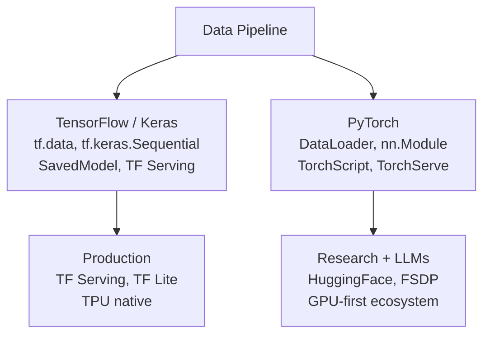

# TensorFlow vs PyTorch -- Cheatsheet

## Architecture (30-second mental model)

## When to use vs alternatives
| Need | Use | Not |
|------|-----|-----|
| LLM fine-tuning, HuggingFace ecosystem | PyTorch (industry default for GenAI) | TensorFlow (limited HF support) |
| Mobile / edge deployment | TensorFlow Lite / TF.js | PyTorch (torch.export still maturing) |
| TPU-native training at Google scale | TensorFlow / JAX | PyTorch (TPU support via XLA, less native) |
| Rapid research prototyping | PyTorch (eager mode, Pythonic) | TensorFlow (graph mode friction) |
| Production serving with mature tooling | TF Serving (battle-tested) or TorchServe | Sklearn (not for deep learning scale) |

## 5 things you always forget
1. PyTorch's default weight initialization differs from TensorFlow's -- migrating a model architecture between frameworks without matching init schemes causes different convergence behavior and silent accuracy loss.
2. `torch.compile(model, mode='reduce-overhead')` gives 2x inference speedup but silently falls back to eager mode on unsupported ops -- always check `torch._dynamo.explain()` output to verify compilation coverage.
3. `torch.no_grad()` is essential for inference -- without it, PyTorch builds a full computation graph eating memory for nothing; `torch.inference_mode()` is even faster (disables version tracking too).
4. TensorFlow saves models as directories (SavedModel format), not single files -- pointing `tf.saved_model.load()` at a .h5 file silently fails; use `tf.keras.models.load_model()` for .h5.
5. PyTorch FSDP (Fully Sharded Data Parallel) shards optimizer state across GPUs -- but `use_orig_params=True` is required for `torch.compile` compatibility, and wrapping order must match model forward order.

## Interview killer answer
> "We trained on PyTorch with FSDP across 8 A100s, which sharded a 7B model's optimizer state so each GPU only held 1/8th. The real win was adding `torch.compile` with `reduce-overhead` mode on the inference path -- it fused attention ops and cut P99 latency from 45ms to 18ms. For edge deployment, we exported to TF Lite via ONNX with quantization-aware training, which got us from 2GB to 180MB with <1% accuracy loss on our classification task."
