# AWS Core Services - Visual Learning Guide

## 🎨 Visual Learning: Architecture, Data Flows, Service Integration, Operations

---

## 📊 AWS Data Architecture

### High-Level Architecture

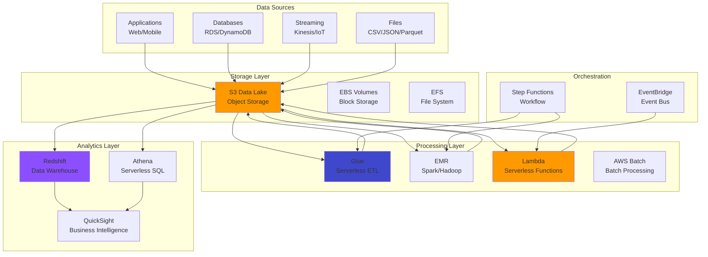
```mermaid
graph TB
    subgraph "Data Sources"
        A[Applications<br/>Web/Mobile]
        B[Databases<br/>RDS/DynamoDB]
        C[Streaming<br/>Kinesis/IoT]
        D[Files<br/>CSV/JSON/Parquet]
    end
    
    subgraph "Storage Layer"
        S3[S3 Data Lake<br/>Object Storage]
        EBS[EBS Volumes<br/>Block Storage]
        EFS[EFS<br/>File System]
    end
    
    subgraph "Processing Layer"
        GLUE[Glue<br/>Serverless ETL]
        EMR[EMR<br/>Spark/Hadoop]
        LAMBDA[Lambda<br/>Serverless Functions]
        BATCH[AWS Batch<br/>Batch Processing]
    end
    
    subgraph "Analytics Layer"
        REDSHIFT[Redshift<br/>Data Warehouse]
        ATHENA[Athena<br/>Serverless SQL]
        QUICKSIGHT[QuickSight<br/>Business Intelligence]
    end
    
    subgraph "Orchestration"
        STEP[Step Functions<br/>Workflow]
        EVENTBRIDGE[EventBridge<br/>Event Bus]
    end
    
    A --> S3
    B --> S3
    C --> S3
    D --> S3
    
    S3 --> GLUE
    S3 --> EMR
    S3 --> LAMBDA
    S3 --> ATHENA
    
    GLUE --> S3
    EMR --> S3
    LAMBDA --> S3
    
    S3 --> REDSHIFT
    REDSHIFT --> QUICKSIGHT
    ATHENA --> QUICKSIGHT
    
    EVENTBRIDGE --> LAMBDA
    STEP --> GLUE
    STEP --> EMR
    
    style S3 fill:#FF9900
    style GLUE fill:#3F48CC
    style REDSHIFT fill:#8C4FFF
    style LAMBDA fill:#FF9900
```

### AWS Data Platform Ecosystem

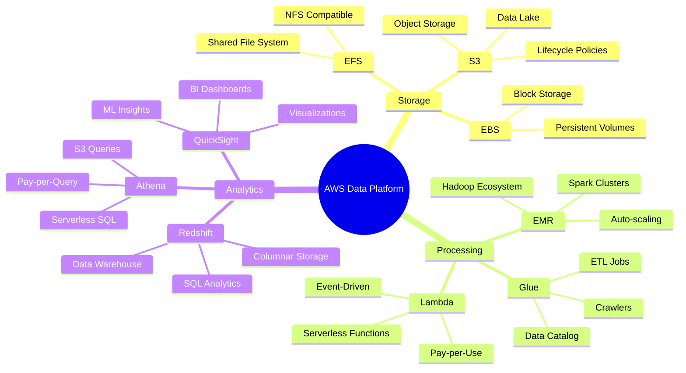
```mermaid
mindmap
  root((AWS Data Platform))
    Storage
      S3
        Data Lake
        Object Storage
        Lifecycle Policies
      EBS
        Block Storage
        Persistent Volumes
      EFS
        Shared File System
        NFS Compatible
    Processing
      Glue
        ETL Jobs
        Data Catalog
        Crawlers
      EMR
        Spark Clusters
        Hadoop Ecosystem
        Auto-scaling
      Lambda
        Serverless Functions
        Event-Driven
        Pay-per-Use
    Analytics
      Redshift
        Data Warehouse
        Columnar Storage
        SQL Analytics
      Athena
        Serverless SQL
        S3 Queries
        Pay-per-Query
      QuickSight
        BI Dashboards
        Visualizations
        ML Insights
```

---

## 🗄️ S3 Data Lake Architecture

### S3 Data Lake Structure

```mermaid
graph TB
    subgraph "S3 Bucket: data-lake"
        subgraph "Raw Zone"
            RAW[raw/<br/>Unprocessed Data]
            RAW_YEAR[raw/2024/<br/>Year Partition]
            RAW_MONTH[raw/2024/01/<br/>Month Partition]
            RAW_DAY[raw/2024/01/15/<br/>Day Partition]
        end
        
        subgraph "Processed Zone"
            PROCESSED[processed/<br/>Cleaned Data]
            PROC_YEAR[processed/2024/<br/>Year Partition]
            PROC_MONTH[processed/2024/01/<br/>Month Partition]
        end
        
        subgraph "Curated Zone"
            CURATED[curated/<br/>Analytics Ready]
            CURAT_SCHEMA[curated/sales/<br/>Schema-based]
            CURAT_DIM[curated/dim_customers/<br/>Dimension Tables]
            CURAT_FACT[curated/fact_sales/<br/>Fact Tables]
        end
        
        subgraph "Archive Zone"
            ARCHIVE[archive/<br/>Cold Storage]
            ARCHIVE_GLACIER[archive/glacier/<br/>Glacier Storage]
        end
    end
    
    RAW --> RAW_YEAR
    RAW_YEAR --> RAW_MONTH
    RAW_MONTH --> RAW_DAY
    
    RAW_DAY --> PROCESSED
    PROCESSED --> PROC_YEAR
    PROC_YEAR --> PROC_MONTH
    
    PROC_MONTH --> CURATED
    CURATED --> CURAT_SCHEMA
    CURAT_SCHEMA --> CURAT_DIM
    CURAT_SCHEMA --> CURAT_FACT
    
    CURAT_DIM --> ARCHIVE
    ARCHIVE --> ARCHIVE_GLACIER
    
    style RAW fill:#FF6B6B
    style PROCESSED fill:#FFD93D
    style CURATED fill:#6BCF7F
    style ARCHIVE fill:#4ECDC4
```

### S3 Lifecycle Policies

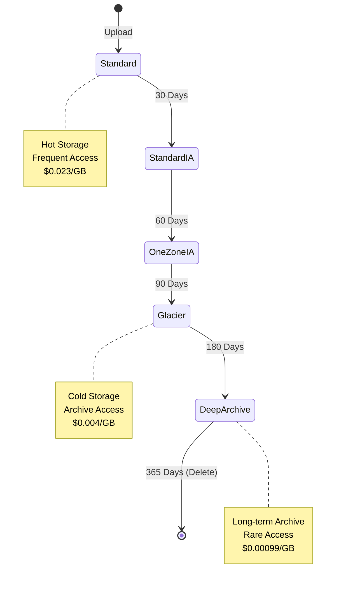
```mermaid
stateDiagram-v2
    [*] --> Standard: Upload
    Standard --> StandardIA: 30 Days
    StandardIA --> OneZoneIA: 60 Days
    OneZoneIA --> Glacier: 90 Days
    Glacier --> DeepArchive: 180 Days
    DeepArchive --> [*]: 365 Days (Delete)
    
    note right of Standard
        Hot Storage
        Frequent Access
        $0.023/GB
    end note
    
    note right of Glacier
        Cold Storage
        Archive Access
        $0.004/GB
    end note
    
    note right of DeepArchive
        Long-term Archive
        Rare Access
        $0.00099/GB
    end note
```

### S3 Data Ingestion Flow

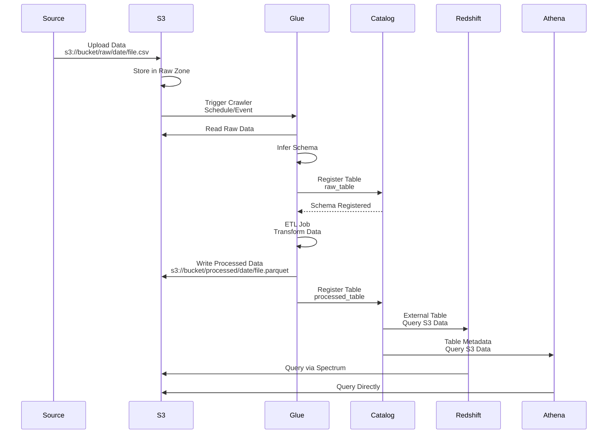
```mermaid
sequenceDiagram
    participant Source
    participant S3
    participant Glue
    participant Catalog
    participant Redshift
    participant Athena
    
    Source->>S3: Upload Data<br/>s3://bucket/raw/date/file.csv
    S3->>S3: Store in Raw Zone
    
    S3->>Glue: Trigger Crawler<br/>Schedule/Event
    Glue->>S3: Read Raw Data
    Glue->>Glue: Infer Schema
    Glue->>Catalog: Register Table<br/>raw_table
    Catalog-->>Glue: Schema Registered
    
    Glue->>Glue: ETL Job<br/>Transform Data
    Glue->>S3: Write Processed Data<br/>s3://bucket/processed/date/file.parquet
    Glue->>Catalog: Register Table<br/>processed_table
    
    Catalog->>Redshift: External Table<br/>Query S3 Data
    Catalog->>Athena: Table Metadata<br/>Query S3 Data
    
    Redshift->>S3: Query via Spectrum
    Athena->>S3: Query Directly
```

---

## 🔧 AWS Glue Architecture

### Glue ETL Pipeline

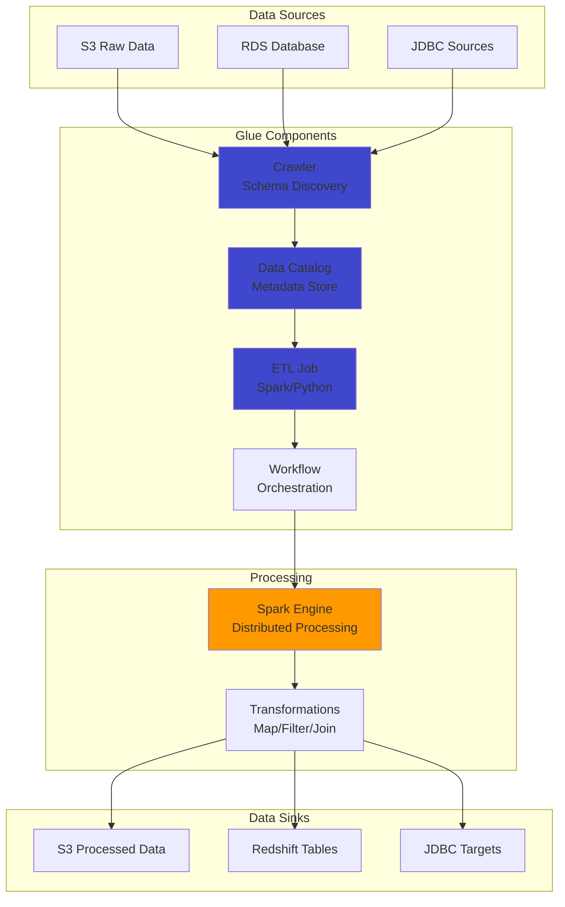
```mermaid
graph TB
    subgraph "Data Sources"
        S3_IN[S3 Raw Data]
        RDS[RDS Database]
        JDBC[JDBC Sources]
    end
    
    subgraph "Glue Components"
        CRAWLER[Crawler<br/>Schema Discovery]
        CATALOG[Data Catalog<br/>Metadata Store]
        JOB[ETL Job<br/>Spark/Python]
        WORKFLOW[Workflow<br/>Orchestration]
    end
    
    subgraph "Processing"
        SPARK[Spark Engine<br/>Distributed Processing]
        TRANSFORM[Transformations<br/>Map/Filter/Join]
    end
    
    subgraph "Data Sinks"
        S3_OUT[S3 Processed Data]
        REDSHIFT_OUT[Redshift Tables]
        JDBC_OUT[JDBC Targets]
    end
    
    S3_IN --> CRAWLER
    RDS --> CRAWLER
    JDBC --> CRAWLER
    
    CRAWLER --> CATALOG
    CATALOG --> JOB
    JOB --> WORKFLOW
    
    WORKFLOW --> SPARK
    SPARK --> TRANSFORM
    
    TRANSFORM --> S3_OUT
    TRANSFORM --> REDSHIFT_OUT
    TRANSFORM --> JDBC_OUT
    
    style CRAWLER fill:#3F48CC
    style CATALOG fill:#3F48CC
    style JOB fill:#3F48CC
    style SPARK fill:#FF9900
```

### Glue Job Execution Flow

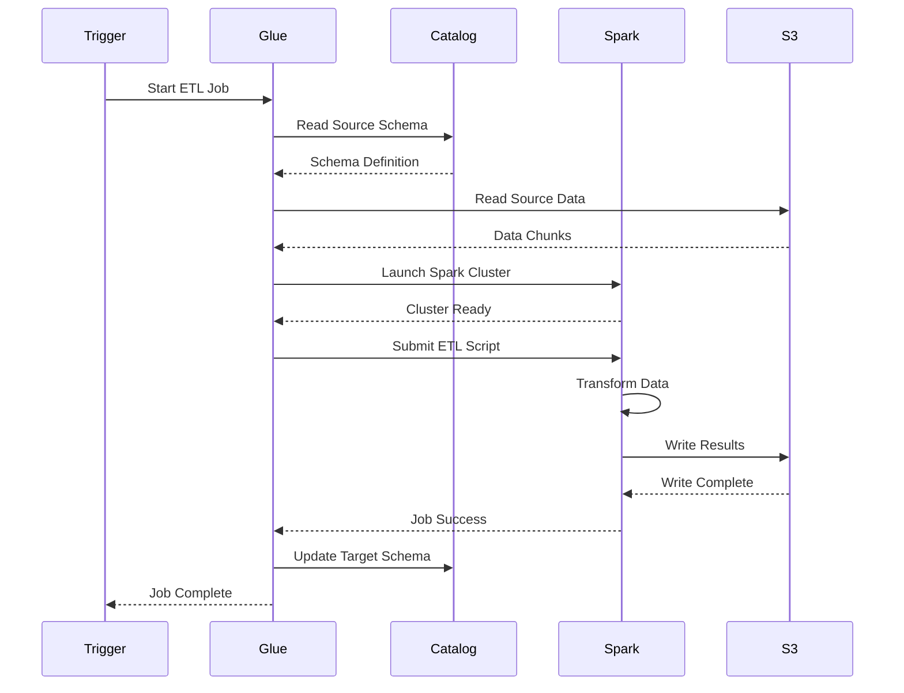
```mermaid
sequenceDiagram
    participant Trigger
    participant Glue
    participant Catalog
    participant Spark
    participant S3
    
    Trigger->>Glue: Start ETL Job
    Glue->>Catalog: Read Source Schema
    Catalog-->>Glue: Schema Definition
    
    Glue->>S3: Read Source Data
    S3-->>Glue: Data Chunks
    
    Glue->>Spark: Launch Spark Cluster
    Spark-->>Glue: Cluster Ready
    
    Glue->>Spark: Submit ETL Script
    Spark->>Spark: Transform Data
    Spark->>S3: Write Results
    
    S3-->>Spark: Write Complete
    Spark-->>Glue: Job Success
    
    Glue->>Catalog: Update Target Schema
    Glue-->>Trigger: Job Complete
```

### Glue Data Catalog Architecture

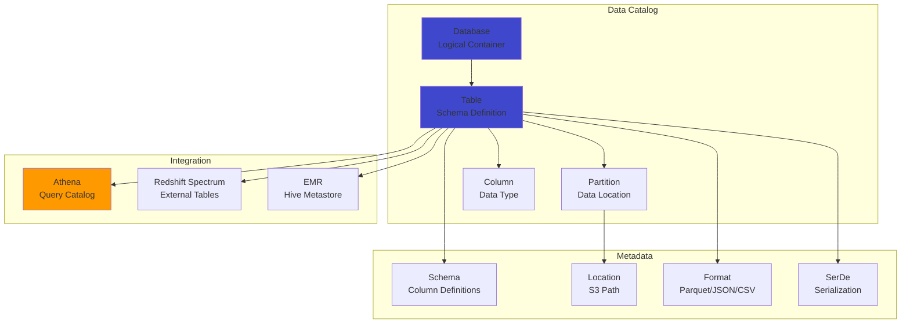
```mermaid
graph TB
    subgraph "Data Catalog"
        DATABASE[Database<br/>Logical Container]
        TABLE[Table<br/>Schema Definition]
        PARTITION[Partition<br/>Data Location]
        COLUMN[Column<br/>Data Type]
    end
    
    subgraph "Metadata"
        SCHEMA[Schema<br/>Column Definitions]
        LOCATION[Location<br/>S3 Path]
        FORMAT[Format<br/>Parquet/JSON/CSV]
        SERDE[SerDe<br/>Serialization]
    end
    
    subgraph "Integration"
        ATHENA_CAT[Athena<br/>Query Catalog]
        REDSHIFT_CAT[Redshift Spectrum<br/>External Tables]
        EMR_CAT[EMR<br/>Hive Metastore]
    end
    
    DATABASE --> TABLE
    TABLE --> PARTITION
    TABLE --> COLUMN
    
    TABLE --> SCHEMA
    PARTITION --> LOCATION
    TABLE --> FORMAT
    TABLE --> SERDE
    
    TABLE --> ATHENA_CAT
    TABLE --> REDSHIFT_CAT
    TABLE --> EMR_CAT
    
    style DATABASE fill:#3F48CC
    style TABLE fill:#3F48CC
    style ATHENA_CAT fill:#FF9900
```

---

## ⚡ AWS Lambda Architecture

### Lambda Function Execution

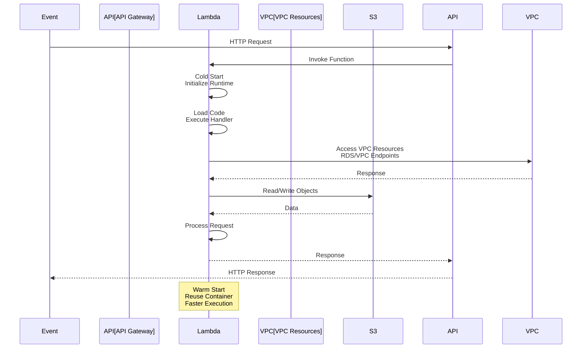
```mermaid
sequenceDiagram
    participant Event
    participant API[API Gateway]
    participant Lambda
    participant VPC[VPC Resources]
    participant S3
    
    Event->>API: HTTP Request
    API->>Lambda: Invoke Function
    
    Lambda->>Lambda: Cold Start<br/>Initialize Runtime
    Lambda->>Lambda: Load Code<br/>Execute Handler
    
    Lambda->>VPC: Access VPC Resources<br/>RDS/VPC Endpoints
    VPC-->>Lambda: Response
    
    Lambda->>S3: Read/Write Objects
    S3-->>Lambda: Data
    
    Lambda->>Lambda: Process Request
    Lambda-->>API: Response
    API-->>Event: HTTP Response
    
    Note over Lambda: Warm Start<br/>Reuse Container<br/>Faster Execution
```

### Lambda Event Sources

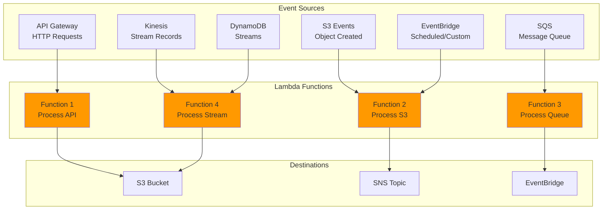
```mermaid
graph TB
    subgraph "Event Sources"
        API_GW[API Gateway<br/>HTTP Requests]
        S3_EVENT[S3 Events<br/>Object Created]
        SQS_EVENT[SQS<br/>Message Queue]
        KINESIS[Kinesis<br/>Stream Records]
        EVENTBRIDGE[EventBridge<br/>Scheduled/Custom]
        DYNAMODB[DynamoDB<br/>Streams]
    end
    
    subgraph "Lambda Functions"
        LAMBDA1[Function 1<br/>Process API]
        LAMBDA2[Function 2<br/>Process S3]
        LAMBDA3[Function 3<br/>Process Queue]
        LAMBDA4[Function 4<br/>Process Stream]
    end
    
    subgraph "Destinations"
        S3_OUT[S3 Bucket]
        SNS[SNS Topic]
        EVENTBRIDGE_OUT[EventBridge]
    end
    
    API_GW --> LAMBDA1
    S3_EVENT --> LAMBDA2
    SQS_EVENT --> LAMBDA3
    KINESIS --> LAMBDA4
    EVENTBRIDGE --> LAMBDA2
    DYNAMODB --> LAMBDA4
    
    LAMBDA1 --> S3_OUT
    LAMBDA2 --> SNS
    LAMBDA3 --> EVENTBRIDGE_OUT
    LAMBDA4 --> S3_OUT
    
    style LAMBDA1 fill:#FF9900
    style LAMBDA2 fill:#FF9900
    style LAMBDA3 fill:#FF9900
    style LAMBDA4 fill:#FF9900
```

### Lambda Scaling Architecture

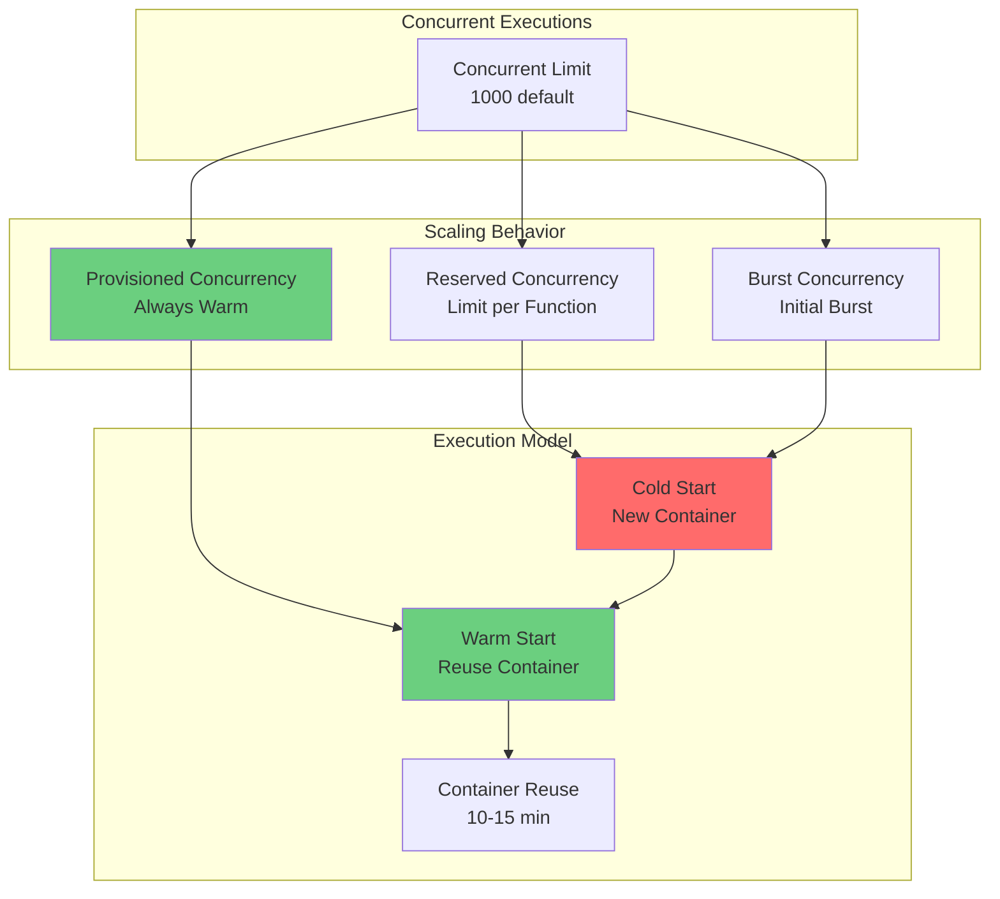
```mermaid
graph TB
    subgraph "Concurrent Executions"
        CONCURRENT[Concurrent Limit<br/>1000 default]
    end
    
    subgraph "Scaling Behavior"
        PROVISIONED[Provisioned Concurrency<br/>Always Warm]
        RESERVED[Reserved Concurrency<br/>Limit per Function]
        BURST[Burst Concurrency<br/>Initial Burst]
    end
    
    subgraph "Execution Model"
        COLD_START[Cold Start<br/>New Container]
        WARM_START[Warm Start<br/>Reuse Container]
        CONTAINER_REUSE[Container Reuse<br/>10-15 min]
    end
    
    CONCURRENT --> PROVISIONED
    CONCURRENT --> RESERVED
    CONCURRENT --> BURST
    
    PROVISIONED --> WARM_START
    RESERVED --> COLD_START
    BURST --> COLD_START
    
    WARM_START --> CONTAINER_REUSE
    COLD_START --> WARM_START
    
    style PROVISIONED fill:#6BCF7F
    style COLD_START fill:#FF6B6B
    style WARM_START fill:#6BCF7F
```

---

## 🔴 AWS Redshift Architecture

### Redshift Cluster Architecture

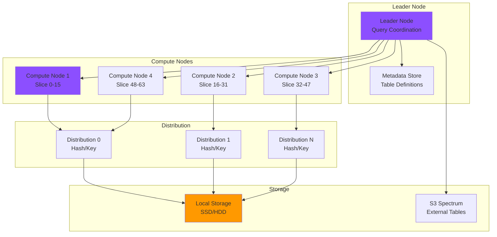
```mermaid
graph TB
    subgraph "Leader Node"
        LEADER[Leader Node<br/>Query Coordination]
        METADATA[Metadata Store<br/>Table Definitions]
    end
    
    subgraph "Compute Nodes"
        NODE1[Compute Node 1<br/>Slice 0-15]
        NODE2[Compute Node 2<br/>Slice 16-31]
        NODE3[Compute Node 3<br/>Slice 32-47]
        NODE4[Compute Node 4<br/>Slice 48-63]
    end
    
    subgraph "Storage"
        LOCAL[Local Storage<br/>SSD/HDD]
        S3_SPECTRUM[S3 Spectrum<br/>External Tables]
    end
    
    subgraph "Distribution"
        DIST1[Distribution 0<br/>Hash/Key]
        DIST2[Distribution 1<br/>Hash/Key]
        DIST3[Distribution N<br/>Hash/Key]
    end
    
    LEADER --> METADATA
    LEADER --> NODE1
    LEADER --> NODE2
    LEADER --> NODE3
    LEADER --> NODE4
    
    NODE1 --> DIST1
    NODE2 --> DIST2
    NODE3 --> DIST3
    NODE4 --> DIST1
    
    DIST1 --> LOCAL
    DIST2 --> LOCAL
    DIST3 --> LOCAL
    
    LEADER --> S3_SPECTRUM
    
    style LEADER fill:#8C4FFF
    style NODE1 fill:#8C4FFF
    style LOCAL fill:#FF9900
```

### Redshift Data Loading Flow

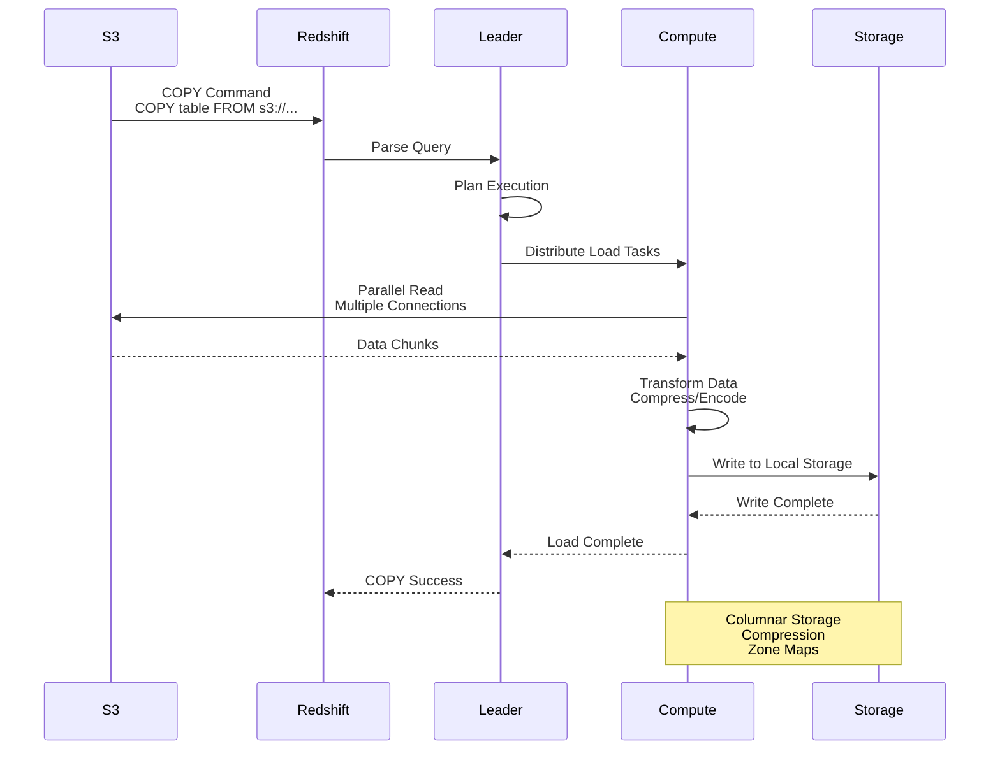
```mermaid
sequenceDiagram
    participant S3
    participant Redshift
    participant Leader
    participant Compute
    participant Storage
    
    S3->>Redshift: COPY Command<br/>COPY table FROM s3://...
    Redshift->>Leader: Parse Query
    Leader->>Leader: Plan Execution
    
    Leader->>Compute: Distribute Load Tasks
    Compute->>S3: Parallel Read<br/>Multiple Connections
    S3-->>Compute: Data Chunks
    
    Compute->>Compute: Transform Data<br/>Compress/Encode
    Compute->>Storage: Write to Local Storage
    
    Storage-->>Compute: Write Complete
    Compute-->>Leader: Load Complete
    Leader-->>Redshift: COPY Success
    
    Note over Compute,Storage: Columnar Storage<br/>Compression<br/>Zone Maps
```

### Redshift Distribution Styles

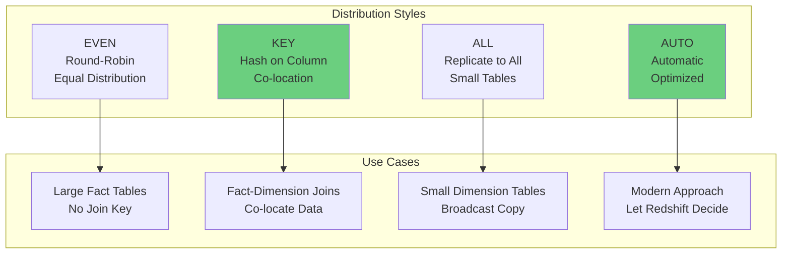
```mermaid
graph TB
    subgraph "Distribution Styles"
        EVEN[EVEN<br/>Round-Robin<br/>Equal Distribution]
        KEY[KEY<br/>Hash on Column<br/>Co-location]
        ALL[ALL<br/>Replicate to All<br/>Small Tables]
        AUTO[AUTO<br/>Automatic<br/>Optimized]
    end
    
    subgraph "Use Cases"
        EVEN_USE[Large Fact Tables<br/>No Join Key]
        KEY_USE[Fact-Dimension Joins<br/>Co-locate Data]
        ALL_USE[Small Dimension Tables<br/>Broadcast Copy]
        AUTO_USE[Modern Approach<br/>Let Redshift Decide]
    end
    
    EVEN --> EVEN_USE
    KEY --> KEY_USE
    ALL --> ALL_USE
    AUTO --> AUTO_USE
    
    style KEY fill:#6BCF7F
    style AUTO fill:#6BCF7F
```

---

## 🔍 AWS Athena Architecture

### Athena Query Execution

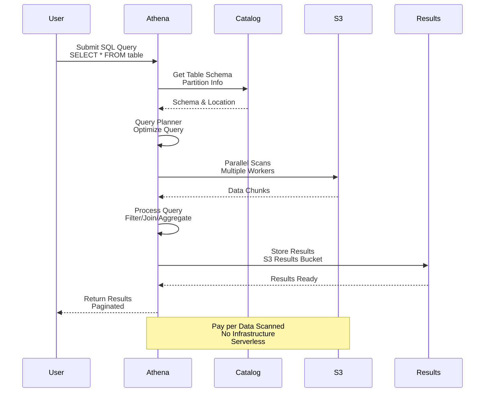
```mermaid
sequenceDiagram
    participant User
    participant Athena
    participant Catalog
    participant S3
    participant Results
    
    User->>Athena: Submit SQL Query<br/>SELECT * FROM table
    Athena->>Catalog: Get Table Schema<br/>Partition Info
    Catalog-->>Athena: Schema & Location
    
    Athena->>Athena: Query Planner<br/>Optimize Query
    Athena->>S3: Parallel Scans<br/>Multiple Workers
    S3-->>Athena: Data Chunks
    
    Athena->>Athena: Process Query<br/>Filter/Join/Aggregate
    Athena->>Results: Store Results<br/>S3 Results Bucket
    Results-->>Athena: Results Ready
    
    Athena-->>User: Return Results<br/>Paginated
    
    Note over Athena,S3: Pay per Data Scanned<br/>No Infrastructure<br/>Serverless
```

### Athena Partitioning Strategy

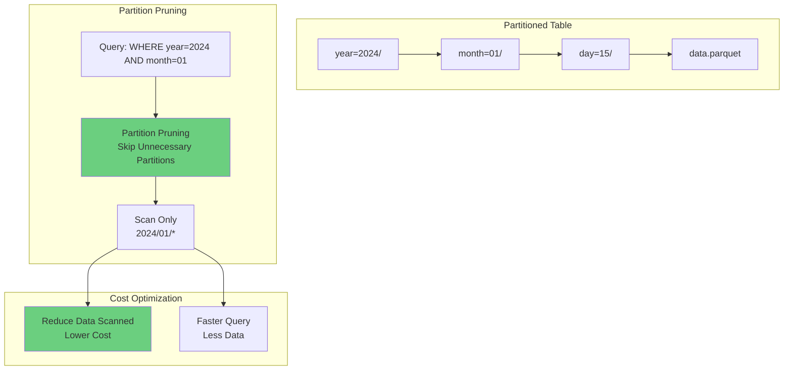
```mermaid
graph TB
    subgraph "Partitioned Table"
        YEAR_PART[year=2024/]
        MONTH_PART[month=01/]
        DAY_PART[day=15/]
        FILE[data.parquet]
    end
    
    subgraph "Partition Pruning"
        QUERY[Query: WHERE year=2024 AND month=01]
        PRUNE[Partition Pruning<br/>Skip Unnecessary Partitions]
        SCAN[Scan Only<br/>2024/01/*]
    end
    
    subgraph "Cost Optimization"
        REDUCE_SCAN[Reduce Data Scanned<br/>Lower Cost]
        FASTER_QUERY[Faster Query<br/>Less Data]
    end
    
    YEAR_PART --> MONTH_PART
    MONTH_PART --> DAY_PART
    DAY_PART --> FILE
    
    QUERY --> PRUNE
    PRUNE --> SCAN
    
    SCAN --> REDUCE_SCAN
    SCAN --> FASTER_QUERY
    
    style PRUNE fill:#6BCF7F
    style REDUCE_SCAN fill:#6BCF7F
```

---

## 🚀 EMR Architecture

### EMR Cluster Architecture

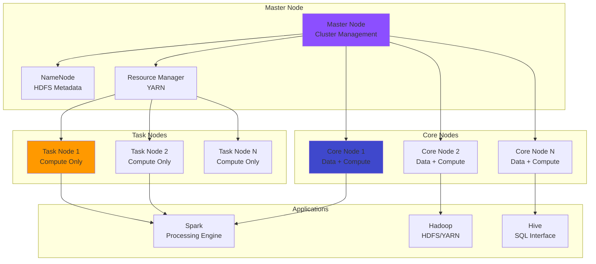
```mermaid
graph TB
    subgraph "Master Node"
        MASTER[Master Node<br/>Cluster Management]
        NAMENODE[NameNode<br/>HDFS Metadata]
        RESOURCE_MGR[Resource Manager<br/>YARN]
    end
    
    subgraph "Core Nodes"
        CORE1[Core Node 1<br/>Data + Compute]
        CORE2[Core Node 2<br/>Data + Compute]
        CORE3[Core Node N<br/>Data + Compute]
    end
    
    subgraph "Task Nodes"
        TASK1[Task Node 1<br/>Compute Only]
        TASK2[Task Node 2<br/>Compute Only]
        TASK3[Task Node N<br/>Compute Only]
    end
    
    subgraph "Applications"
        SPARK[Spark<br/>Processing Engine]
        HADOOP[Hadoop<br/>HDFS/YARN]
        HIVE[Hive<br/>SQL Interface]
    end
    
    MASTER --> NAMENODE
    MASTER --> RESOURCE_MGR
    
    MASTER --> CORE1
    MASTER --> CORE2
    MASTER --> CORE3
    
    RESOURCE_MGR --> TASK1
    RESOURCE_MGR --> TASK2
    RESOURCE_MGR --> TASK3
    
    CORE1 --> SPARK
    CORE2 --> HADOOP
    CORE3 --> HIVE
    
    TASK1 --> SPARK
    TASK2 --> SPARK
    
    style MASTER fill:#8C4FFF
    style CORE1 fill:#3F48CC
    style TASK1 fill:#FF9900
```

### EMR Auto-Scaling

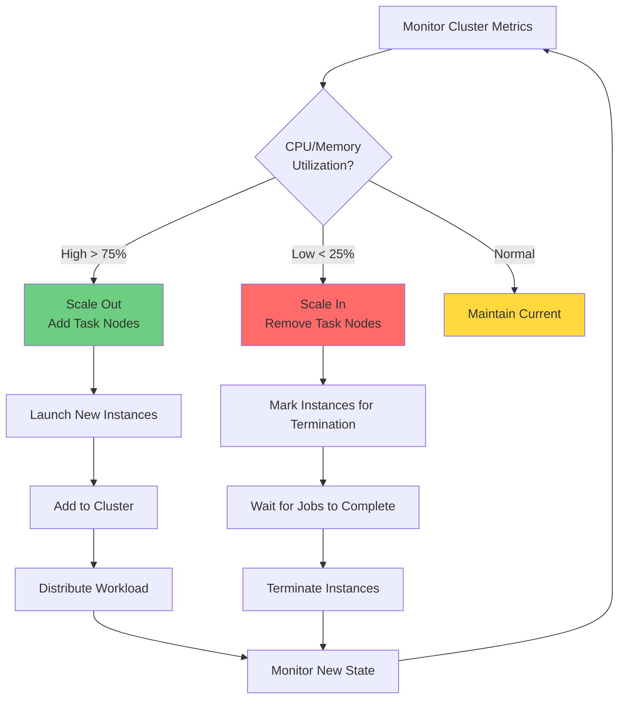
```mermaid
flowchart TD
    A[Monitor Cluster Metrics] --> B{CPU/Memory<br/>Utilization?}
    
    B -->|High > 75%| C[Scale Out<br/>Add Task Nodes]
    B -->|Low < 25%| D[Scale In<br/>Remove Task Nodes]
    B -->|Normal| E[Maintain Current]
    
    C --> F[Launch New Instances]
    F --> G[Add to Cluster]
    G --> H[Distribute Workload]
    
    D --> I[Mark Instances for Termination]
    I --> J[Wait for Jobs to Complete]
    J --> K[Terminate Instances]
    
    H --> L[Monitor New State]
    K --> L
    L --> A
    
    style C fill:#6BCF7F
    style D fill:#FF6B6B
    style E fill:#FFD93D
```

---

## 🔄 Data Pipeline Patterns

### ETL Pipeline with Glue

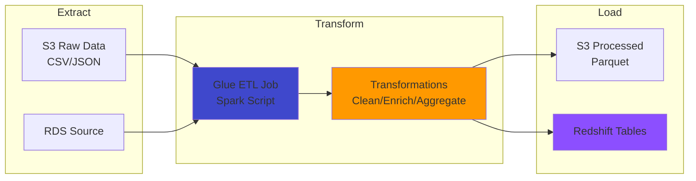
```mermaid
graph LR
    subgraph "Extract"
        S3_RAW[S3 Raw Data<br/>CSV/JSON]
        RDS_SOURCE[RDS Source]
    end
    
    subgraph "Transform"
        GLUE_JOB[Glue ETL Job<br/>Spark Script]
        TRANSFORM[Transformations<br/>Clean/Enrich/Aggregate]
    end
    
    subgraph "Load"
        S3_PROCESSED[S3 Processed<br/>Parquet]
        REDSHIFT_LOAD[Redshift Tables]
    end
    
    S3_RAW --> GLUE_JOB
    RDS_SOURCE --> GLUE_JOB
    
    GLUE_JOB --> TRANSFORM
    TRANSFORM --> S3_PROCESSED
    TRANSFORM --> REDSHIFT_LOAD
    
    style GLUE_JOB fill:#3F48CC
    style TRANSFORM fill:#FF9900
    style REDSHIFT_LOAD fill:#8C4FFF
```

### Event-Driven Data Pipeline

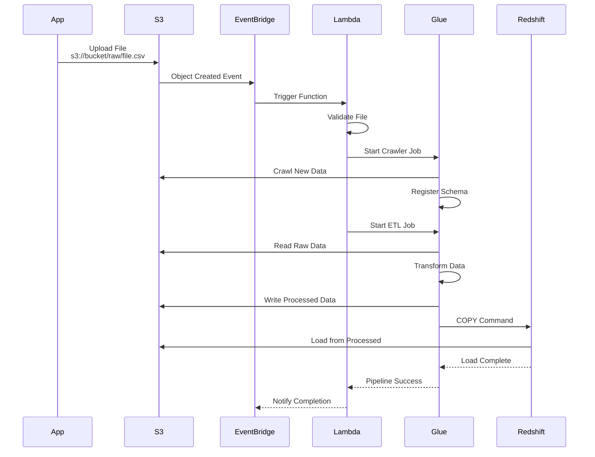
```mermaid
sequenceDiagram
    participant App
    participant S3
    participant EventBridge
    participant Lambda
    participant Glue
    participant Redshift
    
    App->>S3: Upload File<br/>s3://bucket/raw/file.csv
    S3->>EventBridge: Object Created Event
    EventBridge->>Lambda: Trigger Function
    
    Lambda->>Lambda: Validate File
    Lambda->>Glue: Start Crawler Job
    Glue->>S3: Crawl New Data
    Glue->>Glue: Register Schema
    
    Lambda->>Glue: Start ETL Job
    Glue->>S3: Read Raw Data
    Glue->>Glue: Transform Data
    Glue->>S3: Write Processed Data
    
    Glue->>Redshift: COPY Command
    Redshift->>S3: Load from Processed
    Redshift-->>Glue: Load Complete
    
    Glue-->>Lambda: Pipeline Success
    Lambda-->>EventBridge: Notify Completion
```

---

## 🔐 Security Architecture

### AWS IAM & Security Model

```mermaid
graph TB
    subgraph "Identity & Access"
        IAM[IAM<br/>Identity Management]
        ROLES[IAM Roles<br/>Service Access]
        POLICIES[IAM Policies<br/>Permissions]
        USERS[IAM Users<br/>Human Access]
    end
    
    subgraph "Network Security"
        VPC[VPC<br/>Private Network]
        SECURITY_GROUP[Security Groups<br/>Firewall Rules]
        NACL[NACLs<br/>Network ACLs]
        PRIVATE_ENDPOINT[VPC Endpoints<br/>Private Access]
    end
    
    subgraph "Data Protection"
        KMS[KMS<br/>Encryption Keys]
        ENCRYPT_S3[S3 Encryption<br/>Server-Side]
        ENCRYPT_REDSHIFT[Redshift Encryption<br/>At Rest]
        TLS[TLS in Transit<br/>Encrypted Communication]
    end
    
    subgraph "Audit & Compliance"
        CLOUDTRAIL[CloudTrail<br/>API Logging]
        CONFIG[Config<br/>Compliance Monitoring]
        GUARDDUTY[GuardDuty<br/>Threat Detection]
    end
    
    IAM --> ROLES
    IAM --> POLICIES
    IAM --> USERS
    
    ROLES --> VPC
    POLICIES --> SECURITY_GROUP
    
    VPC --> PRIVATE_ENDPOINT
    SECURITY_GROUP --> NACL
    
    PRIVATE_ENDPOINT --> KMS
    KMS --> ENCRYPT_S3
    KMS --> ENCRYPT_REDSHIFT
    KMS --> TLS
    
    ENCRYPT_S3 --> CLOUDTRAIL
    ENCRYPT_REDSHIFT --> CONFIG
    TLS --> GUARDDUTY
    
    style IAM fill:#3F48CC
    style KMS fill:#FF9900
    style CLOUDTRAIL fill:#6BCF7F
```

### S3 Access Control Flow

```mermaid
sequenceDiagram
    participant User
    participant IAM
    participant S3
    participant BucketPolicy
    participant ObjectACL
    
    User->>IAM: Request S3 Access
    IAM->>IAM: Check User Permissions
    IAM->>IAM: Check Role Policies
    
    IAM-->>S3: Allow/Deny Request
    
    S3->>BucketPolicy: Check Bucket Policy
    BucketPolicy-->>S3: Policy Evaluation
    
    S3->>ObjectACL: Check Object ACL
    ObjectACL-->>S3: ACL Evaluation
    
    S3->>S3: Combine All Checks
    S3-->>User: Allow/Deny Access
    
    Note over IAM,S3: Multiple Layers<br/>IAM + Bucket Policy + ACL<br/>Most Restrictive Wins
```

---

## 💰 Cost Optimization

### S3 Cost Optimization Strategy

```mermaid
mindmap
  root((S3 Cost Optimization))
    Storage Classes
      Standard
        Frequent Access
        $0.023/GB
      Intelligent Tiering
        Auto Optimization
        $0.023 + Monitoring
      Glacier
        Archive Storage
        $0.004/GB
    Lifecycle Policies
      Transition Rules
        Move to Cheaper Tier
      Expiration Rules
        Delete Old Data
    Compression
      Parquet Format
        Columnar Compression
      GZIP Compression
        Text Files
    Request Optimization
      Batch Operations
        Reduce API Calls
      Multipart Upload
        Large Files
```

### Redshift Cost Optimization

```mermaid
graph TB
    subgraph "Compute Optimization"
        PAUSE[Pause Cluster<br/>No Compute Cost]
        RESIZE[Resize Cluster<br/>Right-Size]
        CONCURRENCY[Concurrency Scaling<br/>Pay-per-Use]
    end
    
    subgraph "Storage Optimization"
        COMPRESSION[Compression<br/>Reduce Storage]
        VACUUM[Vacuum<br/>Reclaim Space]
        ARCHIVE[Archive Old Data<br/>S3 Spectrum]
    end
    
    subgraph "Query Optimization"
        DIST_KEY[Distribution Key<br/>Even Distribution]
        SORT_KEY[Sort Key<br/>Zone Maps]
        STATS[Statistics<br/>Better Plans]
    end
    
    PAUSE --> COST_SAVE1[Save Compute Costs]
    RESIZE --> COST_SAVE2[Optimize Instance Size]
    CONCURRENCY --> COST_SAVE3[Pay Only When Needed]
    
    COMPRESSION --> COST_SAVE4[Reduce Storage Cost]
    ARCHIVE --> COST_SAVE5[Move to S3]
    
    DIST_KEY --> COST_SAVE6[Faster Queries]
    SORT_KEY --> COST_SAVE6
    
    style PAUSE fill:#6BCF7F
    style COMPRESSION fill:#6BCF7F
    style DIST_KEY fill:#6BCF7F
```

---

## 🔗 Service Integration Patterns

### Complete Data Pipeline

```mermaid
graph TB
    subgraph "Ingestion"
        KINESIS[Kinesis Data Streams<br/>Real-time]
        S3_INGEST[S3<br/>Batch]
    end
    
    subgraph "Processing"
        LAMBDA_PROC[Lambda<br/>Event Processing]
        GLUE_PROC[Glue<br/>ETL Jobs]
        EMR_PROC[EMR<br/>Big Data]
    end
    
    subgraph "Storage"
        S3_LAKE[S3 Data Lake<br/>Raw/Processed]
        REDSHIFT_DW[Redshift<br/>Data Warehouse]
        DYNAMODB[DynamoDB<br/>NoSQL]
    end
    
    subgraph "Analytics"
        ATHENA_ANAL[Athena<br/>Ad-hoc Queries]
        QUICKSIGHT_ANAL[QuickSight<br/>Dashboards]
        SAGEMAKER[SageMaker<br/>ML Models]
    end
    
    KINESIS --> LAMBDA_PROC
    S3_INGEST --> GLUE_PROC
    
    LAMBDA_PROC --> S3_LAKE
    GLUE_PROC --> S3_LAKE
    EMR_PROC --> S3_LAKE
    
    S3_LAKE --> REDSHIFT_DW
    S3_LAKE --> DYNAMODB
    
    REDSHIFT_DW --> QUICKSIGHT_ANAL
    S3_LAKE --> ATHENA_ANAL
    ATHENA_ANAL --> QUICKSIGHT_ANAL
    
    S3_LAKE --> SAGEMAKER
    REDSHIFT_DW --> SAGEMAKER
    
    style KINESIS fill:#FF9900
    style GLUE_PROC fill:#3F48CC
    style REDSHIFT_DW fill:#8C4FFF
    style QUICKSIGHT_ANAL fill:#FF9900
```

### Multi-Service Workflow

```mermaid
sequenceDiagram
    participant Event
    participant EventBridge
    participant Lambda
    participant Glue
    participant S3
    participant Redshift
    participant QuickSight
    
    Event->>EventBridge: Scheduled Event<br/>Daily 2 AM
    EventBridge->>Lambda: Trigger Function
    
    Lambda->>Glue: Start ETL Job
    Glue->>S3: Read Source Data
    S3-->>Glue: Raw Data
    
    Glue->>Glue: Transform Data
    Glue->>S3: Write Processed Data
    S3-->>Glue: Write Complete
    
    Glue->>Redshift: COPY Data
    Redshift->>S3: Load from Processed
    S3-->>Redshift: Load Complete
    Redshift-->>Glue: COPY Success
    
    Glue-->>Lambda: Job Complete
    Lambda->>QuickSight: Refresh Dataset
    QuickSight->>Redshift: Query Data
    Redshift-->>QuickSight: Data
    QuickSight-->>Lambda: Refresh Complete
    
    Lambda-->>EventBridge: Pipeline Success
```

---

## 🎯 Key Visual Takeaways

1. **S3 = Data Lake Foundation** - Object storage with lifecycle policies and multiple storage classes
2. **Glue = Serverless ETL** - Data catalog, crawlers, and Spark-based ETL jobs
3. **Redshift = Data Warehouse** - Columnar storage with distribution and sort keys
4. **Athena = Serverless SQL** - Query S3 data directly, pay per query
5. **Lambda = Serverless Compute** - Event-driven functions, auto-scaling
6. **EMR = Big Data Processing** - Managed Spark/Hadoop clusters with auto-scaling
7. **Security = Multi-layered** - IAM, VPC, encryption, and audit logging
8. **Cost Optimization = Right-sizing** - Pause clusters, use appropriate storage classes, optimize queries

---

## 📚 Next Steps

1. ✅ Review these diagrams
2. 🏗️ Draw them yourself (practice)
3. 💬 Use in interviews (explain architecture)
4. 🔗 Connect to your POCs (build data pipelines)

---

**Visual learning helps!** Use these diagrams to explain AWS Core Services architecture, data flows, and integration patterns in interviews.
