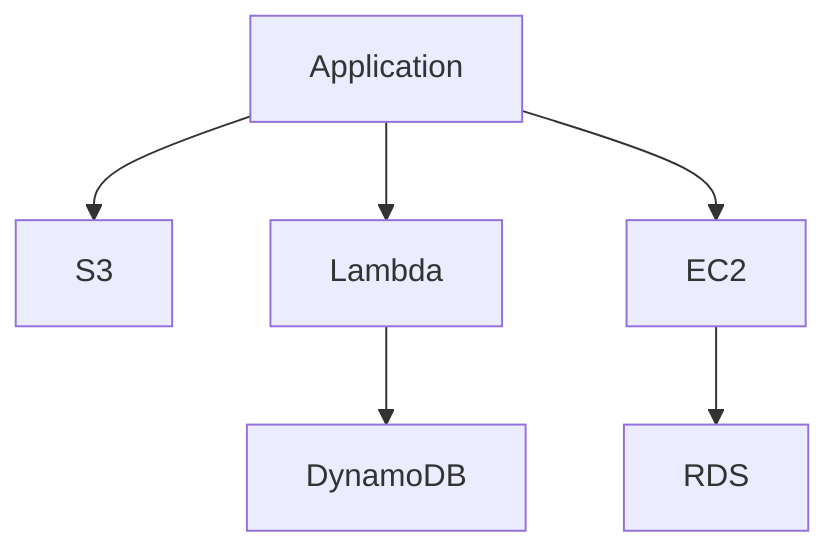

# AWS Core Services Guide – Basic → Architect

## Level 1 – Launch & Basics

### 1. **Setup**
```bash
# Install AWS CLI
pip install awscli

# Configure credentials
aws configure
```

### 2. **S3 Basics**
```python
import boto3

s3 = boto3.client('s3')

# Upload file
s3.upload_file('local-file.txt', 'my-bucket', 'remote-file.txt')

# Download file
s3.download_file('my-bucket', 'remote-file.txt', 'local-file.txt')

# List objects
response = s3.list_objects_v2(Bucket='my-bucket')
```

### 3. **EC2 Basics**
```python
import boto3

ec2 = boto3.client('ec2')

# Create instance
response = ec2.run_instances(
    ImageId='ami-12345',
    MinCount=1,
    MaxCount=1,
    InstanceType='t2.micro'
)
```

### 4. **Lambda Basics**
```python
import json

def lambda_handler(event, context):
    return {
        'statusCode': 200,
        'body': json.dumps('Hello from Lambda!')
    }
```

## Level 2 – Production Patterns

### S3 Advanced
```python
# Multipart upload
s3.upload_fileobj(
    file_obj,
    'my-bucket',
    'large-file.zip',
    ExtraArgs={'ServerSideEncryption': 'AES256'}
)

# Presigned URLs
url = s3.generate_presigned_url(
    'get_object',
    Params={'Bucket': 'my-bucket', 'Key': 'file.txt'},
    ExpiresIn=3600
)
```

### Glue ETL
```python
import sys
from awsglue.transforms import *
from awsglue.utils import getResolvedOptions
from pyspark.context import SparkContext
from awsglue.context import GlueContext

sc = SparkContext()
glueContext = GlueContext(sc)
spark = glueContext.spark_session

# Read from catalog
datasource = glueContext.create_dynamic_frame.from_catalog(
    database="my-database",
    table_name="my-table"
)

# Transform
transformed = ApplyMapping.apply(
    frame=datasource,
    mappings=[("id", "long", "id", "long")]
)

# Write
glueContext.write_dynamic_frame.from_options(
    frame=transformed,
    connection_type="s3",
    connection_options={"path": "s3://bucket/output/"},
    format="parquet"
)
```

### Step Functions
```python
import json

def lambda_handler(event, context):
    # Process step
    result = process_data(event['input'])
    return {
        'statusCode': 200,
        'body': json.dumps(result)
    }
```

## Level 3 – Architect Playbook

### Multi-Account Setup
```python
# Assume role
sts = boto3.client('sts')
response = sts.assume_role(
    RoleArn='arn:aws:iam::123456789012:role/MyRole',
    RoleSessionName='session1'
)

credentials = response['Credentials']
s3 = boto3.client(
    's3',
    aws_access_key_id=credentials['AccessKeyId'],
    aws_secret_access_key=credentials['SecretAccessKey'],
    aws_session_token=credentials['SessionToken']
)
```

### Cost Optimization
```python
# S3 lifecycle policies
lifecycle_config = {
    'Rules': [{
        'Id': 'Move to Glacier',
        'Status': 'Enabled',
        'Transitions': [{
            'Days': 30,
            'StorageClass': 'GLACIER'
        }]
    }]
}

s3.put_bucket_lifecycle_configuration(
    Bucket='my-bucket',
    LifecycleConfiguration=lifecycle_config
)
```

## Ops Cheat Sheet

| Task | Command | Notes |
| --- | --- | --- |
| List buckets | `aws s3 ls` | List S3 buckets |
| Sync | `aws s3 sync local s3://bucket/` | Sync directories |
| Copy | `aws s3 cp file s3://bucket/` | Copy file |
| List instances | `aws ec2 describe-instances` | List EC2 instances |
| Invoke Lambda | `aws lambda invoke` | Invoke function |

## Architecture Patterns



## Checklist Before Production

- [ ] Set up proper IAM roles and policies
- [ ] Configure VPC and security groups
- [ ] Enable CloudTrail for auditing
- [ ] Set up CloudWatch monitoring
- [ ] Configure S3 lifecycle policies
- [ ] Implement proper backup strategies
- [ ] Set up cost monitoring and budgets
- [ ] Configure encryption at rest and in transit
- [ ] Implement proper tagging strategy
- [ ] Set up disaster recovery
