# Apache Airflow - Visual Learning Guide

## 🎨 Visual Learning: DAG Flows, Architecture, Execution Patterns

---

## 📊 Airflow Architecture

### High-Level System Architecture

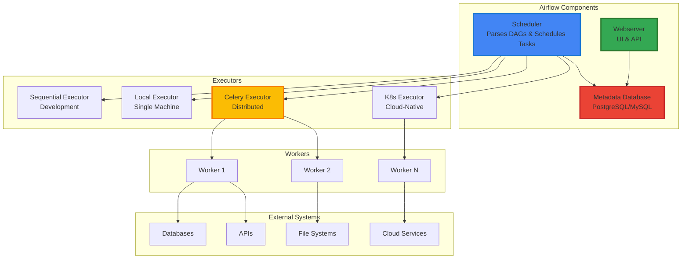

---

## 🔄 DAG Execution Patterns

### Pattern 1: Simple Linear Pipeline

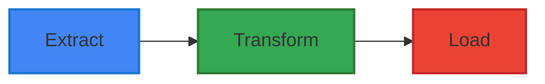

**Use Case**: Simple ETL jobs, data migration

---

### Pattern 2: Parallel Processing

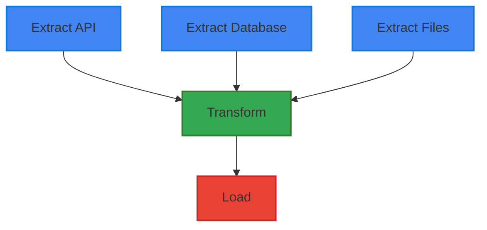

**Use Case**: Multiple data sources, independent extractions

---

### Pattern 3: Conditional Branching

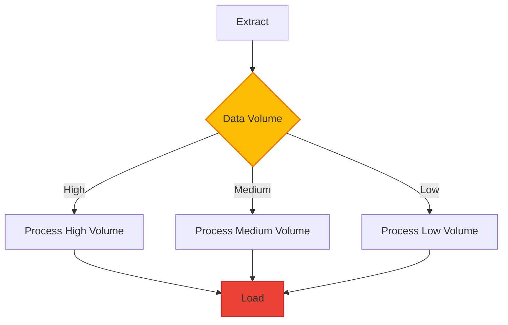

**Use Case**: Different processing based on data characteristics

---

### Pattern 4: Fan-Out Fan-In

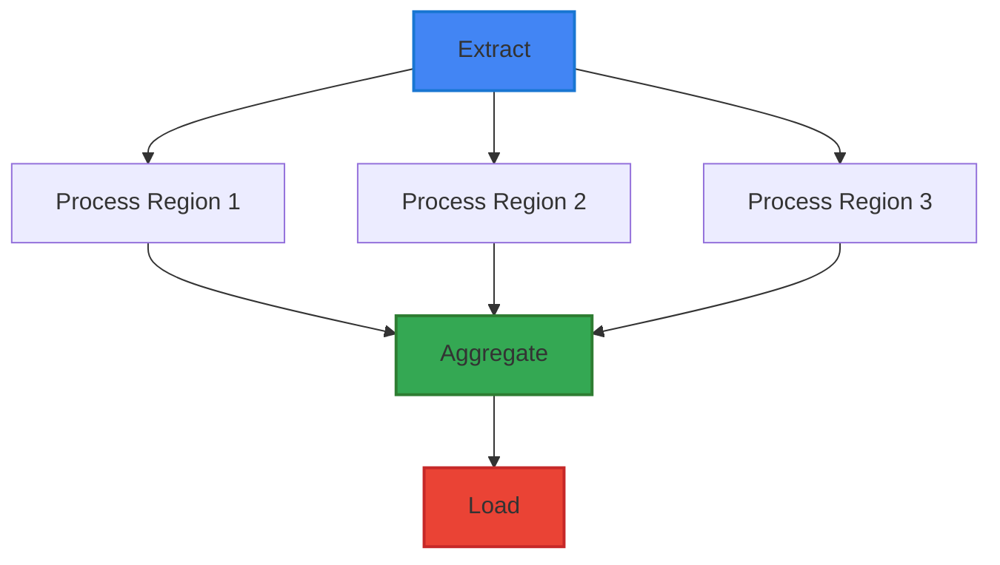

**Use Case**: Parallel processing with aggregation

---

### Pattern 5: Event-Driven with Sensors

**Use Case**: File-based pipelines, API-driven workflows

---

### Pattern 6: Task Groups Organization

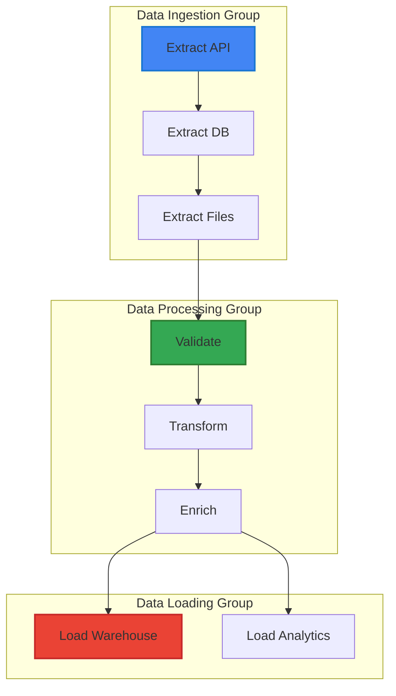

**Use Case**: Complex pipelines with logical grouping

---

## 🔄 Task Lifecycle and State Flow

### Task State Transitions

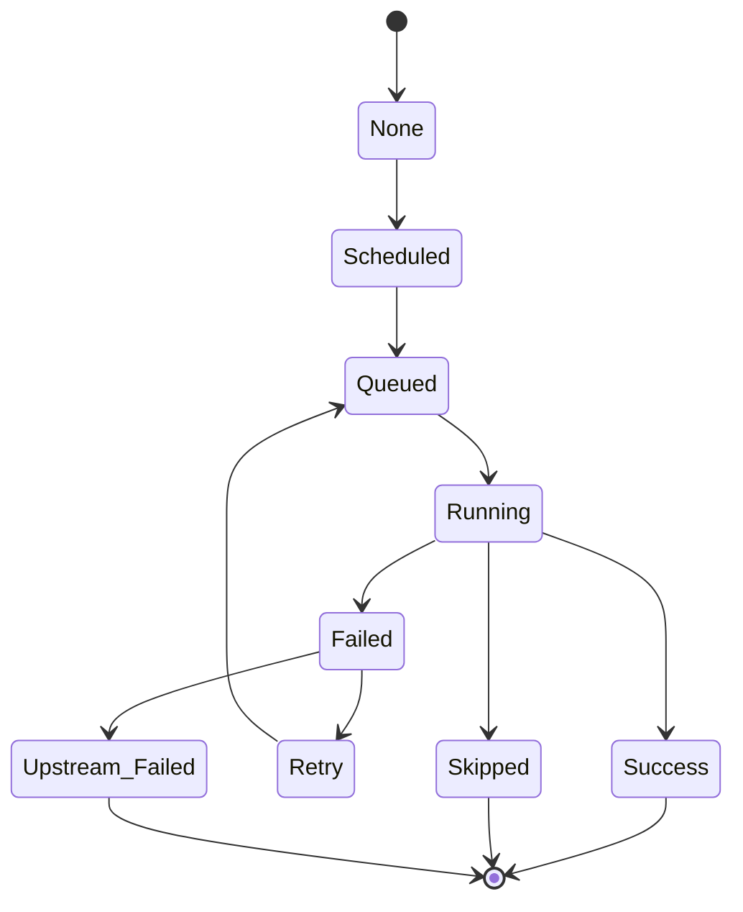

---

## 🏗️ DAG Execution Flow

### Complete Execution Lifecycle

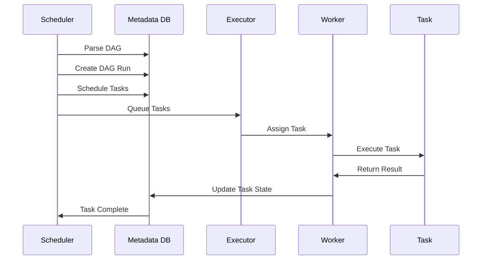

---

## 📦 XCom Data Flow

### Cross-Task Communication

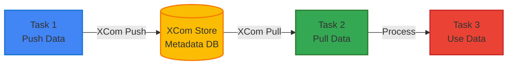

---

## 🔍 Sensor Operation Flow

### File Sensor Waiting Pattern

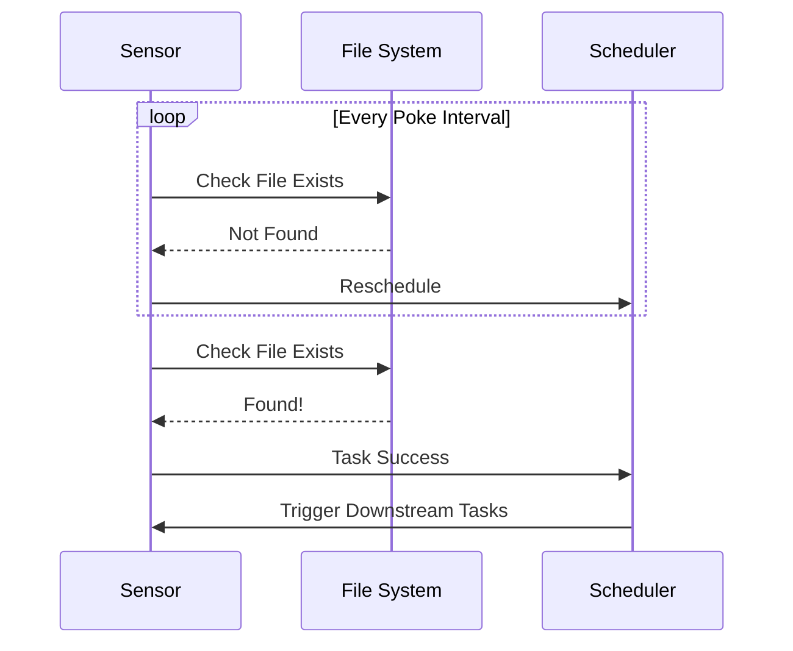

---

## 🎯 Executor Comparison

### Executor Architecture Comparison

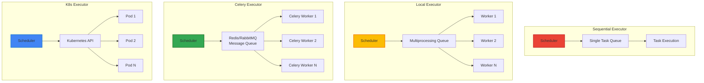

---

## 🔄 Dynamic DAG Generation Flow

### Configuration-Driven DAG Creation

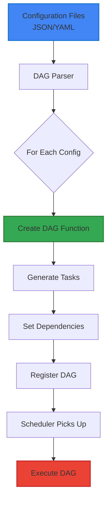

---

## 🏛️ Production Architecture

### Scalable Production Setup

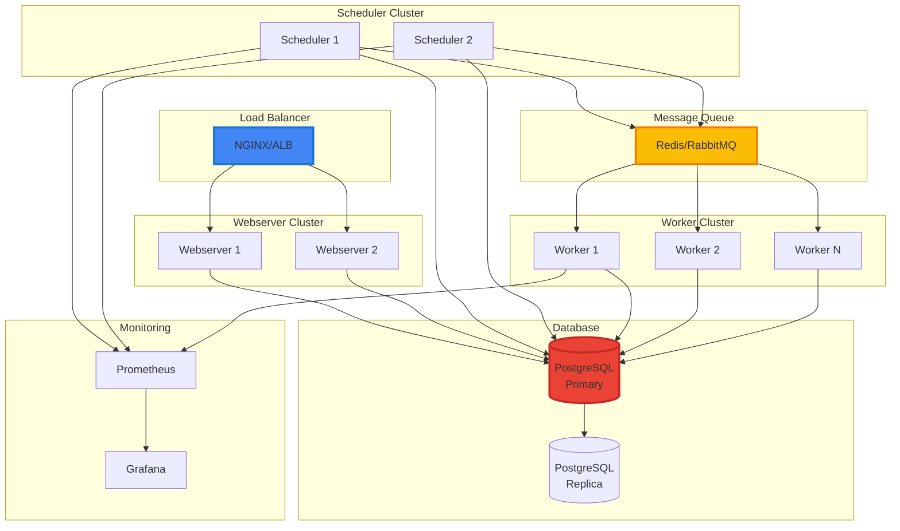

---

## 🔐 Security Architecture

### Authentication and Authorization Flow

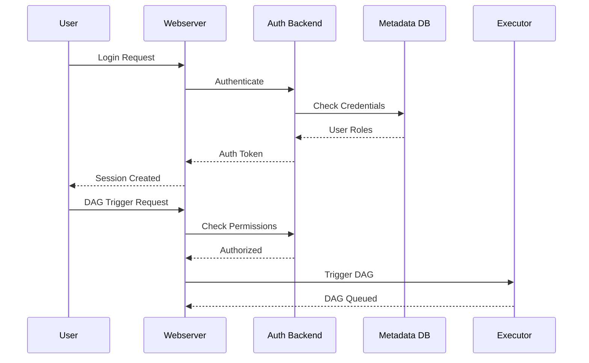

---

## 📊 Monitoring and Observability

### Monitoring Stack

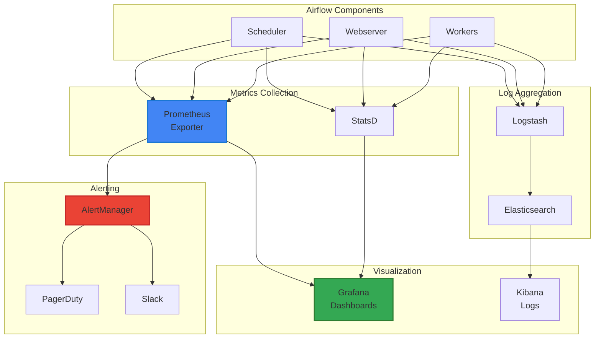

---

## 🔄 Error Handling and Retry Flow

### Task Failure and Retry Pattern

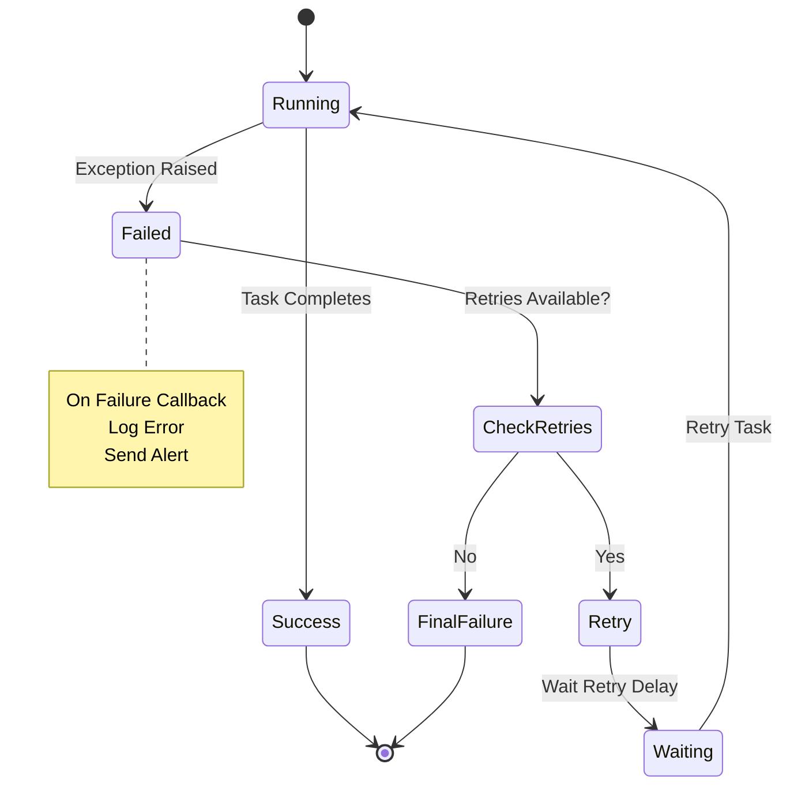

---

## 🎯 Best Practices Visualization

### DAG Design Best Practices

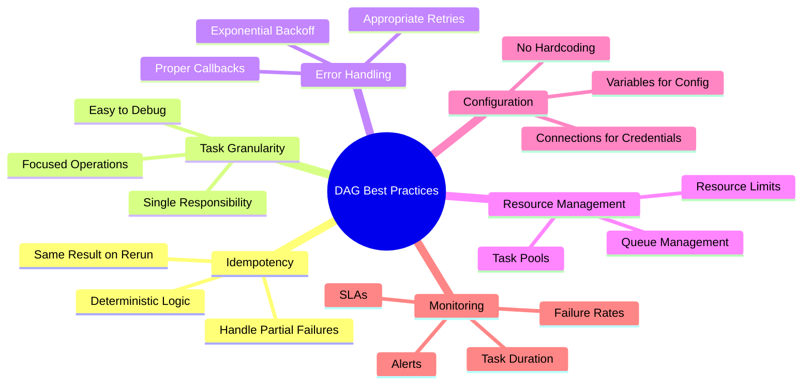

---

## 📈 Performance Optimization Flow

### DAG Parsing Optimization

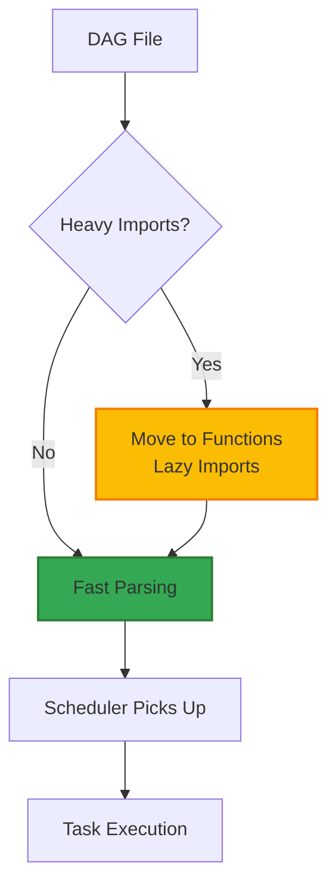

---

## 🔗 Integration Patterns

### Airflow with External Systems

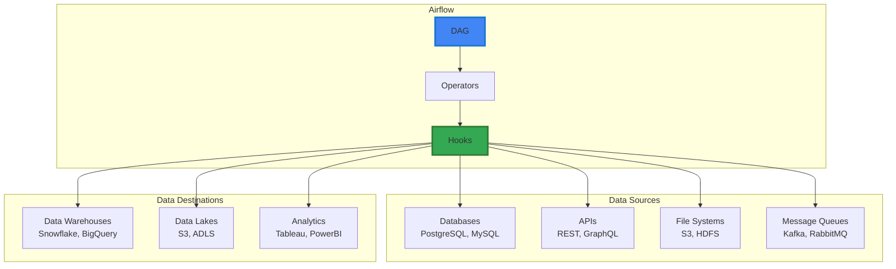

---

## 🎯 Key Visual Takeaways

1. **Architecture = Components** - Scheduler, Webserver, Executor, Workers
2. **DAG Patterns = Workflow Types** - Linear, Parallel, Branching, Event-Driven
3. **State Flow = Lifecycle** - None → Scheduled → Queued → Running → Success/Failed
4. **XComs = Communication** - Cross-task data exchange
5. **Sensors = Event-Driven** - Wait for conditions
6. **Executors = Scalability** - Choose based on scale needs
7. **Monitoring = Observability** - Metrics, logs, alerts
8. **Integration = Ecosystem** - Connect to external systems

---

## 📚 Next Steps

1. ✅ Review these visual diagrams
2. 🏗️ Draw them yourself to reinforce learning
3. 💬 Use in interviews to explain concepts
4. 🔗 Connect to your real projects
5. 📊 Create custom diagrams for your use cases

---

**Visual learning accelerates understanding!** Use these diagrams to master Airflow concepts. 🚀
