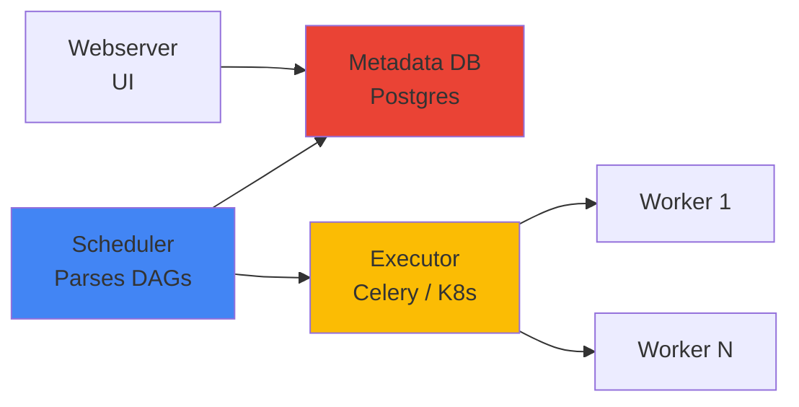

# Apache Airflow -- Cheatsheet

## Architecture (30-second mental model)

Scheduler reads DAG files, writes state to metadata DB, pushes tasks to executor queue. Workers pull and execute. Webserver reads DB for the UI.

## When to use vs alternatives
| Need | Use | Not |
|------|-----|-----|
| Complex multi-step pipelines with retries + scheduling | Airflow | Cron (no dependency graph, no UI) |
| Data-asset-centric lineage and testing built-in | Dagster | Airflow (bolt-on lineage only) |
| Pure Python, minimal infra, fast local dev | Prefect | Airflow (heavier setup) |
| Event-driven real-time triggers (<1s) | Argo / Step Functions | Airflow (scheduler polls, min ~seconds) |
| Managed Airflow with zero ops | MWAA / Cloud Composer | Self-hosted Airflow (ops burden) |

## 5 things you always forget
1. Set `catchup=False` on every production DAG -- otherwise changing `start_date` to the past silently spawns hundreds of backfill runs.
2. XComs are stored in the metadata DB; pushing a DataFrame into XCom will bloat Postgres and eventually crash the scheduler. Pass file paths instead.
3. Sensor `mode='reschedule'` frees the worker slot between pokes; `mode='poke'` holds the slot the entire wait -- reschedule is almost always better.
4. Heavy top-level imports (pandas, numpy) in DAG files slow the scheduler's parsing loop for ALL DAGs -- move imports inside task callables.
5. `trigger_rule='none_failed_min_one_success'` on the join task after a `BranchPythonOperator`, not the default `all_success` -- otherwise the join always skips because skipped branches count as not-success.

## Interview killer answer
> "We migrated 200+ cron jobs to Airflow using dynamic DAG generation from a YAML config registry, which let each team own their pipeline definition without touching Python. The biggest lesson was that DAG parsing time scales with file count and import weight -- we got the scheduler loop from 45 seconds down to 8 by lazy-importing heavy libraries inside callables and splitting our monorepo DAGs folder into provider packages. For the executor, we chose Celery over Kubernetes because our tasks were short-lived (under 2 minutes) and the pod spin-up overhead on K8s was eating 30% of wall-clock time."
