# Apache Spark - Visual Learning Guide

## 🎨 Visual Learning: Architecture, Data Flow, Execution Model

---

## 📊 Spark Architecture

### High-Level Architecture

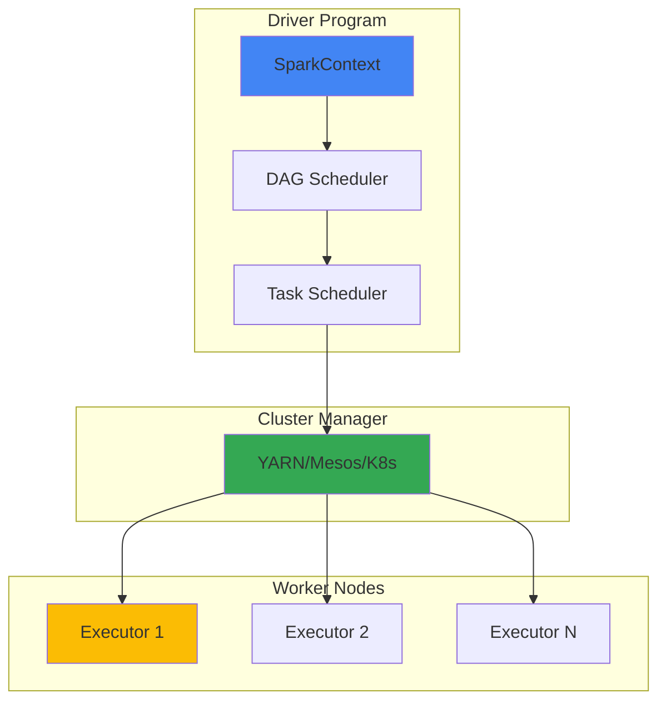

### Spark Components

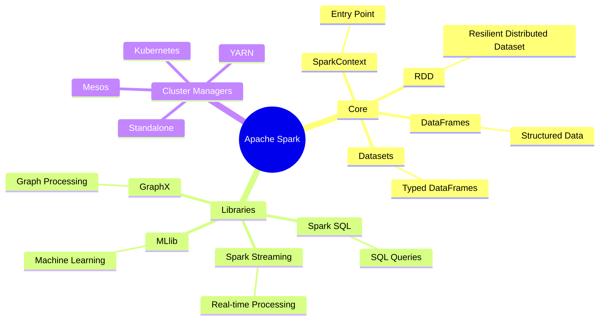

---

## 🔄 Data Processing Flow

### DataFrame Operations Flow

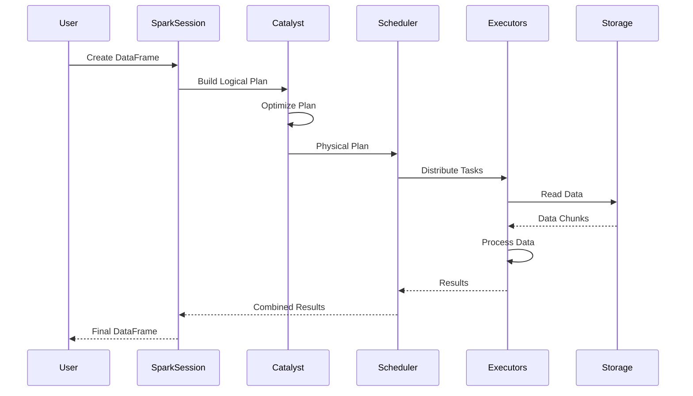

### Lazy Evaluation Flow

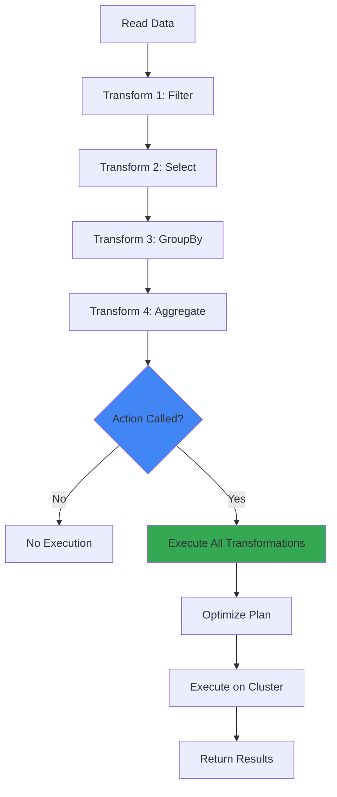

---

## 📦 Data Distribution

### Partitioning Strategy

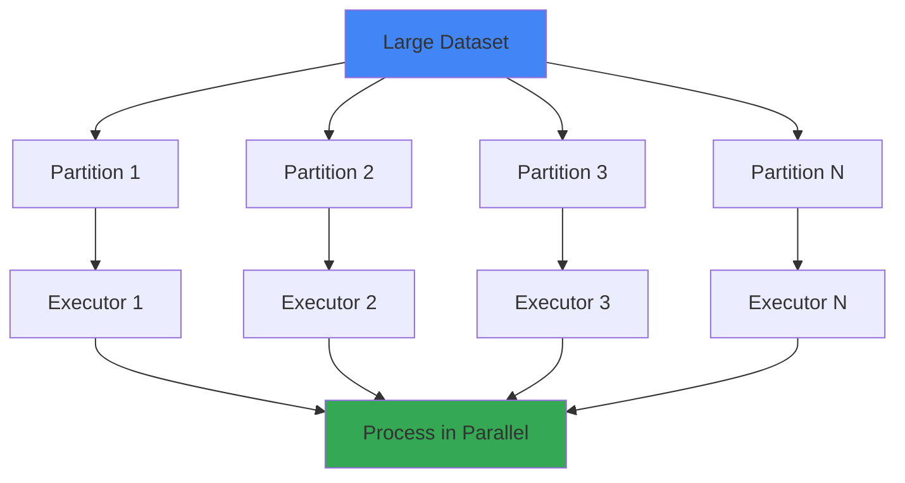

### Shuffle Operation

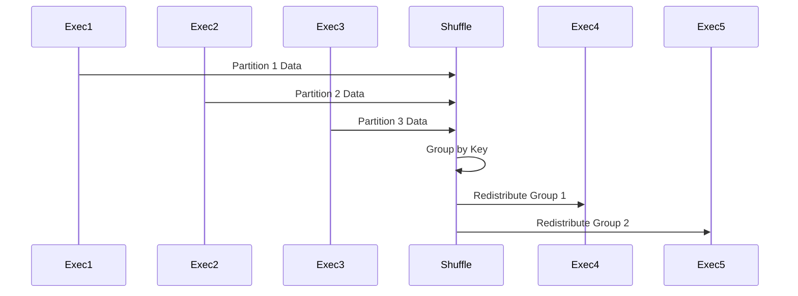

---

## 🔄 Transformation vs Action

### Transformation Flow

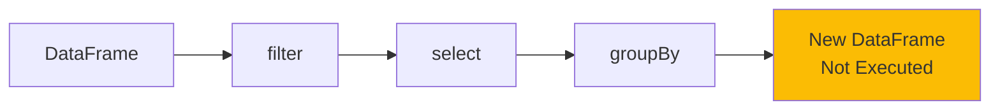

### Action Flow

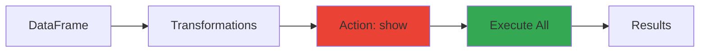

---

## 🚀 Spark Streaming Flow

### Streaming Architecture

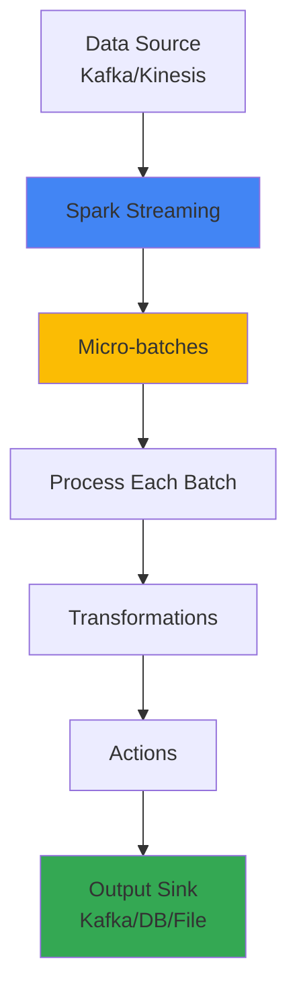

### Micro-batch Processing

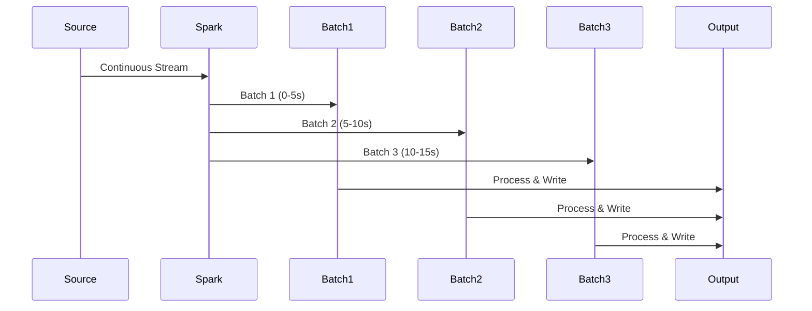

---

## 🔗 Join Operations

### Broadcast Join

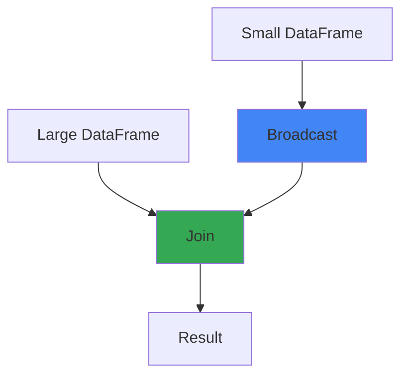

### Shuffle Join

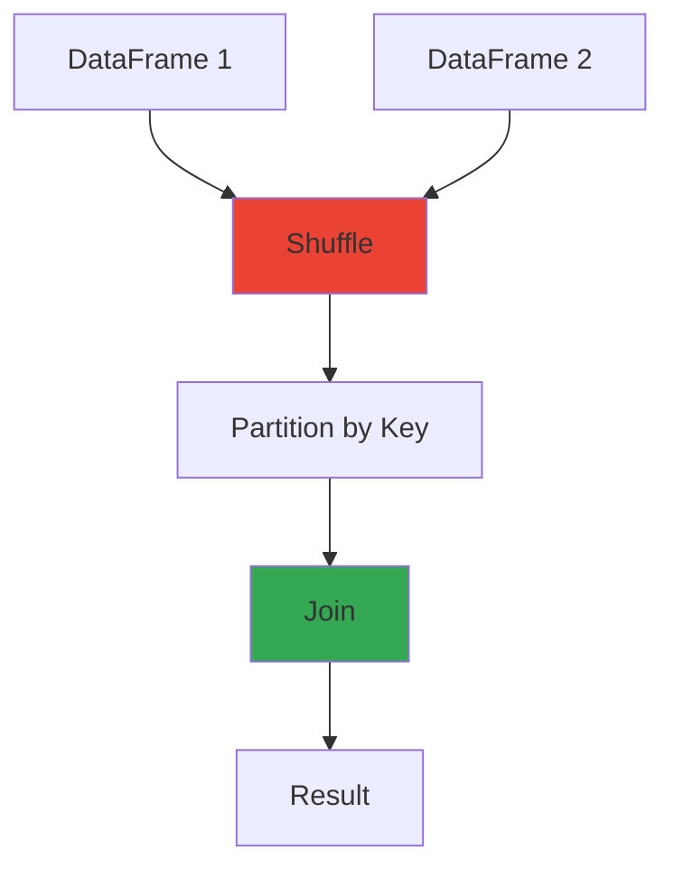

---

## 📊 Performance Optimization

### Caching Strategy

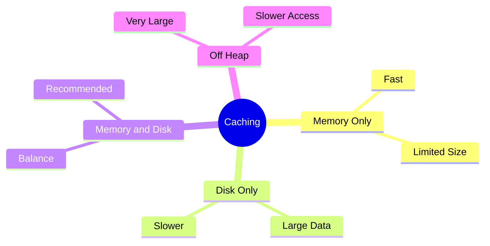

### Partitioning Optimization

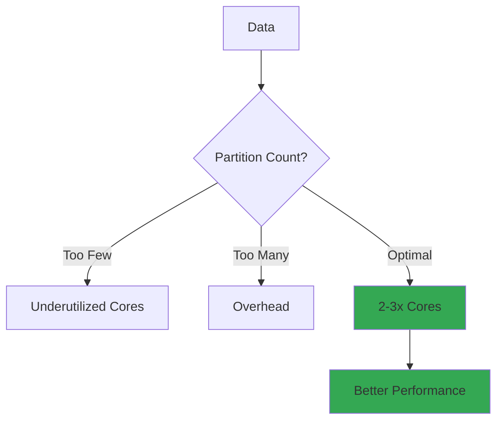

---

## 🎯 Key Visual Takeaways

1. **Driver = Orchestrator**
2. **Executors = Workers**
3. **Partitions = Data Distribution**
4. **Lazy Evaluation = Optimization**
5. **Shuffle = Data Redistribution**

---

## 📚 Next Steps

1. ✅ Review these diagrams
2. 🏗️ Draw them yourself
3. 💬 Use in interviews
4. 🔗 Connect to your projects

---

**Visual learning helps!** Use these to explain Spark in interviews.

