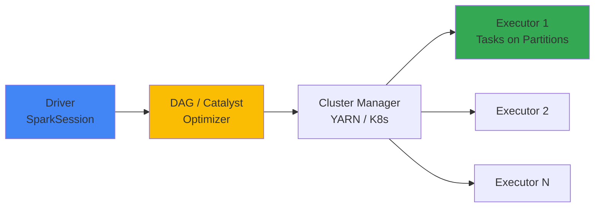

# Apache Spark -- Cheatsheet

## Architecture (30-second mental model)

Driver builds a logical plan, Catalyst optimizes it, cluster manager distributes tasks across executors, each executor works on data partitions in parallel.

## When to use vs alternatives
| Need | Use | Not |
|------|-----|-----|
| Batch ETL on TB+ datasets | Spark (DataFrames) | Pandas (single-node OOM) |
| True event-at-a-time streaming (<10ms) | Flink | Spark Structured Streaming (micro-batch) |
| Simple SQL analytics on cloud warehouse | BigQuery / Snowflake | Spark (operational overhead) |
| Small data transforms (<10GB) | DuckDB / Polars | Spark (cluster overhead not worth it) |
| Unified batch + near-real-time streaming | Spark Structured Streaming | Kafka Streams (no batch story) |

## 5 things you always forget
1. `coalesce(n)` avoids a shuffle when reducing partitions; `repartition(n)` always shuffles -- use coalesce for writes, repartition for skew.
2. `spark.sql.adaptive.enabled=true` (AQE) auto-fixes skew and coalesces partitions at runtime -- turn it on in Spark 3+ and skip manual tuning.
3. UDFs serialize row-by-row to Python and back; use built-in `pyspark.sql.functions` or Pandas UDFs (`@pandas_udf`) for 10-100x speedup.
4. Auto-broadcast threshold is 10MB (`spark.sql.autoBroadcastJoinThreshold`); an explicit `broadcast()` hint overrides it but the DataFrame must still fit in executor memory -- increase the threshold or use the hint, not both.
5. `df.cache()` does nothing until an action triggers it; calling `.cache()` then `.count()` then your real query is the correct pattern, not just `.cache()` alone.

## Interview killer answer
> "We had a 4-hour Spark job that was bottlenecked on a skewed groupBy key -- 5% of keys held 60% of data. Enabling AQE helped, but the real fix was salting the hot keys: we appended a random suffix, aggregated at the salted level, then aggregated again to remove the salt. That brought the job from 4 hours to 25 minutes. We also switched from Python UDFs to Pandas UDFs for feature engineering, which alone cut that stage from 40 minutes to 3 minutes because it eliminated row-by-row serialization."
