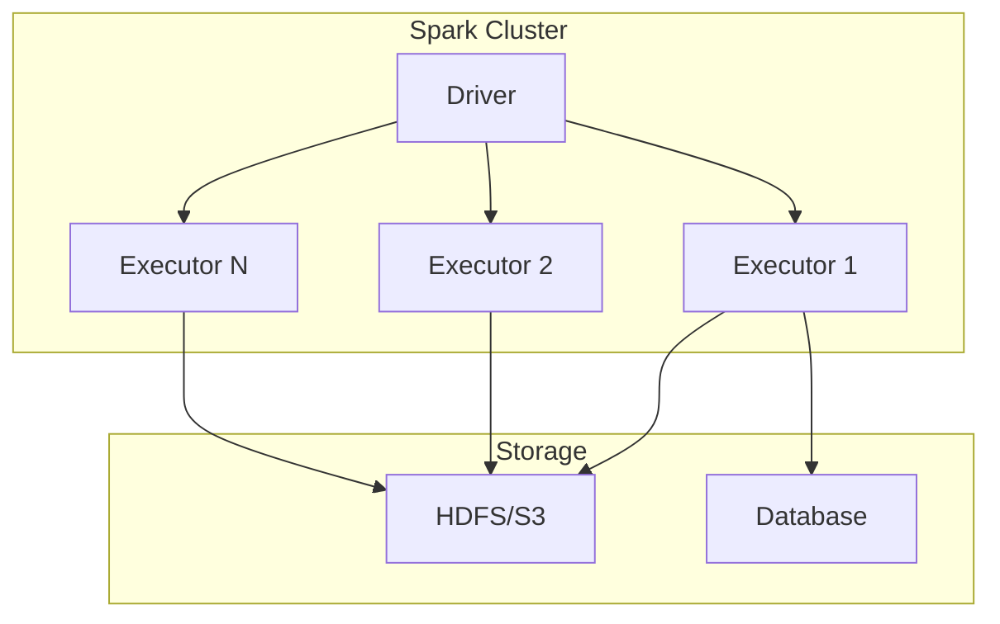

# Apache Spark Guide – Basic → Architect

## Level 1 – Launch & Basics

### 1. **Quick Setup**
```python
from pyspark.sql import SparkSession

# Create Spark session
spark = SparkSession.builder \
    .appName("MyApp") \
    .config("spark.sql.warehouse.dir", "/tmp/spark-warehouse") \
    .getOrCreate()

# Read data
df = spark.read.csv("data.csv", header=True, inferSchema=True)

# Transform
df_filtered = df.filter(df.age > 25)

# Show results
df_filtered.show()
```

### 2. **Basic Operations**
```python
# Select columns
df.select("name", "age").show()

# Filter
df.filter(df.age > 30).show()

# Group by
df.groupBy("department").agg({"salary": "avg"}).show()

# Join
df1.join(df2, df1.id == df2.id, "inner").show()
```

### 3. **Data Sources**
```python
# CSV
df = spark.read.csv("data.csv", header=True, inferSchema=True)

# JSON
df = spark.read.json("data.json")

# Parquet
df = spark.read.parquet("data.parquet")

# JDBC
df = spark.read.jdbc(
    url="jdbc:postgresql://localhost/db",
    table="users",
    properties={"user": "user", "password": "pass"}
)
```

## Level 2 – Production Patterns

### Performance Optimization
```python
# Broadcast small tables
from pyspark.sql.functions import broadcast

small_df = spark.read.parquet("small_table.parquet")
large_df = spark.read.parquet("large_table.parquet")

result = large_df.join(broadcast(small_df), "id")

# Partitioning
df.write.partitionBy("date", "region").parquet("output/")

# Caching
df.cache()  # or df.persist(StorageLevel.MEMORY_AND_DISK)
```

### Window Functions
```python
from pyspark.sql.window import Window
from pyspark.sql.functions import row_number, rank, lag

window_spec = Window.partitionBy("department").orderBy("salary")

df.withColumn("rank", rank().over(window_spec)) \
  .withColumn("prev_salary", lag("salary", 1).over(window_spec)) \
  .show()
```

### UDFs
```python
from pyspark.sql.functions import udf
from pyspark.sql.types import StringType

def categorize_age(age):
    if age < 30:
        return "Young"
    elif age < 50:
        return "Middle"
    else:
        return "Senior"

categorize_udf = udf(categorize_age, StringType())
df.withColumn("age_category", categorize_udf(df.age)).show()
```

### Structured Streaming
```python
# Read stream
stream_df = spark.readStream \
    .format("kafka") \
    .option("kafka.bootstrap.servers", "localhost:9092") \
    .option("subscribe", "topic") \
    .load()

# Process
result = stream_df.selectExpr("CAST(key AS STRING)", "CAST(value AS STRING)")

# Write stream
query = result.writeStream \
    .format("parquet") \
    .option("path", "output/") \
    .option("checkpointLocation", "checkpoint/") \
    .start()
```

## Level 3 – Architect Playbook

### Delta Lake Integration
```python
# Read Delta table
df = spark.read.format("delta").load("delta_table_path")

# Write Delta table
df.write.format("delta") \
    .mode("overwrite") \
    .option("mergeSchema", "true") \
    .save("delta_table_path")

# Time travel
df = spark.read.format("delta") \
    .option("versionAsOf", 0) \
    .load("delta_table_path")
```

### Distributed Training
```python
from pyspark.ml import Pipeline
from pyspark.ml.classification import RandomForestClassifier
from pyspark.ml.feature import VectorAssembler

# Feature engineering
assembler = VectorAssembler(
    inputCols=["feature1", "feature2"],
    outputCol="features"
)

# Model
rf = RandomForestClassifier(
    labelCol="label",
    featuresCol="features",
    numTrees=100
)

# Pipeline
pipeline = Pipeline(stages=[assembler, rf])
model = pipeline.fit(train_df)
predictions = model.transform(test_df)
```

### Cluster Configuration
```python
spark = SparkSession.builder \
    .appName("ProductionApp") \
    .config("spark.executor.memory", "4g") \
    .config("spark.executor.cores", "2") \
    .config("spark.sql.shuffle.partitions", "200") \
    .config("spark.serializer", "org.apache.spark.serializer.KryoSerializer") \
    .getOrCreate()
```

## Ops Cheat Sheet

| Task | Command | Notes |
| --- | --- | --- |
| Submit job | `spark-submit app.py` | Submit Spark application |
| Monitor | Spark UI at `http://localhost:4040` | View job progress |
| Checkpoint | `df.checkpoint()` | Save intermediate results |
| Coalesce | `df.coalesce(1)` | Reduce partitions |
| Repartition | `df.repartition(100)` | Increase partitions |
| Explain | `df.explain()` | View execution plan |
| Cache | `df.cache()` | Cache DataFrame |

## Architecture Patterns



## Checklist Before Production

- [ ] Configure appropriate executor memory and cores
- [ ] Set spark.sql.shuffle.partitions based on data size
- [ ] Use broadcast joins for small tables
- [ ] Implement proper partitioning strategy
- [ ] Use Delta Lake for ACID transactions
- [ ] Set up checkpointing for streaming jobs
- [ ] Configure monitoring and alerting
- [ ] Optimize serialization (Kryo)
- [ ] Use appropriate storage formats (Parquet)
- [ ] Implement proper error handling
