# Azure Data Services - Visual Learning Guide

## 🎨 Visual Learning: Architecture, Data Flows, Service Integration

---

## 📊 Azure Data Architecture

### High-Level Architecture

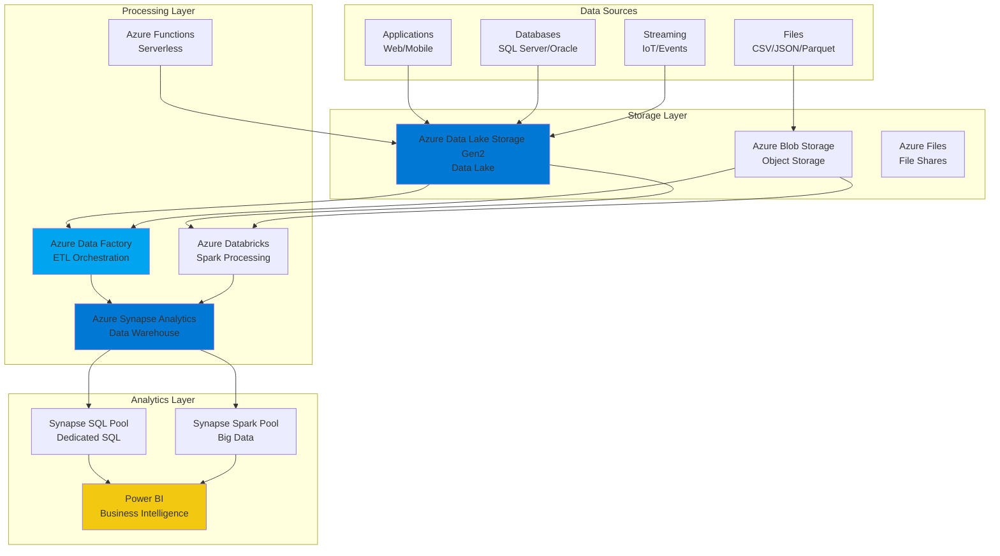

### Azure Data Platform Ecosystem

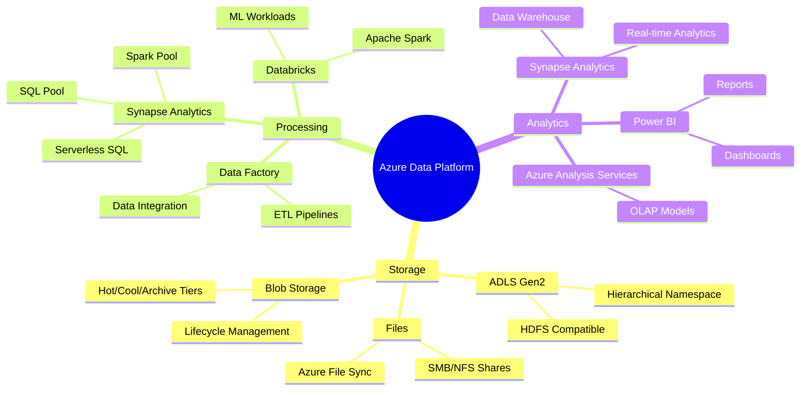

---

## 🔄 Data Pipeline Flow

### ADF Pipeline Architecture

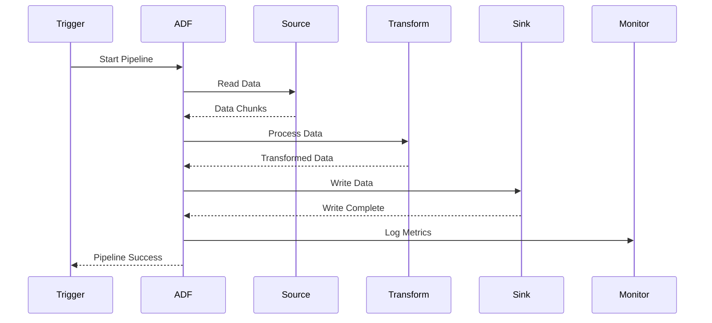

### ADF Pipeline Flow

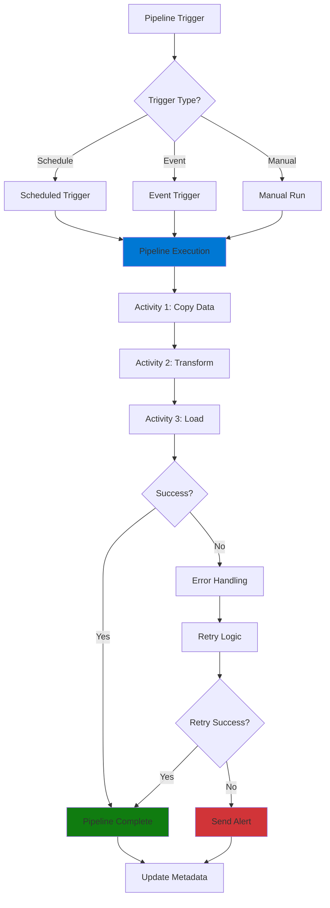

### Data Factory Components

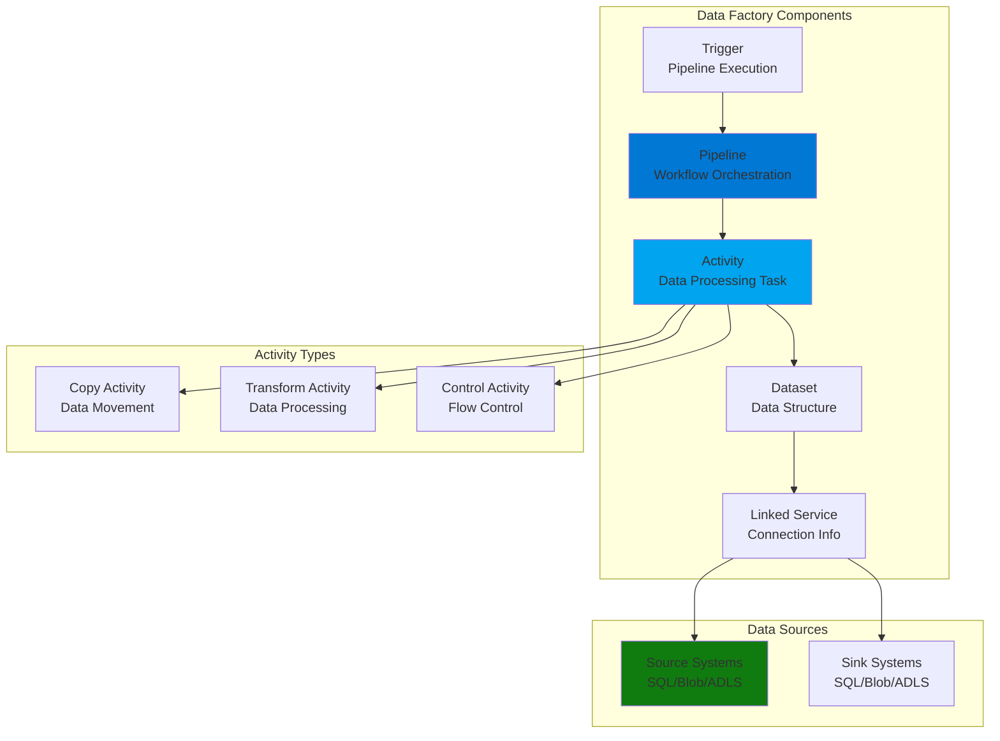

---

## 🏗️ Azure Synapse Analytics Architecture

### Synapse Workspace Architecture

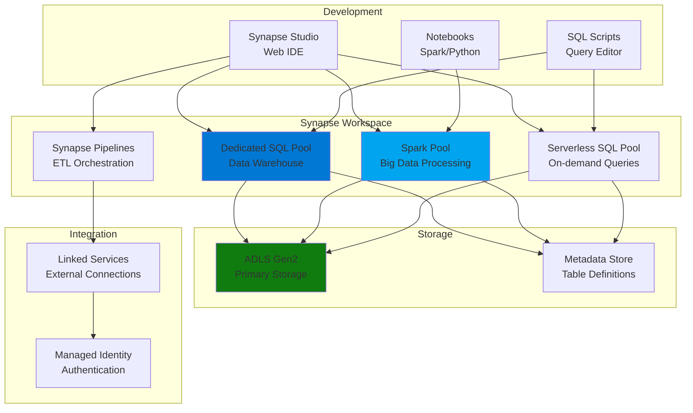

### Dedicated SQL Pool Architecture

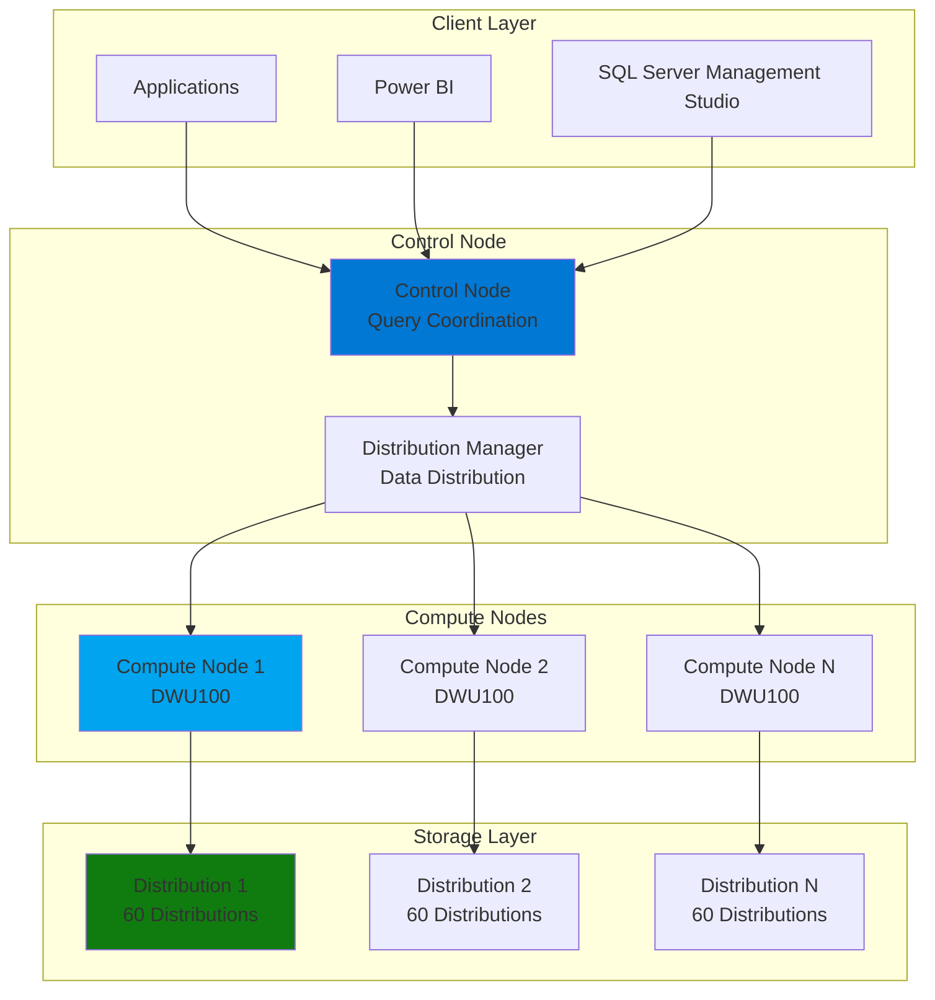

### Synapse Spark Pool Architecture

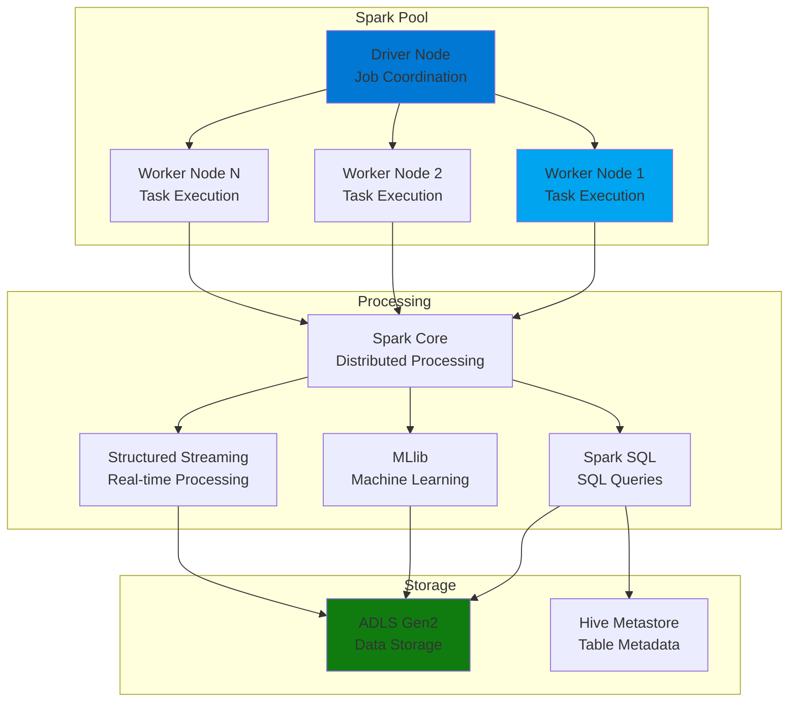

---

## 🔄 Data Ingestion Patterns

### Batch Ingestion Flow

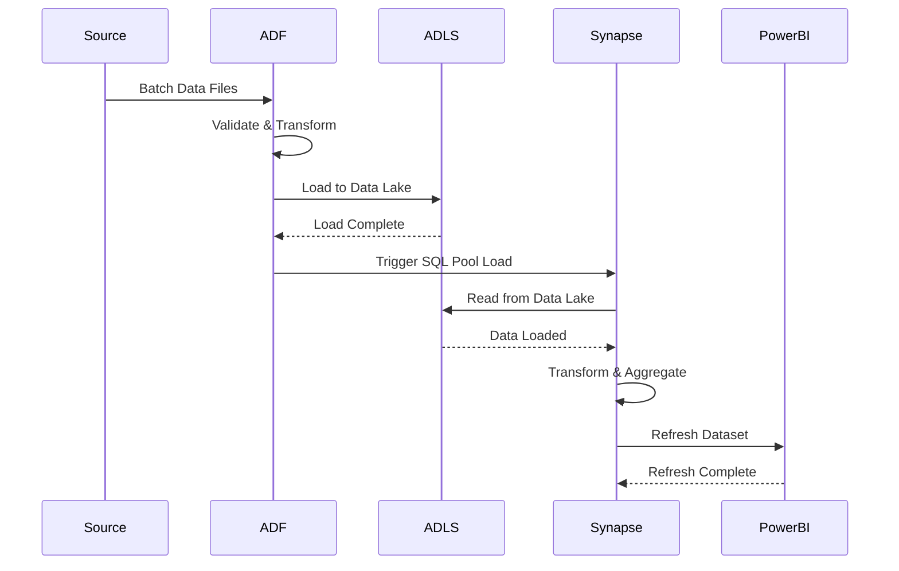

### Streaming Ingestion Flow

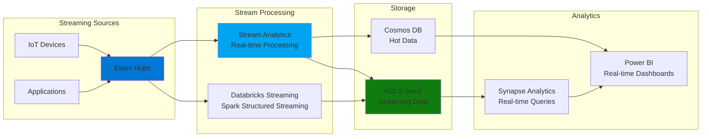

---

## 🔐 Security Architecture

### Azure Data Security Model

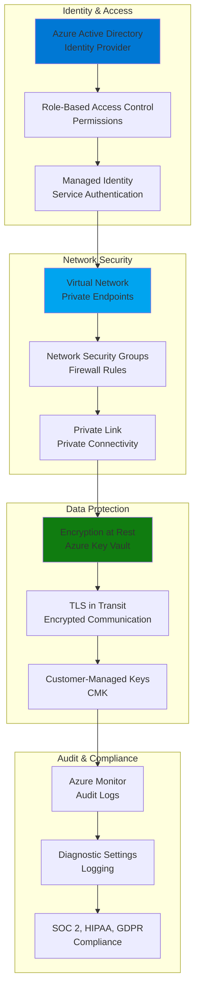

### Data Access Flow

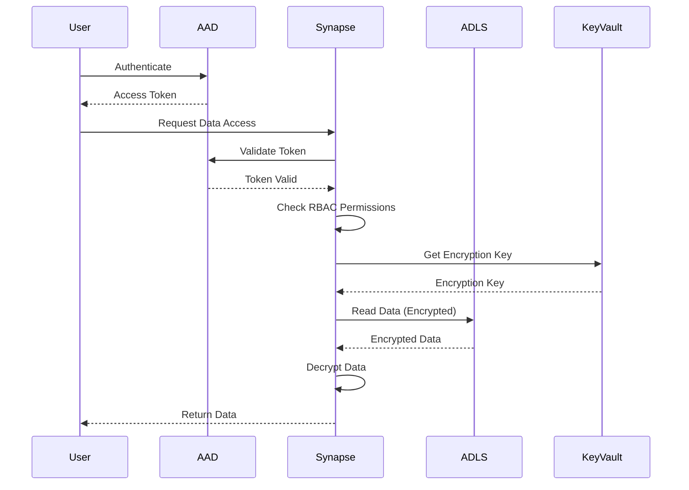

---

## 📊 Data Lake Architecture

### ADLS Gen2 Architecture

```mermaid
graph TB
    subgraph "ADLS Gen2 Account"
        ACCOUNT[Storage Account<br/>Hierarchical Namespace Enabled]
    end
    
    subgraph "File System"
        FS1[File System 1<br/>Container]
        FS2[File System 2<br/>Container]
        FS3[File System N<br/>Container]
    end
    
    subgraph "Directory Structure"
        DIR1[/raw<br/>Raw Data]
        DIR2[/processed<br/>Processed Data]
        DIR3[/curated<br/>Curated Data]
    end
    
    subgraph "Data Zones"
        BRONZE[Bronze Zone<br/>Raw Data]
        SILVER[Silver Zone<br/>Cleaned Data]
        GOLD[Gold Zone<br/>Analytics Ready]
    end
    
    ACCOUNT --> FS1
    ACCOUNT --> FS2
    ACCOUNT --> FS3
    
    FS1 --> DIR1
    FS1 --> DIR2
    FS1 --> DIR3
    
    DIR1 --> BRONZE
    DIR2 --> SILVER
    DIR3 --> GOLD
    
    style ACCOUNT fill:#0078d4
    style FS1 fill:#00a4ef
    style BRONZE fill:#107c10
    style SILVER fill:#ffb900
    style GOLD fill:#d13438
```

### Data Lake Zones Flow

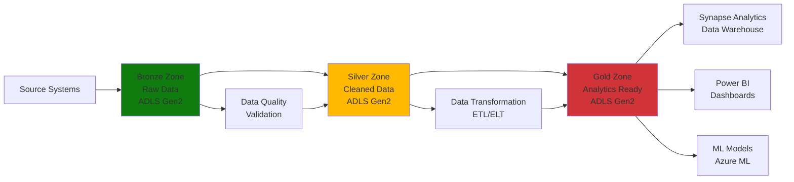

---

## 🔄 ETL/ELT Patterns

### ETL Pattern (Traditional)

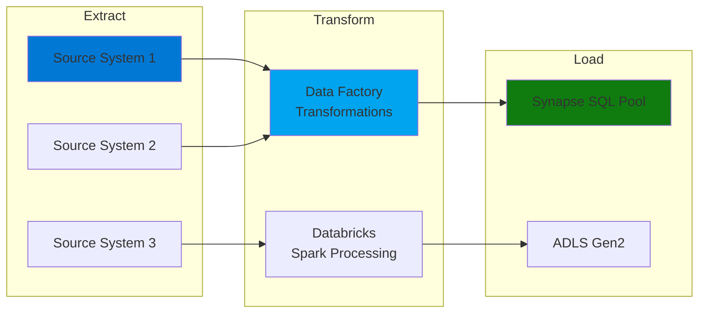

### ELT Pattern (Modern)

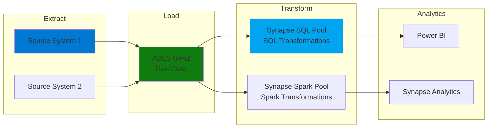

---

## 📈 Performance Optimization

### Synapse SQL Pool Optimization

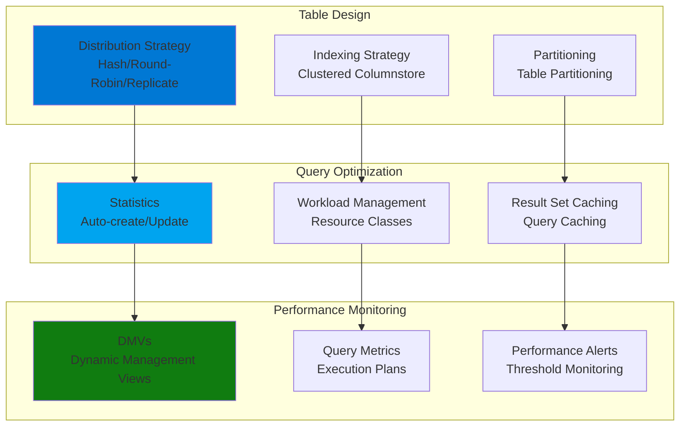

### Cost Optimization Strategies

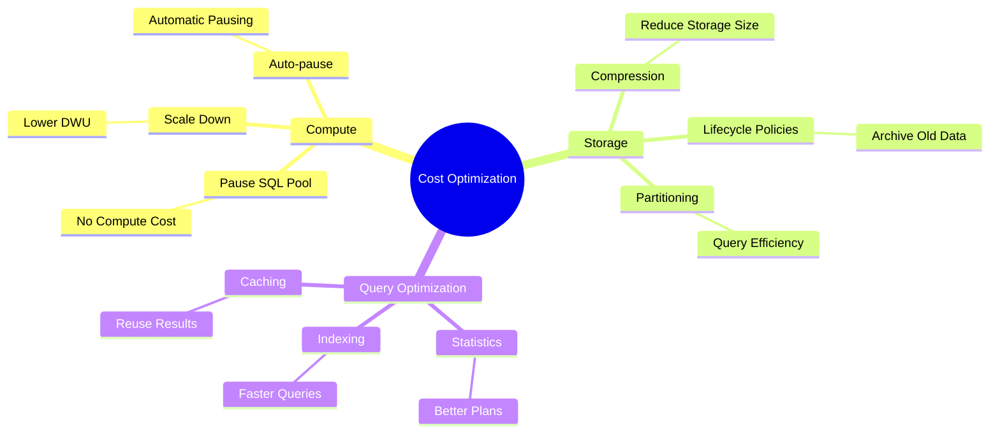

---

## 🔗 Integration Patterns

### Azure Data Integration Architecture

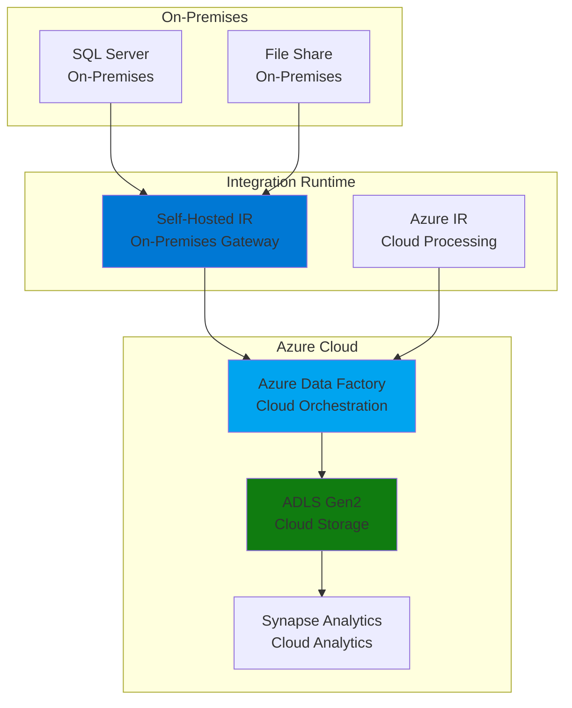

### Multi-Cloud Data Architecture

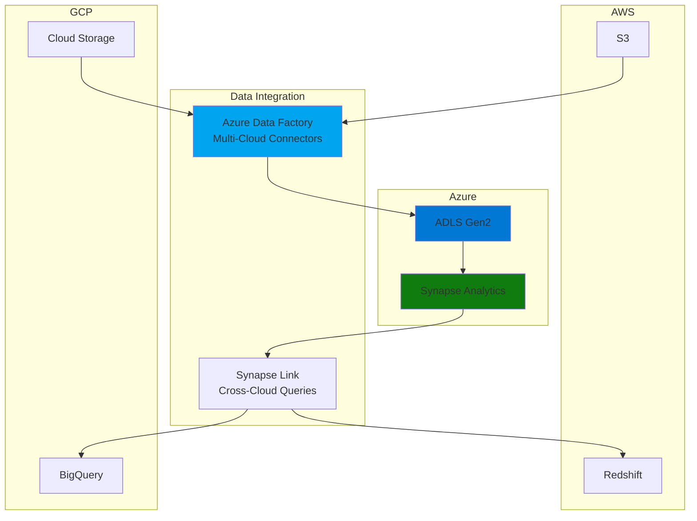

---

## 🎯 Key Visual Takeaways

1. **ADLS Gen2 = Data Lake Foundation** - Hierarchical namespace, HDFS compatible
2. **Azure Data Factory = ETL Orchestration** - Pipeline-based data integration
3. **Synapse Analytics = Unified Analytics** - SQL Pool, Spark Pool, Serverless SQL
4. **Power BI = Business Intelligence** - Dashboards and reports
5. **Security = Multi-layered** - AAD, RBAC, Encryption, Private Endpoints
6. **Data Zones = Bronze/Silver/Gold** - Medallion architecture pattern
7. **ELT Pattern = Modern Approach** - Load first, transform in analytics engine
8. **Cost Optimization = Pause/Scale** - Pay only for what you use

---

## 📚 Next Steps

1. ✅ Review these diagrams
2. 🏗️ Draw them yourself (practice)
3. 💬 Use in interviews (explain architecture)
4. 🔗 Connect to your POCs (build pipelines)

---

**Visual learning helps!** Use these diagrams to explain Azure Data Services architecture, data flows, and integration patterns in interviews.
